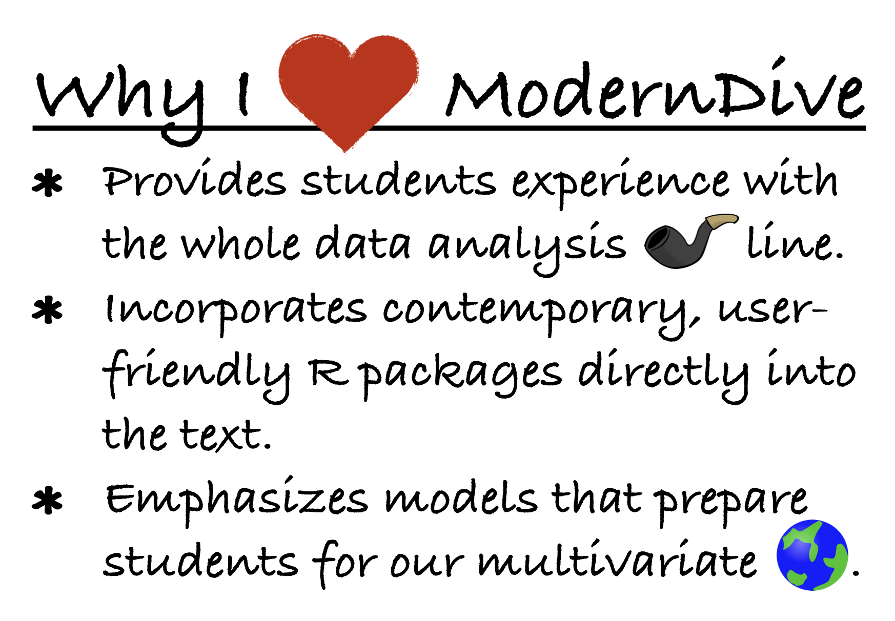

```{r, include=FALSE}
source("_common.R")
```

통계학과 데이터 과학 교육에 있어서 지금은 매우 흥미로운 시기입니다. (저는 이 문장이 여러분이 이 서문을 2020년에 읽든 2050년에 읽든 계속 사실일 것이라고 예측합니다.) 하지만(항상 '하지만'이 있죠?), 통계학 교육자로서 모든 새로운 통계적, 기술적, 그리고 교육학적 혁신을 따라가는 것은 때때로 다소 벅차게 느껴질 수 있습니다. 저는 끊임없이 "내가 학생들에게 올바른 내용을, 관련 소프트웨어를 사용하여, 가장 효과적인 방식으로 가르치고 있는가?"라고 자문하곤 합니다. 우리 모두를 망망대해에서 길을 잃은 기분이 들게 하기 전에, 제가 *ModernDive*에서 발견한 훌륭한 구명보트를 소개하고자 합니다. 수많은 기초 통계학 교재들 중에서 *ModernDive*는 제 리스트의 맨 위에 떠오르는데, 그 이유를 말씀드리겠습니다. (여기서 제가 사용하는 *ModernDive*는 책의 축약된 제목을 의미합니다. 이는 Ismay와 Kim 박사가 *ModernDive*의 표지를 위해 만든 [멋진 헥스 스티커](https://moderndive.com/images/logos/hex_blue_text.png)와도 잘 어울립니다.)

```{r, fig.align="center", echo=FALSE, out.width="70%"}

```

제가 *ModernDive*에서 가장 좋아하는 점을 하나만 꼽으라면, 학생들이 전체 데이터 분석 파이프라인(그림 \@ref(fig:pipeline-figure) 참조)을 경험할 수 있다는 것입니다. 특히, *ModernDive*는 학생들에게 데이터를 가공(wrangle)하는 방법을 가르치는 몇 안 되는 기초 통계학 교재 중 하나입니다. 데이터 정리가 모델 구축만큼 멋져 보이지는 않을 수 있지만, 종종 필수적인 선행 단계입니다! 세상은 지저분한 데이터로 가득 차 있으며, *ModernDive*는 학생들이 `dplyr` 패키지를 통해 데이터를 변환할 수 있는 능력을 갖추게 해줍니다.

`dplyr` 이야기가 나와서 말인데, *ModernDive*를 공부하는 학생들은 R 패키지 모음인 `tidyverse`를 접하게 됩니다. 공통된 구조로 설계된 `tidyverse` 함수들은 배우기 쉽고 사용하기 간편하도록 작성되었습니다. 그리고 대부분의 기초 통계학 학생들이 프로그래밍 초보자이기 때문에, *ModernDive*는 제시하는 각 신규 함수를 학생들에게 신중하게 안내하며, 장 전체에 걸쳐 분산된 많은 *학습 확인(Learning checks)*을 통해 빈번한 강화 학습을 제공합니다.

전반적으로, *ModernDive*는 주제 배치에 있어서 현명한 선택을 했습니다. 데이터 시각화부터 시작하여, *ModernDive*는 학생들이 초기에 `ggplot2` 그래프를 작성하게 하고, 책 전체에 걸쳐 중요한 개념들을 그래픽으로 계속 강화합니다. 데이터 가공과 데이터 임포트를 거친 후에는 모델링이 중요한 역할을 하며, 회귀 모델 구축에 두 장을 할애하고 이후 장에서 회귀 분석을 위한 추론을 다룹니다. 마지막으로, 통계적 추론은 `infer` 패키지를 통한 계산과 함께 컴퓨터 중심의 관점에서 제시됩니다.

저는 Ismay와 Kim 박사를 [2017년 미국 통계 교육 컨퍼런스(USCOTS) 워크숍](https://www.causeweb.org/cause/uscots/uscots17/workshop/3)에서 처음 만났습니다. 그들은 참가자들에게 데이터를 우선순위에 두고, 수학 대신 컴퓨터를 통계적 추론의 엔진으로 사용하도록 독려했습니다. 그 경험은 제가 제 기초 통계학 과정을 현대화하는 데 도움이 되었고, 정말 앞서가는 두 명의 통계학 및 데이터 과학 교육자를 알게 해주었습니다. *ModernDive*가 이토록 훌륭하고 시의적절한 교재로 발전하고 성장하는 것을 보는 것은 매우 즐거운 일이었습니다. 여러분도 이제 이 세계에 뛰어들기로 결정하셨기를 바랍니다!

```{r echo=FALSE, results="asis"}
if (knitr::is_latex_output()) {
  cat("\\begin{flushright}
      \\textit{Kelly S.\ McConville, Harvard University}
      \\end{flushright}")
} else {
  cat("<br>*Kelly S. McConville, Harvard University*</br>")
}
```
