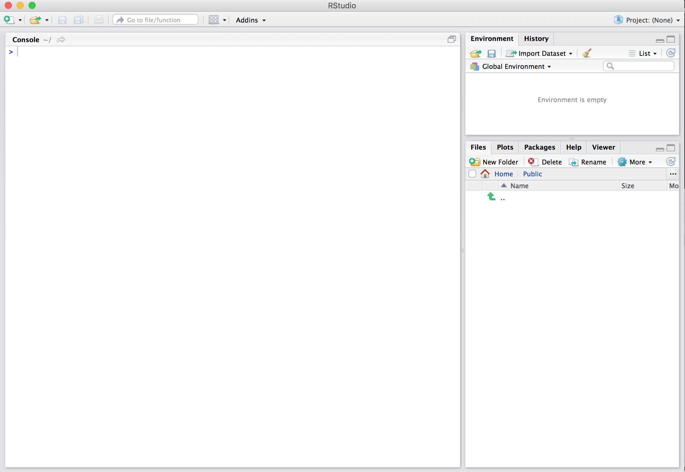
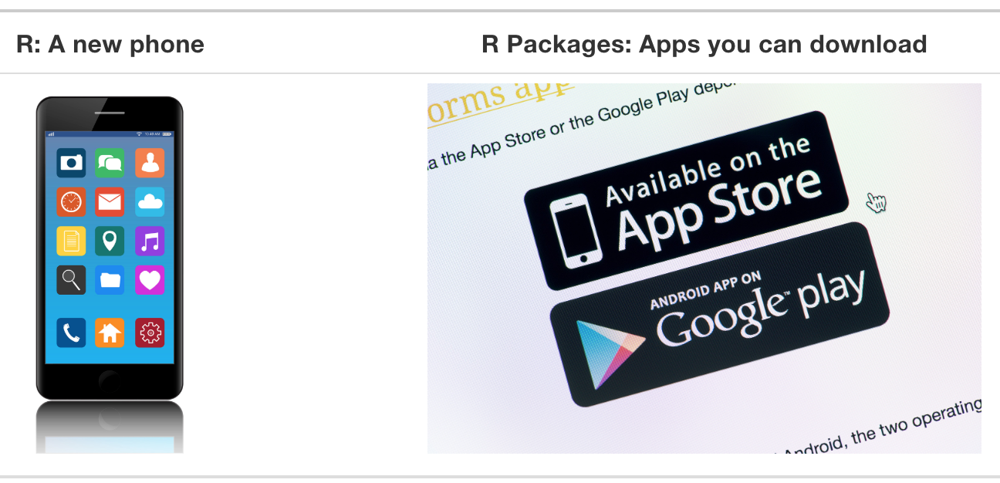
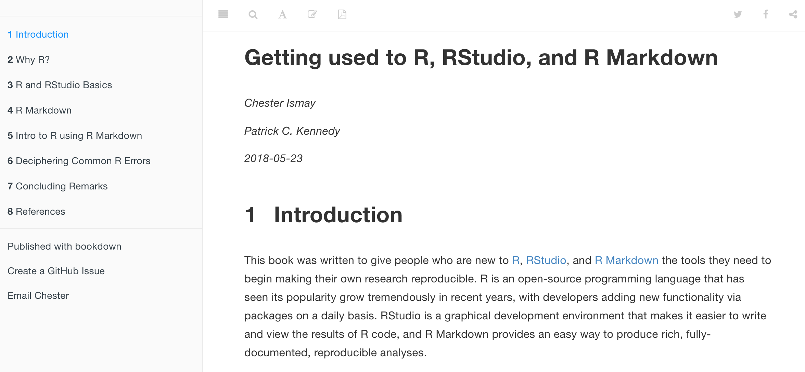
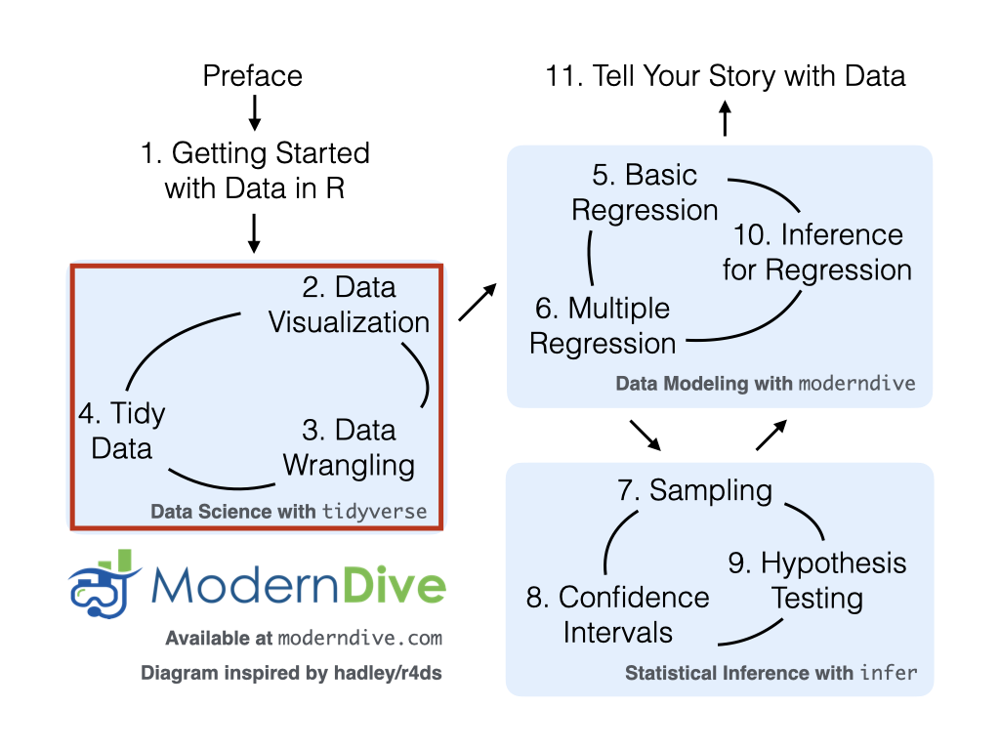

```{r, include=FALSE}
source("_common.R")
```

# R 데이터 시작하기 {#sec-getting-started}

```{r setup_getting_started, include=FALSE, purl=FALSE}
# 학습 확인 번호를 정의하는 데 사용:
chap <- 1
lc <- 0

# R 코드 청크 기본 설정:
knitr::opts_chunk$set(
  echo = TRUE,
  eval = TRUE,
  warning = FALSE,
  message = TRUE,
  tidy = FALSE,
  purl = TRUE,
  out.width = "\\textwidth",
  fig.height = 4,
  fig.align = "center"
)

options(scipen = 99, digits = 3)

# 재현 가능한 의사 난수 생성을 위해 난수 생성기 시드 값을 설정합니다.
set.seed(76)
```

```{r message=FALSE, echo=FALSE, purl=FALSE}
# 내부적으로 필요하지만 텍스트에는 필요하지 않은 패키지들.
library(scales)
```

R에서 데이터 탐색을 시작하기 전에 먼저 이해해야 할 몇 가지 핵심 개념이 있습니다:

1. R과 RStudio는 무엇인가?
2. R로 어떻게 코딩하는가?
3. R 패키지란 무엇인가?

이어지는 @sec-r-rstudio 절-@sec-packages 절에서 이러한 개념들을 소개할 것입니다. 이러한 개념들에 이미 어느 정도 익숙하다면 @sec-nycflights13 절로 건너뛰어도 좋습니다. 그곳에서는 우리의 첫 데이터셋인 2013년 뉴욕시(NYC)의 세 주요 공항에서 출발하는 모든 국내선 항공편 데이터를 소개할 것입니다. 이 데이터셋은 이 책의 남은 부분 중 많은 곳에서 심도 있게 탐색하게 될 데이터입니다.


## R과 RStudio는 무엇인가? {#sec-r-rstudio}

이 책 전반에 걸쳐 여러분이 RStudio를 통해 R을 사용하고 있다고 가정할 것입니다. 처음 사용하는 사람들은 종종 이 둘을 혼동하곤 합니다. 가장 간단하게 표현하자면, 그림 @fig-R-vs-RStudio-1 에서 묘사된 것처럼 R은 자동차의 엔진\index{R}과 같고, RStudio는 자동차의 대시보드\index{RStudio}와 같습니다.

<!--
R: 엔진            |  RStudio: 대시보드 
:-------------------------:|:-------------------------:
{ height=2.5in }  |  { height=2.5in }
-->

```{r R-vs-RStudio-1, echo=FALSE, fig.cap="R과 RStudio의 차이에 대한 비유.", out.width="95%", purl=FALSE}
knitr::include_graphics("images/shutterstock/R_vs_RStudio_1.png")
```

더 정확하게 말하면, R은 계산을 실행하는 프로그래밍 언어이고, RStudio는 많은 편리한 기능과 도구를 추가하여 인터페이스를 제공하는 *통합 개발 환경(IDE)*입니다. 속도계, 백미러, 내비게이션 시스템을 갖추는 것이 운전을 훨씬 쉽게 만드는 것과 마찬가지로, RStudio의 인터페이스를 사용하는 것은 R을 훨씬 더 쉽게 사용할 수 있게 해줍니다. 


### R과 RStudio 설치하기 {#sec-installing}

> **RStudio Server 또는 RStudio Cloud에 관한 참고 사항**: 강사가 RStudio Server 또는 RStudio Cloud에 대한 링크와 액세스 권한을 제공했다면 이 섹션은 건너뛰어도 됩니다. 하지만 RStudio Server/Cloud에서 몇 달 동안 작업한 후에는 자신의 컴퓨터에 이 소프트웨어를 설치하기 위해 이 지침으로 돌아오는 것을 권장합니다.

먼저 컴퓨터에 R과 RStudio(Desktop 버전)를 모두 다운로드하여 설치해야 합니다. R을 먼저 설치한 다음 RStudio를 설치하는 것이 중요합니다.

1. **이것을 먼저 하세요:** <https://cloud.r-project.org/>로 가서 R을 다운로드하고 설치하세요. \index{R!installation}
    + Windows 사용자라면: "Download R for Windows"를 클릭한 다음, "base"를 클릭하고 다운로드 링크를 클릭하세요. 
    + macOS 사용자라면: "Download R for macOS"를 클릭한 다음, "Latest release:" 아래에서 R-X.X.X.pkg를 클릭하세요(여기서 R-X.X.X는 버전 번호입니다). 예를 들어, 2019년 11월 25일 기준으로 R의 최신 버전은 R-3.6.1이었습니다.
    + Linux 사용자라면: "Download R for Linux"를 클릭하고 사용 중인 배포판을 선택하여 설치에 대한 자세한 정보를 확인하세요.
2. **이것을 두 번째로 하세요:** <https://www.rstudio.com/products/rstudio/download/>에서 RStudio를 다운로드하여 설치하세요.
    + 페이지 아래쪽의 "Installers for Supported Platforms"까지 스크롤을 내립니다.
    + 컴퓨터의 운영 체제에 해당하는 다운로드 링크를 클릭하세요. \index{RStudio!installation}


### RStudio를 통해 R 사용하기

앞서 언급한 자동차 비유를 떠올려 보세요. 우리가 엔진과 직접 상호작용하며 운전하는 것이 아니라 자동차 대시보드의 요소들과 상호작용하며 운전하는 것과 마찬가지로, 우리는 R을 직접 사용하는 것이 아니라 RStudio의 인터페이스를 사용할 것입니다. 컴퓨터에 R과 RStudio를 설치하고 나면 열 수 있는 두 개의 새로운 *프로그램*(또는 *애플리케이션*)이 생깁니다. 우리는 항상 R 애플리케이션이 아닌 RStudio에서 작업할 것입니다. 그림 @fig-R-vs-RStudio-2 는 컴퓨터에서 어떤 아이콘을 클릭해야 하는지 보여줍니다.

<!--
R: 이것을 열지 마세요          |  RStudio: 이것을 여세요
:-------------------------:|:-------------------------:
`r include_image("images/logos/Rlogo.png", html_opts = "width=25%")`  | `r include_image("images/logos/RStudio-Ball.png", html_opts = "width=20%")`
-->

```{r R-vs-RStudio-2, echo=FALSE, fig.cap="컴퓨터에서의 R 대 RStudio 아이콘.", out.width="90%", purl=FALSE}
knitr::include_graphics("images/logos/R_vs_RStudio.png")
```

RStudio를 열면 그림 @fig-RStudio-interface 와 유사한 화면이 나타납니다. (2019년 이후 RStudio 인터페이스가 업데이트되어 기본값이 이와 다를 경우 약간의 차이가 있을 수 있습니다.)

```{r RStudio-interface, echo=FALSE, fig.cap="R에 대한 RStudio 인터페이스.", out.width="93%", purl=FALSE}

```

화면을 나누고 있는 세 개의 *패널(panes)*을 주목하세요: *콘솔 패널(console pane)*, *파일 패널(files pane)*, 그리고 *환경 패널(environment pane)*입니다. 이 장을 진행하면서 각 패널이 어떤 용도로 쓰이는지 배우게 될 것입니다. 


## R로 어떻게 코딩하는가? {#sec-code}

이제 R과 RStudio 설정이 끝났으니, "좋아, 이제 R을 어떻게 사용하는 거지?"라고 자문하고 계실 것입니다. 가장 먼저 알아야 할 점은 Excel, SPSS, Minitab과 같이 [포인트 앤 클릭(point-and-click)](https://ko.wikipedia.org/wiki/포인트_앤_클릭 인터페이스를 제공하는 다른 통계 소프트웨어 프로그램들과 달리, R은 [인터프리터 언어(interpreted language)](https://ko.wikipedia.org/wiki/인터프리터_언어)라는 것입니다. 이는 *R 코드*라고 불리는 명령어를 직접 타이핑해야 함을 의미합니다. 즉, R로 코딩/프로그래밍을 해야 합니다. 이 책에서는 "코딩"과 "프로그래밍"이라는 용어를 혼용하여 사용하겠습니다.

R을 사용하기 위해 숙련된 코더나 컴퓨터 프로그래머가 될 필요는 없지만, 새로운 R 사용자가 이해해야 할 기초적인 프로그래밍 개념은 여전히 존재합니다. 따라서 이 책이 프로그래밍 전문 서적은 아니지만, 데이터를 효과적으로 탐색하고 분석하는 데 필요한 기본적인 프로그래밍 개념들을 충분히 배우게 될 것입니다.


### 기초 프로그래밍 개념 및 용어 {#sec-programming-concepts}

이제 몇 가지 기초 프로그래밍 개념과 용어를 소개합니다. 지금 당장 이 모든 개념과 용어를 암기하라고 요구하는 대신, 여러분이 "직접 해보며 배울 수 있도록" 안내할 것입니다. 학습을 돕기 위해 일반 텍스트와 `computer_code`를 구분하기 위해 항상 다른 폰트를 사용할 것입니다. 이러한 주제를 마스터하는 가장 좋은 방법은 R을 사용한 [의도적인 연습(deliberate practice)](https://jamesclear.com/deliberate-practice-theory)과 많은 반복이라고 우리는 생각합니다.

* 기초: \index{programming language basics}
    + *콘솔 패널(Console pane)*: 명령어를 입력하는 곳입니다. \index{console}
    + *코드 실행(Running code)*: 콘솔에 명령어를 입력하여 R에게 특정 동작을 수행하도록 지시하는 행위입니다.
    + *객체(Objects)*: R에서 값이 저장되는 곳입니다. 객체에 값을 *할당(assign)*하는 방법과 객체의 내용을 표시하는 방법을 보여드릴 것입니다. \index{objects}
    + *데이터 타입(Data types)*: 정수(integers), 실수/수치형(doubles/numerics), 논리형(logicals), 문자형(characters) 등이 있습니다. \index{data types} 정수는 -1, 0, 2, 4092와 같은 값입니다. 실수 또는 수치형은 정수를 포함하지만 분수와 -24.932, 0.8과 같은 소수값도 포함하는 더 큰 값의 집합입니다. 논리형은 `TRUE` 또는 `FALSE` 중 하나이며, 문자형은 "cabbage", "Hamilton", "The Wire is the greatest TV show ever", "This ramen is delicious"와 같은 텍스트입니다. 문자형은 종종 따옴표로 감싸서 표시한다는 점에 유의하세요.
* *벡터(Vectors)*: 일련의 값들의 연속입니다. 이는 "결합하다(combine)" 또는 "연결하다(concatenate)"의 약자인 `c()` 함수를 사용하여 생성합니다. 예를 들어, `c(6, 11, 13, 31, 90, 92)`는 6개의 양의 정수 값으로 구성된 시리즈를 생성합니다. \index{vectors}
* *범주형(Factors)*: R에서 *범주형 데이터(categorical data)*는 흔히 factor로 표현됩니다. \index{factors} 범주형 데이터는 *문자열(strings)*로 표현될 수도 있습니다. 책을 진행하면서 이 차이점에 대해 공부할 것입니다.
* *데이터 프레임(Data frames)*: 직사각형 모양의 스프레드시트입니다. R에서 데이터셋을 표현하는 방식으로, 행(rows)은 *관측치(observations)*에 해당하고 열(columns)은 관측치를 설명하는 *변수(variables)*에 해당합니다. \index{data frame} 데이터 프레임은 나중에 @sec-nycflights13 절에서 다룰 것입니다.
* *조건문(Conditionals)*: \index{conditionals}
  + R에서 같음을 테스트할 때는 전형적으로 할당에 사용되는 `=`가 아닌 `==`를 사용합니다. 예를 들어, `2 + 1 == 3`은 `2 + 1`과 `3`을 비교하며 올바른 R 코드인 반면, `2 + 1 = 3`은 오류를 반환합니다.
  + 불 대수(Boolean algebra): `TRUE/FALSE` 문과 `<`, `<=`, `!=` (같지 않음)과 같은 수학적 연산자입니다. \index{Boolean algebra} 예를 들어, `4 + 2 >= 3`은 `TRUE`를 반환하지만, `3 + 5 <= 1`은 `FALSE`를 반환합니다.
  + 논리 연산자: "그리고(and)"를 나타내는 `&`와 "또는(or)"을 나타내는 `|`가 있습니다. 예를 들어, `(2 + 1 == 3) & (2 + 1 == 4)`는 두 절이 모두 `TRUE`가 아니므로(첫 번째 절만 `TRUE`) `FALSE`를 반환합니다. 반면, `(2 + 1 == 3) | (2 + 1 == 4)`는 두 절 중 적어도 하나가 `TRUE`이므로 `TRUE`를 반환합니다. \index{operators!logical}
* *함수(Functions)*, 또는 *명령어*: 함수는 R에서 작업을 수행합니다. 함수는 *인자(arguments)*라고 불리는 입력을 받아 출력을 반환합니다. 함수의 인자를 수동으로 지정하거나 함수의 *기본값(default values)*을 사용할 수 있습니다. \index{functions} 
  + 예를 들어, R의 `seq()` 함수는 숫자 시퀀스를 생성합니다. 그냥 `seq()`만 실행하면 1이라는 값을 반환합니다. 별로 유용해 보이지 않죠? 이는 기본 인자가 `seq(from = 1, to = 1)`로 설정되어 있기 때문입니다. 따라서 이 동작을 바꾸기 위해 `from`과 `to`에 다른 값을 전달하지 않으면 R은 여러분이 원하는 것이 숫자 1뿐이라고 가정합니다. `=` 기호 뒤의 값을 업데이트하여 인자 값을 변경할 수 있습니다. `seq(from = 2, to = 5)`를 시도해 보면 예상대로 `2 3 4 5`라는 결과를 얻습니다. 
  + 이 책을 통해 함수를 매우 많이 다루게 될 것이며, 함수의 동작을 이해하는 많은 연습을 하게 될 것입니다. 책에서 함수가 언급될 때 이를 더 잘 이해할 수 있도록, 위에서 `seq()`와 같이 사용했던 것처럼 함수 이름 뒤에 `()`를 포함할 것입니다.

이 리스트는 능숙한 R 사용자가 되기 위해 필요한 모든 프로그래밍 개념과 용어를 망라한 것은 결코 아닙니다. 그런 리스트는 너무 방대해서 특히 초보자들에게는 별로 유용하지 않을 것입니다. 그보다는 시작하기 전에 반드시 알아야 할 최소한의 필수 목록이라고 생각합니다. 나머지는 진행하면서 배울 수 있습니다. 여러분이 더 많이 연습할수록 이러한 모든 개념과 용어에 대한 숙련도가 쌓일 것임을 기억하세요.


### 오류, 경고 및 메시지 {#sec-messages}

새로운 R 및 RStudio 사용자를 겁나게 하는 것 중 하나는 도구가 *오류(errors)*, *경고(warnings)*, *메시지(messages)*를 보고하는 방식입니다. R은 눈에 띄는 빨간색 폰트로 이를 보고하는데, 마치 여러분을 꾸짖는 것처럼 느껴질 수 있습니다. 하지만 콘솔에 빨간색 텍스트가 보인다고 해서 항상 나쁜 것은 아닙니다.

R은 콘솔 패널에서 세 가지 다른 상황에 빨간색 텍스트를 표시합니다:

* **오류(Errors)**: \index{R!errors} 빨간색 텍스트가 실제 오류일 경우, "Error in…"으로 시작하며 무엇이 잘못되었는지 설명하려고 시도합니다. 일반적으로 오류가 발생하면 코드는 실행되지 않습니다. 예를 들어, @sec-package-use 절에서 보겠지만 `Error in ggplot(... : could not find function "ggplot"`이라는 메시지가 뜨면, 해당 함수를 포함하는 패키지(`ggplot2`)가 `library(ggplot2)` 명령어로 로드되지 않았기 때문에 `ggplot()` 함수에 접근할 수 없음을 의미합니다. 따라서 `ggplot2` 패키지를 먼저 로드하지 않고는 `ggplot()` 함수를 사용할 수 없습니다.
* **경고(Warnings)**: \index{R!warnings} 빨간색 텍스트가 경고일 경우, "Warning:"으로 시작하며 R은 경고가 발생한 이유를 설명하려고 시도합니다. 일반적으로 코드는 계속 작동하지만 몇 가지 주의 사항이 있습니다. 예를 들어, @sec-viz 장에서 보겠지만 산점도를 생성할 때 데이터의 두 행에 누락된 항목(결측치)이 있을 경우 다음과 같은 경고가 나타납니다: `Warning: Removed 2 rows containing missing values (geom_point)`. R은 나머지 결측치가 없는 값들로 산점도를 계속 생성하지만, 두 개의 점이 거기 없다는 사실을 경고하는 것입니다.
* **메시지(Messages)**: \index{R!messages} 빨간색 텍스트가 "Error"나 "Warning"으로 시작하지 않는다면, 그것은 *단지 친절한 메시지*일 뿐입니다. 이어지는 @sec-package-loading 절에서처럼 *R 패키지*를 로드할 때나, @sec-tidy 장에서처럼 `read_csv()` 함수로 스프레드시트 파일에 저장된 데이터를 읽을 때 이러한 메시지를 보게 될 것입니다. 이것들은 도움이 되는 진단 메시지이며 코드의 작동을 멈추지 않습니다. 또한 @sec-package-installation 절에서 논의된 `install.packages()`를 사용하여 패키지를 설치할 때도 이러한 메시지를 보게 될 것입니다.

기억하세요, 콘솔에 빨간색 텍스트가 나타나도 *당황하지 마세요*. 반드시 무엇인가 잘못되었다는 뜻은 아닙니다. 그보다는:

* 텍스트가 "Error"로 시작한다면, 원인이 무엇인지 파악하세요. <span style="color:red">오류는 빨간색 신호등이라고 생각하세요: 무언가 잘못되었습니다!</span>
* 텍스트가 "Warning"으로 시작한다면, 걱정해야 할 일인지 파악하세요. 예를 들어 산점도에서 결측치에 대한 경고를 받았고 실제로 결측치가 있다는 것을 알고 있다면 괜찮습니다. 만약 그것이 의외라면 데이터를 살펴보고 무엇이 빠졌는지 확인하세요. <span style="color:gold">경고는 노란색 신호등이라고 생각하세요: 모든 것이 잘 작동하고 있지만 주의해서 관찰하세요.</span>
* 그렇지 않다면 텍스트는 그저 메시지일 뿐입니다. 내용을 읽고 R에게 손을 흔들어주며 말을 걸어줘서 고맙다고 하세요. <span style="color:green">메시지는 초록색 신호등이라고 생각하세요: 모든 것이 잘 작동하고 있으니 계속 진행하세요!</span>


### 코딩 학습 팁 {#sec-tips-code}

코딩/프로그래밍을 배우는 것은 외국어를 배우는 것과 매우 비슷합니다. 처음에는 막막하고 좌절스러울 수 있습니다. 그러한 좌절은 흔한 일이며 배우면서 의기소침해지는 것은 정상입니다. 하지만 외국어를 배울 때와 마찬가지로 노력을 기울이고 실수를 두려워하지 않는다면 누구나 배우고 향상될 수 있습니다.

프로그래밍을 배울 때 염두에 두어야 할 몇 가지 유용한 팁은 다음과 같습니다:

* **컴퓨터가 실제로는 그렇게 똑똑하지 않다는 점을 기억하세요**: 컴퓨터나 스마트폰이 "똑똑하다"고 생각할 수도 있지만, 실제로는 사람들이 그것이 "똑똑해" 보이도록 설계하는 데 많은 시간과 에너지를 쏟은 것입니다. 현실에서 여러분은 컴퓨터에게 수행해야 할 모든 것을 말해줘야 합니다. 게다가 여러분이 컴퓨터에게 내리는 지침에는 실수가 있어서도 안 되며, 어떤 식으로든 모호해서도 안 됩니다.
* **"복사, 붙여넣기, 수동 수정(copy, paste, and tweak)" 방식을 취하세요**: 특히 첫 프로그래밍 언어를 배우거나 특히 복잡한 코드를 이해해야 할 때, 작동하는 것이 확실한 기존 코드를 가져와서 자신의 목적에 맞게 수정하는 것이 처음부터 코드를 타이핑하려고 시도하는 것보다 훨씬 쉬운 경우가 많습니다. 우리는 이를 *"복사, 붙여넣기, 수동 수정"* 방식이라고 부릅니다. 따라서 초기에 우리는 코드를 기억에서 끄집어내어 쓰려고 하기보다, 우리가 제공한 기존 예제들을 가져다가 복사하고 붙여넣고 여러분의 목표에 맞게 수정하는 것을 제안합니다. 자신감이 붙기 시작하면 서서히 이 방식에서 벗어나 처음부터 코드를 작성할 수 있습니다. "복사, 붙여넣기, 수동 수정" 방식을 자전거 타기를 배우는 아이의 보조 바퀴라고 생각하세요. 익숙해지면 더 이상 필요하지 않을 것입니다. 
* **코딩을 배우는 가장 좋은 방법은 직접 해보는 것입니다**: 코딩 그 자체를 위해 코딩을 배우기보다, 관심 있고 중요하게 생각하는 데이터를 분석하는 것과 같이 마음속에 목표가 있거나 특정 프로젝트를 작업할 때 코딩 학습이 훨씬 원활하게 진행된다는 것을 알 수 있습니다. 
* **연습이 핵심입니다**: 외국어 실력을 향상시키는 유일한 방법이 많은 연습과 말하기이듯, 코딩 실력을 향상시키는 유일한 방법은 많은 연습뿐입니다. 걱정하지 마세요. 저희가 그렇게 할 수 있는 기회를 충분히 드릴 것입니다!


## R 패키지란 무엇인가? {#sec-packages}

많은 새로운 R 사용자들에게 혼란을 주는 또 다른 지점은 R 패키지라는 아이디어입니다. R 패키지\index{R!packages}는 추가적인 함수, 데이터, 문서를 제공함으로써 R의 기능을 확장합니다. 패키지들은 전 세계 R 사용자 커뮤니티에 의해 작성되며 인터넷에서 무료로 다운로드할 수 있습니다.

예를 들어, 이 책에서 사용할 많은 패키지 중에는 @sec-viz 장 데이터 시각화를 위한 `ggplot2` 패키지 [@R-ggplot2]\index{R packages!ggplot2}, @sec-wrangling 장 데이터 가공을 위한 `dplyr` 패키지 [@R-dplyr]\index{R packages!dplyr}, 이 책과 함께 제공되는 `moderndive` 패키지 [@R-moderndive]\index{R packages!moderndive}, 그리고 @sec-confidence-intervals 장, @sec-hypothesis-testing 장, @sec-inference-for-regression 장 등에서 "tidy"하고 투명한 통계적 추론을 위해 사용될 `infer` 패키지 [@R-infer]\index{R packages!infer}가 있습니다.
R 패키지\index{R packages}에 대한 좋은 비유는 휴대폰에 다운로드할 수 있는 앱과 같다는 것입니다:

<!--
R: 새 휴대폰           |  R 패키지: 다운로드할 수 있는 앱
:-------------------------:|:-------------------------:
{ height=2.5in } |  { height=2.5in }
-->

```{r R-vs-R-packages, echo=FALSE, fig.cap="R 대 R 패키지의 비유.", out.width="70%", purl=FALSE}

```

즉, R은 새 휴대폰과 같습니다. 처음 사용할 때 일정한 기능을 가지고 있지만 모든 것을 갖추고 있지는 않습니다. R 패키지는 Apple의 App Store나 Android의 Google Play에서 휴대폰에 다운로드할 수 있는 앱과 같습니다.

사진을 편집하고 공유하는 인스타그램 앱을 고려하여 이 비유를 이어가 봅시다. 여러분이 새 휴대폰을 샀고 방금 찍은 사진을 인스타그램에서 친구들과 공유하고 싶다고 가정해 봅시다. 다음과 같이 해야 합니다:

1. *앱 설치*: 휴대폰이 새것이라 인스타그램 앱이 포함되어 있지 않으므로, App Store나 Google Play에서 앱을 다운로드해야 합니다. 이 작업은 한 번만 하면 당분간 준비가 된 것입니다. 나중에 앱 업데이트가 있을 때 다시 수행해야 할 수도 있습니다.
2. *앱 열기*: 인스타그램을 설치한 후에는 앱을 열어야 합니다.

휴대폰에서 인스타그램이 열리면 친구 및 가족과 사진을 공유할 수 있습니다. R 패키지를 사용하는 과정도 매우 유사합니다. 다음과 같이 해야 합니다:

1. *패키지 설치*: 이것은 휴대폰에 앱을 설치하는 것과 같습니다. 대부분의 패키지는 R과 RStudio를 설치할 때 기본으로 설치되지 않습니다. 따라서 패키지를 처음 사용하려면 먼저 설치해야 합니다. 패키지를 한 번 설치하면 새 버전으로 업데이트하고 싶지 않은 한 다시 설치할 필요가 없습니다.
2. *패키지 "로드"*: 패키지를 "로드(Loading)"하는 것은 휴대폰에서 앱을 여는 것과 같습니다. 패키지는 컴퓨터에서 RStudio를 시작할 때 기본으로 "로드"되지 않습니다. RStudio를 시작할 때마다 사용하려는 각 패키지를 "로드"해야 합니다.

데이터 시각화를 위한 `ggplot2` 패키지에 대해 이 두 단계를 수행해 봅시다.


### 패키지 설치 {#sec-package-installation}

> **RStudio Server 또는 RStudio Cloud에 관한 참고 사항**: 강사가 RStudio Server 또는 RStudio Cloud에 대한 링크와 액세스 권한을 제공했다면, 강사가 패키지를 미리 설치해 두었을 수 있으므로 패키지를 설치할 필요가 없을 수도 있습니다. 그렇다 하더라도 나중에 RStudio Server 또는 Cloud를 사용하지 않고 자신의 컴퓨터에서 RStudio Desktop을 사용할 때를 위해 이 과정을 알아두는 것이 좋습니다.

R 패키지를 설치하는 방법에는 쉬운 방법과 좀 더 고급 방법의 두 가지가 있습니다. \index{R packages!installation} 먼저 그림 @fig-easy-way-install 에 표시된 대로 쉬운 방법으로 `ggplot2` 패키지를 설치해 보겠습니다. RStudio의 Files 패널에서 다음을 수행합니다:

a "Packages" 탭을 클릭합니다.
a Update 옆의 "Install"을 클릭합니다.
a "Packages (separate multiple with space or comma):" 아래에 패키지 이름을 입력합니다. 이 경우 `ggplot2`를 입력합니다.
a "Install"을 클릭합니다.

```{r easy-way-install, echo=FALSE, fig.cap="R에서 패키지를 설치하는 쉬운 방법.", out.width="55%", out.height="55%", purl=FALSE}
knitr::include_graphics("images/rstudio_screenshots/install_packages_easy_way.png")
```

패키지를 설치하는 대안적이지만 약간 덜 편리한 방법은 RStudio의 콘솔 패널에 `install.packages("ggplot2")`를 입력하고 키보드의 Return/Enter 키를 누르는 것입니다. 패키지 이름 주위에 따옴표를 포함해야 한다는 점에 유의하세요.

휴대폰의 앱과 마찬가지로 패키지는 한 번만 설치하면 됩니다. 하지만 이전에 설치한 패키지를 새 버전으로 업데이트하고 싶다면 이전 단계를 반복하여 다시 설치해야 합니다.

\vspace{0.1in}

```{block lc2-0, type="learncheck", purl=FALSE}
\vspace{-0.15in}
**_학습 확인_**
\vspace{-0.1in}
```

**`r paste0("(LC", chap, ".", (lc <- lc + 1), ")")`** 이전 설치 단계를 반복하되, `dplyr`, `nycflights13`, `knitr` 패키지에 대해 수행하세요. 이렇게 하면 앞서 언급한 데이터 가공을 위한 `dplyr` 패키지, 2013년 NYC 공항을 출발하는 모든 국내선 항공편 데이터를 포함하는 `nycflights13` 패키지, 그리고 R에서 읽기 쉬운 표를 생성하기 위한 `knitr` 패키지가 설치될 것입니다. 다음 섹션에서 이 패키지들을 사용할 것입니다.

```{block, type="learncheck", purl=FALSE}
\vspace{-0.25in}
\vspace{-0.25in}
```

\vspace{0.1in}

컴퓨터의 출력이 책 전체에 제시된 출력과 정확히 일치하기를 원한다면, 저희가 사용한 패키지의 정확한 버전을 사용하고 싶을 수도 있습니다. 부록 @sec-appendixE 에서 이러한 패키지와 해당 버전의 전체 목록을 확인할 수 있습니다. 초보자에게는 아마 관련이 없겠지만, 재현성을 위해 포함했습니다.

### 패키지 로드 {#sec-package-loading}

패키지를 설치한 후에는 "로드(load)"해야 한다는 점을 기억하세요. 즉, "열어야" 합니다. 우리는 `library()` 명령어를 사용하여 이를 수행합니다. \index{R packages!loading} 

예를 들어, `ggplot2` 패키지를 로드하려면 콘솔 패널에서 다음 코드를 실행하세요. "다음 코드를 실행한다"는 것이 무슨 뜻일까요? 다음 코드를 콘솔 패널에 직접 입력하거나 복사하여 붙여넣은 다음 Enter 키를 누르는 것입니다. 

```{r, eval=FALSE}
library(ggplot2)
```

위의 코드를 실행한 후 `>` "프롬프트" 기호 옆에 커서가 깜박이면 성공한 것이며, 이제 `ggplot2` 패키지가 로드되어 사용할 준비가 된 것입니다. 하지만 다음과 같은 빨간색 "오류 메시지"가 나타난다면 `...` \index{R packages!loading error}

```
Error in library(ggplot2) : there is no package called ‘ggplot2’
```

`...` 이는 여러분이 성공적으로 설치하지 못했음을 의미합니다. 이것은 @sec-messages 절에서 논의한 "오류 메시지"의 한 예입니다. 이 오류 메시지가 나타나면 R 패키지 설치에 관한 @sec-package-installation 절으로 돌아가서 계속 진행하기 전에 `ggplot2` 패키지를 설치했는지 확인하세요. 

\vspace{0.1in}

```{block lc2-1, type="learncheck", purl=FALSE}
\vspace{-0.15in}
**_학습 확인_**
\vspace{-0.1in}
```

**`r paste0("(LC", chap, ".", (lc <- lc + 1), ")")`** 이전 단계를 반복하여 `dplyr`, `nycflights13`, `knitr` 패키지도 "로드"하세요.

```{block, type="learncheck", purl=FALSE}
\vspace{-0.25in}
\vspace{-0.25in}
```

 \vspace{0.1in}

### 패키지 사용 {#sec-package-use}

새로운 R 사용자들이 특정 패키지를 사용하고 싶을 때 저지르는 매우 흔한 실수는 방금 살펴본 `library()` 명령어를 사용하여 패키지를 먼저 "로드"하는 것을 잊는 것입니다. 기억하세요: *RStudio를 시작할 때마다 사용하려는 각 패키지를 로드해야 합니다.* 패키지를 먼저 "로드"하지 않고 그 기능을 사용하려고 하면 다음과 유사한 오류 메시지가 나타납니다:

```
Error: could not find function
```

이것은 패키지가 아직 설치되지 않았을 때 보았던 것과는 다른 오류 메시지입니다. R은 여러분이 아직 "로드"되지 않은 패키지의 함수를 사용하려고 한다고 말하고 있습니다. R은 여러분이 사용 중인 함수를 어디에서 찾을지 모릅니다. 거의 모든 새로운 사용자가 시작할 때 이를 잊어버리며, 이를 수행하는 데 익숙해지는 것은 조금 번거로운 일입니다. 하지만 연습을 통해 기억하게 될 것이며, 얼마 후에는 자연스럽게 몸에 배게 될 것입니다.


## 첫 데이터셋 탐색하기 {#sec-nycflights13}

지금까지 배운 모든 것을 실전에 적용하고 실제 데이터를 탐색해 봅시다! 데이터는 사진부터 텍스트, 숫자에 이르기까지 다양한 형식으로 제공됩니다. 이 책 전반에 걸쳐 우리는 "스프레드시트" 유형의 형식으로 저장된 데이터셋에 집중할 것입니다. 이것이 아마도 많은 분야에서 데이터를 수집하고 저장하는 가장 일반적인 방식일 것입니다. @sec-programming-concepts 절에서 이러한 "스프레드시트" 유형의 데이터셋을 R에서는 *데이터 프레임(data frames)*이라고 부른다는 점을 기억하세요. \index{data frame} 우리는 이 책 전반에 걸쳐 데이터 프레임으로 저장된 데이터를 다루는 데 집중할 것입니다.

먼저 이 장에 필요한 모든 패키지들을 설치했다고 가정하고 로드해 보겠습니다. 아직 설치하지 않았다면 R 패키지를 설치하고 로드하는 방법에 대한 @sec-packages 절을 읽어보세요.

```{r message=FALSE}
library(nycflights13)
library(dplyr)
library(knitr)
```

이 책의 모든 후속 장의 시작 부분에는 해당 장의 R 코드를 실행하기 위해 설치하고 로드해야 하는 패키지 목록이 항상 있을 것입니다. 

### `nycflights13` 패키지

우리 중 많은 사람이 비행기를 타 보았거나 타 본 사람을 알고 있습니다. 항공 여행은 많은 사람의 삶에서 늘 존재하는 측면이 되었습니다. 공항의 출발 항공편 정보 게시판을 보면 종종 일부 항공편이 다양한 이유로 지연되는 것을 볼 수 있습니다. 항공편 지연을 일으키는 원인들을 이해할 수 있는 방법이 있을까요?

우리는 모두 가능하면 제시간에 목적지에 도착하고 싶어 합니다. (비밀리에 공항에서 머무는 것을 좋아하는 분이 아니라면 말이죠. 만약 그런 분이라면 잠시 동안은 최종 목적지에 도착하는 것을 간절히 기다리고 있다고 가정해 봅시다. 이 책 전반에 걸쳐 우리는 2013년 뉴욕시의 세 주요 공항인 뉴어크 리버티 국제공항(EWR), 존 F. 케네디 국제공항(JFK), 라과디아 공항(LGA)에서 출발하는 모든 국내선 항공편과 관련된 데이터를 분석할 것입니다. 우리는 `nycflights13` \index{R packages!nycflights13} R 패키지를 사용하여 이 데이터에 접근할 것입니다. 이 패키지에는 다섯 개의 데이터 프레임에 저장된 다섯 개의 데이터셋이 포함되어 있습니다:

```{r echo=FALSE, purl=FALSE}
# 이 중복 코드는 동적인 비정적 인라인 텍스트 출력 목적으로 사용됩니다.
flights_rows <- flights %>%
  nrow() %>%
  comma()
flights_cols <- flights %>% ncol()
```

* `flights`: 모든 `r flights_rows`개 항공편에 대한 정보.
* `airlines`: 항공사 이름과 해당 항공사의 2자리 국제항공운송협회(IATA 항공사 코드(운송업체 코드라고도 함)를 매칭한 표로, `r airlines %>% nrow()`개 항공사에 대한 정보입니다. 예를 들어, "DL"은 Delta 항공의 2자리 코드입니다.
* `planes`: 사용된 `r planes %>% nrow() %>% comma()`대의 각 물리적 항공기에 대한 정보.
* `weather`: 세 곳의 NYC 공항 각각에 대한 시간별 기상 데이터. 이 데이터 프레임은 `r weather %>% nrow() %>% comma()`개의 행을 가지고 있으며, 이는 대략 한 해 동안 세 위치에서 관측할 수 있는 $365 \times 24 \times 3 = 26,280$개의 시간별 측정값에 해당합니다.
* `airports`: `r airports %>% nrow() %>% comma()`개 국내 목적지의 이름, 코드 및 위치.


### `flights` 데이터 프레임

먼저 `flights` 데이터 프레임을 탐색하고 그 구조에 대한 아이디어를 얻는 것부터 시작하겠습니다. 콘솔에서 다음 코드를 직접 입력하거나 복사하여 붙여넣어 실행하세요. 이 코드는 콘솔에 `flights` 데이터 프레임의 내용을 표시합니다. 모니터의 크기에 따라 출력이 약간 다를 수 있다는 점에 유의하세요. 

```{r load_flights}
flights
```

이 출력을 분석해 봅시다:

* ``A tibble: `r flights_rows` x `r flights_cols` ``: `tibble`은 R에 있는 특정 종류의 데이터 프레임입니다.\index{tibble} 이 특정 데이터 프레임은 다음을 가지고 있습니다:
    + 서로 다른 *관측치(observations)*에 해당하는 `` `r flights_rows` ``개의 행. 여기서 각 관측치는 하나의 항공편입니다.
    + 각 관측치를 설명하는 `r flights_cols`개의 *변수(variables)*에 해당하는 `` `r flights_cols` ``개의 열.
* `year`, `month`, `day`, `dep_time`, `sched_dep_time`, `dep_delay`, `arr_time` 등은 이 데이터셋의 서로 다른 열, 즉 서로 다른 변수들입니다.
* 그다음 처음 10개 항공편에 해당하는 관측치의 처음 10개 행을 미리 보여줍니다. R이 처음 10개 행만 보여주는 이유는 `` `r flights_rows` ``개의 모든 행을 보여주면 화면이 꽉 차버리기 때문입니다.
* ``... with `r (flights %>% nrow() - 10) %>% comma()` more rows, and `r flights_cols - 8` more variables:``는 `r (flights %>% nrow() - 10) %>% comma()`개의 행과 11개의 변수가 더 있지만 이 화면에 다 들어가지 않았음을 나타냅니다.

안타깝게도 이 출력만으로는 데이터를 아주 잘 탐색할 수 없지만, 좋은 미리보기를 제공합니다. 데이터 프레임을 탐색하는 몇 가지 다른 방법들을 살펴보겠습니다.


### 데이터 프레임 탐색하기 {#sec-exploredataframes}

`flights`와 같은 데이터 프레임에 포함된 데이터의 느낌을 파악하는 방법은 많이 있습니다. 해당 데이터 프레임을 "인자(argument)"(입력값)로 받는 세 가지 함수를 소개합니다. 또한 데이터 프레임의 특정 열 하나를 탐색하기 위한 네 번째 방법도 포함합니다:

1. RStudio에 내장된 데이터 뷰어를 불러오는 `View()` 함수 사용.
2. `dplyr` 패키지에 포함된 `glimpse()` 함수 사용.
3. `knitr` 패키지에 포함된 `kable()` 함수 사용.
4. 데이터 프레임의 단일 변수/열을 보기 위해 사용되는 `$` "추출 연산자" 사용.

**1. `View()`**:

RStudio의 콘솔에서 `View(flights)` \index{R packages!utils!View()}를 직접 입력하거나 콘솔 패널에 복사하여 붙여넣어 실행하세요. 나타나는 팝업 뷰어에서 이 데이터 프레임을 탐색해 보세요. 마주치는 모든 데이터 프레임을 확인하는 습관을 들이는 것이 좋습니다. `View()`에서 대문자 `V`에 유의하세요. R은 대소문자를 구분하므로, `View(flights)` 대신 `view(flights)`를 실행하면 오류 메시지가 나타납니다.

\vspace{0.1in}

```{block lc2-2, type="learncheck", purl=FALSE}
\vspace{-0.15in}
**_학습 확인_**
\vspace{-0.1in}
```

**`r paste0("(LC", chap, ".", (lc <- lc + 1), ")")`** 이 `flights` 데이터셋에서 *하나의(ONE)* 행이 의미하는 것은 무엇인가요?

- A. 항공사에 대한 데이터 
- B. 항공편에 대한 데이터
- C. 공항에 대한 데이터
- D. 여러 항공편에 대한 데이터

```{block, type="learncheck", purl=FALSE}
\vspace{-0.25in}
\vspace{-0.25in}
```

\vspace{0.1in}

`View(flights)`를 실행함으로써 열에 나열된 서로 다른 *변수(variables)*들을 탐색할 수 있습니다. 매우 다양한 유형의 변수가 있음을 관찰해 보세요. `distance`, `day`, `arr_delay`와 같은 일부 변수는 우리가 *수치형(quantitative)* 변수라고 부를 것입니다. \index{quantitative} 이러한 변수는 성질상 수치로 되어 있습니다. 여기 있는 다른 변수들은 \index{categorical} *범주형(categorical)* 변수입니다.

`View(flights)` 출력의 가장 왼쪽 열을 보면 숫자로 된 열이 보일 것입니다. 이것들은 데이터셋의 행 번호입니다. 같은 번호의 행(예: 5번 행)을 가로질러 훑어보면 각 행이 무엇을 나타내는지 알 수 있습니다. 이를 통해 특정 행의 열 값들을 확인하여 해당 행에서 어떤 객체 상황이 설명되고 있는지 식별할 수 있습니다. 이를 흔히 *관측 단위(observational unit)*라고 합니다.\index{observational unit} 이 예시에서의 관측 단위는 2013년 뉴욕시에서 출발한 개별 항공편입니다. 각 변수에 의해 어떤 "것"이 측정되거나 설명되고 있는지 결정함으로써 관측 단위를 식별할 수 있습니다. 관측 단위에 대해서는 @sec-identification-vs-measurement-variables 절의 *식별(identification)* 변수와 *측정(measurement)* 변수에서 더 자세히 이야기하겠습니다.

**2. `glimpse()`**:

데이터 프레임을 탐색하기 위해 다룰 두 번째 방법은 `dplyr` 패키지에 포함된 \index{dplyr|seealso{R packages!dplyr}} `glimpse()` 함수를 \index{dplyr!glimpse()} 사용하는 것입니다. 따라서 `library(dplyr)`를 실행하여 `dplyr` 패키지를 로드한 후에야 `glimpse()` 함수를 사용할 수 있습니다. 이 함수는 `View()` 함수와는 다른 관점에서 데이터 프레임을 탐색할 수 있게 해줍니다:

```{r}
glimpse(flights)
```

`glimpse()`는 변수 이름 뒤에 행에 있는 각 변수의 처음 몇 개 항목을 보여줍니다. 또한 변수의 *데이터 타입*( @sec-programming-concepts 절 참조)이 변수 이름 바로 뒤 `< >` 안에 제공됩니다. 여기서 `int`와 `dbl`은 수치형 변수에 대한 컴퓨터 코딩 용어인 "정수(integer)"와 "실수(double)"를 나타냅니다. "Double"은 정수에 비해 컴퓨터에 저장될 때 두 배의 공간을 차지합니다.

반면 `chr`은 텍스트 데이터에 대한 컴퓨터 용어인 "문자(character)"를 나타냅니다. 항공편의 `carrier`나 `origin`과 같은 대부분의 텍스트 데이터는 범주형 변수입니다. `time_hour` 변수는 또 다른 데이터 타입인 `dttm`입니다. 이러한 유형의 변수는 날짜와 시간의 조합을 나타냅니다. 하지만 이 책에서는 날짜와 시간을 다루지 않을 것입니다. 이 주제는 [Tiffany-Anne Timbers, Melissa Lee, Trevor Campbell 저 *Introduction to Data Science*](https://ubc-dsci.github.io/introduction-to-datascience/)나 [*R for Data Science*](https://r4ds.had.co.nz/dates-and-times.html [@rds2016]와 같은 다른 데이터 과학 서적에 맡기겠습니다.

\vspace*{0.05in}

```{block lc2-3, type="learncheck", purl=FALSE}
\vspace{-0.15in}
**_학습 확인_**
\vspace{-0.1in}
```

**`r paste0("(LC", chap, ".", (lc <- lc + 1), ")")`** 이 데이터셋에서 *범주형* 변수의 다른 예는 무엇이 있을까요? 무엇이 그것들을 *수치형* 변수와 다르게 만드나요?

```{block, type="learncheck", purl=FALSE}
\vspace{-0.25in}
\vspace{-0.25in}
```

\vfill\smallskip

**3. `kable()`**:

데이터 프레임 전체를 탐색하는 마지막 방법은 \index{knitr|seealso{R packages!knitr}} `knitr` 패키지의 \index{knitr!kable()} `kable()` 함수를 사용하는 것입니다. 데이터셋에 있는 모든 항공사의 서로 다른 항공사 코드를 두 가지 방식으로 탐색해 봅시다. 콘솔에서 다음 두 줄의 코드를 실행하세요:

```{r eval=FALSE}
airlines
kable(airlines)
```

처음 보았을 때는 출력 결과에 큰 차이가 없어 보일 수 있습니다. 하지만 [R Markdown](http://rmarkdown.rstudio.com/lesson-1.html)과 같이 재현 가능한 보고서를 만들기 위한 도구를 사용할 때, 후자의 코드는 훨씬 더 가독성이 좋고 독자 친화적인 출력을 생성합니다. 책의 많은 곳에서 데이터 프레임을 멋진 표로 인쇄하고 싶을 때 이 독자 친화적인 스타일을 사용하는 것을 보게 될 것입니다.

**4. `$` 연산자**

마지막으로 `$` 연산자는 \index{operators!dollar sign} 데이터 프레임 내에서 단일 변수를 추출하여 탐색할 수 있게 해줍니다. 예를 들어, 콘솔에서 다음을 실행하세요:

```{r eval=FALSE}
airlines$name
```

우리는 `$` 연산자를 사용하여 `name` 변수만 추출하고 이를 길이가 16인 벡터로\index{vectors} 반환했습니다. 우리는 가끔씩만 `$` 연산자를 사용하여 데이터 프레임을 탐색할 것이며, 대신 `View()`와 `glimpse()` 함수를 선호할 것입니다.


### 식별 변수와 측정 변수 {#sec-identification-vs-measurement-variables}

데이터 프레임에서 만나는 변수의 종류에는 미묘한 차이가 있습니다. *식별(identification)변수* 와 *측정(measurement)변수*가 있습니다. 예를 들어, `glimpse(airports)`의 출력을 보여줌으로써 `airports` 데이터 프레임을 탐색해 봅시다:

```{r}
glimpse(airports)
```

변수 `faa`와 `name`은 각 관측 단위를 고유하게 식별하는 변수인 *식별 변수*라고 부를 것입니다. 이 경우 식별 변수는 공항을 고유하게 식별합니다. 이러한 변수는 실제로 데이터 프레임의 각 행을 고유하게 식별하는 데 주로 사용됩니다. `faa`는 해당 공항에 대해 FAA에서 제공하는 고유 코드를 제공하고, `name` 변수는 공항의 더 긴 공식 이름을 제공합니다. 나머지 변수(`lat`, `lon`, `alt`, `tz`, `dst`, `tzone`)는 종종 *측정* 변수 또는 *특성* 변수라고 불리며, 각 관측 단위의 속성을 설명하는 변수입니다. 예를 들어, `lat`과 `lon`은 각 공항의 위도와 경도를 설명합니다.

게다가 때로는 단일 변수가 각 관측 단위를 고유하게 식별하는 데 충분하지 않을 수 있으며, 변수들의 조합이 필요할 수도 있습니다. 절대적인 규칙은 아니지만, 조직적인 목적을 위해 식별 변수를 데이터 프레임의 가장 왼쪽 열에 두는 것이 좋은 관행으로 여겨집니다.

```{block lc3-3c, type="learncheck", purl=FALSE}
\vspace{-0.15in}
**_학습 확인_**
\vspace{-0.1in}
```

**`r paste0("(LC", chap, ".", (lc <- lc + 1), ")")`** `airports` 데이터 프레임에서 변수 `lat`, `lon`, `alt`, `tz`, `dst`, `tzone`은 각 공항의 어떤 속성을 설명하나요? 최선의 추측을 해보세요.

**`r paste0("(LC", chap, ".", (lc <- lc + 1), ")")`** 최소 세 개의 변수가 있는 데이터 프레임에서 하나는 식별 변수이고 나머지 두 개는 그렇지 않은 변수의 이름을 제시하세요. 나아가 이러한 조건에 맞는 여러분만의 tidy 데이터 프레임을 만들어 보세요.

```{block, type="learncheck", purl=FALSE}
\vspace{-0.25in}
\vspace{-0.25in}
```


### 도움말 파일

R의 또 다른 멋진 기능은 다양한 함수와 데이터셋에 대한 문서를 제공하는 도움말 파일입니다. 함수나 데이터 프레임의 이름 앞에 `?`를 \index{operators!?} 붙여 콘솔에서 실행하면 도움말 파일을 불러올 수 있습니다. 그러면 해당 문서가 존재하는 경우 해당 페이지가 표시됩니다. 예를 들어, `flights` 데이터 프레임에 대한 도움말 파일을 살펴보겠습니다.

```{r eval=FALSE}
?flights
```

도움말 파일이 RStudio의 Help 패널에 나타날 것입니다. R 패키지에 포함된 함수나 데이터 프레임에 대해 궁금한 점이 있으면 즉시 도움말 파일을 참조하는 습관을 들여야 합니다.

```{block lc3-3d, type="learncheck", purl=FALSE}
\vspace{-0.15in}
**_학습 확인_**
\vspace{-0.1in}
```

**`r paste0("(LC", chap, ".", (lc <- lc + 1), ")")`** `airports` 데이터 프레임에 대한 도움말 파일을 살펴보세요. 변수 `lat`, `lon`, `alt`, `tz`, `dst`, `tzone`이 각각 무엇을 설명하는지에 대한 이전의 추측을 수정해 보세요.

```{block, type="learncheck", purl=FALSE}
\vspace{-0.25in}
\vspace{-0.25in}
```


## 결론

우리는 여러분에게 R에서 데이터를 탐색하는 데 필요한 최소한의 필수 도구 세트를 제공했다고 생각합니다. 이 장에 여러분이 알아야 할 모든 내용이 포함되어 있을까요? 전혀 그렇지 않습니다! 이 장에 모든 내용을 포함하려고 하면 장이 너무 방대해져서 유용하지 않을 것입니다. 앞서 말씀드렸듯이, 여러분의 도구 상자를 채우는 가장 좋은 방법은 RStudio에 들어가서 가능한 한 많이 코드를 실행하고 작성하는 것입니다.


### 추가 자료

```{r echo=FALSE, results="asis", purl=FALSE}
if (knitr::is_latex_output()) {
  cat("모든 *학습 확인*의 솔루션은 [부록 D](https://moderndive.com/D-appendixD.html)에서 온라인으로 확인할 수 있습니다.")
}
```

코딩, R, RStudio의 세계가 처음이고 더 자세한 소개가 도움이 될 것 같다면, 짧은 책인 [*Getting Used to R, RStudio, and R Markdown*](https://rbasics.netlify.app/) [@usedtor2016]을 확인해 보시길 권장합니다. 여기에는 배우면서 따라 하고 일시 정지할 수 있는 스크린캐스트 녹화본이 포함되어 있습니다. 이 책에는 R에서 재현 가능한 연구를 위해 사용되는 도구인 R Markdown에 대한 소개도 포함되어 있습니다.

(ref:ismay-book) *Getting Used to R, RStudio, and R Markdown*의 미리보기.

```{r echo=FALSE, fig.cap="(ref:ismay-book)", out.height=if(knitr::is_latex_output()) "1.6in", purl=FALSE}

```   


### 앞으로의 계획

그림 @fig-moderndive-flowchart 에서 보듯이 이제 @sec-viz 장에서 데이터 과학자의 도구 상자에서 가장 중요한 도구인 데이터 시각화와 함께 이 책의 "`tidyverse`를 사용한 데이터 과학" 부분을 시작할 것입니다. 우리는 데이터 시각화를 위해 `ggplot2` 패키지를 사용하여 `moderndive`와 `nycflights13` 패키지에 포함된 데이터를 계속 탐색할 것입니다. 데이터 시각화가 `View()`와 `glimpse()` 함수가 제공할 수 있는 것 이상의 추가적인 통찰력을 제공하는 강력한 데이터 탐색 도구임을 알게 될 것입니다. 

(ref:flowchart2) *ModernDive* 플로우차트 - 파트 I로!

```{r moderndive-flowchart, echo=FALSE, fig.cap="(ref:flowchart2)", out.width="100%", out.height="100%", purl=FALSE}

```
