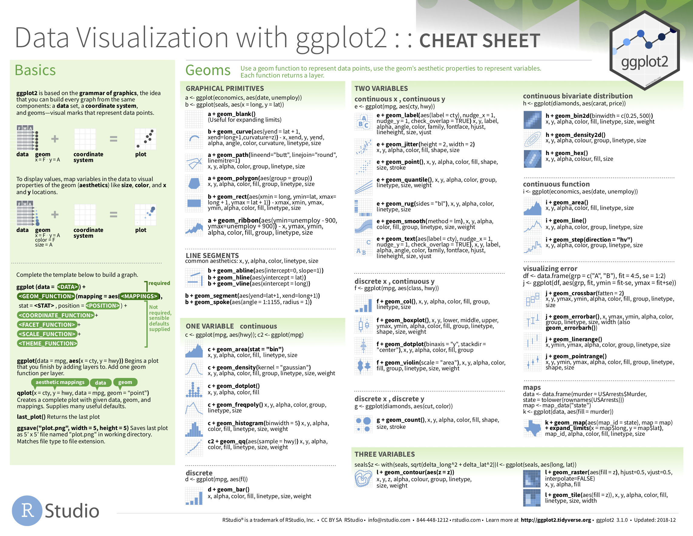

```{r, include=FALSE}
source("_common.R")
```

(ref:tidyversepart) `tidyverse`를 이용한 데이터 과학

```{r echo=FALSE, results="asis", purl=FALSE}
if (knitr::is_latex_output()) {
  cat("# (PART) (ref:tidyversepart) {-} ")
} else {
  cat("# (PART) tidyverse를 이용한 데이터 과학 {-} ")
}
```

# 데이터 시각화 {#viz}

```{r setup-viz, include=FALSE, purl=FALSE}
# 학습 확인(Learning Check) 번호를 정의하는 데 사용됨:
chap <- 2
lc <- 0

# R 코드 청크 기본값 설정:
knitr::opts_chunk$set(
  echo = TRUE,
  eval = TRUE,
  warning = FALSE,
  message = TRUE,
  tidy = FALSE,
  purl = TRUE,
  out.width = "\\textwidth",
  fig.height = 4,
  fig.align = "center"
)

# 출력 자릿수 정밀도 설정
options(scipen = 99, digits = 3)

# kable 출력에서 모든 NA를 공백으로 대체
options(knitr.kable.NA = "")

# 재현 가능한 의사 난수 생성을 위해 난수 생성기 시드 값 설정.
set.seed(76)
```

우리는 데이터 시각화를 통해 여러분의 데이터 과학 도구 상자 개발을 시작합니다. 데이터를 시각화함으로써, 원시 데이터 값을 그냥 보는 것만으로는 처음에 얻을 수 없었던 귀중한 통찰력을 얻을 수 있습니다. 우리는 플롯을 쉽게 커스터마이징할 수 있는 `ggplot2` 패키지를 사용할 것입니다. `ggplot2`는 릴랜드 윌킨슨(Leland Wilkinson)이 개발한 *그래픽 문법(the grammar of graphics)* [@wilkinson2005]으로 알려진 데이터 시각화 이론에 뿌리를 두고 있습니다. \index{Wilkinson, Leland}

가장 기본적으로 그래픽/플롯/차트(이 책에서는 이 용어들을 혼용하여 사용합니다)는 *이상치(outliers)*의 존재, 개별 변수의 *분포(distributions)*, 변수 그룹 간의 *관계(relationships)*와 같은 데이터의 패턴을 탐색하는 좋은 방법을 제공합니다. 그래픽은 여러분의 청중이 이해하기를 원하는 발견과 통찰을 강조하도록 설계되었습니다. 하지만 여기에는 균형 잡힌 행동이 필요합니다. 한편으로는 가능한 한 많은 흥미로운 발견을 강조하고 싶지만, 다른 한편으로는 청중을 압도할 정도로 많은 정보를 포함하고 싶지는 않을 것입니다.

우리가 보게 될 것처럼, 플롯 \index{plots} 역시 데이터의 패턴과 이상치를 식별하는 데 도움을 줍니다. 이러한 아이디어의 흔한 확장은 수치형 변수의 *분포* \index{distribution}(값의 중심과 퍼짐 정도 등)를 서로 다른 범주형 변수의 수준에 따라 비교하는 것임을 알게 될 것입니다.


### 필요한 패키지 {-}

이 장에 필요한 모든 패키지를 로드해 보겠습니다(이미 설치했다고 가정합니다). R 패키지를 설치하고 로드하는 방법에 대한 정보는 섹션 \@ref(packages)를 읽어보세요.

```{r message=FALSE}
library(nycflights13)
library(ggplot2)
library(moderndive)
```

```{r message=FALSE, echo=FALSE, purl=FALSE}
# 내부적으로는 필요하지만 책에는 나오지 않는 패키지들.
library(dplyr)
library(gapminder)
library(kableExtra)
library(readr)
library(patchwork)
library(scales)
library(stringr)
```


## 그래픽 문법 {#grammarofgraphics}

우리는 "그래픽 문법(the grammar of graphics)"으로 알려진 데이터 시각화를 위한 이론적 틀에 대한 논의부터 시작하겠습니다. 이 틀은 이 장에서 광범위하게 사용할 `ggplot2` \index{R packages!ggplot2} 패키지의 기초 역할을 합니다. \index{Grammar of Graphics, The} 우리가 명사, 동사, 관사, 주어, 목적어 등과 같은 서로 다른 요소들을 결합하여 영어 문장을 구성하고 형성하는 방식을 생각해 보세요. 우리는 이러한 요소들을 임의의 순서로 결합할 수 없습니다. 언어 문법으로 알려진 일련의 규칙을 따라야 합니다. 언어 문법과 유사하게 "그래픽 문법"은 서로 다른 유형의 *레이어(layers)*를 결합하여 *통계 그래픽(statistical graphics)*을 구성하기 위한 일련의 규칙을 정의합니다. 이 문법은 릴랜드 윌킨슨 [@wilkinson2005]에 의해 만들어졌으며 R뿐만 아니라 [Plotly](https://plot.ly/) 및 [Tableau](https://www.tableau.com/)와 같은 다양한 데이터 시각화 소프트웨어 플랫폼에서 구현되었습니다.

### 문법의 구성 요소

요약하자면, 이 문법은 다음과 같이 말합니다:

> **통계 그래픽은 `데이터(data)` 변수를 `기하학적(geom) 객체`의 `미적(aes) 속성`에 `매핑(mapping)`한 것입니다.**

구체적으로, 그래픽을 다음과 같은 세 가지 필수 구성 요소로 나눌 수 있습니다:

1. `data`: 관심 변수를 포함하는 데이터셋.
1. `geom`: 해당 기하학적 객체. 이는 플롯에서 관찰할 수 있는 객체의 유형을 나타냅니다. 예: 점(points), 선(lines), 막대(bars).
1. `aes`: 기하학적 객체의 미적 속성. 예: x/y 위치, 색상, 모양, 크기. 미적 속성은 데이터셋의 변수에 *매핑*됩니다.

왜 `data`, `geom`, `aes`라는 용어를 컴퓨터 코드 글꼴로 썼는지 궁금하실 겁니다. 곧 R에서 이 용어들을 사용하여 문법의 요소들을 지정하는 것을 보게 될 것입니다. 하지만 먼저 예시를 통해 문법을 분해해 보겠습니다.


### Gapminder 데이터 {#gapminder}

```{r, echo=FALSE, purl=FALSE}
gapminder_2007 <- gapminder %>%
  filter(year == 2007) %>%
  select(-year) %>%
  rename(
    Country = country,
    Continent = continent,
    `Life Expectancy` = lifeExp,
    `Population` = pop,
    `GDP per Capita` = gdpPercap
  )
```

2006년 2월, 스웨덴의 의사이자 데이터 옹호가인 한스 로슬링(Hans Rosling)은 ["여러분이 본 것 중 최고의 통계"](https://www.ted.com/talks/hans_rosling_shows_the_best_stats_you_ve_ever_seen)라는 제목의 TED 강연을 통해 [gapminder.org](http://www.gapminder.org/tools/#_locale_id=en;&chart-type=bubbles) 웹사이트의 글로벌 경제, 건강 및 개발 데이터를 제시했습니다. 예를 들어, 2007년 `r gapminder_2007 %>% nrow()`개 국가의 데이터 중 표 \@ref(tab:gapminder-2007)에 있는 몇 개 국가만 살펴보겠습니다.

```{r gapminder-2007, echo=FALSE, purl=FALSE}
gapminder_2007 %>%
  head(3) %>%
  kbl(
    digits = 2,
    caption = "Gapminder 2007 데이터: 142개국 중 처음 3개국" # ,
  ) %>%
  kable_styling(
    font_size = ifelse(knitr::is_latex_output(), 10, 16),
    latex_options = c("hold_position")
  )
```

이 표의 각 행은 2007년의 한 국가에 해당합니다. 각 행에는 `r gapminder_2007 %>% ncol()`개의 열이 있습니다:

1. **Country**: 국가명.
1. **Continent**: 해당 국가가 속한 5대륙 중 하나. "Americas"에는 북미와 남미 국가가 모두 포함되며 남극은 제외됩니다.
1. **Life Expectancy**: 기대 수명(년).
1. **Population**: 국가에 거주하는 인구수.
1. **GDP per Capita**: 1인당 국내총생산(미국 달러 기준).

이제 이 데이터의 모든 `r gapminder_2007 %>% nrow()`개 국가를 플롯한 그림 \@ref(fig:gapminder)을 생각해 봅시다.

```{r gapminder, echo=FALSE, fig.cap="2007년 GDP 대비 기대 수명.", fig.height=2.95, purl=FALSE}
gapminder_plot <- ggplot(
  data = gapminder_2007,
  mapping = aes(
    x = `GDP per Capita`,
    y = `Life Expectancy`,
    size = Population,
    color = Continent
  )
) +
  geom_point() +
  labs(x = "1인당 GDP", y = "기대 수명")

if (knitr::is_html_output()) {
  gapminder_plot
} else {
  gapminder_plot + scale_color_grey()
}
```

이 플롯을 그래픽 문법을 통해 살펴보겠습니다:

1. `데이터` 변수인 **GDP per Capita**는 점의 `x` 위치 `미적(aes)` \index{ggplot2!aes()} 속성에 매핑됩니다.
1. `데이터` \index{ggplot2!data} 변수인 **Life Expectancy**는 점의 `y` 위치 `미적` 속성에 매핑됩니다.
1. `데이터` 변수인 **Population**은 점의 `크기(size)` `미적` 속성에 매핑됩니다.
1. `데이터` 변수인 **Continent**는 점의 `색상(color)` `미적` 속성에 매핑됩니다.

곧 `data`는 우리 데이터가 저장된 특정 데이터 프레임에 해당하고, "데이터 변수"는 데이터 프레임의 특정 열에 해당함을 보게 될 것입니다. 또한 이 플롯에서 고려된 `기하학적(geom)` \index{ggplot2!geom} 객체의 유형은 점입니다. 그렇긴 하지만, 이 예시에서는 점을 고려하고 있지만 그래픽이 점에만 국한되지는 않습니다. 선, 막대 및 기타 기하학적 객체를 사용할 수도 있습니다.

표 \@ref(tab:summary-table-gapminder)에 문법의 세 가지 필수 구성 요소를 요약해 보겠습니다.

```{r summary-table-gapminder, echo=FALSE, purl=FALSE}
tibble(
  `데이터 변수` = c("GDP per Capita", "Life Expectancy", "Population", "Continent"),
  aes = c("x", "y", "size", "color"),
  geom = c("point", "point", "point", "point")
) %>%
  kbl(
    caption = "이 플롯에 대한 그래픽 문법 요약",
    booktabs = TRUE,
    linesep = ""
  ) %>%
  kable_styling(
    font_size = ifelse(knitr::is_latex_output(), 10, 16),
    latex_options = c("hold_position")
  )
```


### 다른 구성 요소

우리가 제어할 수 있는 그래픽 문법의 다른 구성 요소들도 있습니다. 그래픽 문법을 더 깊이 파고들기 시작하면 이러한 주제들을 더 자주 마주하게 될 것입니다. 이 책에서는 내용을 단순하게 유지하기 위해 다음 두 가지 추가 구성 요소만 다룰 것입니다:

- `분할(facet)`은 다른 변수의 값에 따라 플롯을 여러 개의 플롯으로 나눕니다(섹션 \@ref(facets)). \index{ggplot2!facet}
- 막대 그래프의 `위치(position)` 조정입니다(섹션 \@ref(geombar)). \index{ggplot2!position}

`scales` 및 `좌표(coord)`계와 같은 다른 복잡한 구성 요소는 [*R for Data Science*](http://r4ds.had.co.nz/data-visualisation.html#aesthetic-mappings) [@rds2016]와 같은 더 고급 텍스트를 위해 남겨두겠습니다. 일반적으로 말해서 그래픽 문법은 플롯의 높은 자유도의 커스터마이징을 가능하게 하며, 플롯을 쉽게 업데이트하고 수정할 수 있는 일관된 틀을 제공합니다.


### ggplot2 패키지

이 책에서는 R을 위한 그래픽 문법의 구현체인 `ggplot2` 패키지를 데이터 시각화에 사용할 것입니다 [@R-ggplot2]. 앞서 언급했듯이, 이전 섹션의 많은 부분이 컴퓨터 코드 글꼴로 작성되었습니다. 이는 그래픽 문법의 다양한 구성 요소들이 `ggplot2` 패키지에 포함된 `ggplot()` \index{ggplot2!ggplot()} 함수에서 지정되기 때문입니다. 이 책의 목적을 위해, 우리는 항상 `ggplot()` 함수에 최소한 다음과 같은 인자(즉, 입력값)를 제공할 것입니다:

* 변수가 존재하는 데이터 프레임: `data` 인자.
* 변수를 미적 속성에 매핑하는 것: 관련된 미적 속성을 지정하는 `mapping` 인자.

이러한 구성 요소를 지정한 후, `+` 기호를 사용하여 플롯에 *레이어(layers)*를 추가합니다. 플롯에 추가할 가장 필수적인 레이어는 플롯에 포함할 `기하학적(geom)` 객체의 유형(점, 선, 막대 등)을 지정하는 레이어입니다. 플롯에 추가할 수 있는 다른 레이어로는 플롯 제목, 축 라벨, 플롯의 시각적 테마, 그리고 분할(섹션 \@ref(facets)에서 보게 될 것) 등이 있습니다.

이제 그래픽 문법의 이론을 실제로 적용해 봅시다.


## 다섯 가지 이름 있는 그래프 - 5NG {#FiveNG}

이 책에서는 내용을 단순하게 유지하기 위해 흔히 이름이 붙여진 다섯 가지 유형의 그래픽에만 집중할 것입니다. 우리는 이들을 "다섯 가지 이름 있는 그래프(five named graphs)" 또는 줄여서 **5NG**라고 부릅니다: \index{five named graphs}

1. 산점도 (scatterplots)
1. 선 그래프 (linegraphs)
1. 히스토그램 (histograms)
1. 박스 플롯 (boxplots)
1. 막대 그래프 (barplots)

또한 이 플롯들의 몇 가지 변형도 제시하겠지만, 도구 상자에 이 다섯 가지 그래픽의 기본 레퍼토리가 있다면 광범위한 유형의 변수들을 시각화할 수 있습니다. 특정 플롯은 범주형 변수에만 적합하고, 다른 플롯은 수치형 변수에만 적합하다는 점에 유의하세요.


## 5NG#1: 산점도 {#scatterplots}

5NG 중 가장 단순한 것은 *산점도(scatterplots)* \index{scatterplots}이며, *이변량 플롯(bivariate plots)*이라고도 합니다. 산점도를 사용하면 두 수치형 변수 간의 *관계*를 시각화할 수 있습니다. 산점도에 이미 익숙할 수도 있지만, 섹션 \@ref(grammarofgraphics)에서 제시한 그래픽 문법의 렌즈를 통해 다시 살펴보겠습니다. 구체적으로, 우리는 `moderndive` \index{R packages!moderndive} 패키지에 포함된 `alaska_flights` 데이터 프레임에 있는 다음 두 수치형 변수 간의 관계를 시각화할 것입니다:

1. 수평 "x"축의 `dep_delay`: 출발 지연 시간
1. 수직 "y"축의 `arr_delay`: 도착 지연 시간

이 데이터는 2013년 뉴욕시를 출발한 알래스카 항공(Alaska Airlines) 항공편에 관한 것입니다. 즉, `alaska_flights`는 2013년에 뉴욕시를 출발한 *모든* 항공편으로 구성된 것이 아니라, `carrier`가 `AS`(알래스카 항공의 항공사 코드)인 항공편들로만 구성되어 있습니다.

```{block lc-alaska_flights, type="learncheck", purl=FALSE}
\vspace{-0.15in}
**_학습 확인_**
\vspace{-0.1in}
```

**`r paste0("(LC", chap, ".", (lc <- lc + 1), ")")`** `nycflights13` 패키지의 `flights` 데이터 프레임과 `moderndive` 패키지의 `alaska_flights` 데이터 프레임을 `View(flights)`와 `View(alaska_flights)`를 실행하여 살펴보세요. 이 데이터 프레임들은 어떤 점에서 다른가요? 예를 들어, 각 데이터셋의 행의 수에 대해 생각해 보세요.

```{block, type="learncheck", purl=FALSE}
\vspace{-0.25in}
\vspace{-0.25in}
```


### `geom_point`를 이용한 산점도 {#geompoint}

이제 섹션 \@ref(grammarofgraphics)에서 소개한 그래픽 문법 틀을 염두에 두면서, 원하는 산점도를 생성하는 코드를 살펴보겠습니다. 코드를 하나씩 분해해서 살펴보겠습니다.

```{r echo=FALSE, purl=FALSE, results="asis"}
if (knitr::is_latex_output()) {
  cat("**참고**: 이 책의 인쇄본은 책 전체에서 `ggplot2`로 생성된 플롯에 기본값인 `theme_grey()` 대신 `theme_light()`를 사용합니다. 막대와 점들도 `scale_color_grey()`와 `scale_fill_grey()`를 사용하여 회색조로 변환되었습니다. 이는 인쇄본에서 플롯의 가독성을 높여줍니다. 코드를 직접 실행해 보면, 플롯은 인쇄본의 흰색 배경 대신 회색 배경을 갖게 될 것입니다. 또한, 인쇄본에서 제공되는 회색조 버전 이외의 색상들도 볼 수 있을 것입니다.")
}
```

```{r, eval=FALSE}
ggplot(data = alaska_flights, mapping = aes(x = dep_delay, y = arr_delay)) + 
  geom_point()
```

`ggplot()` \index{ggplot2!ggplot()} 함수 내에서 그래픽 문법의 세 가지 구성 요소 중 두 가지를 인자(즉, 입력값)로 지정합니다:

1. `data = alaska_flights`를 통해 `data`를 `alaska_flights` 데이터 프레임으로 지정합니다.
1. `mapping = aes(x = dep_delay, y = arr_delay)`를 통해 미적(aes) \index{ggplot2!mapping} `매핑(mapping)`을 설정합니다. 구체적으로, `dep_delay` 변수는 `x` 위치 미적 속성에 매핑되고, `arr_delay` 변수는 `y` 위치 미적 속성에 매핑됩니다.
        
그런 다음 `+` 기호를 사용하여 `ggplot()` 함수 호출에 레이어를 추가합니다. 추가된 레이어는 문법의 세 번째 구성 요소인 `기하학적(geom)` 객체를 지정합니다. 이 경우 기하학적 객체는 `geom_point()`를 지정하여 점으로 설정됩니다. 콘솔에서 이 두 줄의 코드를 실행하면 경고 메시지와 그림 \@ref(fig:noalpha)에 표시된 그래픽이라는 두 가지 출력이 나타납니다.

```{r noalpha, fig.cap="2013년 NYC 출발 알래스카 항공 항공편의 출발 지연 시간 대비 도착 지연 시간.", fig.height=1.8, warning=TRUE, echo=FALSE, purl=FALSE}
ggplot(data = alaska_flights, mapping = aes(x = dep_delay, y = arr_delay)) +
  geom_point()
```

먼저 그림 \@ref(fig:noalpha)의 그래픽을 분석해 봅시다. `dep_delay`와 `arr_delay` 사이에 *양의 관계*가 존재함을 관찰할 수 있습니다. 즉, 출발 지연이 증가함에 따라 도착 지연도 증가하는 경향이 있습니다. 또한 지연되지 않고 출발하고 도착한 항공편을 나타내는 (0, 0) 근처에 밀집된 거대한 점들의 무리도 관찰해 보세요.

경고 메시지에 주의를 기울여 봅시다. R은 데이터가 누락되어 5개의 행이 무시되었다는 사실을 경고하고 있습니다. 이 5개 행의 경우, `dep_delay` 또는 `arr_delay` 중 하나 또는 둘 다의 값이 누락되어(R에서 `NA`로 기록됨) 플롯에서 제외되었습니다.

계속하기 전에, 산점도를 생성한 이 코드에 대해 몇 가지 더 관찰해 보겠습니다. `+` 기호는 줄의 끝에 오며 줄의 시작 부분에는 오지 않는다는 점에 유의하세요. 줄의 시작 부분에 두면 R에서 오류가 발생합니다. \index{ggplot2!+} 플롯에 레이어를 추가할 때는 각 레이어에 대한 코드가 새 줄에 오도록 `+` 뒤에 새 줄을 시작하는 것(키보드의 Return/Enter 키를 누름)이 권장됩니다. 플롯에 더 많은 레이어를 추가할수록 이렇게 하는 것이 코드의 가독성을 크게 높여준다는 것을 알게 될 것입니다.

기하학적 객체를 지정하는 레이어를 추가하는 것의 중요성을 강조하기 위해, 레이어가 추가되지 않은 그림 \@ref(fig:nolayers)를 고려해 보세요. 기하학적 객체가 지정되지 않았기 때문에 빈 플롯이 나타나며, 이는 별로 유용하지 않습니다!

```{r nolayers, fig.cap="레이어가 없는 플롯.", fig.height=2.5}
ggplot(data = alaska_flights, mapping = aes(x = dep_delay, y = arr_delay))
```

```{block lc-scatterplots, type="learncheck", purl=FALSE}
\vspace{-0.15in}
**_학습 확인_**
\vspace{-0.1in}
```

**`r paste0("(LC", chap, ".", (lc <- lc + 1), ")")`** `dep_delay`와 `arr_delay`가 양의 관계를 갖는 몇 가지 실질적인 이유는 무엇인가요?

**`r paste0("(LC", chap, ".", (lc <- lc + 1), ")")`** `weather` 데이터 프레임의 어떤 변수들이 `dep_delay`와 음의 상관관계(즉, 음의 관계)를 가질 것으로 예상하나요? 그 이유는 무엇인가요? 여기서는 수치형 변수에 집중하고 있다는 점을 기억하세요. 힌트: `View()` 함수를 사용하여 `weather` 데이터셋을 탐색해 보세요.

**`r paste0("(LC", chap, ".", (lc <- lc + 1), ")")`** 왜 (0, 0) 근처에 점들이 밀집되어 있다고 생각하나요? 알래스카 항공 항공편의 관점에서 (0, 0)은 무엇에 해당하나요?

**`r paste0("(LC", chap, ".", (lc <- lc + 1), ")")`** 플롯에서 눈에 띄는 다른 특징들은 무엇인가요?

**`r paste0("(LC", chap, ".", (lc <- lc + 1), ")")`** 제시된 예시를 수정하여 `alaska_flights` 데이터 프레임의 다른 변수들을 사용한 새로운 산점도를 만들어 보세요.

```{block, type="learncheck", purl=FALSE}
\vspace{-0.25in}
\vspace{-0.25in}
```


### 오버플로팅 {#overplotting}

그림 \@ref(fig:noalpha)에서 (0, 0) 근처의 거대한 점들의 무리는 실제로 플롯된 점들의 수를 파악하기 어렵게 만들기 때문에 혼란을 줄 수 있습니다. 이것은 *오버플로팅(overplotting)* \index{overplotting}이라고 불리는 현상의 결과입니다. 짐작할 수 있듯이, 이는 점들이 서로 겹쳐서 반복적으로 플롯되는 것을 의미합니다. 오버플로팅이 발생하면 플롯되는 점들의 개수를 알기 어렵습니다. 오버플로팅 문제를 해결하는 두 가지 방법이 있습니다:

1. 점들의 투명도를 조정하거나
1. 각 점에 약간의 무작위적인 "지터(jitter)" 또는 무작위적인 "넛지(nudge)"를 추가하는 것입니다.

**방법 1: 투명도 변경**

오버플로팅을 해결하는 첫 번째 방법은 `geom_point()`에서 `alpha` 인자를 설정하여 점들의 투명도/불투명도를 변경하는 것입니다. `alpha` 인자는 `0`에서 `1` 사이의 값으로 설정할 수 있습니다. 여기서 `0`은 점들을 100% 투명하게 만들고, `1`은 점들을 100% 불투명하게 만듭니다. 기본적으로 `alpha`는 `1`로 설정되어 있습니다. 즉, `alpha` 값을 명시적으로 설정하지 않으면 R은 `alpha = 1`을 사용합니다.

다음 코드가 오버플로팅이 있는 산점도를 생성했던 섹션 \@ref(scatterplots)의 코드와 동일하지만, `geom_point()` 함수에 `alpha = 0.2`가 추가되었다는 점에 주목하세요:

```{r alpha, fig.cap="alpha = 0.2를 적용한 도착 지연 시간 대비 출발 지연 시간 산점도.", fig.height=4.9}
ggplot(data = alaska_flights, mapping = aes(x = dep_delay, y = arr_delay)) + 
  geom_point(alpha = 0.2)
```

그림 \@ref(fig:alpha)에서 주목해야 할 주요 특징은 점들의 투명도 \index{ggplot2!alpha} \index{adding transparency to plots}가 누적된다는 점입니다. 오버플로팅 정도가 높은 영역은 더 어둡게 나타나고, 정도가 낮은 영역은 덜 어둡게 나타납니다. 또한 `alpha = 0.2` 주위에 `aes()`가 없다는 점에 유의하세요. 이는 변수를 미적 속성에 매핑하는 것이 아니라 단순히 `alpha`의 기본 설정을 변경하는 것이기 때문입니다. 실제로 두 번째 줄을 `geom_point(aes(alpha = 0.2))`로 변경하려고 하면 오류가 발생합니다.

**방법 2: 점들에 지터 추가하기**

오버플로팅을 해결하는 두 번째 방법은 모든 점들에 *지터(jitter)*를 추가하는 것입니다. 이는 각 점에 무작위 방향으로 작은 "넛지"를 주는 것을 의미합니다. "지터링(jittering)"은 플롯 위의 점들을 약간씩 흔드는 것으로 생각할 수 있습니다. 먼저 간단한 예시로 설명해 보겠습니다. x와 y 값이 (0,0), (0,0), (0,0), (0,0)인 동일한 4개의 행을 가진 데이터 프레임이 있다고 가정해 봅시다. 그림 \@ref(fig:jitter-example-plot-1)에서 이 4개 점에 대한 일반 산점도(왼쪽)와 지터가 적용된 산점도(오른쪽)를 모두 보여줍니다.

```{r jitter-example-plot-1, fig.cap="일반 산점도와 지터 산점도.", echo=FALSE, fig.height=5, purl=FALSE}
jitter_example <- tibble(
  x = rep(0, 4),
  y = rep(0, 4)
)
jittered_plot_1 <- ggplot(data = jitter_example, mapping = aes(x = x, y = y)) +
  geom_point() +
  coord_cartesian(xlim = c(-0.025, 0.025), ylim = c(-0.025, 0.025)) +
  labs(title = "일반 산점도")
jittered_plot_2 <- ggplot(data = jitter_example, mapping = aes(x = x, y = y)) +
  geom_jitter(width = 0.01, height = 0.01) +
  coord_cartesian(xlim = c(-0.025, 0.025), ylim = c(-0.025, 0.025)) +
  labs(title = "지터 산점도")
jittered_plot_1 + jittered_plot_2
```

왼쪽의 일반 산점도에서는 4개의 점이 서로 겹쳐져 있음을 관찰할 수 있습니다. 우리는 4개의 값이 플롯되고 있다는 것을 알고 있지만, 다른 사람들에게는 이 사실이 분명하지 않을 수 있습니다. 오른쪽의 지터 산점도에서는 각 점에 무작위 "넛지"가 주어졌기 때문에 이 플롯이 4개의 점을 포함하고 있다는 것이 이제 명확하게 드러납니다.

하지만 지터링은 엄밀히 말해 시각화 도구일 뿐이며, 지터 산점도를 만든 후에도 데이터 프레임에 저장된 원래 값은 변경되지 않은 상태로 유지된다는 점을 명심하세요. \index{ggplot2!geom\_jitter()}

지터 산점도를 생성하려면 `geom_point()` 대신 `geom_jitter()`를 사용합니다. 다음 코드가 소섹션 \@ref(geompoint)에서 오버플로팅이 있는 산점도를 생성했던 코드와 매우 유사하며, `geom_point()` \index{ggplot2!geom\_point()}가 `geom_jitter()`로 대체되었다는 점을 관찰해 보세요.

```{r jitter, fig.cap="도착 지연 시간 대비 출발 지연 시간 지터 산점도.", fig.height=4.7}
ggplot(data = alaska_flights, mapping = aes(x = dep_delay, y = arr_delay)) + 
  geom_jitter(width = 30, height = 30)
```

추가할 지터의 양을 지정하기 위해 `geom_jitter()`에 `width`와 `height` 인자를 조정했습니다. 이는 각각 가로 x축 단위와 세로 y축 단위로 플롯을 얼마나 세게 흔들고 싶은지에 해당합니다. 이 경우 두 축 모두 분 단위입니다. `width`와 `height` 인자를 사용하여 지터를 얼마나 추가해야 할까요? 한편으로는 점들의 겹침을 해소할 수 있을 정도의 지터를 추가하는 것이 중요하지만, 다른 한편으로는 점들의 원래 패턴을 완전히 바꿀 정도로 많이 추가해서는 안 됩니다.

그림 \@ref(fig:jitter)에서 볼 수 있듯이, 이 경우 지터링은 실제로는 별로 새로운 통찰력을 제공하지 않습니다. 이 특정한 경우에는 `alpha`를 설정하여 점들의 투명도를 변경하는 것이 더 효과적이었다고 주장할 수 있습니다. 언제 지터 산점도를 사용하는 것이 더 좋을까요? 언제 점들의 투명도를 변경하는 것이 더 좋을까요? 모든 상황에 적용되는 단 하나의 정답은 없습니다. 주관적인 선택을 내려야 하며 그 선택에 책임을 져야 합니다. 하지만 오버플로팅에 직면했을 때 최소한 두 가지 유형의 플롯을 모두 만들어 보고 어떤 것이 여러분이 전달하려는 요점을 더 잘 강조하는지 확인해 보기를 권장합니다.

```{block lc-overplotting, type="learncheck", purl=FALSE}
\vspace{-0.15in}
**_학습 확인_**
\vspace{-0.1in}
```

**`r paste0("(LC", chap, ".", (lc <- lc + 1), ")")`** 산점도에서 `alpha` 인자 값을 설정하는 것이 왜 유용한가요? 일반 산점도가 제공하지 못하는 어떤 추가 정보를 제공하나요?

**`r paste0("(LC", chap, ".", (lc <- lc + 1), ")")`** 그림 \@ref(fig:alpha)를 살펴본 후, 가장 빈번하게 발생하는 도착 지연 시간과 출발 지연 시간의 대략적인 범위를 제시하세요. 그림 \@ref(fig:noalpha)에서 `alpha = 0.2`를 설정하지 않고 동일한 플롯을 보았을 때와 비교하여 그 영역이 어떻게 변했나요?

```{block, type="learncheck", purl=FALSE}
\vspace{-0.25in}
\vspace{-0.25in}
```


### 요약

산점도는 두 수치형 변수 간의 관계를 보여줍니다. 산점도는 한 수치형 변수 대 다른 수치형 변수의 추세를 즉각적으로 볼 수 있는 방법을 제공하기 때문에 가장 흔히 사용되는 플롯 중 하나입니다. 하지만 두 변수 중 하나라도 수치형이 아닌데 산점도를 만들려고 하면 이상한 결과가 나올 수 있습니다. 주의하세요!

중간에서 대규모 데이터셋의 경우, 점들의 투명도/불투명도를 변경하거나 점들을 지터링하는 등 우리가 살펴본 산점도에 대한 다양한 수정을 시도해 볼 필요가 있습니다. 플롯을 만지작거리면서 서로 다른 관계가 나타나는 것을 볼 수 있기 때문에, 이러한 미세 조정은 종종 데이터 시각화의 즐거운 부분이 됩니다.


## 5NG#2: 선 그래프 {#linegraphs}

다섯 가지 이름 있는 그래프 중 다음은 선 그래프(linegraphs)입니다. 선 그래프 \index{linegraphs}는 x축의 변수(주로 *설명(explanatory)* 변수\index{explanatory variable}라고 함)가 연속적인 성질을 가질 때 두 수치형 변수 간의 관계를 보여줍니다. 즉, 변수에 내재된 순서가 있습니다.

선 그래프의 가장 흔한 예시는 x축에 시간의 개념(시간, 일, 주, 년 등)이 있는 경우입니다. 시간은 연속적이기 때문에 y축 변수의 연속된 관측치를 선으로 연결합니다. x축에 시간의 개념이 있는 선 그래프는 *시계열(time series)* 플롯\index{time series plots}이라고도 합니다. `nycflights13` \index{R packages!nycflights13} 패키지의 또 다른 데이터셋인 `weather` 데이터 프레임을 사용하여 선 그래프를 설명해 보겠습니다.

`View(weather)`와 `glimpse(weather)`를 실행하여 `nycflights13` 패키지의 `weather` 데이터 프레임을 탐색해 보세요. 또한 `?weather`를 실행하여 관련 도움말 파일을 읽어보세요.

뉴욕시의 세 주요 공항인 뉴어크(`origin` 코드 `EWR`), 존 F. 케네디 국제공항(`JFK`), 라과디아(`LGA`) 근처의 기상 관측소에서 측정된 매시간 기온(화씨)이 기록된 `temp`라는 변수가 있음을 관찰해 보세요.

하지만 세 공항 모두에 대해 2013년 전체 일수 동안의 매시간 기온을 고려하는 대신, 단순화를 위해 1월 첫 15일 동안 뉴어크 공항의 매시간 기온만 고려해 보겠습니다. 이 데이터는 `moderndive` 패키지에 포함된 `early_january_weather` 데이터 프레임에서 접근할 수 있습니다. 즉, `early_january_weather`는 `origin`이 `EWR`(뉴어크 공항 코드)이고, `month`가 `1`이며, `day`가 `15` 이하인 매시간 기상 관측 데이터를 포함하고 있습니다.

```{block lc-early_january_weather, type="learncheck", purl=FALSE}
\vspace{-0.15in}
**_학습 확인_**
\vspace{-0.1in}
```

**`r paste0("(LC", chap, ".", (lc <- lc + 1), ")")`** `nycflights13` 패키지의 `weather` 데이터 프레임과 `moderndive` 패키지의 `early_january_weather` 데이터 프레임을 `View(weather)`와 `View(early_january_weather)`를 실행하여 살펴보세요. 이 데이터 프레임들은 어떤 점에서 다른가요?

**`r paste0("(LC", chap, ".", (lc <- lc + 1), ")")`** `flights` 데이터 프레임을 다시 `View()`로 살펴보세요. 왜 `time_hour` 변수는 측정 시간을 고유하게 식별하는 반면, `hour` 변수는 그렇지 못한가요?

```{block, type="learncheck", purl=FALSE}
\vspace{-0.25in}
\vspace{-0.25in}
```


### `geom_line`을 이용한 선 그래프 {#geomline}

이전에 산점도를 만들기 위해 `geom_point()`를 사용했던 것 대신, 선 그래프를 만들기 위해 `geom_line()`을 사용하여\index{ggplot2!geom\_line()} `early_january_weather` 데이터 프레임에 저장된 매시간 기온의 시계열 플롯을 만들어 보겠습니다.

```{r hourlytemp, fig.cap="2013년 1월 1~15일 뉴어크의 매시간 기온."}
ggplot(data = early_january_weather, 
       mapping = aes(x = time_hour, y = temp)) +
  geom_line()
```

그림 \@ref(fig:noalpha)에서 알래스카 항공 항공편의 출발 및 도착 지연 시간 산점도를 생성했던 `ggplot()` 코드와 마찬가지로, 이 코드를 그래픽 문법의 관점에서 하나씩 분해해 보겠습니다.

`ggplot()` 함수 호출 내에서 그래픽 문법의 두 가지 구성 요소를 인자로 지정합니다:

1. `data = early_january_weather`를 설정하여 `data`를 `early_january_weather` 데이터 프레임으로 지정합니다.
1. `mapping = aes(x = time_hour, y = temp)`를 설정하여 미적 `매핑`을 지정합니다. 구체적으로, `time_hour` 변수는 `x` 위치 미적 속성에 매핑되고, `temp` 변수는 `y` 위치 미적 속성에 매핑됩니다.

`+` 기호를 사용하여 `ggplot()` 함수 호출에 레이어를 추가합니다. 해당 레이어는 문법의 세 번째 구성 요소인 기하학적 객체를 지정합니다. 이 경우 기하학적 객체는 `geom_line()`을 지정하여 설정된 `선(line)`입니다.

```{block lc-linegraph, type="learncheck", purl=FALSE}
\vspace{-0.15in}
**_학습 확인_**
\vspace{-0.1in}
```

**`r paste0("(LC", chap, ".", (lc <- lc + 1), ")")`** 수평축에 명확한 순서가 없을 때 왜 선 그래프를 피해야 하나요?

**`r paste0("(LC", chap, ".", (lc <- lc + 1), ")")`** 시간이 x축의 설명 변수일 때 왜 선 그래프가 자주 사용되나요?

**`r paste0("(LC", chap, ".", (lc <- lc + 1), ")")`** 2013년 1월 첫 15일 동안 뉴어크 공항의 `temp` 이외의 변수에 대한 시계열을 플롯해 보세요.

```{block, type="learncheck", purl=FALSE}
\vspace{-0.25in}
\vspace{-0.25in}
```


### 요약

선 그래프는 산점도와 마찬가지로 두 수치형 변수 간의 관계를 보여줍니다. 하지만 시간의 개념과 같이 x축 변수(즉, 설명 변수)에 내재된 순서가 있는 경우에는 산점도보다 선 그래프를 사용하는 것이 선호됩니다.


## 5NG#3: 히스토그램 {#histograms}

다시 한번 `weather` 데이터 프레임의 `temp` 변수를 고려해 봅시다. 하지만 섹션 \@ref(linegraphs)의 선 그래프와 달리, 시간과의 관계에는 관심이 없고 오직 `temp` 값이 어떻게 *분포*하는지에만 관심이 있다고 가정해 봅시다. 즉:

1. 최솟값과 최댓값은 무엇인가요?
1. "중심" 또는 "가장 전형적인" 값은 무엇인가요?
1. 값들이 어떻게 퍼져 있나요?
1. 빈번한 값과 드문 값은 무엇인가요?

이 단일 변수 `temp`가 어떻게 *분포* \index{distribution}하는지 시각화하는 한 가지 방법은 그림 \@ref(fig:temp-on-line)에서와 같이 수평선 위에 플롯하는 것입니다.

```{r temp-on-line, echo=FALSE, fig.height=0.8, fig.cap="2013년 NYC 매시간 기온 기록 플롯."}
ggplot(data = weather, mapping = aes(x = temp, y = factor("A"))) +
  geom_point() +
  theme(
    axis.ticks.y = element_blank(),
    axis.title.y = element_blank(),
    axis.text.y = element_blank()
  )
hist_title <- "2013년 NYC 매시간 기온 기록 히스토그램"
```

이는 `temp` 값이 어떻게 분포하는지에 대한 일반적인 아이디어를 제공합니다. 기온이 약 `r round(min(weather$temp, na.rm = TRUE), 0)`&deg;F (-11&deg;C)에서 약 `r round(max(weather$temp, na.rm = TRUE), 0)`&deg;F (38&deg;C)까지 변하는 것을 관찰할 수 있습니다. 또한 40&deg;F에서 60&deg;F 사이가 이 범위를 벗어나는 영역보다 더 많은 온도가 기록된 것으로 보입니다. 하지만 점들의 오버플로팅 정도가 높기 때문에, 예를 들어 50&deg;F와 55&deg;F 사이에 정확히 얼마나 많은 값이 있는지 파악하기는 어렵습니다.

그림 \@ref(fig:temp-on-line) 대신 흔히 생성되는 것이 바로 *히스토그램(histogram)* \index{histograms}입니다. 히스토그램은 다음과 같이 수치형 값의 *분포*를 시각화하는 플롯입니다.

1. 먼저 x축을 일련의 *빈(bins)* \index{histograms!bins}으로 나눕니다. 여기서 각 빈은 값의 범위를 나타냅니다.
1. 각 빈에 대해 해당 빈의 범위에 속하는 관측치의 수를 셉니다.
1. 그런 다음 각 빈에 대해 높이가 해당 개수를 나타내는 막대를 그립니다.

그림 \@ref(fig:histogramexample)에 표시된 히스토그램 예시를 자세히 살펴보겠습니다.

```{r histogramexample, echo=FALSE, fig.cap="히스토그램 예시.", fig.height=2, purl=FALSE}
ggplot(data = weather, mapping = aes(x = temp)) +
  geom_histogram(binwidth = 10, boundary = 70, color = "white")
```

지금은 30&deg;F (-1&deg;C)와 60&deg;F (15&deg;C) 사이의 기온에만 집중해 봅시다. 30&deg;F와 60&deg;F 사이에 너비가 같은 세 개의 빈이 있음을 관찰할 수 있습니다. 따라서 너비가 각각 10&deg;F인 세 개의 빈을 갖게 됩니다. 30~40&deg;F 범위에 대한 빈 하나, 40~50&deg;F 범위에 대한 빈 하나, 50~60&deg;F 범위에 대한 빈 하나입니다. 다음을 따릅니다:

1. 30~40&deg;F 범위에 대한 빈의 높이는 약 5000입니다. 즉, 매시간 기온 기록 중 약 5000개가 30&deg;F에서 40&deg;F 사이입니다.
1. 40~50&deg;F 범위에 대한 빈의 높이는 약 4300입니다. 즉, 매시간 기온 기록 중 약 4300개가 40&deg;F에서 50&deg;F 사이입니다.
1. 50~60&deg;F 범위에 대한 빈의 높이는 약 3500입니다. 즉, 매시간 기온 기록 중 약 3500개가 50&deg;F에서 60&deg;F 사이입니다.

x축에서 10&deg;F에서 100&deg;F까지 펼쳐진 9개 빈 모두 이와 같이 해석됩니다.


### `geom_histogram`을 이용한 히스토그램 {#geomhistogram}

이제 첫 번째 히스토그램을 그리는 `ggplot()` 코드를 제시하겠습니다! 산점도나 선 그래프와 달리, 이제 `aes()`에 매핑되는 변수는 단일 수치형 변수인 `temp` 하나뿐입니다. 각 빈에 있는 관측치 수인 히스토그램의 y축 미적 속성은 자동으로 계산됩니다. 또한 기하학적 객체 레이어는 이제 `geom_histogram()`입니다. \index{ggplot2!geom\_histogram()} 다음 코드를 실행하면 경고 메시지와 함께 그림 \@ref(fig:weather-histogram)의 히스토그램을 볼 수 있습니다. 먼저 경고 메시지에 대해 논의해 보겠습니다.

```{r weather-histogram, warning=TRUE, fig.cap="NYC 세 공항의 매시간 기온 히스토그램.", fig.height=2.3}
ggplot(data = weather, mapping = aes(x = temp)) +
  geom_histogram()
```

첫 번째 메시지는 히스토그램이 동일한 간격의 30개 빈을 나타내는 `bins = 30`을 사용하여 구성되었음을 알려줍니다. 이는 컴퓨터 프로그래밍에서 기본값(default value)으로 알려져 있습니다. 여러분이 지정한 숫자로 이 기본 빈 개수를 덮어쓰지 않는 한, R은 기본적으로 30을 선택합니다. 다음 섹션에서 빈의 개수를 기본값 이외의 값으로 변경하는 방법을 살펴보겠습니다.

두 번째 메시지는 그림 \@ref(fig:noalpha)에서 알래스카 항공 항공편의 출발 및 도착 지연 시간 산점도를 생성하는 코드를 실행했을 때 받았던 경고 메시지와 유사한 내용을 알려줍니다. 즉, 한 행의 `temp` 값이 누락된 `NA`이기 때문에 히스토그램에서 제외되었다는 것입니다. R은 단지 이런 경우가 있었다는 것을 친절하게 알려주는 것입니다.

이제 그림 \@ref(fig:weather-histogram)의 결과 히스토그램을 분석해 봅시다. 25&deg;F 미만의 값과 80&deg;F 이상의 값은 다소 드물다는 것을 관찰할 수 있습니다. 하지만 빈의 개수가 많기 때문에 각 빈이 어느 범위의 온도를 차지하는지 파악하기 어렵습니다. 모든 것이 하나의 거대한 부정형 덩어리처럼 보입니다. 따라서 `geom_histogram()`에 `color = "white"` 인자를 추가하여 빈을 구분하는 하얀색 수직 경계선을 추가하고, 빈의 개수를 더 나은 값으로 설정하라는 경고는 무시해 보겠습니다.

```{r weather-histogram-2, message=FALSE, fig.cap="하얀색 경계선이 있는 NYC 세 공항의 매시간 기온 히스토그램.", fig.height=3}
ggplot(data = weather, mapping = aes(x = temp)) +
  geom_histogram(color = "white")
```

이제 그림 \@ref(fig:weather-histogram-2)에서 각 빈에 해당하는 온도 범위를 더 쉽게 연결 지을 수 있습니다. 또한 `fill` \index{ggplot2!fill} 인자를 설정하여 막대의 색상을 다양하게 바꿀 수도 있습니다. 예를 들어, `fill = "steelblue"`를 설정하여 빈 색상을 "스틸 블루"로 설정할 수 있습니다.

```{r, eval=FALSE}
ggplot(data = weather, mapping = aes(x = temp)) +
  geom_histogram(color = "white", fill = "steelblue")
```

궁금하다면 `colors()` \index{colors()}를 실행하여 R에서 선택 가능한 `r colors() %>% length()`가지 색상을 모두 확인해 보세요!


### 빈 조정하기 {#adjustbins}

그림 \@ref(fig:weather-histogram-2)에서 50~75&deg;F 범위에 대략 8개의 빈이 있음을 관찰할 수 있습니다. 따라서 각 빈의 너비는 25를 8로 나눈 3.125&deg;F이며, 이는 다루기에 매우 해석하기 쉬운 범위는 아닙니다. 다음 두 가지 방법 중 하나로 히스토그램의 빈 수를 조정하여 이를 개선해 보겠습니다.

1. `geom_histogram()`의 `bins` \index{geom\_histogram()!bins} 인자를 통해 빈의 개수를 조정합니다.
1. `geom_histogram()`의 `binwidth` \index{geom\_histogram()!binwidth} 인자를 통해 빈의 너비를 조정합니다.

첫 번째 방법을 사용하면 x축을 몇 개의 빈으로 나눌지 지정할 수 있는 권한이 생깁니다. 이전 섹션에서 언급했듯이 기본 빈 개수는 30개입니다. 다음과 같이 이 기본값을 40개 빈으로 덮어쓸 수 있습니다:

```{r, eval=FALSE}
ggplot(data = weather, mapping = aes(x = temp)) +
  geom_histogram(bins = 40, color = "white")
```

두 번째 방법을 사용하면 빈의 개수를 지정하는 대신, `geom_histogram()` 레이어에서 `binwidth` 인자를 사용하여 빈의 너비를 지정합니다. 예를 들어, 각 빈의 너비를 10&deg;F로 설정해 보겠습니다.

```{r, eval=FALSE}
ggplot(data = weather, mapping = aes(x = temp)) +
  geom_histogram(binwidth = 10, color = "white")
```

그림 \@ref(fig:hist-bins)에서 두 결과 히스토그램을 나란히 비교해 봅니다.

```{r hist-bins, message=FALSE, fig.cap= "히스토그램 빈을 설정하는 두 가지 방법.", echo=FALSE, purl=FALSE}
hist_1 <- ggplot(data = weather, mapping = aes(x = temp)) +
  geom_histogram(bins = 40, color = "white") +
  labs(title = "40개 빈 사용")
hist_2 <- ggplot(data = weather, mapping = aes(x = temp)) +
  geom_histogram(binwidth = 10, color = "white") +
  labs(title = "binwidth = 10도(F) 사용")
hist_1 + hist_2
```

```{block lc-histogram, type="learncheck", purl=FALSE}
\vspace{-0.15in}
**_학습 확인_**
\vspace{-0.1in}
```

**`r paste0("(LC", chap, ".", (lc <- lc + 1), ")")`** 빈의 개수를 30개에서 40개로 변경했을 때 기온의 분포에 대해 무엇을 알 수 있나요?

**`r paste0("(LC", chap, ".", (lc <- lc + 1), ")")`** 기온의 분포를 대칭이라고 보시나요, 아니면 한쪽 방향으로 치우쳐(skewed) 있다고 보시나요?

**`r paste0("(LC", chap, ".", (lc <- lc + 1), ")")`** 이 분포의 "중심" 값은 무엇이라고 추측하시나요? 왜 그런 선택을 하셨나요?

**`r paste0("(LC", chap, ".", (lc <- lc + 1), ")")`** 이 데이터는 중심에서 크게 퍼져 있나요, 아니면 밀집되어 있나요? 그 이유는 무엇인가요?

```{block, type="learncheck", purl=FALSE}
\vspace{-0.25in}
\vspace{-0.25in}
```


### 요약

히스토그램은 산점도나 선 그래프와 달리 단 하나의 수치형 변수에 대한 정보만 제공합니다. 구체적으로, 해당 수치형 변수의 분포를 시각화한 것입니다.


## 분할 {#facets}

다음 5NG를 계속하기 전에 *분할(faceting)*이라는 새로운 개념을 간략하게 소개하겠습니다. 분할은 특정 시각화를 다른 변수의 값에 따라 나누고 싶을 때 사용됩니다. 이렇게 하면 x축과 y축은 일치하지만 내용이 다른 동일한 유형의 플롯이 여러 개 생성됩니다.

예를 들어, 그림 \@ref(fig:histogramexample)에서 보았던 NYC 세 공항의 매시간 기온 기록 히스토그램이 각 달마다 어떻게 다른지 확인하고 싶다고 가정해 봅시다. 이 히스토그램을 해당 연도의 12개월로 "나눌" 수 있습니다. 다시 말해, 각 `month`별로 `temp`의 히스토그램을 따로 그리는 것입니다. 이는 `facet_wrap(~ month)` 레이어를 추가하여 수행합니다. `~`는 "물결표(tilde)"이며 일반적으로 미국식 키보드의 "1" 키 옆에 있는 키에서 찾을 수 있습니다. 물결표는 필수이며, 이를 포함하지 않으면 `Error in as.quoted(facets) : object 'month' not found`와 같은 오류가 발생합니다.

```{r eval=FALSE}
ggplot(data = weather, mapping = aes(x = temp)) +
  geom_histogram(binwidth = 5, color = "white") +
  facet_wrap(~ month)
```

```{r facethistogram, fig.cap="달별 매시간 기온의 분할 히스토그램.", echo=FALSE, purl=FALSE, fig.height=3.3}
month_facet <- ggplot(data = weather, mapping = aes(x = temp)) +
  geom_histogram(binwidth = 5, color = "white") +
  facet_wrap(~month)

if (knitr::is_latex_output()) {
  month_facet +
    theme(
      strip.text = element_text(colour = "black"),
      strip.background = element_rect(fill = "grey93")
    )
} else {
  month_facet
}
```

또한 `facet_wrap()` 안에서 `nrow`와 `ncol` 인자를 사용하여 그리드의 행과 열 개수를 지정할 수 있습니다. \index{ggplot2!facet\_wrap()} 예를 들어, 분할된 히스토그램을 3행 대신 4행으로 만들고 싶다면 `facet_wrap(~ month)`에 `nrow = 4` 인자를 추가하면 됩니다.

```{r eval=FALSE}
ggplot(data = weather, mapping = aes(x = temp)) +
  geom_histogram(binwidth = 5, color = "white") +
  facet_wrap(~ month, nrow = 4)
```

```{r facethistogram2, fig.cap="3행 대신 4행으로 구성된 분할 히스토그램.", echo=FALSE, purl=FALSE, fig.height=3.3}
month_facet_4 <- ggplot(data = weather, mapping = aes(x = temp)) +
  geom_histogram(binwidth = 5, color = "white") +
  facet_wrap(~month, nrow = 4)

if (knitr::is_latex_output()) {
  month_facet_4 +
    theme(
      strip.text = element_text(colour = "black"),
      strip.background = element_rect(fill = "grey93")
    )
} else {
  month_facet_4
}
```

그림 \@ref(fig:facethistogram)와 \@ref(fig:facethistogram2) 모두에서 북반구에서 예상할 수 있듯이 여름철에는 기온이 높고 겨울철에는 낮은 경향이 있음을 관찰할 수 있습니다.

```{block lc-facet, type="learncheck", purl=FALSE}
\vspace{-0.15in}
**_학습 확인_**
\vspace{-0.1in}
```

**`r paste0("(LC", chap, ".", (lc <- lc + 1), ")")`** 이 분할된 플롯에서 또 무엇을 알 수 있나요? 분할된 플롯이 두 변수 사이의 관계를 파악하는 데 어떻게 도움이 되나요?

**`r paste0("(LC", chap, ".", (lc <- lc + 1), ")")`** 플롯의 숫자 1-12는 무엇에 해당하나요? 25, 50, 75, 100은 어떤가요?

**`r paste0("(LC", chap, ".", (lc <- lc + 1), ")")`** 어떤 유형의 데이터셋에서 분할된 플롯이 변수 간의 관계를 비교하는 데 효과적이지 않을까요? 이러한 변수의 성격과 다른 중요한 특징을 설명하는 예를 들어보세요.

**`r paste0("(LC", chap, ".", (lc <- lc + 1), ")")`** `weather` 데이터셋의 `temp` 변수는 가변성(variability)이 큰가요? 왜 그렇게 생각하시나요?

```{block, type="learncheck", purl=FALSE}
\vspace{-0.25in}
\vspace{-0.25in}
```


## 5NG#4: 박스 플롯 {#boxplots}

```{r, echo=FALSE, purl=FALSE}
n_nov <- weather %>%
  filter(month == 11) %>%
  nrow()
min_nov <- weather %>%
  filter(month == 11) %>%
  pull(temp) %>%
  min(na.rm = TRUE) %>%
  round(0)
max_nov <- weather %>%
  filter(month == 11) %>%
  pull(temp) %>%
  max(na.rm = TRUE) %>%
  round(0)
quartiles <- weather %>%
  filter(month == 11) %>%
  pull(temp) %>%
  quantile(prob = c(0.25, 0.5, 0.75)) %>%
  round(0)
five_number_summary <- tibble(
  temp = c(min_nov, quartiles, max_nov)
)
```

분할된 히스토그램이 다른 변수의 값에 따라 나누어진 수치형 변수의 분포를 비교하는 데 사용되는 시각화 유형 중 하나라면, 동일한 목표를 달성하는 또 다른 시각화 유형은 *나란히 배치된 박스 플롯(side-by-side boxplot)*입니다. 박스 플롯 \index{boxplots}은 수치형 변수의 *다섯 수치 요약(five-number summary)*에서 제공된 정보를 바탕으로 구성됩니다(부록 \@ref(appendix-stat-terms) 참고).

지금은 단순하게 하기 위해 11월의 `r n_nov`건의 매시간 기온 기록만 고려해 보겠습니다. 그림 \@ref(fig:nov1)에서는 각 기록을 지터링된 점으로 표시했습니다.

```{r nov1, echo=FALSE, fig.cap="지터링된 점으로 표현된 11월 기온.", fig.height=1.7, purl=FALSE}
base_plot <- weather %>%
  filter(month %in% c(11)) %>%
  ggplot(mapping = aes(x = factor(month), y = temp)) +
  labs(x = "")
base_plot +
  geom_jitter(width = 0.075, height = 0.5, alpha = 0.1)
```

이 `r n_nov`개의 관측치는 다음과 같은 *다섯 수치 요약*을 가집니다:

1. 최솟값: `r min_nov`&deg;F
1. 제1사분위수 (25번째 백분위수): `r quartiles[1]`&deg;F
1. 중간값 (제2사분위수, 50번째 백분위수): `r quartiles[2]`&deg;F
1. 제3사분위수 (75번째 백분위수): `r quartiles[3]`&deg;F
1. 최댓값: `r max_nov`&deg;F

그림 \@ref(fig:nov2)의 가장 왼쪽 플롯에서 `r n_nov`개의 점 위에 이 5개 값을 점선 수평선으로 표시해 보겠습니다. 그림 \@ref(fig:nov2)의 가운데 플롯에는 *박스 플롯*을 추가해 보겠습니다. 그림 \@ref(fig:nov2)의 가장 오른쪽 플롯에서는 명확성을 위해 점과 점선 수평선을 제거해 보겠습니다.

```{r nov2, echo=FALSE, fig.cap="11월 기온 박스 플롯 구성 과정.", fig.height=3, purl=FALSE}
boxplot_1 <- base_plot +
  geom_hline(data = five_number_summary, aes(yintercept = temp), linetype = "dashed") +
  geom_jitter(width = 0.075, height = 0.5, alpha = 0.1)
boxplot_2 <- base_plot +
  geom_boxplot() +
  geom_hline(data = five_number_summary, aes(yintercept = temp), linetype = "dashed") +
  geom_jitter(width = 0.075, height = 0.5, alpha = 0.1)
boxplot_3 <- base_plot +
  geom_boxplot()
boxplot_1 + boxplot_2 + boxplot_3
```

박스 플롯이 하는 일은 `r n_nov`개의 기온 기록을 점선에서 *사분위수*로 잘라 `r weather %>% filter(month == 11) %>% nrow()`개의 점을 시각적으로 요약하는 것입니다. 각 사분위수에는 대략 `r n_nov` $\div$ 4 $\approx$ `r round(n_nov / 4)`개의 관측치가 포함됩니다. 따라서 다음과 같습니다:

```{r echo=FALSE, purl=FALSE}
# This redundant code is used for dynamic non-static in-line text output purposes
quartile_1 <- quartiles[1] %>% round(3)
quartile_2 <- quartiles[2] %>% round(3)
quartile_3 <- quartiles[3] %>% round(3)
```
  
1. 점의 25%는 상자의 아래쪽 가장자리인 제1사분위수 `r quartile_1`&deg;F 아래에 위치합니다. 즉, 관측치의 25%가 `r quartile_1`&deg;F 미만이었습니다.
1. 점의 25%는 상자의 아래쪽 가장자리와 중간값 `r quartile_2`&deg;F인 굵은 중간선 사이에 위치합니다. 따라서 관측치의 25%는 `r quartile_1`&deg;F와 `r quartile_2`&deg;F 사이였으며, 관측치의 50%가 `r quartile_2`&deg;F 미만이었습니다.
1. 점의 25%는 굵은 중간선과 상자의 위쪽 가장자리인 제3사분위수 `r quartile_3`&deg;F 사이에 위치합니다. 결과적으로 관측치의 25%는 `r quartile_2`&deg;F와 `r quartile_3`&deg;F 사이였으며, 관측치의 75%가 `r quartile_3`&deg;F 미만이었습니다.
1. 점의 25%는 상자의 위쪽 가장자리 위에 위치합니다. 다시 말해, 관측치의 25%가 `r quartile_3`&deg;F보다 높았습니다.
1. 가운데 50%의 점은 제1사분위수와 제3사분위수 사이의 *사분위수 범위(IQR, Interquartile Range)* \index{interquartile range (IQR)} 내에 위치합니다. 따라서 이 예의 IQR은 `r quartile_3` - `r quartile_1` = `r (quartiles[3] - quartiles[1]) %>% round(3)`&deg;F입니다. 사분위수 범위는 수치형 변수의 *퍼짐(spread)* 정도를 나타내는 척도입니다.

또한 그림 \@ref(fig:nov2)의 가장 오른쪽 플롯에서 박스 플롯의 *수염(whiskers)* \index{boxplots!whiskers}을 볼 수 있습니다. 수염은 상자의 양 끝에서 관측된 최저 및 최고 기온인 `r min_nov`&deg;F와 `r max_nov`&deg;F까지 각각 뻗어 있습니다. 하지만 수염이 항상 여기서처럼 가장 작거나 큰 관측값까지 뻗어 나가는 것은 아닙니다. 실제로 상자의 양 끝에서 사분위수 범위의 1.5배 이상 뻗어 나가지 않습니다. 11월 기온의 경우, 상자 양 끝에서 $1.5 \times `r (quartiles[3] - quartiles[1]) %>% round(3)`&deg;F = `r (1.5*(quartiles[3] - quartiles[1])) %>% round(3)`&deg;F$를 넘지 않습니다. 이 범위를 벗어나는 관측값은 *이상치(outliers)*라는 점으로 표시되며, 이는 다음 섹션에서 살펴보겠습니다.


### `geom_boxplot`을 이용한 박스 플롯 {#geomboxplot}

이제 앞서 분할 히스토그램에서 했던 것처럼 12개월로 나누어진 매시간 기온의 나란히 배치된 박스 플롯 \index{boxplots!side-by-side}을 만들어 보겠습니다. `month` 변수를 x축 미적 속성에 매핑하고, `temp` 변수를 y축 미적 속성에 매핑한 후 `geom_boxplot()` 레이어를 추가합니다.

```{r badbox, fig.cap="잘못된 박스 플롯 지정.", fig.height=2.4}
ggplot(data = weather, mapping = aes(x = month, y = temp)) +
  geom_boxplot()
```

```
정지 메시지:
1: Continuous x aesthetic -- group=...?를 잊으셨나요? 
2: 결측값을 포함하는 1행이 제거되었습니다 (stat_boxplot). 
```

그림 \@ref(fig:badbox)에서 이 플롯이 월별로 분리된 기온 정보를 제공하지 않음을 관찰할 수 있습니다. 첫 번째 경고 메시지가 그 이유를 알려줍니다. x축 미적 속성에 "연속형" 또는 수치형 변수가 있다는 뜻입니다. 하지만 박스 플롯은 범주형 변수가 x축 미적 속성에 매핑되어야 합니다. 두 번째 경고 메시지는 매시간 기온 히스토그램을 그릴 때와 동일하게 값 하나가 `NA`로 누락되었다는 내용입니다.

`factor()` \index{factors} 함수를 사용하여 수치형 변수 `month`를 `factor` 범주형 변수로 변환할 수 있습니다. `factor(month)`를 적용하면 month는 단순히 1, 2, ..., 12라는 수치 값을 갖는 것에서 연관된 순서를 갖게 됩니다. 이 순서를 통해 `ggplot()`은 이제 이 변수를 사용하여 필요한 플롯을 생성하는 방법을 알게 됩니다.

```{r monthtempbox, fig.cap="월별로 나누어진 기온의 나란히 배치된 박스 플롯.", fig.height=4.2}
ggplot(data = weather, mapping = aes(x = factor(month), y = temp)) +
  geom_boxplot()
```

결과 그림 \@ref(fig:monthtempbox)는 11월 기온에 대해서만 나타냈던 그림 \@ref(fig:nov2)의 가장 오른쪽 플롯과 유사한 12개의 별도 "상자와 수염" 플롯을 보여줍니다. 따라서 서로 다른 박스 플롯들이 "나란히(side-by-side)" 표시됩니다.

* 시각화의 "상자" 부분은 제1사분위수, 중간값(제2사분위수), 제3사분위수를 나타냅니다.
* 각 상자의 높이(제3사분위수 값 - 제1사분위수 값)는 사분위수 범위(IQR)입니다. 이는 중간 50% 값들의 퍼짐 정도를 측정하는 척도이며, 상자가 길수록 가변성이 큼을 나타냅니다.
* 이 플롯의 "수염" 부분은 상자의 아래쪽과 위쪽에서 뻗어 나오며 각각 25번째 백분위수 미만과 75번째 백분위수 이상의 점들을 나타냅니다. 수염은 상자 끝에서 $1.5 \times IQR$ 단위 이상 뻗어 나가지 않도록 설정되어 있습니다. 수염의 끝은 관측된 기온과 일치해야 하므로 "이상"이라고 표현했습니다. 이 수염의 길이는 중간 50%를 벗어난 데이터가 어떻게 변하는지 보여주며, 수염이 길수록 가변성이 큼을 나타냅니다.
* 수염을 벗어난 값을 나타내는 점들을 *이상치(outliers)* \index{outliers}라고 합니다. 이들은 이례적인("평범하지 않은") 값으로 생각할 수 있습니다.

이상치의 정의는 다소 임의적이며 절대적인 것이 아니라는 점을 명심하는 것이 중요합니다. 이 경우에는 각 박스 플롯에 대해 길이가 $1.5 \times IQR$ 이내인 수염에 의해 정의됩니다. 나란히 배치된 이 플롯을 보면 상자 중앙의 굵은 실선이 더 높게 위치한 것을 통해 예상대로 여름철(6월~8월)의 중간값 기온이 더 높음을 알 수 있습니다. 플롯 전체에 가상의 수평선을 그려서 월별 기온을 쉽게 비교할 수 있습니다. 또한 사분위수 범위로 정량화된 12개 상자의 높이도 유익한 정보를 제공합니다. 이는 특정 달에 기록된 기온의 가변성 또는 퍼짐 정도를 알려줍니다.

```{block lc-boxplot, type="learncheck", purl=FALSE}
\vspace{-0.15in}
**_학습 확인_**
\vspace{-0.1in}
```

**`r paste0("(LC", chap, ".", (lc <- lc + 1), ")")`** 5월 플롯의 맨 아래에 있는 점은 무엇에 해당하나요? 5월에 어떤 일이 일어나서 이런 점이 생겼을지 설명해 보세요.

**`r paste0("(LC", chap, ".", (lc <- lc + 1), ")")`** 기온의 가변성이 가장 큰 달은 언제인가요? 이에 대해 어떤 이유를 들 수 있을까요?

**`r paste0("(LC", chap, ".", (lc <- lc + 1), ")")`** 나란히 배치된 박스 플롯을 만들기 위해 `factor()` 함수를 사용하여 변환한 수치형 변수 `month`로 나누어진 수치형 변수 `temp`의 분포를 살펴보았습니다. 수치형 변수 `pressure`를 마찬가지로 `factor()`를 사용하여 범주형 변환하여 `temp`를 나눈 박스 플롯은 왜 유익하지 않을까요?

**`r paste0("(LC", chap, ".", (lc <- lc + 1), ")")`** 박스 플롯은 이상치를 식별하는 간단한 방법을 제공합니다. 분할된 히스토그램을 볼 때보다 박스 플롯을 볼 때 왜 이상치를 식별하기가 더 쉬울까요?

```{block, type="learncheck", purl=FALSE}
\vspace{-0.25in}
\vspace{-0.25in}
```


### 요약

나란히 배치된 박스 플롯은 다른 변수의 여러 값에 걸쳐 수치형 변수의 분포를 비교할 수 있는 방법을 제공합니다. 상자 중앙의 굵은 실선을 비교함으로써 서로 다른 그룹 간에 중간값이 어디에 위치하는지 알 수 있습니다. 

상자 중 하나의 수치형 변수의 퍼짐 정도를 연구하려면 상자의 길이와 상자의 양쪽 끝에서 수염이 얼마나 뻗어 있는지를 모두 살펴보세요. 이상치는 별개의 점으로 표시되기 때문에 히스토그램을 볼 때보다 박스 플롯을 볼 때 훨씬 더 쉽게 식별할 수 있습니다.


## 5NG#5: 막대 그래프 {#geombar}

히스토그램과 박스 플롯은 모두 수치형 변수의 분포를 시각화하는 도구입니다. 또 다른 흔한 작업은 범주형 변수의 분포를 시각화하는 것입니다. 이는 범주형 변수 내의 서로 다른 범주, 즉 해당 범주형 변수의 \index{levels} *수준(levels)*을 단순히 세는 것이므로 더 간단한 작업입니다. 이러한 개수(또는 \index{frequencies} *빈도(frequencies)*)를 시각화하는 가장 좋은 방법은 대개 막대 그래프(barplot 또는 barchart)입니다.

하지만 한 가지 복잡한 점은 데이터가 어떻게 표현되어 있느냐 하는 것입니다. 관심 있는 범주형 변수가 이미 "개수가 세어져(pre-counted)" 있습니까, 아니면 그렇지 않습니까? 예를 들어, 사과 3개와 오렌지 2개로 구성된 과일 모음을 나타내는 두 개의 데이터 프레임을 수동으로 생성하는 다음 코드를 실행해 보세요.

```{r}
fruits <- tibble(
  fruit = c("apple", "apple", "orange", "apple", "orange")
)
fruits_counted <- tibble(
  fruit = c("apple", "orange"),
  number = c(3, 2)
)
```

`fruits`와 `fruits_counted` 데이터 프레임 모두 동일한 과일 모음을 나타내는 것을 알 수 있습니다. `fruits`는 단순히 과일들을 개별적으로 나열하고 있는 반면...

```{r fruits, echo=FALSE, purl=FALSE}
fruits
```

... `fruits_counted`는 각 과일의 "이미 세어진" 값을 나타내는 `number` 변수를 가지고 있습니다. 

```{r fruitscounted, echo=FALSE, purl=FALSE}
fruits_counted
```

범주형 데이터가 어떻게 표현되어 있는지에 따라, 막대 그래프를 만들기 위해 `ggplot()`에 서로 다른 `geom` 레이어 유형을 추가해야 합니다. 이제 이를 살펴보겠습니다.


### `geom_bar` 또는 `geom_col`을 이용한 막대 그래프

사과 3개와 오렌지 2개가 담긴 동일한 과일 바구니의 두 가지 서로 다른 표현을 사용하여 막대 그래프를 생성해 봅시다. 5개의 과일이 5행에 개별적으로 나열된 `fruits` 데이터 프레임을 사용하는 경우, `fruit` 변수를 x축 위치 미적 속성에 매핑하고 \index{ggplot2!geom\_bar()} `geom_bar()` 레이어를 추가합니다.

```{r geombar, fig.cap="개수가 미리 세어지지 않았을 때의 막대 그래프.", fig.height=1.8}
ggplot(data = fruits, mapping = aes(x = fruit)) +
  geom_bar()
```

하지만 과일 개수가 이미 세어진 `fruits_counted` 데이터 프레임을 사용하는 경우, 다시 한번 `fruit` 변수를 x축 위치 미적 속성에 매핑하지만, 여기서는 `number` 변수를 y축 위치 미적 속성에도 매핑하고 대신 \index{ggplot2!geom\_col()} `geom_col()` 레이어를 추가합니다.

```{r, geomcol, fig.cap="개수가 미리 세어졌을 때의 막대 그래프.", fig.height=2.5}
ggplot(data = fruits_counted, mapping = aes(x = fruit, y = number)) +
  geom_col()
```

그림 \@ref(fig:geombar)와 \@ref(fig:geomcol)의 막대 그래프를 비교해 보세요. 동일한 다섯 개의 과일 개수를 나타내므로 결과는 동일합니다. 하지만 범주형 데이터가 "미리 세어졌는지" 여부에 따라 서로 다른 `geom` 레이어를 추가해야 합니다. 분포를 시각화하려는 범주형 변수가 다음과 같은 경우:

* 데이터 프레임에서 미리 세어지지 *않았다면*, `geom_bar()`를 사용합니다.
* 데이터 프레임에서 미리 세어졌다면, 개수가 포함된 변수를 y축 위치 미적 속성에 매핑하여 `geom_col()`을 사용합니다.

이제 `nycflights13` 패키지의 `flights` 데이터 프레임으로 돌아가서 범주형 변수 `carrier`의 분포를 시각화해 봅시다. 즉, 2013년에 각 항공사가 뉴욕 시에서 출발하는 국내선을 몇 회 운항했는지 시각화해 보겠습니다. 소섹션 \@ref(exploredataframes)에서 `flights` 데이터 프레임을 처음 탐색했을 때, 각 행이 하나의 항공편에 해당한다는 것을 확인했습니다. 다시 말해, `flights` 데이터 프레임은 항공편을 `carrier`별로 미리 세어 놓지 않았기 때문에 `fruits_counted`보다는 `fruits` 데이터 프레임과 더 비슷합니다. 따라서 막대 그래프를 만들기 위해 `geom_col()` 대신 `geom_bar()`를 사용해야 합니다. `geom_histogram()`과 마찬가지로 `aes()` 미적 매핑에는 하나의 변수만 들어갑니다. `carrier` 변수가 `x` 위치에 매핑됩니다. 하지만 히스토그램은 막대들이 서로 붙어 있는 반면, 막대 그래프는 왼쪽에서 오른쪽으로 진행되면서 막대 사이에 빈 공간이 있습니다.

(ref:geombar) geom_bar()를 사용하여 2013년 항공사별 NYC 출발 항공편 수 시각화.


### 두 범주형 변수 {#two-categ-barplot}

막대 그래프는 단일 범주형 변수의 서로 다른 범주 또는 수준의 빈도를 시각화하는 매우 일반적인 방법입니다. 막대 그래프의 또 다른 용도는 두 범주형 변수의 *결합(joint)* 분포를 동시에 시각화하는 것입니다. `carrier`와 `origin`에 따른 NYC 출발 국내선 항공편의 *결합* 분포를 살펴봅시다. 즉, 각 `carrier`와 `origin` 조합에 대한 항공편 수입니다. 

예를 들어, `JFK` 출발 WestJet 항공편 수, `LGA` 출발 WestJet 항공편 수, `EWR` 출발 WestJet 항공편 수, `JFK` 출발 American Airlines 항공편 수 등이 있습니다. 그림 \@ref(fig:flightsbar)에서 `carrier` 빈도 막대 그래프를 생성했던 `ggplot()` 코드를 다시 떠올려 보세요.

```{r, eval=FALSE}
ggplot(data = flights, mapping = aes(x = carrier)) + 
  geom_bar()
```

이제 `aes()` 미적 매핑 안에 `fill = origin`을 추가하여 추가 변수인 `origin`을 매핑할 수 있습니다.

```{r eval=FALSE}
ggplot(data = flights, mapping = aes(x = carrier, fill = origin)) +
  geom_bar()
```

```{r flights-stacked-bar, echo=FALSE, fig.cap="항공사와 출발 공항별 항공편 수에 대한 누적 막대 그래프.", fig.height=2.8, purl=FALSE}
if (knitr::is_html_output()) {
  ggplot(data = flights, mapping = aes(x = carrier, fill = origin)) +
    geom_bar()
} else {
  ggplot(data = flights, mapping = aes(x = carrier, fill = origin)) +
    geom_bar() +
    scale_fill_grey()
}
```

그림 \@ref(fig:flights-stacked-bar)는 \index{barplot!stacked} *누적 막대 그래프(stacked barplot)*의 예입니다. 만들기는 간단하지만, 어떤 측면에서는 이상적이지 않습니다. 예를 들어, 막대 내에서 서로 다른 색상의 높이를 비교하기가 어려운데, 이는 곧 항공사 간에 각 `origin` 공항에서 출발하는 항공편 수를 비교하기가 어렵다는 것을 의미합니다.

계속하기 전에, 새로운 R 사용자들이 흔히 겪는 몇 가지 혼동되는 점들을 짚고 넘어가겠습니다. 첫째, `fill` 미적 속성은 막대를 채우는 데 사용되는 색상에 해당하고, `color` 미적 속성은 막대의 테두리 색상에 해당합니다. 이는 소섹션 \@ref(geomhistogram)에서 히스토그램에 색상을 추가한 방식과 동일합니다. `color = "white"`로 설정하여 막대의 테두리를 흰색으로 만들고, `fill = "steelblue"`로 설정하여 막대의 색상을 블루 스틸 색상으로 만들었습니다. 그림 \@ref(fig:flights-stacked-bar-color)에서 `origin`을 `fill`이 아닌 `color`에 매핑하면 막대는 회색이고 테두리 색상만 다르게 나타나는 것을 확인하세요.

```{r eval=FALSE}
ggplot(data = flights, mapping = aes(x = carrier, color = origin)) +
  geom_bar()
```

```{r flights-stacked-bar-color, fig.cap="fill 대신 color 미적 속성을 사용한 누적 막대 그래프.", fig.height=2.2, echo=FALSE, purl=FALSE}
if (knitr::is_html_output()) {
  ggplot(data = flights, mapping = aes(x = carrier, color = origin)) +
    geom_bar()
} else {
  ggplot(data = flights, mapping = aes(x = carrier, color = origin)) +
    geom_bar() +
    scale_color_grey()
}
```

둘째, `fill`은 `x` 위치와 마찬가지로 또 다른 미적 매핑이므로 `aes()` 매핑의 괄호 안에 포함해야 한다는 점에 유의하세요. 다음 코드와 같이 `fill` 미적 속성을 `aes()` 매핑 외부에서 지정하면 오류가 발생합니다. 이는 새로운 `ggplot` 사용자들이 상당히 자주 저지르는 실수입니다.

```{r, eval=FALSE}
ggplot(data = flights, mapping = aes(x = carrier), fill = origin) +
  geom_bar()
```

누적 막대 그래프의 대안은 그림 \@ref(fig:flights-dodged-bar-color)에서 볼 수 있듯이 *나란히 배치된 막대 그래프(side-by-side barplot)*이며 \index{barplot!side-by-side} *dodged barplot*이라고도 합니다. 나란히 배치된 막대 그래프를 만드는 코드는 누적 막대 그래프를 만드는 코드와 동일하지만, `geom_bar()`에 \index{ggplot2!position} `position = "dodge"` 인자를 추가합니다. 즉, 기본 막대 그래프 유형인 *누적* 막대 그래프를 무시하고 대신 나란히 배치된 막대 그래프로 지정하는 것입니다.

```{r eval=FALSE}
ggplot(data = flights, mapping = aes(x = carrier, fill = origin)) +
  geom_bar(position = "dodge")
```

```{r flights-dodged-bar-color, fig.cap="항공사와 출발 공항별 항공편 수를 비교하는 나란히 배치된 막대 그래프.", fig.height=3.5, echo=FALSE, purl=FALSE}
if (knitr::is_html_output()) {
  ggplot(data = flights, mapping = aes(x = carrier, fill = origin)) +
    geom_bar(position = "dodge")
} else {
  ggplot(data = flights, mapping = aes(x = carrier, fill = origin)) +
    geom_bar(position = "dodge") +
    scale_fill_grey()
}
```

`AS`, `F9`, `FL`, `HA`, `YV` 항공사의 막대 너비가 다른 항공사와 다르다는 점에 유의하세요. 더 견고한 `position_dodge()` 함수를 사용하여 `position` 인자를 약간 수정하면 이러한 막대들의 너비를 다른 막대들과 동일하게 만들 수 있습니다.

```{r eval=FALSE}
ggplot(data = flights, mapping = aes(x = carrier, fill = origin)) +
  geom_bar(position = position_dodge(preserve = "single"))
```

```{r flights-dodged-bar-color-tweak, echo=FALSE, fig.cap="항공사와 출발 공항별 항공편 수를 비교하는 나란히 배치된 막대 그래프 (서식 수정 적용).", fig.height=2.5, purl=FALSE}
if (knitr::is_html_output()) {
  ggplot(data = flights, mapping = aes(x = carrier, fill = origin)) +
    geom_bar(position = position_dodge(preserve = "single"))
} else {
  ggplot(data = flights, mapping = aes(x = carrier, fill = origin)) +
    geom_bar(position = position_dodge(preserve = "single")) +
    scale_fill_grey()
}
```

마지막으로, 또 다른 유형의 막대 그래프는 \index{barplot!faceted} *분할된 막대 그래프(faceted barplot)*입니다. 섹션 \@ref(facets)에서 분할(facet)을 사용하여 NYC 세 공항의 매시간 기온 분포를 각 달로 *나누어* 시각화했던 것을 기억해 보세요. `carrier` 빈도를 `origin`별로 나누어 시각화하는 막대 그래프에도 동일한 원리를 적용할 수 있습니다. `origin`을 `fill`에 매핑하는 대신, `origin`의 수준별로 플롯의 작은 사본들을 생성할 변수로 포함시킵니다.

```{r eval=FALSE}
ggplot(data = flights, mapping = aes(x = carrier)) +
  geom_bar() +
  facet_wrap(~ origin, ncol = 1)
```

```{r facet-bar-vert, fig.cap="항공사와 출발 공항별 항공편 수를 비교하는 분할된 막대 그래프.", fig.height=6, echo=FALSE, purl=FALSE}
month_facet_ncol <- ggplot(data = flights, mapping = aes(x = carrier)) +
  geom_bar() +
  facet_wrap(~origin, ncol = 1)

if (knitr::is_latex_output()) {
  month_facet_ncol +
    theme(
      strip.text = element_text(colour = "black"),
      strip.background = element_rect(fill = "grey93")
    )
} else {
  month_facet_ncol
}
```

```{block lc-barplot-stacked, type="learncheck", purl=FALSE}
\vspace{-0.15in}
**_학습 확인_**
\vspace{-0.1in}
```

**`r paste0("(LC", chap, ".", (lc <- lc + 1), ")")`** 그림 \@ref(fig:flights-stacked-bar)를 보는 것만으로는 어떤 종류의 질문에 쉽게 답하기 어려울까요?

**`r paste0("(LC", chap, ".", (lc <- lc + 1), ")")`** 2013년 NYC에서 출발하는 항공편 수와 관련하여 항공사와 공항 사이의 관계에 대해 말할 수 있는 것이 있다면 무엇인가요?

**`r paste0("(LC", chap, ".", (lc <- lc + 1), ")")`** 이 경우 왜 나란히 배치된 막대 그래프가 누적 막대 그래프보다 선호될 수 있을까요?

**`r paste0("(LC", chap, ".", (lc <- lc + 1), ")")`** 일반적으로 dodged barplot을 사용할 때의 단점은 무엇인가요?

**`r paste0("(LC", chap, ".", (lc <- lc + 1), ")")`** 이 경우 왜 분할된 막대 그래프가 나란히 배치된 막대 그래프나 누적 막대 그래프보다 선호되나요?

**`r paste0("(LC", chap, ".", (lc <- lc + 1), ")")`** 분할된 막대 그래프에서는 서로 다른 공항의 항공사들에 대한 어떤 정보를 더 쉽게 볼 수 있나요?

```{block, type="learncheck", purl=FALSE}
\vspace{-0.25in}
\vspace{-0.25in}
```


### 요약

막대 그래프는 범주형 변수의 분포, 다시 말해 서로 다른 범주(순서가 있는 경우 *수준*이라고도 함)가 나타나는 빈도를 표시하는 일반적인 방법입니다. 이해하기 쉽고 수준 간의 비교를 용이하게 합니다. 또한, 두 범주형 변수의 관계를 시각화할 때 누적 막대 그래프, 나란히 배치된 막대 그래프, 분할된 막대 그래프 등 많은 옵션이 있습니다. 관계의 어떤 측면을 강조하고 싶은지에 따라 이 세 가지 유형의 막대 그래프 중에서 선택해야 하며, 그 선택에 책임을 져야 합니다.


## Conclusion {#data-vis-conclusion}

### 요약표

표 \@ref(tab:viz-summary-table)에서 다섯 가지 주요 그래프(5NG) \index{five named graphs}의 차이점을 다시 한번 정리해 봅시다. 이 5NG를 사용하면 광범위한 데이터셋에 포함된 변수들의 분포와 관계를 시각화할 수 있습니다. 각 `geom` 객체의 `aes` 미적 속성 옵션에 더 많은 변수를 매핑하기 시작하면 `ggplot2` 패키지의 강력한 기능을 더욱 만끽할 수 있을 것입니다.

```{r viz-summary-table, echo=FALSE, message=FALSE, purl=FALSE}
# The following Google Doc is published to CSV and loaded using read_csv():
# https://docs.google.com/spreadsheets/d/1vzqlFiT6qm5wzy_L_0nL7EWAd6jiUZmLSCFhDhztDSg/edit#gid=0

if (!file.exists("rds/summary_table_ch2.rds")) {
  summary_table_ch3 <-
    "https://docs.google.com/spreadsheets/d/e/2PACX-1vRGaUW6EMIGPhg2V7CahoSdVi_JCcESFRYV5tov6bjcwOcn7DZDzfpZgrvjfFG6PV57gcJYIrwl_Q2c/pub?gid=0&single=true&output=csv" %>%
    read_csv(na = "")
  summary_table_ch3$Notes[2] <- "시간과 같이 x 변수에 순차적인 순서가 있을 때 사용"
  write_rds(summary_table_ch3, "rds/summary_table_ch2.rds")
} else {
  summary_table_ch2 <- read_rds("rds/summary_table_ch2.rds") %>%
    rename(` ` = `X1`)
}

if (knitr::is_latex_output()) {
  summary_table_ch2 %>%
    # Weird tick marks show up in PDF:
    mutate(`Geometric object` = str_replace_all(`Geometric object`, "`", "")) %>%
    kbl(
      caption = "다섯 가지 주요 그래프(5NG) 요약",
      booktabs = TRUE,
      format = "latex",
      linesep = ""
    ) %>%
    kable_styling(font_size = 10) %>%
    column_spec(3, width = "1.1in") %>%
    column_spec(4, width = "1.2in") %>%
    column_spec(5, width = "1.6in")
} else {
  summary_table_ch2 %>%
    kbl(
      caption = "다섯 가지 주요 그래프(5NG) 요약",
      booktabs = TRUE,
      format = "html"
    )
}
```


### 함수 인자 지정 방법

함수에 인자(즉, 입력값)를 지정하는 몇 가지 중요한 사항을 살펴보겠습니다. 다음 두 개의 코드 세그먼트를 실행해 보세요.

```{r, eval=FALSE}
# 세그먼트 1:
ggplot(data = flights, mapping = aes(x = carrier)) +
  geom_bar()

# 세그먼트 2:
ggplot(flights, aes(x = carrier)) +
  geom_bar()
```

두 번째 세그먼트에서 `data = `와 `mapping = `이라는 인자 이름을 생략했음에도 불구하고 두 코드 세그먼트가 동일한 막대 그래프를 생성한다는 것을 알 수 있습니다. 이는 `ggplot()` 함수가 기본적으로 첫 번째 인자는 `data`, 두 번째 인자는 `mapping`이라고 가정하기 때문입니다. \index{functions!argument order} 해당하는 데이터 프레임을 첫 번째로 지정하고 `aes()` 매핑을 두 번째로 지정하는 한, `data = `와 `mapping = `과 같은 인자 이름을 명시적으로 작성하는 것을 생략할 수 있습니다. 

이 책의 나머지 부분에서는 모든 `ggplot()` 코드에서 인자의 기본 순서를 준수하면서 `data = ` 및 `mapping = `과 같은 명시적인 이름을 생략한 두 번째 세그먼트와 같은 스타일을 사용할 것입니다. 이는 간결함을 위한 것이며, 다른 R 사용자들의 코드를 검토할 때도 흔히 볼 수 있는 스타일입니다.


### 추가 자료

```{r echo=FALSE, results="asis", purl=FALSE}
if (knitr::is_latex_output()) {
  cat("모든 *학습 확인*에 대한 해답은 온라인 [부록 D](https://moderndive.com/D-appendixD.html)에서 확인할 수 있습니다.")
}
```

```{r echo=FALSE, purl=FALSE, results="asis"}
generate_r_file_link("02-visualization.R")
```

데이터 시각화를 위한 `ggplot2` 패키지의 기능을 더 자세히 알고 싶다면 RStudio의 "Data Visualization with ggplot2" 치트시트(cheatsheet)를 확인해 보시기 바랍니다. 이 치트시트는 우리가 이 장에서 논의한 것보다 훨씬 많은 내용을 요약하고 있습니다. 특히, 이 장에서 다룬 5가지 `geom` 객체보다 훨씬 많은 객체를 제시하면서 빠르고 읽기 쉬운 시각적 설명을 제공합니다. 또한 모든 `geom` 객체에 대해 조정 가능한 모든 미적 속성 목록도 제공합니다. 2024년 중반 기준 RStudio 최신 버전에서는 RStudio 메뉴 바 -> Help -> Cheatsheets -> "Data Visualization with ggplot2"를 통해 이 치트시트에 접속할 수 있습니다. `r if(knitr::is_html_output()) "아래 그림에서 미리보기를 확인할 수 있습니다."` 또는 이 [링크](https://github.com/rstudio/cheatsheets/blob/main/data-visualization-2.1.pdf)를 통해 ggplot2 Github 페이지에서 치트시트를 미리 볼 수 있습니다.

```{r ggplot-cheatsheet, echo=FALSE, fig.cap="ggplot2를 이용한 데이터 시각화 치트시트.", purl=FALSE}
if (knitr::is_html_output()) {
  
}
```


### 다음 장에서 다룰 내용 {#whats-to-come-3}

```{r purl=FALSE, echo=FALSE}
# This redundant code is used for dynamic non-static in-line text output purposes
flights_rows <- flights %>%
  nrow() %>%
  comma()
alaska_flights_rows <- flights %>%
  filter(carrier == "AS") %>%
  nrow() %>%
  comma()
```

섹션 \@ref(scatterplots)의 그림 \@ref(fig:noalpha)에서 우리는 모든 항공편이 아니라 알래스카 항공(Alaska Airlines) 항공편에 대해서만 출발 지연과 도착 지연 사이의 관계를 시각화했던 것을 기억해 보세요. 이 데이터는 `moderndive` 패키지의 `alaska_flights` 데이터 프레임에 저장되어 있습니다.

실제로 `alaska_flights` 데이터 프레임은 2013년에 NYC를 출발한 *모든* 항공편으로 구성된 `nycflights13` 패키지의 `flights` 데이터 프레임의 하위 집합일 뿐입니다. 우리는 데이터 전처리를 위한 `dplyr` 패키지를 사용하는 다음 코드를 통해 `alaska_flights`를 만들었습니다.

```{r, eval=FALSE}
library(dplyr)

alaska_flights <- flights %>% 
  filter(carrier == "AS")

ggplot(data = alaska_flights, mapping = aes(x = dep_delay, y = arr_delay)) + 
  geom_point()
```

이 코드는 `flights` 데이터 프레임을 가져와 `carrier`가 알래스카 항공의 항공사 코드인 `"AS"`와 같은 `r alaska_flights_rows`행만 반환하도록 `filter()`합니다. (섹션 \@ref(code)에서 같음 여부를 테스트할 때는 \index{using == instead of =} `=`가 아니라 `==`를 사용한다는 점을 기억하세요.) 그런 다음 코드는 `<-` *할당(assignment)* 연산자\index{operators!assignment (<-)}를 사용하여 결과를 `alaska_flights`라는 새로운 데이터 프레임에 저장합니다. 

마찬가지로 섹션 \@ref(linegraphs)의 그림 \@ref(fig:hourlytemp)에서 우리는 2013년 1월의 처음 15일 동안에 대해서만 뉴어크(Newark) 공항의 매시간 기온 기록을 시각화했습니다. 이 데이터는 `moderndive` 패키지의 `early_january_weather` 데이터 프레임에 저장되어 있습니다.

실제로 `early_january_weather` 데이터 프레임은 NYC의 *세 개* 공항 모두에 대한 2013년의 *모든* 매시간 기상 관측 값으로 구성된 `nycflights13` 패키지의 `weather` 데이터 프레임의 하위 집합일 뿐입니다. 우리는 다음과 같은 `dplyr` 코드를 사용하여 `early_january_weather`를 만들었습니다. 

```{r, eval=FALSE}
early_january_weather <- weather %>% 
  filter(origin == "EWR" & month == 1 & day <= 15)

ggplot(data = early_january_weather, mapping = aes(x = time_hour, y = temp)) +
  geom_line()
```

이 코드는 `weather` 데이터 프레임을 `origin == "EWR"`, `month == 1`, 그리고 `day`가 `15` 이하인 매시간 기온 기록만 포함하는 새로운 데이터 프레임 `early_january_weather`로 축소합니다. 

이 두 코드 세그먼트는 `dplyr` 패키지를 사용한 데이터 전처리에 관한 제 \@ref(wrangling)장의 예고편입니다. 데이터 전처리(data wrangling)는 분석 목적에 더 적합하도록 기존 데이터를 변형하고 수정하는 과정입니다. 예를 들어, 이 두 코드 세그먼트는 `filter()` 함수를 사용하여 기존 데이터 프레임(`flights`와 `weather`)의 행 중 일부만 선택하여 새로운 데이터 프레임(`alaska_flights`와 `early_january_weather`)을 생성했습니다. 다음 장에서는 `filter()` 및 다른 데이터 전처리 함수와 함께, 여러 데이터 전처리 작업을 하나의 순차적인 작업 *체인(chain)*으로 결합할 수 있게 해주는 *파이프 연산자(pipe operator)* `%>%`를 정식으로 소개하겠습니다. 이제 데이터 전처리에 관한 제 \@ref(wrangling)장으로 가봅시다!
