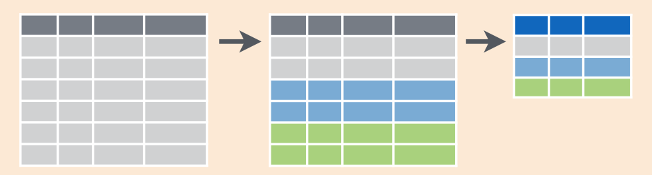
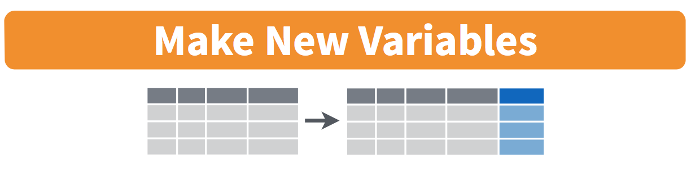

```{r, include=FALSE}
source("_common.R")
```

# 데이터 전처리 {#wrangling}

```{r setup_wrangling, include=FALSE, purl=FALSE}
# Used to define Learning Check numbers:
chap <- 3
lc <- 0

# Set R code chunk defaults:
knitr::opts_chunk$set(
  echo = TRUE,
  eval = TRUE,
  warning = FALSE,
  message = TRUE,
  tidy = FALSE,
  purl = TRUE,
  out.width = "\\textwidth",
  fig.height = 4,
  fig.align = "center"
)

# Set output digit precision
options(scipen = 99, digits = 3)

# In kable printing replace all NA's with blanks:
options(knitr.kable.NA = "")

# Set random number generator seed value for replicable pseudorandomness:
set.seed(76)
```

지금까지 우리는 제 \@ref(getting-started)장에서 `glimpse()`와 `View()` 함수를 사용하여 데이터 프레임에 저장된 데이터를 탐색하는 방법과, 제 \@ref(viz)장에서 `ggplot2` 패키지를 사용하여 데이터 시각화를 생성하는 방법을 살펴보았습니다. 특히 우리는 "다섯 가지 주요 그래프"(5NG)라고 부르는 다음 그래프들을 공부했습니다.

1. `geom_point()`를 이용한 산점도
1. `geom_line()`을 이용한 선 그래프
1. `geom_boxplot()`을 이용한 박스 플롯
1. `geom_histogram()`을 이용한 히스토그램
1. `geom_bar()` 또는 `geom_col()`을 이용한 막대 그래프

우리는 데이터 프레임의 변수를 5가지 `geom` 객체 중 하나의 미적 속성에 매핑하는 그래픽 문법을 사용하여 이러한 시각화를 생성했습니다. 또한 그림 \@ref(fig:gapminder)의 Gapminder 데이터 예시에서 보았듯이 크기나 색상과 같은 기하학적 객체의 다른 미적 속성도 제어할 수 있습니다. 

이번 장에서는 데이터 프레임을 가져와 필요에 맞게 "전처리(wrangle)"(변형) 할 수 있게 해주는 `dplyr` 패키지의 일련의 데이터 전처리 함수들을 소개합니다. 이러한 함수들은 다음과 같습니다.

1. `filter()`: 데이터 프레임의 기존 행 중에서 하위 집합만 골라냅니다. 예를 들어, `alaska_flights` 데이터 프레임이 있습니다.
1. `summarize()`: 하나 이상의 열/변수를 *요약 통계량*으로 요약합니다. 요약 통계량의 예로는 박스 플롯에 관한 섹션 \@ref(boxplots)에서 보았던 기온의 중앙값과 사분위수 범위 등이 있습니다. 
1. `group_by()`: 행들을 그룹화합니다. 즉, 서로 다른 행들을 동일한 *그룹*의 일부로 할당합니다. 그런 다음 `group_by()`를 `summarize()`와 결합하여 각 그룹에 대한 요약 통계량을 *별도로* 보고할 수 있습니다. 예를 들어, 세 개의 `origin` 공항 전체에 대한 하나의 평균 출발 지연 시간(`dep_delay`)이 아니라, 각 세 공항에 대해 개별적으로 계산된 세 개의 평균 출발 지연 시간을 원한다고 가정해 봅시다.
1. `mutate()`: 기존 열/변수를 변형하여 새로운 열을 생성합니다. 예를 들어, 매시간 기온 기록을 화씨에서 섭씨로 변환하는 작업이 있습니다.
1. `arrange()`: 행을 정렬합니다. 예를 들어, `weather`의 행을 `temp`에 따라 오름차순 또는 내림차순으로 정렬합니다.
1. `join()`: "키(key)" 변수를 매칭하여 다른 데이터 프레임과 결합합니다. 즉, 이 두 데이터 프레임을 병합합니다.

데이터 프레임에서 수행하려는 작업을 설명하기 위해 `computer_code` 폰트를 사용한 것에 주목하세요. 이는 데이터 전처리를 위한 `dplyr` 패키지가 기억하기 쉬운 직관적인 동사 이름의 함수들을 가지고 있기 때문입니다. 

데이터 전처리를 위해 `dplyr` 패키지 사용법을 배우는 것에는 또 다른 이점이 있습니다. 바로 데이터베이스 쿼리 언어인 [SQL](https://en.wikipedia.org/wiki/SQL)("시퀄"이라고 발음하거나 "S", "Q", "L"로 읽음)과의 유사성입니다. SQL("Structured Query Language"의 약자)은 대규모 데이터베이스를 빠르고 효율적으로 관리하는 데 사용되며, 많은 데이터를 보유한 여러 기관에서 널리 사용됩니다. SQL은 데이터베이스 관리에 관한 책이나 강의에서 다룰 주제이긴 하지만, `dplyr`을 배우고 나면 SQL도 쉽게 배울 수 있다는 점을 기억하세요. 소섹션 \@ref(normal-forms)에서 이들의 유사성에 대해 더 자세히 이야기하겠습니다.


### 필요한 패키지 {-#wrangling-packages}

이번 장에 필요한 모든 패키지를 로드해 봅시다(앞서 이미 설치했다고 가정합니다). 필요한 경우 R 패키지 설치 및 로드 방법에 대한 정보는 섹션 \@ref(packages)를 참고하세요.

```{r, message=FALSE}
library(dplyr)
library(ggplot2)
library(nycflights13)
```

```{r message=FALSE, warning=FALSE, echo=FALSE, purl=FALSE}
# Packages needed internally, but not in text.
library(kableExtra)
library(readr)
library(stringr)
library(scales)
```


## 파이프 연산자: `%>%` {#piping}

데이터 전처리를 시작하기 전에, 먼저 `dplyr` 패키지와 함께 로드되는 아주 유용한 도구인 \index{operators!pipe} 파이프 연산자 `%>%`를 소개하겠습니다. 파이프 연산자를 사용하면 R의 여러 작업을 하나의 순차적인 작업 *체인(chain)*으로 결합할 수 있습니다.

가상의 예시부터 시작해 보죠. 가상의 데이터 프레임 `x`에 대해 가상의 함수 `f()`, `g()`, `h()`를 사용하여 다음과 같은 가상의 작업 시퀀스를 수행하고 싶다고 가정해 봅시다.

1. `x`를 가져온 *다음*
1. `x`를 함수 `f()`의 입력값으로 사용한 *다음*
1. `f(x)`의 출력값을 함수 `g()`의 입력값으로 사용한 *다음*
1. `g(f(x))`의 출력값을 함수 `h()`의 입력값으로 사용합니다.

이러한 작업 시퀀스를 수행하는 한 가지 방법은 다음과 같이 중첩된 괄호를 사용하는 것입니다.

```{r, eval=FALSE, purl=FALSE}
h(g(f(x)))
```

이 코드는 `f()`, `g()`, `h()`라는 세 개의 함수만 적용하고 각 함수의 이름이 짧기 때문에 읽기가 그리 어렵지 않습니다. 또한 각 함수가 하나의 인자만 가지고 있습니다. 하지만 시퀀스에 적용되는 함수의 수가 늘어나고 각 함수의 인자도 늘어남에 따라 코드를 읽기가 점차 힘들어질 것임을 짐작할 수 있습니다. 여기서 파이프 연산자 `%>%`가 유용하게 쓰입니다. `%>%`는 한 함수의 출력값을 가져와 다음 함수의 입력값으로 "전달(pipe)"합니다. 또한, `%>%`를 "그 다음(then)" 또는 "그리고 나서(and then)"라고 읽으면 도움이 됩니다. 예를 들어, 위와 동일한 출력값을 다음과 같이 얻을 수 있습니다.

```{r, eval=FALSE, purl=FALSE}
x %>% 
  f() %>% 
  g() %>% 
  h()
```

이 시퀀스를 다음과 같이 읽을 수 있습니다.

1. `x`를 가져온 *다음*
1. 이 출력값을 다음 함수 `f()`의 입력값으로 사용한 *다음*
1. 이 출력값을 다음 함수 `g()`의 입력값으로 사용한 *다음*
1. 이 출력값을 다음 함수 `h()`의 입력값으로 사용합니다.

두 접근 방식 모두 동일한 목표를 달성하지만, 후자가 훨씬 인간 친화적인 읽기 방식입니다. 작업 시퀀스를 한 줄씩 명확하게 읽을 수 있기 때문입니다. 그런데 가상의 `x`, `f()`, `g()`, `h()`는 무엇일까요? 이 데이터 전처리 장 전체에서 다음과 같이 적용됩니다.

1. 시작 값 `x`는 데이터 프레임이 될 것입니다. 예를 들어, 섹션 \@ref(nycflights13)에서 탐색한 \index{R packages!nycflights13} `flights` 데이터 프레임입니다.
1. 함수의 시퀀스(여기서는 `f()`, `g()`, `h()`)는 대부분 이번 장의 서론에서 나열한 6가지 데이터 전처리 동사 이름의 함수들로 이루어진 시퀀스가 될 것입니다. 예를 들어, 앞서 미리 보았던 `filter(carrier == "AS")` 함수와 지정된 인자가 있습니다.
1. 결과는 여러분이 원하는 변형/수정된 데이터 프레임이 될 것입니다. 우리 예제에서는 `alaska_flights <-`와 같이 `<-` 할당 연산자를 사용하여 결과를 `alaska_flights`라는 새로운 데이터 프레임에 저장할 것입니다.

```{r, eval=FALSE}
alaska_flights <- flights %>% 
  filter(carrier == "AS")
```

`+` 기호를 사용하여 `ggplot()`에 레이어를 추가할 때와 마찬가지로, 파이프 연산자 `%>%`를 사용하여 동사 이름의 함수들을 하나의 시퀀스로 결합함으로써 단일 데이터 전처리 작업 *체인*을 형성합니다. 또한, 그래프를 구성할 때 `+` 기호가 줄 끝에 와야 하는 것처럼 파이프 연산자 `%>%` 도 줄 끝에 와야 합니다. 

이번 장 서론에 나열된 6가지 함수 외에도 훨씬 더 많은 고급 데이터 전처리 함수가 있다는 점을 기억하세요. 섹션 \@ref(other-verbs)에서 그 예시들을 보게 될 것입니다. 하지만 이 6가지 동사 이름의 함수만으로도 이 책의 나머지 부분에서 광범위한 데이터 전처리 작업을 수행할 수 있을 것입니다.


## `filter` 행 추출 {#filter}

```{r filter, fig.cap="filter() 행 추출 작업의 다이어그램.", echo=FALSE, purl=FALSE}

```

여기서 \index{dplyr!filter} `filter()` 함수는 마이크로소프트 엑셀의 "필터" 옵션과 매우 유사하게 작동합니다. 데이터셋의 변수 값에 대한 기준을 지정하면 해당 기준과 일치하는 행만 필터링하여 추출할 수 있습니다.

뉴욕 시에서 오리건주 포틀랜드로 가는 항공편에만 집중해 봅시다. 오리건주 포틀랜드의 공항 코드(또는 목적지 코드) `dest`는 `"PDX"`입니다. 다음 코드를 실행하고 RStudio의 스프레드시트 뷰어에서 결과를 확인하여 포틀랜드로 향하는 항공편만 선택되었는지 확인하세요.

```{r, eval=FALSE}
portland_flights <- flights %>% 
  filter(dest == "PDX")
View(portland_flights)
```

코드의 순서에 주목하세요. 먼저 `flights` 데이터 프레임을 가져온 *다음*, `dest`가 `"PDX"`와 같은 행만 포함되도록 데이터 프레임을 `filter()`합니다. 같음 여부를 테스트할 때는 단일 등호 `=`가 아니라 \index{operators!==} `==`와 같이 이중 등호를 사용합니다. 즉, `filter(dest = "PDX")`는 오류를 발생시킵니다. 이는 많은 프로그래밍 언어에서의 관례입니다. 코딩이 처음이라면 익숙해지기 전까지 이중 등호 `==`를 사용하는 것을 몇 번 잊어버릴 수도 있습니다.

같음 여부를 테스트하는 `==` 연산자 외에도 다른 연산자 \index{operators}를 사용할 수 있습니다.

- `>` : "~보다 큰"
- `<` : "~보다 작은"
- `>=` : "~보다 크거나 같은"
- `<=` : "~보다 작거나 같은"
- `!=` : "~와 같지 않은". 많은 프로그래밍 언어에서 `!`는 "부정(not)"을 나타내는 데 사용됩니다.

또한 비교 연산자를 사용하여 여러 기준을 결합할 수 있습니다.

- `|` : "또는(or)"
- `&` : "그리고(and)"

이러한 기능들을 실제로 확인해 보기 위해, JFK 공항에서 출발 *하고*, 목적지가 벌링턴(`"BTV"`) *또는* 시애틀(`"SEA"`) *이며*, 10월, 11월, 12월에 출발한 모든 항공편을 `flights`에서 필터링해 봅시다. 다음 코드를 실행하세요.

```{r, eval=FALSE}
btv_sea_flights_fall <- flights %>% 
  filter(origin == "JFK" & (dest == "BTV" | dest == "SEA") & month >= 10)
View(btv_sea_flights_fall)
```

일상적으로는 "벌링턴 *그리고* 시애틀로 가는 모든 항공편"이라고 말할 수 있지만, 컴퓨터 연산 측면에서는 "벌링턴으로 가거나 *또는* 시애틀로 가는 모든 항공편"을 의미합니다. 데이터의 특정 행에서 `dest`는 `"BTV"`일 수도 있고, `"SEA"`일 수도 있으며, 혹은 다른 것일 수도 있지만 동시에 `"BTV"`이면서 `"SEA"`일 수는 없기 때문입니다. 또한 `dest == "BTV" | dest == "SEA"` 주위에 괄호를 신중하게 사용한 점에 주목하세요.

종종 `&`의 사용을 건너뛰고 쉼표로 조건을 구분할 수도 있습니다. 위 코드는 다음 코드와 동일한 결과인 `btv_sea_flights_fall`을 반환합니다.

```{r, eval=FALSE}
btv_sea_flights_fall <- flights %>% 
  filter(origin == "JFK", (dest == "BTV" | dest == "SEA"), month >= 10)
View(btv_sea_flights_fall)
```

이번에는 기준과 일치하지 *않는* 행을 선택하기 위해 \index{operators!not} `!` "not" 연산자를 사용하는 또 다른 예시를 살펴보겠습니다. 앞서 언급했듯이 `!`는 "~가 아닌"으로 읽을 수 있습니다. 여기서는 벌링턴이나 시애틀로 가지 않은 항공편에 해당하는 행들을 필터링합니다.

```{r, eval=FALSE}
not_BTV_SEA <- flights %>% 
  filter(!(dest == "BTV" | dest == "SEA"))
View(not_BTV_SEA)
```

다시 한번 `(dest == "BTV" | dest == "SEA")` 주위에 괄호를 신중하게 사용한 점에 주목하세요. 만약 다음과 같이 괄호를 사용하지 않는다면 어떨까요?

```{r, eval=FALSE}
flights %>% filter(!dest == "BTV" | dest == "SEA")
```

이 경우 `"BTV"`로 향하지 않는 모든 항공편 *또는* `"SEA"`로 향하는 모든 항공편을 반환하게 되는데, 이는 전혀 다른 결과의 데이터 프레임입니다. 

이제 필터링하려는 공항의 수가 더 많아졌다고 가정해 봅시다. 예를 들어 `"SEA"`, `"SFO"`, `"PDX"`, `"BTV"`, `"BDL"`입니다. 계속해서 `|` (*또는*) \index{operators!or} 연산자를 사용할 수도 있습니다.

```{r, eval=FALSE}
many_airports <- flights %>% 
  filter(dest == "SEA" | dest == "SFO" | dest == "PDX" | 
         dest == "BTV" | dest == "BDL")
```

하지만 포함하려는 공항이 점차 늘어날수록 코드를 작성하기가 번거로워질 것입니다. 조금 더 짧은 접근 방식은 `c()` 함수와 함께 `%in%` \index{operators!in} 연산자를 사용하는 것입니다. 소섹션 \@ref(programming-concepts)에서 배운 대로 `c()` 함수는 값들을 하나의 값 *벡터(vector)*로 "결합"하거나 "연결"합니다. \index{vectors}

```{r, eval=FALSE}
many_airports <- flights %>% 
  filter(dest %in% c("SEA", "SFO", "PDX", "BTV", "BDL"))
View(many_airports)
```

이 코드는 `dest`가 공항 벡터 `c("BTV", "SEA", "PDX", "SFO", "BDL")`에 포함된 모든 항공편에 대해 `flights`를 필터링하는 것입니다. `many_airports`의 두 결과는 동일하지만, 보시는 것처럼 후자가 코딩하는 데 훨씬 적은 노력이 듭니다. `%in%` 연산자는 하나의 벡터/변수에서 다른 것과 비교하여 일치하는 항목을 찾는 데 매우 유용합니다.

마지막으로, `filter()`는 데이터에 적용할 때 가장 먼저 고려해야 할 동사 중 하나임을 권장합니다. 이를 통해 여러분이 관심을 갖는 행들로만 데이터셋을 정제할 수 있으며, 다시 말해 데이터 프레임의 범위를 관심 있는 관측치들로 좁혀줍니다. 

```{block lc-filter, type="learncheck", purl=FALSE}
\vspace{-0.15in}
**_학습 확인_**
\vspace{-0.1in}
```

**`r paste0("(LC", chap, ".", (lc <- lc + 1), ")")`** `flights` 데이터 프레임에서 벌링턴이나 시애틀로 가지 않는 행들만 필터링하기 위해 "not" 연산자 `!`를 사용하는 또 다른 방법은 무엇일까요? 앞선 코드를 사용하여 이를 테스트해 보세요.

```{block, type="learncheck", purl=FALSE}
\vspace{-0.25in}
\vspace{-0.25in}
```


## `summarize` 변수 요약 {#summarize}

데이터 프레임으로 작업할 때 다음으로 흔히 수행하는 작업은 *요약 통계량*을 계산하는 것입니다. \index{summary statistics} 요약 통계량은 수많은 값을 하나의 수치로 요약한 값입니다. 흔히 알려진 요약 통계량의 예로는 평균(mean)과 중앙값(median)이 있습니다. 즉시 떠오르지 않을 수도 있는 다른 요약 통계량으로는 *합계(sum)*, 최솟값인 *최소(minimum)*, 최댓값인 *최대(maximum)*, 그리고 *표준편차(standard deviation)* 등이 있습니다. 이러한 요약 통계량에 대한 용어 사전은 부록 \@ref(appendix-stat-terms)를 참조하세요.

`weather` 데이터 프레임에 있는 `temp` 기온 변수의 두 가지 요약 통계량인 평균과 표준편차를 계산해 봅시다 (섹션 \@ref(nycflights13)에서 보았듯이 `weather` 데이터 프레임은 `nycflights13` 패키지에 포함되어 있습니다). 이러한 요약 통계량을 계산하려면 R의 `mean()`과 `sd()` *요약 함수*가 필요합니다. 그림 \@ref(fig:summary-function)에서 알 수 있듯이, R의 요약 함수는 여러 값을 입력받아 단일 값을 반환합니다. 

```{r summary-function, fig.cap="R의 요약 함수를 설명하는 다이어그램.", echo=FALSE, purl=FALSE, fig.height=1.5}

options(knitr.kable.NA = "NA")
```

더 정확하게는 `dplyr` 패키지의 `summarize()` \index{dplyr!summarize()} 함수 내에서 `mean()`과 `sd()` 요약 함수를 사용할 것입니다. 참고로 영국식 영어 철자인 `summarise()`도 사용할 수 있습니다. 그림 \@ref(fig:sum1)에서 보듯이 `summarize()` 함수는 데이터 프레임을 입력받아 요약 통계량에 해당하는 단 하나의 행만 있는 데이터 프레임을 반환합니다. 

```{r sum1, fig.cap="summarize() 행 요약 다이어그램.", echo=FALSE, purl=FALSE, out.height="80%", out.width="80%"}
knitr::include_graphics("images/cheatsheets/summarize1.png")
```

결과를 `mean`과 `std_dev`라는 두 개의 열/변수를 가진 `summary_temp`라는 새로운 데이터 프레임에 저장할 것입니다.

```{r}
summary_temp <- weather %>% 
  summarize(mean = mean(temp), std_dev = sd(temp))
summary_temp
```

왜 반환된 값이 `NA`일까요? 소섹션 \@ref(geompoint)에서 `alaska_flights`의 출발 및 도착 지연 시간 산점도를 생성할 때 보았듯이, `NA`는 R에서 *결측값(missing values)* \index{missing values}을 인코딩하는 방식입니다. 여기서 `NA`는 "기록 없음(not available)" 또는 "해당 없음(not applicable)"을 나타냅니다. 특정 행과 특정 열의 값이 존재하지 않으면 대신 `NA`가 저장됩니다. 값은 여러 가지 이유로 누락될 수 있습니다. 데이터를 수집했지만 누군가 입력을 잊었을 수도 있고, 수집하기가 너무 어려워 아예 수집하지 못했을 수도 있습니다. 혹은 누군가 잘못 입력한 값을 결측값으로 수정했을 수도 있습니다. 실제 데이터를 다룰 때 결측값 문제는 자주 발생합니다.

다시 `summary_temp` 출력값으로 돌아가 보면, 기본적으로 R에서 하나 이상의 `NA` 결측값이 있는 변수의 요약 통계량을 계산하려고 하면 `NA`가 반환됩니다. 이 사실을 우회하려면 `na.rm` 인자를 `TRUE`로 설정하면 됩니다. 여기서 `rm`은 "제거(remove)"의 약자입니다. 이렇게 하면 모든 `NA` 결측값을 무시하고 결측값이 없는 모든 값에 대한 요약값만 반환합니다. 

다음 코드는 `temp`의 결측값이 아닌 모든 값의 평균과 표준편차를 계산합니다.

```{r}
summary_temp <- weather %>% 
  summarize(mean = mean(temp, na.rm = TRUE), 
            std_dev = sd(temp, na.rm = TRUE))
summary_temp
```

`na.rm = TRUE` \index{functions!na.rm argument} 인자가 `summarize()` 함수가 아니라 `mean()` \index{mean()} 및 `sd()` \index{sd()} 요약 함수에 각각 개별적으로 사용되었음에 주목하세요. 

하지만 방금 한 것처럼 결측값을 무시할 때는 주의가 필요합니다. 이어지는 *학습 확인* 문제에서 결측값이 있는 행을 맹목적으로 무시할 때 발생할 수 있는 잠재적인 결과에 대해 생각해 볼 것입니다. 이것이 실제로 R의 모든 요약 통계 함수에서 `na.rm` 인자의 기본값이 `FALSE`로 설정된 이유이기도 합니다. 즉, R은 기본적으로 결측값이 있는 행을 무시하지 않습니다. R은 결측 데이터의 존재를 사용자에게 알리고 있으며, 분석 전반에 걸쳐 이러한 결측값과 그 잠재적 원인에 유의해야 합니다.

요약 통계량을 계산하기 위해 `summarize()` 동사 안에서 사용할 수 있는 다른 요약 함수에는 무엇이 있을까요? 그림 \@ref(fig:summary-function)의 다이어그램에서 보았듯이, 여러 값을 입력받아 단 하나를 반환하는 R의 모든 함수를 사용할 수 있습니다. 다음은 그 몇 가지 예입니다.

* `mean()`: 평균
* `sd()`: 데이터의 퍼짐 정도를 측정하는 표준편차
* `min()` 및 `max()`: 각각 최솟값과 최댓값
* `IQR()`: 사분위수 범위
* `sum()`: 여러 숫자를 더한 총합
* `n()`: 각 그룹의 행 개수 카운트. 이 특정 요약 함수는 섹션 \@ref(groupby)에서 `group_by()`를 다룰 때 더 확실히 이해될 것입니다.

```{block lc-summarize, type="learncheck", purl=FALSE}
\vspace{-0.15in}
**_학습 확인_**
\vspace{-0.1in}
```

**`r paste0("(LC", chap, ".", (lc <- lc + 1), ")")`** 한 의사가 5년 간격으로 기록이 측정된 수많은 환자를 대상으로 흡연이 폐암에 미치는 영향을 연구하고 있다고 가정해 봅시다. 그녀는 많은 환자가 사망하여 데이터 포인트가 누락된 것을 발견하고, 분석에서 이 환자들을 무시하기로 결정했습니다. 이 의사의 접근 방식의 문제점은 무엇인가요?

**`r paste0("(LC", chap, ".", (lc <- lc + 1), ")")`** 이전에 `summary_temp` 데이터 프레임을 생성했던 `summarize()` 함수 코드를 수정하여 `n()` 요약 함수도 사용해 보세요 (`summarize(... , count = n())`). 반환된 값은 무엇을 의미하나요?

**`r paste0("(LC", chap, ".", (lc <- lc + 1), ")")`** 왜 다음 코드는 작동하지 않을까요? 코드를 한꺼번에 실행하지 말고 한 줄씩 실행한 후 데이터를 살펴보세요. 즉, `summary_temp <- weather %>% summarize(mean = mean(temp, na.rm = TRUE))`를 먼저 실행해 보세요.

```{r eval=FALSE}
summary_temp <- weather %>%   
  summarize(mean = mean(temp, na.rm = TRUE)) %>% 
  summarize(std_dev = sd(temp, na.rm = TRUE))
```

```{block, type="learncheck", purl=FALSE}
\vspace{-0.25in}
\vspace{-0.25in}
```


## `group_by` 행 그룹화 {#groupby}

<!-- To get `_` to work in caption title. Found at https://github.com/rstudio/bookdown/issues/209 -->
(ref:groupby) group_by()와 summarize()의 다이어그램.

```{r groupsummarize, fig.cap="(ref:groupby)", echo=FALSE, purl=FALSE, fig.height=2.5}

```

일 년 전체에 대한 단일 평균 기온 대신, 12개월 각각에 대한 12개의 평균 기온을 원한다고 가정해 봅시다. 다시 말해, 월별로 나누어 평균 기온을 계산하고 싶습니다. 이를 위해 기온 관측치를 다른 변수의 값(이 경우는 `month` 변수의 12개 값)에 따라 "그룹화"할 수 있습니다. 다음 코드를 실행하세요.

<!--
New dplyr warning message when running group_by() %>% summarize() that is not
addressed in v1 (print edition). 
See https://github.com/moderndive/ModernDive_book/issues/353

For now we suppress this message in the book by setting 
options(dplyr.summarise.inform = FALSE) in index.Rmd

v2 TODO: Address this warning message explicitly in text and fix index.Rmd
-->
```{r}
summary_monthly_temp <- weather %>% 
  group_by(month) %>% 
  summarize(mean = mean(temp, na.rm = TRUE), 
            std_dev = sd(temp, na.rm = TRUE))
summary_monthly_temp
```

이 코드는 `summary_temp`를 생성했던 이전 코드와 거의 동일하지만, `summarize()` 앞에 `group_by(month)`가 추가되었습니다. `weather` 데이터셋을 `month`로 그룹화한 다음 `summarize()` 함수를 적용하면 일 년 중 12개월로 나뉜 평균 및 표준편차 기온을 보여주는 데이터 프레임이 생성됩니다.

\index{dplyr!group\_by()} `group_by()` 함수 자체가 데이터 프레임을 직접 변경하지 않는다는 점을 기억하는 것이 중요합니다. 대신 데이터에 대한 데이터인 *메타데이터(meta-data)* \index{meta-data}, 구체적으로는 그룹화 구조를 변경합니다. 데이터 프레임이 실제로 변하는 것은 `summarize()` 함수를 적용한 이후입니다. 

예를 들어, `ggplot2` 패키지에 포함된 \index{ggplot2!diamonds} `diamonds` 데이터 프레임을 살펴봅시다. 다음 코드를 실행하세요.

```{r}
diamonds
```

출력의 첫 번째 줄이 ``# A tibble: `r diamonds %>% nrow() %>% comma()` x `r diamonds %>% ncol()` ``로 시작하는 것을 확인하세요. 이는 메타데이터의 한 예로, 여기서는 `diamonds`의 관측치/행 수와 변수/열 수를 나타냅니다. 실제 데이터는 그 아래에 있는 값들의 표입니다. 이제 `diamonds` 데이터 프레임을 `group_by(cut)`으로 전달해 봅시다.

```{r}
diamonds %>% 
  group_by(cut)
```

```{r echo=FALSE, purl=FALSE}
# This code is used for dynamic non-static in-line text output purposes
cut_levels <- diamonds %>%
  select(cut) %>%
  n_distinct()
```

이제 추가적인 메타데이터가 나타납니다. ``# Groups: cut [`r cut_levels`]``는 범주형 변수인 `cut`의 `r cut_levels`가지 가능한 수준(`"Fair"`, `"Good"`, `"Very Good"`, `"Premium"`, `"Ideal"`)을 기준으로 그룹화 구조 메타데이터가 설정되었음을 나타냅니다. 반면, 데이터 자체는 변하지 않았습니다. 여전히 `r diamonds %>% nrow() %>% comma()` $\times$ `r diamonds %>% ncol()` 크기의 표입니다.

`group_by()`를 다른 데이터 전처리 작업(이 경우에는 `summarize()`)과 결합해야만 데이터가 실제로 변형됩니다. 

```{r}
diamonds %>% 
  group_by(cut) %>% 
  summarize(avg_price = mean(price))
```

이러한 그룹화 구조 메타데이터를 제거하려면 결과 데이터 프레임을 \index{dplyr!ungroup()} `ungroup()` 함수로 전달하면 됩니다.

```{r}
diamonds %>% 
  group_by(cut) %>% 
  ungroup()
```

``# Groups: cut [`r cut_levels`]`` 메타데이터가 더 이상 보이지 않는 것을 확인하세요. 

앞서 잠깐 소개했던 `n()` \index{dplyr!n()} 행 개수 카운트 요약 함수를 다시 살펴보겠습니다. `n()` 함수는 행의 개수를 센다는 점을 기억하세요. 이는 수치형 변수의 합계를 반환하는 `sum()` 요약 함수와 대조됩니다. 예를 들어, 뉴욕 시의 세 공항에서 각각 몇 개의 항공편이 출발했는지 세어보고 싶다고 가정해 봅시다.

```{r}
by_origin <- flights %>% 
  group_by(origin) %>% 
  summarize(count = n())
by_origin
```

2013년에 뉴어크(`"EWR"`) 공항에서 가장 많은 항공편이 출발했고, `"JFK"`, 그리고 마지막으로 라과디아(`"LGA"`) 공항 순으로 이어졌음을 알 수 있습니다. `sum()`과 `n()` 사이에는 미묘하지만 중요한 차이가 있습니다. `sum()`은 수치형 변수의 합계를 반환하는 반면, `n()`은 행/관측치의 개수(카운트)를 반환합니다. 


### 두 개 이상의 변수로 그룹화하기

꼭 하나의 변수로만 그룹화할 수 있는 것은 아닙니다. 예를 들어, 세 개의 뉴욕 공항에서 출발하는 항공편 수를 *월별로* 알고 싶다고 가정해 봅시다. `group_by(origin, month)`를 사용하여 두 번째 변수인 `month`로 함께 그룹화할 수 있습니다.

```{r}
by_origin_monthly <- flights %>% 
  group_by(origin, month) %>% 
  summarize(count = n())
by_origin_monthly
```

3개의 공항(`EWR`, `JFK`, `LGA`)에 대해 각각 12개월이 있으므로 `by_origin_monthly`에는 총 `r by_origin_monthly %>% nrow()`개의 행이 있음을 확인하세요. 

왜 `group_by(origin)`을 한 다음 `group_by(month)`를 하지 않고 `group_by(origin, month)`와 같이 할까요? 한번 확인해 봅시다.

```{r}
by_origin_monthly_incorrect <- flights %>% 
  group_by(origin) %>% 
  group_by(month) %>% 
  summarize(count = n())
by_origin_monthly_incorrect
```

여기서 일어난 일은 두 번째 `group_by(month)`가 이전 `group_by(origin)`의 그룹화 구조 메타데이터를 덮어써서, 결국 `month`로만 그룹화하게 된 것입니다. 여기서 얻을 수 있는 교훈은, 두 개 이상의 변수로 `group_by()`를 하려면 모든 변수를 같은 `group_by()` 안에 넣고 쉼표로 변수 이름을 구분해야 한다는 것입니다.

```{block lc-groupby, type="learncheck", purl=FALSE}
\vspace{-0.15in}
**_학습 확인_**
\vspace{-0.1in}
```

**`r paste0("(LC", chap, ".", (lc <- lc + 1), ")")`** 뉴욕 시의 월별 기온을 살펴봤던 제 \@ref(viz)장을 떠올려 보세요. `summary_monthly_temp` 데이터 프레임의 표준편차 열은 일 년 동안 뉴욕 시의 기온에 대해 무엇을 말해주나요?

**`r paste0("(LC", chap, ".", (lc <- lc + 1), ")")`** 2013년 뉴욕 시의 매일매일 평균 기온과 표준편차를 구하려면 어떤 코드가 필요할까요?

**`r paste0("(LC", chap, ".", (lc <- lc + 1), ")")`** `by_monthly_origin`을 다시 만들어 보되, `group_by(origin, month)` 대신 변수 순서를 바꿔서 `group_by(month, origin)`으로 그룹화해 보세요. 결과 데이터셋에서 무엇이 달라지나요?

**`r paste0("(LC", chap, ".", (lc <- lc + 1), ")")`** 세 개의 공항에서 각 항공사(`carrier`)별로 얼마나 많은 항공편이 출발했는지 어떻게 확인할 수 있을까요?

**`r paste0("(LC", chap, ".", (lc <- lc + 1), ")")`** `filter()` 작업은 `group_by()` 다음에 `summarize()`가 오는 작업과 어떻게 다른가요?

```{block, type="learncheck", purl=FALSE}
\vspace{-0.25in}
\vspace{-0.25in}
```


## `mutate` 기존 변수 변형 {#mutate}

```{r select, fig.cap="mutate() 열 변형 작업의 다이어그램.", echo=FALSE, purl=FALSE, out.height='80%', out.width='80%'}

```

데이터의 또 다른 일반적인 변형은 기존 변수를 기반으로 새로운 변수를 생성하거나 계산하는 것입니다. 예를 들어, 화씨(&deg;F) 기온보다 섭씨(&deg;C) 기온으로 생각하는 것이 더 익숙하다고 가정해 봅시다. 화씨를 섭씨로 변환하는 공식은 다음과 같습니다.

$$
\text{섭씨 기온} = \frac{\text{화씨 기온} - 32}{1.8}
$$

기존 변수를 가져와 새로운 변수로 변형하는 `dplyr` 패키지의 `mutate()` \index{dplyr!mutate()} 함수를 사용하여 `temp` 변수에 이 공식을 적용할 수 있습니다. 

```{r, eval=TRUE}
weather <- weather %>% 
  mutate(temp_in_C = (temp - 32) / 1.8)
```

이 코드에서는 새로운 변수 `temp_in_C = (temp - 32) / 1.8`을 생성하여 `weather` 데이터 프레임을 `mutate()`한 다음, 기존의 `weather` 데이터 프레임을 *덮어씁니다*. 왜 `weather_new`와 같은 새로운 데이터 프레임에 결과를 할당하지 않고 기존의 `weather` 데이터 프레임을 덮어썼을까요? 대략적인 규칙으로, 나중에 필요할 수 있는 원본 정보를 잃지 않는 한 위와 같이 기존 데이터 프레임을 업데이트된 것으로 덮어쓰는 것은 허용되는 관행입니다. 반대로, 왜 `temp` 변수를 덮어쓰지 않고 `temp_in_C`라는 새로운 변수를 만들었을까요? 만약 `temp`를 덮어썼다면 여전히 가치가 있을 수 있는 화씨 기온 정보를 지워버렸을 것이기 때문입니다.

이제 섹션 \@ref(groupby)에서 보았던 `group_by()`와 `summarize()` 코드를 사용하여 화씨와 섭씨 모두에 대한 월별 평균 기온을 계산해 봅시다.

```{r}
summary_monthly_temp <- weather %>% 
  group_by(month) %>% 
  summarize(mean_temp_in_F = mean(temp, na.rm = TRUE), 
            mean_temp_in_C = mean(temp_in_C, na.rm = TRUE))
summary_monthly_temp
```

또 다른 예시를 들어보겠습니다. 승객들은 종종 비행기가 늦게 출발할 때 짜증을 내지만, 비행 중에 조종사가 시간을 단축하여 결국 정시에 도착하거나 늦지 않게 도착한다면 크게 신경 쓰지 않을 것입니다. 항공업계에서는 이를 _gain_(시간 단축)이라고 하며, `mutate()` 함수를 사용하여 이 변수를 만들어 보겠습니다.

```{r}
flights <- flights %>% 
  mutate(gain = dep_delay - arr_delay)
```

업데이트된 `flights` 데이터 프레임에서 처음 5개 행에 대해 `dep_delay`, `arr_delay`, 그리고 그 결과인 `gain` 변수만 표 \@ref(tab:first-five-flights)에서 살펴보겠습니다.

```{r first-five-flights, echo=FALSE, purl=FALSE}
flights %>% 
  select(dep_delay, arr_delay, gain) %>% 
  slice(1:5) %>% 
  kbl(
    caption = "출발/도착 지연 시간 및 gain 변수의 처음 5개 행"
  ) %>%
  kable_styling(position = "center", latex_options = "hold_position")
```

첫 번째 행의 항공편은 2분 늦게 출발했지만 11분 늦게 도착했습니다. 따라서 "공중에서 단축한 시간"은 9분의 손실이 발생하여 `gain`은 2 - 11 = -9가 됩니다. 반면 네 번째 행의 항공편은 1분 일찍 출발(`dep_delay`가 -1)했지만 18분 일찍 도착(`arr_delay`가 -18)했습니다. 따라서 "공중에서 단축한 시간"은 $-1 - (-18) = -1 + 18 = 17$분이 되어 `gain`은 +17이 됩니다.

`summarize()` 코드 안에서 여러 요약 함수를 동시에 사용하여 `gain` 변수의 요약 통계량을 살펴보겠습니다.

```{r}
gain_summary <- flights %>% 
  summarize(
    min = min(gain, na.rm = TRUE),
    q1 = quantile(gain, 0.25, na.rm = TRUE),
    median = quantile(gain, 0.5, na.rm = TRUE),
    q3 = quantile(gain, 0.75, na.rm = TRUE),
    max = max(gain, na.rm = TRUE),
    mean = mean(gain, na.rm = TRUE),
    sd = sd(gain, na.rm = TRUE),
    missing = sum(is.na(gain))
  )
gain_summary
```

예를 들어 평균 시간 단축은 +5분이고, 최대치는 +109분임을 알 수 있습니다! 하지만 이 코드를 실제로 다 입력하는 데는 시간이 꽤 걸릴 것입니다. 나중에 소섹션 \@ref(model1EDA)에서 다양한 일반 요약 통계량을 훨씬 더 간결하게 계산하는 방법인 `skimr` 패키지의 `skim()` 함수 사용법을 살펴볼 것입니다.

섹션 \@ref(histograms)에서 보았듯이 `gain`은 수치형 변수이므로 히스토그램을 사용하여 분포를 시각화할 수 있습니다. 

```{r gain-hist, fig.cap="gain 변수의 히스토그램.", message=FALSE, fig.height=3}
ggplot(data = flights, mapping = aes(x = gain)) +
  geom_histogram(color = "white", bins = 20)
```

그림 \@ref(fig:gain-hist)의 결과 히스토그램은 앞서 계산한 요약 통계량과는 또 다른 관점에서 `gain` 변수를 보여줍니다. 예를 들어, `gain` 변수의 대부분 값이 0 근처에 있음을 알 수 있습니다. 

새 변수를 생성하기 위한 `mutate()` 함수 논의를 마무리하며, 하나의 `mutate()` 코드 안에서 여러 개의 새 변수를 동시에 생성할 수 있다는 점을 기억하세요. 또한 동일한 `mutate()` 코드 내에서 방금 생성한 새로운 변수를 바로 참조할 수도 있습니다. Hadley Wickham \index{Wickham, Hadley}과 Garrett Grolemund \index{Grolemund, Garrett}가 *R for Data Science* [@rds2016]의 5장에서 보여주는 `mutate()` 코드 예시를 참고하세요.

```{r}
flights <- flights %>% 
  mutate(
    gain = dep_delay - arr_delay,
    hours = air_time / 60,
    gain_per_hour = gain / hours
  )
```

```{block lc-mutate, type="learncheck", purl=FALSE}
\vspace{-0.15in}
**_학습 확인_**
\vspace{-0.1in}
```

**`r paste0("(LC", chap, ".", (lc <- lc + 1), ")")`** `flights`에서 `gain` 변수의 양수 값은 무엇을 의미하나요? 음수 값은 어떠한가요? 그리고 0은 무엇을 의미하나요?

**`r paste0("(LC", chap, ".", (lc <- lc + 1), ")")`** 단순히 `sched_dep_time`에서 `dep_time`을 빼는 방식으로 `dep_delay` 및 `arr_delay` 열을 만들 수 있을까요? 코드를 실행해 보고 그 결과와 `flights`에 실제로 나타난 값 사이의 차이점을 설명해 보세요.

**`r paste0("(LC", chap, ".", (lc <- lc + 1), ")")`** `gain`의 분포에 대해 무엇을 말할 수 있을까요? 그래프와 `gain_summary` 데이터 프레임 값을 참고하여 몇 문장으로 설명해 보세요.

```{block, type="learncheck", purl=FALSE}
\vspace{-0.25in}
\vspace{-0.25in}
```


## `arrange` 행 정렬 {#arrange}

가장 흔히 수행되는 데이터 전처리 작업 중 하나는 데이터 프레임의 행을 특정 변수의 영문자 또는 숫자 순서대로 정렬하는 것입니다. `dplyr` 패키지의 `arrange()` 함수 \index{dplyr!arrange()}를 사용하면 지정된 변수의 값에 따라 데이터 프레임의 행을 정렬하거나 재정렬할 수 있습니다.

2013년 뉴욕 시에서 출발한 모든 국내선 항공편에 대해 가장 빈번한 목적지 공항이 어디인지 알아보고 싶다고 가정해 봅시다.

```{r}
freq_dest <- flights %>% 
  group_by(dest) %>% 
  summarize(num_flights = n())
freq_dest
```

기본적으로 결과 데이터 프레임 `freq_dest`의 행은 목적지 `dest`의 알파벳 순서대로 정렬되어 있습니다. 대신 항공편 수(`num_flights`)가 가장 많은 순서부터 적은 순서대로 정렬된 데이터를 보고 싶다면 다음과 같이 합니다.

```{r}
freq_dest %>% 
  arrange(num_flights)
```

하지만 이것은 우리가 원하는 것과 반대입니다. 행이 항공편 수가 가장 적은 목적지 공항부터 표시됩니다. 이는 `arrange()`가 기본적으로 항상 행을 오름차순으로 정렬하여 반환하기 때문입니다. 정렬 순서를 "내림차순"으로 바꾸려면 다음과 같이 `desc()` \index{dplyr!desc()} 함수를 사용합니다.

```{r}
freq_dest %>% 
  arrange(desc(num_flights))
```


## `join` 데이터 프레임 결합 {#joins}

또 다른 일반적인 데이터 변형 작업은 서로 다른 두 데이터셋을 "결합(joining)"하거나 "병합(merging)"하는 것입니다. 예를 들어, `flights` 데이터 프레임의 `carrier` 변수에는 각 항공편의 항공사 코드가 기록되어 있습니다. `"UA"`나 `"AA"`는 각각 United Airlines와 American Airlines로 쉽게 짐작할 수 있겠지만, `"VX"`, `"HA"`, `"B6"`는 어떤 항공사일까요? 이 정보는 별도의 데이터 프레임인 `airlines`에 들어 있습니다.

```{r eval=FALSE}
View(airlines)
```

`airlines`에서 `carrier`는 항공사 코드이고, `name`은 항공사 회사의 전체 이름임을 알 수 있습니다. 이 표를 통해 `"VX"`, `"HA"`, `"B6"`가 각각 Virgin America, Hawaiian Airlines, JetBlue에 해당한다는 것을 확인할 수 있습니다. 그런데 이 모든 정보를 두 개의 별도 데이터 프레임이 아닌 하나의 데이터 프레임에 모아서 볼 수 있다면 좋지 않을까요? `flights`와 `airlines` 데이터 프레임을 "결합"하여 이를 수행할 수 있습니다.

`flights` 데이터 프레임의 `carrier` 변수 값과 `airlines` 데이터 프레임의 `carrier` 변수 값이 일치한다는 점에 주목하세요. 이 경우 `carrier` 변수를 두 데이터 프레임의 행을 매칭하기 위한 \index{joining data!key variable} *키(key) 변수*로 사용할 수 있습니다. 키 변수는 거의 항상 소섹션 \@ref(identification-vs-measurement-variables)에서 보았던 것처럼 관측 단위를 고유하게 식별하는 *식별 변수*입니다. 이를 통해 결합 과정에서 두 데이터 프레임의 행이 적절하게 매칭됩니다. Hadley와 Garrett [@rds2016]은 `nycflights13` 패키지의 각 데이터 프레임이 다양한 키 변수로 어떻게 연결되는지 이해를 돕기 위해 그림 \@ref(fig:reldiagram)과 같은 다이어그램을 만들었습니다.

(ref:relationships-nycflights13) *R for Data Science*에 수록된 nycflights13 데이터 관계도.

```{r reldiagram, fig.cap="(ref:relationships-nycflights13)", echo=FALSE, purl=FALSE, out.height="120%"}
knitr::include_graphics("images/r4ds/relational-nycflights.png")
```


### 일치하는 "키(key)" 변수 이름

`flights`와 `airlines` 데이터 프레임 모두에서 결합/병합/매칭하려는 키 변수는 `carrier`라는 동일한 이름을 가집니다. `inner_join()` \index{dplyr!inner\_join()} 함수를 사용하여 두 데이터 프레임을 결합해 보겠습니다. 여기서 행은 `carrier` 변수를 기준으로 매칭됩니다. 결합 전후의 데이터 프레임을 비교해 보세요.

```{r eval=FALSE}
flights_joined <- flights %>% 
  inner_join(airlines, by = "carrier")
View(flights)
View(flights_joined)
```

`flights`와 `flights_joined` 데이터 프레임은 `flights_joined`에 `name`이라는 변수가 추가된 것을 제외하면 동일합니다. `name`의 값은 `airlines` 데이터 프레임에 명시된 항공사 이름에 해당합니다. 

`inner_join()`의 시각적 표현은 그림 \@ref(fig:ijdiagram) [@rds2016]에 나와 있습니다. `left_join()`, `right_join()`, `outer_join()`, `anti_join()` 등 다른 유형의 결합도 가능하지만, 이 책에서 다루는 대부분의 문제는 `inner_join()`으로 해결할 수 있습니다.

(ref:inner-join-r4ds) *R for Data Science*에 수록된 내부 결합(inner join) 다이어그램.

```{r ijdiagram, fig.cap="(ref:inner-join-r4ds)", echo=FALSE, purl=FALSE, out.height="120%"}
knitr::include_graphics("images/r4ds/join-inner.png")
```


### 서로 다른 "키(key)" 변수 이름 {#diff-key}

이번에는 2013년 뉴욕에서 출발하는 모든 국내선 항공편의 목적지에 대해 "이 공항들은 어떤 도시에 있을까?", "`"ORD"`가 올랜도인가?", "`"FLL"`은 어디지?"와 같은 질문이 생겼다고 가정해 봅시다.

`airports` 데이터 프레임에는 각 공항의 공항 코드가 포함되어 있습니다.

```{r eval=FALSE}
View(airports)
```

하지만 `airports`와 `flights` 데이터 프레임을 모두 살펴보면 공항 코드가 서로 다른 이름의 변수에 저장되어 있음을 알 수 있습니다. `airports`에서는 공항 코드가 `faa`에 있지만, `flights`에서는 `origin`과 `dest`에 있습니다. 이 사실은 그림 \@ref(fig:reldiagram)의 데이터 프레임 간 관계도에서도 명확히 확인할 수 있습니다.

공항 코드를 기준으로 이 두 데이터 프레임을 결합하기 위해 `inner_join()` 작업 시 키 변수 이름이 다른 경우에도 결합할 수 있도록 수정된 코드 문법인 `by = c("dest" = "faa")` \index{dplyr!inner\_join()!by} 인자를 사용합니다.

```{r, eval=FALSE}
flights_with_airport_names <- flights %>% 
  inner_join(airports, by = c("dest" = "faa"))
View(flights_with_airport_names)
```

뉴욕에서 각 목적지로 향하는 항공편 수를 계산하고 각 목적지 공항에 대한 정보도 포함하는 파이프 연산자 `%>%` 체인을 구축해 봅시다.

```{r}
named_dests <- flights %>%
  group_by(dest) %>%
  summarize(num_flights = n()) %>%
  arrange(desc(num_flights)) %>%
  inner_join(airports, by = c("dest" = "faa")) %>%
  rename(airport_name = name)
named_dests
```

참고로 `"ORD"`는 시카고 오헤어 공항의 코드이고, `"FLL"`은 플로리다주 포트로더데일의 주요 공항 코드임을 `airport_name` 변수를 통해 확인할 수 있습니다.


### 여러 개의 "키(key)" 변수

*여러 개의 키 변수*를 사용하여 두 데이터 프레임을 결합하고 싶을 때도 있습니다. 예를 들어 그림 \@ref(fig:reldiagram)에서 보듯이 `flights`와 `weather` 데이터 프레임을 결합하려면 `year`, `month`, `day`, `hour`, `origin`이라는 5개의 키 변수가 필요합니다. 그 이유는 이 5개 변수의 조합이 `weather` 데이터 프레임의 각 관측 단위(뉴욕의 3개 공항에서 매시간 측정된 기상 정보)를 고유하게 식별하기 때문입니다.

`c()` 함수를 사용하여 결합할 키 변수들의 *벡터*를 지정하면 됩니다. 소섹션 \@ref(programming-concepts)에서 배운 것처럼 `c()`는 "결합" 또는 "연결"의 약자입니다. \index{vectors}

```{r, eval=FALSE}
flights_weather_joined <- flights %>%
  inner_join(weather, by = c("year", "month", "day", "hour", "origin"))
View(flights_weather_joined)
```

```{block lc-join, type="learncheck", purl=FALSE}
\vspace{-0.15in}
**_학습 확인_**
\vspace{-0.1in}
```

**`r paste0("(LC", chap, ".", (lc <- lc + 1), ")")`** 그림 \@ref(fig:reldiagram)를 보고 `flights`와 `weather`를 결합할 때(즉, 매시간 기상 정보를 각 항공편과 매칭할 때) 왜 `hour`뿐만 아니라 `year`, `month`, `day`, `hour`, `origin` 모두를 사용해서 결합해야 할까요?

**`r paste0("(LC", chap, ".", (lc <- lc + 1), ")")`** 2013년 뉴욕 출발 항공편의 상위 10개 목적지에 대해 놀라운 점은 무엇인가요?

```{block, type="learncheck", purl=FALSE}
\vspace{-0.25in}
\vspace{-0.25in}
```


### 정규형 {#normal-forms}

`nycflights13` 패키지에 포함된 데이터 프레임들은 데이터의 중복을 최소화하는 형태입니다. 예를 들어 `flights` 데이터 프레임은 항공사의 `carrier` 코드만 저장하고 실제 항공사 이름은 포함하지 않습니다. `flights`의 첫 번째 행에서 `carrier`는 `UA`이지만 "United Air Lines Inc."라는 전체 이름은 들어있지 않습니다. 

항공사 이름은 `airlines` 데이터 프레임의 `name` 변수에 들어있습니다. `flights`에 항공사 이름을 포함하려면 다음과 같이 두 데이터 프레임을 결합하면 됩니다.

```{r, eval=FALSE}
joined_flights <- flights %>% 
  inner_join(airlines, by = "carrier")
View(joined_flights)
```

두 데이터 프레임이 서로를 연결하는 공통의 _키(들)_, 즉 `flights`와 `airlines` 모두에 있는 `carrier` 변수를 가지고 있기 때문에 이러한 결합이 가능합니다. 이 결합의 기준이 되는 *키* 변수는 앞서 언급했듯이 종종 *식별 변수*입니다. 

이는 데이터의 *정규형(normal forms)*이라고 알려진 중요한 성질입니다. 데이터 프레임을 정보를 잃지 않으면서 덜 중복된 표로 분해하는 과정을 *정규화(normalization)*라고 합니다. 더 자세한 정보는 [위키백과](https://en.wikipedia.org/wiki/Database_normalization)에서 확인할 수 있습니다.

이번 장 서론에서 언급한 `dplyr`과 [SQL](https://en.wikipedia.org/wiki/SQL) 모두 이러한 *정규형*을 사용합니다. 이들은 공통점을 공유하므로 두 도구 중 하나를 배우고 나면 다른 하나도 아주 쉽게 배울 수 있습니다. 

```{block, type="learncheck", purl=FALSE}
\vspace{-0.15in}
**_학습 확인_**
\vspace{-0.1in}
```

**`r paste0("(LC", chap, ".", (lc <- lc + 1), ")")`** 데이터를 정규형으로 관리할 때의 장점은 무엇인가요? 반대로 단점은 무엇이 있을까요?

```{block, type="learncheck", purl=FALSE}
\vspace{-0.25in}
\vspace{-0.25in}
```


## 기타 동사들 {#other-verbs}

여기에 유용한 몇 가지 다른 데이터 전처리 동사들이 있습니다.

* `select()`: 특정 변수/열만 선택합니다.
* `rename()`: 변수/열의 이름을 새 이름으로 바꿉니다.
* `top_n()`: 변수의 상위 `n`개 값을 반환합니다.


### `select` 변수 선택 {#select}

```{r selectfig, fig.cap="select() 열 선택 작업의 다이어그램.", echo=FALSE, purl=FALSE}
knitr::include_graphics("images/cheatsheets/select.png")
```

```{r echo=FALSE, purl=FALSE}
# This redundant code is used for dynamic non-static in-line text output purposes
# :: operator used as output was wrong otherwise
flights_cols <- nycflights13::flights %>%
  ncol() 
```

우리는 `nycflights13` 패키지의 `flights` 데이터 프레임에 `r flights_cols`개의 서로 다른 변수가 포함되어 있음을 확인했습니다. `dplyr` 패키지의 `glimpse()` 함수를 실행하여 이 `r flights_cols`개 변수의 이름을 확인할 수 있습니다.

```{r, eval=FALSE}
glimpse(flights)
```

하지만 이 `r flights_cols`개 변수 중에서 `carrier`와 `flight`라는 두 개의 변수만 필요하다고 가정해 봅시다. 다음과 같이 이 두 변수만 `select()` \index{dplyr!select()}할 수 있습니다.

```{r, eval=FALSE}
flights %>% 
  select(carrier, flight)
```

이 함수를 사용하면 가장 관심 있는 변수로만 범위를 좁힐 수 있어 대규모 데이터셋을 탐색하기가 훨씬 수월해집니다. 예를 들어, 그림 \@ref(fig:selectfig)에 표시된 것처럼 적은 수의 변수만 `select()`하면 RStudio의 스프레드시트 뷰어에서 데이터셋을 더 읽기 편하게 볼 수 있습니다.

반대로 특정 변수를 제외하거나 선택을 취소하고 싶을 수도 있습니다. 예를 들어 `flights` 데이터 프레임의 `year` 변수를 생각해 봅시다. 이 변수는 항상 `2013`이고 값이 변하지 않으므로 데이터로서의 큰 의미는 없습니다. 데이터 프레임에서 이 변수를 제거하고 싶다면 `-` 기호를 사용하여 `year`의 선택을 취소할 수 있습니다.

```{r, eval=FALSE}
flights_no_year <- flights %>% select(-year)
```

열/변수를 선택하는 또 다른 방법은 열의 범위를 지정하는 것입니다.

```{r, eval=FALSE}
flight_arr_times <- flights %>% select(month:day, arr_time:sched_arr_time)
flight_arr_times
```

이렇게 하면 `month`와 `day` 사이의 모든 열과 `arr_time` 및 `sched_arr_time` 사이의 모든 열이 `select()`되고 나머지는 제외됩니다. 

`select()` 함수는 `everything()` 도우미 함수와 함께 사용하여 열의 순서를 재정렬하는 데에도 사용할 수 있습니다. 예를 들어 `hour`, `minute`, `time_hour` 변수를 `year`, `month`, `day` 변수 바로 뒤에 오게 하면서 나머지 변수들은 버리지 않고 유지하고 싶다고 가정해 봅시다. 다음 코드에서 `everything()`은 앞서 명시하지 않은 나머지 모든 변수를 선택합니다. 

```{r, eval=FALSE}
flights_reorder <- flights %>% 
  select(year, month, day, hour, minute, time_hour, everything())
glimpse(flights_reorder)
```

마지막으로 `starts_with()`, `ends_with()`, `contains()`와 같은 도우미 함수를 사용하여 특정 조건과 일치하는 변수/열을 선택할 수 있습니다. 예를 들면 다음과 같습니다.

```{r, eval=FALSE}
flights %>% select(starts_with("a"))
flights %>% select(ends_with("delay"))
flights %>% select(contains("time"))
```


### `rename` 변수 이름 변경 {#rename}

또 다른 유용한 함수는 변수 이름을 변경하는 \index{dplyr!rename()} `rename()`입니다. 추측하셨겠지만 이 함수는 변수의 이름을 바꿉니다. `flights_time` 데이터 프레임에서 `dep_time`과 `arr_time`에만 집중하고, 이들의 이름을 각각 `departure_time`과 `arrival_time`으로 바꾸고 싶다고 가정해 봅시다.

```{r, eval=FALSE}
flights_time_new <- flights %>% 
  select(dep_time, arr_time) %>% 
  rename(departure_time = dep_time, arrival_time = arr_time)
glimpse(flights_time_new)
```

이 경우 `rename()` 안에서 단일 `=` 기호를 사용했음에 주목하세요. 예를 들어 `departure_time = dep_time`은 `dep_time` 변수의 이름을 `departure_time`이라는 새 이름으로 바꿉니다. 이는 `==`를 사용할 때처럼 같음 여부를 테스트하는 것이 아니기 때문입니다. 대신 `dep_time`과 동일한 값을 갖는 새로운 변수 `departure_time`을 할당한 다음 기존의 `dep_time` 변수를 삭제하려는 것입니다. `dplyr` 입문자들은 새로운 변수 이름이 등호 앞에 온다는 사실을 종종 잊어버리곤 하니 주의하세요. <!-- We usually remember this as "New Before, Old After" or NBOA. -->


### 변수의 `top_n` 값 추출

`top_n()` \index{dplyr!top\_n()} 함수를 사용하여 변수의 상위 `n`개 값을 반환할 수도 있습니다. 예를 들어 소섹션 \@ref(diff-key)의 예제를 활용하여 상위 10개 목적지 공항의 데이터 프레임을 반환할 수 있습니다. 반환할 값의 개수를 `n = 10`으로 설정하고 `wt = num_flights`를 지정하여 `num_flights`의 상위 10개 값에 해당하는 행을 원한다는 것을 명시합니다. 자세한 정보는 `?top_n`을 실행하여 도움말 파일을 확인하세요. 

```{r, eval=FALSE}
named_dests %>% top_n(n = 10, wt = num_flights)
```

이 결과를 `num_flights`의 내림차순으로 더 정렬(`arrange()`)해 봅시다.

```{r, eval=FALSE}
named_dests  %>% 
  top_n(n = 10, wt = num_flights) %>% 
  arrange(desc(num_flights))
```

```{block lc-other-verbs, type="learncheck", purl=FALSE}
\vspace{-0.15in}
**_학습 확인_**
\vspace{-0.1in}
```

**`r paste0("(LC", chap, ".", (lc <- lc + 1), ")")`** `flights`에서 `dest`, `air_time`, `distance` 세 변수를 모두 선택하는 방법에는 어떤 것들이 있을까요? 최소 세 가지 이상의 서로 다른 방식으로 이를 수행하는 코드를 작성해 보세요.

**`r paste0("(LC", chap, ".", (lc <- lc + 1), ")")`** `flights` 데이터 프레임에서 열을 선택하기 위해 `starts_with()`, `ends_with()`, `contains()`를 어떻게 사용할 수 있을까요? `starts_with()`, `ends_with()`, `contains()` 각각에 대해 하나씩, 총 세 가지 예시를 제시하세요.

**`r paste0("(LC", chap, ".", (lc <- lc + 1), ")")`** 데이터 프레임에서 `select()` 함수를 사용하려는 이유는 무엇일까요?

**`r paste0("(LC", chap, ".", (lc <- lc + 1), ")")`** 2013년 뉴욕에서 출발한 항공편 중 도착 지연 시간이 가장 긴 상위 5개 공항을 보여주는 새로운 데이터 프레임을 만드세요.

```{block, type="learncheck", purl=FALSE}
\vspace{-0.25in}
\vspace{-0.25in}
```


## 결론 {#wrangling-conclusion}

### 요약 표

표 \@ref(tab:wrangle-summary-table)에서 데이터 전처리 동사들을 다시 정리해 봅시다. 이 동사들과 섹션 \@ref(piping)의 파이프 `%>%` 연산자를 사용하면, 이 책의 나머지 부분에서 필요한 거의 모든 데이터 전처리 및 변형 작업을 수행할 수 있는 가독성 높은 코드를 작성할 수 있을 것입니다.

```{r wrangle-summary-table, message=FALSE, echo=FALSE, purl=FALSE}
# The following Google Doc is published to CSV and loaded using read_csv():
# https://docs.google.com/spreadsheets/d/1nRkXfYMQiTj79c08xQPY0zkoJSpde3NC1w6DRhsWCss/edit#gid=0

if (!file.exists("rds/ch4_scenarios.rds")) {
  ch4_scenarios <-
    "https://docs.google.com/spreadsheets/d/e/2PACX-1vRgwl1lugQA6zxzfB6_0hM5vBjXkU7cbUVYYXLcWeaRJ9HmvNXyCjzJCgiGW8HCe1kvjLCGYHf-BvYL/pub?gid=0&single=true&output=csv" %>%
    read_csv(na = "") %>%
    select(-X1)
  write_rds(ch4_scenarios, "rds/ch4_scenarios.rds")
} else {
  ch4_scenarios <- read_rds("rds/ch4_scenarios.rds")
}

if (knitr::is_latex_output()) {
  ch4_scenarios %>%
    # Weird tick marks show up in PDF:
    mutate(
      Verb = str_replace_all(Verb, "`", ""),
      `Data wrangling operation` = str_replace_all(`Data wrangling operation`, "`", ""),
    ) %>%
    kbl(
      caption = "데이터 전처리 동사 요약",
      booktabs = TRUE,
      linesep = "",
      format = "latex"
    ) %>%
    kable_styling(
      font_size = ifelse(knitr::is_latex_output(), 10, 16),
      latex_options = c("hold_position")
    ) %>%
    column_spec(1, width = "0.9in") %>%
    column_spec(2, width = "4in")
} else {
  ch4_scenarios %>%
    kable(
      caption = "데이터 전처리 동사 요약",
      booktabs = TRUE,
      format = "html"
    )
}
```

```{block lc-asm, type="learncheck", purl=FALSE}
\vspace{-0.15in}
**_학습 확인_** 
\vspace{-0.1in}
```

**`r paste0("(LC", chap, ".", (lc <- lc + 1), ")")`** 이제 여러분이 새롭게 습득한 데이터 전처리 기술을 시험해 볼 시간입니다!

항공업계에서 여객 항공사의 역량을 측정하는 지표 중 하나는 [유효 좌석 마일(available seat miles)](https://en.wikipedia.org/wiki/Available_seat_miles)입니다. 이는 사용 가능한 좌석 수에 비행 거리를 곱한 값을 모든 항공편에 대해 합산한 것과 같습니다.

예를 들어 그림 \@ref(fig:available-seat-miles)의 시나리오를 생각해 봅시다. 비행기에 4개의 좌석이 있고 200마일을 비행한다면, 유효 좌석 마일은 $4 \times 200 = 800$이 됩니다.

```{r available-seat-miles, fig.cap="한 항공편의 유효 좌석 마일 예시.", echo=FALSE, purl=FALSE, out.height="40%"}
knitr::include_graphics("images/flowcharts/flowchart/flowchart.012.png")
```

이 개념을 확장하여, 어떤 항공사가 10석 규모의 비행기로 500마일을 2회 운항하고, 20석 규모의 비행기로 1000마일을 3회 운항했다면, 전체 유효 좌석 마일은 $2 \times 10 \times 500 + 3 \times 20 \times 1000 = 70,000$ 좌석 마일이 됩니다.

`nycflights13` 패키지에 포함된 데이터셋을 사용하여, 각 항공사별 유효 좌석 마일을 계산하고 내림차순으로 정렬하세요. 모든 필요한 데이터 전처리 단계를 거친 후 결과 데이터 프레임은 16개의 행(각 항공사당 하나)과 2개의 열(항공사 이름 및 유효 좌석 마일)을 가져야 합니다. 몇 가지 힌트는 다음과 같습니다.

1. **중요**: 자신의 실력에 아주 자신이 있는 경우가 아니라면, 바로 코딩을 시작하지 않는 것이 좋습니다. 대신 먼저 종이에 필요한 모든 데이터 전처리 단계를 정확한 코드가 아닌, 여러분이 하려는 작업을 명확히 설명할 수 있을 만큼 구체적인 수준의 *의사 코드(pseudocode)*로 그려보세요. 이렇게 하면 여러분이 하려는 "무엇(알고리즘)"과 그것을 "어떻게(dplyr 코드 작성)" 할 것인지를 혼동하지 않게 됩니다.
1. `View()` 함수를 사용하여 `flights`, `weather`, `planes`, `airports`, `airlines` 등 모든 데이터셋을 자세히 살펴보고 유효 좌석 마일을 계산하는 데 어떤 변수가 필요한지 확인하세요.
1. 다양한 데이터셋이 어떻게 결합될 수 있는지 보여주는 그림 \@ref(fig:reldiagram)도 유용할 것입니다.
1. 표 \@ref(tab:wrangle-summary-table)에 있는 데이터 전처리 동사들을 여러분의 도구함으로 활용하세요!

```{block, type="learncheck", purl=FALSE}
\vspace{-0.25in}
\vspace{-0.25in}
```


### 추가 리소스

```{r results="asis", echo=FALSE, purl=FALSE}
if(knitr::is_latex_output()){
  cat("모든 *학습 확인* 문제의 정답은 온라인 [부록 D](https://moderndive.com/D-appendixD.html)에서 확인할 수 있습니다.")
}
```

```{r results="asis", echo=FALSE, purl=FALSE}
generate_r_file_link("03-wrangling.R")
```

온라인 [부록 C](https://moderndive.com/C-appendixC.html)에서는 학생 프로젝트에서 가장 자주 접했던 데이터 전처리 관련 질문들(이 작업을 설정해 준 [Jenny Smetzer 박사님](https://www.scsparkscience.org/fellow/jennifer-smetzer/)께 감사를 표합니다!)로 구성된 데이터 전치리 "팁과 요령" 페이지를 제공합니다.

* 결측값 처리하기
* 막대 그래프의 막대 순서 재정렬하기
* 축에 금액 표시하기
* 셀 내부의 값 변경하기
* 수치형 변수를 범주형 변수로 변환하기
* 비율 계산하기
* %, 쉼표, \$ 기호 처리하기

이어지는 제 \@ref(tidy)장에서는 스프레드시트 형태의 직사각형 포맷으로 데이터를 표현하는 두 가지 방법인 (1) "와이드(wide)" 포맷과 (2) "롱(long)/내로우(narrow)" 포맷에 대해 알아볼 것입니다. 롱/내로우 포맷은 R 사용자들 사이에서 *"깔끔한(tidy)"* 데이터 포맷으로도 알려져 있습니다. "깔끔한" 데이터와 그렇지 않은 데이터의 차이는 미묘해 보이지만, 데이터 과학 작업에 엄청난 영향을 미칩니다. 데이터 시각화를 위한 `ggplot2` 패키지와 데이터 전처리를 위한 `dplyr` 패키지를 포함하여 이 책에서 사용하는 거의 모든 패키지가 모든 데이터 프레임이 "깔끔한" 포맷이라고 가정하기 때문입니다.

나아가 지금까지 우리는 R 패키지에 저장된 데이터만을 탐색, 시각화 및 전처리해 왔습니다. 하지만 Microsoft Excel, Google Sheets 또는 "쉼표로 구분된 값(CSV)" 파일에 저장된 데이터를 분석하고 싶다면 어떻게 해야 할까요? 섹션 \@ref(csv)에서는 `readr` 패키지를 사용하여 이러한 데이터를 R로 불러오는 방법을 보여드릴 것입니다.
