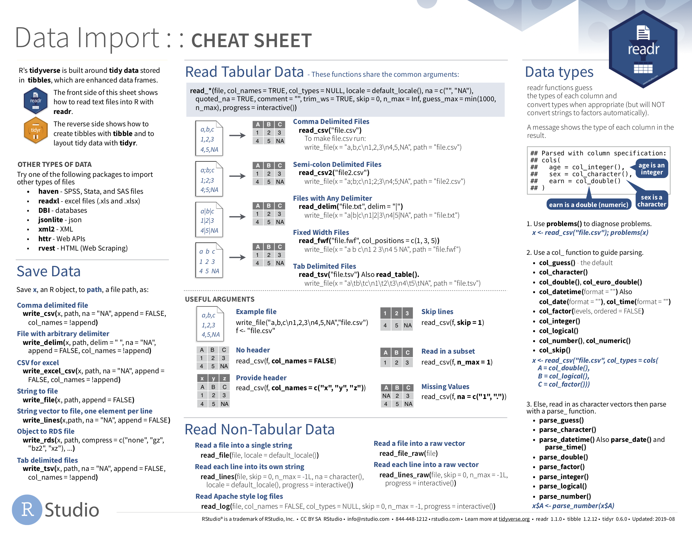
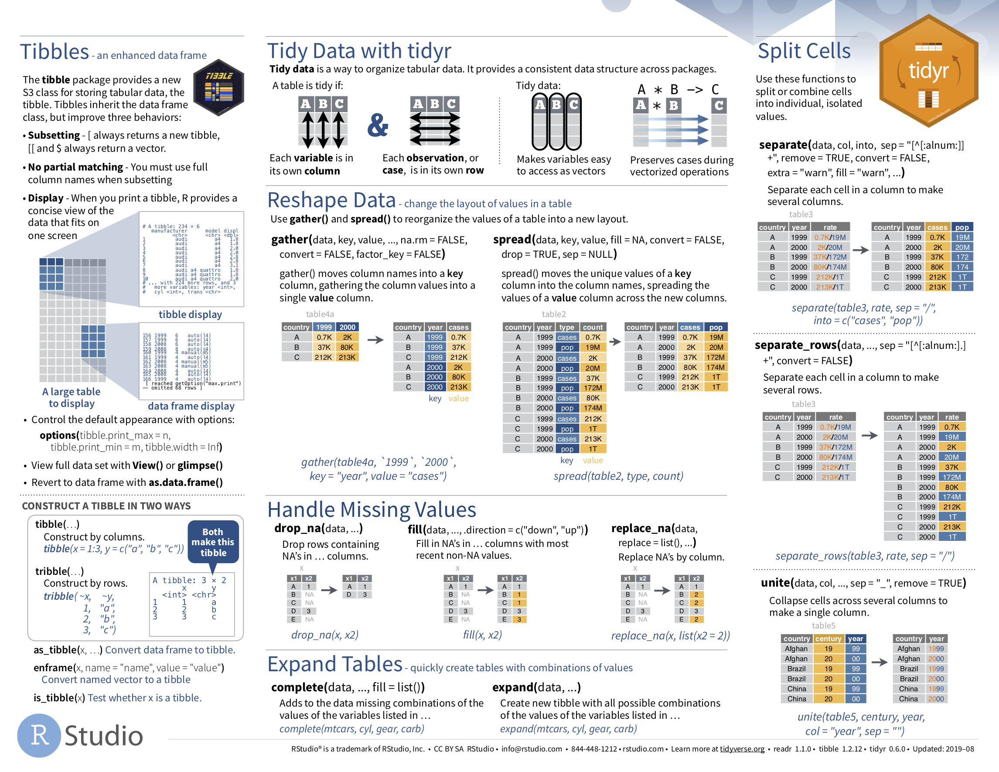
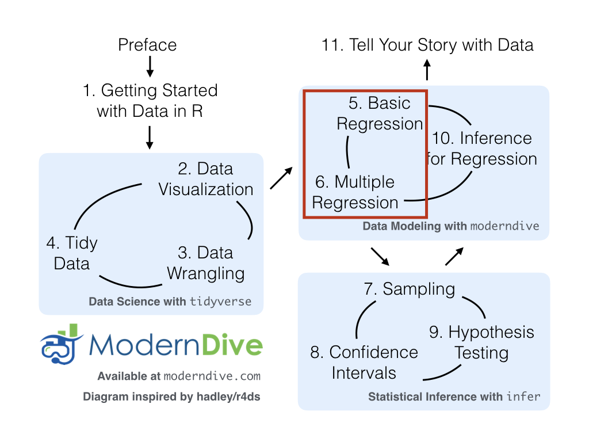

```{r, include=FALSE}
source("_common.R")
```

# 데이터 불러오기와 "깔끔한" 데이터 {#tidy}


```{r setup_tidy, include=FALSE, purl=FALSE}
# Used to define Learning Check numbers:
chap <- 4
lc <- 0

# Set R code chunk defaults:
knitr::opts_chunk$set(
  echo = TRUE,
  eval = TRUE,
  warning = FALSE,
  message = TRUE,
  tidy = FALSE,
  purl = TRUE,
  out.width = "\\textwidth",
  fig.height = 4,
  fig.align = "center"
)

# Set output digit precision
options(scipen = 99, digits = 3)

# In kable printing replace all NA's with blanks
options(knitr.kable.NA = "")

# Set random number generator see value for replicable pseudorandomness.
set.seed(76)
```

 @sec-programming-concepts절에서 R의 \index{data frame} 데이터 프레임 개념을 소개했습니다. 데이터 프레임은 행(row)이 관측치에 해당하고 열(column)이 각 관측치를 설명하는 변수에 해당하는, 마치 스프레드시트와 같은 직사각형의 데이터 표현 방식입니다. @sec-nycflights13절에서는 `nycflights13` 패키지에 포함된 `flights` 데이터 프레임을 통해 첫 번째 데이터를 탐색하기 시작했습니다. @sec-viz장에서는 `flights` 및 `weather`와 같은 다른 데이터 프레임에 포함된 데이터를 기반으로 시각화를 생성했습니다. @sec-wrangling장에서는 기존 데이터 프레임을 가져와 우리의 목적에 맞게 변형하고 수정하는 방법을 배웠습니다.

이 책의 "`tidyverse`를 사용한 데이터 과학" 부분의 마지막 장인 이번 장에서는, "깔끔한(tidy)" 데이터라고 불리는 데이터 포맷 유형을 논의하며 이러한 아이디어를 확장해 보겠습니다. 데이터를 "깔끔한" 포맷으로 저장한다는 것은 "깔끔하게 정리됨"이라는 일상적인 의미 이상의 뜻을 가지고 있음을 알게 될 것입니다. 대신, R을 사용하는 데이터 과학자들이 사전에 정의된 일련의 규칙에 따라 데이터가 저장되는 방식인 "깔끔한(tidy)"이라는 용어를 정의하고 그 규칙들을 개괄적으로 설명할 것입니다.

 @sec-viz장의 데이터 시각화와 @sec-wrangling장의 데이터 전처리를 다룰 때는 이러한 유형의 데이터 포맷에 대한 지식이 필요하지 않았습니다. 사용된 모든 데이터가 이미 "깔끔한" 포맷이었기 때문입니다. 이번 장에서는 지금까지 다룬 도구들을 효과적으로 사용하기 위해 이 포맷이 왜 필수적인지 살펴보겠습니다. 나아가 회귀 분석과 통계적 추론을 다루는 이 책의 모든 후속 장에서도 이 개념은 매우 유용할 것입니다. 하지만 그 전에, R에서 스프레드시트 데이터를 불러오는 방법부터 먼저 알아보겠습니다.


### 필요한 패키지 {-#tidy-packages}

이번 장에 필요한 모든 패키지들을 로드해 봅시다(앞서 이미 설치했다고 가정합니다). 필요한 경우 R 패키지 설치 및 로드 방법에 대한 정보는 @sec-packages절을 참고하세요.

```{r message=FALSE}
library(dplyr)
library(ggplot2)
library(readr)
library(tidyr)
library(nycflights13)
library(fivethirtyeight)
```

```{r message=FALSE, echo=FALSE, purl=FALSE}
# Packages needed internally, but not in text.
library(kableExtra)
library(stringr)
library(scales)
```


## 데이터 불러오기 {#csv}

지금까지 우리는 거의 전적으로 R 패키지 내부에 저장된 데이터만을 사용해 왔습니다. 하지만 여러분의 컴퓨터나 온라인 어딘가에 저장된 여러분만의 데이터를 사용하고 싶다면 어떨까요? R에서 이 데이터를 어떻게 분석할 수 있을까요? 스프레드시트 데이터는 대개 다음 세 가지 포맷 중 하나로 저장됩니다.

첫째, *쉼표로 구분된 값(Comma Separated Values)*인 `.csv` \index{CSV file} 파일입니다. `.csv` 파일을 다음과 같은 아주 핵심적인 정보만 담긴 스프레드시트라고 생각하면 됩니다.

* 파일의 각 줄은 데이터의 한 행 또는 하나의 관측치에 해당합니다.
* 각 줄의 값들은 쉼표로 구분됩니다. 즉, 서로 다른 변수의 값들이 각 행에서 쉼표로 나뉩니다.
* 첫 번째 줄은 종종(항상 그런 것은 아니지만 열과 변수의 이름을 나타내는 *헤더(header)* 행입니다.

둘째, 엑셀 `.xlsx` 스프레드시트 파일입니다. 이 포맷은 마이크로소프트의 독점 소프트웨어인 엑셀을 기반으로 합니다. 핵심 정보만 담긴 `.csv` 파일과 달리, `.xlsx` 엑셀 파일은 많은 메타데이터\index{meta-data}(데이터에 대한 데이터)를 포함하고 있습니다. @sec-groupby절에서 `group_by()` 동사를 사용하여 데이터 프레임에 "그룹 구조" 메타데이터를 추가했던 예시를 떠올려 보세요. 엑셀 스프레드시트 메타데이터의 예로는 굵게 또는 기울임 글꼴 사용, 셀 색상 지정, 다양한 열 너비, 수식 매크로 등이 있습니다.

셋째, 스프레드시트 작업을 위한 "클라우드" 또는 온라인 기반 방식인 [구글 스프레드시트](https://www.google.com/sheets/about/ 파일입니다. 구글 스프레드시트를 사용하면 데이터를 쉼표로 구분된 값인 `.csv`와 엑셀인 `.xlsx` 포맷 모두로 다운로드할 수 있습니다. 구글 스프레드시트 데이터를 R로 불러오는 한 가지 방법은 구글 스프레드시트 메뉴 바에서 파일 -> 다운로드 -> "Microsoft Excel" 또는 "쉼표로 구분된 값"을 선택한 다음 해당 데이터를 R로 로드하는 것입니다. 구글 스프레드시트 데이터를 R로 불러오는 더 고급 방법은 [`googlesheets4`](https://googlesheets4.tidyverse.org/ 패키지를 사용하는 것인데, 이 방법은 더 심화된 데이터 과학 서적에 맡기도록 하겠습니다.

우리는 R에서 `.csv` 및 `.xlsx` 스프레드시트 데이터를 불러오는 두 가지 방법, 즉 콘솔을 사용하는 방법과 "GUI"라고 축약해서 부르는 RStudio의 그래픽 사용자 인터페이스를 사용하는 방법을 살펴볼 것입니다.

### 콘솔 사용하기

먼저, 인터넷상에 존재하는 쉼표로 구분된 값 `.csv` 파일을 불러와 보겠습니다. `dem_score.csv` 파일은 1952년부터 1992년까지 여러 국가의 민주주의 수준 등급을 포함하고 있으며, <https://moderndive.com/data/dem_score.csv>에서 확인할 수 있습니다. `readr` \index{R packages!readr!read\_csv()} [@R-readr] 패키지의 `read_csv()` 함수를 사용하여 웹에서 이 파일을 읽어와 R로 가져온 후 `dem_score`라는 데이터 프레임에 저장해 봅시다.

```{r message=FALSE, eval=FALSE}
library(readr)
dem_score <- read_csv("https://moderndive.com/data/dem_score.csv")
dem_score
```
```{r message=FALSE, echo=FALSE, purl=FALSE}
dem_score <- read_csv("data/dem_score.csv")
dem_score
```

이 `dem_score` 데이터 프레임에서 최솟값 `-10`은 고도로 독점적인 국가를 나타내고, 최댓값 `10`은 고도로 민주적인 국가를 나타냅니다. 또한 서로 다른 변수 이름들을 백틱(`)이 감싸고 있다는 점에 주목하세요. R의 변수 이름은 기본적으로 숫자로 시작하거나 공백을 포함할 수 없지만, 열 이름을 백틱으로 감싸면 이를 우회할 수 있습니다. 이어지는 @sec-case-study-tidy절의 사례 연구에서 `dem_score` 데이터 프레임을 다시 살펴보겠습니다.

`readr` 패키지에 포함된 `read_csv()` 함수는 R에 기본으로 설치된 `read.csv()` 함수와는 다릅니다. 이름의 차이는 미묘해 보일 수 있지만(`.` 대신 `_` 사용), `read_csv()` 함수가 웹에서 데이터를 읽어오는 데 훨씬 더 편리하고 일반적으로 데이터를 불러오는 속도도 훨씬 빠릅니다. 게다가 `readr` 패키지의 `read_csv()` 함수는 데이터를 기본적으로 `tibble` 형태로 저장합니다.


### RStudio 인터페이스 사용하기

동일한 데이터를 불러오되, 이번에는 여러분의 컴퓨터에 저장된 엑셀 파일에서 읽어와 보겠습니다. 나아가 콘솔에서 `read_csv()`를 실행하는 대신 RStudio의 그래픽 인터페이스를 사용하여 이 작업을 수행하겠습니다. 먼저, <a href="https://moderndive.com/data/dem_score.xlsx" download>https://moderndive.com/data/dem_score.xlsx</a>로 이동하여 엑셀 파일 `dem_score.xlsx`를 다운로드한 후 다음 단계를 따르세요.

1. RStudio의 파일(Files 창으로 이동합니다.
2. 다운로드한 `dem_score.xlsx` 엑셀 파일이 저장된 디렉토리(즉, 컴퓨터 폴더)로 이동합니다. 예를 들어, 다운로드 폴더에 저장되어 있을 수 있습니다.
3. `dem_score.xlsx`를 클릭합니다.
4. "Import Dataset..."을 클릭합니다.

이때 그림 @fig-read-excel 과 같은 화면이 팝업됩니다. 그림 @fig-read-excel 의 오른쪽 하단에 있는 "Import" \index{RStudio!import data} 버튼을 클릭하면, RStudio는 이 스프레드시트의 데이터를 `dem_score`라는 데이터 프레임에 저장하고 그 내용을 스프레드시트 뷰어에 표시합니다.

```{r read-excel, echo=FALSE, fig.cap="R로 엑셀 파일 불러오기.", purl=FALSE}
knitr::include_graphics("images/rstudio_screenshots/read_excel.png")
```

또한, 그림 @fig-read-excel 의 오른쪽 하단에 있는 "Code Preview" 블록을 눈여겨보세요. 매번 번거롭게 마우스로 클릭하는 대신, 이 코드를 복사해서 나중에 데이터를 프로그래밍 방식으로 다시 불러오는 데 사용할 수 있습니다.


## "깔끔한" 데이터 {#tidy-data-ex}

이제 화제를 바꿔서 `fivethirtyeight` 패키지의 흥미로운 예시를 통해 "깔끔한(tidy)" 데이터 포맷의 개념에 대해 알아보겠습니다. `fivethirtyeight` 패키지 [@R-fivethirtyeight]는 데이터 저널리즘 웹사이트인 [FiveThirtyEight.com](https://fivethirtyeight.com/)에 게시된 많은 기사에서 사용된 데이터셋에 접근할 수 있게 해줍니다. `fivethirtyeight` 패키지에 포함된 총 `r nrow(data(package = "fivethirtyeight")[[3]])`개의 데이터셋 전체 목록을 확인하려면 패키지 웹페이지 <https://fivethirtyeight-r.netlify.app/articles/fivethirtyeight.html>를 방문하세요.\index{R packages!fivethirtyeight}

`drinks` 데이터 프레임에 집중하여 처음 5개 행을 살펴보겠습니다.

```{r, echo=FALSE, purl=FALSE}
drinks %>%
  head(5)
```

`?drinks`를 실행하여 도움말 파일을 읽어보면, `drinks`가 `r drinks %>% nrow()`개 국가에서 소비되는 맥주, 증류주, 와인의 평균 서빙 횟수에 대한 설문 조사 결과를 담은 데이터 프레임임을 알 수 있습니다. 이 데이터는 원래 FiveThirtyEight.com의 Mona Chalabi 기사인 ["Dear Mona Followup: Where Do People Drink The Most Beer, Wine And Spirits?"](https://fivethirtyeight.com/features/dear-mona-followup-where-do-people-drink-the-most-beer-wine-and-spirits/)에 보도되었습니다.

 @sec-wrangling장에서 배운 데이터 전처리 동사 중 몇 가지를 `drinks` 데이터 프레임에 적용해 봅시다.

1. `filter()`를 사용하여 미국(USA), 중국(China), 이탈리아(Italy), 사우디아라비아(Saudi Arabia 4개 국가만 골라낸 *다음*
2. `-` 기호를 사용하여 `total_litres_of_pure_alcohol`을 제외한 모든 열을 `select()`한 *다음*
3. `rename()`을 사용하여 `beer_servings`, `spirit_servings`, `wine_servings` 변수 이름을 각각 `beer`, `spirit`, `wine`으로 바꿉니다.

그리고 결과 데이터 프레임을 `drinks_smaller`에 저장합니다.

```{r}
drinks_smaller <- drinks %>% 
  filter(country %in% c("USA", "China", "Italy", "Saudi Arabia")) %>% 
  select(-total_litres_of_pure_alcohol) %>% 
  rename(beer = beer_servings, spirit = spirit_servings, wine = wine_servings)
drinks_smaller
```

이제 다음과 같은 질문을 던져 봅시다. "`drinks_smaller` 데이터 프레임을 사용하여 그림 @fig-drinks-smaller 와 같은 나란히 배치된 막대 그래프를 어떻게 만들 수 있을까요?" @sec-two-categ-barplot 절에서 두 개의 범주형 변수를 표시하는 막대 그래프를 살펴봤던 것을 떠올려 보세요.

```{r drinks-smaller, fig.cap="4개 국가의 알코올 소비량 비교.", fig.height=3.9, echo=FALSE, purl=FALSE}
drinks_smaller_tidy <- drinks_smaller %>%
  gather(type, servings, -country)
drinks_smaller_tidy_plot <- ggplot(
  drinks_smaller_tidy,
  aes(x = country, y = servings, fill = type)) +
  geom_col(position = "dodge") +
  labs(x = "country", y = "servings")

if (knitr::is_html_output()) {
  drinks_smaller_tidy_plot
} else {
  drinks_smaller_tidy_plot + scale_fill_grey()
}
```

 @sec-grammarofgraphics절에서 소개한 그래픽 문법을 분석해 봅시다.

1. 4개 수준(China, Italy, Saudi Arabia, USA)을 가진 범주형 변수 `country`는 막대의 `x` 위치에 매핑되어야 합니다.
2. 수치형 변수 `servings`는 막대의 `y` 위치(막대의 높이)에 매핑되어야 합니다.
3. 3개 수준(beer, spirit, wine)을 가진 범주형 변수 `type`은 막대의 `fill` 색상에 매핑되어야 합니다.

`drinks_smaller`에는 `beer`, `spirit`, `wine`이라는 세 개의 개별 변수가 있다는 점에 주목하세요. 하지만 그림 @fig-drinks-smaller 의 막대 그래프를 재현하기 위해 `ggplot()` 함수를 사용하려면, `beer`, `spirit`, `wine`이라는 세 가지 가능한 값을 갖는 *단일 변수* `type`이 필요합니다. 그래야 이 `type` 변수를 그래프의 `fill` 미적 속성에 매핑할 수 있기 때문입니다. 즉, 그림 @fig-drinks-smaller 의 막대 그래프를 재현하려면 데이터 프레임이 다음과 같은 모습이어야 합니다.

```{r, purl=FALSE}
drinks_smaller_tidy
```

```{r echo=FALSE, purl=FALSE}
# This redundant code is used for dynamic non-static in-line text output purposes
n_row_drinks <- drinks_smaller_tidy %>% nrow()
n_alcohol_types <- drinks_smaller_tidy %>%
  select(type) %>%
  n_distinct()
n_countries <- drinks_smaller_tidy %>%
  select(country) %>%
  n_distinct()
```

`drinks_smaller`와 `drinks_smaller_tidy`는 모두 직사각형 모양이고 동일한 `r n_row_drinks`개의 수치 데이터(`r n_alcohol_types`종의 술 $\times$ `r n_countries`개 국가)를 포함하고 있지만, 포맷이 서로 다릅니다. `drinks_smaller`는 \index{wide data format} ["와이드(wide)"](https://en.wikipedia.org/wiki/Wide_and_narrow_data) 포맷인 반면, `drinks_smaller_tidy`는 ["롱(long)/내로우(narrow)"](https://en.wikipedia.org/wiki/Wide_and_narrow_data#Narrow) 포맷입니다.

R에서 데이터 과학을 수행할 때, 롱/내로우 포맷 \index{long data format}은 "깔끔한(tidy)" 포맷으로도 알려져 있습니다. 데이터 시각화와 데이터 전처리를 위해 `ggplot2` 및 `dplyr` 패키지를 사용하려면 입력 데이터 프레임이 반드시 "깔끔한" 포맷이어야 합니다. 따라서 "깔끔하지 않은" 모든 데이터는 먼저 "깔끔한" 포맷으로 변환해야 합니다. `drinks_smaller`와 같은 "깔끔하지 않은" 데이터 프레임을 `drinks_smaller_tidy`와 같은 "깔끔한" 데이터 프레임으로 변환하기 전에, 먼저 "깔끔한" 데이터가 무엇인지 정의해 보겠습니다.


### "깔끔한" 데이터의 정의 {#tidy-definition}

"깔끔한(tidy)"이라는 단어는 일상생활에서도 자주 사용됩니다.

* "방 좀 깔끔하게 치워라!"
* "피드백을 주기 편하게 숙제를 깔끔하게 작성해 오렴."
* 곤도 마리에의 베스트셀러 저서 [_정리의 힘: 깔끔한 정리를 위한 일본의 분류 예술_](https://www.powells.com/book/-9781607747307)과 넷플릭스 TV 시리즈 [_곤도 마리에와 함께하는 설레는 정리_](https://www.netflix.com/title/80209379).
* "나는 상상할 수 있는 범주 내에서 결코 깔끔한 사람이 아니다. 커피 탁자와 침대 옆에 쌓여 있는 읽지 않은 책들더미는 마치 '제발 저를 읽어주세요!'라고 애원하는 듯하다." - 린다 그랜트

데이터가 "깔끔하다(tidy)"는 것은 무엇을 의미할까요? 일상적인 의미에서 "깔끔함"이 "정돈된" 상태를 뜻한다면, R을 사용한 데이터 과학에서 "깔끔함(tidy)"이라는 단어는 데이터가 표준화된 포맷을 따르고 있음을 의미합니다. 우리는 Hadley Wickham \index{Wickham, Hadley}이 정의한 *"깔끔한" 데이터* \index{tidy data} [@tidy]의 정의를 따를 것이며, 이는 그림 @fig-tidyfig 에 잘 나타나 있습니다.

> *데이터셋*은 값들의 집합이며, 대개 숫자(정량적 데이터의 경우)나 문자열 즉 텍스트 데이터(정성적/범주형 데이터의 경우)로 이루어집니다. 값들은 두 가지 방식으로 조직됩니다. 모든 값은 변수와 관측치에 속합니다. 변수는 여러 단위에 걸쳐 동일한 기저 속성(키, 온도, 기간 등)을 측정하는 모든 값을 포함합니다. 관측치는 동일한 단위(사람, 날짜, 도시 등)에 대해 여러 속성에 걸쳐 측정된 모든 값을 포함합니다.
> 
> "깔끔한" 데이터는 데이터셋의 의미를 그 구조에 매핑하는 표준화된 방법입니다. 행, 열, 표가 관측치, 변수, 유형과 어떻게 매치되느냐에 따라 데이터셋은 지저분할 수도 있고 깔끔할 수도 있습니다. *깔끔한 데이터*에서는 다음과 같은 규칙을 따릅니다.
>
> 1. 각 변수는 하나의 열을 형성한다.
> 2. 각 관측치는 하나의 행을 형성한다.
> 3. 각 관측 단위 유형은 하나의 표를 형성한다.

(ref:tidy-r4ds) *R for Data Science*에 수록된 깔끔한 데이터 그래픽.

```{r tidyfig, echo=FALSE, fig.cap="(ref:tidy-r4ds)", out.height="80%", out.width="80%", purl=FALSE}
knitr::include_graphics("images/r4ds/tidy-1.png")
```

예를 들어 표 @tbl-non-tidy-stocks 와 같은 주가 정보표가 있다고 가정해 봅시다.

```{r non-tidy-stocks, echo=FALSE, purl=FALSE}
stocks <- tibble(
  Date = as.Date("2009-01-01") + 0:4,
  `Boeing stock price` = paste("$", c("173.55", "172.61", "173.86", "170.77", "174.29"), sep = ""),
  `Amazon stock price` = paste("$", c("174.90", "171.42", "171.58", "173.89", "170.16"), sep = ""),
  `Google stock price` = paste("$", c("174.34", "170.04", "173.65", "174.87", "172.19"), sep = "")
) %>%
  slice(1:2)
stocks %>%
  kbl(
    digits = 2,
    caption = "주가 정보 (깔끔하지 않은 포맷)",
    booktabs = TRUE,
    linesep = ""
  ) %>%
  kable_styling(
    font_size = ifelse(knitr::is_latex_output(), 10, 16),
    latex_options = c("hold_position")
  )
```

비록 데이터가 직사각형 스프레드시트 형태로 가지런히 정리되어 있지만, "깔끔한" 포맷의 정의를 따르지는 않습니다. 날짜(date), 종목명(stock name), 주가(stock price)라는 세 가지 고유한 정보에 해당하는 세 개의 변수가 존재하지만, 열은 세 개가 아닙니다. "깔끔한" 데이터 포맷에서는 표 @tbl-tidy-stocks 에 표시된 것처럼 각 변수가 고유한 열을 형성해야 합니다. 두 표가 동일한 정보를 제공하지만 서로 다른 포맷을 사용하고 있음을 알 수 있습니다.

```{r tidy-stocks, echo=FALSE, purl=FALSE}
stocks_tidy <- stocks %>%
  rename(
    Boeing = `Boeing stock price`,
    Amazon = `Amazon stock price`,
    Google = `Google stock price`
  ) %>%
  #  gather(`Stock name`, `Stock price`, -Date)
  pivot_longer(
    cols = -Date,
    names_to = "Stock Name",
    values_to = "Stock Price"
  )
stocks_tidy %>%
  kbl(
    digits = 2,
    caption = "주가 정보 (깔끔한 포맷)",
    booktabs = TRUE,
    linesep = ""
  ) %>%
  kable_styling(
    font_size = ifelse(knitr::is_latex_output(), 10, 16),
    latex_options = c("hold_position")
  )
```

이제 Date, Stock Name, Stock Price라는 필요한 세 개의 열을 갖추게 되었습니다. 다른 관점에서도 살펴보죠. 표 @tbl-tidy-stocks-2 의 데이터를 살펴보겠습니다.

```{r tidy-stocks-2, echo=FALSE, purl=FALSE}
stocks <- tibble(
  Date = as.Date("2009-01-01") + 0:4,
  `Boeing Price` = paste("$", c("173.55", "172.61", "173.86", "170.77", "174.29"), sep = ""),
  `Weather` = c("Sunny", "Overcast", "Rain", "Rain", "Sunny")
) %>%
  slice(1:2)
stocks %>%
  kbl(
    digits = 2,
    caption = "깔끔한 데이터의 예시"
  ) %>%
  kable_styling(
    font_size = ifelse(knitr::is_latex_output(), 10, 16),
    latex_options = c("hold_position")
  )
```

이 경우에는 앞서 깔끔하지 않았던 표 @tbl-non-tidy-stocks 처럼 "Boeing Price" 변수가 나타나 있지만, 이 데이터는 "깔끔한" 형태입니다. 날짜(Date), 보잉 주가(Boeing price), 그리고 그날의 날씨(Weather)라는 세 가지 고유한 정보에 대응하는 세 개의 변수가 존재하기 때문입니다.

```{block, type="learncheck", purl=FALSE}
\vspace{-0.15in}
**_학습 확인_**
\vspace{-0.1in}
```

**`r paste0("(LC", chap, ".", (lc <- lc + 1), ")")`** "깔끔한" 데이터 프레임의 일반적인 특징은 무엇인가요?

**`r paste0("(LC", chap, ".", (lc <- lc + 1), ")")`** 데이터를 조직하는 데 있어 "깔끔한" 데이터 프레임이 유용한 이유는 무엇인가요?

```{block, type="learncheck", purl=FALSE}
\vspace{-0.25in}
\vspace{-0.25in}
```


### "깔끔한" 데이터로 변환하기

이 책에서 지금까지 여러분은 이미 "깔끔한" 포맷인 데이터 프레임만을 확인했습니다. 또한 이 책의 나머지 부분에서도 대부분 이미 "깔끔한" 포맷으로 정리된 데이터 프레임들을 보게 될 것입니다. 하지만 세상의 모든 데이터셋이 항상 그런 것은 아닙니다. 만약 여러분의 원본 데이터 프레임이 와이드(깔끔하지 않은 포맷이고 이를 `ggplot2`나 `dplyr` 패키지에서 사용하고 싶다면, 먼저 "깔끔한" 포맷으로 변환해야 합니다. 이를 위해 `tidyr` \index{R packages!tidyr} 패키지 [@R-tidyr]의 \index{tidyr!pivot\_longer()} `pivot_longer()` 함수를 사용할 것을 권장합니다.

앞서 보았던 `drinks_smaller` 데이터 프레임을 다시 살펴보겠습니다.

```{r}
drinks_smaller
```

다음과 같이 `tidyr` 패키지의 `pivot_longer()` 함수를 사용하여 이를 "깔끔한" 포맷으로 변환합니다.

```{r}
drinks_smaller_tidy <- drinks_smaller %>% 
  pivot_longer(names_to = "type", 
               values_to = "servings", 
               cols = -country)
drinks_smaller_tidy
```

`pivot_longer()`의 인자들을 다음과 같이 설정했습니다.

1. `names_to`는 원래 데이터의 *열 이름*들을 담게 될 새로운 "깔끔한"/롱 데이터 프레임의 변수 이름을 지정합니다. 여기서는 `names_to = "type"`으로 설정했습니다. 결과물인 `drinks_smaller_tidy`에서 `type` 열은 세 가지 술 종류인 `beer`, `spirit`, `wine`을 포함합니다. `type`은 `drinks_smaller`에 존재하지 않았던 새로운 변수 이름이므로 따옴표로 감싸서 입력합니다. 따옴표 없이 `names_to = type`이라고 입력하면 오류가 발생합니다.
2. `values_to`는 원래 데이터의 *값*들을 담게 될 새로운 "깔끔한" 데이터 프레임의 변수 이름을 지정합니다. 여기서는 `values_to = "servings"`로 설정했는데, 이는 `drinks_smaller` 데이터의 `beer`, `wine`, `spirit` 각 열에 있던 수치 데이터들이 각각 `servings` 값에 해당하기 때문입니다. 결과물인 `drinks_smaller_tidy`에서 `servings` 열은 `r n_countries` $\times$ `r n_alcohol_types` = `r n_row_drinks`개의 수치 데이터를 포함합니다. `servings` 역시 원래 변수 이름이 아니므로 따옴표로 감싸야 합니다.
3. 세 번째 인자인 `cols`는 "깔끔하게" 정리하고 싶은(또는 정리하고 싶지 않은 원래 데이터 프레임의 열들을 지정합니다. 여기서는 `-country`로 설정하여 `drinks_smaller`의 `country` 변수는 제외하고 `beer`, `spirit`, `wine` 변수들만 정리하겠다고 명시했습니다. `country`는 `drinks_smaller`에 존재하는 열 이름이므로 따옴표를 사용하지 않습니다.

세 번째 인자인 `cols`는 조금 까다로울 수 있으므로, 동일한 결과를 내는 다른 방식의 코드를 살펴보겠습니다.

```{r, eval=FALSE}
drinks_smaller %>% 
  pivot_longer(names_to = "type", 
               values_to = "servings", 
               cols = c(beer, spirit, wine))
```

여기서는 `-country`를 사용하는 대신, `c(beer, spirit, wine)`을 사용하여 "깔끔하게" 정리하고 싶은 열들을 직접 지정했습니다. `c()` 함수를 사용하여 정리를 원하는 열들의 벡터를 생성한 것입니다. 이 세 열이 `drinks_smaller` 데이터 프레임에서 나란히 위치해 있으므로, 다음과 같이 `cols` 인자를 작성할 수도 있습니다.

```{r, eval=FALSE}
drinks_smaller %>% 
  pivot_longer(names_to = "type", 
               values_to = "servings", 
               cols = beer:wine)
```

이제 "깔끔한" 포맷의 `drinks_smaller_tidy` 데이터 프레임을 사용하여 `geom_col()`로 그림 @fig-drinks-smaller 의 막대 그래프를 생성할 수 있습니다. 이는 그림 @fig-drinks-smaller-tidy-barplot 에서 확인할 수 있습니다. 막대 그래프를 다루었던 @sec-geombar 절에서 보았듯이, "이미 계산된(pre-counted)" `servings` 변수를 막대의 `y` 미적 속성에 매핑하기 위해 `geom_bar()`가 아닌 `geom_col()`을 사용합니다.

```{r eval=FALSE}
ggplot(drinks_smaller_tidy, aes(x = country, y = servings, fill = type)) +
  geom_col(position = "dodge")
```

(ref:drinks-col) `geom_col()`을 사용하여 `r n_countries`개 국가의 알코올 소비량을 비교한 결과.

```{r drinks-smaller-tidy-barplot, echo=FALSE, fig.cap="(ref:drinks-col)", fig.height=2.5, purl=FALSE}
if (knitr::is_html_output()) {
  drinks_smaller_tidy_plot
} else {
  drinks_smaller_tidy_plot + scale_fill_grey()
}
```

"와이드" 포맷의 데이터를 "깔끔한" 포맷으로 변환하는 것은 처음 R을 접하는 사용자들에게 혼란을 줄 수 있습니다. `pivot_longer()` 함수에 익숙해지는 유일한 방법은 다양한 데이터셋을 사용하여 반복해서 연습하는 것입니다. 예를 들어 `?pivot_longer`를 실행하고 도움말 파일 하단의 예제들을 살펴보세요. @sec-case-study-tidy절의 사례 연구에서 `pivot_longer()`를 사용하여 와이드 포맷을 깔끔한 포맷으로 변환하는 또 다른 예시를 보여드리겠습니다.

반대로 "깔끔한" 데이터 프레임을 "와이드" 포맷으로 변환하고 싶다면 \index{tidyr!pivot\_wider()} `pivot_wider()` 함수를 대신 사용해야 합니다. `?pivot_wider`를 실행하여 도움말 하단의 예제들을 확인해 보세요.

또한 [tidyverse.org](https://tidyr.tidyverse.org/dev/articles/pivot.html#pew) 웹페이지에서 `pivot_longer()`와 `pivot_wider()`의 더 많은 예시를 볼 수 있습니다. 해당 페이지에는 데이터 정리에 사용할 수 있는 다양한 함수들에 대한 훌륭한 예시와 세계보건기구(WHO 데이터를 사용한 사례 연구가 수록되어 있습니다. 나아가 매주 R4DS 온라인 학습 커뮤니티는 [#TidyTuesday 이벤트](https://github.com/rfordatascience/tidytuesday)를 위해 데이터셋을 게시하는데, 이 역시 데이터를 탐색하고 변형해 볼 수 있는 좋은 기회가 될 것입니다.

```{block, type="learncheck", purl=FALSE}
\vspace{-0.15in}
**_학습 확인_**
\vspace{-0.1in}
```

**`r paste0("(LC", chap, ".", (lc <- lc + 1), ")")`** `fivethirtyeight` 패키지에 포함된 `airline_safety` 데이터 프레임을 살펴보세요. 다음을 실행하세요.

```{r, eval=FALSE, purl=FALSE}
airline_safety
```

`?airline_safety`를 실행하여 도움말 파일을 읽어보면, `airline_safety`가 여러 항공사의 안전 기록에 대한 정보를 담고 있음을 알 수 있습니다. 이 데이터는 원래 FiveThirtyEight.com의 Nate Silver 기사인 ["Should Travelers Avoid Flying Airlines That Have Had Crashes in the Past?"](https://fivethirtyeight.com/features/should-travelers-avoid-flying-airlines-that-have-had-crashes-in-the-past/)에 보도되었습니다. 편의를 위해 `airline` 변수와 사망 사고와 관련된 변수들만 고려해 봅시다.

```{r}
airline_safety_smaller <- airline_safety %>% 
  select(airline, starts_with("fatalities"))
airline_safety_smaller
```

이 데이터 프레임은 "깔끔한" 포맷이 아닙니다. 사고 발생 연도를 나타내는 `fatalities_years` 변수와 사망자 수를 나타내는 `count` 변수를 갖도록 이 데이터 프레임을 어떻게 "깔끔한" 포맷으로 변환할 수 있을까요?

```{block, type="learncheck", purl=FALSE}
\vspace{-0.25in}
\vspace{-0.25in}
```


### `nycflights13` 패키지

 @sec-nycflights13절에서 소개했던 2013년 뉴욕에서 출발하는 모든 국내선 항공편 데이터인 `nycflights13` 패키지를 떠올려 보세요. `View(flights)`를 실행하여 `flights` 데이터 프레임을 다시 살펴보겠습니다. `flights`는 직사각형 모양이며, `r flights %>% nrow() %>% comma()`개의 행은 각각 하나의 항공편에 대응하고 `r flights %>% ncol()`개의 열은 각 항공편의 다양한 특성/측정값에 대응합니다. 이는 @sec-tidy-definition절에서 배운 "깔끔한" 데이터의 정의 중 첫 두 가지 기준, 즉 "각 변수는 하나의 열을 형성한다"와 "각 관측치는 하나의 행을 형성한다"를 충족합니다. 그렇다면 세 번째 속성인 "각 관측 단위 유형은 하나의 표를 형성한다"는 어떠할까요?

 @sec-exploredataframes절에서 `flights` 데이터 프레임의 관측 단위가 개별 항공편임을 확인했습니다. 즉, `flights` 데이터 프레임의 행들은 개별 항공편의 특성/측정값을 나타냅니다. 또한 `nycflights13` 패키지에는 행이 서로 다른 관측 단위를 나타내는 다른 데이터 프레임들도 포함되어 있습니다 [@R-nycflights13].

* `airlines`: 두 글자로 된 IATA 항공사 코드와 항공사 이름 간의 변환표(총 `r airlines %>% nrow()`개). 관측 단위는 항공사입니다.
* `planes`: 사용된 `r planes %>% nrow() %>% comma()`대 항공기 각각에 대한 정보. 즉, 관측 단위는 항공기입니다.
* `weather`: 뉴욕의 세 공항 각각에 대한 시간별 기상 데이터(약 `r weather %>% count(origin) %>% pull(n) %>% mean() %>% round() %>% comma()`개 관측치). 즉, 관측 단위는 특정 공항의 특정 시간 기상 측정값입니다.
* `airports`: 공항 이름과 위치 정보. 관측 단위는 공항입니다.

정보를 이 다섯 개의 데이터 프레임으로 조직한 방식은 "깔끔한" 데이터의 세 번째 속성을 따릅니다. 즉, 동일한 관측 단위에 해당하는 관측치들은 동일한 표(데이터 프레임)에 저장되어야 한다는 것입니다. 이 속성을 "끼리끼리 모인다"는 의미의 속담인 "유유상종(birds of a feather flock together)"으로 생각할 수 있습니다.
 


## 사례 연구: 과테말라의 민주주의 {#case-study-tidy}

이 명칭에서는 "깔끔하지 않은" 포맷(와이드 포맷)의 데이터 프레임을 "깔끔한" 포맷(롱/내로우 포맷)의 데이터 프레임으로 변환하는 또 다른 예시를 보여드리겠습니다. 이번에도 `tidyr` 패키지의 `pivot_longer()` 함수를 사용하겠습니다.

나아가 `ggplot2`와 `dplyr` 패키지의 함수들을 활용하여, 1952년부터 1992년까지 40년 동안 과테말라의 민주주의 점수가 어떻게 변했는지 보여주는 *시계열 그래프(time-series plot)*를 만들어 보겠습니다. @sec-linegraphs절에서 `geom_line()`을 사용하여 시계열 그래프(선 그래프)를 만드는 방법을 배웠던 것을 떠올려 보세요.

 @sec-csv절에서 불러온 `dem_score` 데이터 프레임을 사용하되, 과테말라에 해당하는 데이터에만 집중해 보겠습니다.

```{r}
guat_dem <- dem_score %>% 
  filter(country == "Guatemala")
guat_dem
```

 @sec-grammarofgraphics절에서 보았던 그래픽 문법을 적용해 봅시다.

먼저 `data = guat_dem`을 설정하고 `geom_line()` 레이어를 사용해야 한다는 것은 알지만, 변수의 미적 속성 매핑은 어떻게 해야 할까요? 연도에 따라 민주주의 점수가 어떻게 변했는지 보고 싶으므로, 다음과 같이 매핑해야 합니다.

* `year`를 x 위치 미적 속성에 매핑
* `democracy_score`를 y 위치 미적 속성에 매핑

그런데 여기서 @sec-tidy-data-ex절의 `drinks_smaller` 예시와 마찬가지로 곤란한 상황에 직면하게 됩니다. `country`라는 변수가 있지만 유일한 값은 `"Guatemala"`입니다. 다른 변수들은 서로 다른 연도 값으로 표시되어 있습니다. 안타깝게도 `guat_dem` 데이터 프레임은 "깔끔한" 상태가 아니며, 따라서 그래픽 문법을 적용하기에 적절한 포맷이 아닙니다. 이대로는 `ggplot2` 패키지를 사용할 수 없습니다.

`guat_dem`에서 연도에 해당하는 열들의 값을 가져와 `year`라는 새로운 "이름(names)" 변수로 변환해야 합니다. 또한, 데이터 프레임 내부의 민주주의 점수 값들을 가져와 `democracy_score`라는 새로운 "값(values)" 변수로 만들어야 합니다. 결과적으로 데이터 프레임은 `country`, `year`, `democracy_score`라는 세 개의 열을 갖게 될 것입니다. `tidyr` 패키지의 `pivot_longer()` 함수가 이 작업을 수행해 줍니다.


```{r}
guat_dem_tidy <- guat_dem %>% 
  pivot_longer(names_to = "year", 
               values_to = "democracy_score", 
               cols = -country,
               names_transform = list(year = as.integer))
guat_dem_tidy
```

<!--
v2 TODO: remove this message
-->
(이 코드는 `tidyr` 패키지가 1.1.0 버전으로 업데이트됨에 따라 인쇄판의 내용과 약간 다를 수 있습니다. `pivot_longer()`의 인자들을 다음과 같이 설정했습니다.

1. `names_to`는 원래 데이터의 *열 이름*들을 담게 될 새로운 "깔끔한" 데이터 프레임의 변수 이름을 지정합니다. 여기서는 `names_to = "year"`로 설정했습니다. 결과물인 `guat_dem_tidy`에서 `year` 열은 과테말라의 민주주의 점수가 측정된 연도들을 포함합니다.
2. `values_to`는 원래 데이터의 *값*들을 담게 될 새로운 "깔끔한" 데이터 프레임의 변수 이름을 지정합니다. 여기서는 `values_to = "democracy_score"`로 설정했습니다. 결과물인 `guat_dem_tidy`에서 `democracy_score` 열은 1 $\times$ 9 = 9개의 민주주의 점수를 수치형 데이터로 포함합니다.
3. 세 번째 인자는 "깔끔하게" 정리하고 싶은(또는 정리하고 싶지 않은 열들을 지정합니다. 여기서는 `cols = -country`로 설정하여 `guat_dem`의 `country` 변수는 제외하고 `1952`년부터 `1992`년까지의 변수들만 정리하겠다고 명시했습니다.
4. `names_transform`의 마지막 인자는 R에게 `year`가 어떤 유형의 변수여야 하는지 알려줍니다. 여기서처럼 `integer`(정수형)으로 지정하지 않으면, `pivot_longer()`는 기본적으로 이를 문자형(character 값으로 설정합니다.


이제 `r index_cite("ggplot2", "geom_line()")` `geom_line()`을 사용하여 1952년부터 1992년까지 과테말라의 민주주의 점수 변화를 시각화하는 시계열 그래프를 그림 @fig-guat-dem-tidy 처럼 만들 수 있습니다. 또한 `ggplot2` 패키지의 `labs()` 함수를 사용하여 그래프의 모든 미적 속성(이 경우에는 `x` 및 `y` 위치)에 유용한 라벨을 추가하겠습니다.

```{r guat-dem-tidy, fig.cap="1952-1992년 과테말라의 민주주의 점수.", fig.height=3}
ggplot(guat_dem_tidy, aes(x = year, y = democracy_score)) +
  geom_line() +
  labs(x = "연도", y = "민주주의 점수")
```

만약 `year`가 정수형이 아니라고 명시하는 `names_transform` 인자를 잊었다면, `geom_line()`이 `year`의 문자형 값들을 올바른 순서로 정렬하는 방법을 알지 못해 여기서 오류가 발생했을 것입니다.

```{block lc-tidying, type="learncheck", purl=FALSE}
\vspace{-0.15in}
**_학습 확인_**
\vspace{-0.1in}
```

**`r paste0("(LC", chap, ".", (lc <- lc + 1), ")")`** `dem_score` 데이터 프레임을 "깔끔한" 데이터 프레임으로 변환하고, 그 결과물인 롱 포맷 데이터 프레임의 이름을 `dem_score_tidy`로 지정하세요.

**`r paste0("(LC", chap, ".", (lc <- lc + 1), ")")`** <https://moderndive.com/data/le_mess.csv>에 저장된 기대 수명 데이터를 읽어와서 "깔끔한" 데이터 프레임으로 변환하세요.

```{block, type="learncheck", purl=FALSE}
\vspace{-0.25in}
\vspace{-0.25in}
```


## `tidyverse` 패키지 {#tidyverse-package}

이번 장의 시작 부분에서 데이터 과학을 위해 가장 빈번하게 사용되는 R 패키지 4개를 로드했다는 사실에 주목하세요.

```{r, eval=FALSE, purl=FALSE}
library(ggplot2)
library(dplyr)
library(readr)
library(tidyr)
```

`ggplot2`는 데이터 시각화, `dplyr`는 데이터 전처리, `readr`는 스프레드시트 데이터를 R로 불러오기, 그리고 `tidyr`는 데이터를 "깔끔한" 포맷으로 변환하기 위한 것입니다. 이 패키지들을 하나씩 로드하는 것보다 훨씬 빠른 방법이 있는데, 바로 `tidyverse` 패키지를 설치하고 로드하는 것입니다. `tidyverse` 패키지는 "우산(umbrella)" 패키지 역할을 하여, 이를 설치하거나 로드하면 여러 패키지를 한꺼번에 설치/로드해 줍니다.

 @sec-packages절에서 보았던 것처럼 일반적인 패키지 설치 방법대로 `tidyverse` 패키지를 설치한 후, 다음과 같이 실행하면 됩니다.

```{r, eval=FALSE, purl=FALSE}
library(tidyverse)
```

이는 다음 패키지들을 각각 실행하는 것과 같습니다.

```{r, eval=FALSE, purl=FALSE}
library(ggplot2)
library(dplyr)
library(readr)
library(tidyr)
library(purrr)
library(tibble)
library(stringr)
library(forcats)
```

`purrr`, `tibble`, `stringr`, `forcats` 패키지에 대해서는 더 심화된 데이터 과학 서적인 [*R for Data Science*](http://r4ds.had.co.nz/)에서 자세히 다루고 있습니다.

이 책의 나머지 부분에서는 각 장의 시작 부분에서 개별 패키지를 로드하는 대신 `library(tidyverse)`를 실행할 것입니다. `tidyverse`라는 "우산" 패키지의 이름은 이 패키지군에 포함된 모든 함수가 공통된 입력과 출력을 갖도록 설계되었다는 사실에서 유래했습니다. 즉, 입력과 출력 데이터 프레임이 "깔끔한(tidy)" 포맷이라는 것입니다. 이러한 데이터 프레임의 표준화는 서로 다른 패키지의 다양한 함수들 사이의 전환을 최대한 매끄럽게 만들어 줍니다. 더 자세한 정보는 [tidyverse.org](https://www.tidyverse.org/ 패키지 웹페이지를 방문해 보세요.


## 결론 {#tidy-data-conclusion}

### 추가 자료

```{r echo=FALSE, results="asis", purl=FALSE}
if (knitr::is_latex_output()) {
  cat("*학습 확인(Learning checks)*에 대한 모든 정답은 온라인의 [부록 D](https://moderndive.com/D-appendixD.html)에서 확인할 수 있습니다.")
}
```

```{r echo=FALSE, purl=FALSE, results="asis"}
generate_r_file_link("04-tidy.R")
```

`readr` 및 `tidyr` 패키지 사용법에 대해 더 자세히 알고 싶다면, RStudio의 "데이터 불러오기 치트 시트(Data Import Cheat Sheet)"를 확인해 볼 것을 권장합니다. 2024년 중반 기준 현재 버전의 RStudio에서는 RStudio 메뉴 바 -> Help -> Cheat Sheets -> "Browse Cheat Sheets..."로 이동한 후 페이지를 아래로 내려 "Data import with readr, readxl, and googlesheets4..."를 선택하면 `readr`, `readxl`, `googlesheets4` 패키지를 사용한 데이터 불러오기 정보를 볼 수 있으며, "Data tidying with tidyr cheatsheet"를 선택하면 `tidyr` 패키지를 사용한 데이터 "정리(tidy)" 정보를 확인할 수 있습니다. `r if(knitr::is_html_output()) "아래 그림에서 두 전용 치트 시트의 미리보기를 확인할 수 있습니다."`

```{r import-cheatsheet, echo=FALSE, fig.cap="데이터 불러오기 치트 시트(첫 번째 페이지): readr 패키지.", out.width="66%", purl=FALSE}
if (knitr::is_html_output()) {
  
}
```

```{r tidyr-cheatsheet, echo=FALSE, fig.cap="데이터 불러오기 치트 시트(두 번째 페이지): tidyr 패키지.", out.width="66%", purl=FALSE}
if (knitr::is_html_output()) {
  
}
```


### 앞으로 배울 내용

축하합니다! 이 책의 "`tidyverse`를 사용한 데이터 과학" 부분을 모두 마쳤습니다. 이제 이 책의 "moderndive를 사용한 데이터 모델링" 부분인 @sec-regression장과 @sec-multiple-regression장으로 넘어가 보겠습니다. 여기서는 여러분이 익힌 데이터 시각화와 데이터 전처리 기술을 활용하여 데이터 프레임의 다양한 변수 간 관계를 모델링하는 방법을 배울 것입니다.

단, @sec-inference-for-regression 장의 "회귀 분석을 위한 추론"은 @sec-sampling 장, @sec-confidence-intervals 장, @sec-hypothesis-testing 장에서 통계적 추론을 다룬 후에 살펴볼 예정입니다. 그림 @fig-part2 에 표시된 것처럼, 이제 데이터 모델링의 세계로 힘차게 나아가 봅시다!

(ref:flowchart-partii) *ModernDive* 플로우차트 - 2부로 이동!

```{r part2, echo=FALSE, fig.cap="(ref:flowchart-partii)", fig.height=5.5, purl=FALSE}

```

