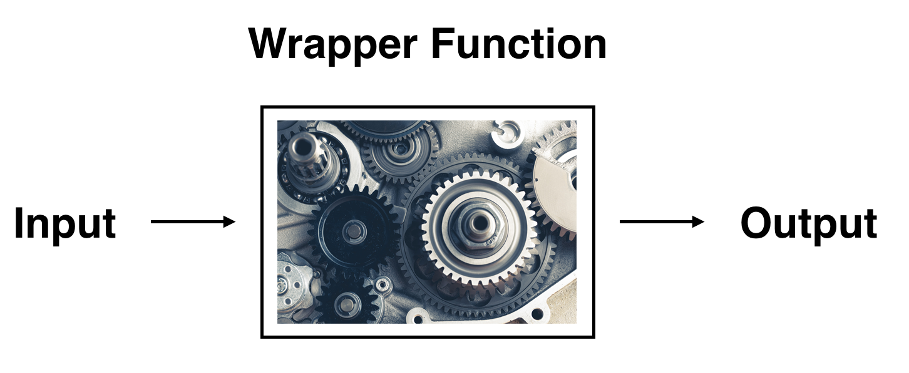
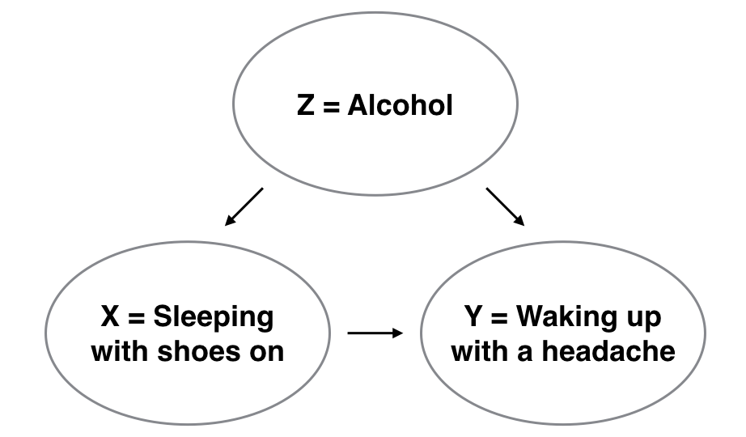
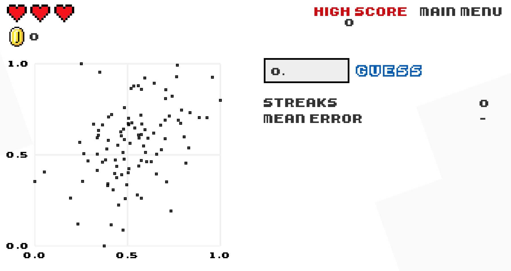

```{r, include=FALSE}
source("_common.R")
```


(ref:moderndivepart) `moderndive`를 활용한 데이터 모델링

```{r echo=FALSE, results="asis", purl=FALSE}
if (knitr::is_latex_output()) {
  cat("# (PART) (ref:moderndivepart) {-}")
} else {
  cat("# (PART) moderndive를 활용한 데이터 모델링 {-} ")
}
```

# 기초 회귀 분석 {#regression}

```{r, include=FALSE, purl=FALSE}
# 학습 확인(Learning Check) 번호를 정의하는 데 사용됨:
chap <- 5
lc <- 0

# R 코드 청크 기본값 설정:
knitr::opts_chunk$set(
  echo = TRUE,
  eval = TRUE,
  warning = FALSE,
  message = TRUE,
  tidy = FALSE,
  purl = TRUE,
  out.width = "\\textwidth",
  fig.height = 4,
  fig.align = "center"
)

# 출력 자릿수 정밀도 설정
options(scipen = 99, digits = 3)

# kable 출력에서 모든 NA를 공백으로 대체
options(knitr.kable.NA = "")

# 재현 가능한 의사 난수 생성을 위해 난수 생성기 시드 값 설정.
set.seed(76)
```

이제 제\@ref(viz)장의 데이터 시각화 기술, 제\@ref(wrangling)장의 데이터 전처리 기술, 그리고 제\@ref(tidy)장의 데이터 불러오기 및 "깔끔한(tidy)" 데이터 형식에 대한 이해를 바탕으로 데이터 모델링을 진행해 보겠습니다. 데이터 모델링의 근본적인 전제는 다음 두 변수 사이의 관계를 명확히 하는 것입니다.

* *결과 변수(outcome variable)* $y$ : *종속 변수(dependent variable)* 또는 반응 변수(response variable)라고도 불립니다. \index{variables!response / outcome / dependent}
* *설명/예측 변수(explanatory/predictor variable)* $x$ : *독립 변수(independent variable)* 또는 공변량(covariate)이라고도 불립니다. \index{variables!explanatory / predictor / independent}

이를 수학적 용어로 표현하자면, 설명/예측 변수 $x$에 대한 "함수로서" 결과 변수 $y$를 모델링할 것입니다. 여기서 "함수"라고 할 때, 이는 `ggplot()` 함수와 같은 R의 함수를 가리키는 것이 아니라 수학적 함수를 의미합니다. 그런데 왜 변수 $x$에 대해 설명 변수와 예측 변수라는 두 가지 다른 명칭을 사용할까요? 그 이유는 두 용어가 종종 혼용되기도 하지만, 대략적으로 말해서 데이터 모델링이 다음 두 가지 목적 중 하나를 수행하기 때문입니다.

1. **설명을 위한 모델링(Modeling for explanation)**: 결과 변수 $y$와 일련의 설명 변수 $x$ 사이의 관계를 명시적으로 설명하고 정량화하며, 관계의 유의성을 결정하고, 이러한 관계를 요약하는 측도를 확보하며, 변수 간의 *인과(causal)* 관계를 식별하고 싶을 때 사용합니다.
2. **예측을 위한 모델링(Modeling for prediction)**: 일련의 예측 변수 $x$에 포함된 정보를 바탕으로 결과 변수 $y$를 예측하고 싶을 때 사용합니다. 설명을 위한 모델링과 달리, 모든 변수가 서로 어떻게 관련되고 상호작용하는지 이해하는 것보다는 $x$의 정보를 사용하여 $y$에 대해 얼마나 좋은 예측을 할 수 있는지에만 관심을 가집니다.

예를 들어, 환자의 폐암 발생 여부라는 결과 변수 $y$와 흡연 습관, 연령, 사회경제적 지위 등 위험 요인에 대한 정보 $x$에 관심이 있다고 가정해 봅시다. 만약 설명을 위한 모델링을 한다면, 각 위험 요인의 효과를 설명하고 정량화하는 데 관심을 가질 것입니다. 그 이유 중 하나는 특정 연령대의 흡연자를 대상으로 금연 프로그램 광고를 하는 것과 같이 인구 집단의 폐암 발생률을 낮추기 위한 개입(intervention)을 설계하고 싶기 때문일 수 있습니다. 반면 예측을 위한 모델링을 한다면, 각 개별 위험 요인이 폐암에 어떻게 기여하는지 이해하는 것보다는 어떤 사람이 폐암에 걸릴지 잘 예측할 수 있는지에만 관심을 가질 것입니다.

이 책에서는 설명을 위한 모델링에 집중할 것이며, 따라서 $x$를 *설명 변수*라고 부를 것입니다. 예측을 위한 모델링에 대해 배우고 싶다면 [*An Introduction to Statistical Learning with Applications in R (ISLR)*](https://www.statlearning.com/) [@islr2017]과 같은 *머신러닝(machine learning)* 분야의 책과 강의를 참고하시기 바랍니다. 또한 트리 기반 모델이나 신경망과 같은 많은 모델링 기법이 존재하지만, 이 책에서는 특히 한 가지 기법인 *선형 회귀(linear regression)*에 집중할 것입니다. \index{regression!linear} 선형 회귀는 가장 흔히 사용되고 이해하기 쉬운 모델링 접근 방식 중 하나입니다.

선형 회귀는 *수치형* 결과 변수 $y$와 *수치형* 또는 *범주형*인 설명 변수 $x$를 다룹니다. 또한 $y$와 $x$의 관계는 선형(linear), 즉 직선이라고 가정합니다. 하지만 설명 변수 $x$의 성격에 따라 무엇이 "직선"을 구성하는지는 달라질 것임을 보게 될 것입니다.

기초 회귀 분석을 다루는 제\@ref(regression)장에서는 단일 설명 변수 $x$를 갖는 모델만 고려할 것입니다. 섹션 \@ref(model1)에서는 설명 변수가 수치형일 것입니다. 이 시나리오는 *단순 선형 회귀(simple linear regression)*로 알려져 있습니다. 섹션 \@ref(model2)에서는 설명 변수가 범주형일 것입니다.

다중 회귀 분석을 다루는 제\@ref(multiple-regression)장에서는 기초 회귀 분석의 아이디어를 확장하여 두 개의 설명 변수 $x_1$과 $x_2$를 갖는 모델을 고려할 것입니다. 섹션 \@ref(model4)에서는 두 개의 수치형 설명 변수를 가질 것입니다. 섹션 \@ref(model3)에서는 하나의 수치형 설명 변수와 하나의 범주형 설명 변수를 가질 것입니다. 특히 *상호작용(interaction)* 모델과 *평행 직선(parallel slopes)* 모델이라는 두 가지 모델을 살펴볼 것입니다.

회귀 분석을 위한 추론을 다루는 제\@ref(inference-for-regression)장에서는 회귀 모델을 다시 살펴보고, 제\@ref(sampling)장의 샘플링, 제\@ref(confidence-intervals)장의 부트스트래핑과 신뢰 구간, 그리고 제\@ref(hypothesis-testing)장의 가설 검정과 $p$-값 등을 통해 익히게 될 *통계적 추론(statistical inference)* 도구들을 사용하여 결과를 분석할 것입니다.

이제 단일 설명 변수 $x$를 갖는 선형 회귀 모델인 기초 회귀 분석을 시작해 보겠습니다. \index{regression!basic} 또한 *상관 계수(correlation coefficient)*, "상관관계가 반드시 인과관계를 의미하지는 않는다"는 사실, 그리고 직선이 "가장 잘 맞는다(best-fitting)"는 것이 무엇을 의미하는지와 같은 중요한 통계적 개념들도 논의할 것입니다.


### 필요한 패키지 {-#reg-packages}

이제 이번 장에 필요한 모든 패키지를 로드해 보겠습니다(이미 설치했다고 가정합니다). 이번 장에서는 몇 가지 새로운 패키지를 소개합니다.

1. `tidyverse` "우산" [@R-tidyverse] 패키지: 섹션 \@ref(tidyverse-package)에서 논의했듯이, `library(tidyverse)`를 실행하여 `tidyverse` 패키지를 로드하면 다음과 같이 자주 사용되는 데이터 과학 패키지들을 한꺼번에 로드합니다.
    + 데이터 시각화를 위한 `ggplot2`
    + 데이터 전처리를 위한 `dplyr`
    + 데이터 형식을 "깔끔하게" 변환하기 위한 `tidyr`
    + 스프레드시트 데이터를 R로 불러오기 위한 `readr`
    + 그 외 심화 패키지인 `purrr`, `tibble`, `stringr`, `forcats`
2. `moderndive` \index{R packages!moderndive} 패키지: tidyverse 친화적인 기초 선형 회귀 분석을 위한 데이터셋과 함수들을 제공합니다.
3. `skimr` [@R-skimr] 패키지: 자주 사용되는 다양한 요약 통계량을 빠르게 계산할 수 있는 사용하기 쉬운 함수를 제공합니다. \index{summary statistics}

필요하다면 섹션 \@ref(packages)를 참고하여 R 패키지를 설치하고 로드하는 방법을 다시 확인하세요.

```{r, eval=FALSE}
library(tidyverse)
library(moderndive)
library(skimr)
library(gapminder)
```
```{r, echo=FALSE, message=FALSE, purl=TRUE}
# 독자에게 보여지는 위 청크의 코드는 이 책을 빌드할 때 실제 실행되는 아래 코드가 다릅니다.
# 특히 skimr 패키지를 로드하지 않는데, 그 이유는 이 책에서 사용한 skimr v1.0.6이
# 나머지 장들의 모든 kable() 코드를 깨지게 만들기 때문입니다. v2에서 이 문제가
# 해결되었을 수 있습니다: https://github.com/moderndive/ModernDive_book/issues/271
# 
# ModernDive v1의 대안으로, 이번 장의 모든 skimr::skim() 출력은 하드코딩되었습니다.
library(tidyverse)
library(moderndive)
# library(skimr)
library(gapminder)
```


```{r, message=FALSE, echo=FALSE, purl=FALSE}
# 내부적으로는 필요하지만 본문에는 나오지 않는 패키지들.
library(mvtnorm)
library(broom)
library(kableExtra)
library(patchwork)
```


## 하나의 수치형 설명 변수 {#model1}

왜 대학의 어떤 교수님들은 학생들로부터 높은 강의 평가 점수를 받는 반면, 어떤 분들은 낮은 점수를 받을까요? 서로 다른 인구통계학적 집단의 강사들 사이에 강의 평가 점수 차이가 있을까요? 학생들의 편견이 영향을 미칠 수 있을까요? 강의 평가는 강사와 교수의 승진을 결정할 때 고려되는 많은 기준 중 하나이기 때문에, 이러한 질문들은 대학 행정가들에게 큰 관심사입니다.

```{r echo=FALSE, purl=FALSE}
# 이 코드는 동적인 비정적 인라인 텍스트 출력 목적으로 사용됩니다.
n_courses <- evals %>% nrow()
```

텍사스주 오스틴에 위치한 텍사스 대학교(UT Austin)의 연구원들은 다음 연구 질문에 답하려고 노력했습니다: 강사의 강의 평가 점수 차이를 설명하는 요인은 무엇인가? 이를 위해 그들은 `r n_courses`개 강좌에 대한 강사 및 강좌 정보를 수집했습니다. 연구에 대한 전체 설명은 [openintro.org](https://www.openintro.org/stat/data/?data=evals)에서 확인할 수 있습니다.

이 섹션에서는 우선 상황을 단순하게 유지하여, 강사의 강의 평가 점수 차이를 하나의 수치형 변수, 즉 강사의 "미모(beauty)" 점수(이 점수가 어떻게 결정되었는지는 곧 설명하겠습니다)의 함수로 설명해 보려 합니다. 미모 점수가 높은 강사가 강의 평가 점수도 더 높을까요? 아니면 반대로 미모 점수가 높은 강사가 강의 평가 점수는 더 낮은 경향이 있을까요? 그것도 아니면 미모 점수와 강의 평가 점수 사이에는 아무런 관계가 없을까요? 우리는 다음과 같은 조건의 *단순 선형 회귀(simple linear regression)*를 사용하여 강의 평가 점수와 미모 점수 사이의 관계를 모델링함으로써 이 질문들에 답할 것입니다. \index{regression!simple linear}

1. 수치형 결과 변수 $y$ (강사의 강의 평가 점수)
2. 단일 수치형 설명 변수 $x$ (강사의 "미모" 점수)


### 탐색적 데이터 분석 {#model1EDA}

UT Austin의 `r n_courses`개 강좌에 대한 데이터는 `moderndive` 패키지에 포함된 `evals` 데이터 프레임에서 찾을 수 있습니다. 하지만 상황을 단순하게 유지하기 위해, 이번 장에서 고려할 변수들만 `select()`하여 `evals_ch5`라는 새로운 데이터 프레임에 저장해 보겠습니다.

```{r}
evals_ch5 <- evals %>%
  select(ID, score, bty_avg, age)
```

어떤 종류의 분석이나 모델링을 하기 전에 거쳐야 하는 중요한 단계는 *탐색적 데이터 분석(exploratory data analysis)*, 줄여서 EDA를 수행하는 것입니다. \index{data analysis!exploratory} EDA는 데이터에 포함된 개별 변수의 분포, 변수 간의 잠재적 관계 존재 여부, 이상치(outliers) 및/또는 결측치(missing values) 여부, 그리고 (가장 중요하게는) 모델을 어떻게 구축할지에 대한 감을 제공합니다. EDA의 세 가지 일반적인 단계는 다음과 같습니다.

1. 가장 결정적으로, 원시 데이터 값(raw data values)을 살펴봅니다.
2. 평균, 중앙값, 사분위 범위(interquartile range)와 같은 요약 통계량을 계산합니다.
3. 데이터 시각화를 수행합니다.

탐색적 데이터 분석의 첫 번째 단계인 원시 데이터 값 살펴보기를 수행해 봅시다. 이 단계는 너무 사소해 보이기 때문에 안타깝게도 많은 데이터 분석가들이 무시하곤 합니다. 하지만 원시 데이터가 어떻게 생겼는지 초기에 파악하는 것은 나중에 발생할 수 있는 많은 큰 문제들을 예방할 수 있게 해줍니다.

섹션 \@ref(exploredataframes)의 데이터 프레임 탐색하기에서 소개한 것처럼 RStudio의 스프레드시트 뷰어를 사용하거나 `glimpse()` 함수를 사용할 수 있습니다.

```{r}
glimpse(evals_ch5)
```

```{r echo=FALSE, purl=FALSE}
# 이 코드는 동적인 비정적 인라인 텍스트 출력 목적으로 사용됩니다.
n_courses_ch5 <- evals_ch5 %>% nrow()
```

``Rows: `r n_courses_ch5` ``는 `evals_ch5`에 `r n_courses_ch5`개의 행/관측치가 있음을 나타내며, 각 행은 UT Austin에서 관측된 하나의 강좌에 해당합니다. 여기서 *관측 단위(observational unit)*는 개별 강사가 아니라 개별 강좌라는 점에 주목하는 것이 중요합니다. \index{observational unit} 섹션 \@ref(exploredataframes)에서 배웠듯이 관측 단위는 변수들에 의해 측정되는 "항목의 유형"입니다. 강사들은 한 학년도에 하나 이상의 강좌를 가르치기 때문에, 동일한 강사가 데이터에 한 번 이상 나타날 수 있습니다. 따라서 `evals_ch5`에 나타난 고유한 강사의 수는 `r n_courses_ch5`명보다 적습니다. 이 아이디어는 섹션 \@ref(regression-conditions)에서 회귀 분석을 위한 추론의 "독립성 가정"에 대해 이야기할 때 다시 다룰 것입니다.

`evals`에 포함된 모든 변수에 대한 전체 설명은 [openintro.org](https://www.openintro.org/stat/data/?data=evals)에서 확인하거나 관련 도움말 파일(콘솔에서 `?evals` 실행)을 통해 읽을 수 있습니다. 여기서는 우리가 `evals_ch5`에서 선택한 `r evals_ch5 %>% ncol()`개 변수만 자세히 설명하겠습니다.

1. `ID`: 데이터셋에 있는 1번부터 `r n_courses_ch5`번까지의 강좌를 구분하는 데 사용되는 식별 변수입니다.
2. `score`: 해당 강좌의 모든 학생이 매긴 평가 점수를 평균하여 계산한 강사의 평균 강의 평가 점수(수치형 변수)입니다. 강의 평가 점수는 1점이 가장 낮고 5점이 가장 높습니다. 이것이 우리가 관심을 갖는 결과 변수 $y$입니다.
3. `bty_avg`: 6명의 학생으로 구성된 별도의 패널이 평가한 강사의 평균 "미모" 점수(수치형 변수)입니다. 미모 점수는 1점이 가장 낮고 10점이 가장 높습니다. 이것이 우리가 관심을 갖는 설명 변수 $x$입니다.
4. `age`: 강사의 연령(수치형 변수)입니다. 이 변수는 이 소섹션 끝에 있는 *학습 확인* 문제에서 또 다른 설명 변수 $x$로 사용할 것입니다.

원시 데이터 값을 확인하는 또 다른 방법은 `evals_ch5`를 `dplyr` 패키지의 `sample_n()` 함수에 파이프로 연결하여 임의의 행 샘플을 선택하는 것입니다. \index{dplyr!sample\_n()} 여기서는 `size` 인자를 `5`로 설정하여 5개의 행을 무작위로 샘플링해 보겠습니다. 결과는 표 \@ref(tab:five-random-courses)와 같습니다. 샘플링의 무작위성 때문에 여러분은 아마도 다른 5개의 행을 보게 될 것입니다.

```{r, eval=FALSE}
evals_ch5 %>%
  sample_n(size = 5)
```
```{r five-random-courses, echo=FALSE, purl=FALSE}
evals_ch5 %>%
  sample_n(5) %>%
  kbl(
    digits = 3,
    caption = "UT Austin의 463개 강좌 중 무작위로 추출한 5개 샘플",
    booktabs = TRUE,
    linesep = ""
  ) %>%
  kable_styling(
    font_size = ifelse(knitr::is_latex_output(), 10, 16),
    latex_options = c("hold_position")
  )
```

이제 `evals_ch5` 데이터 프레임의 원시 값들을 살펴보고 데이터에 대한 예비적인 파악을 마쳤으므로, 탐색적 데이터 분석의 다음 단계인 요약 통계량 계산으로 넘어가 보겠습니다. 먼저 수치형 결과 변수 `score`와 수치형 설명 변수인 "미모" 점수 `bty_avg`의 평균과 중앙값을 계산해 봅시다. 섹션 \@ref(summarize)에서 보았던 `mean()` 및 `median()` 요약 함수와 함께 `dplyr`의 `summarize()` 함수를 사용하겠습니다.

```{r}
evals_ch5 %>%
  summarize(mean_bty_avg = mean(bty_avg), mean_score = mean(score),
            median_bty_avg = median(bty_avg), median_score = median(score))
```

그런데 표준편차(퍼짐 정도의 측도), 최솟값과 최댓값, 그리고 다양한 백분위수와 같은 다른 요약 통계량도 알고 싶다면 어떻게 해야 할까요?

`summarize()` 안에 이 모든 요약 통계 함수들을 일일이 타이핑하는 것은 길고 지루할 것입니다. 대신 `skimr` 패키지의 편리한 `skim()` 함수를 사용해 봅시다. \index{R packages!skimr!skim()} 이 함수는 데이터 프레임을 입력으로 받아 "훑어보고(skims)", 자주 사용되는 요약 통계량들을 반환합니다. `evals_ch5` 데이터 프레임을 가져와서 결과 변수 `score`와 설명 변수 `bty_avg`만 `select()`한 뒤 `skim()` 함수로 파이프 연결을 해보겠습니다.

```{r eval=FALSE}
evals_ch5 %>% select(score, bty_avg) %>% skim()
```

```
Skim 요약 통계량
 관측치 수: 463 
 변수 수: 2 

── 변수 유형: 수치형(numeric)
 변수명   결측치  완결수    n  평균   표준편차   p0    p25   p50   p75  p100
  bty_avg       0      463 463 4.42 1.53 1.67 3.17 4.33 5.5 8.17
    score       0      463 463 4.17 0.54 2.3  3.8  4.3  4.6 5   
```
<!--
TODO: 
Update skimr::skim() output to match v2.0.1

Skipped: Couldn't figure out how to use skim_with(ts = sfl(line_graph = NULL))
at https://cran.r-project.org/web/packages/skimr/vignettes/skimr.html

Used remotes::install_version("skimr", version = "1.0.6") to use that version
instead.
-->


(이 책의 형식상 `skim()`과 함께 출력되는 인라인 히스토그램은 제거되었습니다. 이는 `skimr` v1.0.6 기준으로 `skim()` 함수를 사용하기 전에 `skim_with(numeric = list(hist = NULL))`를 사용하여 수행할 수 있습니다.)

`score`와 `bty_avg`라는 두 수치형 변수에 대해 다음이 반환됩니다.

- `missing`: 결측치 수
- `complete`: 결측치가 없는 완결된 값의 수
- `n`: 총 값의 수
- `mean`: 평균
- `sd`: 표준편차
- `p0`: 0번째 백분위수: 전체 관측치의 0%가 이 값보다 작음을 의미(*최솟값*)
- `p25`: 25번째 백분위수: 전체 관측치의 25%가 이 값보다 작음을 의미(*제1사분위수*)
- `p50`: 50번째 백분위수: 전체 관측치의 50%가 이 값보다 작음을 의미(*제2사분위수*이자 흔히 *중앙값*이라 함)
- `p75`: 75번째 백분위수: 전체 관측치의 75%가 이 값보다 작음을 의미(*제3사분위수*)
- `p100`: 100번째 백분위수: 전체 관측치의 100%가 이 값보다 작음을 의미(*최댓값*)

이 출력을 통해 두 변수의 값이 어떻게 분포하는지 알 수 있습니다. 예를 들어, 평균 강의 평가 점수는 5점 만점에 4.17점인 반면, 평균 "미모" 점수는 10점 만점에 4.42점이었습니다. 또한 강의 평가 점수의 중앙 50%는 3.80점에서 4.6점 사이(제1사분위수와 제3사분위수)였으며, "미모" 점수의 중앙 50%는 10점 만점에 3.17점에서 5.5점 사이였습니다.

`skim()` 함수는 단일 변수만 입력으로 받아 해당 변수의 요약 수치를 반환하는 *일변량(univariate)* 요약 통계량만 반환합니다. \index{univariate} 하지만 두 변수를 입력으로 받아 두 변수 간의 관계를 요약해 주는 *이변량(bivariate)* 요약 통계량도 존재합니다. \index{bivariate} 특히 두 변수가 모두 수치형일 때, 우리는 *상관 계수(correlation coefficient)*를 계산할 수 있습니다. \index{correlation (coefficient)} 일반적으로 말해서 *계수(coefficients)*는 특정 현상을 정량적으로 표현한 것입니다. *상관 계수*는 *두 수치형 변수 사이의 선형적 관계의 강도*를 정량적으로 표현한 것입니다. 그 값은 -1에서 1 사이이며 의미는 다음과 같습니다.

* -1은 완벽한 *음의 관계*: 한 변수가 증가함에 따라 다른 변수의 값은 직선을 따라 감소하는 경향이 있습니다.
* 0은 아무런 관계 없음: 두 변수의 값이 서로 독립적으로 증감합니다.
* +1은 완벽한 *양의 관계*: 한 변수가 증가함에 따라 다른 변수의 값도 선형적으로 증가하는 경향이 있습니다.

그림 \@ref(fig:correlation1)은 가상의 수치형 변수 $x$와 $y$에 대해 9가지 다른 상관 계수 값의 예시를 보여줍니다. 예를 들어 오른쪽 상단 플롯에서 상관 계수가 -0.75인 경우 $x$와 $y$ 사이에 음의 선형 관계가 있지만, 상관 계수가 -0.9나 -1인 경우만큼 강하지는 않음을 확인할 수 있습니다.

```{r correlation1, echo=FALSE, fig.cap="9가지 다른 상관 계수 값의 예시.", fig.height=2.6, purl=FALSE}
correlation <- c(-0.9999, -0.9, -0.75, -0.3, 0, 0.3, 0.75, 0.9, 0.9999)
n_sim <- 100
values <- NULL
for (i in seq_along(correlation)) {
  rho <- correlation[i]
  sigma <- matrix(c(5, rho * sqrt(50), rho * sqrt(50), 10), 2, 2)
  sim <- rmvnorm(
    n = n_sim,
    mean = c(20, 40),
    sigma = sigma
  ) %>%
    as.data.frame() %>%
    as_tibble() %>%
    mutate(correlation = round(rho, 2))

  values <- bind_rows(values, sim)
}

corr_plot <- ggplot(data = values, mapping = aes(V1, V2)) +
  geom_point() +
  facet_wrap(~correlation, ncol = 3) +
  labs(x = "x", y = "y") +
  theme(
    axis.text.x = element_blank(),
    axis.text.y = element_blank(),
    axis.ticks = element_blank()
  )

if (knitr::is_latex_output()) {
  corr_plot +
    theme(
      strip.text = element_text(colour = "black"),
      strip.background = element_rect(fill = "grey93")
    )
} else {
  corr_plot
}
```

상관 계수는 `moderndive` 패키지의 `get_correlation()` 함수를 사용하여 계산할 수 있습니다. \index{moderndive!get\_correlation()} 이 경우 함수의 입력값은 상관 계수를 계산하려는 두 수치형 변수입니다.

우리는 `~` (물결표) 기호의 왼쪽에 결과 변수 이름을 두고, 오른쪽에 설명 변수 이름을 둡니다. 이는 R의 *표뮬라 표기법(formula notation)*으로 알려져 있습니다. \index{R!formula notation} 이 책의 후반부에서 회귀 분석을 다룰 때도 이와 동일한 "표뮬라" 구문을 사용할 것입니다.

```{r}
evals_ch5 %>% 
  get_correlation(formula = score ~ bty_avg)
```

상관관계를 계산하는 또 다른 방법은 `summarize()` 내에서 `cor()` 요약 함수를 사용하는 것입니다.

```{r, eval=FALSE}
evals_ch5 %>% 
  summarize(correlation = cor(score, bty_avg))
```

```{r echo=FALSE, purl=FALSE}
cor_ch5 <- evals_ch5 %>%
  summarize(correlation = cor(score, bty_avg)) %>%
  round(3) %>%
  pull()
```

우리의 경우, 상관 계수 `r cor_ch5`는 강의 평가 점수와 평균 "미모" 점수 사이의 관계가 "약한 양의 관계"임을 나타냅니다. 특히 상관 계수가 -1, 0, 1과 같은 극단적인 값에 가깝지 않을 때, 이를 해석하는 데에는 어느 정도 주관성이 개입됩니다. 상관 계수에 대한 여러분의 직관을 키우고 싶다면, 소섹션 \@ref(additional-resources-basic-regression)에서 언급된 1980년대 스타일의 비디오 게임 "상관 계수 맞추기(Guess the Correlation)"를 플레이해 보세요.


탐색적 데이터 분석의 마지막 단계인 데이터 시각화를 수행해 봅시다. `score`와 `bty_avg` 변수가 모두 수치형이므로, 이 데이터를 시각화하기에 적절한 그래프는 산점도(scatterplot)입니다. `geom_point()`를 사용하여 시각화하고 결과는 그림 \@ref(fig:numxplot1)에 표시하겠습니다. 또한 시각화의 오른쪽 상단에 있는 6개의 점을 상자로 강조하겠습니다.

```{r, eval=FALSE}
ggplot(evals_ch5, aes(x = bty_avg, y = score)) +
  geom_point() +
  labs(x = "미모 점수", 
       y = "강의 평가 점수",
       title = "강의 평가 점수와 미모 점수 관계의 산점도")
```

```{r numxplot1, echo=FALSE, fig.cap="UT Austin의 강사 평가 점수.", fig.height=4.5, purl=FALSE}
# 주황색 상자 정의
margin_x <- 0.15
margin_y <- 0.075
box <- tibble(
  x = c(7.83, 8.17, 8.17, 7.83, 7.83) + c(-1, 1, 1, -1, -1) * margin_x,
  y = c(4.6, 4.6, 5, 5, 4.6) + c(-1, -1, 1, 1, -1) * margin_y
)

ggplot(evals_ch5, aes(x = bty_avg, y = score)) +
  geom_point() +
  labs(
    x = "미모 점수",
    y = "강의 평가 점수",
    title = "강의 평가 점수와 미모 점수 관계의 산점도"
  ) +
  geom_path(data = box, aes(x = x, y = y), col = "orange", size = 1)
```

대부분의 "미모" 점수는 2점에서 8점 사이에 있고, 대부분의 강의 평가 점수는 3점에서 5점 사이에 있음을 알 수 있습니다. 또한 의견이 다를 수 있지만, 강의 평가 점수와 "미모" 점수 사이의 관계는 "약한 양의 관계"라고 생각됩니다. 이는 앞서 계산한 상관 계수 `r cor_ch5`와 일치합니다.

또한 이 플롯의 오른쪽 상단에 상자로 강조된 6개의 점이 있는 것처럼 보입니다. 하지만 실제로는 그렇지 않은데, 이 플롯이 *중복 플로팅(overplotting)* 문제를 겪고 있기 때문입니다. 소섹션 \@ref(overplotting)에서 배웠듯이, 중복 플로팅은 여러 개의 점이 서로 바로 위에 겹쳐 쌓여 있어 이를 구분하기 어려울 때 발생합니다. 따라서 상자 안에 6개의 점만 있는 것처럼 보일 수 있지만, 실제로는 더 많습니다. 이 사실은 `geom_point()` 대신 `geom_jitter()`를 사용할 때만 명확해집니다. 그 결과를 그림 \@ref(fig:numxplot2)에 표시하고, 그림 \@ref(fig:numxplot1)과 동일한 작은 상자를 함께 두었습니다.

```{r, eval=FALSE}
ggplot(evals_ch5, aes(x = bty_avg, y = score)) +
  geom_jitter() +
  labs(x = "미모 점수", y = "강의 평가 점수",
       title = "강의 평가 점수와 미모 점수 관계의 산점도")
```
```{r numxplot2, echo=FALSE, fig.cap="UT Austin의 강사 평가 점수.", fig.height=4.2, purl=FALSE}
ggplot(evals_ch5, aes(x = bty_avg, y = score)) +
  geom_jitter() +
  labs(
    x = "미모 점수", y = "강의 평가 점수",
    title = "강의 평가 점수와 미모 점수 관계의 (지터링된) 산점도"
  ) +
  geom_path(data = box, aes(x = x, y = y), col = "orange", size = 1)
```

이제 그림 \@ref(fig:numxplot1)에서 처럼 6개가 아니라 상자로 강조된 영역에 `r evals_ch5 %>% filter(score > 4.5 & bty_avg > 7.5) %>% nrow()`개의 점이 있음이 분명해졌습니다. 소섹션 \@ref(overplotting)의 중복 플로팅에서 보았듯이, 지터링은 각 점에 약간의 무작위 "밀어내기(nudge)"를 추가하여 겹친 점들을 떼어놓습니다. 또한 지터링은 엄격히 시각화 도구일 뿐이며, 데이터 프레임 `evals_ch5`의 원래 값을 변경하지 않는다는 점을 기억하세요. 하지만 앞으로의 설명을 단순하게 유지하기 위해 지터링된 버전보다는 일반 산점도만을 제시하겠습니다.

그림 \@ref(fig:numxplot1)의 지터링되지 않은 산점도에 "가장 잘 맞는(best-fitting)" 직선을 추가하여 발전시켜 봅시다. 이 직선은 산점도에 그릴 수 있는 모든 가능한 직선 중에서 점들의 구름(cloud)을 가자 "잘" 통과하는 직선입니다. 그림 \@ref(fig:numxplot1)을 생성한 `ggplot()` 코드에 새로운 `geom_smooth(method = "lm", se = FALSE)` 레이어를 추가하여 이를 수행합니다. `method = "lm"` 인자는 직선을 "선형 모델(`l`inear `m`odel)"로 설정합니다. \index{ggplot2!geom\_smooth()} `se = FALSE` 인자는 *표준 오차(standard error)* 불확실성 막대를 표시하지 않도록 합니다. (표준 오차의 개념은 나중에 소섹션 \@ref(sampling-definitions)에서 정의하겠습니다.)

```{r numxplot3, fig.cap="회귀 직선.", message=FALSE}
ggplot(evals_ch5, aes(x = bty_avg, y = score)) +
  geom_point() +
  labs(x = "미모 점수", y = "강의 평가 점수",
       title = "강의 평가 점수와 미모 점수 사이의 관계") +  
  geom_smooth(method = "lm", se = FALSE)
```

그림 \@ref(fig:numxplot3)의 직선은 "회귀 직선(regression line)"이라고 불립니다. \index{regression!line} 회귀 직선은 두 수치형 변수(우리의 경우 결과 변수 `score`와 설명 변수 `bty_avg`) 사이의 관계를 시각적으로 요약한 것입니다. 파란색 직선의 양(+)의 기울기는 강사의 "미모" 점수가 높을수록 강의 평가 점수도 더 높게 받는다는 점을 시사하며, 이는 앞서 관찰한 상관 계수 `r cor_ch5`와 일치합니다. 하지만 나중에 보겠지만 상관 계수와 회귀 직선의 기울기는 항상 같은 부호(양수 또는 음수)를 가지지만, 일반적으로 같은 값을 가지지는 않습니다.

또한 회귀 직선은 어떤 수학적 기준을 최소화한다는 점에서 "가장 잘 맞는(best-fitting)" 직선입니다. 소섹션 \@ref(leastsquares)에서 이 수학적 기준을 제시하겠지만, 이 섹션의 나머지 부분인 하나의 수치형 설명 변수를 이용한 회귀 분석을 모두 읽은 후에 해당 소섹션을 읽어보시길 권장합니다.

```{block, type="learncheck", purl=FALSE}
\vspace{-0.15in}
**_학습 확인_**
\vspace{-0.1in}
```

**`r paste0("(LC", chap, ".", (lc <- lc + 1), ")")`** 동일한 결과 변수 $y$인 `score`를 사용하되 설명 변수 $x$를 `age`(연령)로 바꾸어 새로운 탐색적 데이터 분석을 수행하세요. 다음 세 가지를 포함해야 함을 기억하세요.

(a) 원시 데이터 값 살펴보기
(b) 요약 통계량 계산하기
(c) 데이터 시각화 수행하기

이 탐색 결과를 바탕으로 연령과 강의 평가 점수 사이의 관계에 대해 무엇을 말할 수 있나요?

```{block, type="learncheck", purl=FALSE}
\vspace{-0.25in}
\vspace{-0.25in}
```


### 단순 선형 회귀 {#model1table}

중고등학교 대수학 시간에 직선의 방정식이 $y = a + b\cdot x$라고 배웠던 것을 기억하실 겁니다. (여기서 $\cdot$ 기호는 수학의 곱하기 기호인 $\times$와 동일합니다. 이 책에서는 간결함을 위해 이후로도 $\cdot$ 기호를 사용하겠습니다.) 직선은 두 개의 계수(coefficients) $a$와 $b$에 의해 정의됩니다. 절편(intercept) 계수 $a$는 $x = 0$일 때의 $y$ 값입니다. 기울기(slope) 계수 $b$는 $x$가 1만큼 증가할 때 $y$의 증가량을 의미합니다.

하지만 그림 \@ref(fig:numxplot3)과 같은 회귀 직선을 정의할 때는 약간 다른 표기법을 사용합니다. 회귀 직선의 방정식은 \index{regression!equation of a line} $\widehat{y} = b_0 + b_1 \cdot x$입니다. 절편 계수는 $b_0$이며, 따라서 $b_0$는 $x = 0$일 때의 $\widehat{y}$ 값입니다. $x$에 대한 기울기 계수는 $b_1$이며, 즉 $x$가 1만큼 증가할 때 $\widehat{y}$의 증가량을 나타냅니다. 왜 $y$ 위에 "모자(hat)"를 씌웠을까요? 이는 회귀 분석에서 흔히 사용되는 표기법으로, \index{regression!fitted value} 특정 $x$ 값에 대한 회귀 직선 위의 값인 "적합값(fitted value)"임을 나타냅니다. 이에 대해서는 이어지는 소섹션 \@ref(model1points)에서 더 자세히 논의하겠습니다.

우리는 그림 \@ref(fig:numxplot3)의 회귀 직선이 설명 변수 $x$인 `bty_avg`에 대해 양(+)의 기울기 $b_1$을 가진다는 것을 알고 있습니다. 왜 그럴까요? 강사들의 `bty_avg` 점수가 높을수록 강의 평가 `score` 점수도 높은 경향이 있기 때문입니다. 그렇다면 기울기 $b_1$의 수치적 값은 얼마일까요? 절편 $b_0$는 어떨까요? 이 두 값을 손으로 계산하지 말고 컴퓨터를 사용하여 구해 봅시다!

일련의 과정을 거쳐 *선형 회귀 표(linear regression table)*를 출력함으로써 절편 $b_0$와 `bty_avg`에 대한 기울기 $b_1$의 값을 얻을 수 있습니다. 이는 다음 두 단계로 수행됩니다.

1. 먼저 `lm()` 함수를 사용하여 선형 회귀 모델을 "적합(fit)"시키고 이를 `score_model`에 저장합니다.
2. `moderndive` 패키지의 `get_regression_table()` 함수를 `score_model`에 적용하여 회귀 표를 얻습니다. \index{moderndive!get\_regression\_table()}

```{r, eval=FALSE}
# 회귀 모델 적합:
score_model <- lm(score ~ bty_avg, data = evals_ch5)
# 회귀 표 가져오기:
get_regression_table(score_model)
```
```{r, echo=FALSE, purl=FALSE}
score_model <- lm(score ~ bty_avg, data = evals_ch5)
evals_line <- score_model %>%
  get_regression_table() %>%
  pull(estimate)
```
```{r regtable, echo=FALSE, purl=FALSE}
get_regression_table(score_model) %>%
  kbl(
    digits = 3,
    caption = "선형 회귀 표",
    booktabs = TRUE,
    linesep = ""
  ) %>%
  kable_styling(
    font_size = ifelse(knitr::is_latex_output(), 10, 16),
    latex_options = c("hold_position")
  )
```

먼저 표 \@ref(tab:regtable)의 회귀 표 출력을 해석하는 데 집중하고, 나중에 이를 생성한 코드를 다시 살펴보겠습니다. 표 \@ref(tab:regtable)의 `estimate` 열에는 절편 $b_0$ = `r evals_line[1]`과 `bty_avg`에 대한 기울기 $b_1$ = `r evals_line[2]`가 있습니다. 따라서 그림 \@ref(fig:numxplot3)의 회귀 직선 방정식은 다음과 같습니다.

$$
\begin{aligned}
\widehat{y} &= b_0 + b_1 \cdot x\\
\widehat{\text{score}} &= b_0 + b_{\text{bty}\_\text{avg}} \cdot\text{bty}\_\text{avg}\\
&= `r evals_line[1] %>% round(2)` + `r evals_line[2]`\cdot\text{bty}\_\text{avg}
\end{aligned}
$$

절편 $b_0$ = `r evals_line[1]`은 강사의 "미모" 점수 `bty_avg`가 0인 강좌들의 평균 강의 평가 점수 $\widehat{y}$ = $\widehat{\text{score}}$입니다. 기하학적으로 말하면 $x=0$일 때 직선이 $y$축과 만나는 지점입니다. 하지만 \index{regression!equation of a line!intercept} 회귀 직선의 절편이 수학적 해석을 갖기는 하지만, 여기서는 *실질적인(practical)* 해석이 불가능하다는 점에 유의하세요. `bty_avg`가 0인 경우는 관측될 수 없는데, 이는 1점에서 10점 사이의 점수를 주는 6명 패널의 평균값이기 때문입니다. 게다가 그림 \@ref(fig:numxplot3)의 회귀 직선 산점도를 보면 어떤 강사도 0에 가까운 "미모" 점수를 받지 않았습니다.

더 흥미로운 것은 `bty_avg`에 대한 \index{regression!equation of a line!slope} 기울기 $b_1$ = $b_{\text{bty}\_\text{avg}}$ = `r evals_line[2]`입니다. 이는 강의 평가 변수와 "미모" 점수 변수 사이의 관계를 요약해 줍니다. 부호가 양수(+)인 것에 주목하세요. 이는 두 변수 사이의 양의 관계를 시사하며, 미모 점수가 높은 교사가 강의 평가 점수도 더 높게 받는 경향이 있음을 의미합니다. 앞서 상관 계수가 `r cor_ch5`였음을 떠올려 보세요. 둘 다 동일한 양의 부호를 갖지만 값은 다릅니다. 상관관계의 해석은 "선형적 연관성의 강도"임을 다시 기억하세요. \index{regression!interpretation of the slope} 기울기의 해석은 조금 다릅니다.

> `bty_avg`가 1단위 증가할 때마다, `score`는 *평균적으로* `r evals_line[2]`단위만큼 *연관되어* 증가합니다.

우리는 단지 *연관된(associated)* 증가라고 말할 뿐, 반드시 *인과적인(causal)* 증가라고 하지는 않습니다. 예를 들어 높은 "미모" 점수가 그 자체로 직접적으로 높은 강의 평가 점수를 유발하는 것이 아닐 수도 있습니다. 대신 다음과 같은 상황이 가능할 수 있습니다: 부유한 배경을 가진 개인들이 더 탄탄한 교육 배경을 갖는 경향이 있어 강의 평가 점수가 높으면서, 동시에 이 부유한 개인들이 높은 "미모" 점수를 받는 경향이 있을 수도 있습니다. 즉, 두 변수가 강하게 연관되어 있다고 해서 반드시 한 변수가 다른 변수를 유발한다는 의미는 아닙니다. 이는 "상관관계가 반드시 인과관계를 의미하지는 않는다"라는 자주 인용되는 문구로 요약됩니다. 이 아이디어에 대해서는 소섹션 \@ref(correlation-is-not-causation)에서 더 자세히 논의합니다.

또한 우리는 이 연관된 증가가 *평균적으로* `r evals_line[2]`단위의 강의 평가 `score`라고 말하는데, 그 이유는 `bty_avg` 점수가 1단위 차이 나는 두 강사의 실제 강의 평가 점수 차이가 반드시 정확히 `r evals_line[2]`는 아닐 것이기 때문입니다. 기울기 `r evals_line[2]`가 의미하는 바는 가능한 모든 강좌에 걸쳐, "미모" 점수가 1만큼 차이 나는 두 강사 사이의 강의 평가 점수의 *평균적인* 차이가 `r evals_line[2]`라는 것입니다.

이제 표 \@ref(tab:regtable)의 `estimate` 열에 있는 값들을 사용하여 그림 \@ref(fig:numxplot3)의 회귀 직선 방정식을 계산하는 법과 그 결과인 절편 및 기울기를 해석하는 법을 배웠으니, 이 표를 생성한 코드를 다시 살펴보겠습니다.

```{r, eval=FALSE}
# 회귀 모델 적합:
score_model <- lm(score ~ bty_avg, data = evals_ch5)
# 회귀 표 가져오기:
get_regression_table(score_model)
```

첫째, `lm()` 함수를 사용하여 `data`에 선형 회귀 모델을 "적합"시키고 이를 `score_model`로 저장합니다. \index{lm()} 여기서 "적합시킨다"는 말은 "이 데이터에 가장 잘 맞는 직선을 찾는다"는 의미입니다. `lm`은 "선형 모델(linear model)"의 약자이며 다음과 같이 사용됩니다: `lm(y ~ x, data = 데이터_프레임_이름)`

* `y`는 결과 변수이며 뒤에 물결표 `~`가 옵니다. 우리의 경우 `y`는 `score`로 설정되었습니다.
* `x`는 설명 변수입니다. 우리의 경우 `x`는 `bty_avg`로 설정되었습니다.
* `y ~ x`의 조합을 *모델 포뮬라(model formula)*라고 부릅니다. (이때 `y`와 `x`의 순서에 유의하세요.) 우리의 경우 모델 포뮬라는 `score ~ bty_avg`입니다. 이러한 모델 포뮬라는 앞서 소섹션 \@ref(model1EDA)에서 `get_correlation()` 함수를 사용하여 상관 계수를 계산할 때도 보았습니다.
* `데이터_프레임_이름`은 변수 `y`와 `x`를 포함하고 있는 데이터 프레임의 이름입니다. 우리의 경우 `데이터_프레임_이름`은 `evals_ch5` 데이터 프레임입니다.

둘째, `score_model`에 저장된 모델을 가져와 `moderndive` 패키지의 `get_regression_table()` 함수를 적용하여 표 \@ref(tab:regtable)과 같은 회귀 표를 얻습니다. 이 함수는 컴퓨터 프로그래밍에서 *래퍼 함수(wrapper function)*라고 알려진 것의 한 예입니다. \index{functions!wrapper} 래퍼 함수는 기존의 다른 함수들을 가져와 내부 작동 방식을 숨긴 채 하나의 함수로 "감싸(wrap)" 놓은 것입니다. 이 개념은 그림 \@ref(fig:moderndive-figure-wrapper)에 잘 나타나 있습니다.

```{r moderndive-figure-wrapper, echo=FALSE, fig.cap="래퍼 함수의 개념.", out.height="60%", out.width="60%", purl=FALSE}

```

따라서 여러분은 입력이 무엇이고 출력이 무엇인지만 걱정하면 되며, 나머지 세부 사항은 "자동차 엔진룸 안"의 일로 남겨두면 됩니다. 우리의 회귀 모델링 예시에서 `get_regression_table()` 함수는 저장된 `lm()` 선형 회귀 모델을 입력으로 받아 회귀 표 데이터 프레임을 출력으로 반환합니다. `get_regression_table()` 함수의 내부 작동 방식에 대해 더 알고 싶다면 소섹션 \@ref(underthehood)를 참고하세요.

마지막으로 표 \@ref(tab:regtable)의 나머지 5개 열인 `std_error`, `statistic`, `p_value`, `lower_ci`, `upper_ci`가 무엇인지 궁금할 것입니다. 이들은 각각 *표준 오차(standard error)*, *검정 통계량(test statistic)*, *p-값(p-value)*, *95% 신뢰 구간의 하한*, *95% 신뢰 구간의 상한*입니다. 이들은 우리 결과의 *통계적 유의성(statistical significance)*과 *실질적 유의성(practical significance)* 모두에 대해 알려줍니다. 이는 통계적 관점에서 우리 결과가 얼마나 "의미 있는지"를 나타냅니다. 일단 이 개념들은 제쳐두고 제\@ref(inference-for-regression)장 회귀 분석을 위한 (통계적) 추론에서 다시 다루도록 하겠습니다. 제\@ref(sampling)장의 표준 오차, 제\@ref(confidence-intervals)장의 신뢰 구간, 그리고 제\@ref(hypothesis-testing)장의 가설 검정과 $p$-값을 모두 배운 후에 다시 살펴보겠습니다.

```{block, type="learncheck", purl=FALSE}
\vspace{-0.15in}
**_학습 확인_**
\vspace{-0.1in}
```

**`r paste0("(LC", chap, ".", (lc <- lc + 1), ")")`** `age`를 새로운 설명 변수 $x$로 사용하여 `lm(score ~ age, data = evals_ch5)`로 새로운 단순 선형 회귀 분석을 수행하세요. `get_regression_table()` 함수를 적용하여 회귀 표로부터 "가장 잘 맞는" 직선에 대한 정보를 얻으세요. 회귀 분석 결과가 앞서 수행한 탐색적 데이터 분석 결과와 어떻게 일치하나요?

```{block, type="learncheck", purl=FALSE}
\vspace{-0.25in}
\vspace{-0.25in}
```


### 관측값/적합값과 잔차 {#model1points}

우리는 방금 `get_regression_table()` 함수가 생성한 회귀 표의 `estimate` 열을 통해 회귀 직선의 절편과 기울기 값을 얻는 방법을 보았습니다. 이제 개별 관측치에 대한 정보를 알고 싶다고 가정해 봅시다. 예를 들어 `evals_ch5` 데이터 프레임에 있는 `r n_courses_ch5`개 강좌 중 21번째 강좌에 집중해 보겠습니다(표 \@ref(tab:instructor-21)).

```{r instructor-21, echo=FALSE, purl=FALSE}
index <- which(evals_ch5$bty_avg == 7.333 & evals_ch5$score == 4.9)
target_point <- score_model %>%
  get_regression_points() %>%
  slice(index)
x <- target_point$bty_avg
y <- target_point$score
y_hat <- target_point$score_hat
resid <- target_point$residual
evals_ch5 %>%
  slice(index) %>%
  kbl(
    digits = 4,
    caption = "463개 강좌 중 21번째 강좌의 데이터",
    booktabs = TRUE,
    linesep = ""
  ) %>%
  kable_styling(
    font_size = ifelse(knitr::is_latex_output(), 10, 16),
    latex_options = c("hold_position")
  )
```

이 강사의 "미모" 점수 `bty_avg`가 `r x`일 때, 이에 해당하는 회귀 직선 위의 값 $\widehat{y}$는 얼마일까요? 그림 \@ref(fig:numxplot4)에서는 이 21번째 강좌의 강사에 해당하는 세 가지 값을 표시하고 각각의 통계적 명칭을 부여했습니다.

* 원: *관측값(observed value)* $y$ = `r y`는 이 강좌 강사의 실제 강의 평가 점수입니다.
* 사각형: *적합값(fitted value)* $\widehat{y}$는 $x$ = `bty_avg` = `r x`일 때 회귀 직선 위의 값입니다. 이 값은 이전 회귀 표의 절편과 기울기를 사용하여 계산됩니다.

$$\widehat{y} = b_0 + b_1 \cdot x = `r evals_line[1]` + `r evals_line[2]` \cdot `r x` = `r y_hat`$$

* 화살표: 이 화살표의 길이는 *잔차(residual)*이며, \index{regression!residual} 관측값 $y$에서 적합값 $\widehat{y}$를 빼서 계산합니다. 잔차는 특정 관측치에 대한 모델의 오차 또는 "적합도 부족(lack of fit)"으로 생각할 수 있습니다. 이 강좌 강사의 경우 $y - \widehat{y}$ = `r y` - `r y_hat` = `r resid`입니다.

```{r numxplot4, echo=FALSE, fig.cap="관측값, 적합값 및 잔차의 예시.", fig.height=2.8, message=FALSE, purl=FALSE}
best_fit_plot <- ggplot(evals_ch5, aes(x = bty_avg, y = score)) +
  geom_point(color = "grey") +
  labs(
    x = "미모 점수", y = "강의 평가 점수",
    title = "강의 평가 점수와 미모 점수의 관계"
  ) +
  geom_smooth(method = "lm", se = FALSE) +
  annotate("point", x = x, y = y_hat, col = "red", shape = 15, size = 4) +
  annotate("segment",
    x = x, xend = x, y = y, yend = y_hat, color = "blue",
    arrow = arrow(type = "closed", length = unit(0.04, "npc"))
  ) +
  annotate("point", x = x, y = y, col = "red", size = 4)
best_fit_plot
```

이제 연구에 포함된 *모든* `r n_courses_ch5`개 강좌에 대해 적합값 $\widehat{y} = b_0 + b_1 \cdot x$와 잔차 $y - \widehat{y}$를 모두 계산하고 싶다고 가정해 봅시다. 각 강좌는 `evals_ch5` 데이터 프레임의 `r n_courses_ch5`개 행 중 하나에 해당하며, 동시에 그림 \@ref(fig:numxplot4)의 회귀 플롯에 있는 `r n_courses_ch5`개 점 중 하나에 해당함을 기억하세요.

앞서 수행한 계산을 직접 `r n_courses_ch5`번 반복할 수도 있지만, 그것은 매우 지루하고 시간이 많이 걸리는 일일 것입니다. 대신 컴퓨터와 `get_regression_points()` 함수를 사용하여 이를 수행해 봅시다. `get_regression_table()` 함수와 마찬가지로 `get_regression_points()` 함수도 "래퍼" 함수입니다. 하지만 이 함수는 다른 결과를 반환합니다. 앞선 섹션에서 `lm()` 모델을 저장했던 `score_model`에 `get_regression_points()` 함수를 적용해 봅시다. 간결함을 위해 표 \@ref(tab:regression-points-1)에는 21번째부터 24번째 강좌의 결과만 제시합니다.

```{r, eval=FALSE}
regression_points <- get_regression_points(score_model)
regression_points
```

```{r regression-points-1, echo=FALSE, purl=FALSE}
set.seed(76)
regression_points <- get_regression_points(score_model)
regression_points %>%
  slice(c(index, index + 1, index + 2, index + 3)) %>%
  kable(
    digits = 3,
    caption = "회귀 포인트 (21번째부터 24번째 강좌만 표시)",
    booktabs = TRUE,
    linesep = ""
  )

# 이 코드는 동적인 비정적 인라인 텍스트 출력 목적으로 사용됩니다.
n_regression_points <- regression_points %>% nrow()
score_24 <- regression_points$score[24]
bty_avg_24 <- regression_points$bty_avg[24] %>% format(round(2), nsmall = 2)
score_hat_24 <- regression_points$score_hat[24] %>% format(round(2), nsmall = 2)
residual_24 <- regression_points$residual[24]

```

개별 열을 검토하고 그림 \@ref(fig:numxplot4)의 요소들과 대조해 봅시다.

* `score` 열은 관측된 결과 변수 $y$를 나타냅니다. 이는 `r n_regression_points`개 검은색 점의 y축 위치입니다.
* `bty_avg` 열은 설명 변수 $x$의 값을 나타냅니다. 이는 `r n_regression_points`개 검은색 점의 x축 위치입니다.
* `score_hat` 열은 적합값 $\widehat{y}$를 나타냅니다. 이는 `r n_regression_points`개 $x$ 값에 대해 회귀 직선 위에 대응하는 값입니다.
* `residual` 열은 잔차 $y - \widehat{y}$를 나타냅니다. 이는 `r n_regression_points`개 검은색 점과 회귀 직선 사이의 수직 거리입니다.

`evals_ch5` 데이터셋의 21번째 강좌 강사(표의 첫 번째 행)에 대해 했던 것처럼, 24번째 강좌 강사(표 \@ref(tab:regression-points-1)의 네 번째 행)에 대해서도 계산을 반복해 봅시다.

* `score` = `r score_24`는 이 강좌 강사의 관측된 강의 평가 점수 $y$입니다.
* `bty_avg` = `r bty_avg_24`는 이 강좌 강사의 설명 변수 `bty_avg`($x$) 값입니다.
* `score_hat` = `r score_hat_24` = `r evals_line[1]` + `r evals_line[2]` $\cdot$ `r bty_avg_24`는 이 강좌 강사에 대한 회귀 직선 위의 적합값 $\widehat{y}$입니다.
* `residual` = `r residual_24` =  `r score_24` - `r score_hat_24`는 이 강사의 잔차 값입니다. 즉, 이 강좌 강사의 경우 모델의 적합값은 실제 강의 평가 점수와 `r residual_24`만큼 차이가 났습니다.

이제 원하신다면 소섹션 \@ref(leastsquares)로 건너뛰어 "가장 잘 맞는" 회귀 직선을 만드는 과정에 대해 배울 수 있습니다. 미리 귀띔해 드리자면, "가장 잘 맞는" 직선이란 점들을 통과하도록 그을 수 있는 모든 가능한 직선 중에서 *잔차 제곱합(sum of squared residuals)*을 최소화하는 직선을 의미합니다. 섹션 \@ref(model2)에서는 범주형 설명 변수와 수치형 결과 변수가 있는 또 다른 일반적인 시나리오를 논의하겠습니다.

```{block, type="learncheck", purl=FALSE}
\vspace{-0.15in}
**_학습 확인_**
\vspace{-0.1in}
```

**`r paste0("(LC", chap, ".", (lc <- lc + 1), ")")`** `age`를 설명 변수 $x$로 사용했던 모델의 잔차 데이터 프레임을 생성하세요.

```{block, type="learncheck", purl=FALSE}
\vspace{-0.25in}
\vspace{-0.25in}
```


## 하나의 범주형 설명 변수 {#model2}

기대 수명이 전 세계 모든 국가에서 동일하지 않다는 것은 안타까운 사실입니다. 국제 개발 기구들은 정부가 이 문제를 해결하기 위해 어디에 자원을 할당해야 할지 파악하기 위해 기대 수명의 차이를 연구하는 데 관심이 많습니다. 이 섹션에서는 두 가지 방식으로 기대 수명의 차이를 탐색해 보겠습니다.

1. 대륙 간 차이: 전 세계 사람이 거주하는 5개 대륙(아프리카, 미주, 아시아, 유럽, 오세아니아) 사이에 평균 기대 수명의 유의미한 차이가 있는가?
2. 대륙 내 차이: 세계 5개 대륙 내에서 기대 수명은 어떻게 변하는가? 예를 들어, 아프리카 국가들 사이의 기대 수명 분포가 아시아 국가들 사이의 기대 수명 분포보다 더 넓은가?

```{r echo=FALSE, purl=FALSE}
# 이 코드는 동적인 비정적 인라인 텍스트 출력 목적으로 사용됩니다.
n_countries <- gapminder %>%
  select(country) %>%
  n_distinct()
year_start <- gapminder %>%
  select(year) %>%
  min()
year_end <- gapminder %>%
  select(year) %>%
  max()
```

이러한 질문에 답하기 위해 `gapminder` 패키지에 포함된 `gapminder` 데이터 프레임을 사용할 것입니다. \index{R packages!gapminder!gapminder data frame} 이 데이터셋은 `r year_start`년부터 `r year_end`년 사이 5년 간격으로 조사된 `r n_countries`개 국가의 기대 수명, 1인당 GDP, 인구와 같은 국제 개발 통계를 담고 있습니다. 앞서 소섹션 \@ref(gapminder)의 시각화 원리에서 그림 \@ref(fig:gapminder)를 통해 이 데이터의 일부를 시각화했던 것을 기억하실 겁니다.

우리는 다시 기초 회귀 분석을 위해 이 데이터를 사용할 것인데, 이번에는 이전 섹션 \@ref(model1)에서 사용했던 수치형 설명 변수 모델과 달리 범주형 설명 변수 $x$를 사용할 것입니다.

1. 수치형 결과 변수 $y$ (국가별 기대 수명)
2. 단일 범주형 설명 변수 $x$ (해당 국가가 속한 대륙)

설명 변수 $x$가 범주형일 때 "가장 잘 맞는" 회귀 직선의 개념은 설명 변수 $x$가 수치형이었던 이전 섹션 \@ref(model1)의 개념과는 약간 다릅니다. 소섹션 \@ref(model2table)에서 이러한 차이점을 곧 살펴보겠지만, 그전에 먼저 탐색적 데이터 분석을 수행해 봅시다.


### 탐색적 데이터 분석 {#model2EDA}

`r n_countries`개 국가에 대한 데이터는 `gapminder` 패키지의 `gapminder` 데이터 프레임에서 찾을 수 있습니다. 하지만 상황을 단순하게 유지하기 위해, 2007년에 해당하는 관측치/행들만 `filter()`해 봅시다. 또한 이번 장에서 고려할 변수들만 `select()`하겠습니다. 이 데이터를 `gapminder2007`이라는 새로운 데이터 프레임에 저장하겠습니다.

```{r, message=FALSE}
library(gapminder)
gapminder2007 <- gapminder %>%
  filter(year == 2007) %>%
  select(country, lifeExp, continent, gdpPercap)
```

```{r, echo=FALSE, purl=FALSE}
# 내부적으로 전 세계 평균 및 중앙치 기대 수명 계산
lifeExp_worldwide <- gapminder2007 %>%
  summarize(median = median(lifeExp), mean = mean(lifeExp))
mean_africa <- gapminder2007 %>%
  filter(continent == "Africa") %>%
  summarize(mean_africa = mean(lifeExp)) %>%
  pull(mean_africa)

# 이 코드는 동적인 비정적 인라인 텍스트 출력 목적으로 사용됩니다.
gapminder2007_rows <- gapminder2007 %>% nrow()
```

탐색적 데이터 분석의 첫 번째 단계인 원시 데이터 값 살펴보기를 수행해 봅시다. 소섹션 \@ref(exploredataframes)에서 배운 것처럼 RStudio의 스프레드시트 뷰어 또는 `glimpse()` 명령을 사용할 수 있습니다.

```{r}
glimpse(gapminder2007)
```

``Rows: `r gapminder2007_rows` ``는 `gapminder2007`에 `r gapminder2007_rows`개의 행/관측치가 있음을 나타내며, 각 행은 하나의 국가에 해당합니다. 즉, *관측 단위*는 개별 국가입니다. 또한 `continent` 변수가 `<fct>` 타입임을 알 수 있는데, 이는 범주형 변수를 인코딩하는 R의 방식인 *팩터(factor)*를 의미합니다.

`gapminder`에 포함된 모든 변수에 대한 전체 설명은 도움말 파일(콘솔에서 `?gapminder` 실행)을 통해 볼 수 있습니다. 여기서는 우리가 `gapminder2007`에서 선택한 `r ncol(gapminder2007)`개 변수만 자세히 설명하겠습니다.

1. `country`: 데이터셋에 있는 142개 국가를 구분하는 데 사용되는 문자형/텍스트 식별 변수입니다.
2. `lifeExp`: 해당 국가의 출생 시 기대 수명을 나타내는 수치형 변수입니다. 이것이 우리가 관심을 갖는 결과 변수 $y$입니다.
3. `continent`: 5개의 레벨을 가진 범주형 변수입니다. 여기서 "레벨(levels)"은 아프리카, 아시아, 미주, 유럽, 오세아니아라는 가능한 범주들에 해당합니다. 이것이 우리가 관심을 갖는 설명 변수 $x$입니다.
4. `gdpPercap`: 미국 달러 기준으로 물가 상승률이 조정된 해당 국가의 1인당 GDP를 나타내는 수치형 변수입니다. 이 변수는 이 소섹션 끝에 있는 *학습 확인* 문제에서 또 다른 결과 변수 $y$로 사용할 것입니다.

표 \@ref(tab:model2-data-preview)에서 `r gapminder2007_rows`개 국가 중 무작위로 추출한 5개 샘플을 살펴봅시다.

```{r, eval=FALSE}
gapminder2007 %>% sample_n(size = 5)
```
```{r model2-data-preview, echo=FALSE, purl=FALSE}
gapminder2007 %>%
  sample_n(5) %>%
  kbl(
    digits = 3,
    caption = "142개 국가 중 무작위로 추출한 5개 샘플",
    booktabs = TRUE,
    linesep = ""
  ) %>%
  kable_styling(
    font_size = ifelse(knitr::is_latex_output(), 10, 16),
    latex_options = c("hold_position")
  )
```

무작위 샘플링이기 때문에 여러분이 보게 될 5개의 행은 위에 표시된 것과 다를 수 있습니다. 이제 `gapminder2007` 데이터 프레임의 원시 값들을 보고 데이터에 대한 감을 잡았으니, 요약 통계량 계산으로 넘어가 봅시다. 다시 한번 `skimr` 패키지의 `skim()` 함수를 적용해 보겠습니다. 앞선 EDA에서 보았듯이 이 함수는 데이터 프레임을 훑어보고 자주 쓰이는 요약 통계량을 반환합니다. `gapminder2007` 데이터 프레임을 가져와서 결과 변수 `lifeExp`와 설명 변수 `continent`만 `select()`한 뒤 `skim()` 함수로 파이프 연결을 해보겠습니다.

```{r eval=FALSE}
gapminder2007 %>%
  select(lifeExp, continent) %>%
  skim()
```
```
Skim summary statistics
 n obs: 142 
 n variables: 2 

── Variable type:factor
  variable missing complete   n n_unique                         top_counts ordered
 continent       0      142 142        5 Afr: 52, Asi: 33, Eur: 30, Ame: 25   FALSE

── Variable type:numeric
 variable missing complete   n  mean    sd    p0   p25   p50   p75 p100
  lifeExp       0      142 142 67.01 12.07 39.61 57.16 71.94 76.41 82.6
```


이제 `skim()` 출력 결과는 범주형 변수(`Variable type:factor`)와 수치형 변수(`Variable type:numeric`)에 대한 요약을 따로 보고합니다. 범주형 변수 `continent`의 경우 다음과 같이 보고합니다.

- `missing`, `complete`, `n`: 이전과 마찬가지로 결측값, 완전한 값, 전체 값의 개수입니다.
- `n_unique`: 이 변수의 고유한 레벨 개수로, 아프리카, 아시아, 미주, 유럽, 오세아니아에 해당합니다. 이는 각 대륙별로 데이터에 얼마나 많은 국가가 있는지 나타냅니다.
- `top_counts`: 이 경우 상위 4개의 카운트를 보여줍니다. 아프리카 52개국, 아시아 33개국, 유럽 30개국, 미주 25개국입니다. 표시되지 않은 오세아니아는 2개국입니다.
- `ordered`: 범주형 변수가 "순서형(ordinal)"인지, 즉 인코딩된 계층 구조(예: 낮음, 중간, 높음)가 있는지 알려줍니다. 이 경우 `continent`는 순서가 없습니다.

```{r, echo=FALSE, purl=FALSE}
# 이 코드는 동적인 비정적 인라인 텍스트 출력 목적으로 사용됩니다.
median_life_exp <- lifeExp_worldwide$median %>% round(2)
mean_life_exp <- lifeExp_worldwide$mean %>% round(2)
```

수치형 변수인 `lifeExp`의 요약 통계량으로 시선을 돌려보면, 2007년 전 세계 기대 수명의 중앙값은 `r median_life_exp`세였습니다. 즉, 전 세계 국가의 절반(`r n_countries/2`개국)은 기대 수명이 `r median_life_exp`세 미만이었습니다. 그러나 평균 기대 수명은 `r mean_life_exp`세로 이보다 낮습니다. 왜 평균 기대 수명이 중앙값보다 낮을까요?

탐색적 데이터 분석의 마지막 단계인 데이터 시각화를 수행하여 이 질문에 답해 봅시다. 그림 \@ref(fig:lifeExp2007hist)에서 결과 변수 $y$ = `lifeExp`의 분포를 시각화해 보겠습니다.

```{r lifeExp2007hist, echo=TRUE, fig.cap="2007년 기대 수명 히스토그램.", fig.height=5.2}
ggplot(gapminder2007, aes(x = lifeExp)) +
  geom_histogram(binwidth = 5, color = "white") +
  labs(x = "기대 수명", y = "국가 수",
       title = "전 세계 기대 수명 분포 히스토그램")
```

데이터가 *왼쪽으로 치우친(left-skewed)*, 또는 *음의 방향으로* \index{skew} 치우친 것을 볼 수 있습니다. 기대 수명이 낮은 몇몇 국가들이 평균 기대 수명을 깎아먹고 있습니다. 그러나 중앙값은 이러한 이상치의 영향을 덜 받기 때문에, 이 경우 중앙값이 평균보다 크게 나타납니다.


하지만 우리의 목적은 대륙 간 및 대륙 내 기대 수명을 비교하는 것임을 기억하세요. 즉, 시각화에 `continent` 변수의 개념을 포함해야 합니다. 면 분할 히스토그램을 사용하면 이를 쉽게 수행할 수 있습니다. 섹션 \@ref(facets)에서 배웠듯이 면 분할은 다른 변수의 값에 따라 시각화를 분할할 수 있게 해줍니다. \index{ggplot2!facet\_wrap()} `facet_wrap(~ continent, nrow = 2)` 레이어를 추가하여 그 결과를 그림 \@ref(fig:catxplot0b)에 나타냈습니다.

```{r eval=FALSE} 
ggplot(gapminder2007, aes(x = lifeExp)) +
  geom_histogram(binwidth = 5, color = "white") +
  labs(x = "기대 수명", 
       y = "국가 수",
       title = "전 세계 기대 수명 분포 히스토그램") +
  facet_wrap(~ continent, nrow = 2)
```

```{r catxplot0b, echo=FALSE, fig.cap="2007년 기대 수명.", fig.height=4.3, purl=FALSE}
faceted_life_exp <- ggplot(gapminder2007, aes(x = lifeExp)) +
  geom_histogram(binwidth = 5, color = "white") +
  labs(
    x = "기대 수명", y = "국가 수",
    title = "전 세계 기대 수명 분포 히스토그램"
  ) +
  facet_wrap(~continent, nrow = 2)

# 라텍스 출력시 텍스트를 검은색으로 하고 패싯 라벨의 회색 농도를 줄임
if (knitr::is_latex_output()) {
  faceted_life_exp +
    theme(
      strip.text = element_text(colour = "black"),
      strip.background = element_rect(fill = "grey93")
    )
} else {
  faceted_life_exp
}
```

안타깝게도 아프리카의 기대 수명 분포는 다른 대륙보다 훨씬 낮으며, 유럽의 기대 수명은 더 높고 변동성도 크지 않음을 알 수 있습니다. 반면 아시아와 아프리카는 기대 수명의 변동이 가장 큽니다. 오세아니아는 변동이 가장 적지만, 오세아니아에는 호주와 뉴질랜드 두 국가뿐이라는 점을 유념하세요.

범주형 변수에 따라 나뉜 수치형 변수의 분포를 시각화하는 또 다른 방법은 나란히 놓인 박스 플롯을 사용하는 것입니다. 그림 \@ref(fig:catxplot1)에서는 범주형 변수인 `continent`를 $x$축에, 각 대륙 내의 다양한 기대 수명을 $y$축에 매핑했습니다.

```{r catxplot1, fig.cap="2007년 기대 수명.", fig.height=3.4}
ggplot(gapminder2007, aes(x = continent, y = lifeExp)) +
  geom_boxplot() +
  labs(x = "대륙", y = "기대 수명",
       title = "대륙별 기대 수명")
```

어떤 사람들은 면 분할 히스토그램보다 박스 플롯을 사용하여 범주형 변수의 레벨 간 수치형 변수의 분포를 비교하는 것을 선호합니다. 가상의 수평선을 그어 범주형 변수의 레벨 사이를 빠르게 비교할 수 있기 때문입니다. 예를 들어 그림 \@ref(fig:catxplot1)에서 $y = 80$에 가상의 수평선을 그어보면, 오세아니아의 중앙 기대 수명이 가장 높다는 것을 금방 확인할 수 있습니다. 또한 그림 \@ref(fig:catxplot0b)의 히스토그램에서 관찰했듯이, 아프리카와 아시아는 사분위수 범위(IQR, 박스의 높이)가 넓어 기대 수명의 변동이 가장 크다는 것을 알 수 있습니다.

하지만 박스 내부의 굵은 가로선은 평균이 아니라 중앙값이라는 점을 기억하는 것이 중요합니다. 예를 들어 아시아의 경우, 중앙 기대 수명은 약 72세입니다. 이는 아시아 국가 전체의 절반은 기대 수명이 72세 미만이고, 나머지 절반은 72세 이상임을 의미합니다.

데이터 전처리를 통해 각 대륙별 기대 수명의 중앙값과 평균을 계산하고 그 결과를 표 \@ref(tab:catxplot0)에 나타내 봅시다.

```{r, eval=TRUE}
lifeExp_by_continent <- gapminder2007 %>%
  group_by(continent) %>%
  summarize(median = median(lifeExp), 
            mean = mean(lifeExp))
```
```{r catxplot0, echo=FALSE, purl=FALSE}
lifeExp_by_continent %>%
  kable(
    digits = 3,
    caption = "대륙별 기대 수명",
    booktabs = TRUE,
    linesep = ""
  )
```

두 번째 열인 중앙값 순서를 살펴보면, 아프리카가 가장 낮고, 미주와 아시아가 비슷한 중앙값으로 그 뒤를 이으며, 그다음으로 유럽, 오세아니아 순입니다. 이 순서는 그림 \@ref(fig:catxplot1)의 박스 플롯 내부 굵은 검은색 선의 위치와 일치합니다.


```{r echo=FALSE, purl=FALSE}
# 이 코드는 동적인 비정적 인라인 텍스트 출력 목적으로 사용됩니다.
# 아래의 절편 등을 계산하기 위해 미리 모델을 작성합니다.
lifeExp_model <- lm(lifeExp ~ continent, data = gapminder2007)

# 아프리카 / 절편
intercept <- get_regression_table(lifeExp_model) %>%
  filter(term == "intercept") %>%
  pull(estimate) %>%
  round(1)

# 미주
offset_americas <- get_regression_table(lifeExp_model) %>%
  filter(term == "continent: Americas") %>%
  pull(estimate) %>%
  round(1)
mean_americas <- intercept + offset_americas

# 아시아
offset_asia <- get_regression_table(lifeExp_model) %>%
  filter(term == "continent: Asia") %>%
  pull(estimate) %>%
  round(1)
mean_asia <- intercept + offset_asia

# 유럽
offset_europe <- get_regression_table(lifeExp_model) %>%
  filter(term == "continent: Europe") %>%
  pull(estimate) %>%
  round(1)
mean_europe <- intercept + offset_europe

# 오세아니아
offset_oceania <- get_regression_table(lifeExp_model) %>%
  filter(term == "continent: Oceania") %>%
  pull(estimate) %>%
  round(1)
mean_oceania <- intercept + offset_oceania
```

이제 세 번째 열인 평균(`mean`) 값으로 시선을 돌려봅시다. 아프리카의 평균 기대 수명인 `r intercept`를 *비교를 위한 기준점(baseline for comparison)*으로 삼아 다른 4개 대륙의 평균 기대 수명과 비교하고, 그 값들을 표 \@ref(tab:continent-mean-life-expectancies)에 정리해 보겠습니다. 이 표는 이 섹션의 뒷부분에서 다시 살펴보겠습니다.

1. 미주의 경우: `r mean_americas` - `r intercept` = `r offset_americas`년 더 높습니다.
2. 아시아의 경우: `r mean_asia` - `r intercept` = `r offset_asia`년 더 높습니다.
3. 유럽의 경우: `r mean_europe` - `r intercept` = `r offset_europe`년 더 높습니다.
4. 오세아니아의 경우: `r mean_oceania` - `r intercept` = `r offset_oceania`년 더 높습니다.

```{r continent-mean-life-expectancies, echo=FALSE, purl=FALSE}
gapminder2007 %>%
  group_by(continent) %>%
  summarize(mean = mean(lifeExp)) %>%
  mutate(`Difference versus Africa` = mean - mean_africa) %>%
  kbl(
    digits = 3,
    caption = "대륙별 평균 기대 수명 및 아프리카 평균과의 상대적 차이",
    booktabs = TRUE,
    linesep = ""
  ) %>%
  kable_styling(
    font_size = ifelse(knitr::is_latex_output(), 10, 16),
    latex_options = c("hold_position")
  )
```

```{block, type="learncheck", purl=FALSE}
\vspace{-0.15in}
**_학습 확인_**
\vspace{-0.1in}
```

**`r paste0("(LC", chap, ".", (lc <- lc + 1), ")")`** 동일한 설명 변수 $x$인 `continent`를 사용하되, `gdpPercap`을 새로운 결과 변수 $y$로 삼아 새로운 탐색적 데이터 분석을 수행하세요. 이 탐색 결과를 바탕으로 대륙 간 1인당 GDP 차이에 대해 무엇을 말할 수 있나요?

```{block, type="learncheck", purl=FALSE}
\vspace{-0.25in}
\vspace{-0.25in}
```


### 선형 회귀 {#model2table}

소섹션 \@ref(model1table)에서 수치형 결과 변수 $y$와 수치형 설명 변수 $x$ 사이의 관계를 모델링하는 단순 선형 회귀를 소개했습니다. 이번 기대 수명 예제에서는 수치형 대신 범주형 설명 변수인 `continent`가 있습니다. 우리의 모델은 그림 \@ref(fig:numxplot3)과 같은 "가장 잘 맞는" 회귀 직선을 산출하는 것이 아니라, 비교 기준점에 대한 *오프셋(offsets)* \index{offset}을 산출할 것입니다.

강의 평가 점수와 "미모" 점수 사이의 관계를 연구했을 때처럼, 이 모델에 대한 회귀 표를 출력해 봅시다. 이는 다음 두 단계로 수행됨을 기억하세요.

1. `lm(y ~ x, data)` 함수를 사용하여 선형 회귀 모델을 "적합"시키고 이를 `lifeExp_model`에 저장합니다.
2. `moderndive` 패키지의 `get_regression_table()` 함수를 `lifeExp_model`에 적용하여 회귀 표를 얻습니다.

```{r, eval=FALSE}
lifeExp_model <- lm(lifeExp ~ continent, data = gapminder2007)
get_regression_table(lifeExp_model)
```
```{r, echo=FALSE, purl=FALSE}
lifeExp_model <- lm(lifeExp ~ continent, data = gapminder2007)
```
```{r catxplot4b, echo=FALSE, purl=FALSE}
get_regression_table(lifeExp_model) %>%
  kbl(
    digits = 3,
    caption = "선형 회귀 표",
    booktabs = TRUE,
    linesep = ""
  ) %>%
  kable_styling(
    font_size = ifelse(knitr::is_latex_output(), 10, 16),
    latex_options = c("hold_position")
  )
```

다시 한번 표 \@ref(tab:catxplot4b)의 `term`과 `estimate` 열의 값들에 집중해 봅시다. 왜 이제는 5개의 행이 있을까요? 하나씩 분석해 보겠습니다.

1. `intercept`는 아프리카 국가들의 평균 기대 수명인 `r intercept`년에 해당합니다.
2. `continent: Americas`는 미주 국가들에 해당하며, 그 값인 +`r offset_americas`는 표 \@ref(tab:continent-mean-life-expectancies)에서 보여준 아프리카 대비 평균 기대 수명의 차이와 동일합니다. 즉, 미주 국가들의 평균 기대 수명은 $`r intercept` + `r offset_americas` = `r mean_americas`$입니다.
3. `continent: Asia`는 아시아 국가들에 해당하며, 그 값인 +`r offset_asia`는 표 \@ref(tab:continent-mean-life-expectancies)에서 보여준 아프리카 대비 평균 기대 수명의 차이와 동일합니다. 즉, 아시아 국가들의 평균 기대 수명은 $`r intercept` + `r offset_asia` = `r mean_asia`$입니다.
4. `continent: Europe`은 유럽 국가들에 해당하며, 그 값인 +`r offset_europe`는 표 \@ref(tab:continent-mean-life-expectancies)에서 보여준 아프리카 대비 평균 기대 수명의 차이와 동일합니다. 즉, 유럽 국가들의 평균 기대 수명은 $`r intercept` + `r offset_europe` = `r mean_europe`$입니다.
5. `continent: Oceania`는 오세아니아 국가들에 해당하며, 그 값인 +`r offset_oceania`는 표 \@ref(tab:continent-mean-life-expectancies)에서 보여준 아프리카 대비 평균 기대 수명의 차이와 동일합니다. 즉, 오세아니아 국가들의 평균 기대 수명은 $`r intercept` + `r offset_oceania` = `r mean_oceania`$입니다.

요약하자면, 표 \@ref(tab:catxplot4b)의 `estimate` 열에 있는 5개의 값은 "비교 기준점" 대륙인 아프리카(절편)와 나머지 4개 대륙(미주, 아시아, 유럽, 오세아니아)에 대한 이 기준점으로부터의 4개의 "오프셋"에 해당합니다.

여기서 왜 아프리카가 "비교를 위한 기준점" 그룹으로 선택되었는지 궁금할 것입니다. 이는 단지 5개 대륙 중에서 알파벳 순서가 가장 빠르기 때문일 뿐입니다. 기본적으로 R은 팩터/범주형 변수를 알파벳 순서로 배열합니다. 만약 `forcats` 패키지를 사용하여 `continent` 변수의 팩터 "레벨"을 조작한다면 이 기준점 그룹을 다른 대륙으로 바꿀 수 있습니다. 예시는 *R for Data Science* [@rds2016]의 [제15장](https://r4ds.had.co.nz/factors.html)을 참고하세요.


이제 적합값에 대한 방정식 $\widehat{y} = \widehat{\text{life exp}}$를 써 봅시다.

<!--
참고: 다음 LaTeX의 마크다운 미리보기가 깨져 보일 수 있지만, 
HTML 출력물에서는 올바르게 나옵니다.
-->
$$
\begin{aligned}
\widehat{y} = \widehat{\text{life exp}} &= b_0 + b_{\text{Amer}}\cdot\mathbb{1}_{\text{Amer}}(x) + b_{\text{Asia}}\cdot\mathbb{1}_{\text{Asia}}(x) + \\
& \qquad b_{\text{Euro}}\cdot\mathbb{1}_{\text{Euro}}(x) + b_{\text{Ocean}}\cdot\mathbb{1}_{\text{Ocean}}(x)\\
&= `r intercept` + `r offset_americas`\cdot\mathbb{1}_{\text{Amer}}(x) + `r offset_asia`\cdot\mathbb{1}_{\text{Asia}}(x) + \\
& \qquad `r offset_europe`\cdot\mathbb{1}_{\text{Euro}}(x) + `r offset_oceania`\cdot\mathbb{1}_{\text{Ocean}}(x)
\end{aligned}
$$

우와! 꽤 겁나게 생겼네요! 하지만 걱정하지 마세요. 각 요소가 무엇을 의미하는지 이해하고 나면 상황은 아주 단순해집니다. 먼저 $\mathbb{1}_{A}(x)$는 수학에서 "지시 함수(indicator function)"라고 알려진 것입니다. 이는 다음 두 가지 값 중 하나(0 또는 1)만을 반환합니다.

$$
\mathbb{1}_{A}(x) = \left\{
\begin{array}{ll}
1 & \text{만약 } x\text{가 } A\text{에 속한다면} \\
0 & \text{그렇지 않다면} \end{array}
\right.
$$

통계 모델링 맥락에서 이는 *더미 변수(dummy variable)*라고도 불립니다. \index{dummy variable} 우리의 경우, 첫 번째 지시 변수인 $\mathbb{1}_{\text{Amer}}(x)$를 생각해 봅시다. 이 지시 함수는 국가가 미주 대륙에 속하면 1을 반환하고, 그렇지 않으면 0을 반환합니다.

$$
\mathbb{1}_{\text{Amer}}(x) = \left\{
\begin{array}{ll}
1 & \text{만약 국가 } x\text{가 미주 대륙에 속한다면} \\
0 & \text{그렇지 않다면}\end{array}
\right.
$$

둘째, $b_0$는 이전과 마찬가지로 절편에 해당하며, 이 경우 아프리카에 속한 모든 국가의 평균 기대 수명입니다. 셋째, $b_{\text{Amer}}$, $b_{\text{Asia}}$, $b_{\text{Euro}}$, $b_{\text{Ocean}}$은 표 \@ref(tab:catxplot4b)의 회귀 표 출력물에 있는 "비교를 위한 기준점 대비 4개의 오프셋"인 `continent: Americas`, `continent: Asia`, `continent: Europe`, `continent: Oceania`를 나타냅니다.

이제 이 모든 것을 종합하여 아프리카에 있는 국가의 적합값 $\widehat{y} = \widehat{\text{life exp}}$를 계산해 봅시다. 그 국가는 아프리카에 있으므로 4개의 지시 함수 $\mathbb{1}_{\text{Amer}}(x)$, $\mathbb{1}_{\text{Asia}}(x)$, $\mathbb{1}_{\text{Euro}}(x)$, $\mathbb{1}_{\text{Ocean}}(x)$는 모두 0이 되며, 따라서 다음과 같습니다.

$$
\begin{aligned}
\widehat{\text{life exp}} &= b_0 + b_{\text{Amer}}\cdot\mathbb{1}_{\text{Amer}}(x) + b_{\text{Asia}}\cdot\mathbb{1}_{\text{Asia}}(x)
+ \\
& \qquad b_{\text{Euro}}\cdot\mathbb{1}_{\text{Euro}}(x) + b_{\text{Ocean}}\cdot\mathbb{1}_{\text{Ocean}}(x)\\
&= `r intercept` + `r offset_americas`\cdot\mathbb{1}_{\text{Amer}}(x) + `r offset_asia`\cdot\mathbb{1}_{\text{Asia}}(x)
+ \\
& \qquad `r offset_europe`\cdot\mathbb{1}_{\text{Euro}}(x) + `r offset_oceania`\cdot\mathbb{1}_{\text{Ocean}}(x)\\
&= `r intercept` + `r offset_americas`\cdot 0 + `r offset_asia`\cdot 0 + `r offset_europe`\cdot 0 + `r offset_oceania`\cdot 0\\
&= `r intercept`
\end{aligned}
$$

즉, 남는 것은 절편 $b_0$뿐이며, 이는 아프리카 국가들의 평균 기대 수명인 `r intercept`년에 해당합니다. 다음으로 미주 대륙에 있는 국가를 고려한다고 해봅시다. 이 경우 미주에 대한 지시 함수 $\mathbb{1}_{\text{Amer}}(x)$만 1이 되고 나머지는 모두 0이 되며, 따라서 다음과 같습니다.

$$
\begin{aligned}
\widehat{\text{life exp}} &= `r intercept` + `r offset_americas`\cdot\mathbb{1}_{\text{Amer}}(x) + `r offset_asia`\cdot\mathbb{1}_{\text{Asia}}(x)
+ `r offset_europe`\cdot\mathbb{1}_{\text{Euro}}(x) + \\
& \qquad `r offset_oceania`\cdot\mathbb{1}_{\text{Ocean}}(x)\\
&= `r intercept` + `r offset_americas`\cdot 1 + `r offset_asia`\cdot 0 + `r offset_europe`\cdot 0 + `r offset_oceania`\cdot 0\\
&= `r intercept` + `r offset_americas` \\
& = `r mean_americas`
\end{aligned}
$$

이는 표 \@ref(tab:continent-mean-life-expectancies)에 있는 미주 국가들의 평균 기대 수명인 `r mean_americas`년입니다. 여기서 "비교를 위한 기준점 대비 오프셋"은 +`r offset_americas`년임을 알 수 있습니다.

하나 더 해봅시다. 아시아에 있는 국가를 고려한다고 해봅시다. 이 경우 아시아에 대한 지시 함수 $\mathbb{1}_{\text{Asia}}(x)$만 1이 되고 나머지는 모두 0이 됩니다.

$$
\begin{aligned}
\widehat{\text{life exp}} &= `r intercept` + `r offset_americas`\cdot\mathbb{1}_{\text{Amer}}(x) + `r offset_asia`\cdot\mathbb{1}_{\text{Asia}}(x)
+ `r offset_europe`\cdot\mathbb{1}_{\text{Euro}}(x) + \\
& \qquad `r offset_oceania`\cdot\mathbb{1}_{\text{Ocean}}(x)\\
&= `r intercept` + `r offset_americas`\cdot 0 + `r offset_asia`\cdot 1 + `r offset_europe`\cdot 0 + `r offset_oceania`\cdot 0\\
&= `r intercept` + `r offset_asia` \\
& = `r mean_asia`
\end{aligned}
$$

이는 표 \@ref(tab:continent-mean-life-expectancies)에 있는 아시아 국가들의 평균 기대 수명인 `r mean_asia`년입니다. 여기서 "비교를 위한 기준점 대비 오프셋"은 +`r offset_asia`년입니다.

이 아이디어를 좀 더 일반화해 봅시다. 만약 $k$개의 가능한 범주를 가진 범주형 설명 변수 $x$를 사용하여 선형 회귀 모델을 적합시킨다면, 회귀 표는 절편과 $k - 1$개의 "오프셋"을 반환할 것입니다. 우리의 경우 대륙이 $k = 5$개이므로, 회귀 모델은 비교 기준점 그룹인 아프리카에 해당하는 절편과 나머지 4개 대륙(미주, 아시아, 유럽, 오세아니아)에 해당하는 $k - 1 = 4$개의 오프셋을 반환합니다.

범주형 설명 변수를 사용할 때 회귀 표의 출력물을 이해하는 것은 회귀 분석을 처음 접하는 사람들이 자주 어려워하는 주제입니다. 이러한 어려움에 대한 유일한 해결책은 연습, 연습, 또 연습뿐입니다. 하지만 일단 범주형 설명 변수를 사용하여 회귀 모델을 만드는 법을 익히고 나면, 세상의 많은 데이터가 범주형이라는 점을 고려할 때 모델에 많은 새로운 변수들을 포함할 수 있게 될 것입니다. 만약 이 시점에서도 여전히 어렵게 느껴진다면 표 \@ref(tab:continent-mean-life-expectancies)와 표 \@ref(tab:catxplot4b)를 주의 깊게 비교하면서 한 표의 값들을 사용하여 다른 표의 모든 값을 어떻게 계산할 수 있는지 확인해 보시기 바랍니다.


```{block, type="learncheck", purl=FALSE}
\vspace{-0.15in}
**_학습 확인_**
\vspace{-0.1in}
```

**`r paste0("(LC", chap, ".", (lc <- lc + 1), ")")`** `gdpPercap`을 새로운 결과 변수 $y$로 사용하여 `lm(gdpPercap ~ continent, data = gapminder2007)`로 새로운 선형 회귀 분석을 수행하세요. `get_regression_table()` 함수를 적용하여 회귀 표로부터 "가장 잘 맞는" 직선에 대한 정보를 얻으세요. 회귀 분석 결과가 앞서 수행한 탐색적 데이터 분석 결과와 어떻게 일치하나요?

```{block, type="learncheck", purl=FALSE}
\vspace{-0.25in}
\vspace{-0.25in}
```


### 관측값/적합값과 잔차 {#model2points}

소섹션 \@ref(model1points)에서 정의한 다음 세 가지 개념을 떠올려 봅시다.

1. 관측값 $y$: 결과 변수의 실제 관측된 값 \index{regression!observed values}
2. 적합값 $\widehat{y}$: 주어진 $x$ 값에 대해 회귀 직선(또는 모델) 위에 위치한 값
3. 잔차 $y - \widehat{y}$: 관측값과 적합값 사이의 오차

우리는 `moderndive` 패키지의 `get_regression_points()` 함수를 사용하여 이 값들을 얻었습니다. 이번에는 `ID = "country"` 인자를 추가해 보겠습니다. 이는 함수가 `gapminder2007`의 `country` 변수를 출력 결과의 *식별 변수(identification variable)*로 사용하도록 지정하는 것입니다. 이렇게 하면 각 행의 값을 특정 국가와 연결하여 분석의 문맥을 파악하는 데 도움이 됩니다.

```{r, eval=FALSE}
regression_points <- get_regression_points(lifeExp_model, ID = "country")
regression_points
```
```{r model2-residuals, echo=FALSE, purl=FALSE}
regression_points <- get_regression_points(lifeExp_model, ID = "country")
regression_points %>%
  slice(1:10) %>%
  kbl(
    digits = 3,
    caption = "회귀 포인트 (142개국 중 처음 10개국)",
    booktabs = TRUE,
    linesep = ""
  ) %>%
  kable_styling(
    font_size = ifelse(knitr::is_latex_output(), 10, 16),
    latex_options = c("hold_position")
  )
```

```{r echo=FALSE, purl=FALSE}
# 이 코드는 동적인 비정적 인라인 텍스트 출력 목적으로 사용됩니다.
afghanistan_life_exp <- regression_points %>%
  filter(country == "Afghanistan") %>%
  pull(lifeExp) %>%
  round(1)
afghanistan_offset <- (afghanistan_life_exp - mean_asia) %>% round(1)
```

표 \@ref(tab:model2-residuals)에서 `lifeExp_hat`이 적합값 $\widehat{y}$ = $\widehat{\text{lifeExp}}$를 포함하고 있음을 확인하세요. 자세히 보면 `lifeExp_hat`에 단 5가지의 가능한 값만 있다는 것을 알 수 있습니다. 이들은 표 \@ref(tab:continent-mean-life-expectancies)에서 보여주었던 5개 대륙의 평균 기대 수명에 해당하며, 표 \@ref(tab:catxplot4b)의 회귀 표에 있는 `estimate` 열의 값들을 사용하여 계산된 것들입니다.

`residual` 열은 단순히 $y - \widehat{y}$ = `lifeExp - lifeExp_hat`입니다. 이 값들은 한 국가의 기대 수명이 해당 대륙의 평균 기대 수명으로부터 얼마나 벗어나 있는지로 해석할 수 있습니다. 예를 들어 아프가니스탄(Afghanistan)에 해당하는 표 \@ref(tab:model2-residuals)의 첫 번째 행을 보세요. 잔차 $y - \widehat{y} = `r afghanistan_life_exp` - `r mean_asia` = `r afghanistan_offset`$은 아프가니스탄의 기대 수명이 모든 아시아 국가의 평균 기대 수명보다 무려 `r -1 * afghanistan_offset`년이나 낮다는 것을 말해줍니다. 이는 부분적으로 그 나라가 겪어온 오랜 전쟁으로 설명될 수 있습니다.

```{block, type="learncheck", purl=FALSE}
\vspace{-0.15in}
**_학습 확인_**
\vspace{-0.1in}
```

**`r paste0("(LC", chap, ".", (lc <- lc + 1), ")")`** RStudio 스프레드시트 뷰어의 정렬 기능을 사용하거나 제\@ref(wrangling)장에서 배운 데이터 전처리 도구를 사용하여, 잔차가 가장 작은(가장 큰 음수 값) 5개 국가를 찾아보세요. 이 음수 잔차들은 해당 대륙의 기대 수명과 비교했을 때 이 국가들의 기대 수명에 대해 무엇을 말해주고 있나요?

**`r paste0("(LC", chap, ".", (lc <- lc + 1), ")")`** 동일한 과정을 반복하되, 이번에는 잔차가 가장 큰(가장 큰 양수 값) 5개 국가를 찾아보세요. 이 양수 잔차들은 해당 대륙의 기대 수명과 비교했을 때 이 국가들의 기대 수명에 대해 무엇을 말해주고 있나요?

```{block, type="learncheck", purl=FALSE}
\vspace{-0.25in}
\vspace{-0.25in}
```


## 관련 주제 {#reg-related-topics}

### 상관관계가 반드시 인과관계를 의미하지는 않는다 {#correlation-is-not-causation}

이 장 전반에 걸쳐 우리는 회귀 계수의 기울기를 해석할 때 신중을 기했습니다. 우리는 항상 설명 변수 $x$가 결과 변수 $y$에 미치는 "연관된(associated)" 효과에 대해 논의했습니다. 예를 들어 소섹션 \@ref(model1table)에서 "`bty_avg`가 1단위 증가할 때마다, `score`는 평균적으로 `r evals_line[2]`단위만큼 *연관되어* 증가한다"라고 기술했습니다. 우리가 "연관된"이라는 용어를 포함한 이유는 자칫 *인과적(causal)* 진술을 하는 것으로 오해받지 않도록 각별히 주의하기 위해서였습니다. 비록 "미모" 점수인 `bty_avg`가 강의 평가 점수인 `score`와 양의 상관관계가 있긴 하지만, 이 연구가 어떻게 수행되었는지에 대한 더 많은 정보 없이는 미모 점수가 강의 평가 점수에 직접적인 인과적 영향을 미친다고 단정할 수 없습니다.

추가적인 예를 들어보겠습니다: 실력이 부족한 한 의사가 진료 기록을 훑어보다가 신발을 신은 채 잠을 잔 환자들이 두통을 느끼며 깨어나는 경향이 있다는 것을 발견했습니다. 그래서 이 의사는 이렇게 선언합니다. "신발을 신고 자는 것이 두통을 유발한다!"

```{r moderndive-figure-causal-graph-2, echo=FALSE, fig.cap="신발을 신고 자는 것이 두통을 유발할까요?", out.width="60%", out.height="60%", purl=FALSE}

```

하지만 어떤 사람이 신발을 신은 채 잠을 잤다면, 그것은 아마도 술에 취했기 때문일 가능성이 큽니다. 그리고 과도한 음주는 숙취를 유발하고, 그에 따라 두통을 일으키게 됩니다. 여기서 음주량은 *혼란/잠재(confounding/lurking)* 변수라고 불리는 것입니다. \index{confounding variable} 이는 배후에 "잠재해" 있으면서, "신발을 신고 자는 것"과 "두통과 함께 깨어나는 것" 사이의 인과 관계(혹은 만약 있다면 그 관계)를 혼란스럽게 만듭니다. 우리는 이를 그림 \@ref(fig:moderndive-figure-causal-graph)의 *인과 그래프(causal graph)*로 요약할 수 있습니다.

* Y는 *반응(response)* 변수입니다. 여기서는 "두통과 함께 깨어나는 것"입니다. \index{variables!response / outcome / dependent}
* X는 우리가 인과적 효과에 관심을 갖는 *처치(treatment)* 변수입니다. 여기서는 "신발을 신고 자는 것"입니다. \index{variables!treatment}

```{r moderndive-figure-causal-graph, echo=FALSE, out.width="50%", fig.cap="인과 그래프.", purl=FALSE}

```

Y와 X 사이의 관계를 연구하기 위해, 여러분이 이번 장 내내 해왔던 것처럼 결과 변수를 Y로, 설명 변수를 X로 설정한 회귀 모델을 사용할 수 있습니다. 그러나 그림 \@ref(fig:moderndive-figure-causal-graph)에는 X와 Y 모두를 가리키는 화살표가 있는 세 번째 변수가 포함되어 있습니다.

* Z는 X와 Y 모두에 영향을 미치며 그 둘의 관계를 "혼란스럽게" 만드는 *혼란(confounding)* 변수입니다. \index{variables!confounding} 여기서는 알코올입니다.

알코올은 사람들이 신발을 신은 채 잠을 자게 만들 뿐만 아니라, 두통과 함께 깨어날 가능성도 높입니다. 따라서 X와 Y 사이의 관계에 대한 모든 회귀 모델은 Z 역시 설명 변수로 사용해야 합니다. 즉, 의사는 환자가 전날 밤에 술을 마셨는지 여부를 고려해야 합니다. 다음 장에서는 회귀 모델에 하나 이상의 변수를 포함할 수 있게 해주는 다중 회귀 모델에 대해 다룰 것입니다.

인과 관계를 규명하는 것은 까다로운 문제이며, 대개 정교하게 설계된 실험이나 혼란 변수의 효과를 통제하기 위한 방법들이 필요합니다. 이 두 가지 접근 방식은 가능한 모든 혼란 변수를 고려하거나 그 영향을 배제하기 위해 최선을 다합니다. 이를 통해 연구자들은 오직 관심 있는 관계, 즉 결과 변수 Y와 처치 변수 X 사이의 관계에만 집중할 수 있게 됩니다.

뉴스를 읽을 때 상관관계가 반드시 인과관계를 의미한다는 함정에 빠지지 않도록 주의하세요. 상관관계는 있지만 인과 관계는 전혀 없는 다소 코믹한 사례들을 [가짜 상관(Spurious Correlations)](http://www.tylervigen.com/spurious-correlations) 웹사이트에서 확인해 보세요.


### 가장 잘 맞는 직선 {#leastsquares}

회귀 직선은 "가장 잘 맞는(best-fitting)" 직선이라고도 불립니다. 하지만 여기서 "가장 잘 맞는다"는 것은 무엇을 의미할까요? 회귀 분석에서 "가장 잘 맞는다"는 기준을 결정하는 요소를 파헤쳐 봅시다. 그림 \@ref(fig:numxplot4)를 떠올려 보세요. "미모" 점수가 $x = 7.333$인 강사에 대해 *관측값* $y$를 원으로, *적합값* $\widehat{y}$를 정사각형으로, 그리고 *잔차* $y - \widehat{y}$를 화살표로 표시했습니다. 그림 \@ref(fig:best-fitting-line)의 왼쪽 상단 그래프에 이 그림 \@ref(fig:numxplot4)를 다시 표시하고, 추가로 임의로 선택한 세 명의 강사 데이터를 더했습니다.

```{r best-fitting-line, fig.height=5.5, echo=FALSE, fig.cap="관측값, 적합값, 잔차의 예.", purl=FALSE, message=FALSE}
# 첫 번째 잔차
best_fit_plot <- ggplot(evals_ch5, aes(x = bty_avg, y = score)) +
  geom_point(size = 0.8, color = "grey") +
  labs(x = "미모 점수", y = "강의 평가 점수") +
  geom_smooth(method = "lm", se = FALSE) +
  annotate("point", x = x, y = y, col = "red", size = 2) +
  annotate("point", x = x, y = y_hat, col = "red", shape = 15, size = 2) +
  annotate("segment",
    x = x, xend = x, y = y, yend = y_hat, color = "blue",
    arrow = arrow(type = "closed", length = unit(0.02, "npc"))
  )
p1 <- best_fit_plot + labs(title = "첫 번째 강사의 잔차")

# 두 번째 잔차
index <- which(evals_ch5$bty_avg == 2.333 & evals_ch5$score == 2.7)
target_point <- get_regression_points(score_model) %>%
  slice(index)
x <- target_point$bty_avg
y <- target_point$score
y_hat <- target_point$score_hat
resid <- target_point$residual

best_fit_plot <- best_fit_plot +
  annotate("point", x = x, y = y, col = "red", size = 2) +
  annotate("point", x = x, y = y_hat, col = "red", shape = 15, size = 2) +
  annotate("segment",
    x = x, xend = x, y = y, yend = y_hat, color = "blue",
    arrow = arrow(type = "closed", length = unit(0.02, "npc"))
  )
p2 <- best_fit_plot + labs(title = "두 번째 강사의 잔차 추가")

# 세 번째 잔차
index <- which(evals_ch5$bty_avg == 3.667 & evals_ch5$score == 4.4)
score_model <- lm(score ~ bty_avg, data = evals_ch5)
target_point <- get_regression_points(score_model) %>%
  slice(index)
x <- target_point$bty_avg
y <- target_point$score
y_hat <- target_point$score_hat
resid <- target_point$residual

best_fit_plot <- best_fit_plot +
  annotate("point", x = x, y = y, col = "red", size = 2) +
  annotate("point", x = x, y = y_hat, col = "red", shape = 15, size = 2) +
  annotate("segment",
    x = x, xend = x, y = y, yend = y_hat,
    color = "blue",
    arrow = arrow(type = "closed", length = unit(0.02, "npc"))
  )
p3 <- best_fit_plot + labs(title = "세 번째 강사의 잔차 추가")

index <- which(evals_ch5$bty_avg == 6 & evals_ch5$score == 3.8)
score_model <- lm(score ~ bty_avg, data = evals_ch5)
target_point <- get_regression_points(score_model) %>%
  slice(index)
x <- target_point$bty_avg
y <- target_point$score
y_hat <- target_point$score_hat
resid <- target_point$residual

best_fit_plot <- best_fit_plot +
  annotate("point", x = x, y = y, col = "red", size = 2) +
  annotate("point", x = x, y = y_hat, col = "red", shape = 15, size = 2) +
  annotate("segment",
    x = x, xend = x, y = y, yend = y_hat, color = "blue",
    arrow = arrow(type = "closed", length = unit(0.02, "npc"))
  )
p4 <- best_fit_plot + labs(title = "네 번째 강사의 잔차 추가")

p1 + p2 + p3 + p4 + plot_layout(nrow = 2)
```

나머지 세 개의 그래프는 다음을 나타냅니다.

1. "미모" 점수 $x$ = 2.333, 강의 평가 점수 $y$ = 2.7인 강사. 이 경우 잔차는 $2.7 - 4.036 = -1.336$이며, 오른쪽 상단 그래프에 새로운 `r if_else(!knitr::is_latex_output(), "파란색", "")` 화살표로 표시했습니다.
2. "미모" 점수 $x = 3.667$, 강의 평가 점수 $y = 4.4$인 강사. 이 경우 잔차는 $4.4 - 4.125 = 0.2753$이며, 왼쪽 하단 그래프에 새로운 `r if_else(!knitr::is_latex_output(), "파란색", "")` 화살표로 표시했습니다.
3. "미모" 점수 $x = 6$, 강의 평가 점수 $y = 3.8$인 강사. 이 경우 잔차는 $3.8 - 4.28 = -0.4802$이며, 오른쪽 하단 그래프에 새로운 `r if_else(!knitr::is_latex_output(), "파란색", "")` 화살표로 표시했습니다.

이제 모든 `r n_courses_ch5`개 강의에 대해 잔차를 계산하고, 그 잔차들을 모두 제곱한 뒤 합산하는 과정을 반복한다고 가정해 봅시다. 우리는 이 값을 *잔차 제곱합(sum of squared residuals)* \index{sum of squared residuals}이라고 부르며, 이는 모델이 데이터를 얼마나 **잘 설명하지 못하는지(lack of fit)**를 나타내는 척도입니다. 잔차 제곱합의 값이 클수록 모델의 설명력이 떨어지며, 이는 모델이 데이터에 잘 맞지 않음을 의미합니다.

회귀 직선이 모든 점을 완벽하게 통과한다면 잔차 제곱합은 0이 됩니다. 회귀 직선이 모든 점을 완벽하게 통과한다는 것은 모든 경우에 적합값 $\widehat{y}$가 관측값 $y$와 같음을 의미하며, 따라서 모든 경우에 잔차 $y-\widehat{y} = 0$이 되고, 아무리 많은 0을 더해도 그 합은 0이기 때문입니다.

더불어, 우리가 `r n_courses_ch5`개의 점들이 모인 구름 사이로 그을 수 있는 가능한 모든 직선 중에서, 회귀 직선은 이 잔차 제곱합을 최소화하는 직선입니다. 즉, 회귀 분석과 그에 따른 적합값 $\widehat{y}$는 다음 잔차 제곱합을 최소화합니다.

$$
\sum_{i=1}^{n}(y_i - \widehat{y}_i)^2
$$

제\@ref(wrangling)장에서 배운 데이터 전처리 도구를 사용하여 잔차 제곱합을 정확하게 계산해 봅시다.

```{r}
# 회귀 모델 적합:
score_model <- lm(score ~ bty_avg, 
                  data = evals_ch5)

# 회귀 포인트 추출:
regression_points <- get_regression_points(score_model)
regression_points
# 잔차 제곱합 계산
regression_points %>%
  mutate(squared_residuals = residual^2) %>%
  summarize(sum_of_squared_residuals = sum(squared_residuals))
```

그림에 그은 다른 어떤 직선도 132보다 큰 잔차 제곱합을 산출할 것입니다. 이는 미적분학과 선형 대수학을 사용하여 증명할 수 있는 수학적으로 보장된 사실입니다. 이것이 선형 회귀 직선의 또 다른 이름이 *가장 잘 맞는 직선(best-fitting line)* 또는 *최소제곱 직선(least-squares line)*인 이유입니다. 왜 잔차(즉, 화살표의 길이)를 제곱할까요? 양의 편차와 음의 편차가 동일한 양만큼 발생했을 때 이를 동등하게 취급하기 위해서입니다. (잔차의 절댓값을 취해도 양과 음의 편차를 동등하게 취급할 수 있지만, 잔차를 제곱하는 것은 미분을 구하고 함수를 최소화하는 미적분학적 이유 때문입니다. 더 자세히 배우고 싶다면 수리 통계학 교과서를 참고하시기 바랍니다.)


```{block, type="learncheck", purl=FALSE}
\vspace{-0.15in}
**_학습 확인_**
\vspace{-0.1in}
```

**`r paste0("(LC", chap, ".", (lc <- lc + 1), ")")`** 그림 \@ref(fig:three-lines)에는 세 개의 점이 찍혀 있고 다음과 같은 선들이 있습니다.

* `r if_else(knitr::is_latex_output(), "파란색", "")` 실선: "가장 잘 맞는" 회귀 직선
* 임의로 선택된 `r if_else(knitr::is_latex_output(), "빨간색", "")` 점선
* 또 다른 임의로 선택된 `r if_else(knitr::is_latex_output(), "초록색", "")` 파선

```{r three-lines, fig.cap="회귀 직선과 다른 두 직선.", out.width="85%", echo=FALSE, purl=FALSE, message=FALSE}
example <- tibble(
  x = c(0, 0.5, 1),
  y = c(2, 1, 3)
)

ggplot(example, aes(x = x, y = y)) +
  geom_smooth(method = "lm", se = FALSE, fullrange = TRUE) +
  geom_hline(yintercept = 2.5, col = "red", linetype = "dotted", size = 1) +
  geom_abline(
    intercept = 2, slope = -1, col = "forestgreen",
    linetype = "dashed", size = 1
  ) +
  geom_point(size = 4)
```

각 직선에 대해 손으로 잔차 제곱합을 계산하고, 이 세 직선 중 `r if_else(knitr::is_latex_output(), "파란색", "")` 회귀 직선의 값이 가장 작음을 보여주세요.

```{block, type="learncheck", purl=FALSE}
\vspace{-0.25in}
\vspace{-0.25in}
```


### `get_regression_x()` 함수들 {#underthehood}

이 장에서 우리는 `moderndive` 패키지의 두 가지 함수를 소개했음을 떠올려 보세요.

1. 소섹션 \@ref(model1table)에서 회귀 표를 반환하는 `get_regression_table()`
2. 소섹션 \@ref(model1points)에서 회귀 모델로부터 각 포인트별 정보를 반환하는 `get_regression_points()`

`get_regression_table()`과 `get_regression_points()` 함수의 내부에서는 어떤 일이 벌어지고 있을까요? 우리는 소섹션 \@ref(model1table)에서 이 함수들이 *래퍼 함수(wrapper functions)*의 예라고 언급했습니다. 이러한 함수들은 기존에 존재하던 다른 함수들을 가져와서, 사용자가 내부 작동 방식을 일일이 알 필요 없도록 하나의 함수로 "감싸(wrap)" 안으로 숨깁니다. 이렇게 하면 사용자는 입력값이 무엇인지, 그리고 출력 결과가 어떠해야 하는지만 신경 쓰면 됩니다. 이번 소섹션에서는 이 함수들의 "내부를 들여다보고(get under the hood)" 래퍼 함수의 "엔진"이 어떻게 작동하는지 살펴보겠습니다.

소섹션 \@ref(model1table)에서 회귀 표를 생성하기 위해 거쳤던 2단계 과정을 떠올려 보세요.

```{r, eval=FALSE}
# 회귀 모델 적합:
score_model <- lm(formula = score ~ bty_avg, data = evals_ch5)
# 회귀 표 추출:
get_regression_table(score_model)
```

```{r recall-table, echo=FALSE, purl=FALSE}
score_model <- lm(score ~ bty_avg, data = evals_ch5)
get_regression_table(score_model) %>%
  kbl(
    digits = 3,
    caption = "회귀 표",
    booktabs = TRUE,
    linesep = ""
  ) %>%
  kable_styling(
    font_size = ifelse(knitr::is_latex_output(), 10, 16),
    latex_options = c("hold_position")
  )
```

`get_regression_table()` 래퍼 함수는 다른 R 패키지에 있는 다음 두 가지 함수를 가져와서 사용합니다.

* [`broom` 패키지](https://broom.tidyverse.org/) [@R-broom]의 `tidy()` \index{R packages!broom!tidy()}
* [`janitor` 패키지](https://github.com/sfirke/janitor) [@R-janitor]의 `clean_names()` \index{R packages!janitor!clean\_names()}

그리고 이들을 단일 함수로 "감싸서" 저장된 `lm()` 선형 모델(여기서는 `score_model`)을 입력받아 "정돈된(tidy)" 데이터 프레임 형태의 회귀 표를 반환합니다. 다음은 `tidy()`와 `clean_names()` 함수를 사용하여 표 \@ref(tab:regtable-broom)를 생성하는 방법입니다.

```{r, eval=FALSE}
library(broom)
library(janitor)
score_model %>%
  tidy(conf.int = TRUE) %>%
  mutate_if(is.numeric, round, digits = 3) %>%
  clean_names() %>%
  rename(lower_ci = conf_low, upper_ci = conf_high)
```
```{r regtable-broom, echo=FALSE, message=FALSE, purl=FALSE}
library(broom)
library(janitor)
score_model %>%
  tidy(conf.int = TRUE) %>%
  mutate_if(is.numeric, round, digits = 3) %>%
  clean_names() %>%
  rename(
    lower_ci = conf_low,
    upper_ci = conf_high
  ) %>%
  kbl(
    digits = 3,
    caption = "broom 패키지의 tidy()를 사용한 회귀 표",
    booktabs = TRUE,
    linesep = ""
  ) %>%
  kable_styling(
    font_size = ifelse(knitr::is_latex_output(), 10, 16),
    latex_options = c("hold_position")
  )
```

이런! 코드가 꽤 길군요! 그래서 여러분의 수고를 덜어드리기 위해, 저희는 모든 코드를 `get_regression_table()` 안에 "감싸서" 여러분이 함수의 내부 작동 방식을 이해해야 하는 부담에서 벗어나도록 결정했습니다. 참고로 `mutate_if()` 함수는 `dplyr` 패키지의 함수로, 수치형 변수들에 대해서만 `round()` 함수를 적용하여 소수점 셋째 자리까지 반올림합니다.

마찬가지로 `get_regression_points()` 함수도 또 다른 래퍼 함수입니다. 이번에는 회귀 모델과 관련된 각 포인트의 정보인 적합값, 관측값, 잔차를 반환합니다. `get_regression_points()` \index{moderndive!get\_regression\_points()}는 `get_regression_table()`에서 사용한 `tidy()` 함수 대신 [`broom` 패키지](https://broom.tidyverse.org/)의 `augment()` \index{R packages!broom!augment()} 함수를 사용하여 표 \@ref(tab:regpoints-augment)와 같은 데이터를 생성합니다.

```{r, eval=FALSE}
library(broom)
library(janitor)
score_model %>%
  augment() %>%
  mutate_if(is.numeric, round, digits = 3) %>%
  clean_names() %>%
  select(-c("std_resid", "hat", "sigma", "cooksd", "std_resid"))
```
```{r regpoints-augment, echo=FALSE, purl=FALSE}
library(broom)
library(janitor)
score_model %>%
  augment() %>%
  mutate_if(is.numeric, round, digits = 3) %>%
  clean_names() %>%
  select(-c("std_resid", "hat", "sigma", "cooksd", "std_resid")) %>%
  slice(1:10) %>%
  kbl(
    digits = 3,
    caption = "broom 패키지의 augment()를 사용한 회귀 포인트",
    booktabs = TRUE,
    linesep = ""
  ) %>%
  kable_styling(
    font_size = ifelse(knitr::is_latex_output(), 10, 16),
    latex_options = c("hold_position")
  )
```

이 경우 회귀 분석을 배우는 학생들에게 꼭 필요한 변수들만 출력합니다. 결과 변수 $y$ (`score`), 모든 설명/예측 변수 (`bty_avg`), 회귀 직선 방정식을 `bty_avg`에 적용하여 계산된 모든 `fitted` 값 $\hat{y}$, 그리고 잔차 `resid` ($y - \hat{y}$)입니다.

이 함수들과 다른 래퍼 함수들이 어떻게 작동하는지 더 궁금하시다면, [GitHub](https://github.com/moderndive/moderndive/blob/master/R/regression_functions.R)에서 해당 함수들의 소스 코드를 살펴보시기 바랍니다.


## 결론 {#reg-conclusion}

### 추가 자료 {#additional-resources-basic-regression}

```{r echo=FALSE, results="asis", purl=FALSE}
if (knitr::is_latex_output()) {
  cat("모든 *학습 확인(Learning checks)*에 대한 정답은 온라인 [부록 D](https://moderndive.com/D-appendixD.html)에서 확인할 수 있습니다.")
}
```

```{r echo=FALSE, purl=FALSE, results="asis"}
generate_r_file_link("05-regression.R")
```

소섹션 \@ref(model1EDA)에서 제안했듯이, -1, 0, 1과 같은 극단적인 값에서 멀어진 상관계수를 해석하는 것은 다소 주관적일 수 있습니다. 상관계수에 대한 감각을 키우는 데 도움을 주기 위해, <http://guessthecorrelation.com/>에서 제공하는 80년대 스타일의 비디오 게임인 "Guess the Correlation(상관계수 맞추기)"을 해보시길 권장합니다.

(ref:guess-corr) "Guess the Correlation" 게임 미리보기.

```{r guess-the-correlation, echo=FALSE, fig.cap="(ref:guess-corr)", purl=FALSE, out.width="70%", purl=FALSE}

```


### 다음에는 무엇을 배울까요?

이 장에서는 하나의 설명 변수만을 사용하는 모델을 적합시키는 *기초 회귀(basic regression)*에 대해 공부했습니다. 제\@ref(multiple-regression)장에서는 두 개 이상의 설명 변수를 가질 수 있는 *다중 회귀(multiple regression)*에 대해 배울 것입니다! 특히 두 가지 시나리오를 다룰 것입니다. 하나는 수치형 설명 변수와 범주형 설명 변수를 각각 하나씩 사용하는 회귀 모델이고, 다른 하나는 두 개의 수치형 설명 변수를 사용하는 모델입니다. 이를 통해 결과 변수 $y$를 더 잘 설명할 수 있는 더욱 정교하고 강력한 모델을 구축할 수 있게 될 것입니다.
