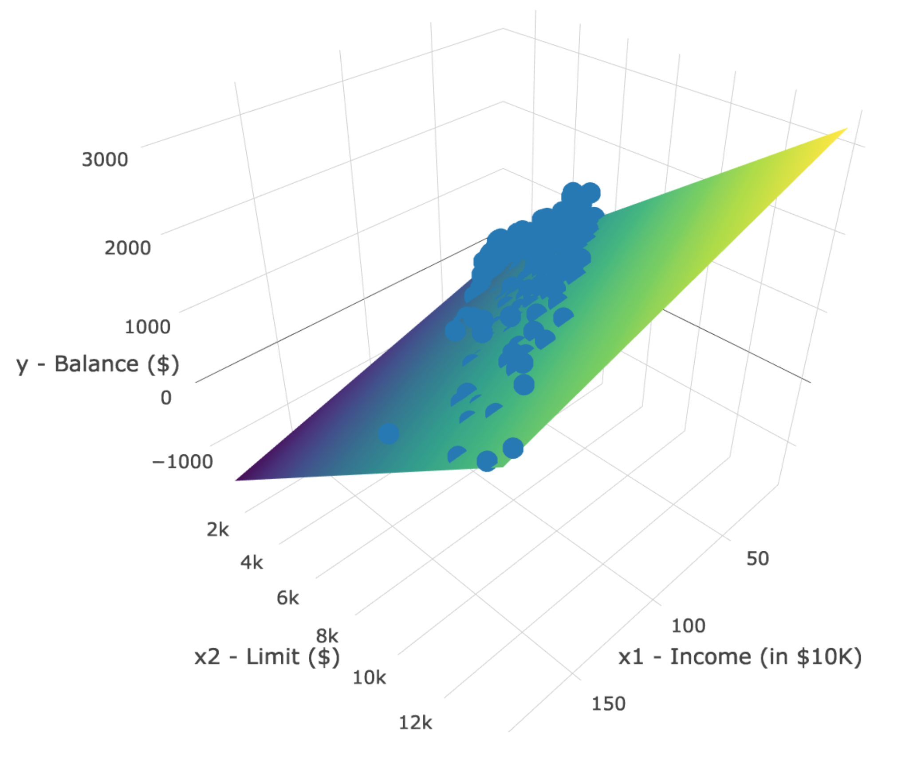
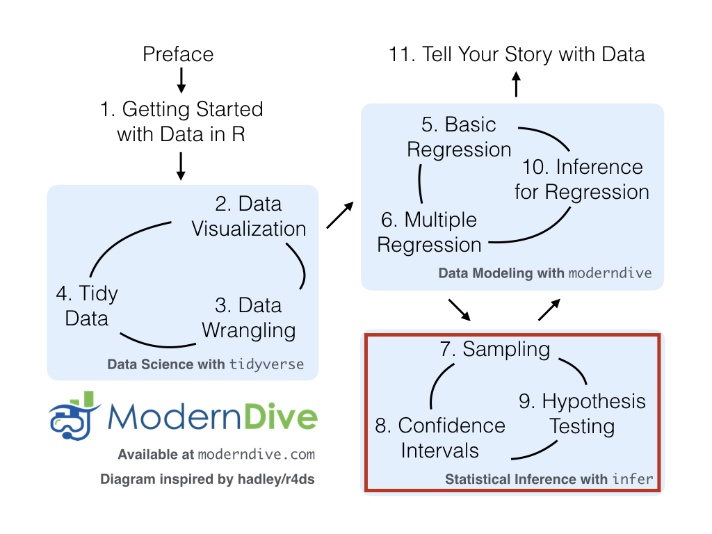

```{r, include=FALSE}
source("_common.R")
```

# 다중 회귀 분석 {#multiple-regression}

```{r, include=FALSE, purl=FALSE}
# 학습 확인(Learning Check) 번호를 정의하는 데 사용됨:
chap <- 6
lc <- 0

# R 코드 청크 기본값 설정:
knitr::opts_chunk$set(
  echo = TRUE,
  eval = TRUE,
  warning = FALSE,
  message = TRUE,
  tidy = FALSE,
  purl = TRUE,
  out.width = "\\textwidth",
  fig.height = 4,
  fig.align = "center"
)

# 출력 자릿수 정밀도 설정
options(scipen = 99, digits = 3)

# kable 출력에서 모든 NA를 공백으로 대체
options(knitr.kable.NA = "")

# 재현 가능한 의사 난수 생성을 위해 난수 생성기 시드 값 설정.
set.seed(76)
```

 @sec-regression장에서는 설명을 위한 모델링과 관련된 개념들, 특히 모델링의 목표가 결과 변수 $y$와 설명 변수 $x$ 사이의 관계를 명확히 하는 것임을 소개했습니다. 모델링에는 많은 접근 방식이 있지만, 우리는 가장 흔히 사용되고 이해하기 쉬운 기법 중 하나인 *선형 회귀(linear regression)*에 집중했습니다. 또한 내용을 단순하게 유지하기 위해, @sec-model1절에서 다룬 수치형 $x$ 변수나 @sec-model2절에서 다룬 범주형 $x$ 변수와 같이 단 하나의 설명 변수만을 갖는 모델을 고려했습니다.

다중 회귀 분석을 다루는 이번 장에서는 두 개 이상의 설명 변수 $x$를 포함하는 모델을 살펴보기 시작할 것입니다. @sec-model1절의 강의 평가 점수나 @sec-model2절의 기대 수명과 같은 특정 결과 변수를 모델링할 때, 단 하나 이상의 설명 변수 정보를 포함하는 것이 유용할 것임을 짐작할 수 있습니다.

이제 회귀 모델이 두 개 이상의 설명 변수를 고려하게 되므로, 임의의 한 설명 변수가 결과 변수에 미치는 연관된 효과에 대한 해석은 모델에 포함된 다른 설명 변수들과 연계하여 이루어져야 합니다. 그럼 시작해 봅시다!

### 필요한 패키지 {-#mult-reg-packages}

이번 장에 필요한 모든 패키지를 로드해 보겠습니다(이미 설치했다고 가정합니다). @sec-tidyverse-package절에서 논의했듯이, `library(tidyverse)`를 실행하여 `tidyverse` 패키지를 로드하면 다음과 같이 자주 사용되는 데이터 과학 패키지들을 한꺼번에 로드합니다.

* 데이터 시각화를 위한 `ggplot2`
* 데이터 전처리를 위한 `dplyr`
* 데이터 형식을 "깔끔하게" 변환하기 위한 `tidyr`
* 스프레드시트 데이터를 R로 불러오기 위한 `readr`
* 그 외 심화 패키지인 `purrr`, `tibble`, `stringr`, `forcats`

필요하다면 @sec-packages절을 참고하여 R 패키지를 설치하고 로드하는 방법을 다시 확인하세요.

```{r, eval=FALSE}
library(tidyverse)
library(moderndive)
library(skimr)
library(ISLR)
```
```{r, echo=FALSE, message=FALSE, purl=TRUE}
# 독자에게 보여지는 위 청크의 코드는 이 책을 빌드할 때 실제 실행되는 아래 코드가 다릅니다.
# 특히 skimr 패키지를 로드하지 않습니다.
# 
# 그 이유는 이 책에서 사용한 skimr v1.0.6이 나머지 장들의 모든 kable() 코드를 
# 깨지게 만들기 때문입니다. v2에서 이 문제가 해결되었을 수 있습니다:
# https://github.com/moderndive/ModernDive_book/issues/271

# ModernDive v1의 대안으로, 이번 장의 모든 skimr::skim( 출력은 하드코딩되었습니다.
library(tidyverse)
library(moderndive)
# library(skimr)
library(gapminder)
```

```{r, message=FALSE, echo=FALSE, purl=FALSE}
# 내부적으로는 필요하지만 본문에는 나타나지 않는 패키지들:
library(kableExtra)
library(patchwork)
library(gapminder)
library(ISLR)
```


## 수치형 설명 변수 하나와 범주형 설명 변수 하나 {#model4}

 @sec-model1절에서 소개한 텍사스 대학교 오스틴 캠퍼스(UT Austin)의 강의 평가 데이터를 다시 살펴보겠습니다. 우리는 학생들의 강의 평가 점수와 "미모(beauty)" 점수 사이의 관계를 연구했습니다. 강의 평가 점수인 `score`는 수치형 결과 변수 $y$였고, 미모 점수인 `bty_avg`는 수치형 설명 변수 $x$였습니다.

이 섹션에서는 다른 모델을 고려해 보겠습니다. 결과 변수는 여전히 강의 평가 점수이지만, 수치형 결과 변수 $y$는 강사의 강의 평가 점수입니다. 두 개의 설명 변수인 수치형 설명 변수 $x_1$ (강사의 연령)과 범주형 설명 변수 $x_2$ (강사의 이분법적 성별)이라는 두 가지 다른 설명 변수를 포함할 것입니다. 나이가 많은 강사가 학생들로부터 더 좋은 강의 평가를 받을까요? 아니면 젊은 강사가 더 좋은 평가를 받을까요? 성별에 따라 학생들이 부여하는 강의 평가 점수에 차이가 있을까요? 우리는 다음과 같은 변수들을 사용하여 *다중 회귀 분석(multiple regression)* \index{regression!multiple linear}으로 이들 변수 사이의 관계를 모델링함으로써 질문에 답할 것입니다.

1. 수치형 결과 변수 $y$: 강사의 강의 평가 점수.
2. 두 개의 설명 변수:
    1. 수치형 설명 변수 $x_1$: 강사의 연령.
    2. 범주형 설명 변수 $x_2$: 강사의 (이분법적) 성별.

이 연구가 수행된 당시에는 성별에 대한 통념으로 인해 이 변수가 이분법적 변수로 기록되었다는 점에 유의해야 합니다. 성별을 이처럼 단순화한 모델의 결과가 완벽하지 않을 수 있지만, 우리는 그 결과가 오늘날에도 여전히 유의미하고 관련이 있다고 생각합니다.


### 탐색적 데이터 분석 {#model4EDA}

UT 오스틴의 `r evals %>% nrow()`개 강의에 대한 데이터는 `moderndive` 패키지에 포함된 `evals` 데이터 프레임에서 찾을 수 있습니다. 하지만 내용을 단순하게 유지하기 위해, 이번 장에서 고려할 변수들만 `select()`하여 `evals_ch6`라는 새로운 데이터 프레임에 저장해 보겠습니다. 이 변수들은 @sec-regression장에서 선택했던 변수들과는 다릅니다.

```{r}
evals_ch6 <- evals %>%
  select(ID, score, age, gender)
```

 @sec-model1EDA절에서 보았던 탐색적 데이터 분석의 세 가지 공통 단계를 떠올려 보세요.

1. 원 데이터 값 살펴보기.
2. 요약 통계량 계산하기.
3. 데이터 시각화하기.

먼저 RStudio의 스프레드시트 뷰어로 `evals_ch6`를 확인하거나 `dplyr` 패키지의 `glimpse()` 함수를 사용하여 원 데이터 값을 살펴보겠습니다.

```{r}
glimpse(evals_ch6)
```

```{r echo=FALSE, purl=FALSE}
# 이 코드는 동적인 인라인 텍스트 출력을 위해 사용됩니다.
n_evals_ch6 <- evals_ch6 %>% nrow()
```

또한 표 @tbl-model4-data-preview에서 서로 다른 강의에 해당하는 `r n_evals_ch6`개 행 중 무작위로 추출한 5개 행을 표시해 보겠습니다. 샘플링의 무작위성 때문에 여러분은 아마도 다른 5개 행을 보게 될 것입니다.

```{r, eval=FALSE}
evals_ch6 %>% sample_n(size = 5)
```
```{r model4-data-preview, echo=FALSE, purl=FALSE}
evals_ch6 %>%
  sample_n(5) %>%
  kbl(
    digits = 3,
    caption = "UT 오스틴의 463개 강의 중 무작위로 추출한 5개 샘플",
    booktabs = TRUE,
    linesep = ""
  ) %>%
  kable_styling(
    font_size = ifelse(knitr::is_latex_output(), 10, 16),
    latex_options = c("hold_position")
  )
```

`evals_ch6` 데이터 프레임의 원 데이터 값을 살펴보고 데이터에 대한 감을 잡았으니, 이제 요약 통계량을 계산해 보겠습니다. 이전 장의 @sec-model1EDA절와 @sec-model2EDA에서 수행했던 탐색적 데이터 분석과 마찬가지로, 모델에서 관심 있는 변수들만 `select()`하여 `skimr` 패키지의 `skim()` 함수를 사용해 봅시다. \index{R packages!skimr!skim()}

```{r, eval=FALSE}
evals_ch6 %>% select(score, age, gender) %>% skim()
```
```
Skim summary statistics
 n obs: 463 
 n variables: 3 

── Variable type:factor 
  variable missing complete   n n_unique                top_counts ordered
    gender       0      463 463        2 mal: 268, fem: 195, NA: 0   FALSE

── Variable type:integer 
  variable missing complete   n  mean  sd p0 p25 p50 p75 p100
       age       0      463 463 48.37 9.8 29  42  48  57   73

── Variable type:numeric
  variable missing complete   n mean   sd  p0 p25 p50 p75 p100
     score       0      463 463 4.17 0.54 2.3 3.8 4.3 4.6    5
```

결측 데이터가 없으며, 남성 강사가 가르치는 강의는 `r evals_ch6 %>% filter(gender == "male") %>% nrow()`개, 여성 강사가 가르치는 강의는 `r evals_ch6 %>% filter(gender == "female") %>% nrow()`개임을 알 수 있습니다. 또한 강사의 평균 연령은 `r evals_ch6$age %>% mean() %>% round(digits = 2)`세입니다. 각 행은 특정 강의를 나타내며 동일한 강사가 흔히 하나 이상의 강의를 가르친다는 점을 떠올려 보세요. 따라서 고유한 강사들의 평균 연령은 다를 수 있습니다.

나아가 두 수치형 변수인 `score`와 `age` 사이의 상관 계수를 계산해 보겠습니다. @sec-model1EDA절에서 상관 계수는 수치형 변수 사이에서만 존재한다고 했던 것을 떠올려 보세요. 이들은 "약하게 음의(weakly negatively)" 상관 관계를 보입니다.

```{r}
evals_ch6 %>% 
  get_correlation(formula = score ~ age)
```

이제 탐색적 데이터 분석의 세 가지 공통 단계 중 마지막 단계인 데이터 시각화를 수행해 보겠습니다. 결과 변수 `score`와 설명 변수 `age`가 모두 수치형이므로 산점도를 사용하여 그 관계를 표시하겠습니다. 그런데 범주형 변수인 `gender`는 어떻게 포함할 수 있을까요? `gender` 변수를 `color` 에스테틱에 매핑(mapping)함으로써 *유색* 산점도를 생성하면 됩니다. 다음 코드는 그림 @fig-numxplot1에서 "미모" 점수에 따른 강의 평가 점수의 산점도를 생성했던 코드와 비슷하지만, `aes()` 매핑에 `color = gender`가 추가되었습니다.

```{r eval=FALSE}
ggplot(evals_ch6, aes(x = age, y = score, color = gender)) +
  geom_point() +
  labs(x = "연령", y = "강의 평가 점수", color = "성별") +
  geom_smooth(method = "lm", se = FALSE)
```

```{r numxcatxplot1, echo=FALSE, fig.cap="강의 평가 점수와 연령 관계의 유색 산점도.", fig.height=3.2, purl=FALSE, message=FALSE}
if (knitr::is_html_output()) {
  ggplot(evals_ch6, aes(x = age, y = score, color = gender)) +
    geom_point() +
    labs(x = "연령", y = "강의 평가 점수", color = "성별") +
    geom_smooth(method = "lm", se = FALSE)
} else {
  ggplot(evals_ch6, aes(x = age, y = score, color = gender)) +
    geom_point() +
    labs(x = "연령", y = "강의 평가 점수", color = "성별") +
    geom_smooth(method = "lm", se = FALSE) +
    scale_color_grey()
}
```

생성된 그림 @fig-numxcatxplot1에서 `ggplot()`이 `gender`의 두 레벨인 `female`과 `male`에 해당하는 점들과 선들에 기본 `r if_else(knitr::is_latex_output(), "", "빨간색/파란색")` 색상 스키마를 할당했음을 확인하세요. 또한 `geom_smooth(method = "lm", se = FALSE)` 레이어는 각 그룹에 대해 서로 다른 회귀 직선을 자동으로 적합시킵니다.

몇 가지 흥미로운 추세를 발견할 수 있습니다. 첫째, $x$ = 60 이상에 `r if_else(knitr::is_latex_output(), "어두운 색", "빨간색")` 점이 없는 것으로 보아 60세 이상의 여성 교수는 거의 없습니다. 둘째, 두 회귀 직선 모두 연령에 따라 음의 기울기를 가지지만(즉, 나이가 많은 강사가 낮은 점수를 받는 경향이 있음), 여성 강사의 연령에 따른 기울기가 *더* 가파른 음수입니다. 다시 말해, 여성 강사가 남성 강사보다 고령인 점에 대해 더 가혹한 불이익을 받고 있습니다.


### 상호작용 모델 {#model4interactiontable}
  
이제 *상호작용 모델(interaction model)* \index{interaction model}로 알려진 다중 회귀 모델의 한 유형을 사용하여 결과 변수 $y$와 두 설명 변수 사이의 관계를 정량화해 보겠습니다. 섹션 끝부분에서 "상호작용"이라는 용어가 어디에서 유래했는지 설명하겠습니다.

특히, 회귀 표의 수치들을 사용하여 그림 @fig-numxcatxplot1의 두 회귀 직선 방정식을 작성해 보겠습니다. 그전에 범주형 설명 변수 $x$가 포함된 회귀 분석에 대해 간단히 복습해 보겠습니다.

 @sec-model2table절에서 우리는 국가가 속한 대륙의 함수로서 국가별 기대 수명에 대한 회귀 모델을 적합시켰습니다. 다시 말해, 수치형 결과 변수 $y$ = `lifeExp`와 5개의 레벨(`Africa`, `Americas`, `Asia`, `Europe`, `Oceania`)을 가진 범주형 설명 변수 $x$ = `continent`를 사용했습니다. 표 @tbl-catxplot4b에서 보았던 회귀 표를 다시 표시해 보겠습니다.

```{r, echo=FALSE, purl=FALSE}
# 데이터 전처리
gapminder2007 <- gapminder %>%
  filter(year == 2007) %>%
  select(country, lifeExp, continent, gdpPercap)

# 회귀 모델 적합:
lifeExp_model <- lm(lifeExp ~ continent, data = gapminder2007)

# 회귀 표 추출 및 kable 출력
get_regression_table(lifeExp_model) %>%
  kbl(
    digits = 3,
    caption = "대륙의 함수로서 기대 수명에 대한 회귀 표",
    booktabs = TRUE,
    linesep = ""
  ) %>%
  kable_styling(
    font_size = ifelse(knitr::is_latex_output(), 10, 16),
    latex_options = c("hold_position")
  )
```

```{r echo=FALSE, purl=FALSE}
# 이 코드는 동적인 인라인 텍스트 출력을 위해 사용됩니다.

# 아래 절편 등을 계산하기 위해 미리 모델을 작성함
lifeExp_model <- lm(lifeExp ~ continent, data = gapminder2007)

# 아프리카 / 절편
intercept <- get_regression_table(lifeExp_model) %>%
  filter(term == "intercept") %>%
  pull(estimate) %>%
  round(1)

# 아메리카
offset_americas <- get_regression_table(lifeExp_model) %>%
  filter(term == "continent: Americas") %>%
  pull(estimate) %>%
  round(1)
mean_americas <- intercept + offset_americas
```

`estimate` 열에 대한 해석을 떠올려 보세요. `Africa`가 "비교를 위한 기준(baseline for comparison)" 그룹이었으므로, `intercept` 항은 아프리카 모든 국가의 평균 기대 수명인 `r intercept`년에 해당합니다. 나머지 4개의 `estimate` 값은 기준 그룹에 대한 "오프셋(offsets)"에 해당합니다. 예를 들어, 아메리카에 해당하는 "오프셋"은 기준 그룹인 아프리카와 비교했을 때 +`r offset_americas`입니다. 다시 말해, 아메리카 국가들의 평균 기대 수명은 아프리카보다 `r offset_americas`년 *더 높습니다*. 따라서 아메리카 모든 국가의 평균 기대 수명은 `r intercept` + `r offset_americas` = `r mean_americas`입니다. 아시아, 유럽, 오세아니아에 대해서도 동일한 해석이 적용됩니다.

그림 @fig-numxcatxplot1의 `age`와 `gender`를 사용한 강의 평가 `score` 다중 회귀 모델로 돌아가서, @sec-regression장의 2단계 접근 방식을 사용하여 회귀 표를 생성해 보겠습니다. 먼저 `lm()` "선형 모델" 함수를 사용하여 모델을 "적합"시킨 다음 `get_regression_table()` 함수를 적용합니다. 이번에는 모델 공식이 `y ~ x` 형식이 아니라 `y ~ x1 * x2` 형식이 됩니다. 즉, 두 설명 변수 `x1`과 `x2`가 `*` 기호로 구분됩니다.

```{r, eval=FALSE}
# 회귀 모델 적합:
score_model_interaction <- lm(score ~ age * gender, data = evals_ch6)

# 회귀 표 추출:
get_regression_table(score_model_interaction)
```
```{r regtable-interaction, echo=FALSE, purl=FALSE}
score_model_interaction <- lm(score ~ age * gender, data = evals_ch6)
get_regression_table(score_model_interaction) %>%
  kbl(
    digits = 3,
    caption = "상호작용 모델에 대한 회귀 표",
    booktabs = TRUE,
    linesep = ""
  ) %>%
  kable_styling(
    font_size = ifelse(knitr::is_latex_output(), 10, 16),
    latex_options = c("hold_position")
  )

# 이 코드는 동적인 인라인 텍스트 출력을 위해 사용됩니다.
intercept_female <- get_regression_table(score_model_interaction) %>% 
  filter(term == "intercept") %>% 
  pull(estimate)
slope_female <- get_regression_table(score_model_interaction) %>% 
  filter(term == "age") %>% 
  pull(estimate)
offset_male <- get_regression_table(score_model_interaction) %>% 
  filter(term == "gender: male") %>% 
  pull(estimate)
offset_slope_interaction <- get_regression_table(score_model_interaction) %>% 
  filter(term == "age:gendermale") %>% 
  pull(estimate)
slope_male <- slope_female + offset_slope_interaction
intercept_male <- intercept_female + offset_male
```

표 @tbl-regtable-interaction의 회귀 표 출력 결과를 보면 `estimate` 열에 4개 행의 값이 있습니다. 즉시 명확하게 드러나지는 않지만, 이 4개의 값을 사용하여 그림 @fig-numxcatxplot1의 두 직선 방정식을 작성할 수 있습니다. 먼저 `female`이라는 단어가 알파벳순으로 `male`보다 먼저 오기 때문에 여성 강사가 "비교를 위한 기준" 그룹이 됩니다. 따라서 `intercept`는 *오직 여성 강사만을 위한* 절편입니다.

이는 `age`에 대해서도 마찬가지입니다. 이는 *오직 여성 강사만을 위한* 연령에 따른 기울기입니다. 따라서 그림 @fig-numxcatxplot1에서 `r if_else(knitr::is_latex_output(), "어두운 색", "빨간색")` 회귀 직선은 `r intercept_female`의 절편과 `r slope_female`의 연령에 따른 기울기를 가집니다. 이 데이터에서 절편은 수학적 해석은 가능하지만 강사의 나이가 0세일 수는 없으므로 *실질적인* 해석은 불가능하다는 점을 기억하세요.

그림 @fig-numxcatxplot1의 `r if_else(knitr::is_latex_output(), "밝은 색", "파란색")` 직선인 남성 강사의 절편과 연령에 따른 기울기는 어떨까요? 여기서 다시 한번 "오프셋"이라는 개념이 등장합니다.

`gender: male` 값인 `r offset_male`은 남성 강사의 절편이 아니라, 여성 강사에 대한 남성 강사 절편의 *오프셋(offset)* \index{offset}입니다. 따라서 남성 강사의 절편은 `intercept + gender: male` = `r intercept_female` + (`r offset_male` = `r intercept_female` - `r -1*offset_male` = `r intercept_female + offset_male`입니다.

마찬가지로 `age:gendermale` = `r offset_slope_interaction`은 남성 강사의 연령에 따른 기울기가 아니라, 남성 강사 기울기의 *오프셋*입니다. 그러므로 남성 강사의 연령에 따른 기울기는 `age + age:gendermale` $= `r slope_female` + `r offset_slope_interaction` = `r slope_male`입니다. 따라서 그림 @fig-numxcatxplot1에서 `r if_else(knitr::is_latex_output(), "밝은 색", "파란색")` 회귀 직선은 `r intercept_female + offset_male`의 절편과 `r slope_male`의 연령에 따른 기울기를 가집니다. 이 값들을 표 @tbl-interaction-summary에 정리하고 두 연령별 기울기에 집중해 보겠습니다.

```{r interaction-summary, echo=FALSE, purl=FALSE}
options(digits = 4)
tibble(
  성별 = c("여성 강사", "남성 강사"),
  절편 = c(intercept_female, intercept_male),
  `연령별 기울기` = c(slope_female, slope_male)
) %>%
  kbl(
    digits = 4,
    caption = "상호작용 모델의 절편 및 기울기 비교",
    booktabs = TRUE,
    linesep = ""
  ) %>%
  kable_styling(
    font_size = ifelse(knitr::is_latex_output(), 10, 16),
    latex_options = c("hold_position")
  )
options(digits = 3)
```

여성 강사의 연령별 기울기가 `r slope_female`이었으므로, 이는 평균적으로 한 살 더 많은 여성 강사의 강의 평가 점수가 `r -1*slope_female`단위만큼 **더 낮음**을 의미합니다. 그러나 남성 강사의 경우 그에 상응하는 연관된 감소 폭은 평균적으로 `r -1*slope_male`단위뿐입니다. 두 연령별 기울기 모두 음수이지만, 여성 강사의 기울기가 *더 큰 음수*입니다. 이는 그림 @fig-numxcatxplot1에서의 관찰 결과와 일치하며, 이 모델은 연령이 남성 강사보다 여성 강사의 강의 평가 점수에 더 큰 영향을 미친다는 점을 시사합니다.

이제 회귀 직선의 방정식을 작성해 보겠습니다. 이 방정식은 적합값 $\widehat{y} = \widehat{\text{score}}$를 계산하는 데 사용할 수 있습니다.

<!--
주: 아래 LaTeX의 마크다운 미리보기가 깨져 보일 수 있지만, 
HTML 출력물에서는 정상적으로 표시됩니다.
-->
$$
\begin{aligned}
\widehat{y} = \widehat{\text{score}} &= b_0 + b_{\text{age}} \cdot \text{age} + b_{\text{male}} \cdot \mathbb{1}_{\text{is male}}(x) + b_{\text{age,male}} \cdot \text{age} \cdot \mathbb{1}_{\text{is male}}(x)\\
&= `r intercept_female` `r slope_female` \cdot \text{age} - `r -1*offset_male` \cdot \mathbb{1}_{\text{is male}}(x) + `r offset_slope_interaction` \cdot \text{age} \cdot \mathbb{1}_{\text{is male}}(x)
\end{aligned}
$$

와! @sec-model2table절에서 보았던 대륙의 함수로서 기대 수명 방정식보다 더 위협적으로 보이네요! 하지만 "지시 함수(indicator function)"가 무엇을 하는지 기억한다면 방정식은 크게 단순화됩니다. 위 방정식에는 우리가 관심을 갖는 지시 함수가 하나 있습니다.

$$
\mathbb{1}_{\text{is male}}(x) = \left\{
\begin{array}{ll}
1 & \text{만약 강사 } x \text{가 남성인 경우} \\
0 & \text{그 외의 경우}\end{array}
\right.
$$

둘째, 위 방정식의 계수들과 표 @tbl-regtable-interaction에 있는 회귀 표의 `estimate` 열 값을 매칭해 봅시다.

1. $b_0$는 여성 강사의 `intercept` = `r intercept_female`입니다.
1. $b_{\text{age}}$는 여성 강사의 `age`에 대한 기울기 = `r slope_female`입니다.
1. $b_{\text{male}}$은 남성 강사의 절편 오프셋 = `r offset_male`입니다.
1. $b_{\text{age,male}}$은 남성 강사의 연령별 기울기 오프셋 = `r offset_slope_interaction`입니다.

이 모든 것을 종합하여 여성 강사의 적합값 $\widehat{y} = \widehat{\text{score}}$를 계산해 봅시다. 여성 강사의 경우 $\mathbb{1}_{\text{is male}}(x)$ = 0이므로 이전 방정식은 다음과 같이 됩니다.

$$
\begin{aligned}
\widehat{y} = \widehat{\text{score}} &= `r intercept_female` - `r -1*slope_female` \cdot \text{age} - `r -1*offset_male` \cdot 0 + `r offset_slope_interaction` \cdot \text{age} \cdot 0\\
&= `r intercept_female` - `r -1*slope_female` \cdot \text{age} - 0 + 0\\
&= `r intercept_female` - `r -1*slope_female` \cdot \text{age}\\
\end{aligned}
$$

이는 그림 @fig-numxcatxplot1에서 여성 강사에 해당하는 `r if_else(knitr::is_latex_output(), "어두운 색", "빨간색")` 회귀 직선 방정식이며 표 @tbl-interaction-summary의 내용과 일치합니다. 마찬가지로 남성 강사의 경우 $\mathbb{1}_{\text{is male}}(x)$ = 1이므로 이전 방정식은 다음과 같이 됩니다.

$$
\begin{aligned}
\widehat{y} = \widehat{\text{score}} &= `r intercept_female` - `r -1*slope_female` \cdot \text{age} - `r -1*offset_male` + `r offset_slope_interaction` \cdot \text{age}\\
&= (`r intercept_female` - `r -1*offset_male`) + (- `r -1*slope_female` + `r offset_slope_interaction`) \cdot \text{age}\\
&= `r intercept_male` - `r -1*slope_male` \cdot \text{age}\\
\end{aligned}
$$

이는 그림 @fig-numxcatxplot1에서 남성 강사에 해당하는 `r if_else(knitr::is_latex_output(), "밝은 색", "파란색")` 회귀 직선 방정식이며 표 @tbl-interaction-summary의 내용과 일치합니다.

휴! 산술 계산이 꽤 많았네요! 하지만 걱정하지 마세요. 이 책에서 다루는 모델링 중 가장 어려운 수준입니다. 지시 함수를 사용하거나 회귀 모델에서 범주형 설명 변수를 사용하는 것이 여전히 조금 불확실하다면, @sec-model2table절을 다시 읽어보시기를 *강력히* 권장합니다. 그곳은 단 하나의 범주형 설명 변수만 다루므로 훨씬 단순합니다.

이 섹션을 마치기 전에 왜 이런 유형의 모델을 "상호작용 모델"이라고 부르는지 설명하겠습니다. 적합값 $\widehat{y}$ = $\widehat{\text{score}}$ 방정식에 있는 $b_{\text{age,male}}$ 항은 통계 모델링에서 "상호작용 효과(interaction effect)"라고 알려진 것입니다. 상호작용 항은 표 @tbl-regtable-interaction의 회귀 표 마지막 행에 있는 `age:gendermale` = `r offset_slope_interaction`에 해당합니다.

한 변수의 연관된 효과가 *다른 변수의 값에 따라 달라질 때* 상호작용 효과가 있다고 말합니다. 즉, 두 변수가 서로 "상호작용"하고 있는 것입니다. 여기에서 나이 변수의 연관된 효과는 다른 변수인 성별의 값에 *따라 달라집니다*. 여성 강사 대비 남성 강사의 연령별 기울기 차이가 +`r offset_slope_interaction`이라는 사실이 이를 보여줍니다. \index{regression!multiple linear!interactions model}

강의 평가 점수에 대한 상호작용 효과를 생각하는 또 다른 방법은 다음과 같습니다. UT 오스틴의 특정 강사에 대해 연령 *그 자체*에 따른 연관된 효과가 있을 수 있고 성별 *그 자체*에 따른 연관된 효과가 있을 수 있지만, 연령과 성별이 *함께* 고려될 때 두 개별 효과 이상의 *추가적인 효과*가 있을 수 있습니다.


### 평행 직선 모델 {#model4table}

수치형 설명 변수 하나와 범주형 설명 변수 하나를 사용하는 회귀 모델을 만들 때, 방금 살펴본 상호작용 모델만 가능한 것은 아닙니다. 우리가 사용할 수 있는 또 다른 유형의 모델은 *평행 직선(parallel slopes)* 모델이라고 알려져 있습니다. \index{parallel slopes model} 회귀 직선들이 서로 다른 절편과 서로 다른 기울기를 가질 수 있는 상호작용 모델과 달리, 평행 직선 모델은 서로 다른 절편은 허용하지만 모든 직선이 동일한 기울기를 갖도록 *강제*합니다. 따라서 결과적으로 나타나는 회귀 직선들은 평행합니다. `evals_ch6`에 대해 가장 잘 맞는 평행 직선 모델을 시각화해 보겠습니다.

안타깝게도 `ggplot2` 패키지의 `geom_smooth()` 함수에는 평행 직선 모델을 그리는 편리한 방법이 없습니다. 그래서 Evgeni Chasnovski는 `moderndive` 패키지에 포함된 `geom_parallel_slopes()` \index{moderndive!geom\_parallel\_slopes()}라는 특수 목적 함수를 만들었습니다. `geom_parallel_slopes()`는 `ggplot2` 패키지가 아니라 `moderndive` 패키지에서 찾을 수 있습니다. 따라서 이 함수를 사용하려면 `ggplot2`와 `moderndive` 패키지를 모두 로드해야 합니다. 이 함수를 사용하여 강의 평가 점수에 대한 평행 직선 모델을 그려보겠습니다. 코드가 그림 @fig-numxcatxplot1에서 상호작용 모델의 시각화를 생성한 코드와 거의 동일하지만, `geom_smooth(method = "lm", se = FALSE)` 레이어가 `geom_parallel_slopes(se = FALSE)`로 바뀌었다는 점에 주목하세요.

```{r eval=FALSE}
ggplot(evals_ch6, aes(x = age, y = score, color = gender)) +
  geom_point() +
  labs(x = "연령", y = "강의 평가 점수", color = "성별") +
  geom_parallel_slopes(se = FALSE)
```

```{r numxcatx-parallel, echo=FALSE, fig.cap="연령과 성별에 따른 강의 평가 점수의 평행 직선 모델.", fig.height=3.5, purl=FALSE}
par_slopes <- ggplot(evals_ch6, aes(x = age, y = score, color = gender)) +
  geom_point() +
  labs(x = "연령", y = "강의 평가 점수", color = "성별") +
  geom_parallel_slopes(se = FALSE)
if (knitr::is_html_output()) {
  par_slopes
} else {
  par_slopes +
    scale_color_grey()
}
```

그림 @fig-numxcatx-parallel에서 여성 강사와 남성 강사에 각각 대응하는 평행한 직선들을 볼 수 있습니다. 여기서는 동일한 음의 기울기를 가집니다. 이는 나이가 많은 강사가 젊은 강사보다 낮은 강의 평가 점수를 받는 경향이 있음을 말해줍니다. 또한 직선이 평행하므로 고령에 따른 연관된 불이익은 여성 강사와 남성 강사 모두에게 동일하다고 가정됩니다.

그러나 그림 @fig-numxcatx-parallel에서 남성 강사에 해당하는 `r if_else(knitr::is_latex_output(), "밝은 색", "파란색")` 직선이 여성 강사에 해당하는 `r if_else(knitr::is_latex_output(), "어두운 색", "빨간색")` 직선보다 더 높다는 사실에서 알 수 있듯이, 이 두 직선은 서로 다른 절편을 가집니다. 이는 연령에 관계없이 여성 강사가 남성 강사보다 더 낮은 강의 평가 점수를 받는 경향이 있음을 말해줍니다.

두 개의 절편과 하나의 공통 기울기에 대한 정확한 수치를 얻기 위해, 다시 한번 `lm()` "선형 모델" 함수를 사용하여 모델을 "적합"시킨 다음 `get_regression_table()` 함수를 적용해 보겠습니다. 하지만 모델 공식이 `y ~ x1 * x2` 형식이었던 상호작용 모델과 달리, 이제 모델 공식은 `y ~ x1 + x2` 형식이 됩니다. 즉, 두 설명 변수 `x1`과 `x2`가 `+` 기호로 구분됩니다.

```{r, eval=FALSE}
# 회귀 모델 적합:
score_model_parallel_slopes <- lm(score ~ age + gender, data = evals_ch6)
# 회귀 표 추출:
get_regression_table(score_model_parallel_slopes)
```
```{r regtable-parallel-slopes, echo=FALSE, purl=FALSE}
score_model_parallel_slopes <- lm(score ~ age + gender, data = evals_ch6)
get_regression_table(score_model_parallel_slopes) %>%
  kbl(
    digits = 3,
    caption = "평행 직선 모델에 대한 회귀 표",
    booktabs = TRUE,
    linesep = ""
  ) %>%
  kable_styling(
    font_size = ifelse(knitr::is_latex_output(), 10, 16),
    latex_options = c("hold_position")
  )

# 이 코드는 동적인 인라인 텍스트 출력을 위해 사용됩니다.
intercept_female_parallel <- get_regression_table(score_model_parallel_slopes) %>%
  filter(term == "intercept") %>% 
  pull(estimate)
offset_male_parallel <- get_regression_table(score_model_parallel_slopes) %>% 
  filter(term == "gender: male") %>% 
  pull(estimate)
intercept_male_parallel <- intercept_female_parallel + offset_male_parallel
```

표 @tbl-regtable-interaction의 상호작용 모델 회귀 표와 마찬가지로, "비교를 위한 기준"인 여성 강사 그룹의 절편에 해당하는 `intercept` 항과 여성 강사 대비 남성 강사의 절편 *오프셋*에 해당하는 `gender: male` 항이 있습니다. 다시 말해, 그림 @fig-numxcatx-parallel에서 여성 강사에 해당하는 `r if_else(knitr::is_latex_output(), "어두운 색", "빨간색")` 회귀 직선은 `r intercept_female_parallel`의 절편을 가지는 반면, 남성 강사에 해당하는 `r if_else(knitr::is_latex_output(), "밝은 색", "파란색")` 회귀 직선은 `r intercept_female_parallel` + `r offset_male_parallel` = `r intercept_female_parallel + offset_male_parallel`의 절편을 가집니다. 다시 한번 말씀드리자면, 나이가 0세인 강사는 없으므로 이 절편들은 수학적 해석만 가능할 뿐 실질적인 해석은 불가능합니다.

```{r echo=FALSE}
age_coef <- get_regression_table(score_model_parallel_slopes) %>%
  filter(term == "age") %>%
  pull(estimate)
```

그러나 표 @tbl-regtable-interaction와 달리 이제 연령에 대한 기울기는 `r age_coef` 하나뿐입니다. 이는 모델이 여성 강사와 남성 강사 모두 동일한 연령별 기울기를 갖도록 규정하고 있기 때문입니다. \index{regression!multiple linear!parallel slopes model} 이는 다른 강사보다 한 살 더 많은 강사가 평균적으로 `r abs(age_coef)`단위만큼 *더 낮은* 강의 평가 점수를 받았음을 말해줍니다. 이러한 고령에 따른 불이익은 여성 강사와 남성 강사 모두에게 동일하게 적용됩니다.

이 값들을 표 @tbl-parallel-slopes-summary에 정리해 보겠습니다. 절편은 다르지만 기울기는 공통이라는 점에 주목하세요.

```{r parallel-slopes-summary, echo=FALSE, purl=FALSE}
options(digits = 4)
tibble(
  성별 = c("여성 강사", "남성 강사"),
  절편 = c(intercept_female_parallel, intercept_male_parallel),
  `연령별 기울기` = c(age_coef, age_coef)
) %>%
  kbl(
    digits = 4,
    caption = "평행 직선 모델의 절편 및 기울기 비교",
    booktabs = TRUE,
    linesep = ""
  ) %>%
  kable_styling(
    font_size = ifelse(knitr::is_latex_output(), 10, 16),
    latex_options = c("hold_position")
  )
options(digits = 3)
```

이제 적합값 $\widehat{y} = \widehat{\text{score}}$를 계산하는 데 사용할 수 있는 회귀 직선 방정식을 작성해 보겠습니다.

<!--
주: 아래 LaTeX의 마크다운 미리보기가 깨져 보일 수 있지만, 
HTML 출력물에서는 정상적으로 표시됩니다.
-->
$$
\begin{aligned}
\widehat{y} = \widehat{\text{score}} &= b_0 + b_{\text{age}} \cdot \text{age} + b_{\text{male}} \cdot \mathbb{1}_{\text{is male}}(x)\\
&= `r intercept_female_parallel` `r age_coef` \cdot \text{age} + `r offset_male_parallel` \cdot \mathbb{1}_{\text{is male}}(x)
\end{aligned}
$$

이 모든 것을 종합하여 여성 강사의 적합값 $\widehat{y} = \widehat{\text{score}}$를 계산해 봅시다. 여성 강사의 경우 지시 함수 $\mathbb{1}_{\text{is male}}(x)$ = 0이므로 이전 방정식은 다음과 같이 됩니다.

$$
\begin{aligned}
\widehat{y} = \widehat{\text{score}} &= `r intercept_female_parallel` `r age_coef` \cdot \text{age} + `r offset_male_parallel` \cdot 0\\
&= `r intercept_female_parallel` `r age_coef` \cdot \text{age}
\end{aligned}
$$

이는 그림 @fig-numxcatx-parallel에서 여성 강사에 해당하는 `r if_else(knitr::is_latex_output(), "어두운 색", "빨간색")` 회귀 직선 방정식입니다. 마찬가지로 남성 강사의 경우 지시 함수 $\mathbb{1}_{\text{is male}}(x)$ = 1이므로 이전 방정식은 다음과 같이 됩니다.

$$
\begin{aligned}
\widehat{y} = \widehat{\text{score}} &= `r intercept_female_parallel` `r age_coef` \cdot \text{age} + `r offset_male_parallel` \cdot 1\\
&= (`r intercept_female_parallel` + `r offset_male_parallel`) `r age_coef` \cdot \text{age}\\
&= `r intercept_male_parallel` `r age_coef` \cdot \text{age}
\end{aligned}
$$

이는 그림 @fig-numxcatx-parallel에서 남성 강사에 해당하는 `r if_else(knitr::is_latex_output(), "밝은 색", "파란색")` 회귀 직선 방정식입니다.

좋습니다! 우리는 데이터에 대해 상호작용 모델과 평행 직선 모델을 모두 고려해 보았습니다. 그림 @fig-numxcatx-comparison에서 두 모델의 시각화 결과를 나란히 비교해 보겠습니다.

```{r numxcatx-comparison, fig.width=8, echo=FALSE, fig.cap="상호작용 모델과 평행 직선 모델의 비교.", purl=FALSE, message=FALSE}
interaction_plot <- ggplot(evals_ch6, aes(x = age, y = score, color = gender)) +
  geom_point(show.legend = FALSE) +
  labs(x = "연령", y = "강의 평가 점수", title = "상호작용 모델") +
  geom_smooth(method = "lm", se = FALSE) +
  theme(legend.position = "none")
parallel_slopes_plot <- ggplot(evals_ch6, aes(x = age, y = score, color = gender)) +
  geom_point(show.legend = FALSE) +
  geom_parallel_slopes(se = FALSE) +
  labs(x = "연령", y = "강의 평가 점수", title = "평행 직선 모델") +
  theme(axis.title.y = element_blank())

if (knitr::is_html_output()) {
  interaction_plot + parallel_slopes_plot
} else {
  grey_interaction_plot <- interaction_plot +
    scale_color_grey()
  grey_parallel_slopes_plot <- parallel_slopes_plot +
    scale_color_grey()
  grey_interaction_plot + grey_parallel_slopes_plot
}
```

이 시점에서 여러분은 스스로에게 이렇게 물을지도 모릅니다. "평행 직선 모델을 도대체 왜 사용하나요?" 그림 @fig-numxcatx-comparison의 왼쪽 그래프를 보면 두 직선은 분명히 평행해 보이지 않는데, 왜 굳이 평행하게 *강제*하느냐는 것이죠. 이 데이터에 대해서는 저희도 동의합니다! 왼쪽의 상호작용 모델이 더 적절하다고 쉽게 주장할 수 있습니다. 하지만 이어지는 @sec-model-selection절 모델 선택 파트에서 평행 직선 모델이 더 강력한 설득력을 갖는 사례를 제시할 것입니다.


### 관측값/적합값 및 잔차 {#model4points}

간결성을 위해, 이 섹션에서는 `score_model_interaction`에 저장된 상호작용 모델에 대해서만 관측값, 적합값 및 잔차를 계산하겠습니다. 평행 직선 모델에 대한 해당 값들은 이어지는 *학습 확인(Learning check)*에서 살펴볼 기회가 있을 것입니다.

```{r echo=FALSE, purl=FALSE}
# 이 코드는 동적인 인라인 텍스트 출력을 위해 사용됩니다.
ex_female_age <- 36
ex_male_age <- 59
```

예를 들어, 여성이고 `r ex_female_age`세인 강사가 있다고 가정해 봅시다. 우리 모델은 어떤 적합값 $\widehat{y}$ = $\widehat{\text{score}}$를 산출할까요? 또한 남성이고 `r ex_male_age`세인 다른 강사가 있다고 가정해 봅시다. 그들의 적합값 $\widehat{y}$는 얼마일까요?

먼저 여성 강사의 경우, 그림 @fig-fitted-values에서 $x$ = 연령 = `r ex_female_age`인 수직선과 `r if_else(knitr::is_latex_output(), "어두운 색", "빨간색")` 회귀 직선의 교차점을 찾아 시각적으로 답할 수 있습니다. 이 값을 그림 @fig-fitted-values에 커다란 `r if_else(knitr::is_latex_output(), "어두운 색", "빨간색")` 점으로 표시했습니다. 마찬가지로 남성 강사의 경우, 그림 @fig-fitted-values에서 $x$ = 연령 = `r ex_male_age`인 수직선과 `r if_else(knitr::is_latex_output(), "밝은 색", "파란색")` 회귀 직선의 교차점을 찾아 적합값 $\widehat{y}$ = $\widehat{\text{score}}$를 식별할 수 있습니다. 이 값을 그림 @fig-fitted-values에 커다란 `r if_else(knitr::is_latex_output(), "밝은 색", "파란색")` 점으로 표시했습니다.

```{r fitted-values, echo=FALSE, fig.cap="두 새로운 교수에 대한 적합값.", fig.height=4.7, purl=FALSE, message=FALSE}
newpoints <- evals_ch6 %>%
  slice(c(1, 5)) %>%
  get_regression_points(score_model_interaction, newdata = .)

fitted_plot <- ggplot(evals_ch6, aes(x = age, y = score, color = gender)) +
  geom_point(show.legend = FALSE) +
  labs(x = "연령", y = "강의 평가 점수", title = "상호작용 모델") +
  geom_smooth(method = "lm", se = FALSE) +
  geom_vline(data = newpoints, aes(xintercept = age, col = gender), linetype = "dashed", size = 1, show.legend = FALSE) +
  geom_point(data = newpoints, aes(x = age, y = score_hat), size = 4, show.legend = FALSE)

if (knitr::is_html_output()) {
  fitted_plot
} else {
  fitted_plot + scale_color_grey()
}
```

이 두 $\widehat{y}$ = $\widehat{\text{score}}$ 값은 정확히 얼마일까요? @sec-model4interactiontable절에서 계산했던 두 회귀 직선의 방정식을 사용할 수 있으며, 이 방정식은 표 @tbl-regtable-interaction의 회귀 표 값을 기반으로 합니다.

* 모든 여성 강사: $\widehat{y} = \widehat{\text{score}} = `r intercept_female` - `r -1*slope_female` \cdot \text{연령}$
* 모든 남성 강사: $\widehat{y} = \widehat{\text{score}} = `r intercept_male` - `r -1*slope_male` \cdot \text{연령}$

따라서 우리의 적합값은 각각 $`r intercept_female` - `r -1 * slope_female` \cdot `r ex_female_age` = `r (intercept_female + (slope_female*ex_female_age)) %>% round(2)`$와 $`r intercept_male` - `r -1*slope_male` \cdot `r ex_male_age` = `r (intercept_male + (slope_male*ex_male_age)) %>% round(2)`$가 됩니다.

이제 이 두 명의 강사뿐만 아니라 `evals_ch6` 데이터 프레임에 포함된 모든 `r n_evals_ch6`개 강의의 강사들에 대한 적합값을 원한다면 어떻게 해야 할까요? 이를 수작업으로 하는 것은 지루하고 오래 걸리는 일일 것입니다! 여기서 `moderndive` 패키지의 `get_regression_points()` 함수가 도움이 될 수 있습니다. 이 함수는 모든 `r n_evals_ch6`개 강의에 대해 위의 계산을 빠르게 자동화해 줍니다. 표 @tbl-model4-points-table에 `r n_evals_ch6`개 중 처음 10개 행의 미리보기를 제시합니다.

```{r, eval=FALSE}
regression_points <- get_regression_points(score_model_interaction)
regression_points
```
```{r model4-points-table, echo=FALSE, purl=FALSE}
regression_points <- get_regression_points(score_model_interaction)
regression_points %>%
  slice(1:10) %>%
  kbl(
    digits = 3,
    caption = "회귀 포인트(463개 강의 중 처음 10개)",
    booktabs = TRUE,
    linesep = ""
  ) %>%
  kable_styling(
    font_size = ifelse(knitr::is_latex_output(), 10, 16),
    latex_options = c("hold_position")
  )
```

알고 보니 `r ex_female_age`세인 여성 강사는 처음 4개 강의를 가르쳤고, 남성 강사는 그다음 3개 강의를 가르쳤습니다. 결과적인 $\widehat{y}$ = $\widehat{\text{score}}$ 적합값은 `score_hat` 열에 있습니다. 또한 `get_regression_points()` 함수는 잔차 $y-\widehat{y}$도 반환합니다. 예를 들어, `r ex_female_age`세인 여성 강사가 가르친 첫 번째와 네 번째 강의는 양의 잔차를 가지는데, 이는 학생들이 부여한 실제 강의 평가 점수가 적합값인 4.25보다 높았음을 나타냅니다. 반면, 이 강사가 가르친 두 번째와 세 번째 강의는 음의 잔차를 가지는데, 이는 실제 강의 평가 점수가 4.25보다 낮았음을 나타냅니다.

```{block, type="learncheck", purl=FALSE}
\vspace{-0.15in}
**_학습 확인_**
\vspace{-0.1in}
```

**`r paste0("(LC", chap, ".", (lc <- lc + 1), ")")`** 방금 했던 상호작용 모델이 아니라, `score_model_parallel_slopes`에 저장했던 평행 직선 모델에 대해 관측값, 적합값 및 잔차를 계산해 보세요.

```{block, type="learncheck", purl=FALSE}
\vspace{-0.25in}
\vspace{-0.25in}
```


## 두 수치형 설명 변수 {#model3}

이제 주제를 바꿔서 수치형 설명 변수 하나와 범주형 설명 변수 하나 대신, 두 개의 수치형 설명 변수를 사용하는 다중 회귀 모델을 고려해 보겠습니다. 우리가 사용할 데이터 세트는 통계 및 머신러닝에 관한 중급 수준의 교과서인 [*An Introduction to Statistical Learning with Applications in R (ISLR)*](https://www.statlearning.com/ [@islr2017]에서 가져왔습니다. 동반된 `ISLR` R 패키지에는 저자들이 다양한 머신러닝 방법을 적용한 데이터 세트들이 포함되어 있습니다.

이 책에서 자주 사용되는 데이터 세트 중 하나은 `Credit` 데이터 세트로, 관심 있는 결과 변수는 `r Credit %>% nrow()`명의 개인별 신용카드 부채(debt)입니다. 수입, 신용 한도, 신용 등급, 연령과 같은 다른 변수들도 포함되어 있습니다. `Credit` 데이터는 실제 개인의 금융 정보를 바탕으로 한 것이 아니라 교육 목적으로 사용되는 시뮬레이션 데이터 세트라는 점에 유의하세요.

이 섹션에서는 다음과 같은 변수들을 사용하여 회귀 모델을 적합시킬 것입니다.

1. 수치형 결과 변수 $y$: 카드 소지자의 신용카드 부채.
2. 두 개의 설명 변수:
    1. 수치형 설명 변수 $x_1$: 카드 소지자의 신용 한도(credit limit).
    2. 또 다른 수치형 설명 변수 $x_2$: 카드 소지자의 수입(income, 단위: 1,000달러).


### 탐색적 데이터 분석 {#model3EDA}

`Credit` 데이터 세트를 로드해 보겠습니다\index{R packages!ISLR!Credit data frame}. 내용을 단순하게 유지하기 위해 이번 장에서 고려할 변수들만 `select()`하여 `credit_ch6`라는 새로운 데이터 프레임에 저장하겠습니다. @sec-select절에서 소개했던 것과는 약간 다른 방식으로 `select()` 동사를 사용하는 점에 주목하세요. 예를 들어, `Credit`의 `Balance` 변수를 선택한 다음 이를 `debt`라는 새로운 변수 이름으로 저장할 것입니다. 이는 여기에서 "debt(부채)"라는 용어가 "balance(잔액)"보다 해석하기 더 쉽기 때문입니다.

```{r, message=FALSE}
library(ISLR)
credit_ch6 <- Credit %>% as_tibble() %>% 
  select(ID, debt = Balance, credit_limit = Limit, 
         income = Income, credit_rating = Rating, age = Age)
```

탐색적 데이터 분석의 첫 번째 공통 단계인 원 데이터 값 살펴보기에서 `select()` 사용 효과를 확인할 수 있습니다. RStudio의 스프레드시트 뷰어로 확인하거나 `glimpse()`를 사용해 보세요.

```{r}
glimpse(credit_ch6)
```

```{r echo=FALSE, purl=FALSE}
n_credit_ch6 <- credit_ch6 %>% nrow()
```

또한 표 @tbl-model3-data-preview에서 `r n_credit_ch6`명의 신용카드 소지자 중 무작위로 추출한 5명의 샘플을 살펴보겠습니다. 다시 한번 말씀드리지만, 샘플링의 무작위성 때문에 여러분은 아마도 다른 5개 행을 보게 될 것입니다.

```{r, eval=FALSE}
credit_ch6 %>% sample_n(size = 5)
```
```{r model3-data-preview, echo=FALSE, purl=FALSE}
credit_ch6 %>%
  sample_n(5) %>%
  kbl(
    digits = 3,
    caption = "신용카드 소지자 5명의 무작위 샘플",
    booktabs = TRUE,
    linesep = ""
  ) %>%
  kable_styling(
    font_size = ifelse(knitr::is_latex_output(), 10, 16),
    latex_options = c("hold_position")
  )
```

`credit_ch6` 데이터 프레임의 원 데이터 값을 살펴보고 데이터에 대한 감을 잡았으니, 이제 탐색적 데이터 분석의 다음 공통 단계인 요약 통계량 계산으로 넘어가겠습니다. `skimr` 패키지의 `skim()` 함수를 사용하되, 모델에 관심 있는 열들만 `select()`하도록 주의하세요.

```{r, eval=FALSE}
credit_ch6 %>% select(debt, credit_limit, income) %>% skim()
```
```
Skim summary statistics
 n obs: 400 
 n variables: 3 

── Variable type:integer 
  variable missing complete   n    mean      sd  p0     p25    p50     p75  p100
credit_limit     0      400 400 4735.6  2308.2  855 3088    4622.5 5872.75 13913
         debt    0      400 400  520.01  459.76   0   68.75  459.5  863     1999

── Variable type:numeric 
 variable missing complete   n  mean    sd    p0   p25   p50   p75   p100
   income       0      400 400 45.22 35.24 10.35 21.01 33.12 57.47 186.63
```

결과 변수 `debt`의 요약 통계량을 확인해 보세요. 신용카드 부채의 평균과 중앙값은 각각 \$520.01와 \$459.50이며, 카드 소지자의 25%는 부채가 \$68.75 이하입니다. 이제 설명 변수 중 하나인 `credit_limit`를 살펴보면, 신용 한도의 평균과 중앙값은 각각 \$4735.6와 \$4622.50이며, 카드 소지자의 75%는 수입이 \$57,470 이하입니다.

결과 변수 `debt`와 설명 변수 `credit_limit`, `income`이 모두 수치형이므로, 이들 변수 사이의 서로 다른 가능한 모든 쌍에 대해 상관 계수를 계산할 수 있습니다. 먼저 @sec-model1EDA절에서 보았던 `get_correlation()` 명령을 각 설명 변수에 대해 한 번씩, 총 두 번 실행할 수 있습니다.

```{r, eval=FALSE}
credit_ch6 %>% get_correlation(debt ~ credit_limit)
credit_ch6 %>% get_correlation(debt ~ income)
```

또는 표 @tbl-model3-correlation에 표시된 것처럼 *상관 행렬(correlation matrix)* \index{correlation (coefficient)}을 반환하여 동시에 계산할 수 있습니다. 적절한 행/열 조합에서 관심 있는 변수 쌍의 상관 계수를 확인할 수 있습니다.

```{r, eval=FALSE}
credit_ch6 %>%
  select(debt, credit_limit, income) %>%
  cor()
```
```{r model3-correlation, echo=FALSE, purl=FALSE}
credit_ch6 %>%
  select(debt, credit_limit, income) %>%
  cor() %>%
  kbl(
    digits = 3,
    caption = "신용카드 부채, 신용 한도 및 수입 사이의 상관 계수",
    booktabs = TRUE,
    linesep = ""
  ) %>%
  kable_styling(
    font_size = ifelse(knitr::is_latex_output(), 10, 16),
    latex_options = c("hold_position")
  )
```

예를 들어, 다음과 같은 상관 계수들을 확인할 수 있습니다.

1. `debt`와 자기 자신의 상관 관계는 상관 계수의 정의에 따라 예상대로 1입니다.
2. `debt`와 `credit_limit` 사이의 상관 계수는 0.862입니다. 이는 강한 양의 선형 관계를 나타내며, 신용 한도가 높은 사람만이 많은 신용카드 부채를 질 수 있다는 점에서 타당합니다.
3. `debt`와 `income` 사이의 상관 계수는 0.464입니다. 이는 또 다른 양의 선형 관계를 시사하지만, `debt`와 `credit_limit` 사이의 관계만큼 강하지는 않습니다.
4. 추가적으로, 두 설명 변수인 `credit_limit`와 `income` 사이의 상관 계수가 0.792임을 읽어낼 수 있습니다.

우리는 `credit_limit`와 `income` 설명 변수 사이에 높은 수준의 *공선성(collinearity)* \index{collinearity}이 있다고 말합니다. 공선성(또는 다중공선성)은 다중 회귀 모델에서 하나의 설명 변수가 다른 설명 변수와 높은 상관 관계를 갖는 현상을 말합니다.

따라서 우리의 경우 `credit_limit`와 `income`이 높은 상관 관계를 가지므로, 누군가의 `credit_limit`를 안다면 그 사람의 `income`에 대해서도 꽤 잘 추측할 수 있습니다. 즉, 이 두 변수는 어느 정도 중복된 정보를 제공합니다. 하지만 공선성이 있는 설명 변수를 다루는 방법에 대한 논의는 회귀 모델링에 관한 좀 더 중급 수준의 도서에 맡기겠습니다.


그림 @fig-2numxplot1의 두 개의 별도 그래프를 통해 결과 변수와 각 두 설명 변수 사이의 관계를 시각화해 보겠습니다.

```{r, eval=FALSE}
ggplot(credit_ch6, aes(x = credit_limit, y = debt)) +
  geom_point() +
  labs(x = "신용 한도($)", y = "신용카드 부채($)", 
       title = "부채와 신용 한도") +
  geom_smooth(method = "lm", se = FALSE)

ggplot(credit_ch6, aes(x = income, y = debt)) +
  geom_point() +
  labs(x = "수입($1000)", y = "신용카드 부채($)", 
       title = "부채와 수입") +
  geom_smooth(method = "lm", se = FALSE)
```


```{r 2numxplot1, echo=FALSE, fig.cap="신용카드 부채와 신용 한도/수입 사이의 관계.", fig.height=3.2, purl=FALSE, message=FALSE}
model3_balance_vs_limit_plot <- ggplot(credit_ch6, aes(x = credit_limit, y = debt)) +
  geom_point() +
  labs(
    x = "신용 한도($)", y = "신용카드 부채($)",
    title = "부채와 신용 한도"
  ) +
  geom_smooth(method = "lm", se = FALSE) +
  scale_y_continuous(limits = c(0, 2000))

model3_balance_vs_income_plot <- ggplot(credit_ch6, aes(x = income, y = debt)) +
  geom_point() +
  labs(
    x = "수입($1000)", y = "신용카드 부채($)",
    title = "부채와 수입"
  ) +
  geom_smooth(method = "lm", se = FALSE) +
  scale_y_continuous(limits = c(0, 2000)) +
  theme(axis.title.y = element_blank())

model3_balance_vs_limit_plot + model3_balance_vs_income_plot
```

신용 한도와 신용카드 부채 사이에 양의 관계가 있음을 확인하세요. 신용 한도가 증가함에 따라 신용카드 부채도 함께 증가합니다. 이는 앞서 계산한 0.862라는 강한 양의 상관 계수와 일치합니다. 수입의 경우, 약한 양의 상관 계수인 0.464를 감안하면 양의 관계가 그리 강해 보이지 않습니다.


그러나 그림 @fig-2numxplot1의 두 그래프는 결과 변수와 각 두 설명 변수 사이의 관계를 *개별적으로* 보여줄 뿐입니다. 세 변수 모두의 *결합된(joint)* 관계를 동시에 시각화하려면 그림 @fig-3D-scatterplot과 같은 3차원(3D 산점도가 필요합니다. `credit_ch6` 데이터 프레임의 `r n_credit_ch6`개 관측치 각각은 다음과 같은 `r if_else(knitr::is_latex_output(), "", "파란색")` 점으로 표시됩니다.

1. 수치형 결과 변수 $y$인 `debt`가 수직 축에 있습니다.
2. 두 수치형 설명 변수 $x_1$인 `income`과 $x_2$인 `credit_limit`가 바닥 평면을 형성하는 두 축에 있습니다.

```{r 3D-scatterplot, echo=FALSE, fig.cap="3D 산점도와 회귀 평면.", purl=FALSE, out.width = "75%", purl=FALSE}

```

또한 *회귀 평면(regression plane)* \index{regression!regression plane}도 포함되어 있습니다. @sec-leastsquares절에서 회귀 직선은 점들의 구름을 통과하는 수많은 가능한 직선 중 *잔차 제곱합(sum of squared residuals)* \index{sum of squared residuals}을 최소화한다는 의미에서 "가장 잘 맞는(best-fitting)" 선임을 떠올려 보세요. 이 개념은 두 개의 수치형 설명 변수를 사용하는 모델로도 확장됩니다. 차이점은 이제 "가장 잘 맞는" 직선 대신, 잔차 제곱합을 마찬가지로 최소화하는 "가장 잘 맞는" 평면을 갖게 된다는 것입니다. 브라우저에서 이 그래프의 인터랙티브 버전을 열어보려면 [이 웹사이트](https://moderndive.com/regression-plane)를 방문하세요.

```{r, eval=FALSE, echo=FALSE, purl=FALSE}
# Source code for above 3D scatterplot & regression plane.
library(ISLR)
library(plotly)
library(tidyverse)

# setup hideous grid required by plotly
model_lm <- lm(debt ~ income + credit_limit, data = credit_ch6)
x_grid <- seq(from = min(credit_ch6$income), to = max(credit_ch6$income), length = 100)
y_grid <- seq(from = min(credit_ch6$credit_limit), to = max(credit_ch6$credit_limit), length = 200)
z_grid <- expand.grid(x_grid, y_grid) %>%
  as_tibble() %>%
  rename(x_grid = Var1, y_grid = Var2) %>%
  mutate(z = coef(model_lm)[1] + coef(model_lm)[2] * x_grid + coef(model_lm)[3] * y_grid) %>%
  .$z %>%
  matrix(nrow = length(x_grid)) %>%
  t()

# Plot points
plot_ly() %>%
  add_markers(
    x = credit_ch6$income,
    y = credit_ch6$credit_limit,
    z = credit_ch6$debt,
    hoverinfo = "text",
    text = ~ paste(
      "x1 - Income: ",
      credit_ch6$income,
      "</br> x2 - Credit Limit: ",
      credit_ch6$credit_limit,
      "</br> y - Debt: ",
      credit_ch6$debt
    )
  ) %>%
  # Label axes
  layout(
    scene = list(
      xaxis = list(title = "x1 - Income (in $10K)"),
      yaxis = list(title = "x2 - Credit Limit ($)"),
      zaxis = list(title = "y - Debt ($)")
    )
  ) %>%
  # Add regression plane
  add_surface(
    x = x_grid,
    y = y_grid,
    z = z_grid
  )
```


```{block, type="learncheck", purl=FALSE}
\vspace{-0.15in}
**_학습 확인_**
\vspace{-0.1in}
```

**`r paste0("(LC", chap, ".", (lc <- lc + 1), ")")`** 동일한 결과 변수 $y$인 `debt`를 사용하되, `credit_rating`과 `age`를 새로운 설명 변수 $x_1$과 $x_2$로 설정하여 새로운 탐색적 데이터 분석을 수행해 보세요. 카드 소지자의 부채와 그들의 신용 등급 및 연령 사이의 관계에 대해 무엇을 말할 수 있나요?

```{block, type="learncheck", purl=FALSE}
\vspace{-0.25in}
\vspace{-0.25in}
```


### 회귀 평면 {#model3table}

이제 회귀 모델을 적합시키고 그림 @fig-3D-scatterplot의 회귀 평면에 해당하는 회귀 표를 얻어보겠습니다. 이 소섹션은 간결하게 하기 위해 @sec-model4interactiontable절에서 `score ~ age * gender`라는 모델 공식을 사용하여 수행했던 것처럼 `income`과 `credit_limit` 두 수치형 설명 변수에 대한 상호작용 모델은 고려하지 않겠습니다. 대신 `y ~ x1 + x2` 형태의 공식으로 모델 적합만 고려할 것입니다. 하지만 다소 혼란스럽게도 이제 여러 직선 대신 하나의 회귀 평면을 갖게 되므로, 두 개의 수치형 설명 변수가 있을 때는 "평행 직선(parallel slopes)"이라는 라벨이 적용되지 않습니다. 8장과 이번 장에서 여러 번 수행했던 것처럼, 2단계 프로세스를 사용한 이 모델의 회귀 표는 표 @tbl-model3-table-output에 제시되어 있습니다.

```{r, eval=FALSE}
# 회귀 모델 적합:
debt_model <- lm(debt ~ credit_limit + income, data = credit_ch6)
# 회귀 표 출력:
get_regression_table(debt_model)
```
```{r model3-table-output, echo=FALSE, purl=FALSE}
debt_model <- lm(debt ~ credit_limit + income, data = credit_ch6)
credit_line <- get_regression_table(debt_model) %>%
  pull(estimate)
get_regression_table(debt_model) %>%
  kbl(
    digits = 3,
    caption = "다중 회귀 표",
    booktabs = TRUE,
    linesep = ""
  ) %>%
  kable_styling(
    font_size = ifelse(knitr::is_latex_output(), 10, 16),
    latex_options = c("hold_position")
  )
```

1. 먼저 `lm(y ~ x1 + x2, data)` 함수를 사용하여 선형 회귀 모델을 "적합"시키고 이를 `debt_model`에 저장합니다.
2. `moderndive` 패키지의 `get_regression_table()` 함수를 `debt_model`에 적용하여 회귀 표를 얻습니다.

`estimate` 열의 세 값을 해석해 보겠습니다. 첫째, `intercept` 값은 -\$385.179입니다. 이 절편은 `credit_limit`가 \$0이고 `income`이 \$0인 개인의 신용카드 부채를 나타냅니다. 그러나 우리 데이터에서는 `credit_limit`나 `income` 값이 \$0인 개인이 없으므로 절편은 실제적인 해석 의미가 없습니다. 대신 절편은 3D 공간에서 회귀 평면의 위치를 정하는 데 사용됩니다.

둘째, `credit_limit` 값은 \$0.264입니다. 모델의 다른 모든 설명 변수를 고려할 때, `credit_limit`가 1달러 증가할 때마다 신용카드 부채는 평균적으로 \$0.26만큼 증가하는 경향이 있습니다. @sec-model1table절에서 했던 것처럼, @sec-correlation-is-not-causation절에서 "상관관계가 반드시 인과관계는 아니다"라는 것을 보았듯이 인과관계를 함축하지 않도록 주의합니다. 우리는 단지 *연관된(associated)* 증가가 있었다고 말할 뿐입니다.

또한 해석 앞에 "모델의 다른 모든 설명 변수를 고려할 때"라는 문구를 덧붙입니다. 여기서 다른 모든 설명 변수란 `income`을 의미합니다. 이는 우리가 이제 동일한 모델에서 여러 설명 변수의 연관된 효과를 동시에 공동으로 해석하고 있음을 강조하기 위한 것입니다.

셋째, `income` = -\$7.66입니다. 모델의 다른 모든 설명 변수를 고려할 때, `income`이 1단위(\$1,000 증가할 때마다 신용카드 부채는 평균적으로 \$7.66만큼 감소하는 경향이 있습니다.

이 결과들을 종합하면, 적합값 $\widehat{y}$ = $\widehat{\text{debt}}$를 제공하는 회귀 평면의 방정식은 다음과 같습니다.

$$
\begin{aligned}
\widehat{y} &= b_0 + b_1 \cdot x_1 +  b_2 \cdot x_2\\
\widehat{\text{debt}} &= b_0 + b_{\text{limit}} \cdot \text{limit} + b_{\text{income}} \cdot \text{income}\\
&= -385.179 + 0.263 \cdot\text{limit} - 7.663 \cdot\text{income}
\end{aligned}
$$

그러나 그림 @fig-2numxplot1의 오른쪽 그래프에서 `debt`와 `income`의 관계를 격리하여 그렸을 때는 *양의* 관계가 있는 것처럼 보였습니다. 하지만 마지막에 논의한 다중 회귀에서 `debt`, `credit_limit`, `income` 사이의 관계를 *공동으로* 모델링했을 때는 `income`의 음의 기울기인 -\$7.663에서 알 수 있듯이 `debt`와 `income` 사이에 *음의* 관계가 있는 것으로 나타납니다. 이러한 모순된 결과를 무엇이 설명할까요? 집계된 데이터에서 존재하는 전체적인 추세가 데이터를 그룹으로 나누었을 때 사라지거나 뒤바뀌는 현상인 *심슨의 역설(Simpson's Paradox)* \index{Simpson's Paradox} 때문입니다. @sec-simpsonsparadox절에서 `credit_limit`와 신용카드 `debt` 사이의 관계를 서로 다른 `income` 구간별로 나누어 살펴봄으로써 이 아이디어를 자세히 설명하겠습니다.

```{block, type="learncheck", purl=FALSE}
\vspace{-0.15in}
**_학습 확인_**
\vspace{-0.1in}
```

**`r paste0("(LC", chap, ".", (lc <- lc + 1), ")")`** `credit_rating`과 `age`를 새로운 수치형 설명 변수 $x_1$과 $x_2$로 사용하여 `lm(debt ~ credit_rating + age, data = credit_ch6)`로 새로운 선형 회귀를 적합시켜 보세요. `get_regression_table()` 함수를 적용하여 회귀 표에서 "가장 잘 맞는" 회귀 평면에 대한 정보를 얻으세요. 회귀 결과가 이전 탐색적 데이터 분석의 결과와 어떻게 일치하나요?

```{block, type="learncheck", purl=FALSE}
\vspace{-0.25in}
\vspace{-0.25in}
```


### 관측값/적합값 및 잔차 {#model3points}

`get_regression_points()` 함수를 사용하여 회귀 모델의 모든 적합값과 잔차를 계산하고, 표 @tbl-model3-points-table에 처음 10개 행만 제시하겠습니다. 그림 @fig-3D-scatterplot의 3D 산점도에 표시된 각 `r if_else(knitr::is_latex_output(), "", "파란색")` 점의 좌표는 `income`, `credit_limit`, `debt` 열에서 찾을 수 있음을 기억하세요. 회귀 평면 위의 적합값은 `debt_hat` 열에 있으며, 이전 섹션의 회귀 평면 방정식을 사용하여 계산됩니다.

$$
\begin{aligned}
\widehat{y} = \widehat{\text{debt}} &= -385.179 + 0.263 \cdot \text{limit} - 7.663 \cdot \text{income}
\end{aligned}
$$

```{r, eval=FALSE}
get_regression_points(debt_model)
```
```{r model3-points-table, echo=FALSE, purl=FALSE}
set.seed(76)
regression_points <- get_regression_points(debt_model)
regression_points %>%
  slice(1:10) %>%
  kbl(
    digits = 3,
    caption = "회귀 포인트(400명의 카드 소지자 중 처음 10명)",
    booktabs = TRUE,
    linesep = ""
  ) %>%
  kable_styling(
    font_size = ifelse(knitr::is_latex_output(), 10, 16),
    latex_options = c("hold_position")
  )
```


## Related topics {#mult-reg-related-topics}

### Model selection using visualizations {#model-selection}

When should we use an interaction model versus a parallel slopes model? Recall in Sections @sec-model4interactiontable and @sec-model4table we fit both interaction and parallel slopes models for the outcome variable $y$ (teaching score) using a numerical explanatory variable $x_1$ (age) and a categorical explanatory variable $x_2$ (gender recorded as a binary variable). We compared these models in Figure @fig-numxcatx-comparison, which we display again now. 

```{r recall-parallel-vs-interaction, fig.height=3.5, echo=FALSE, fig.cap="Previously seen comparison of interaction and parallel slopes models.", purl=FALSE, message=FALSE}
if (knitr::is_html_output()) {
  interaction_plot + (parallel_slopes_plot + labs(color = "gender\n(recorded\nas binary)"))
} else {
  grey_interaction_plot <- interaction_plot +
    scale_color_grey()
  grey_parallel_slopes_plot <- parallel_slopes_plot +
    scale_color_grey()
  grey_interaction_plot + grey_parallel_slopes_plot
}
```

A lot of you might have asked yourselves: "Why would I force the lines to have parallel slopes (as seen in the right-hand plot) when they clearly have different slopes (as seen in the left-hand plot)?".

The answer lies in a philosophical principle known as "Occam's Razor." It states that, "all other things being equal, simpler solutions are more likely to be correct than complex ones." When viewed in a modeling framework, Occam's Razor \index{Occam's Razor} can be restated as, "all other things being equal, simpler models are to be preferred over complex ones." In other words, we should only favor the more complex model if the additional complexity is *warranted*. 

Let's revisit the equations for the regression line for both the interaction and parallel slopes model:

$$
\begin{aligned}
\text{Interaction} &: \widehat{y} = \widehat{\text{score}} = b_0 + b_{\text{age}} \cdot \text{age} + b_{\text{male}} \cdot \mathbb{1}_{\text{is male}}(x) + \\
& \qquad b_{\text{age,male}} \cdot \text{age} \cdot \mathbb{1}_{\text{is male}}(x)\\

\text{평행 직선} &: \widehat{y} = \widehat{\text{score}} = b_0 + b_{\text{연령}} \cdot \text{연령} + b_{\text{남성}} \cdot \mathbb{1}_{\text{남성}}(x)
\end{aligned}
$$

상호작용 모델은 평행 직선 모델에는 없는 추가적인 $b_{\text{연령,남성}} \cdot \text{연령} \cdot \mathbb{1}_{\text{남성}}$ 상호작용 항이 방정식에 포함되어 있다는 점에서 "더 복잡"합니다. 또는 표 @tbl-regtable-interaction의 상호작용 모델 회귀 표는 *4개*의 행을 갖는 반면, 표 @tbl-regtable-parallel-slopes의 평행 직선 모델 회귀 표는 *3개*의 행을 갖는 것으로 볼 수도 있습니다. 질문은 이와 같습니다. "이 추가적인 복잡성이 정당화되는가?" 이 경우에는 그림 @fig-recall-parallel-vs-interaction의 왼쪽 그래프에서 두 회귀 직선의 명확한 X자형 패턴으로 입증되듯이, 이 추가적인 복잡성이 정당화된다고 주장할 수 있습니다.

하지만 추가적인 복잡성이 정당화되지 *않을* 수도 있는 예를 생각해 봅시다. `moderndive` 패키지에 포함된 `MA_schools` 데이터를 살펴보겠습니다. 이 데이터는 매사추세츠주 교육부에서 제공한 2017년 매사추세츠주 공립 고등학교 데이터를 담고 있습니다. 더 자세한 내용은 콘솔에서 `?MA_schools`를 실행하여 도움말 파일을 읽어보세요.

주어진 고등학교의 평균 SAT 수학 점수인 수치형 결과 변수 $y$를 다음 두 설명 변수의 함수로 모델링해 보겠습니다.

1. 수치형 설명 변수 $x_1$: 해당 고등학교 학생 중 경제적으로 취약한 학생의 비율(`perc_disadvan`).
2. 범주형 설명 변수 $x_2$: 등록 학생 수로 측정한 학교 규모(`size`). 소형(13-341명), 중형(342-541명), 대형(542-4264명)으로 나뉩니다.

다시 한번 상호작용 모델과 평행 직선 모델의 시각화를 만들어 그림 @fig-numxcatx-comparison-2에 출력해 보겠습니다. @sec-model4table절에서 언급했듯이, `ggplot2` 패키지의 `geom_smooth()` 메서드는 평행 직선 모델을 그리는 편리한 방법이 없기 때문에 `geom_parallel_slopes()` 함수는 `moderndive` 패키지에 포함된 특수 목적 함수입니다.

```{r, eval=FALSE}
# 상호작용 모델
ggplot(MA_schools, 
       aes(x = perc_disadvan, y = average_sat_math, color = size)) +
  geom_point(alpha = 0.25) +
  geom_smooth(method = "lm", se = FALSE) +
  labs(x = "경제적 취약 학생 비율(%)", y = "SAT 수학 점수", 
       color = "학교 규모", title = "상호작용 모델")
```

```{r, eval=FALSE}
# 평행 직선 모델
ggplot(MA_schools, 
       aes(x = perc_disadvan, y = average_sat_math, color = size)) +
  geom_point(alpha = 0.25) +
  geom_parallel_slopes(se = FALSE) +
  labs(x = "경제적 취약 학생 비율(%)", y = "SAT 수학 점수", 
       color = "학교 규모", title = "평행 직선 모델")
```
```{r numxcatx-comparison-2, fig.height=3.4, echo=FALSE, fig.cap="매사추세츠주 학교에 대한 상호작용 모델과 평행 직선 모델의 비교.", purl=FALSE, message=FALSE}
p1 <- ggplot(
  MA_schools,
  aes(x = perc_disadvan, y = average_sat_math, color = size)
) +
  geom_point(alpha = 0.25) +
  geom_smooth(method = "lm", se = FALSE) +
  labs(
    x = "경제적 취약 학생 비율(%)", y = "SAT 수학 점수",
    color = "학교 규모", title = "상호작용 모델"
  ) +
  theme(legend.position = "none")
p2 <- ggplot(
  MA_schools,
  aes(x = perc_disadvan, y = average_sat_math, color = size)
) +
  geom_point(alpha = 0.25) +
  geom_parallel_slopes(se = FALSE) +
  labs(
    x = "경제적 취약 학생 비율(%)", y = "SAT 수학 점수",
    color = "학교 규모", title = "평행 직선 모델"
  ) +
  theme(axis.title.y = element_blank())

if (knitr::is_html_output()) {
  p1 + p2
} else {
  (p1 + scale_color_grey()) + (p2 + scale_color_grey())
}
```


상호작용 모델에 해당하는 그림 @fig-numxcatx-comparison-2의 왼쪽 그래프를 자세히 살펴보세요. 기울기가 실제로 다르긴 하지만, 그 차이가 *크지 않고* 거의 동일합니다. 이제 왼쪽 그래프를 평행 직선 모델에 해당하는 오른쪽 그래프와 비교해 보세요. 두 모델이 그리 달라 보이지 않습니다. 따라서 이 경우에는 상호작용 모델의 추가적인 복잡성이 *정당화되지 않는다*고 주장할 수 있습니다. 따라서 오컴의 면도날에 따라 우리는 "더 단순한" 평행 직선 모델을 선호해야 합니다. 이 경우 "더 단순하다"는 것이 무엇을 의미하는지 명확히 정의해 보겠습니다. 표 @tbl-model2-interaction와 @tbl-model2-parallel-slopes에서 상호작용 모델과 평행 직선 모델의 회귀 표를 비교해 봅시다.

```{r, eval=FALSE}
model_2_interaction <- lm(average_sat_math ~ perc_disadvan * size, 
                          data = MA_schools)
get_regression_table(model_2_interaction)
```
```{r model2-interaction, echo=FALSE, purl=FALSE}
model_2_interaction <- lm(average_sat_math ~ perc_disadvan * size,
  data = MA_schools
)
get_regression_table(model_2_interaction) %>%
  kbl(
    digits = 3,
    caption = "상호작용 모델 회귀 표",
    booktabs = TRUE,
    linesep = ""
  ) %>%
  kable_styling(
    font_size = ifelse(knitr::is_latex_output(), 10, 16),
    latex_options = c("hold_position")
  )
```
```{r, eval=FALSE}
model_2_parallel_slopes <- lm(average_sat_math ~ perc_disadvan + size, 
                              data = MA_schools)
get_regression_table(model_2_parallel_slopes)
```
```{r model2-parallel-slopes, echo=FALSE, purl=FALSE}
model_2_parallel_slopes <- lm(average_sat_math ~ perc_disadvan + size,
  data = MA_schools
)
get_regression_table(model_2_parallel_slopes) %>%
  kbl(
    digits = 3,
    caption = "평행 직선 모델 회귀 표",
    booktabs = TRUE,
    linesep = ""
  ) %>%
  kable_styling(
    font_size = ifelse(knitr::is_latex_output(), 10, 16),
    latex_options = c("hold_position")
  )
```

상호작용 모델의 회귀 표가 2개 더 많은 행(4개 대비 6개)을 가지고 있는 점에 주목하세요. 이는 평행 직선 모델에 비해 상호작용 모델이 갖는 추가적인 "복잡성"을 반영합니다.

또한 표 @tbl-model2-interaction에서 *기울기의 오프셋*인 `perc_disadvan:sizemedium`이 0.146이고 `perc_disadvan:sizelarge`가 0.189인 것이 소형 학교라는 *기준 그룹의 기울기*인 -2.932에 비해 얼마나 작은지 확인해 보세요. 즉, 세 기울기 모두 비슷하게 음수입니다. 소형 학교는 -2.932, 중형 학교는 -2.786 $(= -2.932 + 0.146)$, 대형 학교는 -2.743 $(= -2.932 + 0.189)$입니다. 이러한 결과는 학교 규모에 관계없이 평균 SAT 수학 점수와 경제적 취약 학생 비율 사이의 관계가 유사하며, 아쉽게도 상당히 부정적임을 시사합니다.

방금 여러분이 수행한 것이 기초적인 *모델 선택(model selection)* \index{model selection}입니다. 즉, 여러 후보 모델 중에서 데이터를 가장 잘 설명하는 모델을 선택하는 것입니다. 우리가 수행한 모델 선택은 시각화를 정성적으로 보고 모델을 선택하는 "눈대중 테스트(eyeball test)"를 사용했습니다. 다음 소섹션에서는 동일한 모델 선택을 다시 수행하되, 이번에는 $R^2$ ("R-제곱"이라고 읽음 값을 통한 수치적 접근 방식을 사용하겠습니다.

<!--
TODO: Make this into a learning check
Given that intercepts in the parallel slopes model in the right-hand plot of Figure @fig-numxcatx-comparison-2 are also similar as well, it can be argued that an even better model is one without the categorical variable school size. 
-->


### R-제곱을 사용한 모델 선택 {#rsquared}

이전 섹션의 끝부분인 그림 @fig-numxcatx-comparison-2에서 여러분은 상호작용 모델과 평행 직선 모델을 비교했습니다. 두 모델 모두 매사추세츠주의 다양한 고등학교에 대한 $y$ = 평균 SAT 수학 점수를 설명하려고 시도했습니다. 표 @tbl-model2-interaction와 @tbl-model2-parallel-slopes에서 상호작용 모델의 회귀 표는 6개 행인 반면 평행 직선 모델은 4개 행으로, 상호작용 모델이 "더 복잡함"을 확인했습니다.

하지만 무엇보다도 그림 @fig-numxcatx-comparison-2의 왼쪽과 오른쪽 그래프를 비교했을 때, 소형, 중형, 대형 고등학교에 해당하는 세 직선이 그리 다르지 않다는 것을 관찰했습니다. 이러한 유사성을 바탕으로 우리는 "더 단순한" 평행 직선 모델을 선호해야 한다고 주장할 수 있다고 언급했습니다.

이 소섹션에서는 방금 정성적인 "눈대중 테스트"를 사용하여 수행한 모델 선택을 모방하되, 이번에는 수치적이고 정량적인 접근 방식을 사용하겠습니다. 구체적으로 "결정 계수"라고도 불리는 $R^2$ 요약 통계량("R-제곱"이라고 읽음)을 사용할 것입니다. 하지만 그전에 먼저 한 가지 새로운 개념인 수치형 변수의 *분산(variance)*을 도입해야 합니다.

우리는 이전에 수치형 변수의 *퍼짐*(또는 *변동*)에 대한 두 가지 요약 통계량을 공부했습니다. @sec-appendix-normal-curve에서 정규 분포를 공부할 때의 표준 편차와 @sec-geomboxplot절에서 상자 그림을 공부할 때의 사분위수 범위(IQR)입니다. 이제 퍼짐에 대한 세 번째 요약 통계량인 *분산*을 소개합니다. 분산은 단순히 표준 편차를 제곱한 것이며, R에서는 `summarize()` 내에서 `var()` 요약 함수를 사용하여 계산할 수 있습니다. 공식이 궁금하시다면 @sec-appendix-sd-variance를 참조하세요.

1 관측값 $y$, 2 회귀 모델에서의 적합값 $\widehat{y}$, 3 그 결과생긴 잔차 $y - \widehat{y}$를 얻으려면 저장된 모델(이 경우 `model_2_interaction`)에 `get_regression_points()` 함수를 적용할 수 있다는 점을 떠올려 보세요.

```{r}
get_regression_points(model_2_interaction)
```

이제 `summarize()` 내에서 `var()` 요약 함수를 사용하여 이 세 항의 분산을 계산해 보겠습니다.

```{r}
get_regression_points(model_2_interaction) %>% 
  summarize(var_y = var(average_sat_math), 
            var_y_hat = var(average_sat_math_hat), 
            var_residual = var(residual))
```

$y$의 분산이 $\widehat{y}$의 분산과 잔차의 분산의 합과 같다는 것을 관찰하세요. 그런데 이 세 용어는 각각 우리에게 무엇을 말해줄까요?

첫째, $y$의 분산($var(y)$로 표기)은 매사추세츠주 고등학교들이 평균 SAT 수학 점수에서 얼마나 차이가 나는지를 알려줍니다. 회귀 모델링의 목표는 이러한 변동을 *설명*할 수 있기를 바라는 모델을 적합시키는 것입니다. 즉, 왜 특정 학교는 수학 SAT 점수가 높고 다른 학교는 점수가 낮은지 설명하는 요인이 무엇인지 이해하고 싶은 것입니다. 이것은 모델과는 무관하며 단지 데이터일 뿐입니다. 다시 말해, 상호작용 모델을 적합시키든 평행 직선 모델을 적합시키든 $var(y)$는 동일하게 유지됩니다.

둘째, $\widehat{y}$의 분산($var(\widehat{y})$로 표기)은 상호작용 모델에서의 적합값이 얼마나 변하는지를 알려줍니다. 즉, 상호작용 모델에서 (1) 사회경제적으로 취약한 학생의 비율과 (2) 학교 규모를 고려한 후, 우리 모델의 평균 SAT 수학 점수에 대한 설명이 얼마나 변하는가 하는 것입니다.

셋째, 잔차의 분산은 모델에서의 "남은 것들"이 얼마나 변하는지를 알려줍니다. 그림 @fig-numxcatx-comparison-2의 왼쪽 그래프에서 점들이 세 직선 주위에 어떻게 흩어져 있는지 보세요. 만약 모든 점이 세 직선 중 하나 위에 *정확히* 떨어진다고 가정해 봅시다. 그러면 모든 잔차는 0이 되고 따라서 잔차의 분산도 0이 될 것입니다.

이제 $R^2$를 소개할 준비가 되었습니다.

$$
R^2 = \frac{var(\widehat{y})}{var(y)}
$$

이는 *우리 모델에 의해 설명되는 결과 변수 $y$의 퍼짐/변동의 비율*이며, 우리 모델의 설명력은 적합값 $\widehat{y}$에 담겨 있습니다. 또한 $0 \leq var(\widehat{y}) \leq var(y)$임이 수학적으로 증명될 수 있으므로(이 사실은 고급 회귀 수업을 위해 남겨두겠습니다), 다음과 같은 관계가 보장됩니다.

$$
0 \leq R^2 \leq 1
$$

$R^2$는 다음과 같이 해석될 수 있습니다.

1. $R^2$ 값이 0이면 우리 모델이 $y$ 변동의 0%를 설명한다는 것을 알려줍니다. 매사추세츠주 고등학교 데이터에 모델을 적합시켜 $R^2 = 0$을 얻었다고 가정해 봅시다. 이는 우리가 사용한 설명 변수 $x$의 조합과 우리가 선택한 모델 형태(상호작용 또는 평행 직선)가 평균 SAT 수학 점수에 대해 *아무것도* 알려주지 않는다는 것을 의미합니다. 해당 모델은 적합도가 매우 낮습니다.
2. $R^2$ 값이 1이면 우리 모델이 $y$ 변동의 100%를 설명한다는 것을 알려줍니다. 매사추세츠주 고등학교 데이터에 모델을 적합시켜 $R^2 = 1$을 얻었다고 가정해 봅시다. 이는 우리가 사용한 설명 변수 $x$의 조합과 우리가 선택한 모델 형태가 평균 SAT 수학 점수에 대해 *우리가 알아야 할 모든 것*을 알려준다는 것을 의미합니다.

그러나 실제로는 $R^2$ 값이 1이 되는 경우는 거의 발생하지 않습니다. 매사추세츠주 고등학교의 맥락에서 생각해 보세요. 특정 고등학교가 평균적으로 SAT 성적이 좋은 반면 다른 학교는 그렇지 않은 이유에 영향을 미치는 요인은 무수히 많습니다. 인간이 설계한 통계 모델이 매사추세츠주 모든 고등학교 학생들의 모든 이질성을 포착할 수 있다는 생각은 오만에 가깝습니다. 하지만 그런 모델이 완벽하지 않더라도 교육 정책을 결정하는 데 여전히 유용할 수 있습니다. 우리가 명심해야 할 모델링의 일반적인 원칙은 저명한 통계학자 조지 박스(George Box)의 유명한 문구입니다. ["모든 모델은 틀렸지만, 일부는 유용하다."](https://jamesclear.com/all-models-are-wrong)

위의 계산을 평행 직선 모델에 대해 반복하고 표 @tbl-model2-r-squared에서 비교해 보겠습니다.

```{r model2-r-squared, echo=FALSE}
variances_interaction <- get_regression_points(model_2_interaction) %>% 
  summarize(var_y = var(average_sat_math), 
            var_y_hat = var(average_sat_math_hat), 
            var_residual = var(residual)) %>% 
  mutate(model = "상호작용", r_squared = var_y_hat/var_y)
variances_parallel_slopes <- get_regression_points(model_2_parallel_slopes) %>% 
  summarize(var_y = var(average_sat_math), 
            var_y_hat = var(average_sat_math_hat), 
            var_residual = var(residual)) %>% 
  mutate(model = "평행 직선", r_squared = var_y_hat/var_y)

bind_rows(
  variances_interaction,
  variances_parallel_slopes
) %>% 
  select(model, var_y, var_y_hat, var_residual, r_squared) %>% 
  kbl(
    digits = 3,
    caption = "매사추세츠주 학교 데이터에 대한 상호작용 모델과 평행 직선 모델의 분산 비교", 
    booktabs = TRUE,
    linesep = ""
  ) %>% 
  kable_styling(font_size = ifelse(knitr::is_latex_output(), 10, 16),
                latex_options = c("hold_position"))
```

$R^2$ 값이 약 `r variances_parallel_slopes %>% pull(r_squared) %>% round(3)` = `r (variances_parallel_slopes %>% pull(r_squared) * 100) %>% round(1)`%로 거의 동일한 것을 관찰하세요. 즉, 상호작용 모델의 *추가적인 복잡성*은 우리 $R^2$ 값을 거의 0에 가까운 양만큼만 개선할 뿐입니다. 따라서 우리는 "더 단순한" 평행 직선 모델을 선호하게 됩니다.

이제 그림 @fig-recall-parallel-vs-interaction에서 시각적으로 비교했던 텍사스 대학교 오스틴 캠퍼스(UT Austin 교수들의 $y$ = 강의 평가 점수 모델에 대해 상호작용 모델과 평행 직선 모델 간의 $R^2$ 비교를 반복해 보겠습니다. 표 @tbl-model1-r-squared에서 이 값들을 비교합니다.

```{r model1-r-squared, echo=FALSE}
variances_interaction <- get_regression_points(score_model_interaction) %>% 
  summarize(var_y = var(score), var_y_hat = var(score_hat), var_residual = var(residual)) %>% 
  mutate(model = "상호작용", r_squared = var_y_hat/var_y)
variances_parallel_slopes <- get_regression_points(score_model_parallel_slopes) %>% 
  summarize(var_y = var(score), var_y_hat = var(score_hat), var_residual = var(residual)) %>% 
  mutate(model = "평행 직선", r_squared = var_y_hat/var_y)

bind_rows(
  variances_interaction,
  variances_parallel_slopes
) %>% 
  select(model, var_y, var_y_hat, var_residual, r_squared) %>% 
  kbl(
    digits = 3,
    caption = "UT Austin 데이터에 대한 상호작용 모델과 평행 직선 모델의 분산 비교", 
    booktabs = TRUE,
    linesep = ""
  ) %>% 
  kable_styling(font_size = ifelse(knitr::is_latex_output(), 10, 16),
                latex_options = c("hold_position"))
```

이제 $R^2$ 값이 매우 다르다는 것을 관찰하세요! 즉, 평행 직선 모델에 비해 상호작용 모델의 *추가적인 복잡성*은 $R^2$ 값을 상대적으로 큰 폭(`r variances_interaction$r_squared`와 `r variances_parallel_slopes$r_squared` 비교로, 약 `r round(100*((variances_interaction$r_squared)/(variances_parallel_slopes$r_squared)-1), 1)`% 증가)으로 개선하므로, 추가적인 복잡성이 정당화된다고 주장할 수 있습니다.

마지막으로, 세 번째 `get_regression()` 래퍼 함수인 `get_regression_summaries()`를 사용하여 매사추세츠주 고등학교의 $y$ = 평균 SAT 수학 점수에 대한 상호작용 모델과 평행 직선 모델의 $R^2$를 자동으로 빠르게 계산할 수 있습니다.

```{r}
# 상호작용 모델의 R-제곱:
get_regression_summaries(model_2_interaction)
# 평행 직선 모델의 R-제곱:
get_regression_summaries(model_2_parallel_slopes)
```


### 상관 계수 {#correlationcoefficient2}

표 @tbl-model3-correlation에서 1,000달러 단위의 `income`과 신용카드 `debt` 사이의 상관 계수\index{correlation (coefficient)}가 0.464였음을 떠올려 보세요. 만약 수입이 1,000달러 단위가 아니라 달러 단위인 `income`과 신용카드 `debt` 사이의 상관 계수를 살펴보면 어떨까요? 이는 `income`에 1,000을 곱하여 계산할 수 있습니다.

```{r, eval=FALSE}
credit_ch6 %>% select(debt, income) %>% 
  mutate(income = income * 1000) %>% 
  cor()
```
```{r cor-credit-2, echo=FALSE, purl=FALSE}
credit_ch6 %>%
  select(debt, income) %>%
  mutate(income = income * 1000) %>%
  cor() %>%
  kbl(
    digits = 3,
    caption = "수입(달러 단위)과 신용카드 부채 사이의 상관 관계",
    booktabs = TRUE,
    linesep = ""
  ) %>%
  kable_styling(
    font_size = ifelse(knitr::is_latex_output(), 10, 16),
    latex_options = c("hold_position")
  )
```

상관 계수가 같음을 알 수 있습니다! 우리는 상관 계수가 *선형 변환에 대해 불변(invariant to linear transformations)*이라고 말합니다. $x$와 $y$ 사이의 상관 관계는 어떤 수치형 값 $a$와 $b$에 대해서도 $a\cdot x + b$와 $y$ 사이의 상관 관계와 같습니다.


### 심슨의 역설 {#simpsonsparadox}

 @sec-model3절에서 신용카드 `debt`와 `income` 사이의 관계를 연구할 때 겉보기에 모순되는 두 가지 결과를 보았습니다. 한편으로 그림 @fig-2numxplot1의 오른쪽 그래프는 신용카드 `debt`와 `income` 사이의 관계가 *양수*임을 시사했습니다. 이 내용을 그림 @fig-2numxplot1-repeat에 다시 표시합니다.

```{r 2numxplot1-repeat, echo=FALSE, fig.cap="신용카드 부채와 수입 사이의 관계.", fig.height=1.8, message=FALSE, purl=FALSE}
model3_balance_vs_income_plot
```

반면 표 @tbl-model3-table-output의 다중 회귀 결과는 `debt`와 `income` 사이의 관계가 *음수*임을 시사했습니다. 이 정보를 표 @tbl-model3-table-output-repeat에 다시 표시합니다.

```{r model3-table-output-repeat, echo=FALSE, purl=FALSE}
debt_model <- lm(debt ~ credit_limit + income, data = credit_ch6)
credit_line <- get_regression_table(debt_model) %>%
  pull(estimate)
get_regression_table(debt_model) %>%
  kbl(
    digits = 3,
    caption = "다중 회귀 결과",
    booktabs = TRUE,
    linesep = ""
  ) %>%
  kable_styling(
    font_size = ifelse(knitr::is_latex_output(), 10, 16),
    latex_options = c("hold_position")
  )
```

`income`의 기울기가 -7.663이며, 현재 가장 중요한 것은 이 값이 음수라는 점에 주목하세요. 이는 관계가 양수라는 그림 @fig-2numxplot1-repeat에서의 관찰과 모순됩니다. 어떻게 이런 일이 가능할까요? 다중 회귀 모델의 맥락에서 `income` 기울기의 해석을 떠올려 보세요. *모델의 다른 모든 설명 변수를 고려할 때*, `income`이 1단위($1,000 증가할 때마다 `debt`는 평균 \$7.663만큼 감소합니다.

즉, *개별적으로* 볼 때 `debt`와 `income` 사이의 관계는 양수일 수 있지만, `credit_limit`까지 고려하면 이 관계는 음수가 됩니다. 이 겉보기에 역설적인 결과는 [*심슨의 역설(Simpson's Paradox)*](https://en.wikipedia.org/wiki/Simpson%27s_paradox) \index{Simpson's Paradox}이라고 불리는 현상 때문입니다. 심슨의 역설은 전체 데이터에 존재하는 추세가 데이터를 그룹으로 나누었을 때 사라지거나 반전될 때 발생합니다.

`credit_ch6` 데이터에서 심슨의 역설이 어떻게 나타나는지 보여드리겠습니다. 먼저 그림 @fig-credit-limit-quartiles의 히스토그램을 통해 수치형 설명 변수인 `credit_limit`의 분포를 시각화해 보겠습니다.

```{r credit-limit-quartiles, fig.height=2.5, fig.cap="신용 한도의 히스토그램과 구간.", message=FALSE, echo=FALSE, purl=FALSE}
ggplot(credit_ch6, aes(x = credit_limit)) +
  geom_histogram(color = "white") +
  geom_vline(xintercept = quantile(credit_ch6$credit_limit, probs = c(0.25, 0.5, 0.75)), linetype = "dashed", size = 1) +
  labs(x = "신용 한도", title = "신용 한도와 4개의 신용 한도 구간.")
```

수직 점선은 변수 `credit_limit`를 동일한 크기의 4개 그룹으로 나누는 *사분위수*입니다. 이 사분위수를 수치형 변수 `credit_limit`를 4개 레벨을 가진 범주형 변수 "`credit_limit` 구간"으로 변환하는 것으로 생각합시다. 이는 다음을 의미합니다.

1. 신용 한도의 25%가 \$0에서 \$3,088 사이였습니다. 이 100명을 "낮음(low)" `credit_limit` 구간에 할당합니다.
2. 신용 한도의 25%가 \$3,088에서 \$4,622 사이였습니다. 이 100명을 "중하(medium-low)" `credit_limit` 구간에 할당합니다.
3. 신용 한도의 25%가 \$4,622에서 \$5,873 사이였습니다. 이 100명을 "중상(medium-high)" `credit_limit` 구간에 할당합니다.
4. 신용 한도의 25%가 \$5,873 이상이었습니다. 이 100명을 "높음(high)" `credit_limit` 구간에 할당합니다.

이제 그림 @fig-2numxplot4에서 그림 @fig-2numxplot1-repeat의 `debt`와 `income` 산점도의 두 버전을 다시 보여주되, 약간의 변화를 주겠습니다.

1. 왼쪽 그래프는 그림 @fig-2numxplot1-repeat에서 본 것처럼 일반적인 산점도와 단일 회귀 직선을 보여줍니다.
2. 오른쪽 그래프는 색상(color 에스테틱이 "`credit_limit` 구간"에 매핑된 *색상 산점도*를 보여줍니다. 또한 이제 4개의 별도 회귀 직선이 있습니다.

즉, `r n_credit_ch6`개 점의 위치는 두 산점도에서 동일하지만, 오른쪽 그래프는 `credit_limit` 구간이라는 추가 변수 정보를 보여줍니다.

```{r 2numxplot4, echo=FALSE, fig.cap="신용 한도 구간별 신용카드 부채와 수입 사이의 관계.", fig.height=3, purl=FALSE, message=FALSE}
credit_ch6 <- credit_ch6 %>%
  mutate(limit_bracket = cut_number(credit_limit, 4)) %>%
  mutate(limit_bracket = fct_recode(limit_bracket,
    "낮음" =  "[855,3.09e+03]",
    "중하" = "(3.09e+03,4.62e+03]",
    "중상" = "(4.62e+03,5.87e+03]",
    "높음" = "(5.87e+03,1.39e+04]"
  ))

model3_balance_vs_income_plot <- ggplot(credit_ch6, aes(x = income, y = debt)) +
  geom_point() +
  labs(
    x = "수입($1000)", y = "신용카드 부채($)",
    title = "신용카드 부채 vs 수입의 두 산점도"
  ) +
  geom_smooth(method = "lm", se = FALSE) +
  scale_y_continuous(limits = c(0, NA))

model3_balance_vs_income_plot_colored <- ggplot(
  credit_ch6,
  aes(
    x = income, y = debt,
    col = limit_bracket
  )
) +
  geom_point() +
  geom_smooth(method = "lm", se = FALSE) +
  labs(
    x = "수입($1000)", y = "신용카드 부채($)",
    color = "신용 한도\n구간"
  ) +
  scale_y_continuous(limits = c(0, NA)) +
  theme(axis.title.y = element_blank())

if (knitr::is_html_output()) {
  model3_balance_vs_income_plot + model3_balance_vs_income_plot_colored
} else {
  (model3_balance_vs_income_plot + scale_color_grey()) +
    (model3_balance_vs_income_plot_colored + scale_color_grey())
}
```

그림 @fig-2numxplot4의 왼쪽 그래프는 *전체적인(aggregate)* `debt`와 `income` 사이의 관계에 초점을 맞춥니다. 이는 전반적으로 `debt`와 `income` 사이에 양의 관계가 존재함을 시사합니다. 그러나 그림 @fig-2numxplot4의 오른쪽 그래프는 *`credit_limit` 구간별로 나뉘어 분석한* `debt`와 `income` 사이의 관계에 초점들 맞춥니다. 즉, 우리는 "낮음" 구간에 대한 관계, "중하" 구간에 대한 관계 등 네 가지 *별도의* 관계에 집중합니다.

오른쪽 그래프에서 "중하" 및 "중상" 구간의 경우 `debt`와 `income` 사이의 관계가 분명히 음수이며, "낮음" 구간의 경우 관계가 어느 정도 평평함을 관찰하세요. 관계가 양수로 유지되는 유일한 구간은 "높음" 구간입니다. 그러나 이 관계조차도 왼쪽 그래프의 회귀 직선 기울기보다 완만하기 때문에 전체적인 관계보다는 덜 양수입니다.

심슨의 역설의 이 예에서 `credit_limit`는 @sec-correlation-is-not-causation절에서 정의한 것처럼 신용카드 `debt`와 `income` 사이 관계의 *교란 변수(confounding variable)* \index{confounding variable}입니다. 따라서 `debt`와 `income` 사이의 관계를 나타내는 모든 적절한 모델에서는 `credit_limit`를 고려해야 합니다.


## 결론 {#mult-reg-conclusion}

### 추가 자료

```{r echo=FALSE, results="asis", purl=FALSE}
if (knitr::is_html_output()) {
  cat("모든 *학습 확인(Learning checks)*에 대한 해답은 온라인 [부록 D](https://moderndive.com/D-appendixD.html)에서 찾을 수 있습니다.")
}
```

```r
# R 코드 파일 링크 생성 예시 (필요시)
# generate_r_file_link("06-multiple-regression.R")
```


### 앞으로 배울 내용

축하합니다! 이제 이 책의 "모던다이브를 활용한 데이터 모델링" 부분을 마쳤습니다. 이제 이 책의 제3부인 "`infer`를 활용한 통계적 추론"으로 넘어갈 준비가 되었습니다. 통계적 추론은 표본 추출을 사용하여 알 수 없는 양에 대해 추론하는 과학입니다.

추출의 가장 잘 알려진 사례는 *여론조사*입니다. 전체 인구에게 의견을 묻는 것은 길고 힘든 작업이기 때문에, 여론조사원들은 종종 인구를 대표할 수 있기를 바라는 작은 표본을 추출합니다. 이 표본의 결과에 근거하여, 조사원들은 전체 인구에 대해 주장할 수 있기를 원합니다.

7장의 표본 추출(`sampling`), 8장의 신뢰 구간(`confidence intervals`), 9장의 가설 검정(`hypothesis testing`)을 다루고 나면, 10장의 회귀 추론(`inference for regression`)에서 5장과 6장에서 공부했던 회귀 모델을 다시 살펴보겠습니다. 지금까지 우리는 회귀 표의 `estimate` 열만 공부했습니다. 다음 네 장에서는 나머지 열이 무엇을 의미하는지에 초점을 맞출 것입니다. 표준 오차(`std_error`), 검정 통계량(`statistic`), `p_value`, 그리고 신뢰 구간의 하한 및 상한(`lower_ci`, `upper_ci`)입니다.

또한 10장에서는 잔차 $y - \widehat{y}$의 개념을 다시 살펴보고 회귀 모델의 결과를 해석할 때 잔차의 중요성에 대해 논의할 것입니다. 모든 `get_regression_points()` 출력의 `residual` 변수에 대해 *잔차 분석(residual analysis)*이라고 알려진 작업을 수행할 것입니다. 잔차 분석을 통해 *회귀 추론을 위한 조건*이라고 알려진 것들을 확인할 수 있습니다. 이제 그림 @fig-part3에 표시된 제3부의 7장 표본 추출로 넘어가 봅시다!

(ref:flowchart-partiii) *모던다이브* 플로우차트 - 제3부로 넘어가 봅시다!

```{r part3, echo=FALSE, fig.cap="(ref:flowchart-partiii)", purl=FALSE}

```
