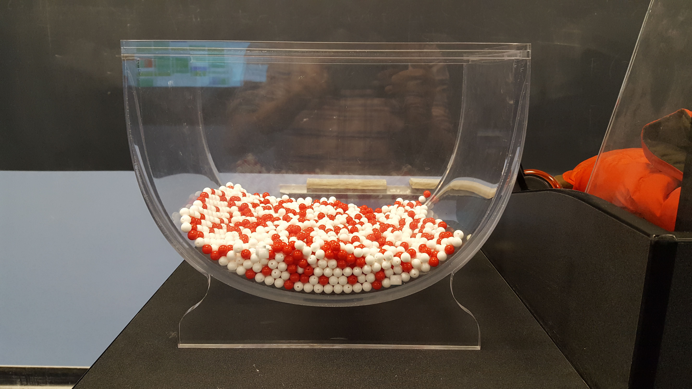
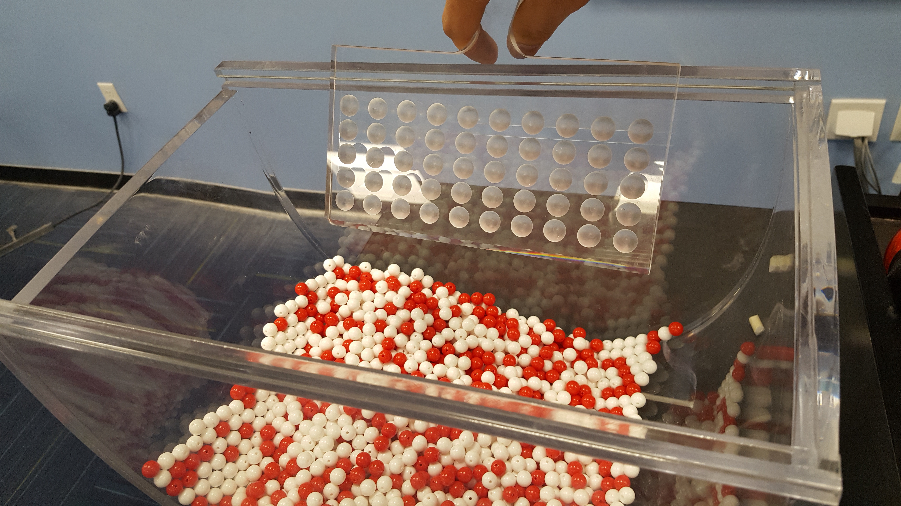
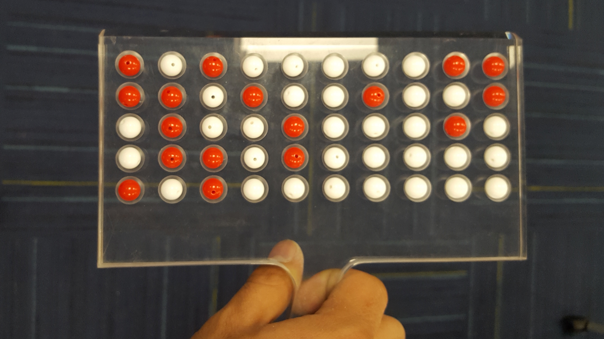
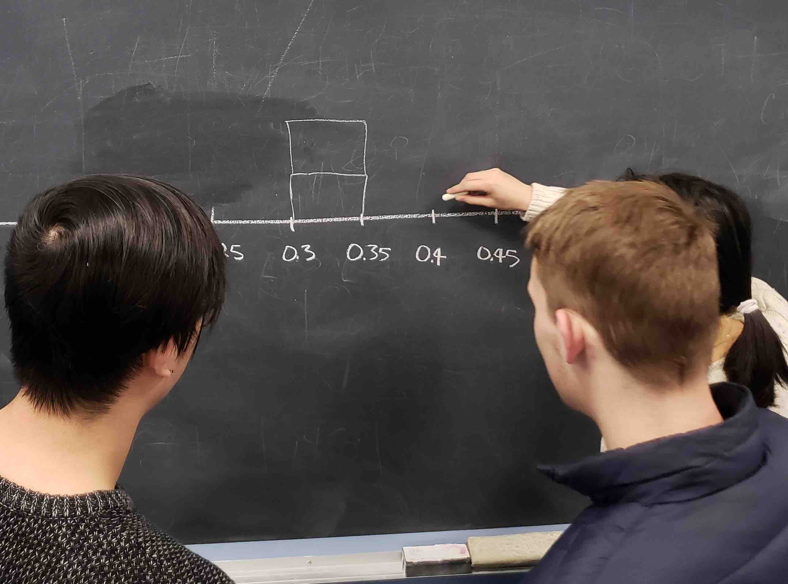
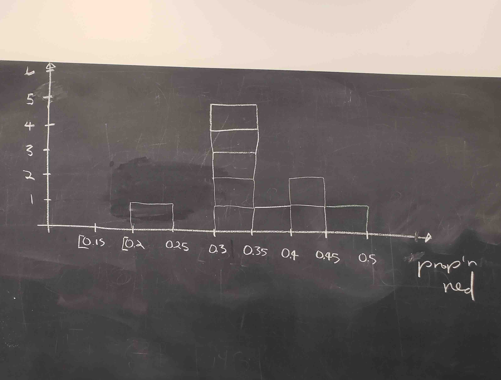
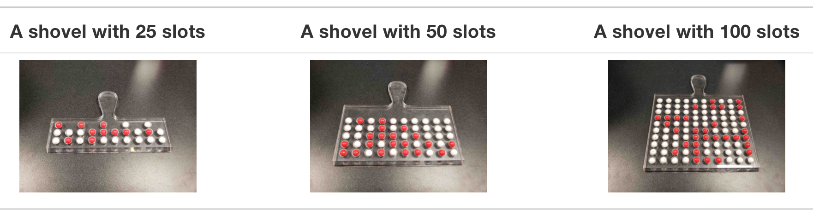
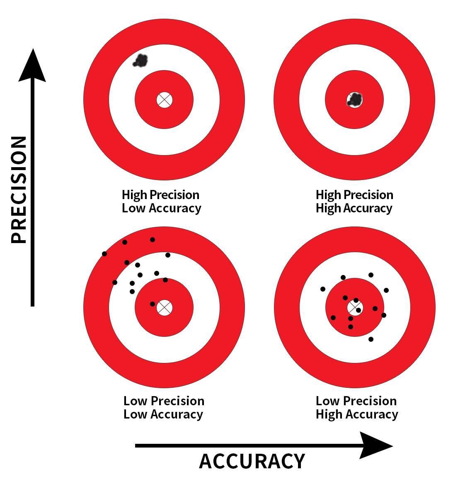
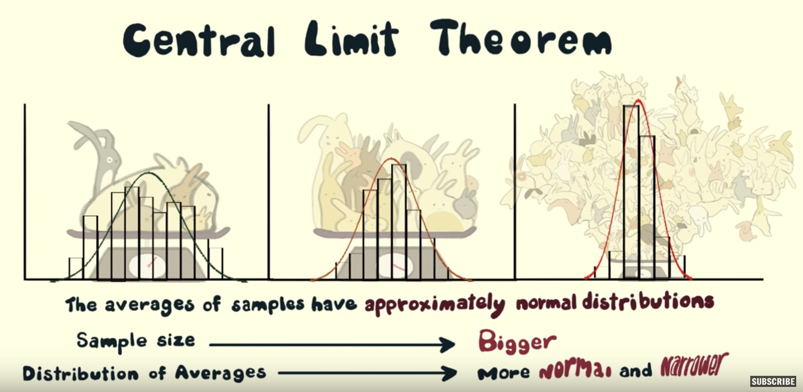

```{r, include=FALSE}
source("_common.R")
```


(ref:inferpart) `infer`를 활용한 통계적 추론

```{r echo=FALSE, results="asis", purl=FALSE}
if (knitr::is_latex_output()) {
  cat("# (PART (ref:inferpart) {-})")
} else {
  cat("# (PART infer를 활용한 통계적 추론 {-})")
}
```

# 표본 추출 {#sampling}

```{r setup_infer, include=FALSE, purl=FALSE}
# 학습 확인 번호 정의에 사용:
chap <- 7
lc <- 0

# R 코드 청크 기본 설정:
knitr::opts_chunk$set(
  echo = TRUE,
  eval = TRUE,
  warning = FALSE,
  message = TRUE,
  tidy = FALSE,
  purl = TRUE,
  out.width = "\\textwidth",
  fig.height = 4,
  fig.align = "center"
)

# 출력 자릿수 정밀도 설정
options(scipen = 99, digits = 3)

# 재현 가능한 의사 난수 생성을 위한 시드값 설정
set.seed(76)
```

이 장에서는 *표본 추출(sampling)*에 대해 배우며 통계적 추론에 관한 이 책의 세 번째 부분을 시작합니다. 표본 추출의 이면에 깔린 개념은 8장과 9장에서 다룰 신뢰 구간과 가설 검정의 기초를 형성합니다. 이 책의 데이터 과학 부분에서 배운 도구들, 특히 데이터 시각화와 데이터 전처리가 여러분의 이해를 돕는 데 중요한 역할을 하는 것을 보게 될 것입니다. 앞서 언급했듯이, 이 텍스트 전체의 개념들은 모두 쌓여 "데이터로 여러분의 이야기를 들려줄 수 있게" 해주는 절정에 이르게 됩니다.


### 필요한 패키지 {-#sampling-packages}

이 장에 필요한 모든 패키지를 불러오겠습니다(이미 설치되어 있다고 가정합니다). @sec-tidyverse-package절의 논의를 떠올려 보면, `library(tidyverse)`를 실행하여 `tidyverse` 패키지를 불러오면 다음과 같이 자주 사용되는 데이터 과학 패키지들이 한꺼번에 로드됩니다.

* 데이터 시각화를 위한 `ggplot2`
* 데이터 전처리를 위한 `dplyr`
* 데이터를 "깔끔한(tidy)" 형식으로 변환하기 위한 `tidyr`
* 스프레드시트 데이터를 R로 가져오기 위한 `readr`
* 그리고 더 고급 패키지인 `purrr`, `tibble`, `stringr`, `forcats` 패키지들

필요하다면 R 패키지를 설치하고 불러오는 방법에 대한 정보는 @sec-packages절을 읽어보세요.

```{r message=FALSE}
library(tidyverse)
library(moderndive)
```


```{r message=FALSE, echo=FALSE, purl=FALSE}
# 내부적으로 필요한 패키지들이지만 텍스트에는 나타나지 않습니다.
library(kableExtra)
library(patchwork)
library(scales)

# bowl에 대한 요약 통계량의 동적 코딩: 즉, 가능한 모든 하드코딩된 값을 피합니다.
num_balls <- nrow(bowl)
num_red <- bowl %>%
  summarize(red = sum(color == "red")) %>%
  pull(red)
prop_red <- num_red / num_balls
percent_red_chr <- prop_red %>% percent(accuracy = 0.1)
```

## 표본 추출 도구 활동 {#sampling-activity}

직접 해보는 활동부터 시작해 보겠습니다.


### 이 그릇에 들어 있는 빨간색 공의 비율은 얼마일까요?

그림 @fig-sampling-exercise-1의 그릇을 보세요. 여기에는 특정 개수의 빨간색 공과 하얀색 공이 들어 있으며, 모든 공의 크기는 동일합니다. `r if_else(knitr::is_latex_output(), '(이 책의 인쇄 버전에서 "빨간색"은 어두운 색의 공에 해당하고, "하얀색"은 밝은 색의 공에 해당한다는 점에 유의하세요. 이 책의 [표지](https://moderndive.com/images/logos/book_cover.png) 배경에 보이는 공의 실제 색상이 빨간색과 하얀색이므로 이 책 전체에서 이를 유지했습니다.)', '')` 또한 빨간색 공과 하얀색 공의 공간적 분포에 일관된 패턴이 보이지 않는 것으로 보아, 그릇의 내용물은 사전에 잘 섞인 것으로 보입니다.

이제 자문해 봅시다. 이 그릇에 있는 공 중 빨간색 공의 비율은 얼마일까요?

```{r sampling-exercise-1, echo=FALSE, fig.cap="빨간색과 하얀색 공이 들어 있는 그릇.", purl=FALSE, out.width = "95%", purl=FALSE}

```

이 질문에 답하는 한 가지 방법은 전수 조사를 수행하는 것입니다. 공을 하나씩 꺼내어 빨간색 공의 개수와 하얀색 공의 개수를 세고, 빨간색 공의 개수를 전체 공의 개수로 나누는 것이죠. 하지만 이 과정은 매우 길고 지루할 것입니다.


### 삽을 한 번 사용하기

전수 조사를 수행하는 대신, 그림 @fig-sampling-exercise-2와 같이 그릇에 삽을 넣어 봅시다. 삽을 사용하여 그림 @fig-sampling-exercise-3과 같이 $5 \cdot 10 = 50$개의 공을 꺼내 보겠습니다.

```{r sampling-exercise-2, echo=FALSE, fig.cap="그릇에 삽을 넣는 모습.", purl=FALSE, out.width = "100%", purl=FALSE}

```


```{r sampling-exercise-3, echo=FALSE, fig.cap="그릇에서 50개의 공을 꺼낸 모습.", purl=FALSE, out.width = "100%", purl=FALSE}

```

꺼낸 공 중 17개가 빨간색이므로, 삽에 담긴 공의 0.34 = 34%가 빨간색임을 확인하세요. 우리는 이 삽에 담긴 빨간색 공의 비율을 전체 그릇에 담긴 빨간색 공 비율에 대한 추측치로 볼 수 있습니다. 그릇의 모든 공을 전수 조사하는 것만큼 정확하지는 않겠지만, 34%라는 우리의 추측은 훨씬 적은 시간과 에너지를 들여 얻은 것입니다.

하지만 이 활동을 처음부터 다시 시작한다고 가정해 봅시다. 즉, 50개의 공을 그릇에 다시 넣고 다시 시작하는 것입니다. 이번에도 정확히 17개의 빨간색 공이 나올까요? 다시 말해, 그릇의 빨간색 공 비율에 대한 우리의 추측이 다시 정확히 34%가 될까요? 아마도요?

그림 @fig-sampling-exercise-3b에 표시된 과정을 따라 이 활동을 여러 번 반복한다면 어떨까요? 매번 정확히 17개의 빨간색 공을 얻게 될까요? 즉, 매번 그릇의 빨간색 공 비율에 대한 추측이 정확히 34%가 될까요? 분명히 그렇지 않을 것입니다. 반복에 따라 값이 어떻게 달라지는지 이해하기 위해 33개 조의 친구들의 도움을 받아 이 연습을 여러 번 반복해 보겠습니다.


### 삽을 33번 사용하기 {#student-shovels}

33개 조의 각 친구는 다음과 같이 활동할 것입니다.

- 삽을 사용하여 각자 50개의 공을 꺼냅니다.
- 빨간색 공의 개수를 세고 50개 중 빨간색 공의 비율을 계산합니다.
- 공을 그릇에 다시 넣습니다.
- 이전 조의 결과가 다음 조에 영향을 주지 않도록 그릇의 내용물을 약간 섞습니다.

```{r sampling-exercise-3b, echo=FALSE, fig.show='hold', fig.cap="표본 추출 활동을 33번 반복하는 모습.", purl=FALSE, out.width = "30%"}
# 새로운 그림이 필요함
knitr::include_graphics(c("images/sampling/balls/tactile_2_a.jpg", "images/sampling/balls/tactile_2_b.jpg", "images/sampling/balls/tactile_2_c.jpg"))
```

33개 조의 각 친구는 수집한 표본에서 얻은 빨간색 공의 비율을 기록합니다. 그런 다음 각 조는 그림 @fig-sampling-exercise-4와 같이 손으로 그린 히스토그램의 적절한 구간에 50개 중 빨간색 공의 비율을 표시합니다.

```{r sampling-exercise-4, echo=FALSE, fig.cap="비율 히스토그램 작성하기.", purl=FALSE, out.width = "80%"}

```

 @sec-histograms절에서 히스토그램을 통해 수치형 변수의 *분포(distribution)* \index{distribution}를 시각화할 수 있다는 점을 떠올려 보세요. 특히 값의 중심이 어디에 있는지, 값이 어떻게 변하는지 알 수 있습니다. 33개 조 중 처음 10개 조의 결과를 담은 부분적으로 완성된 히스토그램은 그림 @fig-sampling-exercise-5에서 볼 수 있습니다.

```{r sampling-exercise-5, echo=FALSE, fig.cap="33개 중 처음 10개의 비율을 손으로 그린 히스토그램.", purl=FALSE, out.width = "70%"}

```

그림 @fig-sampling-exercise-5의 히스토그램에서 다음을 확인하세요.

* 낮은 쪽에서는 한 조가 빨간색 비율이 0.20에서 0.25 사이인 50개의 공을 꺼냈습니다.
* 높은 쪽에서는 다른 한 조가 빨간색 비율이 0.45에서 0.5 사이인 50개의 공을 꺼냈습니다.
* 그러나 가장 자주 나타나는 비율은 분포의 정중앙인 0.30에서 0.35 사이였습니다.
* 이 분포의 모양은 어느 정도 종 모양(bell-shaped)입니다.

여러분이 2장에서 다듬은 데이터 시각화 기술을 사용하여 R에서 이와 동일한 히스토그램을 만들어 보겠습니다. 우리는 33개 조 친구들의 결과를 `moderndive` 패키지에 포함된 `tactile_prop_red` 데이터 프레임에 저장했습니다. 다음 명령을 실행하여 33개 행 중 처음 10개를 표시해 보세요.

```{r}
tactile_prop_red
```


각 `group`에 대해 조원들의 이름, 얻은 `red_balls`의 수, 그리고 이에 해당하는 50개 중 빨간색 공의 비율인 `prop_red`가 있음을 확인하세요. 또한 33개 조 각각을 나열하는 `replicate` 변수도 있습니다. 각 행을 복제된(`replicate`) 것으로 볼 수 있는데, 반복된 활동의 한 사례이기 때문입니다. 이 이름을 선택한 이유이기도 합니다. 여기서 활동이란 삽을 사용하여 50개의 공을 꺼내고 그 공 중 빨간색 공의 비율을 계산하는 것입니다.

그림 @fig-samplingdistribution-tactile에서 `binwidth = 0.05`를 사용한 `geom_histogram()`으로 이 33개 비율의 분포를 시각화해 보겠습니다. 이것은 그림 @fig-sampling-exercise-5에서 보았던 부분적으로 완성된 손으로 그린 히스토그램을 컴퓨터로 구현한 완성된 버전입니다. `boundary = 0.4`를 설정한 것은 구간(bin 중 하나의 경계가 0.4가 되도록 하는 구간 설정 방식을 원한다는 것을 의미합니다. 이를 통해 이 히스토그램을 그림 @fig-sampling-exercise-5의 손으로 그린 히스토그램과 더 가깝게 맞출 수 있습니다.

```{r eval=FALSE}
ggplot(tactile_prop_red, aes(x = prop_red)) +
  geom_histogram(binwidth = 0.05, boundary = 0.4, color = "white") +
  labs(x = "50개 공 중 빨간색 공의 비율", 
       title = "33개 빨간색 비율의 분포")
```
```{r samplingdistribution-tactile, echo=FALSE, fig.cap="크기가 50인 33개 표본에 기초한 33개 비율의 분포.", fig.height=3.1, purl=FALSE}
tactile_histogram <- ggplot(tactile_prop_red, aes(x = prop_red)) +
  geom_histogram(binwidth = 0.05, boundary = 0.4, color = "white")
tactile_histogram +
  labs(
    x = "50개 공 중 빨간색 공의 비율",
    title = "33개 빨간색 비율의 분포"
  )
```


### 방금 우리가 무엇을 했나요? {#sampling-what-did-we-just-do}

이 활동에서 방금 시연한 것은 *표본 추출(sampling)* \index{sampling}이라는 통계적 개념입니다. 우리는 그릇에 담긴 공 중 빨간색 공의 비율을 알고 싶었습니다. 그릇에 공의 개수가 많기 때문에 빨간색과 하얀색 공을 전수 조사하는 것은 시간이 많이 걸릴 것입니다. 그래서 우리는 *추정치(estimate)*를 만들기 위해 삽을 사용하여 50개의 공으로 구성된 *표본(sample)*을 추출했습니다. 이 50개 공의 표본을 사용하여, 우리는 *그릇*의 공 중 빨간색 공의 비율이 34%라고 추정했습니다.

또한 삽을 사용할 때마다 공을 섞었으므로 표본은 무작위로 추출되었습니다. 각 표본이 무작위로 추출되었기 때문에 표본들은 서로 달랐습니다. 표본들이 서로 달랐기 때문에 그림 @fig-samplingdistribution-tactile에서 관찰된 것과 같이 서로 다른 빨간색 비율을 얻게 되었습니다. 이것이 바로 *표본 오차(sampling variation)* \index{sampling!variation}라고 알려진 개념입니다.

이 표본 추출 활동의 목적은 표본 추출과 관련된 두 가지 핵심 개념에 대한 이해를 돕는 것이었습니다.

1. 표본 오차의 효과 이해하기.
2. 표본 크기가 표본 오차에 미치는 효과 이해하기.

 @sec-sampling-simulation절에서는 방금 컴퓨터상에서 수행한 직접 해보는 표본 추출 활동을 모방해 보겠습니다. 이를 통해 표본 추출 연습을 33번보다 훨씬 더 많이 반복할 수 있을 뿐만 아니라, 구멍의 개수가 50개가 아닌 다른 삽도 사용할 수 있게 될 것입니다.

그 후, @sec-sampling-framework절에서 표본 추출과 관련된 정의, 용어 및 기호를 제시하겠습니다. 많은 학문 분야에서 그렇듯이, 이러한 필수 배경 지식은 처음에는 접근하기 어렵고 심지어 혼란스럽게 느껴질 수 있습니다. 그러나 많은 어려운 주제와 마찬가지로, 근본적인 개념을 진정으로 이해하고 연습하고 또 연습한다면 마스터할 수 있을 것입니다.

이 장의 내용을 실제 세계와 연결하기 위해, 표본 추출의 가장 잘 알려진 사례 중 하나인 여론 조사를 소개하겠습니다. @sec-sampling-case-study절에서는 하버드 대학교 케네디 스쿨의 정치 연구소(Institute of Politics)에서 실시한, 당시 미국 대통령이었던 버락 오바마의 젊은 미국인들 사이에서의 인기에 관한 2013년 여론 조사라는 구체적인 사례 연구를 살펴보겠습니다. 이 장을 마무리하면서 "그릇에서 표본 추출하기" 연습을 다른 표본 추출 시나리오로 일반화하고 *중심 극한 정리(Central Limit Theorem)*라고 알려진 이론적 결과를 제시하겠습니다.

```{block, type="learncheck", purl=FALSE}
\vspace{-0.15in}
**_학습 확인_**
\vspace{-0.1in}
```

**`r paste0("(LC", chap, ".", (lc <- lc + 1), ")")`** 공을 추출하기 전에 그릇을 섞는 것이 왜 중요했을까요?

**`r paste0("(LC", chap, ".", (lc <- lc + 1), ")")`** 왜 33개 조의 친구들이 50개 중 빨간색 공의 개수가 모두 같지 않았고, 따라서 빨간색 비율이 서로 달랐을까요?

```{block, type="learncheck", purl=FALSE}
\vspace{-0.25in}
\vspace{-0.25in}
```


## 가상 표본 추출 {#sampling-simulation}

이전 @sec-sampling-activity절에서 우리는 손을 사용하여 *촉각적(tactile)* 표본 추출 활동을 수행했습니다. 즉, 물리적인 공 그릇과 물리적인 삽을 사용했습니다. 우리가 표본 추출의 근본적인 아이디어에 대한 확고한 이해를 발전시키기 위해 먼저 손으로 이 활동을 수행해 본 것입니다. 이 섹션에서는 컴퓨터를 사용하여 이 촉각적 표본 추출 활동을 모방한 *가상(virtual)* 표본 추출 활동을 수행할 것입니다. 다시 말해, 공 그릇의 가상 아날로그와 삽의 가상 아날로그를 사용할 것입니다.


### 가상 삽 한 번 사용하기

먼저 @sec-sampling-activity절에서 수행한 촉각적 표본 추출 연습의 가상 버전을 수행해 봅시다. 먼저 그림 @fig-sampling-exercise-1에서 본 그릇의 가상 아날로그가 필요합니다. 이를 위해 `moderndive` 패키지에 `bowl`이라는 데이터 프레임을 포함했습니다. `bowl`의 행은 실제 그릇의 내용물과 정확히 일치합니다.

```{r}
bowl
```

`bowl`에는 `r num_balls`개의 행이 있어, 이 그릇에 `r num_balls`개의 동일한 크기의 공이 들어 있음을 알려줍니다. 첫 번째 변수인 `ball_ID`는 @sec-identification-vs-measurement-variables절에서 논의한 것처럼 *식별 변수(identification variable)*로 사용됩니다. 실제 그릇의 공들에는 숫자가 적혀 있지 않습니다. 두 번째 변수인 `color`는 특정 가상 공이 빨간색인지 하얀색인지 나타냅니다. RStudio의 데이터 전용 창(data viewer)에서 `bowl`의 내용을 살펴보고, `bowl`이 정말로 그림 @fig-sampling-exercise-1의 실제 그릇의 가상 버전인지 확인해 보세요.

이제 그릇의 가상 버전이 준비되었으니, 다음으로는 가상 표본 50개를 생성하기 위해 그림 @fig-sampling-exercise-2에서 본 삽의 가상 버전이 필요합니다. `moderndive` 패키지에 포함된 `rep_sample_n()` 함수를 사용할 것입니다. 이 함수를 사용하면 크기가 `n`인 표본을 `rep`eated(반복 또는 `rep`licated(복제)하여 추출할 수 있습니다.

<!--
참고: 사람들이 처음에 rep_sample_n()을 이해하는 데 어려움을 겪는다면 이 내용을 다시 넣으세요.

이 함수가 작동하는 예를 보여드리겠습니다. 먼저 `tibble()` 함수를 사용하여 `fruit_basket`이라는 다섯 가지 과일 데이터 프레임을 수동으로 만들어 보겠습니다.

```{r}
fruit_basket <- tibble(
  fruit = c("Mango", "Tangerine", "Apricot", "Pamplemousse", "Lime")
)
```

-->


```{r}
virtual_shovel <- bowl %>% 
  rep_sample_n(size = 50)
virtual_shovel
```

`virtual_shovel`에는 크기 50의 가상 표본에 해당하는 50개의 행이 있습니다. `ball_ID` 변수는 `bowl`에 있는 `r num_balls`개의 공 중 어떤 공이 우리 표본에 포함되었는지 식별하며, `color`는 그 공의 색상을 나타냅니다. 그런데 `replicate` 변수는 무엇을 나타낼까요? `virtual_shovel`의 경우, 모든 50개 행에서 `replicate`가 1입니다. 이는 이 50개 행이 첫 번째 반복/복제된 삽 사용, 즉 우리의 첫 번째 표본임을 알려줍니다. 곧 보게 되겠지만, 우리가 "가상으로" 33개의 표본을 추출할 때 `replicate`는 1에서 33 사이의 값을 갖게 될 것입니다.

이제 3장에서 배운 `dplyr` 데이터 전처리 동사를 사용하여 가상 표본 속 공 중 빨간색 공의 비율을 계산해 봅시다. 먼저, @sec-mutate절에서 배운 `mutate()` 함수를 사용하여 50개의 표본 공 각각에 대해 `==`를 사용해 빨간색인지 확인하는 새로운 불리언(Boolean) 변수 `is_red`를 만들어 보겠습니다.

```{r}
virtual_shovel %>% 
  mutate(is_red = (color == "red"))
```

`color == "red"`인 모든 행에 대해서는 불리언(논리 값 `TRUE`가 반환되고, `color`가 `"red"`와 같지 않은 모든 행에 대해서는 불리언 `FALSE`가 반환되는 것을 확인하세요.

두 번째로, `summarize()` 함수를 사용하여 50개 중 빨간색 공의 개수를 계산해 봅시다. @sec-summarize절에서 보았듯이 `summarize()`는 행이 많은 데이터 프레임을 받아 `mean()`이나 `median()`과 같은 요약 통계량이 포함된 단일 행의 데이터 프레임을 반환합니다. 이 경우에는 `sum()`을 사용합니다.

```{r}
virtual_shovel %>% 
  mutate(is_red = (color == "red")) %>% 
  summarize(num_red = sum(is_red))
```
```{r, echo=FALSE, purl=FALSE}
n_red_virtual_shovel <- virtual_shovel %>%
  mutate(is_red = (color == "red")) %>%
  summarize(num_red = sum(is_red)) %>%
  pull(num_red)

```

이것이 왜 작동할까요? R은 `TRUE`를 숫자 `1`로, `FALSE`를 숫자 `0`으로 취급하기 때문입니다. 따라서 `TRUE`와 `FALSE`의 합을 구하는 것은 `1`과 `0`의 합을 구하는 것과 같습니다. 결국 이 연산은 `color`가 `red`인 공의 개수를 세게 됩니다. 우리의 경우 50개 공 중 `r n_red_virtual_shovel`개가 빨간색이었습니다. 하지만 가상 표본 추출의 무작위성 때문에 여러분은 다른 결과를 얻었을 수도 있습니다.

세 번째로 마지막 단계로, `num_red`를 50으로 나누어 추출된 50개 공 중 빨간색 공의 비율을 계산해 봅시다.

```{r}
virtual_shovel %>% 
  mutate(is_red = color == "red") %>% 
  summarize(num_red = sum(is_red)) %>% 
  mutate(prop_red = num_red / 50)
```
```{r, echo=FALSE, purl=FALSE}
virtual_shovel_prop_red <- virtual_shovel %>%
  mutate(is_red = color == "red") %>%
  summarize(num_red = sum(is_red)) %>%
  mutate(prop_red = num_red / 50) %>%
  pull(prop_red)
virtual_shovel_perc_red <- virtual_shovel_prop_red * 100

```

다시 말해, 이 가상 표본 중 `r virtual_shovel_perc_red`%가 빨간색 공이었습니다. 첫 번째 `mutate()`와 `summarize()`를 다음과 같이 결합하여 코드를 조금 더 간결하게 만들어 보겠습니다.

```{r}
virtual_shovel %>% 
  summarize(num_red = sum(color == "red")) %>% 
  mutate(prop_red = num_red / 50)
```

Great! `r virtual_shovel_perc_red`% of `virtual_shovel`'s 50 balls were red! So based on this particular sample of 50 balls, our guess at the proportion of the `bowl`'s balls that are red is `r virtual_shovel_perc_red`%. But remember from our earlier tactile sampling activity that if we repeat this sampling, we will not necessarily obtain the same value of `r virtual_shovel_perc_red`% again. There will likely be some variation. In fact, our 33 groups of friends computed 33 such proportions whose distribution we visualized in Figure @fig-sampling-exercise-5. We saw that these estimates *varied*. Let's now perform the virtual analog of having 33 groups of students use the sampling shovel!


### 가상 삽 33번 사용하기

 @sec-sampling-activity절의 촉각적 표본 추출 연습에서 33개 조의 학생들이 각각 삽을 사용하여 크기 50인 표본 33개를 얻었음을 떠올려 보세요. 그런 다음 이 33개 표본을 사용하여 33개의 비율을 계산했습니다. 즉, 삽 사용을 33번 반복/복제했습니다. 가상 삽 함수인 `rep_sample_n()`에 `reps = 33` 인수를 추가하여 이 반복/복제된 표본 추출을 가상으로 수행할 수 있습니다. 이는 R에게 표본 추출을 33번 반복하도록 명령하는 것입니다.

이 결과를 `virtual_samples`라는 데이터 프레임에 저장하겠습니다. 아래에서 `virtual_samples`의 처음 10개 행을 미리 보여드리지만, `View(virtual_samples)`를 실행하여 RStudio의 스프레드시트 뷰어에서 내용을 끝까지 훑어보는 것을 적극 추천합니다.

```{r}
virtual_samples <- bowl %>% 
  rep_sample_n(size = 50, reps = 33)
virtual_samples
```

스프레드시트 뷰어에서 처음 50개 행의 `replicate`는 1이고 다음 50개 행의 `replicate`는 2임을 확인하세요. 이는 처음 50개 행이 첫 번째 50개 공 표본에 해당하고, 그 다음 50개 행이 두 번째 50개 공 표본에 해당함을 알려줍니다. 이 패턴은 `reps = 33`번의 모든 복제에 대해 계속되므로, `virtual_samples`는 33 $\cdot$ 50 = 1,650개의 행을 가집니다.

이제 `virtual_samples`를 가져와서 33개의 빨간색 비율을 계산해 봅시다. 이전과 동일한 `dplyr` 동사를 사용하되, 이번에는 `replicate` 변수를 기준으로 `group_by()`를 추가합니다. @sec-groupby절에서 보았듯이, `summarize()`를 하기 전에 그룹화 변수 "메타 데이터"를 지정함으로써 33개의 서로 다른 빨간색 비율을 얻을 수 있습니다. 33개 행 중 처음 10개를 미리 보여드립니다.

```{r}
virtual_prop_red <- virtual_samples %>% 
  group_by(replicate) %>% 
  summarize(red = sum(color == "red")) %>% 
  mutate(prop_red = red / 50)
virtual_prop_red
```

우리 친구들의 33개 촉각적 표본과 마찬가지로, 결과로 나온 33개의 가상 빨간색 비율에도 변동이 있습니다. 이 변동을 그림 @fig-samplingdistribution-virtual의 히스토그램으로 시각화해 보겠습니다. `binwidth = 0.05`와 `boundary = 0.4` 인수를 추가합니다. `boundary = 0.4`를 설정하면 구간 경계 중 하나가 0.4에 오도록 구간 설정 방식이 정해집니다. `binwidth = 0.05`도 설정했으므로, 0.30, 0.35, 0.45, 0.5 등의 경계를 가진 구간들이 생성될 것입니다.

```{r eval=FALSE}
ggplot(virtual_prop_red, aes(x = prop_red)) +
  geom_histogram(binwidth = 0.05, boundary = 0.4, color = "white") +
  labs(x = "50개 공 중 빨간색 공의 비율", 
       title = "33개 빨간색 비율의 분포")
```
```{r samplingdistribution-virtual, echo=FALSE, fig.cap="크기가 50인 33개 표본에 기초한 33개 비율의 분포.", fig.height=3.2, purl=FALSE}
virtual_histogram <- ggplot(virtual_prop_red, aes(x = prop_red)) +
  geom_histogram(binwidth = 0.05, boundary = 0.4, color = "white")
virtual_histogram +
  labs(
    x = "50개 공 중 빨간색 공의 비율",
    title = "33개 빨간색 비율의 분포"
  )
``` 

가끔 빨간색 비율이 30%보다 작게 나오는 경우도 있고, 반대로 45%보다 크게 나오는 경우도 있음을 확인하세요. 하지만 가장 빈번하게 나타나는 비율은 35%에서 40% 사이였습니다(33개 표본 중 11개). 왜 빨간색 비율에 이러한 차이가 나타날까요? 바로 *표본 오차* 때문입니다.

이제 그림 @fig-tactile-vs-virtual에서 가상 결과와 이전 섹션의 촉각적 결과를 비교해 보겠습니다. 두 히스토그램이 중심과 변동 면에서 비슷하지만 똑같지는 않음을 확인하세요. 이러한 미세한 차이 역시 무작위 표본 오차 때문입니다. 또한 두 분포 모두 어느 정도 종 모양을 띠고 있음을 확인하세요.

```{r tactile-vs-virtual, echo=FALSE, fig.cap="33개의 가상 및 33개의 촉각적 빨간색 비율 비교.", fig.height=2.9, purl=FALSE}
facet_compare <- bind_rows(
  virtual_prop_red %>%
    mutate(type = "가상 표본 추출"),
  tactile_prop_red %>%
    select(replicate, red = red_balls, prop_red) %>%
    mutate(type = "촉각적 표본 추출")
) %>%
  mutate(type = factor(type, levels = c("가상 표본 추출", "촉각적 표본 추출"))) %>%
  ggplot(aes(x = prop_red)) +
  geom_histogram(binwidth = 0.05, boundary = 0.4, color = "white") +
  facet_wrap(~type) +
  labs(
    x = "50개 공 중 빨간색 공의 비율",
    title = "분포 비교"
  )

if (knitr::is_latex_output()) {
  facet_compare +
    theme(
      strip.text = element_text(colour = "black"),
      strip.background = element_rect(fill = "grey93")
    )
} else {
  facet_compare
}
```

```{block, type="learncheck", purl=FALSE}
\vspace{-0.15in}
**_학습 확인_**
\vspace{-0.1in}
```

**`r paste0("(LC", chap, ".", (lc <- lc + 1), ")")`** 가상 삽을 단 한 번만 사용했을 때는 왜 표본 오차의 효과를 연구할 수 없었을까요? 왜 하나 이상의 가상 표본(우리의 경우 33개의 가상 표본)을 추출해야 했을까요?

```{block, type="learncheck", purl=FALSE}
\vspace{-0.25in}
\vspace{-0.25in}
```


### 가상 삽 1,000번 사용하기 {#shovel-1000-times}

이제 33개의 표본이 아니라 더 많은 표본, 예를 들어 1,000개에 대해 표본 오차의 효과를 연구하고 싶다고 가정해 봅시다. 이 시점에서 우리에게는 두 가지 선택지가 있습니다. 우리 친구들이 50개 공이 담긴 표본 1,000개를 수동으로 추출하고 이에 대응하는 1,000개의 비율을 계산하게 할 수 있습니다. 하지만 이는 지루하고 시간이 많이 걸리는 작업일 것입니다. 이것이 바로 컴퓨터가 강점을 발휘하는 분야입니다. 길고 반복적인 작업을 아주 빠르게 자동화하는 것이죠. 따라서 이 시점부터 우리는 촉각적 표본 추출을 그만두고 가상 표본 추출만 사용하겠습니다. 표본 크(`size`)를 다시 한번 50으로 설정하되, 이번에는 반복 횟수(`reps`)를 1,000으로 설정하여 `rep_sample_n()` 함수를 사용해 봅시다. RStudio 뷰어에서 `virtual_samples`의 내용을 꼭 확인해 보세요.

```{r}
virtual_samples <- bowl %>% 
  rep_sample_n(size = 50, reps = 1000)
virtual_samples
```

이제 `virtual_samples`는 이전의 33 $\cdot$ 50 = 1,650개 행 대신 1,000 $\cdot$ 50 = 50,000개의 행을 가집니다. 이전과 동일한 데이터 전처리 코드를 사용하여, 1,000 $\cdot$ 50 = 50,000개 행의 `virtual_samples` 데이터 프레임에서 1,000개의 빨간색 공 비율을 계산해 봅시다.

```{r}
virtual_prop_red <- virtual_samples %>% 
  group_by(replicate) %>% 
  summarize(red = sum(color == "red")) %>% 
  mutate(prop_red = red / 50)
virtual_prop_red
```

이제 50개 공 중 빨간색 공의 비율인 `prop_red`가 1,000개 복제된 것을 확인할 수 있습니다. 이전과 동일한 코드를 사용하여 그림 @fig-samplingdistribution-virtual-1000에서 이 1,000개 `prop_red` 복제본의 분포를 히스토그램으로 시각화해 보겠습니다.

```{r eval=FALSE}
ggplot(virtual_prop_red, aes(x = prop_red)) +
  geom_histogram(binwidth = 0.05, boundary = 0.4, color = "white") +
  labs(x = "50개 공 중 빨간색 공의 비율", 
       title = "1,000개 빨간색 비율의 분포")
```
```{r samplingdistribution-virtual-1000, echo=FALSE, fig.cap="크기가 50인 1,000개 표본에 기초한 1,000개 비율의 분포.", purl=FALSE}
virtual_prop_red <- virtual_samples %>%
  group_by(replicate) %>%
  summarize(red = sum(color == "red")) %>%
  mutate(prop_red = red / 50)
virtual_histogram <- ggplot(virtual_prop_red, aes(x = prop_red)) +
  geom_histogram(binwidth = 0.05, boundary = 0.4, color = "white")
virtual_histogram +
  labs(
    x = "50개 공 중 빨간색 공의 비율",
    title = "1,000개 빨간색 비율의 분포"
  )
``` 

다시 한번, 빨간색 공 비율이 가장 자주 나타나는 구간은 35%에서 40% 사이입니다. 가끔 20%에서 25% 사이만큼 낮은 비율을 얻기도 하고, 55%에서 60% 사이만큼 높은 비율을 얻기도 합니다. 하지만 이런 경우는 드뭅니다. 또한 이제 훨씬 더 대칭적이고 부드러운 종 모양의 분포를 가지게 되었음을 확인하세요. 사실 이 분포는 정규 분포(normal distribution)로 잘 근사화됩니다. 이 시점에서 정규 분포의 속성에 대한 간략한 논의를 담은 "정규 분포" 섹션(부록 @sec-appendix-normal-curve)을 읽어보실 것을 권장합니다.


```{block, type="learncheck", purl=FALSE}
\vspace{-0.15in}
**_학습 확인_**
\vspace{-0.1in}
```

**`r paste0("(LC", chap, ".", (lc <- lc + 1), ")")`** 왜 우리는 50개 공이 담긴 "촉각적" 표본 1,000개를 수동으로 추출하지 않았을까요?

**`r paste0("(LC", chap, ".", (lc <- lc + 1), ")")`** 그림 @fig-samplingdistribution-virtual-1000을 보았을 때, 50개의 공을 추출했을 때 그중 30%가 빨간색일 가능성이 높다고 보시나요, 아니면 낮다고 보시나요? 10%가 빨간색일 경우는 어떤가요?

```{block, type="learncheck", purl=FALSE}
\vspace{-0.25in}
\vspace{-0.25in}
```


### 서로 다른 삽 사용하기 {#different-shovels}

이제 삽이 하나가 아니라 25개, 50개, 100개의 공을 추출할 수 있는 세 가지 삽 중에서 선택할 수 있다고 가정해 봅시다.

```{r three-shovels, echo=FALSE, fig.cap="세 가지 서로 다른 표본 크기를 추출하기 위한 세 개의 삽.", out.width='100%', purl=FALSE}

```

여전히 여러분의 목표가 그릇의 공 중 빨간색 공의 비율을 추정하는 것이라면, 어떤 삽을 선택하시겠습니까? 우리의 경험상, 대부분의 사람은 100개의 구멍이 있는 가장 큰 삽을 선택할 것입니다. 왜냐하면 그것이 그릇의 빨간색 공 비율에 대해 "가장 좋은" 추측을 제공할 것이라고 생각하기 때문입니다. 이번 소섹션에서 "가장 좋은" 것에 대한 몇 가지 기준을 정의해 봅시다.

새롭게 개발된 가상 표본 추출 도구를 사용하여 표본 크기가 다른 것의 효과를 파헤쳐 봅시다! 다시 말해, 반복 횟수는 1,000으로 유지하면서 `rep_sample_n()`의 `size`를 각각 25, 50, 100으로 설정해 보는 것입니다.

1. 적절한 삽을 가상으로 사용하여 `size`만큼의 공을 가진 표본 1,000개를 생성합니다.
2. 각 삽에 담긴 빨간색 공 비율을 계산하여 1,000개의 복제본을 얻습니다.
3. 히스토그램을 사용하여 이 1,000개 빨간색 비율의 분포를 시각화합니다.

다음 코드 세그먼트를 각각 실행한 다음 결과로 나온 세 개의 히스토그램을 비교해 보세요.

```{r, eval=FALSE}
# 세그먼트 1: 표본 크기 = 25 ------------------------------
# 1.a 가상 삽 1,000번 사용
virtual_samples_25 <- bowl %>% 
  rep_sample_n(size = 25, reps = 1000)

# 1.b 결과로 나온 1,000개 빨간색 비율 복제본 계산
virtual_prop_red_25 <- virtual_samples_25 %>% 
  group_by(replicate) %>% 
  summarize(red = sum(color == "red")) %>% 
  mutate(prop_red = red / 25)

# 1.c 히스토그램으로 분포 그리기
ggplot(virtual_prop_red_25, aes(x = prop_red)) +
  geom_histogram(binwidth = 0.05, boundary = 0.4, color = "white") +
  labs(x = "25개 공 중 빨간색 공의 비율", title = "25")


# 세그먼트 2: 표본 크기 = 50 ------------------------------
# 2.a 가상 삽 1,000번 사용
virtual_samples_50 <- bowl %>% 
  rep_sample_n(size = 50, reps = 1000)

# 2.b 결과로 나온 1,000개 빨간색 비율 복제본 계산
virtual_prop_red_50 <- virtual_samples_50 %>% 
  group_by(replicate) %>% 
  summarize(red = sum(color == "red")) %>% 
  mutate(prop_red = red / 50)

# 2.c 히스토그램으로 분포 그리기
ggplot(virtual_prop_red_50, aes(x = prop_red)) +
  geom_histogram(binwidth = 0.05, boundary = 0.4, color = "white") +
  labs(x = "50개 공 중 빨간색 공의 비율", title = "50")


# 세그먼트 3: 표본 크기 = 100 ------------------------------
# 3.a 가상 삽 1,000번 사용
virtual_samples_100 <- bowl %>% 
  rep_sample_n(size = 100, reps = 1000)

# 3.b 결과로 나온 1,000개 빨간색 비율 복제본 계산
virtual_prop_red_100 <- virtual_samples_100 %>% 
  group_by(replicate) %>% 
  summarize(red = sum(color == "red")) %>% 
  mutate(prop_red = red / 100)

# 3.c 히스토그램으로 분포 그리기
ggplot(virtual_prop_red_100, aes(x = prop_red)) +
  geom_histogram(binwidth = 0.05, boundary = 0.4, color = "white") +
  labs(x = "100개 공 중 빨간색 공의 비율", title = "100")
```

쉬운 비교를 위해, 그림 @fig-comparing-sampling-distributions에서 x축과 y축을 일치시킨 세 개의 히스토그램을 한 행에 제시합니다.

```{r comparing-sampling-distributions, echo=FALSE, fig.height=3, fig.cap="서로 다른 표본 크기에 따른 빨간색 비율 분포 비교.", purl=FALSE}
# n = 25
if (!file.exists("rds/virtual_samples_25.rds")) {
  virtual_samples_25 <- bowl %>%
    rep_sample_n(size = 25, reps = 1000)
  write_rds(virtual_samples_25, "rds/virtual_samples_25.rds")
} else {
  virtual_samples_25 <- read_rds("rds/virtual_samples_25.rds")
}
virtual_prop_red_25 <- virtual_samples_25 %>%
  group_by(replicate) %>%
  summarize(red = sum(color == "red")) %>%
  mutate(prop_red = red / 25) %>%
  mutate(n = 25)

# n = 50
if (!file.exists("rds/virtual_samples_50.rds")) {
  virtual_samples_50 <- bowl %>%
    rep_sample_n(size = 50, reps = 1000)
  write_rds(virtual_samples_50, "rds/virtual_samples_50.rds")
} else {
  virtual_samples_50 <- read_rds("rds/virtual_samples_50.rds")
}
virtual_prop_red_50 <- virtual_samples_50 %>%
  group_by(replicate) %>%
  summarize(red = sum(color == "red")) %>%
  mutate(prop_red = red / 50) %>%
  mutate(n = 50)

# n = 100
if (!file.exists("rds/virtual_samples_100.rds")) {
  virtual_samples_100 <- bowl %>%
    rep_sample_n(size = 100, reps = 1000)
  write_rds(virtual_samples_100, "rds/virtual_samples_100.rds")
} else {
  virtual_samples_100 <- read_rds("rds/virtual_samples_100.rds")
}
virtual_prop_red_100 <- virtual_samples_100 %>%
  group_by(replicate) %>%
  summarize(red = sum(color == "red")) %>%
  mutate(prop_red = red / 100) %>%
  mutate(n = 100)

virtual_prop <- bind_rows(
  virtual_prop_red_25,
  virtual_prop_red_50,
  virtual_prop_red_100
)

comparing_sampling_distributions <- ggplot(virtual_prop, aes(x = prop_red)) +
  geom_histogram(binwidth = 0.05, boundary = 0.4, color = "white") +
  labs(
    x = "삽에 담긴 공 중 빨간색 공의 비율",
    title = "세 가지 서로 다른 삽 크기에 따른 빨간색 비율 분포 비교"
  ) +
  facet_wrap(~n)

if (knitr::is_latex_output()) {
  comparing_sampling_distributions +
    theme(
      strip.text = element_text(colour = "black"),
      strip.background = element_rect(fill = "grey93")
    )
} else {
  comparing_sampling_distributions
}
```

표본 크기가 커질수록 1,000개 빨간색 비율 복제본의 변동이 줄어드는 것을 확인하세요. 다시 말해, 표본 크기가 커질수록 표본 오차로 인한 차이가 적어지고 분포가 동일한 값 주위에 더 조밀하게 모입니다. 그림 @fig-comparing-sampling-distributions를 눈대중으로 보면, 세 히스토그램 모두 대략 40% 주변에 중심이 있는 것처럼 보입니다.

우리는 *표준 편차(standard deviation)* \index{standard deviation}를 사용하여 세 가지 1,000개의 `prop_red` 값 세트의 변동량을 수치적으로 명확하게 나타낼 수 있습니다. 표준 편차는 수치형 변수 내의 변동량을 측정하는 요약 통계량입니다(표준 편차의 속성에 대한 간략한 논의는 부록 @sec-appendix-stat-terms를 참조하세요). 세 가지 표본 크기 모두에 대해, `sd()` 요약 함수를 사용하는 다음 데이터 전처리 코드를 실행하여 1,000개 빨간색 비율의 표준 편차를 계산해 봅시다.

```{r, eval=FALSE}
# n = 25
virtual_prop_red_25 %>% 
  summarize(sd = sd(prop_red))

# n = 50
virtual_prop_red_50 %>% 
  summarize(sd = sd(prop_red))

# n = 100
virtual_prop_red_100 %>% 
  summarize(sd = sd(prop_red))
```

이 세 가지 분포 변동 측정치를 표 @tbl-comparing-n에서 비교해 봅시다.

```{r comparing-n, echo=FALSE, purl=FALSE}
comparing_n_table <- virtual_prop %>%
  group_by(n) %>%
  summarize(sd = sd(prop_red)) %>%
  rename(`삽의 구멍 개수` = n, `빨간색 비율의 표준 편차` = sd)

comparing_n_table %>%
  kbl(
    digits = 3,
    caption = "세 가지 서로 다른 삽에 대한 빨간색 비율의 표준 편차 비교",
    booktabs = TRUE,
    linesep = ""
  ) %>%
  kable_styling(
    font_size = ifelse(knitr::is_latex_output(), 10, 16),
    latex_options = c("hold_position")
  )
```

그림 @fig-comparing-sampling-distributions에서 관찰한 바와 같이, 표본 크기가 커질수록 변동은 줄어듭니다. 즉, 1,000개의 빨간색 비율 값들의 변동이 적어집니다. 따라서 표본 크기가 커질수록 그릇의 실제 빨간색 비율에 대한 우리의 추측이 더 정밀해집니다.

```{block, type="learncheck", purl=FALSE}
\vspace{-0.15in}
**_학습 확인_**
\vspace{-0.1in}
```

**`r paste0("(LC", chap, ".", (lc <- lc + 1), ")")`** 그림 @fig-comparing-sampling-distributions에서 우리는 각각 1,000개의 표본을 추출하기 위해 삽을 사용했고, 결과로 나온 1,000개의 빨간색 비율을 계산했으며, 히스토그램으로 이 분포를 시각화했습니다. 구멍이 25개, 50개, 100개인 삽에 대해 이 작업을 수행했습니다. 삽의 크기가 커질수록 히스토그램은 더 좁아졌습니다. 다시 말해, 삽의 크기가 25에서 50, 100으로 커짐에 따라 1,000개의 비율은

- A. 덜 변했나요?
- B. 동일한 양만큼 변했나요?
- C. 더 많이 변했나요?

**`r paste0("(LC", chap, ".", (lc <- lc + 1), ")")`** 1,000개의 빨간색 비율이 얼마나 변했는지 수량화하기 위해 어떤 요약 통계량을 사용했나요?

- A. 사분위수 범위 (Interquartile range)
- B. 표준 편차 (Standard deviation)
- C. 범위 (Range): 최댓값에서 최솟값을 뺀 값

```{block, type="learncheck", purl=FALSE}
\vspace{-0.25in}
```


## 표본 추출 프레임워크 {#sampling-framework}

촉각적 및 가상 표본 추출 활동 모두에서 우리는 추정을 목적으로 표본 추출을 사용했습니다. 그릇의 공 중 빨간색 공의 비율을 *추정*하기 위해 표본을 추출했습니다. 우리는 모든 공을 전수 조사하는 것보다 시간이 덜 걸리는 방법으로 표본 추출을 사용했습니다. 우리의 가상 표본 추출 활동은 그림 @fig-comparing-sampling-distributions와 표 @tbl-comparing-n에 나타난 결과로 이어졌습니다. 즉, 크기가 25, 50, 100인 표본에 기초한 1,000개의 빨간색 비율을 비교한 것입니다. 이는 추정을 위한 표본 추출과 관련된 두 가지 핵심 개념을 이해하려는 우리의 첫 번째 시도였습니다.

1. 추정치에 대한 *표본 오차*의 효과.
2. *표본 오차*에 대한 표본 크기의 효과.

이제 표본 추출에 대한 어느 정도 직관이 생겼으므로, 지금까지 탐구한 다양한 개념에 단어와 라벨을 붙여 봅시다. 구체적으로 다음 섹션에서는 표본 추출과 관련된 용어와 표기법 및 통계적 정의를 소개하겠습니다. 이를 통해 이 책의 나머지 부분에서 표본 추출의 이면에 깔린 아이디어를 간결하게 요약하고 언급할 수 있게 될 것입니다.


### 용어와 표기법 {#terminology-and-notation}

이제 몇 가지 용어와 수학적 표기법을 도입하여 지금까지 살펴본 다양한 표본 추출 개념에 단어와 라벨을 붙여 봅시다. 처음에는 벅차게 느껴질 수 있겠지만, 각 용어를 앞서 수행한 그릇 표본 추출 활동과 연결 지어 설명하겠습니다. 또한 마스터하는 가장 좋은 방법은 반복이므로, 이 책 전반에 걸쳐 충분히 연습할 기회를 제공할 것입니다.

첫 번째 용어 및 표기법 세트는 **모집단(populations)**과 관련이 있습니다.

1. **모집단(population)**은 우리가 관심을 갖는 개인 또는 관측치의 집합입니다. 이는 흔히 **연구 대상 모집단(study population)**이라고도 합니다. 수학적으로 모집단의 크기는 대문자 $N$으로 나타냅니다.
2. **모수(population parameter)**는 모집단에 관한 수치적 요약으로, 현재 알지 못하지만 알고자 하는 값입니다. 예를 들어, 이 양이 모든 캐나다인의 평균 키와 같은 평균일 때, 관심 있는 모수는 *모평균(population mean)*입니다.
3. **전수 조사(census)**는 모집단에 속한 $N$개의 모든 개체를 빠짐없이 조사하거나 세는 것입니다. 모수 값을 *정확하게* 계산하기 위해 이 작업을 수행합니다. 모집단의 개체 수 $N$이 증가함에 따라 전수 조사를 수행하는 데 드는 비용(시간, 에너지, 돈)이 늘어난다는 점에 유의해야 합니다.

따라서 우리의 표본 추출 활동에서 **모집단**은 그림 @fig-sampling-exercise-1에 보이는 그릇에 담긴 $N$ = `r num_balls`개의 동일한 크기의 빨간색 및 하얀색 공의 집합입니다. 우리는 또한 가상 그릇인 데이터 프레임 `bowl`로 모집단을 표현했음을 떠올려 보세요.

```{r}
bowl
```

여기서 **모수**는 그릇의 공 중 빨간색 공의 비율입니다. 모집단의 어떤 값의 비율에 관심이 있을 때, 그 모수를 부르는 구체적인 이름이 있는데 바로 *모비율(population proportion)*입니다. 모비율은 글자 $p$로 나타냅니다. 나중에 표 @tbl-table-ch8에서 보겠지만 모평균이나 모집단 회귀 기울기와 같은 다른 유형의 모수도 고려할 수 있습니다.

이 모비율 $p$를 정확하게 계산하려면, 먼저 $N$ = `r num_balls`개의 모든 공을 하나씩 살펴보고 빨간색 공의 수를 세는 **전수 조사**를 수행해야 합니다. 그런 다음 이 개수를 `r num_balls`로 나누어 빨간색 비율을 얻습니다.

여러분은 아마 지금쯤 "잠깐만요. 실제 그릇을 전수 조사하는 데 시간이 오래 걸린다는 것은 이해하지만, 가상 그릇을 사용하여 '가상' 전수 조사를 할 수는 없나요?"라고 묻고 싶을 것입니다. 여러분이 백번 옳습니다! 사실 이 책의 저자들이 `bowl` 데이터 프레임을 만들었을 때, 전수 조사를 해서가 아니라 그릇이 들어 있던 상자에 적힌 내용을 보고 실제 그릇의 내용물과 일치하게 만들었습니다!

앞서 빨간색 공의 수를 세기 위해 사용했던 것과 동일한 `dplyr` 동사를 사용하여 이 "가상" 전수 조사를 수행해 봅시다.

```{r}
bowl %>% 
  summarize(red = sum(color == "red")) 
```

`r num_balls`개 중 `r num_red`개가 빨간색이므로, 비율은 `r num_red`/`r num_balls` = `r prop_red` = `r percent_red_chr`입니다. 따라서 우리는 모수 값을 알고 있습니다. 우리의 경우 모비율 $p$는 `r prop_red`와 같습니다.

이 시점에서 여러분은 또 이런 질문을 할 수도 있습니다. "빨간색 공의 비율이 `r percent_red_chr`라는 것을 이미 알고 있다면, 왜 표본 추출을 한 건가요?" 좋은 질문입니다! 보통은 표본 추출을 하지 않겠죠! 하지만 이번 장에서 수행한 표본 추출 활동은 현실 세계에서 표본 추출이 어떻게 이루어지는지를 보여주는 시뮬레이션일 뿐입니다! 우리는 다음을 공부하기 위해 이 시뮬레이션을 수행합니다.

1. 추정치에 대한 *표본 오차*의 효과.
2. *표본 오차*에 대한 표본 크기의 효과.

여론 조사에 관한 @sec-sampling-case-study절에서 보겠지만, 실제 표본 추출에서는 모집단 크기 $N$이 매우 커서 전수 조사 비용이 많이 들 뿐만 아니라 가끔은 모집단의 크기가 얼마나 큰지조차 모르는 경우도 있습니다! 이제 다음 용어 및 표기법 세트로 넘어가 봅시다.

두 번째 용어 및 표기법 세트는 **표본(samples)**과 관련이 있습니다.

1. **표본 추출(sampling)**은 모집단에서 표본을 수집하는 행위로, 일반적으로 전수 조사를 수행할 수 없을 때 수행합니다. 모집단의 크기를 나타내는 대문자 $N$과 달리 표본의 크기는 소문자 $n$으로 나타냅니다. 일반적으로 표본 크기 $n$은 모집단 크자 $N$보다 훨씬 작습니다. 따라서 표본 추출은 전수 조사를 수행하는 것보다 훨씬 저렴한 대안입니다.
2. **점 추정치(point estimate)**는 **표본 통계량(sample statistic)**이라고도 하며, 알지 못하는 모수를 *추정*하기 위해 표본으로부터 계산된 요약 통계량입니다.

이전에 우리는 $n$ = 50 크기의 표본을 추출하기 위해 구멍이 50개인 삽을 사용하여 **표본 추출**을 수행했습니다. 이 표본 추출의 가상 버전을 수행하기 위해 `rep_sample_n()` 함수를 다음과 같이 사용했음을 떠올려 보세요.

```{r, eval = FALSE}
virtual_shovel <- bowl %>% 
  rep_sample_n(size = 50)
virtual_shovel
```
```{r, echo = FALSE}
virtual_shovel
```

`virtual_shovel`에 담긴 50개 공의 표본을 사용하여, 그릇의 빨간색 공 비율에 대한 추정치인 `prop_red`를 생성했습니다.

```{r}
virtual_shovel %>% 
  summarize(num_red = sum(color == "red")) %>% 
  mutate(prop_red = num_red / 50)
```

따라서 우리의 경우 `prop_red` 값은 모비율 $p$를 추정하므로 모비율의 **점 추정치**가 됩니다. 또한 이 점 추정치는 비율을 고려할 때 구체적인 이름이 있는데, 바로 *표본 비율(sample proportion)*입니다. 통계학에서 점 추정치를 나타낼 때 "모자(hat)" 기호를 사용하는 것이 일반적인 관습이므로 $\widehat{p}$로 나타냅니다.

세 번째 세트는 **표본 추출 방법론(sampling methodology)**과 관련이 있습니다. 즉, 표본을 수집하는 데 사용되는 방법입니다.\index{sampling methodology} 여기서 그리고 이 책의 나머지 부분에서 여러분은 표본을 수집하는 *방식*이 표본의 품질에 직접적인 영향을 미친다는 것을 알게 될 것입니다.

1. 표본이 모집단과 대략 "비슷해 보인다면" 그 표본은 **대표성(representative)**이 있다고 말합니다. 다시 말해, 표본의 특성이 모집단의 특성을 "좋게" 나타내는 경우입니다.
2. 표본에 근거한 어떤 결과가 모집단으로 일반화될 수 있다면 그 표본을 **일반화 가능(generalizable)**하다고 말합니다. 즉, 표본을 사용하여 모집단에 대해 "좋은" 추측을 할 수 있는 경우입니다.
3. 모집단의 일부 개체가 다른 개체보다 표본에 포함될 가능성이 더 높다면 그 표본 추출 과정은 **편향(biased)**되었다고 말합니다. 모집단의 모든 개체가 추출될 기회가 같다면 그 표본 추출 과정은 **편향되지 않았다(unbiased)**고 말합니다.

우리 삽을 사용하여 추출한 $n$개의 공 표본의 내용이 "그릇의 내용물과 대략 비슷하다면" 그 표본은 모집단을 **대표한다**고 말합니다. 그렇다면 삽에 담긴 공 중 빨간색 공의 비율은 그릇의 $N$ = `r num_balls`개 공 중 빨간색 공의 비율로 **일반화**될 수 있습니다. 또는 다르게 표현하면 $\widehat{p}$는 $p$의 "좋은 추측치"입니다. 만약 우리가 삽을 사용할 때 속임수를 써서 하얀색 공 대신 빨간색 공을 더 많이 넣었다면, 이 표본은 빨간색 공 쪽으로 **편향**된 것이며 따라서 표본은 더 이상 그릇을 대표하지 않게 됩니다.

네 번째이자 마지막 용어 및 표기법 세트는 표본 추출의 목표와 관련이 있습니다.

1. 표본이 편향되지 않고 모집단을 대표하도록 보장하는 한 가지 방법은 **무작위 표본 추출(random sampling)**을 사용하는 것입니다.
2. **추론(inference)**은 알지 못하는 어떤 것에 대해 "추측을 하는" 행위입니다. **통계적 추론(statistical inference)**은 표본을 사용하여 모집단에 대해 추측을 하는 행위입니다.

우리의 경우 `rep_sample_n()` 함수가 컴퓨터의 [난수 생성기](https://en.wikipedia.org/wiki/Random_number_generation)를 사용하므로, 우리는 사실 **무작위 표본 추출**을 수행하고 있었던 것입니다.

이제 우리의 표본 추출 활동을 염두에 두면서 네 가지 용어 및 표기법 세트를 모두 하나로 묶어 봅시다.

* 우리는 무작위로 $n$ = 50개의 공 표본을 추출했고, 삽을 사용하기 전에 동일한 크기의 모든 공을 섞었으므로,
* 삽의 내용물은 *편향되지 않았고* 그릇의 내용물을 *대표*하며, 따라서
* 삽에 근거한 어떠한 결과도 그릇으로 *일반화*될 수 있고, 따라서
* 삽에 담긴 $n$ = 50개 공 중 빨간색 공의 표본 비율 $\widehat{p}$는 그릇의 $N$ = `r num_balls`개 공 중 빨간색 공의 모비율 $p$에 대한 "좋은 추측치"이며, 따라서
* 그릇에 담긴 `r num_balls`개의 공에 대해 전수 조사를 하는 대신, 삽에서 얻은 표본을 사용하여 그릇에 대해 **추론**할 수 있습니다.

여러분이 수행해 온 것이 바로 **통계적 추론**입니다. 이것은 통계학 전체에서 가장 중요한 개념 중 하나입니다. 워낙 중요해서 우리 책의 제목에도 이 용어를 포함했습니다. "데이터 과학을 통한 통계적 추론(Statistical Inference via Data Science)". 더 일반적으로 말하자면 다음과 같습니다.

* 만약 크기 $n$인 표본을 *무작위*로 추출한다면,
* 표본은 편향되지 않았고 크기 $N$인 모집단을 *대표*하며, 따라서
* 표본에 근거한 어떠한 결과도 모집단으로 *일반화*될 수 있고, 따라서
* 점 추정치는 알지 못하는 모수에 대한 "좋은 추측치"이며, 따라서
* 전수 조사를 하는 대신, 표본 추출을 사용하여 모집단에 대해 *추론*할 수 있습니다.

다가올 8장 신뢰 구간에서는 통계적 추론을 "깔끔하고(tidy)" 투명하게 만들어 주는 `infer` 패키지를 소개하겠습니다. 이것이 책의 세 번째 부분의 제목이 "`infer`를 통한 통계적 추론"인 이유입니다.

```{block, type="learncheck", purl=FALSE}
\vspace{-0.15in}
**_학습 확인_**
\vspace{-0.1in}
```

**`r paste0("(LC", chap, ".", (lc <- lc + 1), ")")`** 우리 그릇 활동의 경우, *모수*는 무엇인가요? 우리는 그 값을 알고 있나요?

**`r paste0("(LC", chap, ".", (lc <- lc + 1), ")")`** 우리 그릇 활동에서 전수 조사를 수행한다는 것은 무엇에 해당할까요? 왜 전수 조사를 수행하지 않았나요?

**`r paste0("(LC", chap, ".", (lc <- lc + 1), ")")`** 일반적으로 *점 추정치*는 어떤 역할을 하나요? 우리 그릇 활동에 특정한 점 추정치의 이름은 무엇인가요? 수학적 표기법은 무엇인가요?

**`r paste0("(LC", chap, ".", (lc <- lc + 1), ")")`** 삽을 이용한 촉각적 표본이 무작위임을 어떻게 보장했나요?

**`r paste0("(LC", chap, ".", (lc <- lc + 1), ")")`** 표본 추출이 *무작위*로 수행되는 것이 왜 중요한가요?

**`r paste0("(LC", chap, ".", (lc <- lc + 1), ")")`** 삽을 이용한 표본에 기초하여 그릇에 대해 무엇을 *추론*하고 있나요?


```{block, type="learncheck", purl=FALSE}
\vspace{-0.25in}
\vspace{-0.25in}
```


### Statistical definitions {#sampling-definitions}

지금까지 살펴본 다양한 표본 추출 개념에 단어와 라벨을 더 붙이기 위해, 표본 추출과 관련된 몇 가지 중요한 통계적 정의를 소개하겠습니다. @sec-sampling-simulation절에서 수행한 표본 크기가 $n$ = 25, $n$ = 50, $n$ = 100인 1,000번의 반복/복제된 가상 표본 추출을 상기해 보면서, 그림 @fig-comparing-sampling-distributions를 그림 @fig-comparing-sampling-distributions-1b로 다시 제시해 보겠습니다.

```{r comparing-sampling-distributions-1b, fig.cap="앞서 보았던 표본 비율 $\\widehat{p}$의 세 가지 분포.", fig.height=3.1, echo=FALSE, purl=FALSE}
comparing_sampling_distributions
```

이러한 유형의 분포에는 특별한 이름이 있는데, 바로 **점 추정치의 표본 분포(sampling distributions of point estimates)** \index{sampling distributions}입니다. 이 시각화는 모든 점 추정치의 분포에 미치는 표본 오차의 효과를 보여줍니다. 이 경우에는 표본 비율 $\widehat{p}$가 해당됩니다. 이러한 표본 분포를 사용하면, 주어진 표본 크기 $n$에 대해 어떤 값을 일반적으로 기대할 수 있는지에 대해 진술할 수 있습니다. 불행히도 *표본 분포(sampling distribution)*라는 용어는 단순히 단일 표본에 있는 값들의 분포인 *표본의 분포(sample's distribution)*와 혼동되는 경우가 많습니다.

<!--
TODO: "점 추정치의 표본 분포"와 "표본의 분포"를 구분하는 테이블 삽입
-->

예를 들어, 세 가지 표본 분포의 중심을 보세요. 모두 대략 0.4 = 40% 주변에 모여 있습니다. 또한 25개의 구멍이 있는 삽을 사용할 때는 빨간색 공의 표본 비율이 0.2 = 20%로 관찰될 가능성이 어느 정도 있지만, 100개의 구멍이 있는 삽을 사용할 때는 20%라는 비율이 거의 관찰되지 않을 것임을 확인하세요. 또한 표본 크기가 표본 분포에 미치는 효과를 확인하세요. 표본 크기 $n$이 25에서 50, 100으로 커짐에 따라, \index{sampling distributions!relationship to sample size} 표본 분포의 변동은 줄어들고 따라서 값들이 40% 주변의 동일한 중심에 점점 더 빽빽하게 모이게 됩니다. 우리는 이 변동을 표 @tbl-comparing-n에서 표본 비율의 표준 편차를 사용하여 정량화했으며, 이를 표 @tbl-comparing-n-repeat로 다시 제시합니다.

```{r comparing-n-repeat, echo=FALSE, purl=FALSE}
comparing_n_table <- virtual_prop %>%
  group_by(n) %>%
  summarize(sd = sd(prop_red)) %>%
  rename(`삽의 구멍 개수` = n, `빨간색 비율의 표준 편차` = sd)

comparing_n_table %>%
  kbl(
    digits = 3,
    caption = "앞서 보았던 세 가지 서로 다른 삽에 대한 빨간색 비율의 표준 편차 비교",
    booktabs = TRUE,
    linesep = ""
  ) %>%
  kable_styling(
    font_size = ifelse(knitr::is_latex_output(), 10, 16),
    latex_options = c("hold_position")
  )
```

따라서 표본 크기가 커질수록 빨간색 공 비율의 표준 편차는 작아집니다. 이러한 유형의 표준 편차에는 또 다른 특별한 이름이 있는데, 바로 **점 추정치의 표준 오차(standard error of a point estimate)** \index{standard error}입니다. 표준 오차는 우리의 추정치에 유도된 표본 오차의 효과를 정량화합니다. 다시 말해, 삽에 담긴 공 중 빨간색 공의 서로 다른 비율이 한 표본에서 다른 표본으로, 또 다른 표본으로 넘어갈 때 얼마나 *변할* 것으로 예상되는지를 정량화합니다. 일반적인 규칙으로, 표본 크기가 커지면 표준 오차는 작아집니다.

*표본 분포*와 *표본의 분포* 사이의 혼동과 마찬가지로, 사람들은 종종 *표준 오차*를 *표준 편차*와 혼동합니다. 특히 표준 오차 자체가 일종의 표준 편차이기 때문에 더욱 그렇습니다. 우리가 드릴 수 있는 최선의 조언은 표준 오차가 단지 표준 편차의 한 *종류*일 뿐이라는 것입니다. 즉, 표본 추출에서 얻은 점 추정치의 표준 편차입니다. 다시 말해, 모든 표준 오차는 표준 편차이지만, 모든 표준 편차가 반드시 표준 오차인 것은 아닙니다.

이러한 개념을 강화하기 위해, 그림 @fig-comparing-sampling-distributions를 표본 추출과 관련된 새로운 용어, 표기법 및 정의를 사용하여 그림 @fig-comparing-sampling-distributions-2에 다시 그려 보겠습니다.

```{r comparing-sampling-distributions-2, echo=FALSE, fig.cap="표본 비율 $\\widehat{p}$의 세 가지 표본 분포.", purl=FALSE}
p_hat_compare <- virtual_prop %>%
  mutate(
    n = str_c("n = ", n),
    n = factor(n, levels = c("n = 25", "n = 50", "n = 100"))
  ) %>%
  ggplot(aes(x = prop_red)) +
  geom_histogram(binwidth = 0.05, boundary = 0.4, color = "white") +
  labs(
    x = expression(paste("표본 비율 ", hat(p))),
    title = expression(paste("n = 25, 50, 100에 기초한 ", hat(p), "의 표본 분포."))
  ) +
  facet_wrap(~n)

if (knitr::is_latex_output()) {
  p_hat_compare +
    theme(
      strip.text = element_text(colour = "black"),
      strip.background = element_rect(fill = "grey93")
    )
} else {
  p_hat_compare
}
```

또한 표 @tbl-comparing-n을 표본 추출과 관련된 새로운 용어, 표기법 및 정의를 사용하여 표 @tbl-comparing-n-2에 다시 제시해 보겠습니다.

```{r comparing-n-2, echo=FALSE, purl=FALSE}
comparing_n_table <- virtual_prop %>%
  group_by(n) %>%
  summarize(sd = sd(prop_red)) %>%
  mutate(
    n = str_c("n = ", n),
    n = factor(n, levels = c("n = 25", "n = 50", "n = 100"))
  ) %>%
  rename(`표본 크기 (n)` = n, `$\\widehat{p}$의 표준 오차` = sd)

comparing_n_table %>%
  kbl(
    digits = 3,
    caption = "표본 크기 25, 50, 100에 기초한 표본 비율의 표준 오차",
    booktabs = TRUE,
    escape = FALSE,
    linesep = ""
  ) %>%
  kable_styling(
    font_size = ifelse(knitr::is_latex_output(), 10, 16),
    latex_options = c("hold_position")
  )
```

이 마지막 표의 핵심 메시지를 기억하세요. 표본 크기 $n$이 커질수록, **표준 오차**에 의해 정량화되는 점 추정치의 "전형적인" 오차는 작아진다는 것입니다. 사실 @sec-theory-se절에서는 표본 비율 $\widehat{p}$에 대한 표준 오차가 분모에 $n$이 있는 수학적 이론 기반 공식으로도 근사화될 수 있음을 보게 될 것입니다.

```{block, type="learncheck", purl=FALSE}
\vspace{-0.15in}
**_학습 확인_**
\vspace{-0.1in}
```

**`r paste0("(LC", chap, ".", (lc <- lc + 1), ")")`** *표본 분포*는 어떤 역할을 하나요?

**`r paste0("(LC", chap, ".", (lc <- lc + 1), ")")`** 표본 비율 $\widehat{p}$의 *표준 오차*는 무엇을 정량화하나요?

```{block, type="learncheck", purl=FALSE}
\vspace{-0.25in}
\vspace{-0.25in}
```


### 요약: 정확도와 정밀도 {#moral-of-the-story}

지금까지 이 섹션의 내용을 정리해 봅시다. 우리는 만약 표본이 무작위로 생성된다면, 결과로 나온 점 추정치는 알고자 하는 실제 모수에 대한 "좋은 추측치"가 된다는 것을 보았습니다. 우리의 표본 추출 활동에서는 삽으로 표본을 추출하기 전에 공을 잘 섞었기 때문에, 삽에 담긴 공 중 빨간색 공의 표본 비율 $\widehat{p}$가 그릇의 공 중 빨간색 공의 모비율 $p$에 대한 "좋은 추측치"가 되었습니다.

그런데 점 추정치가 "좋은 추측치"라는 것이 정확히 무슨 뜻일까요? 때로는 모집단 모수의 실제 값보다 작은 추정치를 얻을 수도 있고, 다른 때는 더 큰 추정치를 얻을 수도 있습니다. 이는 표본 오차 때문입니다. 하지만 이러한 표본 오차에도 불구하고, 우리의 추정치는 "평균적으로" 정확할 것이며 실제 값을 중심으로 분포할 것입니다. 이는 우리의 표본 추출이 무작위로, 즉 편향되지 않은 방식으로 수행되었기 때문입니다.

그릇 활동에서 때때로 표본 비율 $\widehat{p}$는 실제 모비율 $p$보다 작았고, 다른 때는 더 컸습니다. 이는 표본 오차 때문이었습니다. 하지만 이러한 변동성에도 불구하고, 우리의 표본 비율 $\widehat{p}$는 "평균적으로" 맞았으며 실제 모비율 $p$를 중심으로 모였습니다. 이는 표본을 추출하기 전에 그릇을 섞었으므로 표본 추출이 무작위로, 즉 편향되지 않게 수행되었기 때문입니다. 이것을 **정확한(accurate)** 추정치 \index{accuracy}를 가졌다고 말합니다.

앞서 $N$ = `r num_balls`개의 공이 담긴 그릇의 모비율 $p$가 `r num_red`/`r num_balls` = `r prop_red` = `r percent_red_chr`라는 것을 기억해 보세요. 우리는 `bowl`에 대한 가상 전수 조사를 통해 이 값을 계산했습니다. 그림 @fig-comparing-sampling-distributions와 @fig-comparing-sampling-distributions-2의 표본 분포를 다시 제시하되, 이번에는 그림 @fig-comparing-sampling-distributions-3에서 실제 모비율 $p$ = `r percent_red_chr`를 나타내는 빨간색 수직선을 추가해 보겠습니다. 세 표본 분포 모두에서 표본 비율 $\widehat{p}$에 어느 정도의 오차가 있지만, 평균적으로 $\widehat{p}$들은 실제 모비율 $p$를 중심으로 모여 있음을 확인할 수 있습니다.

```{r comparing-sampling-distributions-3, echo=FALSE, fig.cap="모비율 p가 수직선으로 표시된 세 가지 표본 분포.", purl=FALSE}
p <- bowl %>%
  summarize(p = mean(color == "red")) %>%
  pull()
samp_distn_compare <- virtual_prop %>%
  mutate(
    n = str_c("n = ", n),
    n = factor(n, levels = c("n = 25", "n = 50", "n = 100"))
  ) %>%
  ggplot(aes(x = prop_red)) +
  geom_histogram(
    binwidth = 0.05, boundary = 0.4,
    color = "black", fill = "white"
  ) +
  labs(
    x = expression(paste("표본 비율 ", hat(p))),
    title = expression(paste(
      "n = 25, 50, 100에 기초한 ", hat(p),
      "의 표본 분포."
    ))
  ) +
  facet_wrap(~n) +
  geom_vline(xintercept = p, col = "red", size = 1)

if (knitr::is_latex_output()) {
  samp_distn_compare +
    theme(
      strip.text = element_text(colour = "black"),
      strip.background = element_rect(fill = "grey93")
    )
} else {
  samp_distn_compare
}
```

우리는 또한 이 섹션에서 표본 크기 $n$이 커짐에 따라 점 추정치의 변동이 줄어들고 실제 모수 주변에 더 밀집된다는 것을 보았습니다. 이 변동은 줄어드는 **표준 오차**에 의해 정량화됩니다. 다시 말해, 점 추정치의 전형적인 오차가 줄어드는 것입니다. 우리의 표본 추출 연습에서 표본 크기가 커짐에 따라 표본 비율 $\widehat{p}$의 변동이 줄어들었습니다. 이러한 행태를 그림 @fig-comparing-sampling-distributions-3에서 관찰할 수 있습니다. 이것은 또한 **정밀한(precise)** 추정치 \index{precision}를 가졌다고 말합니다.

따라서 무작위 표본 추출은 우리의 점 추정치가 *정확(accurate)*하도록 보장하는 반면, 큰 표본 크기는 우리의 점 추정치가 *정밀(precise)*하도록 보장합니다. "정확도(accuracy)"와 "정밀도(precision)"라는 용어가 비슷한 의미처럼 들릴 수 있지만, 미묘한 차이가 있습니다. 정확도는 우리의 추정치가 얼마나 "표적을 잘 맞추는지(on target)"를 나타내고, 정밀도는 우리의 추정치가 얼마나 "일관성(consistent)" 있는지를 나타냅니다. 그림 @fig-accuracy-vs-precision은 그 차이를 보여줍니다.

```{r accuracy-vs-precision, echo=FALSE, fig.cap="정확도와 정밀도 비교.", purl=FALSE, out.width="75%", out.height="75%", purl=FALSE}

```

이 시점에서 여러분은 스스로 이런 질문을 할 수도 있습니다. "왜 굳이 표본 크기 n = 25, 50, 100인 표본을 1,000번씩이나 반복해서 추출한 건가요? 그저 가능한 한 큰 표본을 *딱 하나*만 추출하면 되는 것 아닌가요?" 만약 그런 의문이 들었다면, 여러분의 생각이 맞습니다! 앞서 우리가 "빨간색 공의 비율이 `r percent_red_chr`라는 것을 이미 알고 있다면 왜 표본 추출을 한 건가요?"라고 물었던 것을 떠올려 보세요. 마찬가지로, 우리는 현실 세계에서 표본 추출이 어떻게 이루어지는지를 시뮬레이션하기 위해 1,000번 반복해서 표본을 추출해 본 것입니다! 우리는 이 시뮬레이션을 사용하여 다음을 공부했습니다.

1. 추정치에 대한 *표본 오차*의 효과.
2. *표본 오차*에 대한 표본 크기의 효과.

이것은 현실 세계에서 표본 추출이 수행되는 방식이 아닙니다! 실제 시나리오에서는 1,000번 반복/복제된 표본을 추출하는 것이 아니라, 우리가 감당할 수 있는 한 가장 큰 단일 표본을 추출합니다. @sec-sampling-case-study절에서는 실제 표본 추출 사례인 여론 조사를 살펴보겠습니다.

```{block, type="learncheck", purl=FALSE}
\vspace{-0.15in}
**_학습 확인_**
\vspace{-0.1in}
```

**`r paste0("(LC", chap, ".", (lc <- lc + 1), ")")`** 다음 표는 표본 크기 $n$과 표본 비율 $\widehat{p}$의 각기 다른 *표준 오차*를 연결한 표 @tbl-comparing-n-2의 버전입니다. 하지만 행의 순서가 무작위로 섞였고 표본 크기가 삭제되었습니다. 올바른 표본 크기를 올바른 표준 오차와 연결하여 표를 완성해 보세요.

```{r comparing-n-3, echo=FALSE, purl=FALSE}
set.seed(76)
comparing_n_table <- virtual_prop %>%
  group_by(n) %>%
  summarize(sd = sd(prop_red)) %>%
  mutate(
    n = str_c("n = ", n)
  ) %>%
  rename(`표본 크기` = n, `$\\widehat{p}$의 표준 오차` = sd) %>%
  sample_frac(1)

comparing_n_table %>%
  kbl(
    digits = 3,
    caption = "n = 25, 50, 100에 기초한 $\\widehat{p}$의 표준 오차",
    booktabs = TRUE,
    escape = FALSE,
    linesep = ""
  ) %>%
  kable_styling(
    font_size = ifelse(knitr::is_latex_output(), 10, 16),
    latex_options = c("hold_position")
  )
```

다음 네 가지 *학습 확인* 문항에 대해, *추정치*는 삽에 담긴 공 중 빨간색 공의 비율인 표본 비율 $\widehat{p}$라고 가정합니다. 이는 그릇의 공 중 빨간색 공의 비율인 모비율 $p$를 추정합니다.

**`r paste0("(LC", chap, ".", (lc <- lc + 1), ")")`** *정확한(accurate)* 추정치와 *정밀한(precise)* 추정치의 차이는 무엇인가요? 

**`r paste0("(LC", chap, ".", (lc <- lc + 1), ")")`** 추정치가 *정확*하도록 어떻게 보장하나요? 추정치가 *정밀*하도록 어떻게 보장하나요?

**`r paste0("(LC", chap, ".", (lc <- lc + 1), ")")`** 현실 세계의 상황에서는 모집단에 대해 추론하기 위해 1,000개의 서로 다른 표본을 추출하지 않고 단 하나만 추출합니다. 그렇다면 1,000개의 서로 다른 표본을 추출했던 우리의 연습의 목적은 무엇이었나요?

**`r paste0("(LC", chap, ".", (lc <- lc + 1), ")")`** 네 개의 과녁이 그려진 그림 @fig-accuracy-vs-precision은 "정확도 대 정밀도" 추정치의 네 가지 조합을 보여줍니다. 그림 @fig-comparing-sampling-distributions-3의 가장 왼쪽 그래프와 같은 대응하는 표본 비율 $\widehat{p}$의 *표본 분포* 네 개를 그려 보세요.

```{block, type="learncheck", purl=FALSE}
\vspace{-0.25in}
\vspace{-0.25in}
```

## Case study: Polls {#sampling-case-study}


이제 우리 그릇 활동보다 더 현실적인 표본 추출 시나리오인 여론 조사로 화제를 전환해 봅시다. 실제로 여론 조사를 할 때, 앞서 표본 추출 활동에서 했던 것처럼 1,000번 반복해서 표본을 추출하지 않습니다. 대신 가능한 한 큰 *단 한 번의 표본*만을 추출합니다.

2013년 12월 4일, 미국의 National Public Radio(NPR)는 ["여론 조사: 젊은 미국인들 사이에서 오바마 지지율 하락(Poll: Support For Obama Among Young Americans Eroding)"](https://www.npr.org/sections/itsallpolitics/2013/12/04/248793753/poll-support-for-obama-among-young-americans-eroding)이라는 기사에서 18-29세 젊은 미국인들 사이에서의 오바마 대통령 지지율에 관한 여론 조사를 보도했습니다. 이 여론 조사는 하버드 대학교 케네디 스쿨의 정치 연구소에서 수행되었습니다. 기사의 인용구는 다음과 같습니다.

> 2008년과 2012년에 압도적인 지지를 보냈던 젊은 미국인들이 오바마 대통령에게 등을 돌리고 있습니다.
> 
> 하버드 대학교 정치 연구소의 새로운 여론 조사에 따르면, 밀레니얼 세대(18-29세 성인 중 41%만이 오바마의 직무 수행을 지지하고 있습니다. 이는 이 그룹에서 역대 최저 수치이며 4월보다 11포인트 하락한 것입니다.

이 뉴스 기사에 실린 실제 여론 조사의 요소들을 @sec-sampling-framework절에서 배운 용어, 표기법 및 정의를 사용하여 @sec-sampling-activity절와 @sec-sampling-simulation의 "촉각적" 및 "가상" 그릇 활동과 연결해 봅시다. 그릇을 이용한 우리의 표본 추출 활동이 여론 조사원들이 실제 세계에서 하려는 일을 이상적으로 모델링한 것임을 알 수 있을 것입니다.

첫째, 관심 있는 $N$개의 개체 또는 관측치로 구성된 **연구 대상 모집단**은 누구인가요? \index{sampling!population}

* 그릇: $N$ = `r num_balls`개의 동일한 크기의 빨간색 및 하얀색 공
* 오바마 여론 조사: $N$ = ?명의 18-29세 젊은 미국인

둘째, **모수**는 무엇인가요? \index{sampling!population parameter}

* 그릇: 그릇에 담긴 *모든* 공 중 빨간색 공의 모비율 $p$.
* 오바마 여론 조사: 오바마의 직무 수행을 지지하는 *모든* 젊은 미국인의 모비율 $p$.

셋째, **전수 조사**는 어떤 모습일까요? \index{sampling!census}

* 그릇: $N$ = `r num_balls`개의 모든 공을 수동으로 하나씩 살펴보고 빨간색 공의 모비율 $p$를 정확하게 계산하는 것.
* 오바마 여론 조사: $N$명의 모든 젊은 미국인을 찾아내어 오바마의 직무 수행을 지지하는지 모두에게 묻는 것. 이 경우, 우리는 모집단 크기 $N$이 얼마인지조차 모릅니다!

넷째, 크기 $n$의 표본을 얻기 위해 **표본 추출**을 어떻게 수행하나요? \index{sampling}

* 그릇: $n$개의 구멍이 있는 삽을 사용함.
* 오바마 여론 조사: 한 가지 방법은 모든 젊은 미국인의 전화번호 목록을 확보하고 $n$개의 전화번호를 뽑는 것입니다. 이 여론 조사의 경우, 표본 크기는 $n = 2089$명의 젊은 미국인이었습니다.

다섯째, 알지 못하는 모수의 **표본 통계량**으로도 알려진 **점 추정치**는 무엇인가요?

* 그릇: 삽에 담긴 공 중 빨간색 공의 표본 비율 $\widehat{p}$.
* 오바마 여론 조사: 표본에 포함된 젊은 미국인 중 오바마의 직무 수행을 지지하는 사람의 표본 비율 $\widehat{p}$. 이번 여론 조사의 경우, 기사의 두 번째 단락에서 언급된 수치인 $\widehat{p} = 0.41 = 41\%$입니다. \index{point estimate} \index{sample statistic}

여섯째, 표본 추출 과정은 **대표성**이 있나요? \index{sampling!representative}

* 그릇: 삽의 내용물이 그릇의 내용물을 대표하나요? 표본을 추출하기 전에 그릇을 섞었으므로, 우리는 그렇다고 확신할 수 있습니다.
* 오바마 여론 조사: $n = 2089$명의 젊은 미국인 표본이 *모든* 18-29세 젊은 미국인을 대표하나요? 이는 표본 추출이 무작위로 이루어졌는지에 달려 있습니다.

일곱째, 표본은 더 큰 모집단으로 **일반화**될 수 있나요? \index{generalizability}

* 그릇: 삽에 담긴 빨간색 공의 표본 비율 $\widehat{p}$가 그릇에 담긴 빨간색 공의 모비율 $p$에 대한 "좋은 추측치"인가요? 표본이 대표성을 띠었다면 정답은 예입니다.
* 오바마 여론 조사: 오바마를 지지한 젊은 미국인 표본의 표본 비율 $\widehat{p}$ = 0.41이 2013년 당시 오바마를 지지했던 모든 젊은 미국인의 모비율 $p$에 대한 "좋은 추측치"인가요? 다시 말해, 여론 조사 당시 *모든* 젊은 미국인의 약 41%가 오바마를 지지했다고 자신 있게 말할 수 있을까요? 이 또한 표본 추출이 무작위로 이루어졌는지에 달려 있습니다.

여덟째, 표본 추출 과정은 **편향되지(unbiased)** 않았나요? 다시 말해, 모든 관측치가 표본에 포함될 기회가 같았나요? \index{bias}

* 그릇: 각 공의 크기가 같았고 삽을 사용하기 전에 그릇을 섞었으므로, 각 공이 표본에 포함될 기회는 같았고 따라서 표본 추출은 편향되지 않았습니다.
* 오바마 여론 조사: 모든 젊은 미국인이 이번 여론 조사에서 대표될 기회가 같았나요? 이 역시 표본 추출이 무작위로 이루어졌는지에 달려 있습니다.

아홉째이자 마지막으로, 표본 추출은 **무작위(random)**로 수행되었나요? \index{sampling!random}

* 그릇: 표본을 추출하기 전에 그릇을 충분히 섞었다면, 여러분의 표본은 무작위일 것입니다.
* 오바마 여론 조사: 표본 추출이 무작위로 수행되었나요? 하버드 대학교 케네디 스쿨 정치 연구소에서 사용한 *표본 추출 방법론* \index{sampling methodology}을 알지 못하면 이 질문에 답할 수 없습니다. 이 섹션의 마지막 부분에서 이에 대해 더 논의하겠습니다.

다시 말해, 하버드 대학교 케네디 스쿨 정치 연구소의 여론 조사는 그릇에서 공을 뽑기 위해 삽을 사용한 *하나의 사례*로 생각할 수 있습니다. 또한, 다른 여론 조사 회사가 비슷한 시기에 젊은 미국인을 대상으로 유사한 여론 조사를 실시했다면 41%와는 다른 추정치를 얻었을 가능성이 큽니다. 이는 **표본 오차** 때문입니다.

이제 하위 @sec-terminology-and-notation절에서 살펴본 표본 추출 패러다임을 다시 살펴보겠습니다.

**일반적인 경우**:

* 만약 크기 $n$의 표본 추출이 *무작위*로 수행된다면,
* 표본은 모집단 크기 $N$에 대해 *편향되지 않았고 대표성*을 띠며, 따라서
* 표본에 근거한 어떠한 결과도 모집단으로 *일반화*될 수 있고, 따라서
* 점 추정치는 알지 못하는 모수에 대한 "좋은 추측치"가 되며, 따라서
* 전수 조사를 수행하는 대신, 표본 추출을 사용하여 모집단에 대해 **추론**할 수 있습니다.

**그릇의 경우:**

* 우리는 $n$ = 50개의 공 표본을 *무작위*로 추출했으므로(즉, 삽을 사용하기 전에 동일한 크기의 모든 공을 섞었음),
* 삽의 내용물은 그릇의 내용물에 대해 *편향되지 않았고 대표성*을 띠며, 따라서
* 삽에 근거한 어떠한 결과도 그릇으로 *일반화*될 수 있고, 따라서
* 삽에 담긴 $n$ = 50개 공 중 빨간색 공의 표본 비율 $\widehat{p}$는 그릇의 $N$ = `r num_balls`개 공 중 빨간색 공의 모비율 $p$에 대한 "좋은 추측치"이며, 따라서
* `r num_balls`개의 모든 공에 대해 수동으로 *전수 조사*를 하는 대신, 삽에서 얻은 표본을 사용하여 그릇에 대해 **추론**할 수 있습니다.

**오바마 여론 조사의 경우:**

* 만약 우리가 *무작위*로 선택된 2089명의 젊은 미국인 표본에 연락하여 2013년 오바마 대통령에 대한 지지 여부를 조사할 방법이 있었다면,
* 이 2089명의 젊은 미국인은 2013년 당시 모든 젊은 미국인에 대해 *편향되지 않고 대표성*이 있는 표본이 되었을 것이며, 따라서
* 이 2089명의 젊은 미국인 표본에 근거한 어떠한 결과도 2013년 당시 모든 젊은 미국인 모집단으로 *일반화*될 수 있고, 따라서
* 이 2089명의 젊은 미국인에게서 보고된 41%라는 표본 지지율은 2013년 당시 모든 젊은 미국인 사이의 실제 지지율에 대한 *좋은 추측치*가 되며, 따라서
* 2013년 당시 모든 젊은 미국인에 대해 비용이 많이 드는 전수 조사를 수행하는 대신, 여론 조사를 사용하여 2013년 당시 모든 젊은 미국인에 대해 **추론**할 수 있습니다.

보시다시피, 하버드 대학교 케네디 스쿨 정치 연구소에서 얻은 표본이 오바마에 대한 *모든* 젊은 미국인의 의견을 추론하기 위해 진정으로 무작위적이었는지가 매우 중요했습니다. 그들의 표본은 진정으로 무작위였을까요? 그들이 사용한 *표본 추출 방법론* \index{sampling methodology}을 알지 못한다면 그런 질문에 답하기 어렵습니다. 예를 들어, 이 여론 조사가 오직 휴대전화 번호만을 사용하여 수행되었다면 휴대전화가 없는 사람들은 제외되어 표본에서 누락되었을 것입니다. 만약 연구소가 인터넷 뉴스 사이트에서 이 설문 조사를 수행했다면 어떨까요? 그렇다면 특정 인터넷 뉴스 사이트를 읽지 않는 사람들은 제외되었을 것입니다. 그릇 표본 추출 연습에서는 표본이 무작위임을 보장하기 쉬웠지만, 오바마 여론 조사와 같은 실제 상황에서는 이를 수행하기가 훨씬 더 어렵습니다.


```{block, type="learncheck", purl=FALSE}
\vspace{-0.15in}
**_학습 확인_**
\vspace{-0.1in}
```

다음 **표본 추출 방법론**의 대표성에 관해 의견을 제시해 보세요.

**`r paste0("(LC", chap, ".", (lc <- lc + 1), ")")`** 왕립 공군(RAF)이 모든 비행기가 총탄에 얼마나 잘 견디는지 연구하려고 합니다. 그들은 루프트바페(독일 공군)와의 공중전 후 활주로에 돌아온 모든 비행기의 총탄 구멍을 조사합니다.

**`r paste0("(LC", chap, ".", (lc <- lc + 1), ")")`** 거의 모든 가구에 유선 전화가 있던 1993년이라고 상상해 봅시다. 여러분은 여러분이 사는 도시의 가구당 평균 인원수를 알고 싶어 합니다. 전화번호부에서 500개의 전화번호를 무작위로 골라 전화 설문 조사를 실시합니다.

**`r paste0("(LC", chap, ".", (lc <- lc + 1), ")")`** 여러분은 지역 대학생들 사이에서 TV 프로그램의 불법 다운로드 유행 정도를 알고 싶어 합니다. 무작위로 선택된 100명의 학생에게 이메일을 보내 "지난주에 불법 복제된 TV 프로그램을 몇 번이나 다운로드했습니까?"라고 묻습니다.

**`r paste0("(LC", chap, ".", (lc <- lc + 1), ")")`** 한 지역 대학 행정관이 지난 10년간 졸업한 모든 졸업생의 평균 소득을 알고 싶어 합니다. 그래서 무작위로 선택된 5명의 졸업생 기록을 확보하여 연락한 뒤 답변을 얻었습니다.

```{block, type="learncheck", purl=FALSE}
\vspace{-0.25in}
\vspace{-0.25in}
```


## 중심 극한 정리 {#sampling-conclusion-central-limit-theorem}

이 장은 커다란 공 그릇(모집단)에 (가상으로 접근하여 빨간색 공의 비율을 알아내고자 하는 욕구에서 시작되었습니다. 모집단에 접근할 수 있었음에도 불구하고, 실제로는 모집단이 너무 크거나, 끊임없이 변하거나, 전수 조사를 수행하기에 비용이 너무 많이 들기 때문에 여러분은 **모집단에 접근할 수 있는 경우가 거의 없습니다.** 이러한 현실을 받아들인다는 것은 우리가 *통계적 추론*을 사용해야 한다는 것을 의미합니다.

 @sec-terminology-and-notation절에서 우리는 "통계적 추론은 표본을 사용하여 모집단에 대해 추측을 하는 행위"라고 정의했습니다. 그런데 이 추론을 어떻게 *수행*할까요? 이전 섹션에서 우리는 *표본 추출 프레임워크*를 정의하면서, 실제로는 표본 추출 프레임워크에서 했던 것처럼 여러 번 표본을 추출하는 대신(그릇에서 여러 번 표본을 추출하여 물리적으로 모델링했음) 하나의 커다란 표본만 추출한다고 말했습니다.

현실에서는 *오직 하나의* 표본만을 추출하고, 그 *하나의* 표본을 사용하여 모집단 모수에 대해 진술합니다. 모집단에 대해 진술할 수 있는 이러한 능력은 **중심 극한 정리(Central Limit Theorem)** \index{Central Limit Theorem}라고 불리는 유명한 정리, 즉 수학적으로 증명된 진리에 의해 가능해집니다. 그림 @fig-comparing-sampling-distributions와 @fig-comparing-sampling-distributions-2에서 시각화하고 표 @tbl-comparing-n과 @tbl-comparing-n-2에서 요약한 내용은 이 정리를 시연한 것입니다. 이 정리는 표본 평균이 점점 더 큰 표본 크기에 기초할 때, 이러한 표본 평균의 표본 분포는 점점 더 정규 분포 모양이 되고 점점 더 좁아진다는 것을 대략적으로 명시합니다.

다시 말해, 표본 크기가 커짐에 따라 (1 점 추정치(예: 표본 비율)의 표본 분포는 점점 더 **정규 분포(normal distribution)**를 따르게 되고 (2 이러한 표본 분포의 변동은 표준 오차로 정량화되듯이 점점 작아집니다. 정규 분포의 속성은 부록 @sec-appendix-normal-curve에서 다룹니다.

Shuyi Chiou, Casey Dunn, Pathikrit Bhattacharyya는 <https://youtu.be/jvoxEYmQHNM>에서 야생 토끼의 평균 몸무게와 드래곤의 평균 날개 길이를 예로 들어 이 중요한 통계적 정리를 설명하는 3분 38초 분량의 영상을 제작했습니다. 그림 @fig-CLT-video-preview는 이 영상의 미리보기를 보여줍니다.

```{r CLT-video-preview, echo=FALSE, fig.cap="중심 극한 정리 영상 미리보기.", purl=FALSE, out.width = "75%"}

```

중심 극한 정리에서 정말 놀라운 점은 다음과 같습니다. 기저의 모집단 분포 모양에 관계없이, 평균(예: 토끼 몸무게의 표본 평균 또는 드래곤 날개 길이의 표본 평균)과 비율(예: 우리 삽에 담긴 빨간색 공의 표본 비율)의 표본 분포는 **정규 분포**를 따르게 된다는 것입니다. 정규 분포는 어디에 중심이 있고 얼마나 넓은지에 의해 정의되며, 중심 극한 정리는 이 두 가지를 모두 제공합니다.

1. 점 추정치의 표본 분포는 실제 모집단 모수를 중심으로 합니다.
2. 우리는 표준 오차를 통해 점 추정치의 표본 분포가 얼마나 넓은지에 대한 추정치를 가집니다(이에 대해서는 8장 "신뢰 구간"에서 더 자세히 다룰 것입니다).

중심 극한 정리가 우리에게 만들어 주는 것은 *단일* 표본과 모집단 사이의 사다리입니다. 중심 극한 정리에 의해, 우리는 (1 우리 표본의 점 추정치가 실제 모집단 모수를 중심으로 하는 정규 분포에서 추출된 것이며 (2 그 정규 분포의 너비는 우리 점 추정치의 표준 오차에 의해 결정된다고 말할 수 있습니다. 이를 우리 그릇 활동과 연결 지어 보면, 만약 우리가 하나의 표본을 추출하여 빨간색 공의 표본 비율 $\widehat{p}$를 얻었다면, 이 $\widehat{p}$ 값은 계산된 표준 오차를 가지며 실제 빨간색 공의 모비율 $p$를 중심으로 하는 정규 곡선에서 추출된 것입니다.

<!--
TODO: Maybe add synthetic datasets to the moderndive package so that students
can replicate what was done in the video?
-->


## Conclusion {#sampling-conclusion}

### Sampling scenarios {#sampling-conclusion-table}

In this chapter, we performed both tactile and virtual sampling exercises to infer about an unknown proportion. We also presented a case study of sampling in real life with polls. In each case, we used the sample proportion $\widehat{p}$ to estimate the population proportion $p$. However, we are not just limited to scenarios related to proportions. In other words, we can use sampling to estimate other population parameters using other point estimates as well. We present four more such scenarios in Table @tbl-table-ch8. 

```{r table-ch8, echo=FALSE, message=FALSE, purl=FALSE}
# The following Google Doc is published to CSV and loaded using read_csv():
# https://docs.google.com/spreadsheets/d/1QkOpnBGqOXGyJjwqx1T2O5G5D72wWGfWlPyufOgtkk4/edit#gid=0

if (!file.exists("rds/sampling_scenarios.rds")) {
  sampling_scenarios <- "https://docs.google.com/spreadsheets/d/e/2PACX-1vRd6bBgNwM3z-AJ7o4gZOiPAdPfbTp_V15HVHRmOH5Fc9w62yaG-fEKtjNUD2wOSa5IJkrDMaEBjRnA/pub?gid=0&single=true&output=csv" %>%
    read_csv(na = "") %>%
    slice(1:5)
  write_rds(sampling_scenarios, "rds/sampling_scenarios.rds")
} else {
  sampling_scenarios <- read_rds("rds/sampling_scenarios.rds")
}

sampling_scenarios %>%
  kbl(
    caption = "\\label{tab:summarytable-ch8}Scenarios of sampling for inference",
    booktabs = TRUE,
    escape = FALSE,
    linesep = ""
  ) %>%
  kable_styling(
    font_size = ifelse(knitr::is_latex_output(), 10, 16),
    latex_options = c("hold_position")
  ) %>%
  column_spec(1, width = "0.5in") %>%
  column_spec(2, width = "1.2in") %>%
  column_spec(3, width = "0.8in") %>%
  column_spec(4, width = "1.5in") %>%
  column_spec(5, width = "0.6in")
```


이 책의 나머지 부분에서는 다음과 같은 시나리오들을 다룰 것입니다.

* 8장 "신뢰 구간"에서는 다음 예시들에 대한 통계적 추론을 다룹니다.
    + 시나리오 2: 미국에서 유통되는 모든 페니 동전의 평균 발행 연도 $\mu$.
    + 시나리오 3: *다른 사람이 하품하는 것을 먼저 보았을 때* 하품하는 사람의 비율과 *다른 사람이 하품하는 것을 보지 않았을 때* 하품하는 사람의 비율의 차이($p_1 - p_2$). 이는 **이표본(two-sample) 추론** \index{two-sample inference}의 예입니다.
* 9장 "가설 검정"에서는 다음 예시에 대한 통계적 추론을 다룹니다.
    + 시나리오 4: 액션 영화와 로맨스 영화의 평균 IMDb 평점 차이($\mu_1 - \mu_2$). 이는 이표본 추론의 또 다른 예입니다.
* 10장 "회귀 분석을 위한 통계적 추론"에서는 5장과 6장에서 보았던 다양한 강사 인구통계학적 변수에 따른 강의 점수 회귀 모델을 다시 살펴보며 회귀 분석을 위한 통계적 추론의 예시를 다룹니다.
    + 시나리오 5: 모집단 회귀선의 기울기 $\beta_1$.


### 이론 기반 표준 오차 {#theory-se}

많은 경우 표준 오차를 근사화하는 공식이 존재합니다! 표본 비율 $\widehat{p}$를 사용하여 그릇의 빨간색 공 모비율을 추정한 우리 `bowl`의 경우, 표본 비율 $\widehat{p}$의 표준 오차를 근사하는 공식은 다음과 같습니다.

$$\text{SE}_{\widehat{p}} \approx \sqrt{\frac{\widehat{p}(1-\widehat{p})}{n}}$$

예를 들어, 여러분이 $n = 50$개의 공을 샘플링하여 21개의 빨간색 공을 관찰했다고 해봅시다. 이는 표본 비율 $\widehat{p}$가 21/50 = 0.42임을 의미합니다. 따라서 공식을 사용하면 $\widehat{p}$의 표준 오차 근사값은 다음과 같습니다.

$$\text{SE}_{\widehat{p}} \approx \sqrt{\frac{0.42(1-0.42)}{50}} = \sqrt{0.004872} = 0.0698 \approx 0.070$$

대신 $n = 100$개의 공을 샘플링하여 42개의 빨간색 공을 관찰했다고 해봅시다. 이 역시 표본 비율 $\widehat{p}$는 42/100 = 0.42입니다. 하지만 공식을 사용하면 $\widehat{p}$의 표준 오차 근사값은 이제 다음과 같습니다.

$$\text{SE}_{\widehat{p}} \approx \sqrt{\frac{0.42(1-0.42)}{100}} = \sqrt{0.002436} = 0.0494$$

표준 오차가 0.0698에서 0.0494로 줄어든 것을 확인하세요. 다시 말해, $n = 100$을 사용한 우리 추정치의 "전형적인" 오차는 $n = 50$에 비해 줄어들 것이며 따라서 더 **정밀(precise)**해집니다. 추정치의 정확도와 정밀도 사이의 차이를 그림 @fig-accuracy-vs-precision에서 설명했음을 기억하세요.

이 공식에서 주목해야 할 핵심은 분모에 $n$이 있다는 것입니다. 표본 크기 $n$이 커질수록 표준 오차는 작아집니다. 우리는 하위 @sec-moral-of-the-story절에서 가상 삽을 사용하여 이 사실을 시연했습니다.

또한, 이는 하위 @sec-sampling-conclusion-central-limit-theorem절에서 보았던 중심 극한 정리의 핵심 메시지 중 하나입니다. 즉, 표본 크기 $n$이 커짐에 따라 평균의 분포는 표본 분포의 표준 편차(즉, 표준 오차)에 의해 정량화되듯이 점점 더 좁아집니다. 표본 평균의 표본 분포에 대한 이 표준 편차에는 특별한 이름이 있는데, 바로 표본 평균의 표준 오차입니다.

왜 이 공식이 성립할까요? 불행히도 현재 단계에서는 이를 증명할 도구가 부족하므로, 더 고급 확률 및 통계 과정을 수강해야 합니다. (이는 베르누이 및 이항 분포 개념과 관련이 있습니다. 원하신다면 [여기](http://onlinestatbook.com/2/sampling_distributions/samp_dist_p.html)에서 그 유도 과정에 대해 더 읽어보실 수 있습니다.)


### 추가 자료 {#sampling-additional-resources}

```{r echo=FALSE, results="asis", purl=FALSE}
if (knitr::is_latex_output()) {
  cat("모든 *학습 확인* 문항에 대한 해답은 온라인 [부록 D](https://moderndive.com/D-appendixD.html)에서 찾을 수 있습니다.")
}
```

```{r echo=FALSE, purl=FALSE, results="asis"}
generate_r_file_link("07-sampling.R")
```


### 다음 내용은? {#sampling-whats-to-come}

 @sec-sampling-case-study절의 오바마 여론 조사 사례 연구에서, 하버드 대학교 케네디 스쿨 정치 연구소가 이 특정 표본을 바탕으로 내놓은 모든 젊은 미국인 사이의 오바마 대통령 지지율에 대한 최선의 추측치는 41%였습니다. 하지만 이것이 이야기의 끝은 아닙니다. 기사를 더 읽어보면 다음과 같은 내용이 나옵니다.

> 2,089명의 성인을 대상으로 한 이 온라인 설문 조사는 연방 정부 셧다운이 끝나고 어포더블 케어 액트(Affordable Care Act) 시행을 둘러싼 문제들이 중심 무대에 서기 시작한 지 불과 몇 주 후인 10월 30일부터 11월 11일까지 실시되었습니다. 이 여론 조사의 오차 범위는 플러스 마이너스 2.1%포인트였습니다.

여기서 "플러스 마이너스 2.1%포인트"인 **오차 범위(margin of error)**라는 용어에 주목하세요. 대부분의 여론 조사는 완벽하게 정확한 추정치를 내놓지 못합니다. **표본 오차**로 인해 항상 일정 수준의 오차가 발생하기 마련입니다. 플러스 마이너스 2.1%포인트의 오차 범위는 이런 종류의 여론 조사에서 나타나는 전형적인 오차의 범위가 약 $\pm$ 2.1%임을 말해줍니다. 즉, 약 2.1% 너무 작거나 약 2.1% 너무 큰 범위 내에 있다는 것입니다. 이를 구간으로 표현하면 $[41\% - 2.1\%, 41\% + 2.1\%] = [38.9\%, 43.1\%]$가 됩니다(이 표기법은 38.9%와 43.1%를 포함하여 그 사이의 모든 값을 포함하는 구간을 나타냅니다). 다음 장에서 우리는 이러한 구간을 **신뢰 구간(confidence intervals)**이라고 부른다는 것을 배우게 될 것입니다.
