```{r, include=FALSE}
source("_common.R")
```

# 붓스트랩과 신뢰 구간 {#sec-confidence-intervals}
    
```{r setup_ci, include=FALSE, purl=FALSE}
# Used to define Learning Check numbers:
chap <- 8
lc <- 0

# Set R code chunk defaults:
knitr::opts_chunk$set(
  echo = TRUE,
  eval = TRUE,
  warning = FALSE,
  message = TRUE,
  tidy = FALSE,
  purl = TRUE,
  out.width = "\\textwidth",
  fig.height = 4,
  fig.align = "center"
)

# Set output digit precision
options(scipen = 99) # , digits = 3)
options(pillar.sigfig = 6)

# Set random number generator seed value for replicable pseudorandomness.
set.seed(76)
```

```{r echo=FALSE, message=FALSE, purl=FALSE}
# This code is used for dynamic non-static in-line text output purposes
library(dplyr)
library(moderndive)
p_red <- bowl %>%
  summarize(mean(color == "red")) %>%
  pull()
n_balls_sample <- 50L
```


7 @sec-sampling 에서 우리는 표본 추출에 대해 공부했습니다. 우리는 그림 @fig-sampling-exercise-1 의 표본 추출 그릇에 담긴 공 중 빨간색 공의 비율을 알아내고자 하는 "촉각적" 연습으로 시작했습니다. 공을 일일이 셀 수도 있었지만, 그것은 매우 지루한 과정이었을 것입니다. 그래서 대신 삽을 사용하여 `r n_balls_sample`개의 공 표본을 추출하고, 그 결과로 나온 빨간색 공의 비율을 추정치로 사용했습니다. 또한, 삽을 사용할 때마다 그릇의 내용을 잘 섞었습니다. 섞는 과정에서 발생하는 무작위성 때문에 삽을 사용할 때마다 빨간색 공의 비율이 다르게 나타났고, 따라서 그릇에 담긴 전체 빨간색 공 비율에 대한 추정치도 매번 달라졌습니다.

```{r echo=FALSE, purl=FALSE}
# 이 코드는 동적 인라인 텍스트 출력 목적으로 사용됩니다.
n_virtual_resample <- 1000L
```

그 후 우리는 컴퓨터로 수행되는 "가상" 표본 추출 연습을 통해 이 "촉각적" 표본 추출 연습을 흉내 냈습니다. 컴퓨터의 난수 생성기를 사용하여 위의 표본 추출 과정을 짧은 시간 안에 아주 많이 반복했습니다. 하위 @sec-sampling-simulation 절에서는 25개, 50개, 100개의 슬롯이 있는 세 가지 "가상" 삽을 사용하여 이 과정을 `r n_virtual_resample`번 빠르게 반복했습니다. 우리는 그림 @fig-comparing-sampling-distributions-3 에서 이 `r n_virtual_resample`개의 추정치 세 그룹을 시각화했으며, 표본 크기가 커질수록 추정치의 변동이 줄어드는 것을 확인했습니다.

이 과정에서 우리가 한 일은 표본 분포(sampling distributions)를 구축하는 것이었습니다. `r n_virtual_resample`번의 반복된 표본을 추출하고 그 결과 추정치를 시각화한 동기는 이러한 추정치가 한 표본에서 다른 표본으로 어떻게 변하는지, 즉 표본 오차(sampling variation)의 영향을 연구하기 위함이었습니다. 우리는 이러한 추정치의 변동을 표준 편차를 사용하여 정량화했으며, 이를 표준 오차(standard error)라는 특별한 이름으로 불렀습니다. 특히, 표본 크기가 25에서 50, 100으로 증가함에 따라 표준 오차가 감소하고 표본 분포가 좁아지는 것을 확인했습니다. 표본 크기가 클수록 중심 주변에서 변동이 적은 더 정밀한(precise) 추정치로 이어졌습니다.

그런 다음 하위 @sec-terminology-and-notation 절에서 이러한 표본 추출 연습을 표본 추출과 관련된 용어 및 수학적 기호와 연결했습니다. 우리의 연구 대상 모집단은 $N$ = `r nrow(bowl)`개의 공이 담긴 커다란 그릇이었고, 관심 있는 미지의 값인 모수는 그릇 속 빨간색 공의 모비율 $p$였습니다. 전수 조사를 수행하는 것은 시간과 에너지 측면에서 비용이 많이 들기 때문에 대신 크기 $n$ = `r n_balls_sample`인 표본을 추출했습니다. $p$를 추정하는 데 사용된 점 추정치 (또는 표본 통계량)는 추출된 `r n_balls_sample`개의 공 중 빨간색 공의 표본 비율 $\widehat{p}$였습니다. 또한, 표본은 무작위로 얻었기 때문에 모집단에 대해 편향되지 않았고(unbiased) 대표성이 있다고 간주할 수 있었습니다. 따라서 표본에 기초한 모든 결과는 모집단으로 일반화될 수 있었습니다. 그러므로 삽에 담긴 빨간색 공의 비율은 그릇 속 전체 빨간색 공의 비율에 대한 "좋은 추측치"였습니다. 즉, 우리는 표본을 사용하여 모집단에 대해 추론했습니다.

하지만 @sec-sampling-simulation 절에서 설명했듯이, 촉각적 연습과 가상 연습 모두 실제 상황에서 하는 일은 아닙니다. 이는 단지 표본 오차의 영향을 연구하기 위해 사용된 활동일 뿐입니다. 실제 상황에서는 크기 $n$의 표본을 `r n_virtual_resample`번 추출하는 것이 아니라, 가능한 한 큰 단 하나의 대표 표본만을 추출합니다. 게다가, 우리는 그릇 속 빨간색 공의 실제 비율이 `r p_red*100`%라는 것을 알고 있었습니다. 실제 상황에서는 이 값을 알 수 없습니다. 만약 알고 있다면, 왜 이를 추정하기 위해 표본을 추출하겠습니까?

```{r echo=FALSE, purl=FALSE}
# 이 코드는 동적 인라인 텍스트 출력 목적으로 사용됩니다.
n_obama_survey <- 2089L
p_obama <- 0.41
moe_obama <- 0.021
```

현실적인 표본 추출 상황의 예는 @sec-sampling-case-study 절에서 보았던 [오바마 여론 조사](https://www.npr.org/sections/itsallpolitics/2013/12/04/248793753/poll-support-for-obama-among-young-americans-eroding)와 같은 여론 조사일 것입니다. 여론 조사원들은 2013년 당시 오바마 대통령을 지지했던 모든 젊은 미국인의 실제 비율을 알지 못했으므로, 이 값을 추정하기 위해 $n$ = `r n_obama_survey`명의 젊은 미국인으로 구성된 단 하나의 표본을 추출했습니다.

그렇다면 작업할 수 있는 표본이 단 하나뿐일 때 표본 오차의 영향을 어떻게 정량화할까요? 표본이 하나뿐일 때는 표본 오차의 영향을 직접 연구할 수 없습니다. 이를 연구하는 한 가지 일반적인 방법은 붓스트랩 재표본 추출(bootstrapping resampling)이며, 이는 이 장의 앞부분 섹션의 중심 주제가 될 것입니다.

또한, 알지 못하는 모수에 대한 단일 추정치뿐만 아니라 매우 그럴듯한 값들의 범위를 얻고 싶다면 어떨까요? 오바마 여론 조사 기사로 돌아가 보면, 여론 조사원들이 추정한 오바마 지지 젊은 미국인의 비율은 `r p_obama*100`%였습니다. 하지만 추가로 여론 조사의 "오차 범위가 플러스 마이너스 `r moe_obama*100`%포인트였다"라고 명시했습니다. 이 "그럴듯한 범위"는 [`r p_obama*100`% - `r moe_obama*100`%, `r p_obama*100`% + `r moe_obama*100`%] = [`r (p_obama - moe_obama)*100`%, `r (p_obama + moe_obama)*100`%]였습니다. 이 그럴듯한 값들의 범위를 신뢰 구간(confidence interval)이라고 하며, 이는 이 장의 뒷부분 섹션에서 다룰 주제입니다.


### 필요한 패키지 {-#CI-packages}

이 장에 필요한 모든 패키지를 불러옵니다(이미 설치되어 있다고 가정합니다). @sec-tidyverse-package 절에서의 논의를 떠올려 보면, `library(tidyverse)`를 실행하여 `tidyverse` 패키지를 불러오면 다음과 같이 자주 사용되는 데이터 과학 패키지들을 한꺼번에 불러올 수 있습니다.

* 데이터 시각화를 위한 `ggplot2`
* 데이터 핸들링을 위한 `dplyr`
* 데이터를 tidy 형식으로 변환하기 위한 `tidyr`
* 스프레드시트 데이터를 R로 가져오기 위한 `readr`
* 그 외 고급 패키지인 `purrr`, `tibble`, `stringr`, `forcats`

필요하다면 R 패키지 설치 및 로드 방법에 대한 정보는 @sec-packages 절을 참고하세요.

```{r message=FALSE}
library(tidyverse)
library(moderndive)
library(infer)
```

```{r message=FALSE, echo=FALSE, purl=FALSE}
# 내부적으로 필요하지만 본문에서는 언급하지 않는 패키지들
library(kableExtra)
library(patchwork)
library(purrr)
library(scales)
```


## 페니 활동 {#sec-resampling-tactile}

7 @sec-sampling 에서 했던 것처럼, 직접 해보는 촉각적 활동으로 시작하겠습니다.


### 2019년 당시 미국 페니의 평균 발행 연도는 무엇이었을까요?

```{r echo=FALSE, purl=FALSE}
# 이 코드는 동적 인라인 텍스트 출력 목적으로 사용됩니다.
num_pennies <- pennies_sample %>% nrow()
```

2019년에 미국에서 사용되고 있는 모든 페니를 상상해 보세요. 정말 어마어마한 양의 페니가 있을 것입니다! 이제 우리가 이 모든 페니의 평균 발행 연도에 관심이 있다고 가정해 봅시다. 이 값을 계산하는 한 가지 방법은 미국에서 사용되는 모든 페니를 모아 연도를 기록하고 평균을 내는 것입니다. 하지만 이는 거의 불가능에 가깝습니다! 그래서 대신 미국 매사추세츠주 노샘프턴 시내의 한 현지 은행에서 그림 @fig-resampling-exercise-a 와 같이 `r num_pennies`개의 페니 표본을 수집해 보겠습니다.

```{r resampling-exercise-a, echo=FALSE, fig.show="hold", fig.cap="현지 은행에서 50개의 미국 페니 표본 수집하기.", purl=FALSE, out.width = "40%", purl=FALSE}
knitr::include_graphics(c("images/sampling/pennies/bank.jpg", "images/sampling/pennies/roll.jpg"))
```

이 `r num_pennies`개의 페니 사진은 그림 @fig-resampling-exercise-c 에서 볼 수 있습니다. 왼쪽 상단에서 시작하여 행별로 진행하여 오른쪽 하단에서 끝나는 `r num_pennies`개의 각 페니에 대해 "ID" 식별 변수를 할당하고 발행 연도를 표시했습니다.

```{r resampling-exercise-c, echo=FALSE, fig.cap="번호가 매겨진 50개의 미국 페니.", fig.show="hold", purl=FALSE, out.width="100%"}
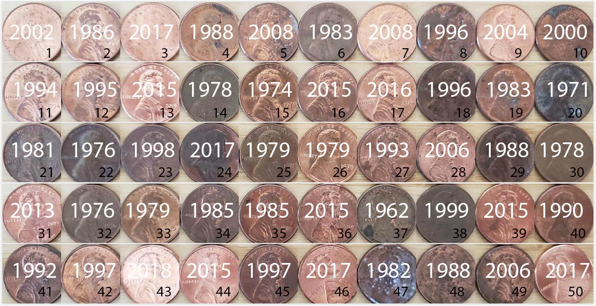
```

`moderndive` \index{moderndive!pennies\_sample} 패키지에는 `pennies_sample` 데이터 프레임에 샘플링된 `r num_pennies`개의 페니 데이터가 포함되어 있습니다.

```{r}
pennies_sample
```

`pennies_sample` 데이터 프레임은 두 개의 변수와 각 페니에 해당하는 `r num_pennies`개의 행을 가지고 있습니다. 첫 번째 변수인 `ID`는 그림 @fig-resampling-exercise-c 의 ID 레이블에 해당하며, 두 번째 변수인 `year`는 수치형 변수(배정밀도 실수, `dbl`)로 저장된 발행 연도입니다.

샘플링된 이 `r num_pennies`개의 페니를 바탕으로, 2019년 당시의 모든 미국 페니에 대해 무엇을 말할 수 있을까요? 탐색적 데이터 분석을 수행하여 표본의 몇 가지 특성을 살펴봅시다. 먼저 3 @sec-viz 의 데이터 시각화 도구를 사용하여 이 `r num_pennies`개 페니의 연도 분포를 시각화해 보겠습니다. `year`는 수치형 변수이므로, 그림 @fig-pennies-sample-histogram 에서 히스토그램을 사용하여 분포를 시각화합니다.

```{r pennies-sample-histogram, fig.cap="50개 미국 페니의 발행 연도 분포."}
ggplot(pennies_sample, aes(x = year)) +
  geom_histogram(binwidth = 10, color = "white")
```

대부분의 페니가 1980년에서 2010년 사이에 분포하고 1970년 이전의 페니는 거의 없기 때문에, 분포가 왼쪽으로 약간 꼬리가 긴(left-skewed \index{skew} 모양임을 확인할 수 있습니다. 샘플링된 `r num_pennies`개 페니의 평균 연도는 얼마일까요? 히스토그램을 눈대중으로 보면 1990년 근처인 것 같습니다. 이제 4 @sec-wrangling 의 데이터 핸들링 도구를 사용하여 이 값을 정확하게 계산해 보겠습니다.

```{r}
x_bar <- pennies_sample %>% 
  summarize(mean_year = mean(year))
x_bar
```

따라서 만약 우리가 `pennies_sample`이 모든 미국 페니를 대표하는 표본이라고 가정한다면, 모든 미국 페니의 평균 발행 연도에 대한 "좋은 추측치"는 `r x_bar %>% pull(mean_year) %>% round(2)`년이 될 것입니다. 즉, 약 `r x_bar %>% pull(mean_year) %>% round()`년입니다. 이 모든 과정이 7 @sec-sampling 에서 우리가 했던 것과 비슷하게 들리기 시작할 것입니다!

7 @sec-sampling 에서 우리의 연구 대상 모집단은 $N$ = `r nrow(bowl)`개의 공이 담긴 그릇이었습니다. 우리의 모수는 이 공들 중 빨간색 공의 모비율이었고 $p$로 표시했습니다. $p$를 추정하기 위해 우리는 삽을 사용하여 `r n_balls_sample`개의 공 표본을 추출했습니다. 그런 다음 관련 점 추정치인 `r n_balls_sample`개의 공 중 빨간색 공의 표본 비율을 계산했으며, 수학적으로 $\widehat{p}$로 표시했습니다.

여기서 우리의 모집단은 미국에서 사용되고 있는 페니 전체이며, 그 수 $N$은 우리가 모르며 아마 영원히 모를 것입니다. 관심 있는 모수는 이제 이 모든 페니의 모평균 발행 연도이며, 수학적으로 그리스 문자 $\mu$ ("뮤"라고 읽음)로 표시합니다. $\mu$를 추정하기 위해 우리는 은행에 가서 `r num_pennies`개의 페니 표본을 구했고 관련 점 추정치인 이 `r num_pennies`개 페니의 표본 평균 발행 연도를 계산했습니다. 이는 수학적으로 $\overline{x}$ ("엑스-바"라고 읽음)로 표시합니다. 표본 평균에 대한 대안적이고 더 직관적인 표기법은 $\widehat{\mu}$입니다. 하지만 불행히도 이것은 흔히 사용되지 않으므로, 이 책에서는 관례를 따라 표본 평균을 항상 $\overline{x}$로 표시하겠습니다.

7 @sec-sampling 의 표본 추출 그릇 연습과 이번 페니 연습 사이의 대응 관계를 표 @tbl-table-ch8-b 에 요약했습니다. 이 표는 이전에 보았던 표 @tbl-table-ch8 의 처음 두 개의 행입니다.

```{r table-ch8-b, echo=FALSE, message=FALSE, purl=FALSE}
# The following Google Doc is published to CSV and loaded using read_csv():
# https://docs.google.com/spreadsheets/d/1QkOpnBGqOXGyJjwqx1T2O5G5D72wWGfWlPyufOgtkk4/edit#gid=0

if (!file.exists("rds/sampling_scenarios.rds")) {
  sampling_scenarios <- "https://docs.google.com/spreadsheets/d/e/2PACX-1vRd6bBgNwM3z-AJ7o4gZOiPAdPfbTp_V15HVHRmOH5Fc9w62yaG-fEKtjNUD2wOSa5IJkrDMaEBjRnA/pub?gid=0&single=true&output=csv" %>%
    read_csv(na = "") %>%
    slice(1:5)
  write_rds(sampling_scenarios, "rds/sampling_scenarios.rds")
} else {
  sampling_scenarios <- read_rds("rds/sampling_scenarios.rds")
}

sampling_scenarios %>%
  # Only first two scenarios
  filter(Scenario <= 2) %>%
  kbl(
    caption = "추론을 위한 표본 추출 시나리오",
    booktabs = TRUE,
    escape = FALSE,
    linesep = ""
  ) %>%
  kable_styling(
    font_size = ifelse(knitr::is_latex_output(), 10, 16),
    latex_options = c("hold_position")
  ) %>%
  column_spec(1, width = "0.5in") %>%
  column_spec(2, width = "0.7in") %>%
  column_spec(3, width = "1in") %>%
  column_spec(4, width = "1.1in") %>%
  column_spec(5, width = "1in")
```


그림 @fig-resampling-exercise-c 의 샘플링된 `r num_pennies`개 페니로 돌아가 보면, 관심 있는 점 추정치는 `r x_bar %>% pull(mean_year) %>% round(2)`인 표본 평균 $\overline{x}$입니다. 이 양은 모든 미국 페니의 모평균 발행 연도 $\mu$에 대한 추정치입니다.

7 @sec-sampling 에서 이러한 추정치들은 표본 오차가 발생하기 쉽다는 점을 보았습니다. 예를 들어, 그림 @fig-resampling-exercise-c 의 이 특정 표본에서는 발행 연도가 1999년인 페니가 세 개 있었습니다. 만약 우리가 또 다른 `r num_pennies`개의 페니를 샘플링한다면, 정확히 세 개의 페니가 1999년 발행된 것일까요? 그럴 가능성은 거의 없습니다. 하나도 없을 수도 있고, 하나, 둘, 혹은 `r num_pennies`개 모두일 수도 있습니다! 우리 표본에 나타난 다른 26개의 고유한 연도들에 대해서도 마찬가지입니다.

7 @sec-sampling 에서 표본 오차의 영향을 공부하기 위해 우리는 여러 번 표본을 추출했는데, 그릇 활동에서는 삽을 사용하여 이를 쉽게 할 수 있었습니다. 하지만 페니의 경우, 어떻게 다른 표본을 얻을 수 있을까요? 다시 은행에 가서 또 다른 `r num_pennies`개들이 페니 롤을 받아오는 것입니다.

하지만 우리가 조금 게을러서 은행에 다시 가고 싶지 않다고 가정해 봅시다. 단 하나의 표본만을 사용하여 표본 오차의 영향을 어떻게 연구할 수 있을까요? 우리는 이제부터 설명할 복원 추출을 이용한 붓스트랩 재표본 추출(bootstrap resampling with replacement)이라는 기법을 사용하여 이를 수행할 것입니다.


### 한 번 재표본 추출하기

1단계: 그림 @fig-tactile-resampling-1 에서 보는 것처럼 우리의 `r num_pennies`개 페니를 나타내는 똑같은 크기의 종이 조각들을 출력합니다.

```{r tactile-resampling-1, echo=FALSE, fig.cap="1단계: 50개의 미국 페니를 나타내는 50개의 종이 조각.", fig.show="hold", purl=FALSE, out.width="100%"}

```

2단계: 그림 @fig-tactile-resampling-2 에서 보는 것처럼 `r num_pennies`개의 종이 조각을 모자나 빈 백에 넣습니다.

```{r tactile-resampling-2, echo=FALSE, fig.cap="2단계: 모자에 50개의 종이 조각 넣기.", fig.show="hold", purl=FALSE, out.width="60%"}
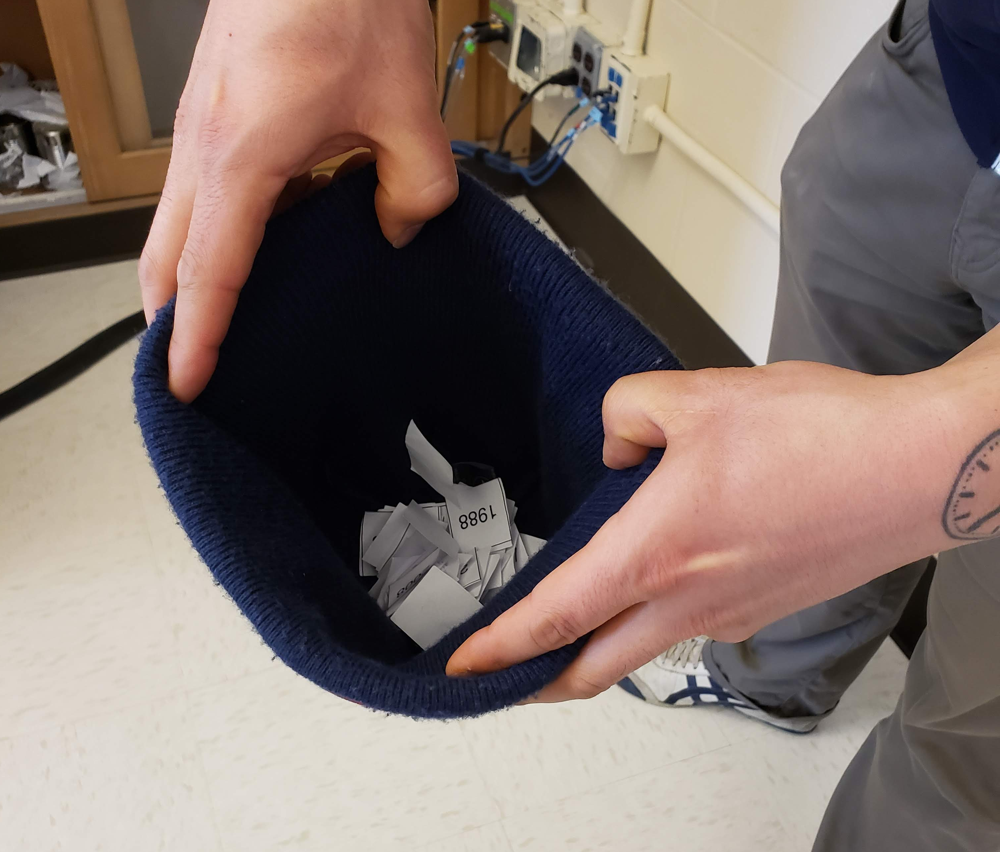
```

3단계: 그림 @fig-tactile-resampling-3 에서 보는 것처럼 모자의 내용물을 섞고 무작위로 종이 조각 하나를 꺼냅니다. 연도를 기록합니다.

```{r tactile-resampling-3, echo=FALSE, fig.cap="3단계: 무작위로 종이 조각 하나 꺼내기.", fig.show="hold", purl=FALSE, out.width="60%"}
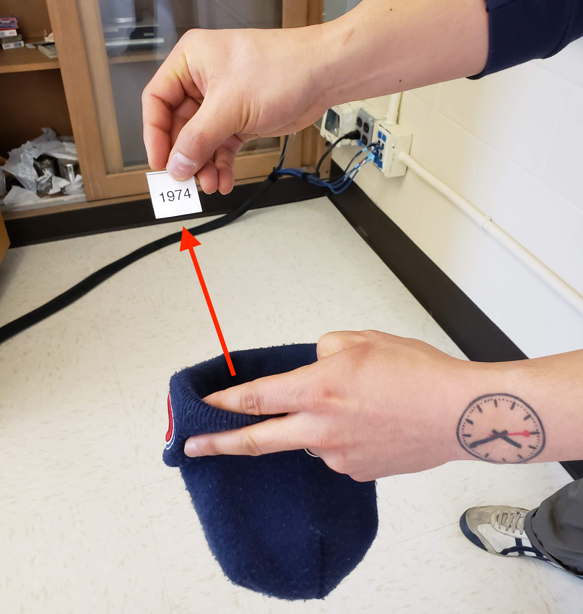
```

4단계: 종이 조각을 다시 모자에 넣습니다! 즉, 그림 @fig-tactile-resampling-4 에서 보는 것처럼 복원(replace)합니다.

```{r tactile-resampling-4, echo=FALSE, fig.cap="4단계: 종이 조각 다시 넣기.", fig.show="hold", purl=FALSE, out.width="50%"}
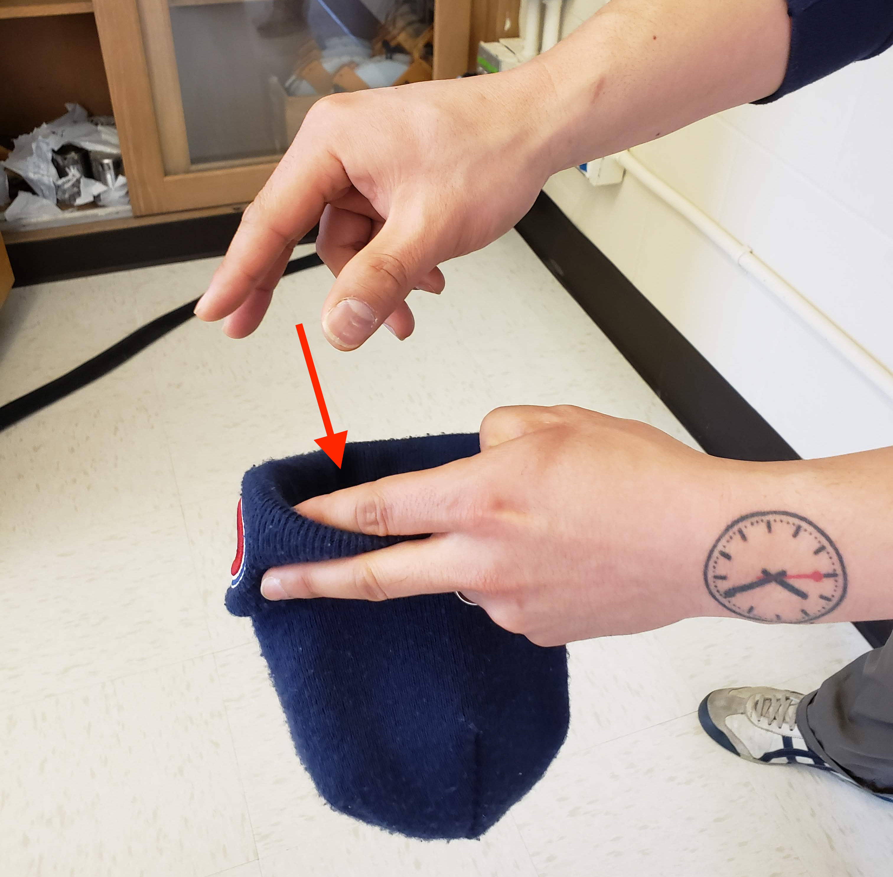
```

5단계: 3단계와 4단계를 총 `r num_pennies - 1`번 더 반복하여, 결과적으로 `r num_pennies`개의 연도를 기록합니다.

방금 우리가 수행한 것은 원래 `r num_pennies`개 페니 표본의 재표본 추출(resampling) \index{resampling}입니다. 우리는 은행에 갔을 때처럼 모든 미국 페니 모집단에서 `r num_pennies`개의 페니를 샘플링하는 것이 아닙니다. 대신, 원래의 `r num_pennies`개 페니 표본에서 다시 `r num_pennies`개의 페니를 재표출함으로써 이 행위를 흉내 내는 것입니다.

자, 이제 스스로에게 물어보세요. 왜 4단계에서 재표본 추출한 종이 조각을 다시 모자에 넣었을까요? 만약 4단계를 수행할 때마다 종이 조각을 모자 밖에 두었다면, 우리는 결국 원래의 `r num_pennies`개 페니와 똑같은 구성을 얻게 되었을 것입니다! 즉, 종이 조각을 다시 넣는 행위가 표본 오차를 유발하는 것입니다.

용어를 좀 더 정확하게 사용하자면, 우리는 방금 원래의 `r num_pennies`개 페니 표본에서 복원 재표본 추출(resampling with replacement)을 수행한 것입니다. 만약 4단계를 수행할 때마다 종이 조각을 모자 밖에 두었다면, 그것은 비복원 재표본 추출(resampling without replacement)이 되었을 것입니다.


탐색적 데이터 분석을 통해 `r num_pennies`개의 재표본 추출된 페니들을 살펴봅시다. 먼저, 재표본 추출된 `r num_pennies`개의 값으로 `pennies_resample` 데이터 프레임을 수동으로 만들어 R에 데이터를 로드해 보겠습니다. `dplyr` 패키지의 `tibble()` 명령어를 사용하겠습니다. 고유한 무작위성 때문에 여러분이 재표본 추출한 `r num_pennies`개의 값은 우리의 값과 거의 확실히 다를 것입니다.

```{r}
pennies_resample <- tibble(
  year = c(1976, 1962, 1976, 1983, 2017, 2015, 2015, 1962, 2016, 1976, 
           2006, 1997, 1988, 2015, 2015, 1988, 2016, 1978, 1979, 1997, 
           1974, 2013, 1978, 2015, 2008, 1982, 1986, 1979, 1981, 2004, 
           2000, 1995, 1999, 2006, 1979, 2015, 1979, 1998, 1981, 2015, 
           2000, 1999, 1988, 2017, 1992, 1997, 1990, 1988, 2006, 2000)
)
```

`pennies_resample`의 `r num_pennies`개의 `year` 값은 원래의 `r num_pennies`개 페니 표본에서 크기 `r num_pennies`인 재표본을 나타냅니다. 그림 @fig-resampling-exercise-d 에 재표본 추출된 `r num_pennies`개의 페니를 표시했습니다.

```{r resampling-exercise-d, echo=FALSE, fig.cap="재표본 추출된 50개의 미국 페니.", fig.show="hold", purl=FALSE, out.width="100%"}
# ID 열을 위해 이 코드가 필요함
if (!file.exists("rds/pennies_resample.rds")) {
  pennies_resample <- pennies_sample %>%
    rep_sample_n(size = num_pennies, replace = TRUE, reps = 1) %>%
    ungroup() %>%
    select(-replicate)
  write_rds(pennies_resample, "rds/pennies_resample.rds")
} else {
  pennies_resample <- read_rds("rds/pennies_resample.rds")
}
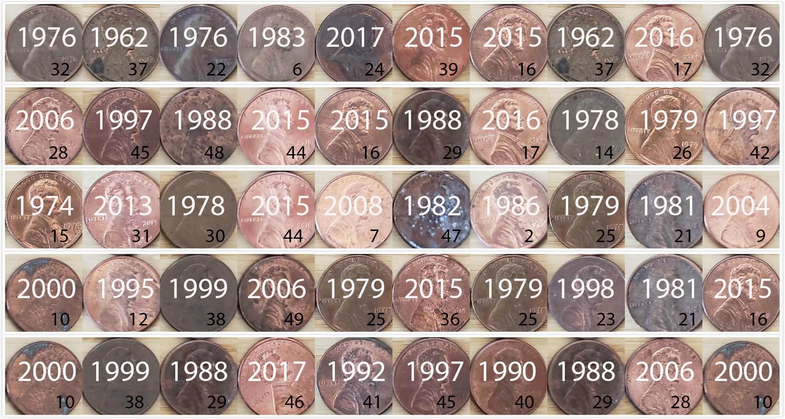
```

그림 @fig-origandresample 에서 재표본 추출된 `r num_pennies`개 페니의 수치형 변수 `year`의 분포와 원래 `r num_pennies`개 페니 표본의 수치형 변수 `year`의 분포를 비교해 봅시다.

```{r eval=FALSE}
ggplot(pennies_resample, aes(x = year)) +
  geom_histogram(binwidth = 10, color = "white") +
  labs(title = "50개 페니의 재표본")
ggplot(pennies_sample, aes(x = year)) +
  geom_histogram(binwidth = 10, color = "white") +
  labs(title = "50개 페니의 원래 표본")
```

(ref:compare-plots) 재표본 `pennies_resample`의 `year`와 원래 표본 `pennies_sample` 비교.

```{r origandresample, echo=FALSE, fig.cap="(ref:compare-plots)", purl=FALSE}
p1 <- ggplot(pennies_resample, aes(x = year)) +
  geom_histogram(binwidth = 10, color = "white") +
  labs(title = "50개 페니의 재표본") +
  scale_x_continuous(limits = c(1960, 2020), breaks = seq(1960, 2020, 20)) +
  scale_y_continuous(limits = c(0, 15), breaks = seq(0, 15, 5))
p2 <- ggplot(pennies_sample, aes(x = year)) +
  geom_histogram(binwidth = 10, color = "white") +
  labs(title = "50개 페니의 원래 표본") +
  scale_x_continuous(limits = c(1960, 2020), breaks = seq(1960, 2020, 20)) +
  scale_y_continuous(limits = c(0, 15), breaks = seq(0, 15, 5))
p1 + p2
```

그림 @fig-origandresample 에서 두 `year` 분포의 전반적인 모양은 대략 비슷하지만, 완전히 똑같지는 않다는 점을 관찰해 보세요.

이전 섹션에서 은행에서 가져온 원래 `r num_pennies`개 페니 표본의 평균은 `r x_bar %>% pull(mean_year) %>% round(2)`였습니다. 우리의 재표본은 어떨까요? 추측해 보시겠어요? 이전처럼 `dplyr`의 도움을 받아봅시다.

```{r}
pennies_resample %>% 
  summarize(mean_year = mean(year))
```
```{r, echo=FALSE, purl=FALSE}
resample_mean <- pennies_resample %>%
  summarize(mean_year = mean(year))
```

우리는 `r resample_mean %>% pull(mean_year) %>% round(2)`라는 다른 평균 연도를 얻었습니다. 이러한 변동은 앞서 우리가 수행한 복원 재표본 추출에 의해 유발된 것입니다.

```{r echo=FALSE, purl=FALSE}
# 이 코드는 동적 인라인 텍스트 출력 목적으로 사용됩니다.
n_resample_friends <- pennies_resamples %>% 
  select(name) %>% 
  distinct() %>% 
  nrow()
```

만약 이 재표본 추출 연습을 여러 번 반복한다면 어떨까요? 매번 같은 평균 `year`를 얻게 될까요? 다시 말해, 2019년 당시 미국 페니 전체의 평균 발행 연도에 대한 우리의 추측이 매번 정확히 `r resample_mean %>% pull(mean_year) %>% round(2)`가 될까요? 7 @sec-sampling 에서 했던 것처럼, 친구들의 도움을 받아 이 재표본 추출 활동을 수행해 봅시다. 총 `r n_resample_friends`명의 친구가 도와줄 것입니다.


### `r n_resample_friends`번 재표본 추출하기 {#student-resamples}

`r n_resample_friends`명의 친구는 각각 다음의 5단계를 반복할 것입니다.

1. `r num_pennies`개의 페니를 나타내는 똑같은 크기의 종이 조각 `r num_pennies`개로 시작합니다.
1. `r num_pennies`개의 작은 종이 조각을 모자나 비니 모자에 넣습니다.
1. 모자의 내용물을 섞고 무작위로 종이 조각 하나를 꺼냅니다. 스프레드시트에 연도를 기록합니다.
1. 종이 조각을 다시 모자에 넣습니다!
1. 3단계와 4단계를 총 `r num_pennies - 1`번 더 반복하여, 결과적으로 `r num_pennies`개의 연도를 기록합니다.

우리는 `r n_resample_friends`명의 친구에게 이 작업을 수행하게 했으므로, 결과적으로 $`r n_resample_friends` \cdot `r num_pennies` = `r n_resample_friends*num_pennies`$개의 값을 얻었습니다. 우리는 이 값들을 [공유 스프레드시트](https://docs.google.com/spreadsheets/d/1y3kOsU_wDrDd5eiJbEtLeHT9L5SvpZb_TrzwFBsouk0/)에 `r num_pennies`개의 행(헤더 행 제외)과 `r n_resample_friends`개의 열로 기록했습니다. 이 공유 스프레드시트의 처음 10개 행과 5개 열을 캡처한 사진을 그림 @fig-tactile-resampling-5 에 나타냈습니다.

```{r tactile-resampling-5, echo=FALSE, fig.cap = "재표본 추출된 페니들이 기록된 공유 스프레드시트의 캡처 사진.", fig.show="hold", purl=FALSE, out.width = "70%"}
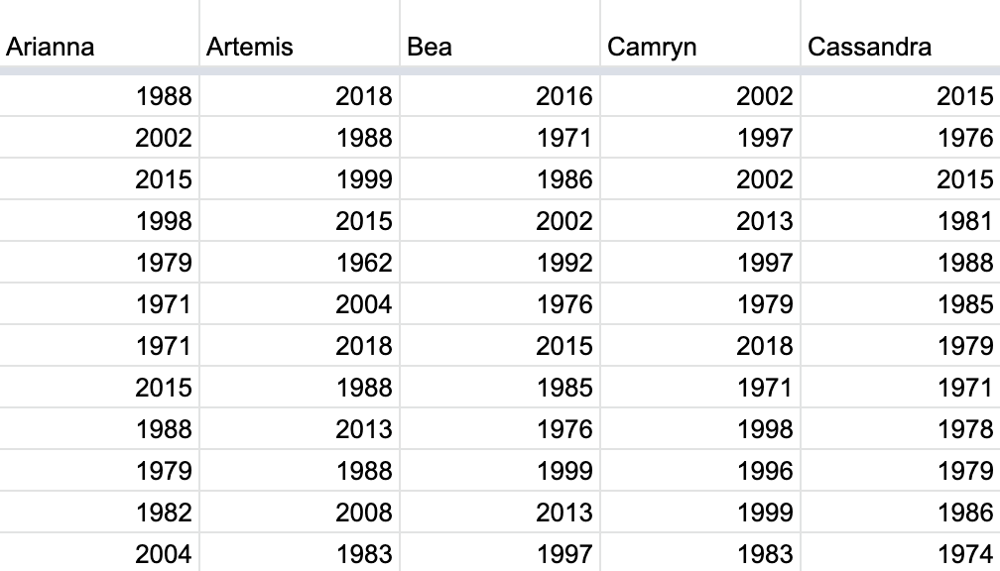
```

편의를 위해 이 `r n_resample_friends` $\cdot$ `r num_pennies` = `r n_resample_friends * num_pennies`개의 값들을 `moderndive` 패키지에 포함된 "tidy"한 데이터 프레임인 `pennies_resamples`에 저장해 두었습니다. 하위 @sec-tidy-definition 절에서 데이터 프레임이 "tidy"하다는 것이 무엇을 의미하는지 배웠습니다.

```{r}
pennies_resamples
```

`r n_resample_friends`명의 친구는 각각 평균 연도로 어떤 값을 얻었을까요? 다시 한번 `dplyr`가 나설 차례입니다! `name`으로 행들을 그룹화한 후, `r num_pennies`개 행으로 구성된 각 그룹의 평균 `year`를 요약합니다.

```{r}
resampled_means <- pennies_resamples %>% 
  group_by(name) %>% 
  summarize(mean_year = mean(year))
resampled_means
```

`resampled_means`는 `r n_resample_friends`개의 재표본에 기초한 `r n_resample_friends`개의 평균값에 해당하는 `r n_resample_friends`개의 행을 가지고 있습니다. 또한, `mean_year` 변수에 있는 `r n_resample_friends`개 값들의 변동을 관찰해 보세요. 이 변동을 그림 @fig-tactile-resampling-6 의 히스토그램을 사용하여 시각화해 보겠습니다. `geom_histogram()`에 `boundary = 1990` 인자를 추가하면 빈 경계 중 하나가 정확히 1990에 오도록 설정된다는 점을 상기하세요.

```{r tactile-resampling-6, fig.cap="35번의 재표본으로 얻은 35개 표본 평균의 분포.", purl=FALSE, fig.height=3.5}
ggplot(resampled_means, aes(x = mean_year)) +
  geom_histogram(binwidth = 1, color = "white", boundary = 1990) +
  labs(x = "샘플링된 평균 연도")
```

그림 @fig-tactile-resampling-6 에서 분포가 대략 정규 분포 모양이며, 표본 평균 연도가 1992년보다 작거나 2000년보다 큰 경우는 거의 없다는 점을 관찰해 보세요. 또한 분포의 중심이 은행에서 가져온 원래 표본 `r num_pennies`개의 표본 평균인 `r x_bar %>% pull(mean_year) %>% round(2)`와 가까운 1995년 부근에 있다는 점도 확인하십시오.


### 우리가 방금 무엇을 한 것일까요? {#ci-what-did-we-just-do}

우리가 방금 이 활동에서 보여준 것은 복원 추출을 이용한 붓스트랩 재표본 추출(bootstrap resampling with replacement) \index{bootstrap}이라고 알려진 통계적 절차입니다. 우리는 7 @sec-sampling 에서 공부한 표본 오차를 흉내 내기 위해 재표본 추출을 사용했습니다. 하지만 이번 경우에는 모집단에서 추출한 단 하나의 표본만을 사용하여 이를 수행했습니다.

사실, 그림 @fig-tactile-resampling-6 에 나타난 `r n_resample_friends`번의 재표본으로 얻은 표본 평균들의 히스토그램을 붓스트랩 분포(bootstrap distribution) \index{bootstrap!distribution}라고 부릅니다. 이는 두 분포가 비슷한 모양과 퍼짐을 가질 것이라는 점에서 표본 평균의 표본 분포(sampling distribution)에 대한 근사치입니다. 이어지는 @sec-ci-conclusion 절에서 실제로 그러하다는 것을 보여줄 것입니다. 이 붓스트랩 분포를 사용하여 우리는 추정치에 대한 표본 오차의 영향을 연구할 수 있습니다. 특히, 표준 오차(standard error) \index{standard error}라고 알려진 추정치의 전형적인 "오차"를 연구할 것입니다.

 @sec-resampling-simulation 절에서는 컴퓨터를 사용하여 촉각적 재표본 추출 활동을 가상으로 흉내 낼 것이며, 이를 통해 `r n_resample_friends`번보다 훨씬 더 많이 재표본 추출을 빠르게 수행할 것입니다. @sec-ci-build-up 절에서는 붓스트랩 분포 개념을 바탕으로 하는 신뢰 구간(confidence interval)이라는 통계적 개념을 정의하겠습니다.

 @sec-bootstrap-process 절에서는 `dplyr` 패키지와 새로운 패키지인 `infer` 패키지를 사용하여 "tidy"하고 투명한 통계적 추론을 위한 신뢰 구간을 구축할 것입니다. `infer` 패키지 파이프라인의 동기가 된 "tidy" 통계적 추론 프레임워크를 소개하겠습니다. `infer` 패키지는 이 책의 나머지 부분 전체에서 핵심적인 패키지가 될 것입니다.

7 @sec-sampling 에서 했던 것처럼, @sec-case-study-two-prop-ci 절에서 실제 사례 연구를 통해 이 모든 아이디어를 하나로 묶어보겠습니다. 이번에는 미국 TV 프로그램 인 *Mythbusters*의 하품에 관한 실험 데이터를 살펴볼 것입니다.


## 재표본 추출의 컴퓨터 시뮬레이션 {#sec-resampling-simulation}

이제 우리의 촉각적 재표본 추출 활동을 컴퓨터를 사용하여 가상으로 흉내 내 보겠습니다.


### 한 번 가상으로 재표본 추출하기

먼저, 한 번의 재표본 추출을 가상으로 수행해 보겠습니다. `moderndive` 패키지에 포함된 `pennies_sample` 데이터 프레임에는 은행에서 가져온 원래 `r num_pennies`개 페니의 발행 연도가 들어 있음을 상상해 보세요. 또한, 표본 추출에 관한 7 @sec-sampling 에서 우리는 `rep_sample_n()` 함수를 가상 삽으로 사용하여 다음과 같이 `r nrow(bowl)`개의 공이 담긴 가상 그릇에서 공을 샘플링했습니다.

```{r, eval=FALSE}
virtual_shovel <- bowl %>% 
  rep_sample_n(size = 50)
```

이 코드를 수정하여 원래 표본인 `r num_pennies`개의 페니를 나타내는 `r num_pennies`개의 종이 조각을 복원 재표본 추출하도록 해보겠습니다.

```{r}
virtual_resample <- pennies_sample %>% 
  rep_sample_n(size = 50, replace = TRUE)
```

`rep_sample_n()` 함수에 `replace` 인자를 `TRUE` \index{sampling!with replacement}로 명시적으로 설정하여 복원 추출을 하고 싶다고 알려주는 것을 확인하세요. 만약 `replace = TRUE`를 설정하지 않았다면, 함수는 기본값인 `FALSE`를 사용하므로 비복원 재표본 추출을 수행했을 것입니다. 또한, `reps` 인자를 통해 반복 횟수를 지정하지 않았으므로 함수는 기본값인 한 번의 반복 `reps = 1`을 가정합니다. 마지막으로, `size` 인자는 원래 표본 크기인 `r num_pennies`개 페니에 맞춰 설정되었습니다.

`virtual_resample`의 `r num_pennies`개 행 중 처음 10개만 살펴보겠습니다.

```{r}
virtual_resample
```

`replicate` 변수는 `reps = 1`이므로 1이라는 값만 가집니다. `ID` 변수는 `pennies_sample`의 `r num_pennies`개 페니 중 어느 것이 재표본 추출되었는지를 나타내고, `year`는 발행 연도를 나타냅니다. 이제 `dplyr` 패키지에 포함된 데이터 핸들링 함수를 사용하여 크기가 `r num_pennies`인 가상 재표본의 평균 `year`를 계산해 보겠습니다.

```{r}
virtual_resample %>% 
  summarize(resample_mean = mean(year))
```

촉각적 재표본 추출 연습을 했을 때 보았듯이, 결과로 나온 평균 연도는 원래 샘플링된 `r num_pennies`개 페니의 평균 연도인 `r x_bar %>% pull(mean_year) %>% round(2)`와는 다릅니다.

<!--
v2 TODO: Add discussion on why tidyverse opts for 3 sigfigs. For ex:

Note that tibbles will try to print as pretty as possible which may result in
numbers being rounded. In this chapter, we have set the default number of values
to be printed to six in tibbles with `options(pillar.sigfig = 6)`.

-->


### `r n_resample_friends`번 가상으로 재표본 추출하기 {#sec-bootstrap-35-replicates}

이제 `r n_resample_friends`명의 친구가 했던 재표본 추출을 가상으로 수행해 보겠습니다. 이 결과를 통해 크기가 `r num_pennies`인 `r n_resample_friends`번의 재표본에서 얻은 표본 평균들의 변동성을 연구할 수 있을 것입니다. 먼저 `rep_sample_n()` \index{infer!rep\_sample\_n()}에 `reps = `r n_resample_friends` ` 인자를 추가하여 `r n_resample_friends`번의 반복을 원한다고 지정합니다. 즉, `r num_pennies`개 페니의 복원 재표본 추출을 `r n_resample_friends`번 반복하고 싶다는 의미입니다.

```{r}
virtual_resamples <- pennies_sample %>% 
  rep_sample_n(size = 50, replace = TRUE, reps = 35)
virtual_resamples
```

결과로 나온 `virtual_resamples` 데이터 프레임은 `r num_pennies`개 페니의 `r n_resample_friends`번 재표본에 해당하는 `r n_resample_friends` $\cdot$ `r num_pennies` = `r n_resample_friends * num_pennies`개의 행을 가집니다. 이제 이전 섹션에서와 동일한 `dplyr` 코드를 사용하여 `r n_resample_friends`개의 표본 평균을 계산하되, 이번에는 `group_by(replicate)`를 추가합니다.

```{r}
virtual_resampled_means <- virtual_resamples %>% 
  group_by(replicate) %>% 
  summarize(mean_year = mean(year))
virtual_resampled_means
```

`virtual_resampled_means`가 `r n_resample_friends`개의 재표본 평균에 해당하는 `r n_resample_friends`개의 행을 가지고 있음을 확인하세요. 또한, `mean_year`의 값들이 변하는 것도 확인하십시오. 그림 @fig-tactile-resampling-7 의 히스토그램을 사용하여 이 변동을 시각화해 보겠습니다.

```{r tactile-resampling-7, fig.cap="35번의 재표본으로 얻은 35개 표본 평균의 분포."}
ggplot(virtual_resampled_means, aes(x = mean_year)) +
  geom_histogram(binwidth = 1, color = "white", boundary = 1990) +
  labs(x = "재표본 평균 연도")
```

가상으로 구축된 붓스트랩 분포를 그림 @fig-orig-and-resample-means 에서 35명의 친구가 촉각적 재표본 추출 연습을 통해 구축한 것과 비교해 봅시다. 둘이 어느 정도 비슷하지만 완전히 똑같지는 않다는 점을 관찰해 보세요.

```{r orig-and-resample-means, echo=FALSE, fig.cap="재표본 평균 분포 비교.", purl=FALSE}
p3 <- ggplot(virtual_resampled_means, aes(x = mean_year)) +
  geom_histogram(binwidth = 1, color = "white", boundary = 1990) +
  labs(x = "재표본 평균 연도", title = "35개 가상 재표본의 평균") +
  scale_x_continuous(breaks = seq(1990, 2000, 2))
p4 <- ggplot(resampled_means, aes(x = mean_year)) +
  geom_histogram(binwidth = 1, color = "white", boundary = 1990) +
  labs(x = "재표본 평균 연도", title = "35개 촉각적 재표본의 평균") +
  scale_x_continuous(breaks = seq(1990, 2000, 2))
p3 + p4
```

우리가 여기서 보여주는 "복원 재표본 추출" 시나리오에서, 이 두 히스토그램은 특별한 이름인 표본 평균의 붓스트랩 분포를 가집니다. 또한, 이들이 표본 추출에 관한 7 @sec-sampling 에서 보았던 개념인 표본 평균의 표본 분포(sampling distribution)에 대한 근사치라는 점을 상기하세요. 이러한 분포들은 실제 모집단 평균(이 경우에는 *모든* 미국 페니의 실제 평균 연도)에 대한 우리의 추정치에 작용하는 표본 오차의 영향을 연구할 수 있게 해줍니다. 하지만 (실제로는 절대 하지 않을 일인 여러 개의 표본을 추출했던 7 @sec-sampling 과는 달리, 붓스트랩 분포는 단 하나의 표본(이 경우에는 은행에서 가져온 원래 `r num_pennies`개의 페니)에서 여러 번 재표본을 추출하여 구축됩니다.


### `r n_virtual_resample`번 가상으로 재표본 추출하기 {#sec-bootstrap-1000-replicates}

복원 재표본 추출의 목표 중 하나가 표본 분포의 근사치인 붓스트랩 분포를 구축하는 것임을 기억하세요. 하지만 그림 @fig-tactile-resampling-7 의 붓스트랩 분포는 단 `r n_resample_friends`번의 재표본에 기초하고 있어 모양이 다소 거칩니다. 재표본의 횟수를 `r n_virtual_resample`번으로 늘려보겠습니다. 그러면 서로 다른 재표본 사이의 변동성과 그 형태를 더 잘 볼 수 있을 것입니다.

```{r}
# 재표본 추출 1000번 반복
virtual_resamples <- pennies_sample %>% 
  rep_sample_n(size = 50, replace = TRUE, reps = 1000)

# 1000개의 표본 평균 계산
virtual_resampled_means <- virtual_resamples %>% 
  group_by(replicate) %>% 
  summarize(mean_year = mean(year))
```

하지만 간결함을 위해, 앞으로는 이 두 연산을 하나의 파이프(`%>%` 연산자 체인으로 결합하겠습니다.

```{r}
virtual_resampled_means <- pennies_sample %>% 
  rep_sample_n(size = 50, replace = TRUE, reps = 1000) %>% 
  group_by(replicate) %>% 
  summarize(mean_year = mean(year))
virtual_resampled_means
```

그림 @fig-one-thousand-sample-means 에서 `r n_virtual_resample`번의 가상 재표본에 기초한 이 `r n_virtual_resample`개 평균의 붓스트랩 분포를 시각화해 보겠습니다.

```{r one-thousand-sample-means, message=FALSE, fig.cap="1000번의 재표본에 기초한 붓스트랩 재표본 분포."}
ggplot(virtual_resampled_means, aes(x = mean_year)) +
  geom_histogram(binwidth = 1, color = "white", boundary = 1990) +
  labs(x = "표본 평균")
```


여기서 종 모양이 훨씬 더 뚜렷해지기 시작했다는 점에 주목하세요. 이제 우리는 표본 평균이 가질 수 있는 값의 범위에 대해 일반적인 감을 잡았습니다. 그런데 이 히스토그램은 어디를 중심으로 하고 있을까요? `r n_virtual_resample`개 재표본 평균의 평균을 계산해 보겠습니다.

```{r}
virtual_resampled_means %>% 
  summarize(mean_of_means = mean(mean_year))
```
```{r echo=FALSE, purl=FALSE}
mean_of_means <- virtual_resampled_means %>%
  summarize(mean(mean_year)) %>%
  pull() %>%
  round(2)
```

이 `r n_virtual_resample`개 평균의 평균은 `r mean_of_means`이며, 이는 원래 `r num_pennies`개 페니 표본의 평균인 `r x_bar %>% pull(mean_year) %>% round(2)`와 매우 가깝습니다. 이는 `r n_virtual_resample`번의 각 재표본이 원래의 `r num_pennies`개 페니 표본에 기초하고 있기 때문입니다.

축하합니다! 여러분은 방금 첫 번째 붓스트랩 분포를 구축했습니다! 다음 섹션에서는 이 붓스트랩 분포를 사용하여 신뢰 구간(confidence intervals)을 구축하는 방법을 알아보겠습니다.

```{block, type="learncheck", purl=FALSE}
\vspace{-0.15in}
_학습 확인_
\vspace{-0.1in}
```

`r paste0("(LC", chap, ".", (lc <- lc + 1), ")")` 붓스트랩 분포와 표본 분포의 가장 큰 차이점은 무엇일까요?

`r paste0("(LC", chap, ".", (lc <- lc + 1), ")")` 그림 @fig-one-thousand-sample-means 의 표본 평균에 대한 붓스트랩 분포를 보고, *대부분*의 값이 어느 두 값 사이에 있다고 말할 수 있을까요?

```{block, type="learncheck", purl=FALSE}
\vspace{-0.25in}
\vspace{-0.25in}
```


## 신뢰 구간의 이해 {#sec-ci-build-up}

낚시와 관련된 비유로 이 섹션을 시작하겠습니다. 여러분이 물고기를 잡으려 한다고 가정해 봅시다. 한편으로는 작살을 사용할 수 있고, 다른 한편으로는 그물을 사용할 수 있습니다. 그물을 사용하면 아마도 더 많은 물고기를 잡을 수 있을 것입니다!

이제 여러분이 *모든* 미국 페니의 실제 모집단 평균 연도 $\mu$를 추정하려 했던 페니 연습을 다시 생각해 보세요. \index{confidence interval!analogy to fishing} $\mu$의 값을 물고기라고 생각하십시오.

한편으로, 우리는 $\mu$를 추정하기 위해 표 @tbl-table-ch8-b 에서 보았던 적절한 점 추정치/표본 통계량인 표본 평균 $\overline{x}$를 사용할 수 있습니다. 은행에서 가져온 `r num_pennies`개의 페니 표본에 기초했을 때, 표본 평균은 `r x_bar %>% pull(mean_year) %>% round(2)`였습니다. 이 값을 사용하는 것을 "작살로 낚시하기"라고 생각하십시오.

그렇다면 "그물로 낚시하기"는 무엇에 해당할까요? 그림 @fig-one-thousand-sample-means 의 붓스트랩 분포를 다시 한번 보세요. "대부분"의 표본 평균이 어느 두 연도 사이에 있다고 말할 수 있을까요? 이 질문은 다소 주관적이지만, 대부분의 표본 평균이 1992년과 2000년 사이에 있다고 말하는 것이 불합리하지는 않을 것입니다. 이 구간을 "그물"이라고 생각하십시오.

우리가 방금 설명한 것이 바로 신뢰 구간(confidence interval)의 개념이며, 이 책 전반에서 "CI"로 줄여서 부르겠습니다. 하나의 값으로 미지의 모수 값을 추정하는 점 추정치/표본 통계량과 달리, 신뢰 구간 \index{confidence interval}은 그럴듯한 값들의 범위라고 해석될 수 있는 것을 제공합니다. 비유로 돌아가면, 점 추정치/표본 통계량은 작살로 생각할 수 있고, 신뢰 구간은 그물로 생각할 수 있습니다.

<!--
점 추정치           |  신뢰 구간
:-------------------------:|:-------------------------:
{ height=2.5in } |  { height=2.5in }
-->

```{r point-estimate-vs-conf-int, echo=FALSE, fig.cap="점 추정치와 신뢰 구간의 차이에 대한 비유.", out.width="100%", purl=FALSE}
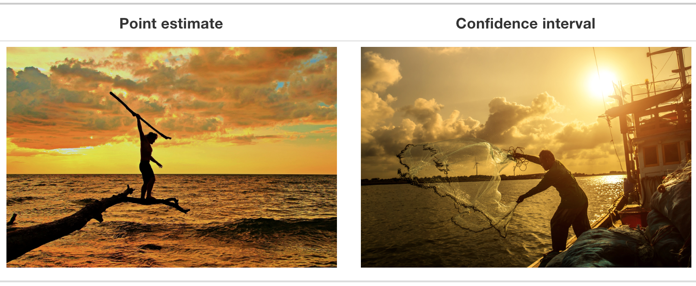
```

우리가 제안한 1992년에서 2000년 사이의 구간은 눈대중으로 구축되었으므로 다소 주관적이었습니다. 이제 이러한 구간을 더 정확한 방식으로 구축하는 두 가지 방법, 즉 백분위수 방법(percentile method)과 표준 오차 방법(standard error method)을 소개하겠습니다.

신뢰 구간 구축을 위한 두 방법은 몇 가지 공통점을 가집니다. 첫째, 둘 다 하위 @sec-bootstrap-1000-replicates 절에서 여러분이 구축하고 그림 @fig-one-thousand-sample-means 에서 시각화한 것과 같은 붓스트랩 분포로부터 만들어집니다.

둘째, 둘 다 신뢰 수준(confidence level) \index{confidence interval!confidence level}을 지정해야 합니다. 일반적으로 사용되는 신뢰 수준에는 90%, 95%, 99%가 있습니다. 다른 모든 조건이 같다면, 신뢰 수준이 높을수록 신뢰 구간이 넓어지고, 신뢰 수준이 낮을수록 신뢰 구간이 좁아집니다. 이 책에서는 주로 95%를 사용할 것이며, 따라서 페니 활동에 대해 "$\mu$에 대한 95% 신뢰 구간"을 구축할 것입니다.


### 백분위수 방법 {#sec-percentile-method}

```{r echo=FALSE, purl=FALSE}
# get_ci() 대신 conf_int()나 get_confidence_interval()을 사용할 수도 있습니다.
# 이들은 정확히 같은 방식으로 작동하는 별칭(alias)입니다.
percentile_ci <- virtual_resampled_means %>%
  rename(stat = mean_year) %>%
  get_ci(level = 0.95, type = "percentile")
```

신뢰 구간을 구축하는 한 가지 방법은 붓스트랩 분포 값들의 중앙 95%를 사용하는 것입니다. 우리는 2.5번째 백분위수와 97.5번째 백분위수를 계산하여 이를 수행할 수 있으며, 이들은 각각 `r percentile_ci$lower_ci `와 `r percentile_ci$upper_ci `입니다. 이것이 신뢰 구간 구축을 위한 백분위수 방법으로 알려진 것입니다.

지금은 백분위수 방법으로 구축된 신뢰 구간 뒤에 있는 개념에만 집중합시다. 이러한 값들을 계산하는 코드는 다음 섹션에서 보여드리겠습니다.

이 백분위수들을 그림 @fig-percentile-method 에서 붓스트랩 분포 상에 수직선으로 표시해 보겠습니다. `virtual_resampled_means`에 있는 `mean_year` 변수값의 약 95%가 `r percentile_ci$lower_ci `와 `r percentile_ci$upper_ci ` 사이에 위치하며, 2.5%는 가장 왼쪽 선의 왼쪽에, 2.5%는 가장 오른쪽 선의 오른쪽에 위치합니다.

오바마 여론 조사 기사의 경우 `r p_obama*100`％였지만 "오차 범위가 플러스 마이너스 `r moe_obama*100`％포인트였다"라고 명시했습니다. 이 "그럴듯한 범위"는 [`r p_obama*100`％ - `r moe_obama*100`％, `r p_obama*100`％ + `r moe_obama*100`％] = [`r (p_obama - moe_obama)*100`％, `r (p_obama + moe_obama)*100`％]였습니다. 이 그럴듯한 값들의 범위를 신뢰 구간(confidence interval)이라고 합니다.

```{r percentile-method, echo=FALSE, message=FALSE, fig.cap="(ref:perc-method)", fig.height=3.4}
ggplot(virtual_resampled_means, aes(x = mean_year)) +
  geom_histogram(binwidth = 1, color = "white", boundary = 1988) +
  labs(x = "재표본 표본 평균") +
  scale_x_continuous(breaks = seq(1988, 2006, 2)) +
  geom_vline(xintercept = percentile_ci$lower_ci, size = 1) +
  geom_vline(xintercept = percentile_ci$upper_ci, size = 1)
```


### 표준 오차 방법 {#sec-se-method}

```{r echo=FALSE, purl=FALSE}
# Can also use get_confidence_interval() instead of get_ci(),
# as it is an alias that works the exact same way.
standard_error_ci <- virtual_resampled_means %>%
  rename(stat = mean_year) %>%
  get_ci(type = "se", point_estimate = x_bar)

# bootstrap SE value as scalar
bootstrap_se <- virtual_resampled_means %>%
  summarize(se = sd(mean_year)) %>%
  pull(se)
```


부록 @sec-appendix-normal-curve 에서 수치 변수가 정규 분포를 따를 때, 즉 이 변수의 히스토그램이 종 모양일 때 약 95%의 값들이 평균으로부터 $\pm$ `r qnorm(0.975) %>% round(2)` 표준 편차 내에 위치한다는 것을 보았습니다. 그림 @fig-one-thousand-sample-means 의 복원 재표본 추출에 기초한 붓스트랩 분포가 정규 분포 모양이므로, 정규 분포의 이러한 성질을 사용하여 신뢰 구간을 다른 방식으로 구축해 보겠습니다.

첫째, 붓스트랩 분포의 평균이 `r mean_of_means`라는 점을 상기하세요. 이 값은 원래 `r num_pennies`개 페니의 표본 평균인 $\overline{x} = `r x_bar %>% pull(mean_year) %>% round(2)`$와 거의 정확히 일치합니다. 둘째, `virtual_resampled_means` 데이터 프레임의 `mean_year` 값들을 사용하여 붓스트랩 분포의 표준 편차를 계산해 보겠습니다.

```{r}
virtual_resampled_means %>% 
  summarize(SE = sd(mean_year))
```

이 값은 무엇일까요? 붓스트랩 분포가 표본 분포의 근사치라는 점을 상기하세요. 또한 표본 분포의 표준 편차는 표준 오차(standard error)라는 특별한 이름을 가진다는 점도 상기하십시오. 이 두 사실을 종합하면, `r bootstrap_se %>% round(5)`는 $\overline{x}$의 표준 오차에 대한 근사치라고 말할 수 있습니다.

따라서 부록 @sec-appendix-normal-curve 의 정규 분포에 대한 95% 법칙을 사용하여 $\mu$에 대한 95% 신뢰 구간의 하한과 상한을 결정하는 공식은 다음과 같습니다.

$$
\begin{aligned}
\overline{x} \pm `r qnorm(0.975) %>% round(2)` \cdot SE &= (\overline{x} - `r qnorm(0.975) %>% round(2)` \cdot SE, \overline{x} + `r qnorm(0.975) %>% round(2)` \cdot SE)\\
&= (`r x_bar %>% pull(mean_year) %>% round(2)` - `r qnorm(0.975) %>% round(2)` \cdot `r bootstrap_se %>% round(2)`, `r x_bar %>% pull(mean_year) %>% round(2)` + `r qnorm(0.975) %>% round(2)` \cdot `r bootstrap_se %>% round(2)`)\\
&= (1991.15, 1999.73)
\end{aligned}
$$


이제 그림 @fig-percentile-and-se-method 에서 점선으로 표시된 SE 방법 신뢰 구간을 추가해 보겠습니다.

(ref:both-methods) 두 가지 95% 신뢰 구간 방법 비교.

```{r percentile-and-se-method, echo=FALSE, message=FALSE, fig.cap="(ref:both-methods)", fig.height=5.2, purl=FALSE}
both_CI <- bind_rows(
  percentile_ci %>% gather(endpoint, value) %>% mutate(type = "percentile"),
  standard_error_ci %>% gather(endpoint, value) %>% mutate(type = "SE")
)
ggplot(virtual_resampled_means, aes(x = mean_year)) +
  geom_histogram(binwidth = 1, color = "white", boundary = 1988) +
  labs(x = "표본 평균", title = "백분위수 방법 CI (실선), SE 방법 CI (점선)") +
  scale_x_continuous(breaks = seq(1988, 2006, 2)) +
  geom_vline(xintercept = percentile_ci$lower_ci, size = 1) +
  geom_vline(xintercept = percentile_ci$upper_ci, size = 1) +
  geom_vline(xintercept = standard_error_ci$lower_ci, linetype = "dashed", size = 1) +
  geom_vline(xintercept = standard_error_ci$upper_ci, linetype = "dashed", size = 1)
```

두 방법 모두 $\mu$에 대해 거의 동일한 95% 신뢰 구간을 생성함을 알 수 있습니다. 백분위수 방법은 $(`r round(percentile_ci$lower_ci , 2)`, `r round(percentile_ci$upper_ci , 2)`)$을, 표준 오차 방법은 $(`r round(standard_error_ci$lower_ci , 2)`, `r round(standard_error_ci$upper_ci ,2)`)$을 산출했습니다. 하지만 표준 오차 법칙은 붓스트랩 분포가 대략 정규 분포 모양일 때만 사용할 수 있다는 점을 상기하세요.

이제 신뢰 구간의 개념을 소개하고 이를 구축하는 두 가지 방법 뒤에 숨겨진 직관을 설명했으므로, 이를 실제로 구축할 수 있게 해주는 코드를 살펴보겠습니다.


```{block, type="learncheck", purl=FALSE}
\vspace{-0.15in}
_학습 확인_
\vspace{-0.1in}
```

`r paste0("(LC", chap, ".", (lc <- lc + 1), ")")` 표준 오차 방법을 사용하여 신뢰 구간을 구축하려면 붓스트랩 분포가 어떤 조건을 충족해야 할까요?

`r paste0("(LC", chap, ".", (lc <- lc + 1), ")")` $\mu$에 대해 95% 신뢰 구간 대신 68% 신뢰 구간을 구축하고 싶다고 가정해 봅시다. 이를 위해 어떤 변경이 필요한지 설명하세요. 힌트: 부록 @sec-appendix-normal-curve 의 정규 분포 부분을 참고하시기 바랍니다.

```{block, type="learncheck", purl=FALSE}
\vspace{-0.25in}
\vspace{-0.25in}
```


## 신뢰 구간 구축하기 {#sec-bootstrap-process}

 @sec-resampling-tactile 절에서 수동으로, 그리고 @sec-resampling-simulation 절에서 가상으로 수행한 복원 재표본 추출 과정을 붓스트랩(bootstrapping) \index{bootstrap!colloquial definition}이라고 합니다. 붓스트랩이라는 용어는 "자신의 장화 끈(bootstraps)을 잡고 스스로를 끌어올린다"는 표현에서 유래했으며, 이는 ["자신의 힘이나 능력만으로 성공한다"](https://en.wiktionary.org/wiki/pull_oneself_up_by_one%27s_bootstraps)는 의미를 담고 있습니다.

통계적 관점에서 붓스트랩은 단 하나의 표본으로부터 얻은 "노력"으로 추정치에 작용하는 표본 오차의 영향을 성공적으로 연구할 수 있음을 암시합니다. 더 정확하게는, \index{bootstrap!statistical reference} 단 하나의 표본만을 사용하여 표본 분포의 근사치를 구축하는 것을 의미합니다.

 @sec-resampling-simulation 절에서 가상으로 복원 재표본 추출을 수행하기 위해 우리는 `rep_sample_n()` 함수를 사용했으며, 재표본의 크기가 원래 표본 크기인 `r num_pennies`와 일치하도록 했습니다. 이번 섹션에서는 이러한 아이디어를 바탕으로 새로운 패키지인 `infer` 패키지를 사용하여 "tidy"하고 투명한 통계적 추론을 수행하고 신뢰 구간을 구축해 보겠습니다.


### 기존 워크플로우

 @sec-resampling-simulation 절에서 우리는 붓스트랩 분포를 구축하기 위해 가상으로 복원 붓스트랩 재표본 추출을 수행했다는 점을 상기하세요. 이러한 분포는 7 @sec-sampling 에서 보았던 표본 분포의 근사치이지만, 단 하나의 표본만을 사용하여 구축됩니다. `%>%` 파이프 연산자를 사용한 기존 워크플로우를 다시 살펴보겠습니다.

첫째, 우리는 `rep_sample_n()` 함수를 사용하여 `pennies_sample`에 있는 `r num_pennies`개의 원래 페니로부터 `replace = TRUE` 설정을 통해 `size = `r num_pennies` `개의 페니를 복원 재표본 추출했습니다. 또한, `reps = `r n_virtual_resample` ` 설정을 통해 이 재표본 추출을 `r n_virtual_resample`번 반복했습니다.

```{r eval=FALSE}
pennies_sample %>% 
  rep_sample_n(size = 50, replace = TRUE, reps = 1000)
```

둘째, 크기가 `r num_pennies`인 `r n_virtual_resample`번의 각 재표본에 대해 별도의 표본 평균을 계산하고 싶었으므로, `dplyr` 동사인 `group_by()`를 사용하여 관측치/행들을 `replicate` 변수별로 그룹화했습니다...

```{r eval=FALSE}
pennies_sample %>% 
  rep_sample_n(size = 50, replace = TRUE, reps = 1000) %>% 
  group_by(replicate) 
```

... 이어서 `summarize()`를 사용하여 각 `replicate` 그룹에 대해 표본 평균`mean()` 연도를 계산했습니다.

```{r eval=FALSE}
pennies_sample %>% 
  rep_sample_n(size = 50, replace = TRUE, reps = 1000) %>% 
  group_by(replicate) %>% 
  summarize(mean_year = mean(year))
```

이 간단한 사례의 경우 `rep_sample_n()` 함수와 몇 개의 `dplyr` 동사를 사용하여 붓스트랩 분포를 구축할 수 있습니다. 하지만 `dplyr` 동사만 사용하는 것은 도구가 제한적일 수 있습니다. 더 복잡한 상황에서는 좀 더 강력한 도구가 필요합니다. `infer` 패키지를 사용하여 이 과정을 반복해 보겠습니다.


### `infer` 패키지 워크플로우 {#sec-infer-workflow}

<!--
v2 TODO: Observed point estimate 계산을 위해 infer 사용하기

1. observed point estimate 계산을 위한 `dplyr` 코드 보여주기
2. observed point estimate 계산을 위한 `infer` 동사 보여주기 즉, generate( 단계 없음)
3. 이 두 단계 이후에, 점 추정치의 붓스트랩 분포를 구축하기 위한 `infer` 동사 파이프라인 보여주기 즉, generate( 포함 및 다이어그램 보여주기)
-->

`infer` 패키지는 통계적 추론을 위한 R 패키지입니다. 이 패키지는 @sec-piping 절에서 소개한 `%>%` 파이프 연산자를 효율적으로 사용하여 "tidy"하고 투명한 방식으로 통계적 추론을 수행하는 데 필요한 일련의 단계들을 명확하게 보여줍니다.\index{operators!pipe} 또한 `dplyr` 패키지가 데이터 핸들링을 위해 동사 형태의 이름을 가진 함수들을 제공하는 것과 같이, `infer` 패키지도 통계적 추론을 수행하기 위해 직관적인 동사 형태의 이름을 가진 함수들을 제공합니다.


다시 페니 예제로 돌아가 보겠습니다. 이전에 우리는 `dplyr` 함수인 `summarize()`를 사용하여 표본 평균 $\overline{x}$의 값을 계산했습니다.

```{r, eval=FALSE}
pennies_sample %>% 
  summarize(stat = mean(year))
```

우리는 `infer` 함수인 `specify()`와 `calculate()`를 사용하여 동일한 작업을 수행할 수 있음을 확인하게 될 것입니다. \index{infer!observed statistic shortcut}

```{r, eval=FALSE}
pennies_sample %>% 
  specify(response = year) %>% 
  calculate(stat = "mean")
```

여러분은 스스로에게 이렇게 물어볼 수도 있습니다. "`infer` 코드가 더 길지 않나요? 왜 이 코드를 사용해야 하죠?". 즉각적으로 명확해 보이지는 않겠지만, `dplyr` 워크플로우와 비교했을 때 `infer` 워크플로우에는 세 가지 주요 이점이 있습니다.

첫째, `infer` 동사 이름은 신뢰 구간을 구축하고 가설 검정(9 @sec-hypothesis-testing)을 수행하는 데 필요한 전체적인 재표본 추출 프레임워크와 더 잘 일치합니다. 우리는 곧 보게 될 그림 @fig-infer-workflow-ci 와 9장의 그림 @fig-htdowney 에서 이 프레임워크의 플로우차트 다이어그램을 보게 될 것입니다.

둘째, 코드의 최소한의 변경만으로 신뢰 구간과 가설 검정 사이를 매끄럽게 오갈 수 있습니다. 이는 하위 @sec-comparing-infer-workflows 절에서 두 추론 방법의 `infer` 코드를 비교할 때 분명해질 것입니다.

셋째, 변수가 하나 이상일 때 `infer` 워크플로우는 추론을 수행하기가 훨씬 간단합니다. 우리는 두 가지 상황을 보게 될 것입니다. 먼저 8.6절 @sec-case-study-two-prop-ci 에서 하품의 전염성을 연구하고 9.1절 @sec-ht-activity 에서 1970년대 은행의 두 집단 승진율을 비교하는 것처럼 두 집단으로부터 표본 데이터를 수집하는 이표본(two-sample) 추론 \index{two-sample inference} 상황을 살펴볼 것입니다. 그런 다음 8.7절 @sec-infer-regression 에서는 5 @sec-regression 에서 적합시킨 회귀 모델을 사용한 회귀 추론(inference for regression) 상황을 볼 것입니다.

이제 2019년에 모든 미국 페니의 인구 평균 발행 연도인 $\mu$에 대한 신뢰 구간을 구축하는 데 필요한 일련의 동사들을 설명해 보겠습니다.


#### 1. 변수 `specify` 지정하기 {-}

```{r infer-specify, out.width="20%", out.height="20%", echo=FALSE, fig.cap="specify() 동사 다이어그램.", purl=FALSE}
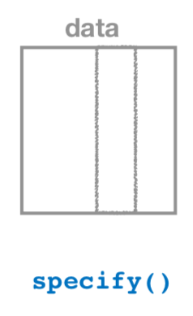
```

그림 @fig-infer-specify 에 나타낸 바와 같이, `specify()` \index{infer!specify()} 함수는 데이터 프레임에서 어떤 변수가 통계적 추론의 초점이 될지 선택하는 데 사용됩니다. 우리는 `response` 인자를 지정하여 이를 수행합니다. 예를 들어, 은행에서 추출한 `r num_pennies`개 페니의 `pennies_sample` 데이터 프레임에서 관심 변수는 `year`입니다.

```{r}
pennies_sample %>% 
  specify(response = year)
```

데이터 자체는 변하지 않지만, `Response: year (numeric)`이라는 메타데이터(meta-data)가 어떻게 바뀌는지 주목하세요 \index{meta-data}. 이는 3.7절 @sec-groupby 에서 보았듯이 `dplyr`의 `group_by()` 동사가 데이터를 바꾸지 않고 오직 "그룹화" 메타데이터만을 추가하는 방식과 유사합니다.

또한 `formula = y ~ x` 형식을 사용하여 통계적 추론의 초점이 될 변수를 지정할 수도 있습니다. 이는 회귀 모델에 관한 5 @sec-regression 와 6 @sec-multiple-regression 에서 보았던 것과 동일한 공식 표기법입니다. 종속 변수 `y`는 독립 변수 `x`와 `~`("tilde")로 구분됩니다. `formula` 인자를 사용하여 `specify()`를 다음과 같이 사용하는 것도 이전과 동일한 결과를 냅니다.

```{r, eval=FALSE}
pennies_sample %>% 
  specify(formula = year ~ NULL)
```

페니의 경우 종속 변수만 있고 관심 있는 독립 변수가 없으므로, `~`의 오른쪽에 있는 `x`를 `NULL`로 설정합니다.

페니의 예제에서는 두 가지 지정 방식 모두 잘 작동하지만, 나중에 `formula` 지정 방식이 더 간단한 예제들을 보게 될 것입니다. 특히 두 비율을 비교하는 8.6절 @sec-case-study-two-prop-ci 과 회귀 추론에 관한 8.7절 @sec-infer-regression 에서 이 방식이 등장합니다.


#### 2. 복제본 `generate` 생성하기 {-}

```{r infer-generate, out.width="60%", out.height="60%", echo=FALSE, fig.cap="generate 복제본 다이어그램.", purl=FALSE}
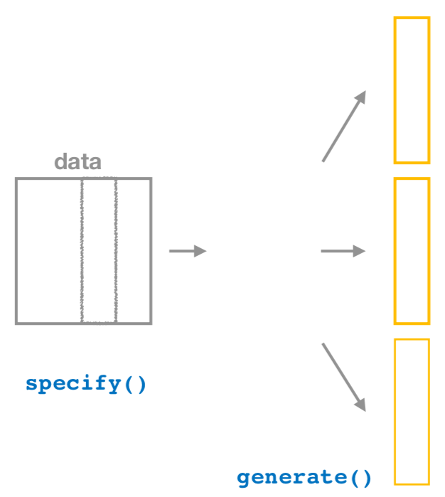
```

관심 변수를 `specify()`한 후, 결과를 `generate()` 함수로 전달하여 복제본을 생성합니다. 그림 @fig-infer-generate 는 파이프라인을 시작하기 위해 이것이 어떻게 `specify()`와 결합되는지를 보여줍니다. 즉, 재표본 추출 과정을 아주 많이 반복하는 것입니다. 하위 @sec-bootstrap-35-replicates 절와 @sec-bootstrap-1000-replicates 에서 우리는 이를 `r n_resample_friends`번과 `r n_virtual_resample`번 수행했다는 점을 상기하세요.

`generate()` \index{infer!generate()} 함수의 첫 번째 인자는 `reps`이며, 우리가 생성하고자 하는 복제본의 수를 설정합니다. `pennies_sample`에 있는 `r num_pennies`개의 페니를 복원 재표본 추출로 `r n_virtual_resample`번 수행하고 싶으므로, `reps = `r n_virtual_resample` `로 설정합니다. 두 번째 인자인 `type`은 수행하고자 하는 컴퓨터 시뮬레이션의 유형을 결정합니다. 우리는 붓스트랩 재표본 추출을 수행하고자 함을 나타내는 `type = "bootstrap"`으로 설정합니다. `type`에 대한 다른 옵션들은 9 @sec-hypothesis-testing 에서 살펴볼 것입니다.

```{r eval=FALSE}
pennies_sample %>% 
  specify(response = year) %>% 
  generate(reps = 1000, type = "bootstrap")
```

```{r echo=FALSE, purl=FALSE}
if (!file.exists("rds/pennies_sample_generate.rds")) {
  pennies_sample_generate <- pennies_sample %>%
    specify(response = year) %>%
    generate(reps = 1000, type = "bootstrap")
  write_rds(pennies_sample_generate, "rds/pennies_sample_generate.rds")
} else {
  pennies_sample_generate <- read_rds("rds/pennies_sample_generate.rds")
}
pennies_sample_generate
```

결과로 생성된 데이터 프레임이 `r (num_pennies * n_virtual_resample) %>% comma()`개의 행을 가진다는 점에 주목하세요. 이는 `r num_pennies`개 페니의 복원 재표본 추출을 `r n_virtual_resample`번 수행했기 때문이며, `r (num_pennies * n_virtual_resample) %>% comma()` = `r num_pennies` $\cdot$ `r n_virtual_resample`입니다.

`replicate` 변수는 각 행이 어느 재표본에 속하는지를 나타냅니다. 따라서 값 `1`이 `r num_pennies`번, 값 `2`가 `r num_pennies`번, 이런 식으로 값 `r n_virtual_resample`이 `r num_pennies`번 나타납니다. 이 시나리오에서 `type` 인자의 기본값은 `"bootstrap"`이므로, 마지막 줄이 `generate(reps = `r n_virtual_resample`)`로 작성되었더라도 동일한 결과를 얻었을 것입니다.

기존 워크플로우와 비교: 지금까지의 `infer` 워크플로우 단계는 앞서 보았던 `rep_sample_n()` 함수를 사용한 기존 워크플로우와 동일한 결과를 생성한다는 점에 주목하세요. 즉, 다음 두 코드 청크는 유사한 결과를 냅니다.

```{r eval=FALSE, purl=FALSE}
# infer 워크플로우:                 # 기존 워크플로우:
pennies_sample %>%                  pennies_sample %>% 
  specify(response = year) %>%        rep_sample_n(size = 50, replace = TRUE, 
  generate(reps = 1000)                            reps = 1000              
             
```


#### 3. 요약 통계량 `calculate` (계산하기 {-}

```{r infer-calculate, out.width="80%", out.height="80%", echo=FALSE, fig.cap="calculate( 요약 통계량 다이어그램.", purl=FALSE}
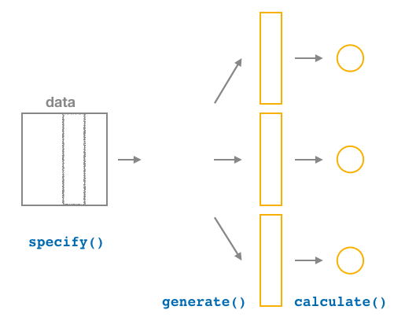
```

복원 붓스트랩 재표본 추출의 많은 복제본을 `generate()`한 후, 다음으로 우리는 각각의 크기가 `r num_pennies`인 `r n_virtual_resample`개의 재표본을 단일 표본 통계량 값으로 요약하고자 합니다. 다이어그램에서 보듯이, `calculate()` \index{infer!calculate()} 함수가 이 역할을 합니다.


우리의 경우, 크기가 `r num_pennies`인 각 붓스트랩 재표본에 대해 평균 `year`를 계산하고자 합니다. 이를 위해 `stat` 인자를 `"mean"`으로 설정합니다. `stat` 인자를 `"median"`, `"sum"`, `"sd"`(표준 편차), `"prop"`(비율)과 같은 다양한 다른 공통 요약 통계량으로 설정할 수도 있습니다. 사용할 수 있는 모든 요약 통계량 목록을 보려면 `?calculate`를 입력하고 도움말 파일을 읽어보세요.

결과를 `bootstrap_distribution`이라는 이름의 데이터 프레임에 저장하고 그 내용을 살펴보겠습니다.

```{r eval=FALSE}
bootstrap_distribution <- pennies_sample %>% 
  specify(response = year) %>% 
  generate(reps = 1000) %>% 
  calculate(stat = "mean")
bootstrap_distribution
```

```{r echo=FALSE, purl=FALSE}
if (!file.exists("rds/bootstrap_distribution_pennies.rds")) {
  bootstrap_distribution <- pennies_sample %>%
    specify(response = year) %>%
    generate(reps = 1000) %>%
    calculate(stat = "mean")
  write_rds(bootstrap_distribution, "rds/bootstrap_distribution_pennies.rds")
} else {
  bootstrap_distribution <- read_rds("rds/bootstrap_distribution_pennies.rds")
}
bootstrap_distribution
```

결과 데이터 프레임이 `r n_virtual_resample`개의 행과 `r n_virtual_resample`개의 `replicate` 값에 해당하는 2개의 열을 가진다는 점에 주목하세요. 각 붓스트랩 재표본에 대한 표본 평균 연도는 `stat` 변수에 저장됩니다.

기존 워크플로우와 비교: 이 시점에서 여러분은 `infer` 워크플로우의 `calculate()` 단계가 기존 워크플로우의 `group_by(replicate) %>% summarize()` 단계와 동일한 출력을 생성한다는 것을 알아차렸을 수도 있습니다.

```{r eval=FALSE, purl=FALSE}
# infer 워크플로우:                 # 기존 워크플로우:
pennies_sample %>%                  pennies_sample %>% 
  specify(response = year) %>%        rep_sample_n(size = 50, replace = TRUE, 
  generate(reps = 1000) %>%                        reps = 1000 %>%              
  calculate(stat = "mean")            group_by(replicate) %>% 
                                      summarize(stat = mean(year))
```


#### 4. 결과 `visualize` (시각화하기 {-}

```{r infer-visualize, out.width="70%", echo=FALSE, fig.cap="visualize( 결과 다이어그램.", purl=FALSE}
knitr::include_graphics("images/flowcharts/infer/visualize.png")
```

`visualize()` \index{infer!visualize()} 동사는 수치형 `stat` 변수값들의 히스토그램으로 붓스트랩 분포를 시각화하는 빠른 방법을 제공합니다. 붓스트랩 분포 결과를 탐색하는 데 사용되는 주요 `infer` 동사들의 파이프라인은 그림 @fig-infer-visualize 에 나타나 있습니다.

```{r eval=FALSE}
visualize(bootstrap_distribution)
```

```{r boostrap-distribution-infer, echo=FALSE, fig.show="hold", fig.cap="붓스트랩 분포.", purl=FALSE}
# Null이 항상 표시되지 않도록 {infer} 패키지를 약간 수정해야 할 것입니다 (2019-10-26에 `develop` 브랜치에 추가됨).
visualize(bootstrap_distribution) #+
#  ggtitle("Simulation-Based Bootstrap Distribution")
```

기존 워크플로우와 비교: 사실 `visualize()`는 `geom_histogram()` 레이어를 사용하는 `ggplot()` 함수의 래퍼 함수(wrapper function)입니다. 우리는 하위 @sec-model1table 절의 그림 @fig-moderndive-figure-wrapper 에서 래퍼 함수의 개념을 설명했음을 상기하세요.

```{r eval=FALSE, purl=FALSE}
# infer 워크플로우:                  # 기존 워크플로우:
visualize(bootstrap_distribution    ggplot(bootstrap_distribution, 
                                            aes(x = stat) +
                                       geom_histogram()
```

`visualize()` 함수는 나중에 살펴보겠지만 그래프를 더 세밀하게 사용자 정의할 수 있는 많은 다른 인자들을 받을 수 있습니다. 또한 신뢰 구간 값에 해당하는 히스토그램 영역에 색을 칠하는 헬퍼 함수들과도 함께 작동합니다.

그림 @fig-infer-workflow-ci 에서 붓스트랩 분포를 구축하고 시각화하는 `infer` 워크플로우의 단계들을 요약해 보겠습니다.

```{r infer-workflow-ci, out.width="100%", echo=FALSE, fig.cap="신뢰 구간 구축을 위한 infer 패키지 워크플로우.", purl=FALSE}
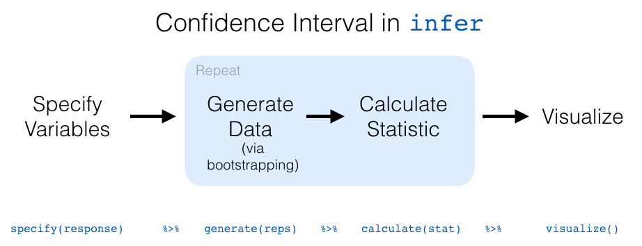
```

 @sec-ci-build-up 절에서 알려지지 않은 모수에 대한 95% 신뢰 구간을 구축하는 두 가지 서로 다른 방법인 백분위수 방법과 표준 오차 방법을 소개했음을 상기하세요. 이제 이러한 방법들을 명시적으로 구축하는 `infer` 패키지 코드를 확인해 보겠습니다. `infer` 패키지에는 결과 신뢰 구간을 시각화하는 추가적인 유용한 함수들도 내장되어 있습니다!


### `infer`를 사용한 백분위수 방법 {#percentile-method-infer}

하위 @sec-percentile-method 절에서 소개한 95% 신뢰 구간 구축을 위한 백분위수 방법을 상기하세요. 이 방법은 신뢰 구간의 하한을 붓스트랩 분포의 2.5번째 백분위수로 설정하고, 마찬가지로 상한을 97.5번째 백분위수로 설정합니다. 결과 구간은 붓스트랩 분포에 있는 표본 평균 값들의 중앙 95%를 포착합니다.

우리는 `bootstrap_distribution`을 `infer` 패키지의 `get_confidence_interval()` \index{infer!get\_confidence\_interval()} 함수로 전달하고 신뢰 `level`을 0.95로, 신뢰 구간 `type`을 `"percentile"`로 설정하여 95% 신뢰 구간을 계산할 수 있습니다. 결과를 `percentile_ci`에 저장해 보겠습니다.

```{r}
percentile_ci <- bootstrap_distribution %>% 
  get_confidence_interval(level = 0.95, type = "percentile")
percentile_ci
```

또는 `bootstrap_distribution` 데이터 프레임을 `visualize()` 함수로 전달하고 `shade_confidence_interval()` \index{infer!shade\_confidence\_interval()} 레이어를 추가하여 구간 (`r percentile_ci$lower_ci  %>% round(2)`, `r percentile_ci$upper_ci  %>% round(2)`)을 시각화할 수 있습니다. `endpoints` 인자를 `percentile_ci`로 설정합니다.

```{r eval=FALSE}
visualize(bootstrap_distribution) + 
  shade_confidence_interval(endpoints = percentile_ci)
```


(ref:perc-ci-viz) 잠재적 값들에 해당하는 백분위수 방법 95% 신뢰 구간이 색칠된 모습.

```{r percentile-ci-viz, echo=FALSE, fig.cap="(ref:perc-ci-viz)", purl=FALSE, fig.height=3}
# Null이 항상 표시되지 않도록 {infer} 패키지를 약간 수정해야 할 것입니다 (2019-10-26에 `develop` 브랜치에 추가됨).
if (knitr::is_html_output()) {
  visualize(bootstrap_distribution) +
    shade_confidence_interval(endpoints = percentile_ci) #+
  #  ggtitle("Simulation-Based Bootstrap Distribution")
} else {
  visualize(bootstrap_distribution) +
    shade_confidence_interval(
      endpoints = percentile_ci,
      fill = "grey40", color = "grey30"
    ) #+
  #  ggtitle("Simulation-Based Bootstrap Distribution")
}
```

그림 @fig-percentile-ci-viz 에서 `bootstrap_distribution`의 `stat` 변수에 저장된 표본 평균 중 95%가 더 어두운 선으로 표시된 두 끝점 사이에 위치하며, 표본 평균의 2.5%는 색칠된 영역의 왼쪽에, 2.5%는 오른쪽에 위치한다는 것을 알 수 있습니다. 또한 `color` 및 `fill` 인자를 사용하여 색칠된 영역의 색상을 변경할 수도 있습니다.

더 짧은 이름의 함수인 `shade_ci()`를 사용할 수도 있으며 결과는 동일합니다. 이는 `confidence_interval`을 다 입력하고 싶지 않고 대신 `ci`라고 입력하는 것을 선호하는 분들을 위한 것입니다. 다음 코드를 사용해 보세요!

```{r eval=FALSE}
visualize(bootstrap_distribution) + 
  shade_ci(endpoints = percentile_ci, color = "hotpink", fill = "khaki")
```


### `infer`를 사용한 표준 오차 방법 {#infer-se}

하위 @sec-se-method 절에서 소개한 95% 신뢰 구간 구축을 위한 표준 오차 방법을 상기하세요. 정규 분포를 따르는 모든 분포의 경우, 약 95%의 값이 평균의 표준 편차 2배 내에 위치합니다. 붓스트랩 분포의 경우, 표준 편차는 표준 오차(standard error)라는 특별한 이름을 가집니다.

따라서 우리의 경우, 붓스트랩 분포 값의 95%가 $\overline{x}$의 표준 오차 $\pm `r qnorm(0.975) %>% round(2)`$배 내에 위치하게 됩니다. 따라서 95% 신뢰 구간은 다음과 같습니다.

$$\overline{x} \pm `r qnorm(0.975) %>% round(2)` \cdot SE = (\overline{x} - `r qnorm(0.975) %>% round(2)` \cdot SE, \, \overline{x} + `r qnorm(0.975) %>% round(2)` \cdot SE).$$

95% 신뢰 구간의 계산은 우리가 만든 `bootstrap_distribution` 데이터 프레임을 `get_confidence_interval()` 함수로 전달하여 다시 한번 수행할 수 있습니다. 하지만 이번에는 먼저 `type` 인자를 `"se"`로 설정합니다. 둘째, 신뢰 구간의 중심을 설정하기 위해 `point_estimate` 인자를 지정해야 합니다. 우리는 이를 앞서 저장한 `r num_pennies`개 페니의 원래 표본 평균인 `r x_bar_point <- x_bar %>% pull(mean_year) %>% round(2); x_bar_point`로 설정하며, 이 값은 `x_bar`에 저장되어 있습니다.

```{r}
standard_error_ci <- bootstrap_distribution %>% 
  get_confidence_interval(type = "se", point_estimate = x_bar)
standard_error_ci
```


구간 (`r standard_error_ci$lower_ci  %>% round(2)`, `r standard_error_ci$upper_ci  %>% round(2)`)을 시각화하고 싶다면, 다시 한번 `bootstrap_distribution` 데이터 프레임을 `visualize()` 함수로 전달하고 그래프에 `shade_confidence_interval()` 레이어를 추가할 수 있습니다. `endpoints` 인자를 `standard_error_ci`로 설정합니다. 결과로 나오는 $\mu$에 대한 표준 오차 방법 기반 95% 신뢰 구간은 그림 @fig-se-ci-viz 에서 확인할 수 있습니다.

(ref:se-viz) 표준 오차 방법 95% 신뢰 구간.

```{r eval=FALSE}
visualize(bootstrap_distribution) + 
  shade_confidence_interval(endpoints = standard_error_ci)
```

```{r se-ci-viz, echo=FALSE, fig.show="hold", fig.cap="(ref:se-viz)", purl=FALSE, fig.height=3.4}
# Null이 항상 표시되지 않도록 {infer} 패키지를 약간 수정해야 할 것입니다.
# (2019-10-26에 `develop` 브랜치에 추가됨)

if (knitr::is_html_output()) {
  visualize(bootstrap_distribution) +
    shade_confidence_interval(endpoints = standard_error_ci) #+
  #    ggtitle("Simulation-Based Bootstrap Distribution")
} else {
  visualize(bootstrap_distribution) +
    shade_confidence_interval(
      endpoints = standard_error_ci,
      fill = "grey40", color = "grey30"
    ) #+
  #    ggtitle("Simulation-Based Bootstrap Distribution")
}
```

 @sec-ci-build-up 절에서 언급했듯이, 두 방법 모두 유사한 신뢰 구간을 생성합니다.

* 백분위수 방법: (`r percentile_ci$lower_ci  %>% round(2)`, `r percentile_ci$upper_ci  %>% round(2)`)
* 표준 오차 방법: (`r standard_error_ci$lower_ci  %>% round(2)`, `r standard_error_ci$upper_ci  %>% round(2)`)

```{block, type="learncheck", purl=FALSE}
\vspace{-0.15in}
_학습 확인_
\vspace{-0.1in}
```

`r paste0("(LC", chap, ".", (lc <- lc + 1), ")")` *모든* 미국 페니의 발행 연도 중앙값(median)에 대해 95% 신뢰 구간을 구축해 보세요. 백분위수 방법을 사용하고, 적절하다면 표준 오차 방법도 사용해 보세요.

```{block, type="learncheck", purl=FALSE}
\vspace{-0.25in}
\vspace{-0.25in}
```


## 신뢰 구간의 해석 {#sec-one-prop-ci}

이제 모집단에서 추출한 표본을 사용하여 신뢰 구간을 구축하는 방법을 보여드렸으므로, 이제 그 효과를 해석하는 방법에 집중해 보겠습니다. 신뢰 구간의 효과는 그것이 모수의 실제 값을 포함하는지 여부로 판단됩니다. @sec-ci-build-up 절의 낚시 비유로 돌아가면, 이는 "우리의 그물이 물고기를 잡았는가?"라고 묻는 것과 같습니다.

예를 들어, 우리가 구한 백분위수 기반 신뢰 구간인 (`r percentile_ci$lower_ci  %>% round(2)`, `r percentile_ci$upper_ci  %>% round(2)`)이 *모든* 미국 페니의 실제 평균 연도 $\mu$를 "포착"했을까요? 안타깝게도 우리는 절대 알 수 없습니다. 왜냐하면 $\mu$의 실제 값이 무엇인지 모르기 때문입니다. 결국, 우리는 그것을 추정하기 위해 표본을 추출하는 것이니까요!

신뢰 구간의 효과를 해석하기 위해서는 모수의 값이 얼마인지 알아야 합니다. 그래야만 신뢰 구간이 이 값을 "포착"했는지 여부를 말할 수 있습니다.

6 @sec-sampling 의 샘플링 그릇 예제를 다시 살펴보겠습니다. 그릇에 담긴 `r nrow(bowl)`개의 공 중 빨간색 공의 비율은 얼마일까요? 이를 계산해 보겠습니다.

```{r}
bowl %>% 
  summarize(p_red = mean(color == "red"))
```
```{r, echo=FALSE, purl=FALSE}
p_red <- bowl %>%
  summarize(prop_red = mean(color == "red")) %>%
  pull(prop_red)

# 이 코드는 동적인 인라인 텍스트 출력을 위해 사용됩니다.
n_friend_groups <- 33L
```

이 경우, 우리는 모수의 값이 얼마인지 알고 있습니다. 모집단 비율 $p$가 `r p_red`라는 것을 알고 있습니다. 다시 말해, 그릇에 담긴 공의 `r p_red*100`%가 빨간색임을 알고 있습니다.

하위 @sec-moral-of-the-story 절에서 언급했듯이, 샘플링 그릇 연습은 실제 생활에서 샘플링이 어떻게 수행되는지를 그대로 반영하는 것이 아니라 이상화된(idealized) 활동이었습니다. 실제 생활에서는 모집단 모수의 실제 값을 알 수 없으므로 추정이 필요합니다.

이제 6 @sec-sampling 에서 그릇으로부터 표본을 추출했던 `r n_friend_groups`개 그룹의 친구들 표본을 사용하여 $p$에 대한 신뢰 구간을 구축해 보겠습니다. 그런 다음 우리가 `r p_red * 100`%라는 것을 알고 있는 $p$의 실제 값을 신뢰 구간이 "포착"했는지 확인해 보겠습니다. 즉, "그물이 물고기를 잡았는가?"를 확인하는 것입니다.


### 그물이 물고기를 잡았는가? {#sec-ilyas-yohan}

친구가 각각 그릇에서 크기가 `r n_balls_sample`인 표본을 추출한 다음 빨간색 공의 표본 비율 $\widehat{p}$를 계산하게 했던 것을 상기하세요. 그 결과 $p$에 대한 `r n_friend_groups`개의 추정치가 만들어졌습니다. `moderndive` 패키지의 `bowl_sample_1` 데이터 프레임에 저장된 일리아스(Ilyas)와 요한(Yohan)의 표본에 집중해 보겠습니다.

```{r}
bowl_sample_1
```

```{r echo=FALSE, purl=FALSE}
# 이 코드는 동적인 인라인 텍스트 출력을 위해 사용됩니다.
obs_red <- 21L
```

그들은 `r n_balls_sample`개 중 `r obs_red`개의 빨간색 공을 관찰했으므로, 그들의 표본 비율 $\widehat{p}$는 `r obs_red`/`r n_balls_sample` = `r obs_red / n_balls_sample` = `r (obs_red / n_balls_sample) * 100`\%였습니다. 이것을 우리 낚시 비유의 "작살"이라고 생각하십시오.

이제 하위 @sec-infer-workflow 절의 `infer` 패키지 워크플로우를 따라 일리아스와 요한의 표본을 사용하여 $p$에 대한 백분위수 방법 기반 95% 신뢰 구간을 만들어 보겠습니다. 이것을 "그물"이라고 생각하십시오.


#### 1. 변수 `specify` (지정하기 {-}

먼저, 관심 있는 종속 변수 `color`를 `specify()`합니다.


```{r, eval=FALSE}
bowl_sample_1 %>% 
  specify(response = color)
```
```
Error: A level of the response variable `color` needs to be specified for the `success`
argument in `specify()`.
```

이런! 어떤 사건이 관심 대상인지 정의해야 합니다. 빨간색 공(red)인가요, 아니면 하얀색 공(white)인가요? 우리는 빨간색의 비율에 관심이 있으므로 `success`를 `"red"`로 설정하겠습니다.

```{r}
bowl_sample_1 %>% 
  specify(response = color, success = "red")
```


#### 2. 복제본 `generate` 생성하기 {-}

둘째, `reps = `r n_virtual_resample` ` 및 `type = "bootstrap"`으로 설정하여 `bowl_sample_1`으로부터 `r n_virtual_resample`번의 복원 붓스트랩 재표본 복제본을 `generate()`합니다.

```{r eval=FALSE}
bowl_sample_1 %>% 
  specify(response = color, success = "red") %>% 
  generate(reps = 1000, type = "bootstrap")
```
```{r echo=FALSE, purl=FALSE}
if (!file.exists("rds/bowl_sample_1_generate.rds")) {
  bowl_sample_1_generate <- bowl_sample_1 %>%
    specify(response = color, success = "red") %>%
    generate(reps = 1000, type = "bootstrap")
  write_rds(
    bowl_sample_1_generate,
    "rds/bowl_sample_1_generate.rds"
  )
} else {
  bowl_sample_1_generate <- read_rds("rds/bowl_sample_1_generate.rds")
}
bowl_sample_1_generate
```

결과 데이터 프레임이 `r (n_balls_sample * n_virtual_resample) %>% comma()`개의 행을 가진다는 점에 주목하세요. 이는 `r n_balls_sample`개 공의 복원 재표본 추출을 `r n_virtual_resample`번 수행했기 때문이며, 따라서 `r (n_balls_sample * n_virtual_resample) %>% comma()` = `r n_balls_sample` $\cdot$ `r n_virtual_resample`입니다. `replicate` 변수는 각 행이 어느 재표본에 속하는지를 나타냅니다. 따라서 값 `1`이 `r n_balls_sample`번, 값 `2`가 `r n_balls_sample`번, 이런 식으로 값 `r n_virtual_resample`이 `r n_balls_sample`번 나타납니다.


#### 3. 요약 통계량 `calculate` 계산하기 {-}

셋째, 크기가 `r n_balls_sample`인 `r n_virtual_resample`개의 재표본 각각을 성공(successes)의 비율로 요약합니다. 다시 말해, 공들이 `"red"`인 비율입니다. `stat` 인자를 `"prop"`으로 설정하여 계산될 요약 통계량을 비율로 설정할 수 있습니다. 결과를 `sample_1_bootstrap`으로 저장해 보겠습니다.

```{r eval=FALSE}
sample_1_bootstrap <- bowl_sample_1 %>% 
  specify(response = color, success = "red") %>% 
  generate(reps = 1000, type = "bootstrap") %>% 
  calculate(stat = "prop")
sample_1_bootstrap
```

```{r calculate_prop, echo=FALSE, purl=FALSE}
# 실행하는 데 몇 분 정도 걸립니다.
if (!file.exists("rds/sample_1_bootstrap.rds")) {
  sample_1_bootstrap <- bowl_sample_1_generate %>%
    calculate(stat = "prop")
  write_rds(sample_1_bootstrap, "rds/sample_1_bootstrap.rds")
} else {
  sample_1_bootstrap <- read_rds("rds/sample_1_bootstrap.rds")
}
sample_1_bootstrap
```

이 데이터 프레임에는 `r n_virtual_resample`개의 행이 있으므로 `stat` 변수도 `r n_virtual_resample`개의 값을 가집니다. 이 `r n_virtual_resample`개의 `stat` 값들은 각각 서로 다른 재표본에 기초하여 복제된 비율 값들을 나타냅니다.


#### 4. 결과 `visualize` 시각화하기 {-}

넷째이자 마지막으로, 결과로 나오는 95% 신뢰 구간을 계산해 보겠습니다.

```{r}
percentile_ci_1 <- sample_1_bootstrap %>% 
  get_confidence_interval(level = 0.95, type = "percentile")
percentile_ci_1
```

그림 @fig-shovel-bootstrap-1-infer 에서 붓스트랩 분포와 함께 $p$에 대한 `percentile_ci_1` 백분위수 방법 기반 95% 신뢰 구간을 시각화해 보겠습니다. 결과 모양을 더 잘 보기 위해 빈(bins)의 수를 조정하겠습니다. 또한 `geom_vline()`을 사용하여 일리아스와 요한이 관찰한 $\widehat{p}$ = `r obs_red`/`r n_balls_sample` = `r obs_red/n_balls_sample` = `r (obs_red/n_balls_sample)*100`\% 위치에 수직 점선을 추가하겠습니다.

```{r eval=FALSE}
sample_1_bootstrap %>% 
  visualize(bins = 15) + 
  shade_confidence_interval(endpoints = percentile_ci_1) +
  geom_vline(xintercept = 0.42, linetype = "dashed")
```

```{r shovel-bootstrap-1-infer, echo=FALSE, fig.show="hold", fig.cap="붓스트랩 분포.", fig.height=2.5, purl=FALSE}
# Will need to make a tweak to the {infer} package so that it doesn't always display "Null" here
# (added to `develop` branch on 2019-10-26)
if (knitr::is_html_output()) {
  sample_1_bootstrap %>%
    visualize(bins = 15) +
    shade_confidence_interval(endpoints = percentile_ci_1) +
    #    ggtitle("Simulation-Based Bootstrap Distribution") +
    geom_vline(xintercept = 0.42, linetype = "dashed")
} else {
  sample_1_bootstrap %>%
    visualize(bins = 15) +
    shade_confidence_interval(
      endpoints = percentile_ci_1,
      fill = "grey40", color = "grey30"
    ) +
    #    ggtitle("Simulation-Based Bootstrap Distribution") +
    geom_vline(xintercept = 0.42, linetype = "dashed")
}
```


일리아스와 요한의 그물이 물고기를 잡았나요? 그들의 표본에 기초한 $p$에 대한 95% 신뢰 구간이 실제 $p$ 값인 `r p_red`를 포함했나요? 네! `r p_red`는 그들의 신뢰 구간 끝점인 (`r percentile_ci_1$lower_ci `, `r percentile_ci_1$upper_ci ` 사이에 있습니다.

하지만 $p$에 대한 모든 95% 신뢰 구간이 이 값을 포착할까요? 달리 말해, 우리가 50개의 공으로 이루어진 다른 표본을 추출하고 다른 신뢰 구간을 구축했다면, 그것도 반드시 $p$ = `r p_red`를 포함할까요? 확인해 봅시다!

먼저 6 @sec-sampling 에서 했던 것처럼 컴퓨터를 사용하여 그릇에서 다른 표본을 추출해 보겠습니다.

```{r}
bowl_sample_2 <- bowl %>% rep_sample_n(size = 50)
bowl_sample_2
```

`bowl_sample_2`에 동일한 `infer` 함수들을 다시 적용하여 $p$에 대한 다른 95% 신뢰 구간을 생성해 보겠습니다. 먼저 새로운 붓스트랩 분포를 만들고 결과를 `sample_2_bootstrap`에 저장합니다.

```{r eval=FALSE}
sample_2_bootstrap <- bowl_sample_2 %>% 
  specify(response = color, 
          success = "red") %>% 
  generate(reps = 1000, 
           type = "bootstrap") %>% 
  calculate(stat = "prop")
sample_2_bootstrap
```

```{r echo=FALSE, purl=FALSE}
if (!file.exists("rds/sample_2_bootstrap.rds")) {
  sample_2_bootstrap <- bowl_sample_2 %>%
    specify(
      response = color,
      success = "red"
    ) %>%
    generate(
      reps = 1000,
      type = "bootstrap"
    ) %>%
    calculate(stat = "prop")
  write_rds(sample_2_bootstrap, "rds/sample_2_bootstrap.rds")
} else {
  sample_2_bootstrap <- read_rds("rds/sample_2_bootstrap.rds")
}
sample_2_bootstrap
```

우리는 다시 한번 $p$에 대한 백분위수 방법 기반 95% 신뢰 구간을 계산합니다.

```{r}
percentile_ci_2 <- sample_2_bootstrap %>% 
  get_confidence_interval(level = 0.95, type = "percentile")
percentile_ci_2
```

이 새로운 그물이 물고기를 잡았나요? 즉, 새로운 표본에 기초한 $p$에 대한 95% 신뢰 구간이 실제 $p$ 값인 `r p_red`를 포함하고 있나요? 이번에도 답은 '네'입니다! `r p_red`는 우리 신뢰 구간의 끝점인 (`r percentile_ci_2$lower_ci `, `r percentile_ci_2$upper_ci ` 사이에 있습니다.

이제 이 과정을 100번 더 반복해 보겠습니다. 그릇에서 100개의 가상 표본을 추출하고 100개의 95% 신뢰 구간을 구축합니다. 결과를 그림 @fig-reliable-percentile 에서 시각화해 보겠습니다. 여기서:

1. 실제 값인 $p = `r p_red`$를 수직선으로 표시합니다.
1. 100개의 95% 신뢰 구간 각각을 수평선으로 표시합니다. 이들이 바로 "그물"입니다.
1. 신뢰 구간이 수직선으로 표시된 실제 $p$ 값을 "포착"하면 수평선을 회색으로 표시합니다. 그렇지 않으면 수평선을 검은색으로 표시합니다.

(ref:reliable-perc) $p$에 대한 100개의 백분위수 방법 기반 95% 신뢰 구간.

```{r reliable-percentile, fig.cap="(ref:reliable-perc)", echo=FALSE, fig.height=4.2, purl=FALSE}
if (!file.exists("rds/balls_percentile_cis.rds")) {
  set.seed(4)

  # infer 파이프라인을 실행하는 함수
  bootstrap_pipeline <- function(sample_data) {
    sample_data %>%
      specify(formula = color ~ NULL, success = "red") %>%
      generate(reps = 1000, type = "bootstrap") %>%
      calculate(stat = "prop")
  }

  # 샘플링 데이터, 표본 비율, 모든 붓스트랩 복제본 및 percentile_ci를 포함하는 중첩된 데이터 프레임 계산
  balls_percentile_cis <- bowl %>%
    rep_sample_n(size = 50, reps = 100, replace = FALSE) %>%
    group_by(replicate) %>%
    nest() %>%
    mutate(sample_prop = map_dbl(data, ~ mean(.x$color == "red"))) %>%
    # 각 중첩된 티블에 대해 infer 파이프라인을 실행하여 붓스트랩 복제본 생성
    mutate(bootstraps = map(data, bootstrap_pipeline)) %>%
    group_by(replicate) %>%
    # 각 중첩된 요소에 대해 95% 백분위수 CI 계산
    mutate(percentile_ci = map(bootstraps, get_ci, type = "percentile", level = 0.95))

  # 출력을 rds 객체로 저장
  saveRDS(object = balls_percentile_cis, "rds/balls_percentile_cis.rds")
} else {
  balls_percentile_cis <- readRDS("rds/balls_percentile_cis.rds")
}

# 신뢰 구간이 실제 p를 포착했는지 확인
percentile_cis <- balls_percentile_cis %>%
  unnest(percentile_ci) %>%
  mutate(captured = `2.5%` <= p_red & p_red <= `97.5%`)

# 그리기!
ggplot(percentile_cis) +
  geom_segment(aes(
    y = replicate, yend = replicate, x = `2.5%`, xend = `97.5%`,
    alpha = factor(captured, levels = c("TRUE", "FALSE"))
  )) +
  # 백분위수 기반 CI의 경우 점 추정치가 반드시 중심 역할을 하는 것은 아니므로 점 추정치는 제거함
  # geom_point(aes(x = sample_prop, y = replicate, color = captured)) +
  labs(
    x = expression("빨간색 공의 비율"),
    y = "신뢰 구간 번호",
    alpha = "포착 여부"
  ) +
  geom_vline(xintercept = p_red, color = "red") +
  coord_cartesian(xlim = c(0.1, 0.7)) +
  theme_light() +
  theme(
    panel.grid.major.y = element_blank(),
    panel.grid.minor.y = element_blank(),
    panel.grid.minor.x = element_blank()
  )
```

100개의 95% 신뢰 구간 중 `r percentile_cis$captured  %>% sum()`개가 실제 값 $p = `r p_red`$를 포착했고, `r 100 - percentile_cis$captured  %>% sum()`개는 포착하지 못했습니다. 다시 말해, 우리 그물 중 `r percentile_cis$captured  %>% sum()`개는 물고기를 잡았고, `r 100 - percentile_cis$captured  %>% sum()`개는 놓쳤습니다.

이것이 바로 @sec-ci-build-up 절에서 정의한 "95% 신뢰 수준"이 의미하는 바입니다. 100개의 95% 신뢰 구간마다 우리는 95개가 $p$를 포착하고 5개가 포착하지 못할 것으로 기대(expect)합니다.

여기서 "기대한다"는 말은 장기적인 평균을 가리키는 확률적 진술입니다. 즉, 100개의 신뢰 구간마다 $p$를 포착하는 약 95개의 신뢰 구간을 관찰하게 되지만, 반드시 정확히 95개일 필요는 없습니다. 예를 들어 그림 @fig-reliable-percentile 에서는 신뢰 구간의 `r percentile_cis$captured  %>% sum()`개가 $p$를 포착했습니다.

신뢰 수준에 대한 논점을 더 강조하기 위해, 그림 @fig-reliable-percentile 과 유사한 그림을 생성해 봅시다. 하지만 이번에는 80% 표준 오차 방법 기반 신뢰 구간을 구축해 보겠습니다. 비교를 쉽게 하기 위해 x축의 척도를 그림 @fig-reliable-percentile 과 동일하게 설정하여 그림 @fig-reliable-se 에서 시각화해 보겠습니다. 또한 $p$에 대한 모든 표준 오차 방법 신뢰 구간은 각각의 점 추정치 $\widehat{p}$를 중심으로 하므로, 이 값을 각 선에 점으로 표시하겠습니다.

(ref:rel-se) 100 SE-based 80% confidence intervals for $p$ with point estimate center marked with dots.


```{r reliable-se, fig.cap="(ref:rel-se)", echo=FALSE, fig.height=6.6, purl=FALSE}
if (!file.exists("rds/balls_se_cis.rds")) {
  # 랜덤 넘버 생성기 시드 값 설정
  set.seed(9)

  # infer 파이프라인을 실행하는 함수
  bootstrap_pipeline <- function(sample_data) {
    sample_data %>%
      specify(formula = color ~ NULL, success = "red") %>%
      generate(reps = 1000, type = "bootstrap") %>%
      calculate(stat = "prop")
  }

  # 샘플링 데이터, 표본 비율, 모든 붓스트랩 복제본 및 se_ci를 포함하는 중첩된 데이터 프레임 계산
  balls_se_cis <- bowl %>%
    rep_sample_n(size = 50, reps = 100, replace = FALSE) %>%
    group_by(replicate) %>%
    nest() %>%
    mutate(sample_prop = map_dbl(data, ~ mean(.x$color == "red"))) %>%
    # 각 중첩된 티블에 대해 infer 파이프라인을 실행하여 붓스트랩 복제본 생성
    mutate(bootstraps = map(data, bootstrap_pipeline)) %>%
    group_by(replicate) %>%
    # 각 중첩된 요소에 대해 80% 표준 오차 기반 CI 계산
    mutate(se_ci = map(bootstraps, get_ci,
      type = "se", level = 0.80,
      point_estimate = sample_prop
    ))

  # 출력을 rds 객체로 저장
  saveRDS(object = balls_se_cis, "rds/balls_se_cis.rds")
} else {
  balls_se_cis <- readRDS("rds/balls_se_cis.rds")
}

# 신뢰 구간이 실제 p를 포착했는지 확인
se_cis <- balls_se_cis %>%
  unnest(se_ci) %>%
  mutate(captured = lower <= p_red & p_red <= upper)

# 그리기!
ggplot(se_cis) +
  geom_segment(aes(
    y = replicate, yend = replicate, x = lower, xend = upper,
    alpha = factor(captured, levels = c("TRUE", "FALSE"))
  )) +
  geom_point(
    aes(
      x = sample_prop, y = replicate,
      alpha = factor(captured, levels = c("TRUE", "FALSE"))
    ),
    show.legend = FALSE, size = 1
  ) +
  labs(
    x = expression("빨간색 공의 비율"), y = "신뢰 구간 번호",
    alpha = "포착 여부"
  ) +
  geom_vline(xintercept = p_red, color = "red") +
  coord_cartesian(xlim = c(0.1, 0.7)) +
  theme_light() +
  theme(
    panel.grid.major.y = element_blank(), panel.grid.minor.y = element_blank(),
    panel.grid.minor.x = element_blank()
  )
```

우리의 더 낮은 신뢰 수준을 반영하여 80% 신뢰 구간이 95% 신뢰 구간보다 좁게 나타나는 것을 관찰해 보세요. 이것을 더 작은 "그물"을 사용하는 것이라고 생각하십시오. 신뢰 구간 너비의 다른 결정 요인들은 이어지는 하위 @sec-ci-width 절에서 살펴볼 것입니다.

또한, 100개의 80% 신뢰 구간 중 `r se_cis$captured  %>% sum()`개는 인구 비율 $p$ = `r p_red`를 포착했지만, `r 100 - sum(se_cis$captured )`개는 포착하지 못했습니다. 신뢰 수준을 95%에서 80%로 낮추었기 때문에 이제 "물고기를 잡는 데" 실패한 신뢰 구간의 수가 훨씬 더 많아졌습니다.


### 정확한 해석과 요약 해석 {#sec-shorthand}

\index{confidence interval!interpretation}

다시 95% 신뢰 구간으로 주의를 돌려봅시다. 95% 신뢰 구간에 대한 엄밀하고 수학적으로 정확한 해석은 조금 장황합니다.

> 정확한 해석: 만약 우리가 표본 추출 절차를 아주 많이 반복한다면, 결과로 나오는 신뢰 구간 중 약 95%가 모집단 모수 값을 포착할 것이라고 기대한다.

이것이 우리가 그림 @fig-reliable-percentile 에서 관찰한 것입니다. 우리의 신뢰 구간 구축 절차는 95% 신뢰할 수(reliable) 있습니다. 즉, 우리의 신뢰 구간이 약 95%의 확률로 실제 모집단 모수를 포함할 것이라고 기대할 수 있습니다.

흔히 범하는 잘못된 해석은 "이 신뢰 구간이 $p$를 포함할 확률이 95%이다"라는 것입니다. 그림 @fig-reliable-percentile 을 보면, 각 신뢰 구간은 $p$를 포함하거나 포함하지 않거나 둘 중 하나입니다. 다시 말해, 확률은 1 또는 0일 뿐입니다.

그렇다면 95% 신뢰 수준이 단지 신뢰 구간 구축 절차의 신뢰도와 관련이 있을 뿐이고 주어진 신뢰 구간 자체와는 무관하다면, 주어진 신뢰 구간으로부터 어떤 통찰을 얻을 수 있을까요? 예를 들어 페니 예제로 돌아가서, $\mu$에 대한 백분위수 방법 95% 신뢰 구간은 (`r percentile_ci$lower_ci  %>% round(2)`, `r percentile_ci$upper_ci  %>% round(2)`)이었고, 표준 오차 방법 95% 신뢰 구간은 (`r standard_error_ci$lower_ci  %>% round(2)`, `r standard_error_ci$upper_ci  %>% round(2)`)이었습니다. 이 두 구간에 대해 무엇을 말할 수 있을까요?

엄밀하지 않게 말하자면, 우리는 이 구간들을 모든 미국 페니의 평균 연도 $\mu$에 대한 그럴듯한 값들의 범위에 대한 우리의 "최선의 추측"으로 생각할 수 있습니다. 이 책의 나머지 부분에서는 정확한 해석 대신 다음과 같은 요약 해석을 사용할 것입니다.

> 요약 해석: 우리는 95% 신뢰 구간이 모집단 모수 값을 포착했다고 95% "확신(confident)"한다.

"확신한다"는 단어에 따옴표를 친 이유는 95%가 우리 신뢰 구간 구축 절차의 신뢰도와 관련이 있지만, 궁극적으로 구축된 신뢰 구간이 모집단 모수를 포함한다는 것에 대한 우리의 최선의 추측임을 강조하기 위해서입니다. 다시 말해, 그것은 우리의 최선의 그물입니다.

따라서 페니 예제로 돌아가 백분위수 방법에 집중해 보면, 우리는 2019년에 유통되는 페니의 실제 평균 발행 연도가 `r percentile_ci$lower_ci  %>% round(2)`와 `r percentile_ci$upper_ci  %>% round(2)` 사이 어딘가에 있다고 95% "확신"합니다.


### 신뢰 구간의 너비 {#sec-ci-width}

이제 신뢰 구간을 해석하는 방법을 알았으므로, 신뢰 구간의 너비를 결정하는 몇 가지 요인을 살펴보겠습니다.

#### 신뢰 수준의 영향 {-}

신뢰 구간 너비를 결정하는 한 가지 요인은 미리 지정된 신뢰 수준입니다. 예를 들어 그림 @fig-reliable-percentile 과 @fig-reliable-se 에서 우리는 95%와 80% 신뢰 구간의 너비를 비교했고 95% 신뢰 구간이 더 넓음을 관찰했습니다. 신뢰 수준의 수치화는 많은 사람이 "확신한다(confident)"는 단어에서 기대하는 것과 일치해야 합니다. 우리의 최선의 추측 범위에 대해 더 확신하기 위해서는 값의 범위를 넓혀야 합니다.

이를 자세히 설명하기 위해, 8월 15일 대한민국 서울의 예상 최고 기온을 추측하고 싶다고 가정해 봅시다. 사계절이 뚜렷한 서울의 온화한 기후를 고려할 때, 최고 기온이 50&deg;F - 95&deg;F (10&deg;C - 35&deg;C 사이가 될 것이라고 어느 정도 확신하며 말할 수 있습니다. 하지만 우리가 절대적으로 확신할 수 있는 온도 범위를 원한다면, 그 범위를 더 넓혀야 할 것입니다.

갑작스러운 추위나 극심한 폭염과 같은 비정상적인 날씨의 가능성을 고려하기 위해 이 더 넓은 범위가 필요합니다. 따라서 우리가 거의 확실할 수 있는 온도 범위는 32&deg;F - 110&deg;F (0&deg;C - 43&deg;C 사이가 될 것입니다. 반면에 약간 덜 확신하는 것을 감수할 수 있다면, 이 범위를 70&deg;F - 85&deg;F (21&deg;C - 30&deg;C 사이로 좁힐 수 있습니다.

6 @sec-sampling 의 샘플링 그릇을 다시 살펴보겠습니다. 세 가지 다른 신뢰 수준(80%, 95%, 99%)에 기초한 $p$에 대한 $10 \cdot 3 = 30$개의 신뢰 구간을 비교해 봅시다.

구체적으로, 먼저 그릇에서 크기가 $n$ = `r n_balls_sample`인 30개의 서로 다른 무작위 표본을 추출할 것입니다. 그런 다음 세 가지 신뢰 수준 각각을 사용하여 10개의 백분위수 기반 신뢰 구간을 구축할 것입니다.


마지막으로, 이 구간들의 너비를 비교해 볼 것입니다. 그림 @fig-reliable-percentile-80-95-99 에서 실제 값인 $p$ = `r p_red`를 나타내는 수직선과 함께 결과 신뢰 구간들을 시각화합니다.

<!-- 
v2 TODO: perc_cis_by_level 및 percentile_cis_by_n 데이터 프레임을 moderndive 패키지에 로드하여 독자들이 탐색할 수 있도록 하는 것을 고려하십시오. 
책에 그것들을 생성하는 코드까지 포함할 필요는 없습니다.

하지만 이 과정을 재현하는 코드를 학생 친화적으로 만드는 데는 많은 노력이 필요할 것이며 이 장은 이미 상당히 커지고 있습니다. 지금은 다음을 비교하는 결과 도표만 보여줍니다:

- n=50일 때, 80% + 95% + 99% 신뢰 구간
- 95% 신뢰 수준일 때, n = 25, 50, 100에 기초한 구간
-->

```{r perc-sizes, echo=FALSE, purl=FALSE}
if (!file.exists("rds/balls_perc_cis_80_95_99.rds")) {
  set.seed(9)

  # infer 파이프라인을 실행하는 함수:
  infer_pipeline <- function(entry, ci_level) {
    entry %>%
      specify(formula = color ~ NULL, success = "red") %>%
      generate(reps = 1000, type = "bootstrap") %>%
      calculate(stat = "prop") %>%
      get_ci(level = ci_level)
  }

  # 각 중첩된 요소에 대해 80% 백분위수 CI 계산
  perc_cis_80 <- bowl %>%
    rep_sample_n(size = 50, reps = 10, replace = FALSE) %>%
    group_by(replicate) %>%
    nest() %>%
    mutate(
      percentile_ci = map(data, infer_pipeline, ci_level = 0.8),
      point_estimate = map_dbl(data, ~ mean(.x$color == "red"))
    ) %>%
    unnest(percentile_ci) %>%
    rename(lower = `10%`, upper = `90%`) %>%
    select(-data) %>%
    mutate(confidence_level = "80%")

  # 각 중첩된 요소에 대해 95% 백분위수 CI 계산
  perc_cis_95 <- bowl %>%
    rep_sample_n(size = 50, reps = 10, replace = FALSE) %>%
    group_by(replicate) %>%
    nest() %>%
    mutate(
      percentile_ci = map(data, infer_pipeline, ci_level = 0.95),
      point_estimate = map_dbl(data, ~ mean(.x$color == "red"))
    ) %>%
    unnest(percentile_ci) %>%
    rename(lower = `2.5%`, upper = `97.5%`) %>%
    select(-data) %>%
    mutate(confidence_level = "95%")

  # 각 중첩된 요소에 대해 99% 백분위수 CI 계산
  perc_cis_99 <- bowl %>%
    rep_sample_n(size = 50, reps = 10, replace = FALSE) %>%
    group_by(replicate) %>%
    nest() %>%
    mutate(
      percentile_ci = map(data, infer_pipeline, ci_level = 0.99),
      point_estimate = map_dbl(data, ~ mean(.x$color == "red"))
    ) %>%
    unnest(percentile_ci) %>%
    rename(lower = `0.5%`, upper = `99.5%`) %>%
    select(-data) %>%
    mutate(confidence_level = "99%")

  # 단일 데이터 프레임으로 결합
  percentile_cis_by_level <- bind_rows(perc_cis_80, perc_cis_95, perc_cis_99)

  # 출력을 rds 객체로 저장
  write_rds(percentile_cis_by_level, "rds/balls_perc_cis_80_95_99.rds")
} else {
  percentile_cis_by_level <- read_rds("rds/balls_perc_cis_80_95_99.rds")
}
```

<!--
v2 TODO: 다음을 포함하는 것을 고려하십시오:

`perc_cis_by_level` 데이터 프레임이 어떻게 생겼는지, 그리고 80%, 95%, 99% 수준에서 각각 추출한 10개의 서로 다른 신뢰 구간 표본이 길이 측면에서 시각적으로 어떻게 비교되는지 살펴보겠습니다. 그런 다음 신뢰 구간의 너비를 계산하기 시작할 것입니다. 그다음 세 가지 다른 수준에서 평균 및 중앙값 너비를 계산해 보겠습니다.

```{r perc-cis-level-print, eval=FALSE, echo=FALSE, purl=FALSE}
percentile_cis_by_level %>% 
  sample_n(10) %>% 
  kable(
    digits = 3,
    caption = "다양한 신뢰 수준에 따른 p에 대한 무작위로 추출된 10개의 신뢰 구간", 
    booktabs = TRUE,
    linesep = "",
    longtable = TRUE
  ) %>% 
  kable_styling(font_size = ifelse(knitr::is_latex_output(), 10, 16),
                latex_options = c("hold_position", "repeat_header"))
```

We see that the sample proportion of reds varies in the `point_estimate` column with varying `lower` and `upper` bounds as well depending on the variability of the bootstrap distribution. The width of the confidence intervals appears to increase from left to right going from 80% confidence levels to 95% and then to 99%. Let's now compute the confidence interval (CI width for each of these intervals and then get the median and mean length.
-->


(ref:many-percs) $n = `r n_balls_sample`$일 때, p에 대한 10개의 80, 95, 99% 신뢰 구간.

```{r reliable-percentile-80-95-99, fig.cap="(ref:many-percs)", echo=FALSE, fig.height=3, purl=FALSE}
sample_of_cis <- percentile_cis_by_level %>%
  group_by(confidence_level) %>%
  mutate(sample_row = 1:10)

perc_interval_plot <- ggplot(sample_of_cis) +
  # 백분위수 신뢰 구간에 대해 point_estimate 중심을 보여주는 것은 의미가 없음:
  # geom_point(aes(x = point_estimate, y = sample_row)) +
  geom_segment(aes(y = sample_row, yend = sample_row, x = lower, xend = upper)) +
  labs(x = expression("빨간색 공의 비율"), y = "") +
  scale_y_continuous(breaks = 1:10) +
  facet_wrap(~confidence_level) +
  geom_vline(xintercept = p_red, color = "red")

if (knitr::is_latex_output()) {
  perc_interval_plot +
    theme(
      strip.text = element_text(colour = "black"),
      strip.background = element_rect(fill = "grey93")
    )
} else {
  perc_interval_plot
}
```

표 @tbl-perc-cis-average-width 에서 평균 너비를 비교해 보면 알 수 있듯이, 신뢰 수준이 80%에서 95%, 99%로 높아짐에 따라 신뢰 구간이 점점 넓어지는 경향이 있음을 관찰해 보세요.

```{r perc-cis-average-width, echo=FALSE, purl=FALSE}
percentile_cis_by_level %>%
  mutate(width = upper - lower) %>%
  group_by(confidence_level) %>%
  summarize(`Mean width` = mean(width)) %>%
  rename(`신뢰 수준` = confidence_level, `평균 너비` = `Mean width`) %>%
  kbl(
    digits = 3,
    caption = "80, 95, 99% 신뢰 구간의 평균 너비",
    booktabs = TRUE,
    longtable = TRUE,
    linesep = ""
  ) %>%
  kable_styling(
    font_size = ifelse(knitr::is_latex_output(), 10, 16),
    bootstrap_options = c("striped", "hover", "condensed", "responsive"),
    latex_options = c("hold_position", "repeat_header")
  )
```

따라서 더 높은 신뢰 수준을 가지려면 신뢰 구간이 더 넓어야 합니다. 이상적으로는 높은 신뢰 수준과 좁은 신뢰 구간을 모두 원하겠지만, 두 마리 토끼를 다 잡을 수는 없습니다. 만약 우리가 더 확신하기를 원한다면, 더 넓은 구간을 허용해야 합니다. 반대로 좁은 구간을 원한다면, 더 낮은 신뢰 수준을 감수해야 합니다.

결론은 다음과 같습니다. \index{confidence interval!impact of confidence level on interval width} 더 높은 신뢰 수준은 더 넓은 신뢰 구간을 만드는 경향이 있습니다. 그림 @fig-reliable-percentile-80-95-99 를 볼 때 우리는 표본 크기를 $n$ = `r n_balls_sample`로 고정했다는 점을 기억하는 것이 중요합니다. 따라서 `bowl`에서 추출한 $10 \cdot 3 = 30$개의 무작위 표본은 모두 동일한 표본 크기를 가졌습니다. 만약 대신 서로 다른 크기의 표본을 추출한다면 어떤 일이 벌어질까요? 6장 하위 @sec-sampling-simulation 절에서 25, 50, 100개의 구멍이 있는 가상 삽을 사용해 이를 수행했던 것을 떠올려 보십시오. <!-- 다음에서 이를 자세히 살펴봅니다. -->

#### 표본 크기의 영향 {-}

이번에는 신뢰 수준을 95%로 고정하고, 표본 크기 $n$에 대해 25, 50, 100의 세 가지 다른 경우를 고려해 보겠습니다. 구체적으로, 먼저 크기가 25인 10개의 무작위 표본, 크기가 50인 10개의 무작위 표본, 크기가 100인 10개의 무작위 표본을 추출할 것입니다. 그런 다음 각 표본에 대해 95% 백분위수 기반 신뢰 구간을 구축할 것입니다. 마지막으로, 이 구간들의 너비를 비교해 볼 것입니다. 그림 @fig-reliable-percentile-n-25-50-100 에서 결과 30개의 신뢰 구간을 시각화합니다. 또한 실제 값인 $p$ = `r p_red`를 나타내는 수직선에 주목하십시오.

```{r perc-sizes-2, echo=FALSE, purl=FALSE}
if (!file.exists("rds/balls_perc_cis_n_25_50_100.rds")) {
  set.seed(9)

  # infer 파이프라인을 실행하는 함수:
  infer_pipeline <- function(entry, ci_level) {
    entry %>%
      specify(formula = color ~ NULL, success = "red") %>%
      generate(reps = 1000, type = "bootstrap") %>%
      calculate(stat = "prop") %>%
      get_ci(level = 0.95)
  }

  # 각 중첩된 요소에 대해 n=25에 기초한 95% 백분위수 CI 계산
  perc_cis_n_25 <- bowl %>%
    rep_sample_n(size = 25, reps = 10, replace = FALSE) %>%
    group_by(replicate) %>%
    nest() %>%
    mutate(
      percentile_ci = map(data, infer_pipeline),
      point_estimate = map_dbl(data, ~ mean(.x$color == "red"))
    ) %>%
    unnest(percentile_ci) %>%
    rename(lower = `2.5%`, upper = `97.5%`) %>%
    select(-data) %>%
    mutate(sample_size = "n = 25")

  # 각 중첩된 요소에 대해 n=50에 기초한 95% 백분위수 CI 계산
  perc_cis_n_50 <- bowl %>%
    rep_sample_n(size = 50, reps = 10, replace = FALSE) %>%
    group_by(replicate) %>%
    nest() %>%
    mutate(
      percentile_ci = map(data, infer_pipeline),
      point_estimate = map_dbl(data, ~ mean(.x$color == "red"))
    ) %>%
    unnest(percentile_ci) %>%
    rename(lower = `2.5%`, upper = `97.5%`) %>%
    select(-data) %>%
    mutate(sample_size = "n = 50")


  # 각 중첩된 요소에 대해 n=100에 기초한 95% 백분위수 CI 계산
  perc_cis_n_100 <- bowl %>%
    rep_sample_n(size = 100, reps = 10, replace = FALSE) %>%
    group_by(replicate) %>%
    nest() %>%
    mutate(
      percentile_ci = map(data, infer_pipeline),
      point_estimate = map_dbl(data, ~ mean(.x$color == "red"))
    ) %>%
    unnest(percentile_ci) %>%
    rename(lower = `2.5%`, upper = `97.5%`) %>%
    select(-data) %>%
    mutate(sample_size = "n = 100")

  # 단일 데이터 프레임으로 결합
  percentile_cis_by_n <- bind_rows(perc_cis_n_25, perc_cis_n_50, perc_cis_n_100) %>%
    mutate(sample_size = factor(sample_size, levels = c("n = 25", "n = 50", "n = 100")))

  # 출력을 rds 객체로 저장
  write_rds(percentile_cis_by_n, "rds/balls_perc_cis_n_25_50_100.rds")
} else {
  percentile_cis_by_n <- read_rds("rds/balls_perc_cis_n_25_50_100.rds")
}
```

(ref:rel-perc-n) $n = 25, 50, 100$일 때, p에 대한 10개의 95% 신뢰 구간.

```{r reliable-percentile-n-25-50-100, fig.cap="(ref:rel-perc-n)", echo=FALSE, fig.height=2.5, purl=FALSE}
sample_of_cis <- percentile_cis_by_n %>%
  group_by(sample_size) %>%
  mutate(sample_row = 1:10)

cis_plot <- ggplot(sample_of_cis) +
  # 백분위수 신뢰 구간에 대해 point_estimate 중심을 보여주는 것은 의미가 없음:
  # geom_point(aes(x = point_estimate, y = sample_row)) +
  geom_segment(aes(y = sample_row, yend = sample_row, x = lower, xend = upper)) +
  labs(x = expression("빨간색 공의 비율"), y = "") +
  scale_y_continuous(breaks = 1:10) +
  facet_wrap(~sample_size) +
  geom_vline(xintercept = p_red, color = "red")

if (knitr::is_latex_output()) {
  cis_plot +
    theme(
      strip.text = element_text(colour = "black"),
      strip.background = element_rect(fill = "grey93")
    )
} else {
  cis_plot
}
```

표본 크기가 점점 커짐에 따라 구축된 신뢰 구간이 점점 좁아지는 경향이 있음을 관찰해 보세요. 표 @tbl-perc-cis-average-width-2 에서 평균 너비를 비교해 봅시다.

```{r perc-cis-average-width-2, echo=FALSE, purl=FALSE}
percentile_cis_by_n %>%
  mutate(width = upper - lower) %>%
  group_by(sample_size) %>%
  summarize(`Mean width` = mean(width)) %>%
  rename(`표본 크기` = sample_size, `평균 너비` = `Mean width`) %>%
  kbl(
    digits = 3,
    caption = "$n = 25, 50, 100$에 기초한 95% 신뢰 구간의 평균 너비",
    booktabs = TRUE,
    longtable = TRUE,
    escape = FALSE,
    linesep = ""
  ) %>%
  kable_styling(
    font_size = ifelse(knitr::is_latex_output(), 10, 16),
    bootstrap_options = c("striped", "hover", "condensed", "responsive"),
    latex_options = c("hold_position", "repeat_header")
  )
```

결론은 다음과 같습니다. \index{confidence interval!impact of sample size on interval width} 표본 크기가 커질수록 신뢰 구간은 더 좁아지는 경향이 있습니다. 이것이 하위 @sec-moral-of-the-story 절에서의 핵심 메시지였음을 상기하십시오. 표본에 더 큰 삽을 사용할수록, 빨간색 공의 표본 비율 $\widehat{p}$의 변동이 줄어드는 경향이 있었습니다. 다시 말해, 우리의 추정치가 점점 더 정밀(precise)해졌습니다.

그림 @fig-comparing-sampling-distributions-3 에서 이러한 결과를 시각화했던 것을 떠올려 보십시오. 거기서 우리는 표본 크기 $n$이 25, 50, 100일 때 $\widehat{p}$에 대한 표본 분포(sampling distributions)를 비교했습니다. 또한 이러한 표본 분포의 표본 추출 변동을 표준 편차로 수치화했는데, 여기에는 특별한 이름인 표준 오차(standard error)가 붙습니다. 따라서 표본 크기가 증가함에 따라 표준 오차는 감소합니다.

사실, 표준 오차는 신뢰 구간 너비를 결정하는 또 다른 관련 요인입니다. 이후 하위 @sec-theory-ci 절에서 수학 공식을 사용하여 신뢰 구간을 구축하는 이론 기반 방법을 논의할 때 이 사실을 살펴볼 것입니다. 이러한 방법은 지금까지 우리가 사용해 온 컴퓨터 기반 방법의 대안입니다.


## 사례 연구: 하품은 전염되나요? {#sec-case-study-two-prop-ci}

이제 "하품은 전염되나요?"라는 질문에 답하기 위해 신뢰 구간에 대한 지식을 적용해 봅시다. 다른 사람이 하품하는 것을 보면 여러분도 하품을 할 가능성이 더 높아질까요? 미국 프로그램 [*Mythbusters*](http://www.discovery.com/tv-shows/mythbuilders/mythbusters-database/yawning-contagious/)의 한 에피소드에서 진행자들은 이 질문에 답하기 위해 실험을 수행했습니다. 해당 에피소드는 디스커버리 네트워크 웹사이트 [여기](https://www.discovery.com/tv-shows/mythbusters/videos/is-yawning-contagious)에서 시청할 수 있으며(미국 기준), 에피소드에 대한 자세한 정보는 [IMDb](https://www.imdb.com/title/tt0768479/)에서도 확인할 수 있습니다.

### *Mythbusters* 연구 데이터

쇼에 출연할 후보자로 생각한 50명의 성인 참가자들이 쇼 모집원과 인터뷰를 했습니다. 인터뷰에서 모집원은 하품을 하기도 하고 하지 않기도 했습니다. 참가자들은 그 후 커다란 밴에 혼자 앉아 기다리라는 요청을 받았습니다. 밴에 있는 동안 *Mythbusters* 팀은 숨겨진 카메라를 통해 참가자들이 하품을 하는지 지켜보았습니다. 실험 결과가 담긴 데이터 프레임은 `moderndive` 패키지에 포함된 `mythbusters_yawn` 데이터 프레임에서 확인할 수 있습니다. \index{moderndive!mythbusters\_yawn}

```{r}
mythbusters_yawn
```

```{r echo=FALSE, purl=FALSE}
# 이 코드는 동적인 비정적인 인라인 텍스트 출력 목적으로 사용됩니다.

```{r echo=FALSE, purl=FALSE}
n_participants <- 50L
```

변수들은 다음과 같습니다.

* `subj`: 1부터 `r n_participants`까지의 값을 가지는 참가자 ID.
* `group`: 참가자가 하품에 노출되었는지 여부를 나타내는 이진 처치(treatment) 변수. `"seed"`는 참가자가 하품에 노출되었음을 나타내고 `"control"`은 노출되지 않았음을 나타냅니다.
* `yawn`: 참가자가 최종적으로 하품을 했는지 여부를 나타내는 이진 반응(response) 변수.

교란 변수에 대한 논의 중 하위 @sec-correlation-is-not-causation 절에서 처치 변수와 반응 변수에 대해 배웠던 것을 떠올려 보십시오. \index{variables!treatment}\index{variables!response}

데이터 정리를 사용하여 네 가지 가능한 결과의 빈도를 구해 보겠습니다.

```{r}
mythbusters_yawn %>% 
  group_by(group, yawn) %>% 
  summarize(count = n())
```

먼저 하품에 노출되지 않은 `"control"` 그룹 참가자들에게 집중해 봅시다. 이런 참가자 12명은 하품을 하지 않았고, 4명은 하품을 했습니다. 따라서 하품에 노출되지 않은 16명 중 4/16 = 0.25 = 25%가 하품을 했습니다.

이제 하품에 노출된 `"seed"` 그룹 참가자들을 보면, 하품을 하지 않은 사람이 24명, 하품을 한 사람이 10명이었습니다. 따라서 하품에 노출된 34명 중 10/34 = 0.294 = 29.4%가 하품을 했습니다. 이 두 백분율을 비교하면, 하품에 노출된 참가자들이 그렇지 않은 참가자들보다 29.4% - 25% = 4.4% 더 자주 하품을 했습니다.


### 표본 추출 시나리오

하위 @sec-terminology-and-notation 절에서 공부한 표본 추출과 관련된 용어와 기호를 복습해 봅시다. 6 @sec-sampling 에서 우리의 연구 모집단(study population)은 $N$ = `r nrow(bowl)`개의 공이 들어있는 그릇이었습니다. 우리의 관심 대상인 모집단 모수(population parameter)는 이 공들 중 빨간색인 공의 모비율이었으며, 수학적으로 $p$로 표시했습니다. $p$를 추정하기 위해 우리는 삽을 사용하여 50개의 공으로 이루어진 표본을 추출하고 관련 점 추정치(point estimate)인 표본 비율 $\widehat{p}$를 계산했습니다.

여기서 연구 모집단은 누구일까요? 모든 인류일까요? *Mythbusters* 쇼를 시청하는 모든 사람일까요? 말하기 어렵습니다! 이 질문은 프로그램 진행자들이 참가자들을 어떻게 모집했는지 알아야만 답할 수 있습니다! 다시 말해, *Mythbusters*가 참가자를 모집하기 위해 사용한 표본 추출 방법(sampling methodology)\index{sampling methodology}은 무엇이었을까요? 안타깝게도 우리에게는 이 정보가 제공되지 않았습니다. 하지만 이 사례 연구의 목적을 위해, 이 프로그램의 인기를 고려하여 50명의 참가자가 모든 미국인을 대표하는 표본이라고 가정하겠습니다. 따라서 우리는 이 실험의 결과가 모든 $N$ = 3억 2,700만 미국인(2018년 인구 기준)에게 일반화될 것이라고 가정할 것입니다.

샘플링 그릇과 마찬가지로, 여기서 모집단 모수도 비율과 관련이 있습니다. 하지만 이 경우에는 모비율의 차이 $p_{seed} - p_{control}$가 될 것입니다. 여기서 $p_{seed}$는 하품에 노출되었을 때 스스로 하품을 하게 될 모든 미국인의 비율이고, $p_{control}$은 하품에 노출되지 않았음에도 여전히 스스로 하품을 하게 될 모든 미국인의 비율입니다. 이에 대응하여, *Mythbusters*의 참가자 표본에 기초한 점 추정치/표본 통계량은 표본 비율의 차이 $\widehat{p}_{seed} - \widehat{p}_{control}$가 될 것입니다. 추론을 위한 표본 추출 시나리오 표 @tbl-table-ch8 를 확장하여 최신 시나리오를 포함해 보겠습니다.

```{r table-ch8-c, echo=FALSE, message=FALSE, purl=FALSE}
# 다음 구글 문서는 CSV로 게시되고 read_csv()를 사용하여 로드됩니다:
# https://docs.google.com/spreadsheets/d/1QkOpnBGqOXGyJjwqx1T2O5G5D72wWGfWlPyufOgtkk4/edit#gid=0

if (!file.exists("rds/sampling_scenarios.rds")) {
  sampling_scenarios <- "https://docs.google.com/spreadsheets/d/e/2PACX-1vRd6bBgNwM3z-AJ7o4gZOiPAdPfbTp_V15HVHRmOH5Fc9w62yaG-fEKtjNUD2wOSa5IJkrDMaEBjRnA/pub?gid=0&single=true&output=csv" %>%
    read_csv(na = "") %>%
    slice(1:5)
  write_rds(sampling_scenarios, "rds/sampling_scenarios.rds")
} else {
  sampling_scenarios <- read_rds("rds/sampling_scenarios.rds")
}

sampling_scenarios %>%
  # 처음 두 시나리오만
  filter(Scenario <= 3) %>%
  kbl(
    caption = "추론을 위한 표본 추출 시나리오",
    booktabs = TRUE,
    escape = FALSE,
    linesep = ""
  ) %>%
  kable_styling(
    font_size = ifelse(knitr::is_latex_output(), 10, 16),
    bootstrap_options = c("striped", "hover", "condensed", "responsive"),
    latex_options = c("hold_position")
  ) %>%
  column_spec(1, width = "0.5in") %>%
  column_spec(2, width = "1.5in") %>%
  column_spec(3, width = "0.65in") %>%
  column_spec(4, width = "1.6in") %>%
  column_spec(5, width = "0.65in")
```

이것은 두 개의 독립적인 표본이 있으므로 이표본(two-sample) 추론\index{two-sample inference} 상황으로 알려져 있습니다. $n_{seed}$ = 34 및 $n_{control}$ = 16인 두 표본에 기초한 점 추정치는 다음과 같습니다.

$$
\widehat{p}_{seed} - \widehat{p}_{control} = \frac{24}{34} - \frac{12}{16} = 0.04411765 \approx 4.4\%
$$

하지만 *Mythbusters*가 이 실험을 반복했다고 가정해 봅시다. 즉, 50명의 새로운 참가자를 모집하여 34명을 하품에 노출하고 16명을 노출하지 않았다고 해봅시다. 그들이 정확히 동일한 4.4%의 추정 차이를 얻었을까요? 아마 아닐 것입니다. 다시 말하지만, 표본 추출 변동 때문입니다.

이 표본 추출 변동이 4.4%라는 그들의 추정에 어떤 영향을 미칠까요? 다시 말해, 이 표본 추출 변동을 고려할 때 이 차이에 대한 그럴듯한 값의 범위는 무엇일까요? 신뢰 구간으로 이 질문에 답할 수 있습니다! 또한 *Mythbusters*는 50명의 참가자로 구성된 단일 이표본만 가지고 있으므로, 복원 붓스트랩 재표본 추출을 사용하여 $p_{seed} - p_{control}$에 대한 95% 신뢰 구간을 구축해야 할 것입니다.

몇 가지 중요한 참고 사항이 있습니다. 첫째, `"seed"` 그룹과 `"control"` 그룹 사이의 비교가 의미가 있으려면 두 그룹이 서로 독립적(independent)이어야 합니다. 그렇지 않으면 서로의 결과에 영향을 미칠 수 있습니다. 즉, 한 참가자가 `"seed"` 또는 `"control"` 그룹에 선택되는 것이 다른 참가자가 두 그룹 중 하나에 배정되는 것에 아무런 영향을 미치지 않아야 함을 의미합니다. 예를 들어 연구 대상자로 어머니와 아이가 있다면, 그들이 반드시 같은 그룹에 속하지는 않을 것입니다. 그들은 각각 설명 변수의 두 그룹 중 하나에 무작위로 배정될 것입니다.

둘째, 차이를 구할 때 뺄셈의 순서는 일관성을 유지하고 그에 따라 해석을 맞추기만 한다면 중요하지 않습니다. 다시 말해, $\widehat{p}_{seed} - \widehat{p}_{control}$ 또는 $\widehat{p}_{control} - \widehat{p}_{seed}$ 점 추정치를 사용해도 실질적인 차이는 없으며, 단지 일관성을 유지하고 그에 따라 결과를 해석하기만 하면 됩니다.


### 신뢰 구간 구축 {#ci-build}

하위 @sec-infer-workflow 절에서 했던 것처럼, 먼저 $\widehat{p}_{seed} - \widehat{p}_{control}$에 대한 붓스트랩 분포를 구축한 다음, 이를 사용하여 $p_{seed} - p_{control}$에 대한 95% 신뢰 구간을 구축해 보겠습니다. 이번에도 `infer` 워크플로를 사용할 것입니다. 하지만 비율의 차이는 추론을 위한 새로운 시나리오이므로, 진행 과정에서 `infer` 함수에 몇 가지 새로운 인자를 사용해야 합니다.

#### 변수 `specify` 지정하기 {-}

`mythbusters_yawn` 데이터 프레임을 가져와서 다음과 같은 `y ~ x` 공식 인터페이스를 사용하여 어떤 변수가 관심 대상인지 `specify()`해 봅시다.

* 우리의 반응 변수는 `yawn`입니다. 참가자가 하품을 했는지 여부입니다. `"yes"`와 `"no"` 수준을 가집니다.
* 설명 변수는 `group`입니다. 참가자가 하품에 노출되었는지 여부입니다. `"seed"`(하품에 노출됨)와 `"control"`(노출되지 않음 수준을 가집니다.

```{r eval=FALSE}
mythbusters_yawn %>% 
  specify(formula = yawn ~ group)
```

```

```

안타깝게도 하위 @sec-ilyas-yohan 절에서와 비슷한 오류 메시지가 나타났습니다. `infer`는 범주형 변수 `yawn`의 수준 중 하나를 `success`로 정의해야 한다고 알려주고 있습니다. `success`는 우리가 빈도를 세고 비율을 계산하려는 관심 있는 이벤트로 정의한다는 것을 떠올려 보십시오. 우리가 관심 있는 것은 하품을 한 참가자(`"yes"`)인가요, 아니면 하지 않은 참가자(`"no"`)인가요? 이는 R이나 이 코드와 결과를 처음 접하는 사람에게 명확하지 않으므로, 코드의 투명성을 높이기 위해 다음과 같이 `success` 인자를 `"yes"`로 설정해야 합니다.

```{r}
mythbusters_yawn %>% 
  specify(formula = yawn ~ group, success = "yes")
```

#### 복제본 `generate` 생성하기 {-}

다음 단계는 @sec-resampling-tactile 절의 페니 활동에서 종이 조각으로 했던 것처럼 복원 붓스트랩 재표본 추출을 수행하는 것입니다. 우리는 @sec-bootstrap-process 절에서 붓스트랩 평균을 계산하고 @sec-one-prop-ci 절에서 붓스트랩 비율을 계산할 때 단일 변수에 대해 이것이 어떻게 작동하는지 보았지만, 여러 변수가 포함된 붓스트랩 작업은 아직 해보지 않았습니다.

`infer` 패키지에서 여러 변수를 사용한 붓스트랩은 각 행(row)이 잠재적으로 재표본 추출됨을 의미합니다. `mythbusters_yawn`의 처음 6행에만 집중하여 이를 살펴봅시다.

```{r}
first_six_rows <- head(mythbusters_yawn)
first_six_rows
```

이 데이터를 붓스트랩할 때, 우리는 피험자의 측정치를 여러 번 가져올 수 있습니다. 따라서 붓스트랩 표본의 새로운 행에서 `group`이 `"seed"`이고 `yawn`이 `"no"`인 항목들이 함께 있는 것을 볼 수 있습니다. 이는 `head(mythbusters_yawn)`으로 구성된 이 작은 6행 데이터 프레임에서 `dplyr`의 `sample_n()` 함수를 탐색함으로써 더 자세히 확인할 수 있습니다. `sample_n()` 함수는 이 붓스트랩 절차를 수행할 수 있으며 `infer`의 `rep_sample_n()` 함수와 비슷하지만, 반복되지 않고 복원 또는 비복원 추출을 한 번만 수행한다는 점이 다릅니다.

```{r}
first_six_rows %>% 
  sample_n(size = 6, replace = TRUE)
```

`mythbusters_yawn`의 처음 6행에서 생성된 이 붓스트랩 표본에서 일부 행이 반복되는 것을 볼 수 있습니다. 다음과 같이 수행하는 `infer`의 `generate()` 단계에서도 마찬가지입니다. 이 사실을 이용하여 우리는 `r n_virtual_resample`개의 복제본을 `generate`합니다. 즉, `r n_participants`명의 참가자를 `r n_virtual_resample`번 복원 재표본 추출합니다.

```{r eval=FALSE}
mythbusters_yawn %>% 
  specify(formula = yawn ~ group, success = "yes") %>% 
  generate(reps = 1000, type = "bootstrap")
```

```{r echo=FALSE, purl=FALSE}
if (!file.exists("rds/generate_yawn.rds")) {
  generate_yawn <- mythbusters_yawn %>%
    specify(formula = yawn ~ group, success = "yes") %>%
    generate(reps = 1000, type = "bootstrap")
  write_rds(generate_yawn, "rds/generate_yawn.rds")
} else {
  generate_yawn <- read_rds("rds/generate_yawn.rds")
}
generate_yawn
```

결과 데이터 프레임의 행 수가 `r (n_virtual_resample * n_participants) %>% comma()`개임에 주목하십시오. 이는 우리가 `r n_participants`명의 참가자를 `r n_virtual_resample`번 복원 재표본 추출했기 때문이며, `r (n_virtual_resample * n_participants) %>% comma()` = `r n_virtual_resample` $\cdot$ `r n_participants`입니다. `replicate` 변수는 각 행이 어떤 재표본에 속하는지 나타냅니다. 따라서 이 변수는 `1`이라는 값을 `r n_participants`번, `2`라는 값을 `r n_participants`번, 이런 식으로 `` `r n_virtual_resample` ``이라는 값을 `r n_participants`번 갖게 됩니다.

#### 요약 통계량 `calculate` 계산하기 {-}

복원 붓스트랩 재표본 추출의 많은 복제본을 `generate()`한 후, 다음으로 크기가 `r n_participants`인 붓스트랩 재표본들을 하나의 요약 통계량인 비율의 차이로 요약하고자 합니다. 이를 위해 `stat` 인자를 `"diff in props"`로 설정합니다.

<!-- 
Chester: {dplyr} 애호가들을 위한 도전적인 학습 확인 문제는 {infer}를 사용하지 않고 이 값들을 얻는 것입니다. double group_by()와 약간의 기술이 필요하지만, {infer}의 힘을 보지 못한 이들에게 좋은 연습이 될 수 있습니다.

Albert: 좋은 생각이야!
-->

```{r, eval=FALSE}
mythbusters_yawn %>% 
  specify(formula = yawn ~ group, success = "yes") %>% 
  generate(reps = 1000, type = "bootstrap") %>% 
  calculate(stat = "diff in props")
```
```
Error: Statistic is based on a difference; specify the `order` in which to
subtract the levels of the explanatory variable.
```

여기서 또 다른 오류가 나타납니다. 우리는 뺄셈의 순서를 지정해야 합니다. $\widehat{p}_{seed} - \widehat{p}_{control}$인가요, 아니면 $\widehat{p}_{control} - \widehat{p}_{seed}$인가요? 우리는 `order = c("seed", "control")`을 설정하여 $\widehat{p}_{seed} - \widehat{p}_{control}$이 되도록 지정합니다. `order = c("control", "seed")`로 설정할 수도 있었음에 유의하십시오. 앞서 언급했듯이, 분석 전반에 걸쳐 일관성을 유지하고 그에 따라 해석을 맞추기만 한다면 뺄셈의 순서는 중요하지 않습니다.

출력 결과를 `bootstrap_distribution_yawning` 데이터 프레임에 저장해 봅시다.

```{r eval=FALSE}
bootstrap_distribution_yawning <- mythbusters_yawn %>% 
  specify(formula = yawn ~ group, success = "yes") %>% 
  generate(reps = 1000, type = "bootstrap") %>% 
  calculate(stat = "diff in props", order = c("seed", "control"))
bootstrap_distribution_yawning
```

```{r echo=FALSE, purl=FALSE}
if (!file.exists("rds/bootstrap_distribution_yawning.rds")) {
  bootstrap_distribution_yawning <- mythbusters_yawn %>%
    specify(formula = yawn ~ group, success = "yes") %>%
    generate(reps = 1000, type = "bootstrap") %>%
    calculate(stat = "diff in props", order = c("seed", "control"))
  write_rds(
    bootstrap_distribution_yawning,
    "rds/bootstrap_distribution_yawning.rds"
  )
} else {
  bootstrap_distribution_yawning <- read_rds(
    "rds/bootstrap_distribution_yawning.rds"
  )
}
bootstrap_distribution_yawning
```


결과 데이터 프레임은 `r n_virtual_resample`개의 행과 2개의 열을 가지고 있는데, 이는 `r n_virtual_resample`개의 `replicate` ID와 각 붓스트랩 재표본의 비율 차이인 `stat`에 해당합니다.

#### 결과 `visualize` 시각화하기 {-}

그림 @fig-bootstrap-distribution-mythbusters 에서 결과인 붓스트랩 재표본 추출 분포를 `visualize()`해 봅시다. 또한 `geom_vline()` 레이어를 추가하여 0에 수직선을 그어보겠습니다.

```{r eval=FALSE}
visualize(bootstrap_distribution_yawning) +
  geom_vline(xintercept = 0)
```
```{r bootstrap-distribution-mythbusters, echo=FALSE, fig.show="hold", fig.cap="붓스트랩 분포.", purl=FALSE, fig.height=3.5}
# (2019-10-26 `develop` 브랜치에 추가됨 여기에 항상 "Null"이 표시되지 않도록 {infer} 패키지를 약간 수정해야 할 것입니다.
visualize(bootstrap_distribution_yawning) +
  #  ggtitle("Simulation-Based Bootstrap Distribution" +
  geom_vline(xintercept = 0)
```

먼저, 백분위수 방법을 사용하여 $p_{seed} - p_{control}$에 대한 95% 신뢰 구간을 계산해 보겠습니다. 즉, 중간 95%의 값을 포함하는 2.5번째와 97.5번째 백분위수를 찾는 것입니다. 이 방법은 붓스트랩 분포가 정규 분포 모양일 필요가 없음을 상기하십시오.

```{r}
bootstrap_distribution_yawning %>% 
  get_confidence_interval(type = "percentile", level = 0.95)
```
```{r include=FALSE, purl=FALSE}
myth_ci_percentile <- bootstrap_distribution_yawning %>%
  get_confidence_interval(type = "percentile", level = 0.95)
```

둘째, 붓스트랩 분포가 대략 종 모양이므로 표준 오차 방법을 사용하여 신뢰 구간을 구축할 수도 있습니다. 표준 오차 방법을 사용하여 신뢰 구간을 구축하려면 `point_estimate` 인자를 사용하여 구간의 중심을 지정해야 함을 상기하십시오. 이 경우, *Mythbusters*가 관찰한 4.4%의 표본 비율 차이로 설정해야 합니다.

또한 `generate()` 단계를 제외함으로써 `infer` 워크플로를 사용하여 이 값을 계산할 수도 있습니다. 즉, 복제본을 생성하지 않고 원래의 표본 데이터만 사용하는 것입니다. `generate()` 줄을 주석 처리하여 R이 이를 무시하도록 함으로써 이를 달성할 수 있습니다.

```{r}
obs_diff_in_props <- mythbusters_yawn %>% 
  specify(formula = yawn ~ group, success = "yes") %>% 
  # generate(reps = 1000, type = "bootstrap") %>% 
  calculate(stat = "diff in props", order = c("seed", "control"))
obs_diff_in_props
```

따라서 이 값을 `point_estimate` 인자로 입력합니다.

```{r}
myth_ci_se <- bootstrap_distribution_yawning %>% 
  get_confidence_interval(type = "se", point_estimate = obs_diff_in_props)
myth_ci_se
```

그림 @fig-bootstrap-distribution-mythbusters-CI 에서 두 신뢰 구간을 모두 시각화해 보겠습니다. 백분위수 방법 구간은 검은색 선으로, 표준 오차 방법은 회색 선으로 표시되었습니다. 두 구간이 서로 유사하다는 점을 관찰하십시오.

```{r bootstrap-distribution-mythbusters-CI, echo=FALSE, fig.show="hold", fig.cap="두 개의 95\\% 신뢰 구간: 백분위수 방법(검은색)과 표준 오차 방법(회색).", purl=FALSE}
# (2019-10-26 `develop` 브랜치에 추가됨 여기에 항상 "Null"이 표시되지 않도록 {infer} 패키지를 약간 수정해야 할 것입니다.
visualize(bootstrap_distribution_yawning) +
  ggtitle("") +
  shade_confidence_interval(
    endpoints = myth_ci_percentile, fill = NULL,
    color = "black"
  ) +
  shade_confidence_interval(
    endpoints = myth_ci_se, fill = NULL,
    color = "grey70"
  )
```


### 신뢰 구간 해석

두 신뢰 구간이 상당히 유사하므로, 백분위수 방법 신뢰 구간인 (`r myth_ci_percentile$lower_ci  %>% round(4)`, `r myth_ci_percentile$upper_ci  %>% round(4)`)에 대해서만 해석에 집중해 보겠습니다. 하위 @sec-shorthand 절에서 95% 신뢰 구간의 정확한 통계적 해석을 배웠던 것을 떠올려 보십시오. 만약 이 구축 절차를 100번 반복한다면, 우리는 약 95개의 신뢰 구간이 $p_{seed} - p_{control}$의 실제 값을 포착할 것으로 기대합니다. 다시 말해, 비슷한 사람들의 집단에서 참가자 $n$ = `r n_participants`명인 표본 100개를 수집하고 각 표본에 기초하여 100개의 신뢰 구간을 구축한다면, 그중 약 95개는 $p_{seed} - p_{control}$의 실제 값을 포함하고 약 5개는 포함하지 않을 것입니다. 이것이 약간 장황하므로 우리는 다음과 같은 요약 해석을 사용합니다. 우리는 실제 비율 차이 $p_{seed} - p_{control}$가 (`r myth_ci_percentile$lower_ci  %>% round(4)`, `r myth_ci_percentile$upper_ci  %>% round(4)` 사이에 있다고 95% "확신"합니다.

이 95% 신뢰 구간이 포함하고 있는 특별한 관심 대상인 값이 하나 있습니다. 바로 0입니다. 만약 $p_{seed} - p_{control}$가 0과 같다면, 두 그룹 사이의 하품 비율에 차이가 없음을 의미합니다. 이는 하품하는 모집원을 접하는 것이 스스로 하품을 하는지 여부에 아무런 영향을 미치지 않음을 시사합니다.

우리의 경우 95% 신뢰 구간에 0이 포함되어 있으므로, 어느 한 비율이 더 크다고 단정적으로 말할 수 없습니다. 복원 붓스트랩 재표본 `r n_virtual_resample`개 중에서 때때로 $\widehat{p}_{seed}$가 더 높았고, 따라서 하품에 노출된 사람들이 더 자주 하품을 했습니다. 다른 때에는 그 반대의 일이 일어났습니다.

반면에 95% 신뢰 구간이 완전히 0보다 크다고 가정해 봅시다. 이는 $p_{seed} - p_{control} > 0$, 다시 말해 $p_{seed} > p_{control}$임을 시사하며, 따라서 하품에 노출된 사람들이 실제로 하품을 더 자주 한다는 것을 시사하는 증거를 갖게 될 것입니다.

<!--
v2 TODO: Mythbusters 데이터의 무작위 실험 특성에 대해 이야기하기

Conclusion of sampling 장에 무작위 배정 및 무작위 실험에 대한 논의를 추가한 후 이를 다시 추가하십시오.

게다가 만약 `r n_participants`명의 참가자가 `"seed"`와 `"control"` 그룹에 무작위로 할당되었다면, 이는 하품에 노출되는 것이 하품을 *유발*하지 않는다는 것을 시사할 것입니다. 즉, 하품은 전염되지 않습니다. 하지만 참가자들이 하품에 노출될지 여부를 어떻게 할당했는지에 대한 정보를 찾을 수 없으므로, 이러한 인과적 진술을 할 수는 없습니다.
-->


## 결론 {#sec-ci-conclusion}

### 붓스트랩 분포와 표본 분포 비교 {#sec-bootstrap-vs-sampling}

표본 분포(sampling distributions)와 붓스트랩 분포(bootstrap distributions) 사이의 관계에 대해 더 이야기해 봅시다.\index{bootstrap!distribution}\index{sampling distributions}


하위 @sec-sampling-simulation 절에서 가상 삽을 사용하여 그릇(`bowl`)에서 `r n_virtual_resample`개의 가상 표본을 추출하고, 빨간색 공의 표본 비율 $\widehat{p}$의 값 `r n_virtual_resample`개를 계산한 후 히스그램으로 그 분포를 시각화했음을 상기하십시오. 이 분포를 $\widehat{p}$의 표본 분포(sampling distribution)라고 부릅니다. 또한 표본 분포의 표준 편차에는 특별한 이름인 표준 오차(standard error)가 붙습니다.

또한 우리는 이 표본 추출 활동이 실제 상황에서 표본 추출이 수행되는 방식을 반영하지 않는다는 점도 언급했습니다. 오히려 그것은 빨간색 공의 비율과 같은 추정치에 표본 추출 변동이 미치는 영향을 연구하기 위한 이상적인 버전의 표본 추출이었습니다. 하지만 실제로는 @sec-sampling-case-study 절에서 본 오바마 여론 조사처럼 가능한 한 큰 단 하나의 표본을 추출합니다. 하지만 우리가 단 하나의 표본과 그에 따른 단 하나의 추정치만 가지고 있다면, 표본 추출 변동이 추정에 미치는 영향을 어떻게 파악할 수 있을까요? 많은 표본과 그에 따른 많은 추정치가 필요하지 않을까요?

단일(single) 표본만 있는 상황에 대한 해결책은 그 표본으로부터 복원 붓스트랩 재표본 추출을 수행하는 것이었습니다. 우리는 @sec-resampling-tactile 절의 재표본 추출 활동에서 페니의 조조 연도 평균에 집중하여 이를 수행했습니다. 우리는 은행에서 가져온 원래의 페니 `r num_pennies`개 표본을 나타내는 종이 조각들을 사용했고, 모자에서 복원 추출했습니다. `r n_resample_friends`명의 친구들에게 이 활동을 수행하게 했고, 그 결과인 `r n_resample_friends`개의 표본 평균 $\overline{x}$를 그림 @fig-tactile-resampling-6 의 히스토그램으로 시각화했습니다.

이 분포를 $\overline{x}$의 붓스트랩 분포(bootstrap distribution)라고 부릅니다. 우리는 당시 붓스트랩 분포가 두 분포 모두 비슷한 모양과 비슷한 퍼짐성을 갖는다는 점에서 $\overline{x}$의 표본 분포에 대한 근사치(approximation)라고 말했습니다. \index{bootstrap!distribution!approximation of sampling distribution} 따라서 붓스트랩 분포의 표준 오차(standard error)는 표본 분포의 표준 오차에 대한 근사치로 사용될 수 있습니다.

이제 이 두 유형의 분포를 비교하여 실제로 그런지 보여 드리겠습니다. 구체적으로 다음을 비교해 보겠습니다.

1. 하위 @sec-sampling-simulation 절에서 그릇(`bowl`)으로부터 추출한 `r n_virtual_resample`개의 가상 표본에 기초한 $\widehat{p}$의 표본 분포.
1. 하위 @sec-ilyas-yohan 절에서 일리아스와 요한의 단일 표본 `bowl_sample_1`로부터 추출한 `r n_virtual_resample`개의 가상 복원 재표본에 기초한 $\widehat{p}$의 붓스트랩 분포.


#### 표본 분포 {-}

그림 @fig-sampling-distribution-part-deux 에 다시 표시된, 하위 @sec-sampling-simulation 절에서 보았던 $\widehat{p}$의 표본 분포를 구축하는 코드입니다. 하위 @sec-terminology-and-notation 절의 표본 추출과 관련된 통계 용어를 통합하여 일부 수정했습니다.

```{r,echo=FALSE}
set.seed(76)
```

```{r sampling-distribution-part-deux, fig.show="hold", fig.cap="$n = 1000$일 때 이전에 보았던 빨간색 표본 비율의 표본 분포.", fig.height=2}
# 그릇에서 크기가 50인 가상 표본 1000개를 추출합니다:
virtual_samples <- bowl %>% 
  rep_sample_n(size = 50, reps = 1000)
# p-hat의 1000개 값에 대한 표본 분포를 계산합니다:
sampling_distribution <- virtual_samples %>% 
  group_by(replicate) %>% 
  summarize(red = sum(color == "red")) %>% 
  mutate(prop_red = red / 50)
# p-hat의 표본 분포를 시각화합니다:
ggplot(sampling_distribution, aes(x = prop_red)) +
  geom_histogram(binwidth = 0.05, boundary = 0.4, color = "white") +
  labs(x = "50개의 공 중 빨간색 공의 비율", 
       title = "표본 분포")
```

`rep_sample_n()`을 사용할 때 `replace`의 기본값이 `FALSE`라는 점을 기억하는 것이 중요합니다. 삽으로 `r n_balls_sample`개의 공을 무작위로 추출할 때, 우리는 공을 하나씩 복원하지 않고 `r n_balls_sample`개를 추출하기 때문입니다. 이는 공을 하나 뽑고 다시 넣는 과정을 `r n_balls_sample`번 반복하는 복원 붓스트랩 재표본 추출과 대조됩니다.

표본 비율 $\widehat{p}$의 `r n_virtual_resample`개 값을 나타내는 `prop_red` 변수의 표준 편차를 계산하여 이 표본 분포의 변동성을 수치화해 보겠습니다. 표본 분포의 표준 편차는 표준 오차이며 흔히 `se`로 표시됨을 기억하십시오.

```{r}
sampling_distribution %>% summarize(se = sd(prop_red))
```
```{r, echo=FALSE, purl=FALSE}
se_samp <- sampling_distribution %>%
  summarize(se = sd(prop_red)) %>%
  pull(se)
```

#### 붓스트랩 분포 {-}

`bowl_sample_1`에 저장된 일리아스와 요한의 원래 `r n_balls_sample`개 공 표본에 기초하여 $\widehat{p}$의 붓스트랩 분포를 구축하는, 하위 @sec-ilyas-yohan 절에서 보았던 코드입니다.

```{r,echo=FALSE}
set.seed(76)
```

```{r eval=FALSE}
bootstrap_distribution <- bowl_sample_1 %>% 
  specify(response = color, success = "red") %>% 
  generate(reps = 1000, type = "bootstrap") %>% 
  calculate(stat = "prop")
```

```{r echo=FALSE, purl=FALSE}
if (!file.exists("rds/bootstrap_distribution_balls.rds")) {
  bootstrap_distribution <- bowl_sample_1 %>%
    specify(response = color, success = "red") %>%
    generate(reps = 1000, type = "bootstrap") %>%
    calculate(stat = "prop")
  write_rds(
    bootstrap_distribution,
    "rds/bootstrap_distribution_balls.rds"
  )
} else {
  bootstrap_distribution <- read_rds("rds/bootstrap_distribution_balls.rds")
}
```

```{r bootstrap-distribution-part-deux, echo=FALSE, fig.show="hold", fig.cap="$n = 1000$일 때 빨간색 비율의 붓스트랩 분포.", purl=FALSE, fig.height=2.5}
# p-hat의 붓스트랩 분포를 시각화합니다:
bootstrap_distribution %>%
  visualize(binwidth = 0.05, boundary = 0.4, color = "white") +
  labs(
    x = "50개의 공 중 빨간색 공의 비율",
    title = "붓스트랩 분포"
  )
```

```{r}
bootstrap_distribution %>% summarize(se = sd(stat))
```
```{r, echo=FALSE, purl=FALSE}
se_boot <- bootstrap_distribution %>%
  summarize(se = sd(stat)) %>%
  pull(se)
```

#### 비교 {-}

표본 분포와 붓스트랩 분포를 모두 계산했으므로, 이제 그림 @fig-side-by-side 에서 두 분포를 나란히 비교해 보겠습니다. 더 잘 비교할 수 있도록 두 히스토그램의 x축과 y축 눈금을 맞추겠습니다. 또한 다음을 추가하겠습니다:

1. 상단의 표본 분포: 그릇 속의 빨간색 공 비율 $p$ = `r p_red`를 나타내는 실선. 
1. 하단의 붓스트랩 분포: 일리아스와 요한이 관찰한 표본 비율 $\widehat{p}$ = `r obs_red`/`r n_balls_sample` = `r obs_red/n_balls_sample` = `r (obs_red/n_balls_sample)*100`\%를 나타내는 점선.

```{r side-by-side, fig.height=4.5, fig.cap="$\\widehat{p}$의 표본 분포와 붓스트랩 분포 비교.", echo=FALSE, purl=FALSE}
p_samp <- ggplot(sampling_distribution, aes(x = prop_red)) +
  geom_histogram(
    binwidth = 0.05, boundary = 0.4, fill = "salmon",
    color = "white"
  ) +
  labs(x = "", title = "표본 분포") +

  geom_vline(xintercept = p_red, size = 1) +
  scale_x_continuous(
    limits = c(0.15, 0.65),
    breaks = seq(from = 0.15, to = 0.65, by = 0.1)
  ) +
  scale_y_continuous(
    limits = c(0, 350),
    breaks = seq(from = 0, to = 400, by = 100)
  )
p_boot <- ggplot(bootstrap_distribution, aes(x = stat)) +
  geom_histogram(
    binwidth = 0.05, boundary = 0.4, fill = "blue",
    color = "white"
  ) +
  labs(
    x = "50개의 공 중 빨간색 공의 비율",
    title =
      "붓스트랩 분포: 비슷한 모양과 퍼짐성, 하지만 다른 중심"
  ) +
  geom_vline(xintercept = 0.42, size = 1, linetype = "dashed") +
  scale_x_continuous(
    limits = c(0.15, 0.65),
    breaks = seq(from = 0.15, to = 0.65, by = 0.1)
  ) +
  scale_y_continuous(limits = c(0, 350), breaks = seq(
    from = 0,
    to = 400, by = 100
  ))
p_samp + p_boot + plot_layout(ncol = 1, heights = c(1, 1))
```

그림 @fig-side-by-side 에는 많은 내용이 담겨 있으므로, 모든 비교를 천천히 하나씩 살펴보겠습니다. 먼저, 위쪽의 표본 분포가 어떻게 $p$ = `r p_red`를 중심으로 하는지 관찰하십시오. 이는 표본 추출이 무작위적이고 편향되지 않은 방식으로 수행되기 때문입니다. 따라서 추정치 $\widehat{p}$는 실제 값 $p$를 중심으로 형성됩니다.

하지만 다음의 붓스트랩 분포는 그렇지 않습니다. 붓스트랩 분포는 0.42를 중심으로 하는데, 이는 일리아스와 요한이 추출한 `r n_balls_sample`개의 표본 공 중에서 빨간색 공의 비율입니다. 이는 우리가 동일한 표본으로부터 반복적으로 재표본 추출을 수행하기 때문입니다. 붓스트랩 분포는 원래 표본의 비율을 중심으로 형성되므로, 반드시 $p$ = `r p_red`에 대한 더 나은 추정치를 제공하는 것은 아닙니다. 이것이 붓스트랩에 대한 첫 번째 교훈으로 이어집니다.

> 붓스트랩 분포는 표본 분포와 중심이 같지 않을 가능성이 큽니다. 다시 말해, 붓스트랩은 추정치의 품질을 개선할 수 없습니다.

둘째, 이제 두 분포의 퍼짐성을 비교해 봅시다. 그들은 어느 정도 유사합니다. 이전 코드에서 우리는 두 분포의 표준 편차도 계산했습니다. 그러한 표준 편차에는 표준 오차(standard errors)라는 특별한 명칭이 있음을 상기하십시오. 표 @tbl-comparing-se 에서 이를 비교해 보겠습니다.

```{r comparing-se, echo=FALSE, message=FALSE, purl=FALSE}
tibble(
  `분포 유형` = c("표본 분포", "붓스트랩 분포"),
  `표준 오차` = c(se_samp, se_boot)
) %>%
  kbl(
    caption = "표준 오차 비교",
    digits = 3,
    booktabs = TRUE,
    escape = FALSE,
    linesep = ""
  ) %>%
  kable_styling(
    font_size = ifelse(knitr::is_latex_output(), 10, 16),
    latex_options = c("hold_position", "repeat_header")
  )
```

붓스트랩 분포의 표준 오차가 표본 분포의 표준 오차에 대한 상당히 좋은 근사치(approximation)임을 알 수 있습니다. 이것이 붓스트랩에 대한 두 번째 교훈으로 이어집니다.

> 붓스트랩 분포의 중심이 표본 분포와 같지 않을 수 있더라도, 모양과 퍼짐성은 매우 유사할 가능성이 높습니다. 다시 말해, 붓스트랩은 표준 오차에 대한 좋은 추정치를 제공할 것입니다.

따라서 붓스트랩 분포와 표본 분포가 유사한 퍼짐성을 갖는다는 사실을 이용하여, 우리는 이 장의 전반에 걸쳐 해왔던 것처럼 붓스트랩을 사용하여 신뢰 구간을 구축할 수 있습니다!


### 이론 기반 신뢰 구간 {#sec-theory-ci}

지금까지 이 장에서는 백분위수 방법과 표준 오차 방법의 두 가지 방법을 사용하여 신뢰 구간을 구축했습니다. 또한 하위 @sec-se-method 절에서 붓스트랩 분포가 종 모양(즉, 정규 분포)인 경우에만 표준 오차 방법을 사용할 수 있다는 점을 상기하십시오.

마찬가지로, 만약 표본 분포가 정규 분포 모양이라면 컴퓨터를 사용하지 않는 신뢰 구간 구축 방법이 또하나 있습니다. 여러분은 수학적 공식을 포함하는 이론 기반 방법(theory-based method)을 사용할 수 있습니다!

이 공식은 부록 @sec-appendix-normal-curve 에서 보았던, 정규 분포 값의 95%가 평균으로부터 $\pm `r qnorm(0.975) %>% round(2)`$ 표준 편차 이내에 있다는 경험 법칙(rule of thumb)을 사용합니다. 표본 분포와 붓스트랩 분포의 경우, 표준 편차는 표준 오차(standard error)라는 특별한 이름을 가짐을 기억하십시오. 더 나아가 하위 @sec-theory-se 절에서 표본 비율 $\widehat{p}$의 표준 오차를 근사화하는 이론 기반 공식을 보았습니다.

$$\text{SE}_{\widehat{p}} \approx \sqrt{\frac{\widehat{p}(1-\widehat{p})}{n}}$$

만약 이 사실과 이것이 추정치의 "정밀도"와 표본 크기 $n$ 사이의 관계에 대해 무엇을 말해주는지 잊어버렸다면, 하위 @sec-theory-se 절을 다시 읽어보실 것을 강력히 권장합니다.

`bowl_sample_1`을 다시 생각해보면, 요한과 일리아스는 $n = 50$개의 공을 표본으로 추출했고 `r obs_red`/`r n_balls_sample` = `r obs_red/n_balls_sample`이라는 표본 비율 $\widehat{p}$를 관찰했습니다. 따라서 요한과 일리아스의 표본에 기초한 $\widehat{p}$의 표준 오차 근사치는 다음과 같습니다.

$$\text{SE}_{\widehat{p}} \approx \sqrt{\frac{0.42(1-0.42)}{50}} = \sqrt{0.004872} = 0.0698 \approx 0.070$$

이 이론 기반 표준 오차를 이전 하위 @sec-bootstrap-vs-sampling 절의 표 @tbl-comparing-se-2 에서 계산한 표본 분포와 붓스트랩 분포의 표준 오차와 비교해 보겠습니다. 그들이 모두 어떻게 유사한지 관찰하십시오!

```{r comparing-se-2, echo=FALSE, message=FALSE, purl=FALSE}
tibble(
  `분포 유형` = c(
    "표본 분포", "붓스트랩 분포",
    "공식 근사치"
  ),
  `표준 오차` = c(se_samp, se_boot, 0.0698)
) %>%
  kbl(
    caption = "표준 오차 비교",
    digits = 3,
    booktabs = TRUE,
    escape = FALSE,
    linesep = ""
  ) %>%
  kable_styling(
    font_size = ifelse(knitr::is_latex_output(), 10, 16),

    latex_options = c("hold_position", "repeat_header")
  )
```

이론 기반 표준 오차를 사용하여, 컴퓨터를 사용하지 않고 수학적 공식을 사용하는 95% 신뢰 구간 구축 이론 기반 방법을 제시해 보겠습니다. 이 이론 기반 방법은 표본 분포가 정규 분포 모양일 때만 유효하므로, 부록 @sec-appendix-normal-curve 에서 논의한 정규 분포에 대한 95% 경험 법칙을 사용할 수 있습니다.

1. 가능한 한 큰 단일 대표 표본(크기 $n$)을 수집합니다.
2. 점 추정치(point estimate)인 표본 비율 $\widehat{p}$를 계산합니다. 이것을 여러분의 "그물"의 중심으로 생각하십시오.
3. 표준 오차의 근사치를 계산합니다.

$$\text{SE}_{\widehat{p}} \approx \sqrt{\frac{\widehat{p}(1-\widehat{p})}{n}}$$

4. 오차 한계(margin of error)라고 알려진 양을 계산합니다(이 5단계 목록 뒤에 이에 대해 더 자세히 설명합니다).

$$\text{MoE}_{\widehat{p}} = `r qnorm(0.975) %>% round(2)` \cdot \text{SE}_{\widehat{p}} =  `r qnorm(0.975) %>% round(2)` \cdot \sqrt{\frac{\widehat{p}(1-\widehat{p})}{n}}$$

5. 신뢰 구간의 양 끝점을 계산합니다.
    + 하단 끝점. 이를 그물의 왼쪽 끝점이라고 생각하십시오.
    $$\widehat{p} - \text{MoE}_{\widehat{p}} = \widehat{p} - `r qnorm(0.975) %>% round(2)` \cdot \text{SE}_{\widehat{p}} = \widehat{p} - `r qnorm(0.975) %>% round(2)` \cdot \sqrt{\frac{\widehat{p}(1-\widehat{p})}{n}}$$
    
    + 상단 끝점. 이를 그물의 오른쪽 끝점이라고 생각하십시오.
    $$\widehat{p} + \text{MoE}_{\widehat{p}} = \widehat{p} + `r qnorm(0.975) %>% round(2)` \cdot \text{SE}_{\widehat{p}} = \widehat{p} + `r qnorm(0.975) %>% round(2)` \cdot \sqrt{\frac{\widehat{p}(1-\widehat{p})}{n}}$$
    
    + 또는 $\pm$ 기호를 사용하여 $p$에 대한 95% 신뢰 구간을 간결하게 요약할 수 있습니다.
    
    $$\widehat{p} \pm \text{MoE}_{\widehat{p}} = \widehat{p} \pm (`r qnorm(0.975) %>% round(2)` \cdot \text{SE}_{\widehat{p}}) = \widehat{p} \pm \left( `r qnorm(0.975) %>% round(2)` \cdot \sqrt{\frac{\widehat{p}(1-\widehat{p})}{n}} \right)$$

따라서 `r obs_red`개의 빨간색 공이 있었던 요한과 일리아스의 $n = `r n_balls_sample`$개 공 표본으로 돌아가 보면, $p$에 대한 95% 신뢰 구간은 다음과 같습니다.

$$
\begin{aligned}
0.41 \pm `r qnorm(0.975) %>% round(2)` \cdot 0.0698 &= 0.41 \, \pm \, 0.137 \\ &= (0.41 - 0.137, \, 0.41 + 0.137) \\ &= (0.273, \, 0.547).
\end{aligned}
$$

요한과 일리아스는 그릇의 실제 빨간색 공 비율이 28.3%와 55.7% 사이에 있다고 95% "확신"합니다. 실제 모집단 비율 $p$가 `r p_red`였음을 감안하면, 이 경우 그들은 성공적으로 물고기를 잡았습니다.

4단계에서 우리는 오차 한계(margin of error)라고 알려진 통계적 수치를 정의했습니다.\index{margin of error} 이 수치는 그물이 그물의 중심에서 왼쪽과 오른쪽으로 얼마나 확장되는지로 생각할 수 있습니다. `r qnorm(0.975) %>% round(2)` 곱셈값은 앞서 소개한 95% 경험 법칙과 신뢰 수준이 95%이기를 원한다는 사실에 뿌리를 두고 있습니다. 오차 한계의 값은 신뢰 구간의 너비를 전적으로 결정합니다. 하위 @sec-ci-width 절에서 신뢰 구간의 너비는 신뢰 수준, 표본 크기 $n$, 그리고 표준 오차의 상호 작용에 의해 결정된다는 점을 상기하십시오.

 @sec-sampling-case-study 절에서 소개했던 18-29세의 젊은 미국인들 사이에서의 오바마 대통령 지지율 여론 조사를 다시 살펴보겠습니다. 여론 조사 기관은 `r n_obama_survey`명의 젊은 미국인으로 구성된 대표 표본을 바탕으로 $\widehat{p}$ = `r p_obama` = `r p_obama*100`가 오바마 대통령을 지지한다는 것을 발견했습니다.

기사 끝부분을 보면 다음과 같이 적혀 있습니다. "이 여론 조사의 오차 한계는 $\pm$ `r moe_obama*100` 퍼센트 포인트였습니다." 이것이 정확히 $\text{MoE}$입니다.

$$
\begin{aligned}
\text{MoE} &= `r qnorm(0.975) %>% round(2)` \cdot \text{SE} =  `r qnorm(0.975) %>% round(2)` \cdot \sqrt{\frac{\widehat{p}(1-\widehat{p})}{n}} = `r qnorm(0.975) %>% round(2)` \cdot \sqrt{\frac{`r p_obama`(1-`r p_obama`)}{`r n_obama_survey`}} \\
&= `r qnorm(0.975) %>% round(2)` \cdot 0.0108 = `r moe_obama` = `r moe_obama*100`\%
\end{aligned}
$$

그들의 여론 조사 결과는 95%의 신뢰 수준에 기초하고 있으며, 오바마를 지지하는 모든 젊은 미국인의 비율에 대한 95% 신뢰 구간은 다음과 같습니다.

$$\widehat{p} \pm \text{MoE} = `r p_obama` \pm `r moe_obama` = (`r p_obama - moe_obama`, \, `r p_obama + moe_obama`) = (`r (p_obama - moe_obama)*100`\%, \, `r (p_obama + moe_obama)*100`\%).$$ 	

#### `r n_friend_groups`개의 손으로 추출한 표본에 기초한 신뢰 구간 {-}

하위 @sec-student-shovels 절에서 그릇(`bowl`)으로부터 추출한 `r n_friend_groups`명의 친구들의 표본을 다시 살펴보겠습니다. 그들의 `r n_friend_groups`개 표본을 사용하여 $p$에 대한 `r n_friend_groups`개의 이론 기반 95% 신뢰 구간을 구축해 보겠습니다. 이 데이터는 `moderndive` 패키지에 포함된 `tactile_prop_red` 데이터 프레임에 저장되었음을 상기하십시오.

1. 변수 `prop_red`를 표본 비율 $\widehat{p}$의 통계적 명칭인 `p_hat`으로 `rename()`합니다.
2. 표본 크기 50을 명시적으로 나타내는 새로운 변수 `n`을 `mutate()`합니다.
3. 다음을 계산하는 다른 새로운 변수들을 `mutate()`합니다.
    * 이전 공식을 사용한 $\widehat{p}$의 표준 오차 `SE`.
    * `SE`에 `r qnorm(0.975) %>% round(2)`를 곱한 오차 한계 `MoE`.
    * 신뢰 구간의 왼쪽 끝점 `lower_ci`.
    * 신뢰 구간의 오른쪽 끝점 `upper_ci`.

```{r, message=FALSE}
conf_ints <- tactile_prop_red %>% 
  rename(p_hat = prop_red) %>% 
  mutate(
    n = 50,
    SE = sqrt(p_hat * (1 - p_hat) / n),
    MoE = 1.96 * SE,
    lower_ci = p_hat - MoE,
    upper_ci = p_hat + MoE
  )
```

```{r echo=FALSE, purl=FALSE}
if (!knitr::is_latex_output()) {
  conf_ints
}
```

그림 @fig-tactile-conf-int 에서 `conf_ints`에 저장된 $p$에 대한 `r n_friend_groups`개의 신뢰 구간과 그릇의 공 중 빨간색 공의 실제 비율을 나타내는 $p$ = `r p_red`의 수직선을 함께 그려봅시다. 또한 표본 비율 $\widehat{p}$는 이 신뢰 구간의 중심을 나타내므로 점으로 표시하겠습니다.

```{r tactile-conf-int, echo=FALSE, message=FALSE, fig.cap= "크기가 $n = 50$인 33개의 손으로 추출한 표본에 기초한 95\\% 수준의 신뢰 구간 33개.", fig.height=6, purl=FALSE}
conf_ints <- conf_ints %>%
  mutate(
    y = 1:n(),
    p = 900 / 2400,
    captured = lower_ci <= p & p <= upper_ci
  )
groups <- conf_ints$group
```

```{r tactile-conf-int-plot, echo=FALSE, message=FALSE, fig.height=6, purl=FALSE}
ggplot(conf_ints) +
  geom_point(
    aes(
      x = p_hat, y = y,
      alpha = factor(captured, levels = c("TRUE", "FALSE"))
    ),
    show.legend = FALSE
  ) +
  geom_vline(xintercept = 900 / 2400, col = "red") +
  geom_segment(aes(
    y = y, yend = y, x = lower_ci, xend = upper_ci,
    alpha = factor(captured, levels = c("TRUE", "FALSE"))
  )) +
  scale_y_continuous(breaks = 1:33, labels = groups) +
  labs(
    x = "빨간색 공의 비율", y = "",
    alpha = "포착 여부"
  ) +
  theme_light() +
  theme(
    panel.grid.major.y = element_blank(), panel.grid.minor.y = element_blank(),
    panel.grid.minor.x = element_blank()
  )
```

```{r echo=FALSE, purl=FALSE}
# 이 코드는 동적인 인라인 텍스트 출력 목적으로 사용됩니다.
n_obs_friend_groups <- conf_ints %>%
  filter(captured == TRUE) %>%
  nrow()
```

`r n_friend_groups`개의 신뢰 구간 중 `r n_obs_friend_groups`개가 $p$의 실제 값을 "포착"하여 성공률이 `r n_obs_friend_groups` / `r n_friend_groups` = `r round(n_obs_friend_groups / n_friend_groups * 100, 2)`%임을 관찰하십시오. 이것이 꼭 95%는 아니지만, 우리는 그러한 신뢰 구간의 약 95%가 $p$를 포착할 것으로 기대한다는 점을 기억하십시오. 실제 관찰된 성공률은 약간씩 다를 수 있습니다.

이와 같은 이론 기반 방법은 과거에 붓스트랩과 같은 시뮬레이션 기반 방법을 수행할 컴퓨팅 능력이 없었기 때문에 주로 사용되었습니다. 하지만 오늘날에도 여전히 흔히 사용되며, 표본 분포가 정규 분포를 따른다면 9장(가설 검정)에서 보게 될 것처럼 가설 검정을 수행할 뿐만 아니라 신뢰 구간을 구축하기 위한 대안적인 방법을 제공합니다.

지금까지 우리가 본 컴퓨터 기반 통계 추론은 통계학 분야에서 시뮬레이션 기반 추론(simulation-based inference)이라는 특별한 명칭으로 불립니다. 이는 컴퓨터 시뮬레이션을 사용하여 통계적 추론을 수행하기 때문입니다.\index{simulation-based inference} 우리의 견해로는, 이론 기반 방법보다 시뮬레이션 기반 방법이 갖는 두 가지 큰 이점은 (1 통계적 추론을 처음 접하는 사람들이 이해하기 더 쉽고, (2 이론 기반 방법과 수학적 공식이 존재하지 않는 상황에서도 작동한다는 점입니다.

<!--
v2 TODO: 다음을 추가하는 것을 고려해 보십시오:

#### 100개의 가상 표본에 기초한 신뢰 구간 {-}

하지만 이것을 손으로 하는 것이 아니라 가상으로 100번 반복했다고 해봅시다. 결과가 화면에 맞도록 이전처럼 1000번 대신 100번만 수행해 보겠습니다. 다시 한번, $p$에 대한 95% 신뢰 구간을 계산하는 단계는 다음과 같습니다.

1. 7장(@sec-sampling)에서처럼 크기가 $n = 50$인 표본을 수집합니다.
1. 이 $n = 50$개 공 중 빨간색 표본 비율인 $\widehat{p}$를 계산합니다.
1. 표준 오차 $\text{SE} = \sqrt{\frac{\widehat{p}(1-\widehat{p})}{n}}$를 계산합니다.
1. 오차 한계 $\text{MoE} = `r qnorm(0.975) %>% round(2)` \cdot \text{SE} =  `r qnorm(0.975) %>% round(2)` \cdot \sqrt{\frac{\widehat{p}(1-\widehat{p})}{n}}$를 계산합니다.
1. 신뢰 구간의 양 끝점을 계산합니다.
    * `lower_ci`: $\widehat{p} - \text{MoE} = \widehat{p} - `r qnorm(0.975) %>% round(2)` \cdot \text{SE} = \widehat{p} - `r qnorm(0.975) %>% round(2)` \cdot \sqrt{\frac{\widehat{p}(1-\widehat{p})}{n}}$
    * `upper_ci`: $\widehat{p} + \text{MoE} = \widehat{p} + `r qnorm(0.975) %>% round(2)` \cdot \text{SE} = \widehat{p} +`r qnorm(0.975) %>% round(2)` \cdot \sqrt{\frac{\widehat{p}(1-\widehat{p})}{n}}$

다음 세 단계를 실행하고, 각 단계 후에 결과 데이터 프레임을 반드시 `View()`하여 무슨 일이 일어나고 있는지 직접 확인해 보십시오.

```{r eval=FALSE}
# 첫째: n=50인 가상 표본 100개를 추출합니다.
virtual_samples <- bowl %>% 
  rep_sample_n(size = 50, reps = 100)

# 둘째: 각 가상 표본에 대해 빨간색 비율을 계산합니다.
virtual_prop_red <- virtual_samples %>% 
  group_by(replicate) %>% 
  summarize(red = sum(color == "red")) %>% 
  mutate(prop_red = red / 50)

# 셋째: 이전과 같이 95% 신뢰 구간을 계산합니다.
virtual_prop_red <- virtual_prop_red %>% 
  rename(p_hat = prop_red) %>% 
  mutate(
    n = 50,
    SE = sqrt(p_hat*(1-p_hat)/n),
    MoE = 1.96 * SE,
    lower_ci = p_hat - MoE,
    upper_ci = p_hat + MoE
  )
```

결과는 다음과 같습니다.

```{r virtual-conf-int, eval=FALSE, echo=FALSE, message=FALSE, fig.height=6, fig.cap="크기가 n = 50인 100개의 가상 표본에 기초한 100개의 신뢰 구간.", purl=FALSE}
set.seed(79)

virtual_samples <- bowl %>%
  rep_sample_n(size = 50, reps = 100)

# 둘째: 각 가상 표본에 대해 빨간색 비율을 계산합니다.
virtual_prop_red <- virtual_samples %>%
  group_by(replicate) %>%
  summarize(red = sum(color == "red")) %>%
  mutate(prop_red = red / 50)

# 셋째: 이전과 같이 95% 신뢰 구간을 계산합니다.
virtual_prop_red <- virtual_prop_red %>%
  rename(p_hat = prop_red) %>%
  mutate(
    n = 50,
    SE = sqrt(p_hat * (1 - p_hat) / n),
    MoE = 1.96 * SE,
    lower_ci = p_hat - MoE,
    upper_ci = p_hat + MoE
  ) %>%
  mutate(
    y = seq_len(n()),
    p = 900 / 2400,
    captured = lower_ci <= p & p <= upper_ci
  )

ggplot(virtual_prop_red) +
  geom_point(aes(x = p_hat, y = y, color = captured)) +
  geom_segment(aes(
    y = y, yend = y, x = lower_ci, xend = upper_ci,
    color = captured
  )) +
  labs(
    x = "빨간색 비율",
    y = "복제본 ID",
    title = expression(paste(p, "에 대한 95% 신뢰 구간"))
  ) +
  geom_vline(xintercept = 900 / 2400, color = "red")
```

크기가 $n = 50$인 표본에 기초한 100개의 신뢰 구간 중 `sum(virtual_prop_red$captured)`개가 실제 $p = 900/2400$를 포착한 반면, `100 - sum(virtual_prop_red$captured)`개는 놓쳤음을 확인했습니다. 점점 더 많은 표본에 기초하여 더 많은 신뢰 구간을 생성할수록, 이 구간들의 약 95%가 실제 값을 포착할 것입니다. 다시 말해, 우리의 절차는 "95% 신뢰할 수 있습니다."
-->


### 추가 자료

```{r echo=FALSE, results="asis", purl=FALSE}
if (knitr::is_latex_output()) {
  cat("모든 *학습 확인*에 대한 해답은 온라인 [부록 D](https://moderndive.com/D-appendixD.html)에서 찾을 수 있습니다.")
}
```

```{r echo=FALSE, purl=FALSE, results="asis"}
generate_r_file_link("08-confidence-intervals.R")
```

신뢰 구간을 구축하기 위한 `infer` 워크플로의 더 많은 예시를 원하신다면, `infer` 패키지 홈페이지, 특히 <https://infer.netlify.app/articles/>에서 제공되는 일련의 분석 예시를 확인해 보실 것을 권장합니다.


### 다음 장에서는?

신뢰 구간이라는 도구로 무장했으니, 9장(@sec-hypothesis-testing)에서는 통계적 추론의 또 다른 일반적인 도구인 가설 검정(hypothesis testing)에 대해 다루겠습니다. 신뢰 구간과 마찬가지로, 가설 검정은 표본을 사용하여 모집단에 대해 추론하는 데 사용됩니다. 하지만 그러한 추론을 내리는 틀(framework)이 약간 다르다는 것을 보게 될 것입니다.
