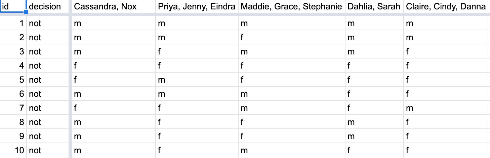
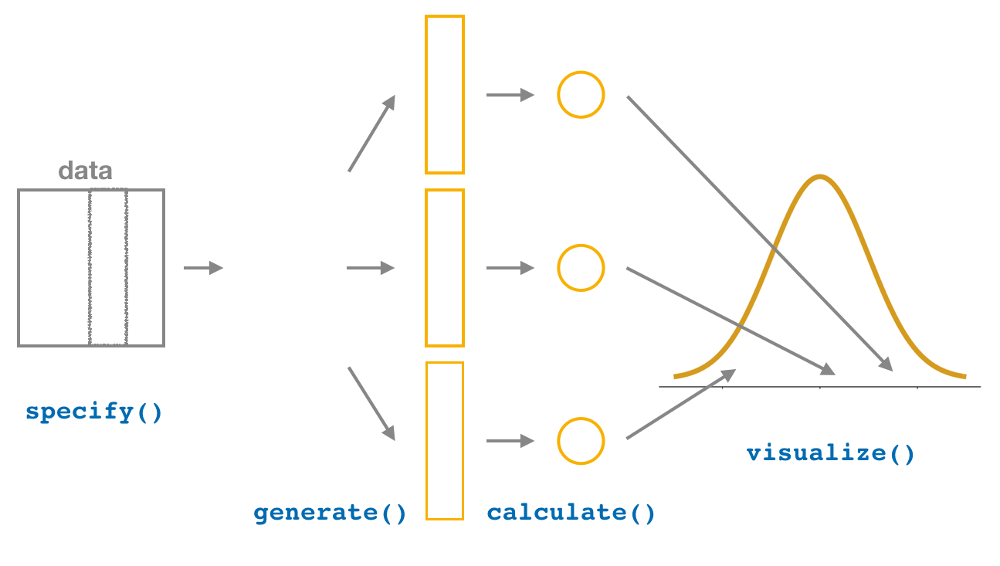
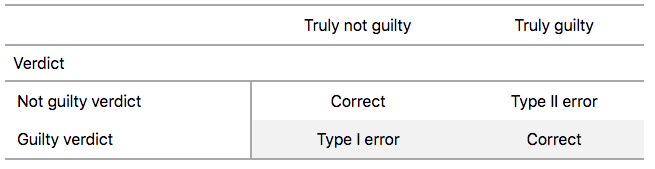
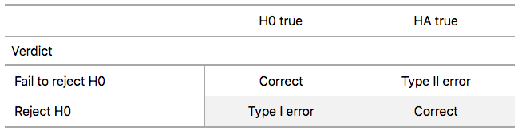
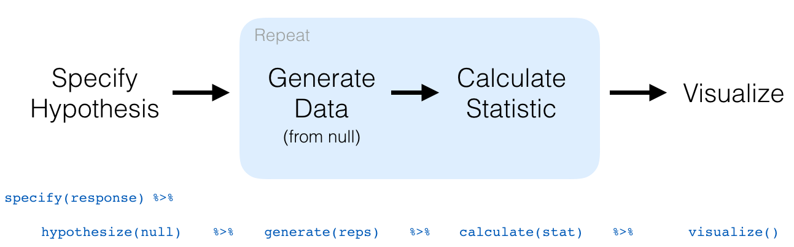

```{r, include=FALSE}
source("_common.R")
```

# 가설 검정 {#sec-hypothesis-testing}  
    
```{r setup_hypo, include=FALSE, purl=FALSE}
# 학습 확인 Learning Check 번호 정의에 사용됨:
chap <- 9
lc <- 0

# R 코드 청크 기본값 설정:
knitr::opts_chunk$set(
  echo = TRUE,
  eval = TRUE,
  warning = FALSE,
  message = TRUE,
  tidy = FALSE,
  purl = TRUE,
  out.width = "\\textwidth",
  fig.height = 4,
  fig.align = "center"
)

# 출력 자릿수 정밀도 설정
options(scipen = 99) # , digits = 3)

# 재현 가능한 의사 난수 생성을 위한 난수 생성기 시드값 설정.
set.seed(76)
```

8장(@sec-confidence-intervals)에서 신뢰 구간을 공부했으므로, 이제 또 다른 흔히 사용되는 통계적 추론 방법인 **가설 검정(hypothesis testing)**에 대해 알아보겠습니다. 가설 검정을 통해 우리는 모집단으로부터 데이터 표본을 추출하고, 서로 경쟁하는 가설들의 타당성에 대해 추론할 수 있습니다. 예를 들어, @sec-ht-activity 절에서 다룰 "승진" 활동에서는 1970년대에 수행된 심리학 연구 데이터를 연구하여, 당시 은행 산업에서 승진율에 성별에 따른 차별이 존재했는지 조사할 것입니다.

좋은 소식은 7장(@sec-sampling)과 8장(@sec-confidence-intervals)에서 가설 검정을 이해하는 데 필요한 많은 개념을 이미 다루었다는 것입니다. 우리는 여기서 이러한 아이디어들을 더욱 확장하고 가설 검정을 이해하기 위한 일반적인 틀(framework)을 제공할 것입니다. 이 일반적인 틀을 이해함으로써, 여러분은 이를 다양한 시나리오에 맞게 조정할 수 있을 것입니다.

신뢰 구간에 대해서도 마찬가지입니다. *모든* 신뢰 구간에 적용되는 하나의 일반적인 틀이 있었고, `infer` 패키지는 이 틀을 중심으로 설계되었습니다. 구체적인 내용은 신뢰 구간의 유형에 따라 약간씩 다를 수 있지만, 일반적인 틀은 동일하게 유지됩니다.

우리는 이러한 접근 방식이 이론 기반 접근 방식을 사용하여 특정 신뢰 구간에 대한 세부 사항에 집중하는 것보다 장기적인 학습에 훨씬 더 좋다고 믿습니다. 이제 보시겠지만, 우리는 가설 검정에 대해서도 이 일반적인 틀을 선호합니다.

```{r appendixb, echo=FALSE, results="asis", purl=FALSE}
if (!knitr::is_latex_output()) {
  cat("더 많은 연습을 원하거나 이 틀이 다른 시나리오에 어떻게 적용되는지 궁금하다면, [부록 B](https://moderndive.com/B-appendixB.html)에서 많은 일반적인 가설 검정과 그에 대응하는 신뢰 구간에 대한 자세한 예시를 찾을 수 있습니다. ")
  cat("이 예시들은 $t$-검정이나 정규 이론 기반 신뢰 구간과 같은 전통적인 이론 기반 방법들에 일반적인 틀이 어떻게 적용되는지도 다루고 있으므로 주의 깊게 살펴보시기 바랍니다. 여러분은 거기서 이러한 전통적인 방법들이 우리가 집중해 온 컴퓨터 기반 방법들의 근사치일 뿐이라는 것을 보게 될 것입니다. 하지만 이러한 방법들은 결과가 유효하기 위해 특정 조건이 충족되어야 합니다. 무작위화, 시뮬레이션, 붓스트랩을 사용하는 컴퓨터 기반 방법은 제약 조건이 훨씬 적습니다. 또한, 여러분의 컴퓨팅 사고력을 발달시키는 데 도움이 되며, 이것이 이 책 전반에서 컴퓨터 기반 방법을 강조하는 큰 이유이기도 합니다.")
}
```


### 필요한 패키지 {-#nhst-packages}

이 장에 필요한 모든 패키지를 불러오겠습니다(이미 설치되어 있다고 가정합니다). @sec-tidyverse-package 절에서의 논의를 상기해 보면, `library(tidyverse)`를 실행하여 `tidyverse` 패키지를 불러오면 다음과 같이 흔히 사용되는 데이터 과학 패키지들이 한꺼번에 로드됩니다.

* 데이터 시각화를 위한 `ggplot2`
* 데이터 핸들링(wrangling)을 위한 `dplyr`
* 데이터를 "깔끔한(tidy)" 형식으로 변환하기 위한 `tidyr`
* 스프레드시트 데이터를 R로 가져오기 위한 `readr`
* 그리고 더 고급 패키지인 `purrr`, `tibble`, `stringr`, `forcats` 패키지들

필요하다면 R 패키지를 설치하고 불러오는 방법에 대한 정보는 @sec-packages 절을 참고하십시오.

```{r message=FALSE}
library(tidyverse)
library(infer)
library(moderndive)
library(nycflights13)
library(ggplot2movies)
```

```{r message=FALSE, echo=FALSE, purl=FALSE}
# 내부적으로 필요하지만 본문에는 나타나지 않는 패키지들.
library(kableExtra)
library(patchwork)
library(scales)
library(viridis)
library(ggrepel)
```


## 승진 활동 {#sec-ht-activity}

어느 은행에서의 성별이 승진에 미치는 영향을 연구하는 활동으로 시작하겠습니다.


### 성별이 은행에서의 승진에 영향을 미치는가?

여러분이 1970년대에 은행에서 일하고 있고 승진을 위해 이력서를 제출한다고 가정해 봅시다. 여러분의 성별이 승진 가능성에 영향을 미칠까요? 이 질문에 답하기 위해, 우리는 1974년 _Journal of Applied Psychology_에 발표된 연구 데이터를 살펴보겠습니다. 이 데이터는 [*OpenIntro*](https://www.openintro.org/) 통계학 교과서 시리즈에서도 사용됩니다.

```{r echo=FALSE, purl=FALSE}
# 이 코드는 동적인 인라인 텍스트 출력 목적으로 사용됩니다.
n_resumes <- promotions %>% nrow()
# 50/50 이진 성별 분할 가정
n_resumes_gender <- n_resumes / 2
```

연구를 시작하기 위해, `r n_resumes`명의 은행 관리자들에게 여러 지점을 가진 은행의 가상 이사가 되었다고 가정해 달라고 요청했습니다. 모든 은행 관리자에게는 이력서가 주어졌고, 이력서의 후보자가 지점 중 한 곳의 새로운 직책으로 승진하기에 적합한지 여부를 질문했습니다.

하지만 이 `r n_resumes`개의 이력서는 한 가지를 제외하고 모든 면에서 동일했습니다. 바로 이력서 상단에 적힌 지원자의 이름이었습니다. 관리자들 중 `r n_resumes_gender`명에게는 전형적인 "남성" 이름이 적힌 이력서가 무작위로 주어졌고, 나머지 `r n_resumes_gender`명에게는 전형적인 "여성" 이름이 적힌 이력서가 무작위로 주어졌습니다. 이력서마다 오직 (이진 방식의) 성별만 달랐기 때문에, 연구자들은 승진율에서 이 변수의 효과를 고립시켜 확인할 수 있었습니다.

기술적으로 성별을 이진법적으로 보는 관점에 오늘날 많은 사람들(저자들 포함)이 동의하지 않지만, 이 연구가 성별에 대한 더 세밀한 관점이 널리 퍼지기 전인 시대에 수행되었다는 점을 기억하는 것이 중요합니다. 이러한 불완전함에도 불구하고, 직장에서의 차별을 어떻게 연구할 수 있는지에 대해 오늘날에도 여전히 유효한 아이디어를 제시한다고 생각하여 이 예시를 사용하기로 결정했습니다.

`moderndive` 패키지에는 `promotions` 데이터 프레임에 `r n_resumes`명의 지원자에 대한 데이터가 들어 있습니다. 무작위로 선택된 6개의 행을 살펴보며 이 데이터를 탐색해 봅시다.

```{r echo=FALSE}
set.seed(2102)
```

```{r}
promotions %>% 
  sample_n(size = 6) %>% 
  arrange(id)
```

변수 `id`는 모든 `r n_resumes`개 행에 대한 식별 변수 역할을 하며, `decision` 변수는 지원자가 승진 대상으로 선택되었는지 여부를 나타내고, `gender` 변수는 이력서에 사용된 이름의 성별을 나타냅니다. 이 데이터가 실제 `r n_resumes_gender`명의 남성과 `r n_resumes_gender`명의 여성이 아니라, `r n_resumes`개의 동일한 이력서 중 전형적인 "남성" 이름이 할당된 `r n_resumes_gender`개와 전형적인 "여성" 이름이 할당된 `r n_resumes_gender`개에 관한 것임을 기억하십시오.


두 범주형 변수인 `decision`과 `gender` 사이의 관계에 대한 탐색적 데이터 분석을 수행해 보겠습니다. 하위 @sec-two-categ-barplot 절에서 이러한 관계를 시각화하는 방법 중 하나로 누적 막대 그래프(stacked barplot)를 보았던 것을 상기하십시오.

```{r eval=FALSE}
ggplot(promotions, aes(x = gender, fill = decision)) +
  geom_bar() +
  labs(x = "이력서에 기재된 성별")
```

```{r promotions-barplot, echo=FALSE, fig.cap="성별과 승진 결정의 관계에 대한 막대 그래프.", fig.height=1.6, purl=FALSE}
promotions_barplot <- ggplot(promotions, aes(x = gender, fill = decision)) +
  geom_bar() +
  labs(x = "이력서에 기재된 성별")
if (knitr::is_html_output()) {
  promotions_barplot
} else {
  promotions_barplot + scale_fill_grey()
}
```

그림 @fig-promotions-barplot 를 보면 여성 이름이 적힌 이력서의 승진 결정 확률이 훨씬 낮은 것처럼 보입니다. 데이터 핸들링을 위한 `dplyr` 패키지를 사용하여 각 그룹에 대해 승진이 수락된 이력서의 비율을 계산하여 이러한 승진율을 수치화해 봅시다. 여기서 개수를 세기 위해 `summarize(n = n())`의 지름길인 `tally()` 함수를 사용함에 유의하십시오.

```{r}
promotions %>% 
  group_by(gender, decision) %>% 
  tally()
```

```{r, echo=FALSE, purl=FALSE}
observed_test_statistic <- promotions %>%
  specify(decision ~ gender, success = "promoted") %>%
  calculate(stat = "diff in props", order = c("male", "female")) %>%
  pull(stat) %>%
  round(3)
```

```{r echo=FALSE, purl=FALSE}
# 이 코드는 동적인 인라인 텍스트 출력 목적으로 사용됩니다.
n_men_promoted_original <- promotions %>%
  filter(gender == "male" & decision == "promoted") %>%
  nrow()
n_women_promoted_original <- promotions %>%
  filter(gender == "female" & decision == "promoted") %>%
  nrow()
p_men_promoted <- n_men_promoted_original / n_resumes_gender
p_women_promoted <- (n_women_promoted_original / n_resumes_gender) %>% round(3)
```

따라서 남성 이름이 적힌 `r n_resumes_gender`개의 이력서 중 `r n_men_promoted_original`개가 승진 대상으로 선택되어, 그 비율은 `r n_men_promoted_original`/`r n_resumes_gender` = `r p_men_promoted` = `r p_men_promoted*100`%입니다. 반면, 여성 이름이 적힌 `r n_resumes_gender`개의 이력서 중 `r n_women_promoted_original`개가 승진 대상으로 선택되어, 그 비율은 `r n_women_promoted_original`/`r n_resumes_gender` = `r p_women_promoted` = `r p_women_promoted*100`%입니다. 이 두 승진율을 비교해 보면, 남성 이름의 이력서가 여성 이름의 이력서보다 `r p_men_promoted` - `r p_women_promoted` = `r observed_test_statistic` = `r observed_test_statistic*100`% 더 높은 비율로 승진 대상으로 선택된 것으로 보입니다. 이는 남성 이름이 적힌 이력서에 유리한 점이 있음을 시사합니다.

하지만 질문은 이것이 은행 승진에 성차별이 존재한다는 **결정적인(conclusive)** 증거를 제공하느냐는 것입니다. 성별에 따른 차별이 존재하지 않는 가상의 세계에서도 승진율 차이가 `r observed_test_statistic * 100`%만큼 발생할 수 있을까요? 다시 말해, 이 가상 세계에서 **표본 변동(sampling variation)**의 역할은 무엇일까요? 이 질문에 답하기 위해, 우리는 다시 한번 컴퓨터를 이용한 **시뮬레이션**에 의존할 것입니다.


### 한 번 뒤섞기 (Shuffling once)

먼저, 승진에 성차별이 존재하지 않는 가상의 우주를 상상해 보십시오. 그러한 가상의 우주에서는 지원자의 성별이 승진 가능성에 아무런 영향을 미치지 않을 것입니다. 이를 우리의 `promotions` 데이터 프레임으로 가져와 생각해보면, `gender` 변수는 아무런 의미가 없는 라벨일 뿐입니다. 만약 이러한 `gender` 라벨이 무의미하다면, 우리는 이를 아무런 영향 없이 "뒤섞어서(shuffling)" 무작위로 재할당할 수 있을 것입니다!

이 아이디어를 설명하기 위해, 표 @tbl-compare-six 에 있는 `r n_resumes`개의 이력서 중 임의로 선택된 6개에 집중해봅시다. `decision` 열은 3개의 이력서가 승진했고 3개는 그렇지 않았음을 보여줍니다. `gender` 열은 원래 이력서 이름의 성별을 보여줍니다.

하지만 성차별이 없는 가상 세계에서 성별은 무의미하므로, `gender` 값을 무작위로 "뒤섞는" 것은 아무런 문제가 되지 않습니다. `shuffled_gender` 열은 그러한 가능한 무작위 셔플링 결과 중 하나를 보여줍니다. 네 번째 열에서 남성 이름과 여성 이름의 수가 각각 3개로 동일하게 유지되지만, 이제는 서로 다른 순서로 나열되어 있음을 확인하십시오.

```{r compare-six, echo=FALSE, purl=FALSE}
set.seed(2019)
# 6개 행 선택
promotions_sample <- promotions %>%
  slice(c(36, 39, 40, 1, 2, 22)) %>%
  mutate(`shuffled gender` = sample(gender)) %>%
  select(-id) %>%
  mutate(`résumé number` = 1:n()) %>%
  select(`résumé number`, everything())

promotions_sample %>%
  kbl(
    caption = "gender 변수를 뒤섞는 과정의 한 예시",
    booktabs = TRUE,
    longtable = TRUE,
    linesep = ""
  ) %>%
  kable_styling(
    font_size = ifelse(knitr::is_latex_output(), 10, 16),
    latex_options = c("hold_position", "repeat_header")
  )
```

다시 말하지만, 이러한 성별 라벨의 무작위 셔플링은 성차별이 없는 가상의 우주에서만 의미가 있습니다. 이러한 성별 변수의 셔플링을 모든 `r n_resumes`개의 이력서에 대해 손으로 직접 확장하려면 어떻게 해야 할까요? 한 가지 방법은 그림 @fig-deck-of-cards 에 표시된 표준 52장짜리 카드 덱을 사용하는 것입니다.

```{r deck-of-cards, echo=FALSE, fig.cap="표준 52장 카드 덱.", purl=FALSE, out.width="100%"}

```

카드의 절반은 빨간색(다이아몬드와 하트)이고 나머지 절반은 검은색(스페이드와 클로버)이므로, 빨간색 카드 두 장과 검은색 카드 두 장을 제거하면 빨간색 카드 `r n_resumes_gender`장과 검은색 카드 `r n_resumes_gender`장이 남게 됩니다. 그림 @fig-shuffling 에서 보는 것처럼 이 `r n_resumes`장의 카드를 섞은 후, 카드를 하나씩 뒤집으면서 빨간색 카드에는 "남성"을, 검은색 카드에는 "여성"을 할당할 수 있습니다.

```{r shuffling, echo=FALSE, fig.cap="카드 덱 섞기.", purl=FALSE, out.width="100%", out.height="100%"}

```

우리는 그러한 셔플링 결과 하나를 `moderndive` 패키지의 `promotions_shuffled` 데이터 프레임에 저장해 두었습니다. 원래의 `promotions`와 셔플된 `promotions_shuffled` 데이터 프레임을 비교해보면, `decision` 변수는 동일하지만 `gender` 변수가 변경된 것을 볼 수 있습니다.

원래의 `promotions` 데이터에 대해 수행했던 것과 동일한 탐색적 데이터 분석을 우리의 `promotions_shuffled` 데이터 프레임에 대해서도 반복해 봅시다. `decision`과 새로 셔플된 `gender` 변수 사이의 관계를 시각화하는 막대 그래프를 만들고, 이를 그림 @fig-promotions-barplot-permuted 에서 원래의 셔플되지 않은 버전과 비교해 봅시다.

```{r, eval=FALSE}
ggplot(promotions_shuffled, 
       aes(x = gender, fill = decision)) +
  geom_bar() + 
  labs(x = "이력서 이름의 성별")
```
```{r promotions-barplot-permuted, fig.cap="승진과 성별(왼쪽) 및 셔플된 성별(오른쪽) 관계의 막대 그래프.", fig.height=4.7, echo=FALSE, purl=FALSE}
height1 <- promotions %>%
  group_by(gender, decision) %>%
  summarize(n = n()) %>%
  pull(n) %>%
  max()
height2 <- promotions_shuffled %>%
  group_by(gender, decision) %>%
  summarize(n = n()) %>%
  pull(n) %>%
  max()
height <- max(height1, height2)

plot1 <- ggplot(promotions, aes(x = gender, fill = decision)) +
  geom_bar() +
  labs(x = "이력서 이름의 성별", title = "Original") +
  theme(legend.position = "none") +
  coord_cartesian(ylim = c(0, height))
plot2 <- ggplot(promotions_shuffled, aes(x = gender, fill = decision)) +
  geom_bar() +
  labs(x = "이력서 이름의 성별", y = "", title = "Shuffled") +
  coord_cartesian(ylim = c(0, height))
if (knitr::is_html_output()) {
  plot1 + plot2
} else {
  plot1 + scale_fill_grey() + plot2 + scale_fill_grey()
}
```

이제 "남성 이름" 대 "여성 이름"의 승진율 차이가 달라진 것을 볼 수 있습니다. 왼쪽 막대 그래프인 원래 데이터와 비교했을 때, 오른쪽 막대 그래프인 새로운 "셔플된" 데이터의 승진율은 훨씬 더 비슷합니다.


각 그룹에 대해 승진이 수락된 이력서의 비율도 계산해 봅시다.

```{r}
promotions_shuffled %>% 
  group_by(gender, decision) %>% 
  tally() # summarize(n = n())과 동일
```
```{r, echo=FALSE, purl=FALSE}
# 남성 통계
n_men_promoted <- promotions_shuffled %>%
  filter(decision == "promoted", gender == "male") %>%
  nrow()
n_men_not_promoted <- promotions_shuffled %>%
  filter(decision == "not", gender == "male") %>%
  nrow()
prop_men_promoted <- n_men_promoted / (n_men_promoted + n_men_not_promoted)

# 여성 통계
n_women_promoted <- promotions_shuffled %>%
  filter(decision == "promoted", gender == "female") %>%
  nrow()
n_women_not_promoted <- promotions_shuffled %>%
  filter(decision == "not", gender == "female") %>%
  nrow()
prop_women_promoted <- n_women_promoted / (n_women_promoted + n_women_not_promoted)

# 차이
diff_prop <- round(prop_men_promoted - prop_women_promoted, 3)

# 차이 계산 후 소수점 반올림
prop_men_promoted <- round(prop_men_promoted, 3)
prop_women_promoted <- round(prop_women_promoted, 3)
```

따라서 차별이 없는 이 가상 우주에서는 "남성" 이력서의 $`r n_men_promoted`/`r n_resumes_gender` = `r prop_men_promoted` = `r prop_men_promoted*100`\%$가 승진 대상으로 선택되었습니다. 반면, "여성" 이력서의 $`r n_women_promoted`/`r n_resumes_gender` = `r prop_women_promoted` = `r prop_women_promoted*100`\%$가 승진 대상으로 선택되었습니다.

다음으로 이 두 값을 비교해 봅시다. 전형적으로 남성적인 이름의 이력서가 여성적인 이름의 이력서보다 $`r prop_men_promoted ` - `r prop_women_promoted ` = `r diff_prop` = `r diff_prop*100`\%$ 다른 비율로 승진 대상으로 선택된 것으로 나타났습니다.

이 비율의 차이가 원래 관찰했던 `r observed_test_statistic` = `r observed_test_statistic*100`%의 차이와는 다르다는 점에 주목하십시오. 이는 다시 한번 **표본 변동(sampling variation)** 때문입니다. 이 표본 변동의 효과를 어떻게 더 잘 이해할 수 있을까요? 이 셔플링 작업을 여러 번 반복하는 것입니다!

```{r echo=FALSE, purl=FALSE}
# 이 코드는 동적인 인라인 텍스트 출력 목적으로 사용됩니다.
n_shuffle <- 16L
```


### `r n_shuffle`번 뒤섞기 (Shuffling `r n_shuffle` times)

우리는 이 셔플링 활동을 반복하기 위해 `r n_shuffle`개 팀의 친구들을 모집했습니다. 그들은 이 값들을 [공유 스프레드시트](https://docs.google.com/spreadsheets/d/1Q-ENy3o5IrpJshJ7gn3hJ5A0TOWV2AZrKNHMsshQtiE/)에 기록했습니다. 그림 @fig-tactile-shuffling 에 처음 10개 행과 5개 열의 스냅샷을 표시합니다.

```{r tactile-shuffling, echo=FALSE, fig.cap = "셔플링 결과가 기록된 공유 스프레드시트 스냅샷 (m은 남성, f는 여성).", fig.show="hold", purl=FALSE, out.width="100%"}

```

```{r, echo=FALSE, message=FALSE, purl=FALSE}
# https://docs.google.com/spreadsheets/d/1Q-ENy3o5IrpJshJ7gn3hJ5A0TOWV2AZrKNHMsshQtiE/edit#gid=0
if (!file.exists("rds/shuffled_data.rds")) {
  shuffled_data <- read_csv("https://docs.google.com/spreadsheets/d/e/2PACX-1vQXLJxwSp1ALEJ1JRNn3o8K3jVdqRG_5yxpoOhIFYflbFIkb2ttH73w8mljptn12CsDyIvjr5p0IGUe/pub?gid=0&single=true&output=csv")
  write_rds(shuffled_data, "rds/shuffled_data.rds")
} else {
  shuffled_data <- read_rds("rds/shuffled_data.rds")
}
n_replicates <- ncol(shuffled_data) - 2

shuffled_data_tidy <- shuffled_data %>%
  gather(team, gender, -c(id, decision)) %>%
  mutate(replicate = rep(1:n_replicates, each = 48))

# 결과 확인
# shuffled_data_tidy %>% group_by(replicate) %>% count(gender) %>% filter(n != 24) %>% View()

shuffled_data_tidy <- shuffled_data_tidy %>%
  group_by(replicate) %>%
  count(gender, decision) %>%
  filter(decision == "promoted") %>%
  mutate(prop = n / 24) %>%
  select(replicate, gender, prop) %>%
  spread(gender, prop) %>%
  mutate(stat = m - f)
```

이러한 `r n_shuffle`개의 *셔플(shuffles)* 열 각각에 대해 승진율의 차이를 계산했고, 그림 @fig-null-distribution-1 에 히스토그램으로 분포를 표시했습니다. 또한 실제 생활에서 발생한 관찰된 승진율 차이인 `r observed_test_statistic` = `r observed_test_statistic*100`%를 어두운 선으로 표시했습니다.

```{r null-distribution-1, fig.cap="셔플된 승진율 차이의 분포.", purl=FALSE, echo=FALSE}
ggplot(data = shuffled_data_tidy, aes(x = stat)) +
  geom_histogram(binwidth = 0.1, color = "white") +
  geom_vline(xintercept = observed_test_statistic, color = "red", size = 1) +
  labs(x = "승진율 차이 (남성 - 여성)")
```

히스토그램의 분포를 논의하기 전에, 기억해야 할 핵심 사항을 강조합니다. 이 히스토그램은 성차별이 존재하지 않는 우리의 **가설 우주(hypothesized universe)**에서 관찰하게 될 승진율 차이를 나타냅니다.

먼저 히스토그램이 대략 0을 중심으로 한다는 점에 주목하십시오. 승진율의 차이가 0이라는 것은 양쪽 성별의 승진율이 같았다는 것과 같습니다. 다시 말해, 이 `r n_shuffle`개 값의 중심은 우리가 성차별이 없는 가상 우주에서 기대하는 것과 일치합니다.

하지만 값들이 0을 중심으로 모여 있긴 하지만, 0 주변에 변동이 존재합니다. 이는 성차별이 없는 가상 우주라 하더라도 우연한 **표본 변동(sampling variation)** 때문에 여전히 작은 승진율 차이를 관찰할 가능성이 높기 때문입니다. 그림 @fig-null-distribution-1 의 히스토그램을 보면, 그러한 차이는 심지어 `r shuffled_data_tidy$stat %>% min() %>% round(3)`나 `r shuffled_data_tidy$stat %>% max() %>% round(3)`만큼 극단적일 수도 있습니다.

이제 우리가 실제 생활에서 관찰한 것에 관심을 돌려봅시다. `r observed_test_statistic` = `r observed_test_statistic*100`%의 차이가 수직선으로 표시되어 있습니다. 스스로에게 질문해 보십시오. 성차별이 없는 가상의 세계에서, 우리가 이 정도의 차이를 관찰할 가능성이 얼마나 될까요? 의견은 다를 수 있겠지만, 저희 생각에는 자주 일어나지는 않을 것 같습니다! 이제 다시 물어보십시오. 이 결과가 우리의 성차별 없는 가상 우주에 대해 무엇을 말해주고 있나요?

<!--
v2 TODO: 추가 고려사항;

이제 33명의 친구들이 각각 다음을 수행합니다.

1. 두 덱의 카드를 가져옵니다.
2. 성별에 해당하는 카드를 섞습니다.
3. 섞인 카드를 관리자의 결정이 담긴 원래 덱에 할당합니다.
4. 다음 네 가지 범주에 각각 몇 장의 카드가 들어가는지 세어봅니다.
  - 승진된 남성
  - 승진되지 않은 남성
  - 승진된 여성
  - 승진되지 않은 여성
5. `r n_resumes_gender`명 중 승진된 남성의 비율을 결정합니다.
6. `r n_resumes_gender`명 중 승진된 여성의 비율을 결정합니다.
7. 귀무 가설이 참이라고 가정하고 그 두 차이를 빼서 새로운 검정 통계량 값을 얻습니다.

우리의 친구들에게 어떤 결과가 나오는지 살펴보고, 관찰된 검정 통계량이 친구들의 통계량과 비교하여 어디에 위치하는지 표시해 봅시다.

```{r, eval=FALSE}
obs_diff_prop <- promotions %>% 
  specify(decision ~ gender, success = "promoted") %>% 
  calculate(stat = "diff in props", order = c("male", "female"))
obs_diff_prop
```

```{r echo=FALSE, eval=FALSE}
set.seed(2019)
tactile_permutes <- promotions %>%
  specify(decision ~ gender, success = "promoted") %>%
  hypothesize(null = "independence") %>%
  generate(reps = 33, type = "permute") %>%
  calculate(stat = "diff in props", order = c("male", "female"))
ggplot(data = tactile_permutes, aes(x = stat)) +
  geom_histogram(binwidth = 0.05, boundary = -0.2, color = "white") +
  geom_vline(xintercept = pull(obs_diff_prop), color = "blue", size = 2) +
  scale_y_continuous(breaks = 0:10)
```

우리가 선택한 33개의 표본 중 오직 하나만이 우리가 관찰한 것만큼 극단적인 것을 볼 수 있습니다. 따라서 우리는 성차별이 작용하고 있을지도 모른다는 것을 암시하는 데이터가 보이기 시작한다고 추측할 수 있습니다. 계산된 통계량의 상당수는 0에 가깝고, 나머지는 -0.1과 0.1의 차이 주변에 나타납니다. 그렇다면 이 암시를 조금 더 명확하게 하기 위해 어떤 추가 증거가 필요할까요? 더 많은 시뮬레이션입니다! 7장(@sec-sampling)과 8장(@sec-confidence-intervals)에서 했던 것처럼, 우리는 이러한 순열과 계산을 여러 번 시뮬레이션하기 위해 컴퓨터를 사용할 것입니다. 다음 섹션에서 `infer` 패키지를 사용하여 바로 그렇게 해보겠습니다.
-->


### 방금 우리가 한 일은 무엇인가요? {#ht-what-did-we-just-do}

이 활동에서 우리가 방금 시연한 것은 **순열 검정(permutation test)**을 이용한 **가설 검정(hypothesis testing)**이라는 통계적 절차입니다. "순열(permutation)" \index{permutation}이라는 용어는 "셔플링(뒤섞기)"에 대한 수학적 용어입니다. 즉, 일련의 값을 가져와 여러분이 플레잉 카드로 했던 것처럼 무작위로 재정렬하는 것입니다.

사실 순열은 8장(@sec-confidence-intervals)에서 수행했던 붓스트랩 방법과 같은 **재표본 추출(resampling)**의 또 다른 형태입니다. 붓스트랩 방법은 **복원(with replacement)** 재추출을 포함하는 반면, 순열 방법은 **비복원(without replacement)** 재추출을 포함합니다.

 @sec-resampling-tactile 절에서 페니를 나타내는 종이 조각과 모자를 사용했던 활동을 생각해 보십시오. 페니를 뽑은 후 모자에 다시 넣었습니다. 이제 우리의 카드 덱을 생각해 보십시오. 카드를 뽑은 후 여러분 앞에 펼쳐 놓고 색깔을 기록한 다음, 카드 덱에 다시 넣지 **않았습니다**.

이전 예시에서 우리는 성차별이 없다는 가상의 우주의 타당성을 검정했습니다. `r n_resumes`개의 이력서로 구성된 관찰된 표본에 포함된 증거는 우리의 가상 우주와 다소 일치하지 않았습니다. 따라서 우리는 이 가상 우주를 **기각(reject)**하고 성차별이 존재한다는 것을 증거가 암시한다고 선언하고 싶을 것입니다.

 @sec-case-study-two-prop-ci 절에서 다뤘던 하품이 전염되는지에 대한 사례 연구를 기억해 보십시오. 이전 예시 역시 알려지지 않은 모집단 비율 차이에 대한 추론을 포함합니다. 이번에는 $p_{m} - p_{f}$가 될 것인데, 여기서 $p_{m}$은 승진 후보로 추천되는 남성 이름 이력서의 모집단 비율이고, $p_{f}$는 여성 이름 이력서에 대한 동일한 모집단 비율입니다. 표 @tbl-table-diff-prop 에서 지금까지 보았던 추론 시나리오 중 하나임을 상기하십시오.

```{r table-diff-prop, echo=FALSE, message=FALSE, purl=FALSE}
# 다음 Google Doc은 CSV로 게시되어 read_csv()를 사용하여 로드됩니다:
# https://docs.google.com/spreadsheets/d/1QkOpnBGqOXGyJjwqx1T2O5G5D72wWGfWlPyufOgtkk4/edit#gid=0

if (!file.exists("rds/sampling_scenarios.rds")) {
  sampling_scenarios <- "https://docs.google.com/spreadsheets/d/e/2PACX-1vRd6bBgNwM3z-AJ7o4gZOiPAdPfbTp_V15HVHRmOH5Fc9w62yaG-fEKtjNUD2wOSa5IJkrDMaEBjRnA/pub?gid=0&single=true&output=csv" %>%
    read_csv(na = "") %>%
    slice(1:5)
  write_rds(sampling_scenarios, "rds/sampling_scenarios.rds")
} else {
  sampling_scenarios <- read_rds("rds/sampling_scenarios.rds")
}

sampling_scenarios %>%
  # 처음 두 시나리오만
  filter(Scenario <= 3) %>%
  kbl(
    caption = "추론을 위한 표본 추출 시나리오",
    booktabs = TRUE,
    escape = FALSE,
    linesep = ""
  ) %>%
  kable_styling(
    font_size = ifelse(knitr::is_latex_output(), 10, 16),
    latex_options = c("hold_position")
  ) %>%
  column_spec(1, width = "0.5in") %>%
  column_spec(2, width = "0.7in") %>%
  column_spec(3, width = "1in") %>%
  column_spec(4, width = "1.1in") %>%
  column_spec(5, width = "1in")
```

따라서 $n_m$ = `r n_resumes_gender`명의 "남성" 지원자와 $n_f$ = `r n_resumes_gender`명의 "여성" 지원자로 구성된 표본을 바탕으로 $p_{m} - p_{f}$에 대한 **점 추정치(point estimate)**는 **표본 비율의 차이**인 $\widehat{p}_{m} -\widehat{p}_{f}$ = `r p_men_promoted` - `r p_women_promoted` = `r observed_test_statistic` = `r observed_test_statistic*100`%입니다. "남성" 이력서에 유리한 `r observed_test_statistic`이라는 이 차이는 0보다 크며, 이는 남성에게 유리한 차별을 시사합니다.

하지만 우리가 스스로에게 던졌던 질문은 "이 차이가 유의미하게 0보다 큰가?"였습니다. 다시 말해, 그 차이가 실제 차별을 나타내는 것인지, 아니면 단지 **표본 변동(sampling variation)** 때문으로 돌릴 수 있는 것인지에 대한 것입니다. 가설 검정은 이러한 구분을 가능하게 해줍니다.


## 가설 검정의 이해 {#sec-understanding-ht}

 @sec-sampling-framework 절에서 보았던 표본 추출과 관련된 용어, 기법, 정의들과 마찬가지로 가설 검정과 관련된 용어, 기법, 정의들도 매우 많습니다. 이들을 배우는 것이 처음에는 매우 벅찬 일처럼 느껴질 수 있습니다. 하지만 연습하고 또 연습하다 보면 누구나 마스터할 수 있습니다.

첫째, **가설(hypothesis)** \index{hypothesis testing!hypothesis}은 알려지지 않은 모집단 모수의 값에 대한 진술입니다. 우리의 이력서 활동에서 관심 있는 모집단 모수는 모집단 비율의 차이인 $p_{m} - p_{f}$입니다. 가설 검정은 이 책에서 다룰 다섯 가지 추론 시나리오의 표 @tbl-table-ch8 에 있는 모든 모집단 모수를 포함할 수 있으며, 여기서는 다루지 않는 더 고급 유형들도 포함할 수 있습니다.

둘째, **가설 검정(hypothesis test)** \index{hypothesis testing}은 서로 경쟁하는 두 가설 사이의 검정으로 구성됩니다. (1) **귀무 가설(null hypothesis)** $H_0$ ("H-제로" 또는 "H-낫"이라고 읽음)과 (2) **대립 가설(alternative hypothesis)** $H_A$ ($H_1$으로도 표시함) 사이의 대결입니다.

일반적으로 귀무 가설 \index{hypothesis testing!null hypothesis}은 "효과가 없다"거나 "관심 있는 차이가 없다"는 주장입니다. 많은 경우 귀무 가설은 현재 상태(status quo 또는 아무런 흥미로운 일이 일어나지 않는 상황을 나타냅니다. 또한 일반적으로 대립 가설 \index{hypothesis testing!alternative hypothesis}은 실험자나 연구자가 입증하고 싶거나 증거를 찾아 지원하고 싶은 주장입니다. 이는 귀무 가설 $H_0$에 대한 "도전자" 가설로 간주됩니다. 우리의 이력서 활동에서 적 절한 가설 검정은 다음과 같습니다.

$$
\begin{aligned}
H_0 &: \text{남성과 여성이 동일한 비율로 승진한다}\\
\text{대 } H_A &: \text{남성이 여성보다 높은 비율로 승진한다}
\end{aligned}
$$

우리가 내린 몇 가지 선택들을 살펴보십시오. 먼저, 승진율에 차이가 없다는 것을 귀무 가설 $H_0$로 설정하고, 차이가 있다는 것을 "도전자" 대립 가설 $H_A$로 설정했습니다. 원칙적으로 두 가설을 바꾸는 것이 틀린 것은 아니지만, 귀무 가설은 "아무 일도 일어나지 않는" 상태를 반영하도록 설정하는 것이 통계적 추론의 관례입니다. 앞서 논의했듯이, 이 경우 $H_0$는 승진율에 차이가 없음에 해당합니다. 또한, 남성이 *더 높은* 비율로 승진한다는 것을 $H_A$로 설정했는데, 이는 사실일 것이라는 우리의 사전 의심을 반영한 주관적인 선택입니다. 우리는 이러한 대립 가설 \index{hypothesis testing!one-sided alternative}을 **단측 대립 가설(one-sided alternatives)**이라고 부릅니다. 만약 다른 사람이 그러한 의심을 공유하지 않고 단지 더 높든 낮든 차이가 있다는 것만을 조사하고 싶다면, **양측 대립 가설(two-sided alternative)** \index{hypothesis testing!two-sided alternative}이라고 알려진 것을 설정할 것입니다.

우리의 관심 모집단 모수인 모집단 비율의 차이 $p_{m} - p_{f}$를 수학적 기호를 사용하여 가설 검정의 공식을 다시 표현할 수 있습니다.

$$
\begin{aligned}
H_0 &: p_{m} - p_{f} = 0\\
\text{대 } H_A&: p_{m} - p_{f} > 0
\end{aligned}
$$

대립 가설 $H_A$가 $p_{m} - p_{f} > 0$으로 단측 가설임을 확인하십시오. 만약 양측 대립 가설을 선택했다면 $p_{m} - p_{f} \neq 0$으로 설정했을 것입니다. 지금은 단순함을 유지하기 위해 더 간단한 단측 대립 가설을 고수하겠습니다. @sec-ht-case-study 절에서 양측 대립 가설의 예시를 제시할 것입니다.

셋째, **검정 통계량(test statistic)** \index{hypothesis testing!test statistic}은 가설 검정에 사용되는 **점 추정치/표본 통계량** 공식입니다. 여기서 표본 통계량은 단지 관찰된 표본을 기반으로 한 요약 통계량일 뿐입니다. @sec-summarize 절에서 요약 통계량은 많은 값을 받아 하나의 값만 반환한다는 것을 보았습니다. 여기서 표본은 남성 이름의 이력서 $n_m$ = `r n_resumes_gender`개와 여성 이름의 이력서 $n_f$ = `r n_resumes_gender`개가 될 것입니다. 따라서 관심 있는 점 추정치는 표본 비율의 차이인 $\widehat{p}_{m} - \widehat{p}_{f}$입니다.

넷째, **관찰된 검정 통계량(observed test statistic)** \index{hypothesis testing!observed test statistic}은 우리가 실제 생활에서 관찰한 검정 통계량의 값입니다. 우리의 경우, `promotions` 데이터 프레임에 저장된 데이터를 사용하여 이 값을 계산했습니다. 관찰된 차이는 남성 이름의 이력서에 유리한 $\widehat{p}_{m} -\widehat{p}_{f} = `r p_men_promoted` - `r p_women_promoted` = `r observed_test_statistic` = `r observed_test_statistic*100`\%$였습니다.

다섯째, **귀무 분포(null distribution)** \index{hypothesis testing!null distribution}는 **귀무 가설 $H_0$가 참이라고 가정할 때** 검정 통계량의 표본 분포입니다. 오! 꽤 긴 정의군요! 천천히 하나씩 풀어봅시다. 귀무 분포를 이해하는 핵심은 귀무 가설 $H_0$가 참이라고 **가정된다**는 점입니다. 우리가 지금 단계에서 $H_0$가 참이라고 말하는 것이 아니라, 단지 가설 검정 목적으로 그것이 참이라고 가정하는 것뿐입니다. 우리의 경우, 이는 승진율에 성차별이 존재하지 않는 가상의 우주에 해당합니다. 귀무 가설 $H_0$를 가정할 때(또는 "$H_0$ 하에서"라고 표현함), 표본 변동으로 인해 검정 통계량은 어떻게 변할까요? 우리의 경우, $H_0$ 하에서 표본 추출로 인해 표본 비율의 차이인 $\widehat{p}_{m} - \widehat{p}_{f}$는 어떻게 달라질까요? 하위 @sec-sampling-definitions 절에서 점 추정치가 표본 변동으로 인해 어떻게 변하는지 보여주는 분포를 **표본 분포(sampling distributions)**라고 불렀던 것을 상기하십시오. 귀무 분포에 대해 기억해야 할 유일한 추가 사항은 그것이 **귀무 가설 $H_0$가 참이라고 가정할 때**의 표본 분포라는 점입니다.

우리의 경우, 이전에 그림 @fig-null-distribution-1 에서 귀무 분포를 시각화했으며, 이를 새로운 표기법과 용어를 사용하여 그림 @fig-null-distribution-2 에 다시 표시합니다. 이는 성차별이 없는 가상의 우주를 **가정**하고 우리 친구들이 계산한 `r n_shuffle`개의 표본 비율 차이의 분포입니다. 또한 관찰된 검정 통계량인 `r observed_test_statistic`의 값을 수직선으로 표시했습니다.

```{r null-distribution-2, fig.cap = "귀무 분포와 관찰된 검정 통계량.", purl=FALSE, echo=FALSE, fig.height=3.3}
ggplot(data = shuffled_data_tidy, aes(x = stat)) +
  geom_histogram(binwidth = 0.1, color = "white") +
  geom_vline(xintercept = observed_test_statistic, color = "red", size = 1) +
  labs(x = expression(paste("표본 비율의 차이 ", hat(p)["m"] - hat(p)["f"])))
```

여섯째, **p-값(p-value)** \index{hypothesis testing!p-value} 또는 **유의 확률**은 **귀무 가설 $H_0$가 참이라고 가정할 때**, 관찰된 검정 통계량만큼이나 극단적이거나 그보다 더 극단적인 검정 통계량을 얻을 확률입니다. 다시 한번 오! 이것도 천천히 풀어보겠습니다. p-값을 "놀라움(surprise)"의 수량화로 생각할 수 있습니다. $H_0$가 참이라고 가정할 때, 우리가 관찰한 것에 대해 얼마나 놀랐을까요? 우리의 경우, 성차별이 없는 가상 우주에서 $H_0$가 참이라고 가정할 때 우리가 수집한 표본으로부터 승진율 차이인 `r observed_test_statistic`을 관찰했다면 얼마나 놀랄까요? 매우 놀랄까요? 약간 놀랄까요?

p-값은 이 확률을 수치화합니다. 그림 @fig-null-distribution-2 에 있는 `r n_shuffle`개의 표본 비율 차이의 경우, 어느 정도의 비율이 더 "극단적인" 결과를 가졌을까요? 여기서 극단적이라는 것은 "남성" 지원자가 "여성" 지원자보다 높은 비율로 승진한다는 대립 가설 $H_A$의 관점에서 정의됩니다. 다시 말해, 남성에게 유리한 차별이 $`r p_men_promoted` - `r p_women_promoted` = `r observed_test_statistic` = `r observed_test_statistic*100`\%$보다 **더욱** 뚜렷하게 나타난 경우가 얼마나 자주 있었을까요?

```{r, echo=FALSE, purl=FALSE}
num <- sum(shuffled_data_tidy$stat >= observed_test_statistic)
denom <- nrow(shuffled_data_tidy)
p_val <- round((num + 1) / (denom + 1), 3)
```

이 경우, `r n_shuffle`번 중 `r sum(shuffled_data_tidy$stat >= observed_test_statistic)`번 관찰된 차이인 `r observed_test_statistic` = `r observed_test_statistic*100`%보다 크거나 같은 비율 차이를 얻었습니다. 매우 드문(사실은 발생하지 않은 결과입니다! 성차별이 없는 가상 우주에서 이렇게 뚜렷한 승진율 차이가 발생할 확률이 매우 희박하다는 점을 감안할 때, 우리는 가상 우주를 **기각(reject)** \index{hypothesis testing!reject the null hypothesis}하려는 경향이 생깁니다. 대신 "남성" 지원자에게 유리한 차별이 존재한다는 가설을 지지하게 됩니다. 다시 말해, 우리는 $H_A$를 위해 $H_0$를 기각합니다.

<!--
v2 TODO: p-값 계산에 관찰된 검정 통계량 포함하기

나중에 보겠지만 p-값은 정확히 1/`r n_shuffle`이 아니라,
계산에 관찰된 검정 통계량을 포함해야 하므로 (`r num` + 1)/(`r denom` + 1) = `r num + 1`/`r (denom + 1)` = `r p_val`이 됩니다.
-->

일곱째이자 마지막으로, 많은 가설 검정 절차에서 검정의 **유의 수준(significance level)** \index{hypothesis testing!significance level}을 사전에 설정하는 것이 권장됩니다. 이는 그리스 문자 $\alpha$ ("알파"라고 읽음)로 표시됩니다. 이 값은 p-값에 대한 컷오프(기준점 역할을 하며, p-값이 $\alpha$보다 작으면 "귀무 가설 $H_0$를 기각"하게 됩니다.

반대로 p-값이 $\alpha$보다 작지 않으면 " $H_0$를 기각하지 못한다"라고 말합니다. 후자의 진술이 " $H_0$를 수용한다"는 말과는 다르다는 점에 유의하십시오. 이 차이는 다소 미묘하며 즉각적으로 명확하지 않을 수 있습니다. 이에 대해서는 나중에 @sec-ht-interpretation 절에서 다시 다루겠습니다.

연구 분야에 따라 서로 다른 $\alpha$ 값을 사용하는 경향이 있지만, 흔히 사용되는 $\alpha$ 값은 0.1, 0.01, 0.05이며, 명확한 이유 없이 0.05를 선택하는 경우가 많습니다. 유의 수준 $\alpha$에 대해서는 @sec-ht-interpretation 절에서 더 자세히 이야기하겠지만, 우선 `infer` 패키지를 사용하여 승진 활동에 해당하는 가설 검정을 본격적으로 수행해 봅시다.


## 가설 검정 수행 {#sec-ht-infer}

8장(@sec-bootstrap-process)에서는 신뢰 구간을 구축하는 방법을 보여드렸습니다. 먼저 `dplyr` 데이터 핸들링 함수와 하위 @sec-shovel-1000-times 절에서 가상 삽으로 사용했던 `rep_sample_n()` 함수를 사용하여 이를 어떻게 수행하는지 설명했습니다. 특히 `rep_sample_n()` 함수의 `replace = TRUE` 인수를 설정하여 복원 재추출을 통한 신뢰 구간을 구축했습니다.

그런 다음 `infer` 패키지 워크플로를 사용하여 동일한 작업을 수행하는 방법을 보여드렸습니다. 두 워크플로 모두 신뢰 구간을 구축할 수 있는 동일한 붓스트랩 분포를 생성하지만, `infer` 패키지 워크플로는 그림 @fig-infer-ci 와 같이 전체 프로세스의 각 단계를 강조합니다. 이는 동사로 직관적으로 이름 지어진 함수들을 사용합니다.

1. 데이터 프레임에서 관심 있는 변수를 지정(`specify`)합니다.
2. 복원 재취출을 통해 붓스트랩 재표본의 복제본을 생성(`generate`)합니다.
3. 관심 있는 요약 통계량을 계산(`calculate`)합니다.
4. 결과로 나온 붓스트랩 분포와 신뢰 구간을 시각화(`visualize`)합니다.

```{r infer-ci, echo=FALSE, fig.cap="infer 패키지를 이용한 신뢰 구간 구축.", purl=FALSE, out.width="90%", out.height="90%"}

```

이 섹션에서는 그림 @fig-inferht 에서 볼 수 있듯이, `specify()`와 `generate()` 단계 사이에 `hypothesize()` 단계를 추가함으로써 이전에 보았던 신뢰 구간 구축을 위한 `infer` 코드를 가설 검정 수행을 위해 매끄럽게 수정하는 방법을 보여드릴 것입니다. 워크플로의 기본 개요가 거의 동일하다는 것을 알 수 있습니다.

```{r inferht, echo=FALSE, fig.cap="infer 패키지를 이용한 가설 검정 수행.", purl=FALSE, out.width="90%", out.height="90%"}
knitr::include_graphics("images/flowcharts/infer/ht.png")
```

```{r, echo=FALSE, purl=FALSE}
alpha <- 0.05
```

또한, 이 가설 검정을 위해 사전에 지정된 유의 수준 $\alpha$ = `r alpha`를 사용할 것입니다. $\alpha$ 값 선택에 대한 논의는 나중에 @sec-ht-interpretation 절에서 다루기로 하겠습니다.


### `infer` 패키지 워크플로 {#sec-infer-workflow-ht}

#### 1. 변수 지정(specify) {-}

`specify()` \index{infer!specify()} 연산자를 사용하여 연구의 반응 변수와 필요한 경우 설명 변수를 지정한다는 점을 상기하십시오. 이 경우, 성별이 승진 결정에 미치는 잠재적 영향에 관심이 있으므로 `decision`을 반응 변수로, `gender`를 설명 변수로 설정합니다. 데이터 프레임에서 반응 변수의 이름이 `response`이고 설명 변수의 이름이 `explanatory`일 때 `formula = response ~ explanatory` 형식을 사용하여 이를 수행합니다. 따라서 우리 사례에서는 `decision ~ gender`가 됩니다.

또한, 승진되지 않은(`not` promoted 이력서의 비율이 아니라 승진된(`"promoted"` 이력서의 비율에 관심이 있으므로 `success` 인수를 `"promoted"`로 설정합니다.

```{r}
promotions %>% 
  specify(formula = decision ~ gender, success = "promoted")
```

다시 한번 말하지만, `promotions` 데이터 자체는 변하지 않고 `Response: decision (factor)` 및 `Explanatory: gender (factor)`와 같은 *메타데이터*만 변경된다는 점에 주목하십시오. 이는 @sec-groupby 절에서 보았듯이 `dplyr`의 `group_by()` 연산자가 데이터를 변경하지 않고 "그룹화" 메타데이터만 추가하는 방식과 유사합니다.

#### 2. 귀무 가설 설정(hypothesize) {-}

`infer` 워크플로를 사용하여 가설 검정을 수행하려면 신뢰 구간에는 없었던 새로운 단계인 `hypothesize()` \index{infer!hypothesize()} 단계가 필요합니다. @sec-understanding-ht 절에서 우리의 가설 검정은 다음과 같았습니다.

$$
\begin{aligned}
H_0 &: p_{m} - p_{f} = 0\\
\text{대 } H_A&: p_{m} - p_{f} > 0
\end{aligned}
$$

즉, 우리의 "가상 우주"에 해당하는 귀무 가설 $H_0$는 성별에 따른 차별율에 차이가 없다는 것이었습니다. `infer` 워크플로에서 `hypothesize()` 함수의 `null` 인수를 사용하여 이 귀무 가설 $H_0$를 다음 중 하나로 설정합니다.

- 단일 표본을 포함하는 가설의 경우 `"point"` 
- 두 표본을 포함하는 가설의 경우 `"independence"`

우리 사례에서는 두 표본("남성" 이름과 "여성" 이름의 이력서)이 있으므로 `null = "independence"`로 설정합니다.

```{r}
promotions %>% 
  specify(formula = decision ~ gender, success = "promoted") %>% 
  hypothesize(null = "independence")
```

다시 말하지만, 데이터는 아직 변경되지 않았습니다. 이는 곧 나올 `generate()` 단계에서 발생할 것이며, 지금은 단지 메타데이터만 설정하는 단계입니다.

`"point"`와 `"independence"`라는 용어는 어디에서 왔을까요? 이들은 두 가지 전문 통계 용어입니다. `"point"`라는 용어는 단일 관찰 그룹에 대해 단일 지점(point)의 값을 테스트한다는 사실에서 유래했습니다. 8장(@sec-confidence-intervals)의 페니 예시로 돌아가서, 모든 미국 페니의 평균 연도가 1993년인지 아닌지를 테스트하고 싶다고 가정해 봅시다. 우리는 다음과 같이 *모든* 미국 페니의 평균 연도인 "지점" $\mu$의 값을 테스트하게 될 것입니다.

$$
\begin{aligned}
H_0 &: \mu = 1993\\
\text{대 } H_A&: \mu \neq 1993
\end{aligned}
$$

`"independence"`라는 용어는 두 관찰 그룹에 대해 반응 변수가 그룹을 할당하는 설명 변수와 *독립(independent)*인지 여부를 테스트한다는 사실과 관련이 있습니다. 우리 사례에서는 `decision` 반응 변수가 각 이력서를 두 그룹 중 하나로 할당하는 설명 변수인 `gender`와 "독립적"인지 테스트하고 있습니다.

#### 3. 반복 복제본 생성(generate) {-}

```{r echo=FALSE, purl=FALSE}
# 이 코드는 동적인 인라인 텍스트 출력 목적으로 사용됩니다.
n_reps <- 1000L
```


귀무 가설을 설정(`hypothesize()`)한 후에는 귀무 가설이 참이라고 가정하고 "뒤섞인(shuffled)" 데이터셋의 반복 복제본을 생성(`generate()`)합니다. @sec-ht-activity 절에서 수행했던 셔플링 활동을 여러 번 반복하여 이를 수행합니다. 친구들이 했던 것처럼 단지 `r n_shuffle`번만 하는 대신, 컴퓨터를 사용하여 `generate()` \index{infer!generate()} 함수에서 ``reps = `r n_reps` ``로 설정하여 `r n_reps`번 반복해 보겠습니다. 하지만 `type = "bootstrap"`(복원 재표본 추출)을 사용하여 반복 복제본을 생성했던 신뢰 구간 때와 달리, 이제는 `type = "permute"`로 설정하여 셔플/순열을 수행할 것입니다. 셔플/순열은 일종의 재표본 추출이지만, 붓스트랩 방법과 달리 **비복원(without replacement)** 재추출을 포함한다는 점을 기억하십시오.

```{r eval=FALSE}
promotions_generate <- promotions %>% 
  specify(formula = decision ~ gender, success = "promoted") %>% 
  hypothesize(null = "independence") %>% 
  generate(reps = 1000, type = "permute")
nrow(promotions_generate)
```

```{r echo=FALSE, purl=FALSE}
if (!file.exists("rds/promotions_generate.rds")) {
  promotions_generate <- promotions %>%
    specify(formula = decision ~ gender, success = "promoted") %>%
    hypothesize(null = "independence") %>%
    generate(reps = 1000, type = "permute")
  write_rds(promotions_generate, "rds/promotions_generate.rds")
} else {
  promotions_generate <- read_rds("rds/promotions_generate.rds")
}
nrow(promotions_generate)
```

<!-- 
v2 TODO: 고려사항:

`infer::permute_once()`는 x 대신 y 변수를 뒤섞습니다. 이는 결국 같은 결과가 되지만,
이전에 설명했던 카드 교구 예시를 생각하면 그리 직관적이지는 않습니다. 
여기서 `decision`이 셔플된 `promotions_generate`를 직접 보여주는 것은 피하는 것이 좋겠습니다.
-->

결과 데이터 프레임 행의 수가 `r (n_resumes*n_reps) %>% comma()`개임을 확인하십시오. 이는 `r n_resumes`개 행 각각에 대해 `r n_reps`번의 셔플/순열을 수행했기 때문이며, $`r (n_resumes*n_reps) %>% comma()` = `r n_reps` \cdot `r n_resumes`입니다. `View()`를 사용하여 `promotions_generate` 데이터 프레임을 탐색해 보면, `replicate` 변수가 각 행이 어느 재표본에 속하는지 나타내는 것을 볼 수 있습니다. 따라서 값이 `1`인 행이 `r n_resumes`개, `2`인 행이 `r n_resumes`개, 그리고 마지막으로 `` `r n_reps` ``인 행이 `r n_resumes`개 있습니다.

#### 4. 요약 통계량 계산(`calculate` {-}

이제 귀무 가설이 참이라고 가정하고 `r n_reps`개의 "셔플" 반복 복제본을 생성했으므로, 각 `r n_reps`개의 셔플에 대해 적 절한 요약 통계량을 계산(`calculate()` \index{infer!calculate()}해 봅시다. @sec-understanding-ht 절에서 가설 검정과 관련된 점 추정치는 **검정 통계량(test statistics)**이라는 특별한 명칭이 있다고 했습니다. 관심 있는 모집단 모수가 모집단 비율의 차이인 $p_{m} - p_{f}$이므로, 여기서 검정 통계량은 표본 비율의 차이인 $\widehat{p}_{m} - \widehat{p}_{f}$입니다.

`r n_reps`개의 각 셔플에 대해 `stat = "diff in props"`로 설정하여 이 검정 통계량을 계산할 수 있습니다. 또한, $\widehat{p}_{m} - \widehat{p}_{f}$에 관심이 있으므로 `order = c("male", "female")`로 설정합니다. 앞서 언급했듯이, 분석 내내 일관성을 유지하고 그에 맞춰 해석을 조정한다면 뺄셈의 순서는 중요하지 않습니다.

결과를 `null_distribution`이라는 데이터 프레임에 저장하겠습니다.

```{r eval=FALSE}
null_distribution <- promotions %>% 
  specify(formula = decision ~ gender, success = "promoted") %>% 
  hypothesize(null = "independence") %>% 
  generate(reps = 1000, type = "permute") %>% 
  calculate(stat = "diff in props", order = c("male", "female"))
null_distribution
```

```{r echo=FALSE, purl=FALSE}
if (!file.exists("rds/null_distribution_promotions.rds")) {
  null_distribution <- promotions_generate %>%
    calculate(stat = "diff in props", order = c("male", "female"))
  write_rds(null_distribution, "rds/null_distribution_promotions.rds")
} else {
  null_distribution <- read_rds("rds/null_distribution_promotions.rds")
}
null_distribution
```

성차별이 없는 가상 세계에서의 $\widehat{p}_{m} - \widehat{p}_{f}$의 각 인스턴스를 나타내는 `r n_reps`개의 `stat` 값이 있음을 확인하십시오. 또한 이 데이터 프레임의 이름을 `null_distribution`으로 신중하게 선택했음을 주목하십시오. 귀무 가설 $H_0$가 참이라고 가정할 때의 표본 분포는 **귀무 분포(null distribution)**라는 특별한 이름을 가진다는 점을 @sec-understanding-ht 절에서 다시 한번 떠올려 보십시오.

승진율의 *관찰된* 차이는 얼마였나요? 다시 말해, *관찰된 검정 통계량* $\widehat{p}_{m} - \widehat{p}_{f}$는 얼마였나요? @sec-ht-activity 절에서 이 관찰된 차이를 직접 계산했을 때 `r p_men_promoted` - `r p_women_promoted` = `r observed_test_statistic` = `r observed_test_statistic*100`%였습니다. 또한 `hypothesize()`와 `generate()` 단계를 제거한 이전 `infer` 코드를 사용하여 이 값을 계산할 수 있습니다. 이를 `obs_diff_prop`에 저장하겠습니다.

```{r}
obs_diff_prop <- promotions %>% 
  specify(decision ~ gender, success = "promoted") %>% 
  calculate(stat = "diff in props", order = c("male", "female"))
obs_diff_prop
```

#### 5. p-값 시각화(visualize) {-}

마지막 단계는 성차별이 없는 가상 우주에서 승진율 차이가 `r observed_test_statistic*100`%로 나타난 것에 대해 우리가 얼마나 놀랐는지 측정하는 것입니다. 만약 관찰된 차이인 `r observed_test_statistic`이 발생할 확률이 매우 낮다면, 우리는 가상 우주의 타당성을 기각하는 경향을 보일 것입니다.

먼저 그림 @fig-null-distribution-infer 에서 `visualize()` \index{infer!visualize()}를 사용하여 $\widehat{p}_{m} - \widehat{p}_{f}$의 `r n_reps`개 값에 대한 **귀무 분포**를 시각화하는 것부터 시작합니다. 이 값들은 $H_0$가 참이라고 가정할 때의 승진율 차이임을 상기하십시오. 이는 성차별이 없는 가상의 우주에 있는 것에 해당합니다.

```{r null-distribution-infer, fig.show="hold", fig.cap="귀무 분포.", fig.height=1.8}
visualize(null_distribution, bins = 10)
```

이제 실제 생활에서 일어난 일인 `r p_men_promoted` - `r p_women_promoted` = `r observed_test_statistic` = `r observed_test_statistic*100`%의 관찰된 승진율 차이를 그림 @fig-null-distribution-infer 에 추가해 보겠습니다. 하지만 단순히 `geom_vline()`을 사용하여 수직선을 추가하는 대신, `obs_stat`에 `obs_diff_prop`에 저장한 관찰된 검정 통계량 값을 설정하여 `shade_p_value()` \index{infer!shade\_p\_value()} 함수를 사용해 보겠습니다.

또한, 대립 가설 $H_A: p_{m} - p_{f} > 0$을 반영하여 `direction = "right"`로 설정할 것입니다. 우리의 대립 가설 $H_A$는 $p_{m} - p_{f} > 0$이며, 이는 남성 이름의 이력서에 유리한 승진율 차이가 존재한다는 주장이었습니다. 여기서 "더 극단적(more extreme)"이라는 것은 차이가 "더 크거나", "더 양수이거나", "더 오른쪽"인 경우에 해당합니다. 따라서 `shade_p_value()`의 `direction` 인수를 `"right"`로 설정합니다.

반면에 대립 가설 $H_A$가 여성 이름의 이력서에 유리한 차별을 암시하는 다른 가능한 단측 대립 가설인 $p_{m} - p_{f} < 0$이었다면 `direction = "left"`로 설정했을 것입니다. 만약 대립 가설 $H_A$가 어느 방향으로든 차별이 있음을 암시하는 양측 가설인 $p_{m} - p_{f} \neq 0$이었다면 `direction = "both"`로 설정했을 것입니다.

```{r null-distribution-infer-2, fig.cap="p-값을 보여주기 위해 음영 처리된 히스토그램."}
visualize(null_distribution, bins = 10) + 
  shade_p_value(obs_stat = obs_diff_prop, direction = "right")
```

그 결과인 그림 @fig-null-distribution-infer-2 에서 짙은 실선은 `r observed_test_statistic` = `r observed_test_statistic*100`%를 나타냅니다. 그런데 음영 처리된 영역은 무엇에 해당할까요? 이것이 바로 **p-값(p-value)**입니다. @sec-understanding-ht 절에서 보았던 p-값의 정의를 다시 떠올려 보십시오.

> p-값은 **귀무 가설 $H_0$가 참이라고 가정할 때**, 관찰된 검정 통계량만큼이나 극단적이거나 그보다 더 극단적인 검정 통계량을 얻을 확률입니다.

그림 @fig-null-distribution-infer-2 의 음영 처리된 영역으로 판단하건대, 성차별이 없는 가상 우주에서 `r observed_test_statistic` = `r observed_test_statistic*100`% 이상의 승진율 차이를 관찰하는 것은 다소 드문 일인 것 같습니다. 즉, p-값이 다소 작습니다. 따라서 우리는 이 가상 우주를 기각하거나, 통계 용어를 사용하여 "$H_0$를 기각"하는 경향을 갖게 될 것입니다.

귀무 분포의 어느 정도 분율이 음영 처리되었을까요? 다시 말해, p-값의 정확한 값은 얼마일까요? 이전의 `shade_p_value()` 코드와 동일한 인수를 사용하여 `get_p_value()` \index{infer!get\_p\_value()} 함수로 계산할 수 있습니다.

```{r}
null_distribution %>% 
  get_p_value(obs_stat = obs_diff_prop, direction = "right")
```
```{r, echo=FALSE, purl=FALSE}
p_value <- null_distribution %>%
  get_p_value(obs_stat = obs_diff_prop, direction = "right") %>%
  mutate(p_value = round(p_value, 3))
```

p-값의 정의를 염두에 둘 때, 귀무 분포에서 오직 표본 변동만으로 `r observed_test_statistic` = `r observed_test_statistic*100`%만큼 큰 승진율 차이를 관찰할 확률은 `r pull(p_value)` = `r pull(p_value) * 100`%입니다. 이 p-값이 사전에 지정된 유의 수준 $\alpha = `r alpha`$보다 작기 때문에, 우리는 귀무 가설 $H_0: p_{m} - p_{f} = 0$을 기각합니다. 다시 말해, 이 p-값은 성차별이 없는 우리의 가상 우주를 기각하기에 충분히 작습니다. 대신 우리는 성차별이 여기서 발생했을 가능성이 높다는 결론을 지지할 충분한 증거를 갖게 되었습니다. 귀무 가설 $H_0$를 기각하느냐 마느냐는 유의 수준 $\alpha$의 선택에 크게 좌우된다는 점에 주목하십시오. 이에 대해서는 하위 @sec-choosing-alpha 절에서 더 자세히 논의하겠습니다.


### 신뢰 구간과의 비교 {#sec-comparing-infer-workflows}

`infer` 패키지의 장점 중 하나는 최소한의 변경만으로 가설 검정과 신뢰 구간 구축 사이를 매끄럽게 오갈 수 있다는 점입니다! p-값을 계산하는 데 필요한 귀무 분포를 생성하는 이전 섹션의 코드를 떠올려 보십시오.

```{r eval=FALSE}
null_distribution <- promotions %>% 
  specify(formula = decision ~ gender, success = "promoted") %>% 
  hypothesize(null = "independence") %>% 
  generate(reps = 1000, type = "permute") %>% 
  calculate(stat = "diff in props", order = c("male", "female"))
```

이에 대응하는 $p_{m} - p_{f}$에 대한 95% 신뢰 구간을 구축하는 데 필요한 붓스트랩 분포를 생성하려면 단 두 가지만 변경하면 됩니다. \index{infer!switching between tests and confidence intervals} 첫째, 더 이상 귀무 가설 $H_0$가 참이라고 가정하지 않으므로 `hypothesize()` 단계를 제거합니다. `hypothesize()` 코드 줄을 삭제하거나 주석 처리하여 이를 수행할 수 있습니다. 둘째, `generate()` 단계에서 재표본 추출의 `type`을 `"permute"` 대신 `"bootstrap"`으로 전환합니다.

```{r eval=FALSE}
bootstrap_distribution <- promotions %>% 
  specify(formula = decision ~ gender, success = "promoted") %>% 
  # 변경 1 - hypothesize() 제거:
  # hypothesize(null = "independence") %>% 
  # 변경 2 - type을 "permute"에서 "bootstrap"으로 변경:
  generate(reps = 1000, type = "bootstrap") %>% 
  calculate(stat = "diff in props", order = c("male", "female"))
```

```{r echo=FALSE, purl=FALSE}
if (!file.exists("rds/bootstrap_distribution_promotions.rds")) {
  bootstrap_distribution <- promotions %>%
    specify(formula = decision ~ gender, success = "promoted") %>%
    # Change 1 - Remove hypothesize():
    # hypothesize(null = "independence") %>%
    # Change 2 - Switch type from "permute" to "bootstrap":
    generate(reps = 1000, type = "bootstrap") %>%
    calculate(stat = "diff in props", order = c("male", "female"))
  write_rds(
    bootstrap_distribution,
    "rds/bootstrap_distribution_promotions.rds"
  )
} else {
  bootstrap_distribution <- read_rds("rds/bootstrap_distribution_promotions.rds")
}
```

이 `bootstrap_distribution`을 사용하여, 먼저 @sec-bootstrap-process 절에서 했던 것처럼 백분위수 기반 신뢰 구간을 계산해 보겠습니다.

```{r}
percentile_ci <- bootstrap_distribution %>% 
  get_confidence_interval(level = 0.95, type = "percentile")
percentile_ci
```

하위 @sec-shorthand 절의 95% 신뢰 구간에 대한 간략한 해석을 사용하면, 우리는 모비율의 실제 차이 $p_{m} - p_{f}$가 (`r percentile_ci$lower_ci  %>% round(3)`, `r percentile_ci$upper_ci  %>% round(3)` 사이에 있다고 95% "확신"합니다. 그림 @fig-bootstrap-distribution-two-prop-percentile 에서 `bootstrap_distribution`과 $p_{m} - p_{f}$에 대한 백분위수 기반 95% 신뢰 구간을 시각화해 보겠습니다.

```{r eval=FALSE}
visualize(bootstrap_distribution) + 
  shade_confidence_interval(endpoints = percentile_ci)
```
```{r bootstrap-distribution-two-prop-percentile, echo=FALSE, fig.show="hold", fig.cap="Percentile-based 95\\% confidence interval.", purl=FALSE, fig.height=3.2}
if (knitr::is_html_output()) {
  visualize(bootstrap_distribution) +
    shade_confidence_interval(endpoints = percentile_ci)
} else {
  visualize(bootstrap_distribution) +
    shade_confidence_interval(
      endpoints = percentile_ci,
      fill = "grey40", color = "grey30"
    )
}
```

$p_{m} - p_{f}$에 대한 95% 신뢰 구간에 포함되지 않은 핵심 값인 0에 주목하십시오. 즉, 차이가 0이라는 값은 우리의 그물에 걸리지 않았으며, 이는 $p_{m}$과 $p_{f}$가 실제로 다르다는 것을 시사합니다! 또한 $p_{m} - p_{f}$에 대한 95% 신뢰 구간 전체가 0보다 위에 있는 것을 확인하십시오. 이는 이 차이가 남성에게 유리함을 시사합니다.

붓스트랩 분포가 대략적으로 정규 분포 모양을 띠고 있으므로, @sec-bootstrap-process 절에서 했던 것처럼 표준 오차 방법을 사용할 수도 있습니다. 이 경우, `obs_diff_prop`에 저장된 관찰된 승진율 차이인 `r observed_test_statistic` = `r observed_test_statistic*100`%를 `point_estimate` 인수로 지정해야 합니다. 이 값이 신뢰 구간의 중심 역할을 합니다.

```{r}
se_ci <- bootstrap_distribution %>% 
  get_confidence_interval(level = 0.95, type = "se", 
                          point_estimate = obs_diff_prop)
se_ci
```

`bootstrap_distribution`을 다시 시각화하되, 이번에는 그림 @fig-bootstrap-distribution-two-prop-se 에서 $p_{m} - p_{f}$에 대한 표준 오차 기반 95% 신뢰 구간을 살펴보십시오. 다시 한번 값 0이 신뢰 구간에 포함되지 않았음을 확인하십시오. 이는 다시 한번 $p_{m}$과 $p_{f}$가 실제로 다르다는 것을 시사합니다!

```{r eval=FALSE}
visualize(bootstrap_distribution) + 
  shade_confidence_interval(endpoints = se_ci)
```
```{r bootstrap-distribution-two-prop-se, echo=FALSE, fig.show="hold", fig.cap="Standard error-based 95\\% confidence interval.", purl=FALSE, fig.height=3.4}
# Will need to make a tweak to the {infer} package so that it doesn't always display "Null" here (added to `develop` branch on 2019-10-26)
if (knitr::is_html_output()) {
  visualize(bootstrap_distribution) +
    shade_confidence_interval(endpoints = se_ci)
} else {
  visualize(bootstrap_distribution) +
    shade_confidence_interval(
      endpoints = se_ci,
      fill = "grey40", color = "grey30"
    )
}
```

```{block lc10-3b0, type="learncheck", purl=FALSE}
\vspace{-0.15in}
**_학습 확인_**
\vspace{-0.1in}
```

**`r paste0("(LC", chap, ".", (lc <- lc + 1), ")")`** 다음 코드는 왜 오류를 발생시키나요? 다시 말해, 반응 변수와 설명 변수의 어떤 특징 때문에 `infer` 패키지에서 이 계산이 불가능한 것일까요?

```{r, eval=FALSE}
library(moderndive)
library(infer)
null_distribution_mean <- promotions %>%
  specify(formula = decision ~ gender, success = "promoted") %>% 
  hypothesize(null = "independence") %>% 
  generate(reps = 1000, type = "permute") %>% 
  calculate(stat = "diff in means", order = c("male", "female"))
```

**`r paste0("(LC", chap, ".", (lc <- lc + 1), ")")`** 두 성별의 승진 비율에 대한 모집단 분포에 대해, 표본 비율의 분포가 좋은 근사치가 될 것이라고 상대적으로 확신하는 이유는 무엇인가요?

**`r paste0("(LC", chap, ".", (lc <- lc + 1), ")")`** _p-값_의 정의를 사용하여, 남성과 여성의 승진율을 비교하는 가설 검정에서 p-값이 무엇을 나타내는지 글로 써 보십시오.

```{block, type="learncheck", purl=FALSE}
\vspace{-0.25in}
\vspace{-0.25in}
``` 


### "검정은 단 하나뿐이다" {#only-one-test}

 @sec-understanding-ht 절에서 보았던 표본 추출과 관련된 용어, 기호, 정의와 하위 @sec-infer-workflow-ht 절의 `infer` 워크플로를 사용하여 가설 검정을 수행하는 데 필요한 단계들을 요약해 보겠습니다.

1. 데이터 프레임에서 관심 있는 변수를 `specify()`(지정)합니다.
2. 귀무 가설 $H_0$를 `hypothesize()`(설정)합니다. 즉, $H_0$가 참이라고 가정한 "우주에 대한 모델"을 설정합니다.
3. $H_0$가 참이라고 가정하고 셔플을 `generate()`(생성)합니다. 즉, $H_0$가 참이라고 가정한 데이터를 **시뮬레이션**합니다.
4. 관찰된 데이터와 **시뮬레이션된** 데이터 모두에 대해 관심 있는 **검정 통계량**을 `calculate()`(계산)합니다.
5. 결과로 나온 **귀무 분포**를 `visualize()`(시각화)하고, 귀무 분포를 관찰된 검정 통계량과 비교하여 **p-값**을 계산합니다.

가설 검정을 처음 접할 때는 소화해야 할 내용이 많지만, 좋은 점은 이 일반적인 프레임워크를 이해하고 나면 **어떤** 가설 검정도 이해할 수 있다는 것입니다. 컴퓨터 과학자 앨런 다우니(Allen Downey)는 유명한 블로그 포스트에서 이를 ["검정은 단 하나뿐이다(There is only one test)"](http://allendowney.blogspot.com/2016/06/there-is-still-only-one-test.html) 프레임워크라고 불렀으며, 그림 @fig-htdowney 에 표시된 순서도를 만들었습니다.

```{r htdowney, echo=FALSE, fig.cap="앨런 다우니의 가설 검정 프레임워크.", purl=FALSE, out.width="110%"}
knitr::include_graphics("images/copyright/there_is_only_one_test.png")
```

그림 @fig-inferht 에서 보았던 "`infer`를 이용한 가설 검정" 다이어그램과의 유사점에 주목하십시오. 이는 `infer` 패키지가 "검정은 단 하나뿐이다" 프레임워크에 맞춰 명시적으로 설계되었기 때문입니다. 따라서 이 프레임워크를 이해한다면, 모든 가설 검정 시나리오에 대해 이러한 아이디어를 쉽게 일반화할 수 있습니다. 모비율 $p$, 모평균 $\mu$, 모비율의 차이 $p_1 - p_2$, 모평균의 차이 $\mu_1 - \mu_2$, 그리고 10장(@sec-inference-for-regression 회귀 분석 추론에서 보게 될 모집단 회귀 기울기 $\beta_1$에 대해서도 마찬가지입니다. 사실, 이 프레임워크는 이러한 예시들보다 더 복잡한 가설 검정과 검정 통계량에도 더 일반적으로 적용됩니다.

```{block lc-downey, type="learncheck", purl=FALSE}
\vspace{-0.15in}
**_학습 확인_**
\vspace{-0.1in}
```

**`r paste0("(LC", chap, ".", (lc <- lc + 1), ")")`** 이 연구를 사용하여 남성과 여성의 승진율 사이에 통계적 차이가 존재하는지 결론을 내리기 위해 앨런 다우니의 다이어그램을 어떻게 사용했는지 한 단락으로 설명해 보십시오.

```{block, type="learncheck", purl=FALSE}
\vspace{-0.25in}
\vspace{-0.25in}
``` 


## 가설 검정 해석하기 {#sec-ht-interpretation}

가설 검정의 결과를 해석하는 것은 통계적 추론 방법 중에서도 다소 까다로운 측면 중 하나입니다. 이 섹션에서는 가설 검정 과정을 해독하는 데 도움이 되는 방법들에 초점을 맞추고, 몇 가지 흔한 오해들을 다룰 것입니다.


### 두 가지 가능한 결과 {#trial}

 @sec-understanding-ht 절에서 사전에 지정된 유의 수준 $\alpha$가 주어졌을 때 가설 검정에는 두 가지 가능한 결과가 있다고 언급했습니다.

* p-값이 $\alpha$보다 작으면, 귀무 가설 $H_0$를 **기각(reject)**하고 $H_A$를 지지합니다.
* p-값이 $\alpha$보다 크거나 같으면, 귀무 가설 $H_0$를 **기각하지 못합니다(fail to reject)**.

불행히도 후자의 결과는 흔히 "귀무 가설 $H_0$를 채택(accept)한다"라고 오해받곤 합니다. 언뜻 보기에는 "$H_0$ 기각 실패"와 "$H_0$ 채택"이 동등한 진술처럼 보일 수 있지만, 사실 미묘한 차이가 있습니다. "$H_0$를 채택한다"라고 말하는 것은 "$H_0$가 참이라고 생각한다"라고 말하는 것과 같습니다. 하지만 "$H_0$ 기각에 실패했다"라고 말하는 것은 다른 의미입니다. 즉, "$H_0$가 여전히 거짓일 수도 있지만, 그렇다고 말할 충분한 증거가 없다"는 것입니다. 다시 말해, 충분한 증거의 부재일 뿐입니다. 하지만 증거의 부재가 부재의 증거는 아닙니다.

이러한 구분을 더 명확히 하기 위해, \index{hypothesis testing!US criminal trial analogy} 미국의 형사 재판 시스템을 비유로 들어 보겠습니다. 미국의 형사 재판은 재판을 받는 피고인에 대해 두 가지 모순된 주장 중 하나를 선택해야 한다는 점에서 가설 검정과 유사한 상황입니다.

1. 피고인은 실제로 "무죄"이거나 "유죄"입니다.
2. 피고인은 "유죄가 입증될 때까지는 무죄"로 추정됩니다.
3. 피고인이 유죄라는 **강력한 증거**가 있을 때만 유죄 판결을 내립니다. "합리적인 의심을 넘어선(beyond a reasonable doubt)"이라는 표현은 피고인을 유죄로 판단하기에 충분한 증거가 있는지 여부를 결정하는 기준점으로 자주 사용됩니다.
4. 최종 평결에서 피고인은 "무죄(not guilty)" 또는 "유죄(guilty)"로 판명됩니다.

즉, **무죄(not guilty)** 판결은 피고인이 *결백(innocent)*하다는 것을 제안하는 것이 아니라, "피고인이 실제로 유죄일 수도 있지만, 이 사실을 입증할 충분한 증거가 없었다"는 것을 의미합니다. 이제 이를 가설 검정과 연결해 봅시다.

1. 귀무 가설 $H_0$ 또는 대립 가설 $H_A$ 중 하나는 참입니다.
2. 가설 검정은 귀무 가설 $H_0$가 참이라고 가정하고 수행됩니다.
3. 표본에서 발견된 증거가 $H_A$가 참임을 시사할 때만 귀무 가설 $H_0$를 기각하고 $H_A$를 지지합니다. 유의 수준 $\alpha$는 우리가 요구하는 증거의 강도에 대한 기준을 설정하는 가이드라인으로 사용됩니다.
4. 우리는 최종적으로 "$H_0$ 기각 실패" 또는 "$H_0$ 기각" 중 하나를 결정합니다.

따라서 직관적으로는 "$H_0$ 기각 실패"와 "$H_0$ 채택"이 같은 말처럼 느껴질 수 있지만, 실제로는 그렇지 않습니다. "$H_0$ 채택"은 피고인을 결백하다고 판단하는 것과 같습니다. 하지만 법원은 피고인을 "결백(innocent)"하다고 판결하지 않고 "유죄 아님(not guilty)"이라고 판결합니다. 달리 표현하자면, 변호인은 의뢰인의 결백을 증명할 필요가 없으며, 단지 의뢰인이 "합리적인 의심을 넘어 유죄"가 아님을 증명하기만 하면 됩니다.

 @sec-ht-infer 절의 이력서 활동으로 돌아가 보십시오. 우리의 가설 검정은 $H_0: p_{m} - p_{f} = 0$ 대 $H_A: p_{m} - p_{f} > 0$이었으며 사전에 지정된 유의 수준 $\alpha = `r alpha`$를 사용했습니다. 우리는 p-값으로 `r pull(p_value)`을 얻었습니다. p-값이 $\alpha = `r alpha`$보다 작았으므로 $H_0$를 기각했습니다. 즉, 우리는 이 특정 표본에서 유의 수준 $\alpha = `r alpha`$에서 $H_0$가 거짓이라고 말할 수 있는 수준의 증거를 발견했습니다. 또한 비통계적 언어로 이 결론을 다음과 같이 진술합니다. 즉, 우리는 이 데이터에서 성차별이 작용하고 있음을 암시하는 충분한 증거를 발견했습니다.


### 오류의 종류

안타깝게도 배심원이나 판사가 잘못된 판결을 내려 형사 재판에서 잘못된 결정을 내릴 가능성이 있습니다. 예를 들어, 정말로 결백한 피고인에게 "유죄" 판결을 내리거나, 반대로 정말로 유죄인 피고인에게 "무죄" 판결을 내리는 경우가 그렇습니다. 이는 종종 검사가 모든 관련 증거에 접근할 수 있는 것이 아니라 경찰이 찾을 수 있는 증거로만 제한되기 때문에 발생할 수 있습니다.

가설 검정도 마찬가지입니다. 우리는 모집단의 데이터 중 표본만 가지고 있기 때문에 모수에 대해 잘못된 결정을 내릴 수 있으며, 따라서 표본 변동으로 인해 잘못된 결론에 도달할 수 있습니다.

형사 재판에는 두 가지 가능한 잘못된 결론이 있습니다. (1) 정말로 결백한 사람이 유죄 판결을 받는 것, 또는 (2) 정말로 유죄인 사람이 무죄 판결을 받는 것입니다. 마찬가지로 가설 검정에서도 두 가지 가능한 오류가 있습니다. (1) 실제로 $H_0$가 참인데 $H_0$를 기각하는 것으로, 이를 **제1종 오류(Type I error)** \index{hypothesis testing!Type I error}라고 합니다. 또는 (2) 실제로 $H_0$가 거짓인데 $H_0$를 기각하지 못하는 것으로, 이를 \index{hypothesis testing!Type II error} **제2종 오류(Type II error)**라고 합니다. "제1종 오류"를 가리키는 또 다른 용어는 "위양성(false positive)"이며, "제2종 오류"를 가리키는 또 다른 용어는 "위음성(false negative)"입니다.

이러한 오류의 위험은 연구자가 전체 모집단에 대해 전수 조사를 수행하는 대신 표본에 기반해 추론을 수행할 때 지불해야 하는 대가입니다. 하지만 지금까지 수많은 예시와 활동에서 보았듯이 전수 조사는 비용이 매우 많이 들거나 불가능한 경우가 많으므로 연구자들은 표본을 사용할 수밖에 없습니다. 따라서 표본에 기반한 모든 가설 검정에서 우리는 제1종 오류가 발생할 가능성과 제2종 오류가 발생할 가능성을 어느 정도 감수할 수밖에 없습니다.

제1종 오류와 제2종 오류의 개념을 이해하기 위해, 그림 @fig-trial-errors-table 에서 이러한 용어를 형사 재판 비유에 적용해 보았습니다.

```{r eval=FALSE, echo=FALSE, purl=FALSE}
tibble(
  평결 = c("무죄 평결", "유죄 평결"),
  `실제 무죄` = c("정확함", "제1종 오류"),
  `실제 유죄` = c("제2종 오류", "정확함")
) %>%
  gt(rowname_col = "평결") %>%
  #  tab_header(title = "미국 재판에서의 제1종 및 제2종 오류",
  #             label="tab:trial-errors-table") %>%
  tab_row_group(group = "평결") %>%
  tab_spanner(
    label = "진실",
    columns = vars(`실제 무죄`, `실제 유죄`)
  ) %>%
  cols_align(align = "center") %>%
  tab_options(table.width = pct(90))
```

```{r trial-errors-table, echo=FALSE, fig.cap="형사 재판에서의 제1종 및 제2종 오류.", purl=FALSE}

```

따라서 제1종 오류는 실제로는 무죄인 사람을 잘못해서 감옥에 보내는 것에 해당하고, 제2종 오류는 실제로 유죄인 사람을 풀어주는 것에 해당합니다. 가설 검정에 대한 대응 표를 그림 @fig-trial-errors-table-ht 에 나타냈습니다.

```{r hypo-test-errors, eval=FALSE, echo=FALSE, purl=FALSE}
tibble(
  결정 = c("H0 기각 실패", "H0 기각"),
  `H0 참` = c("정확함", "제1종 오류"),
  `HA 참` = c("제2종 오류", "정확함")
) %>%
  gt(rowname_col = "결정") %>%
  #  tab_header(title = "가설 검정에서의 제1종 및 제2종 오류",
  #                          label="tab:trial-errors-table-ht") %>%
  tab_row_group(group = "평결") %>%
  tab_spanner(
    label = "진실",
    columns = vars(`H0 참`, `HA 참`)
  ) %>%
  cols_align(align = "center") %>%
  tab_options(table.width = pct(90))
```

```{r trial-errors-table-ht, echo=FALSE, fig.cap="가설 검정에서의 제1종 및 제2종 오류.", purl=FALSE}

```


### 알파($\alpha$)를 어떻게 선택하나요? {#sec-choosing-alpha}

표본을 사용하여 모집단에 대한 추론을 할 때, 우리는 오류를 범할 위험이 있습니다. 신뢰 구간의 경우 이에 대응하는 "오류"는 모집단 모수의 실제 값을 포함하지 않는 신뢰 구간을 구축하는 것입니다. 가설 검정의 경우 이는 제1종 오류나 제2종 오류를 범하는 것입니다. 당연히 우리는 두 오류의 확률을 최소화하고 싶습니다. 즉, 잘못된 결론을 내릴 확률이 낮기를 원합니다.

- 제1종 오류가 발생할 확률은 $\alpha$로 표시합니다. $\alpha$ 값은 @sec-understanding-ht 절에서 정의한 가설 검정의 **유의 수준(significance level)**이라고 불립니다.
- 제2종 오류가 발생할 확률은 $\beta$로 표시합니다. $1-\beta$ 값은 가설 검정의 **검정력(power)**으로 알려져 있습니다.

다시 말해, $\alpha$는 실제로 $H_0$가 참일 때 $H_0$를 잘못 기각할 확률에 해당합니다. 반면 $\beta$는 실제로 $H_0$가 거짓일 때 $H_0$를 잘못 기각하지 못할 확률에 해당합니다.

이상적으로는 $\alpha = 0$이고 $\beta = 0$이 되어 두 오류를 범할 확률이 0이 되기를 원합니다. 하지만 추론을 위해 표본을 추출하는 어떤 상황에서도 이런 일은 일어날 수 없습니다. 표본 데이터를 사용하는 한 항상 오류를 범할 가능성이 존재합니다. 게다가 이 두 오류 확률은 반비례 관계에 있습니다. 제1종 오류의 확률이 낮아지면 제2종 오류의 확률은 높아집니다.

실제로 흔히 행해지는 방식은 유의 수준 $\alpha$를 사전에 지정하여 제1종 오류의 확률을 고정한 다음, $\beta$를 최소화하려고 노력하는 것입니다. 다시 말해, 귀무 가설 $H_0$를 잘못 기각하는 비율을 어느 정도 감수하고, $H_0$를 잘못 기각하지 않는 비율을 최소화하려고 노력하는 것입니다.

예를 들어 $\alpha = 0.01$을 사용한다면, 장기적으로 귀무 가설 $H_0$를 1%의 확률로 잘못 기각하는 가설 검정 절차를 사용하는 것입니다. 이는 신뢰 구간의 신뢰 수준을 설정하는 것과 유사합니다.

그렇다면 $\alpha$ 값으로 얼마를 사용해야 할까요? \index{hypothesis testing!tradeoff between alpha and beta} 분야마다 관례가 다르지만, 흔히 사용되는 값으로는 0.10, 0.05, 0.01, 0.001 등이 있습니다. 하지만 상대적으로 작은 $\alpha$ 값을 사용하면 모든 조건이 동일할 때 p-값이 $\alpha$보다 작아지기가 더 어려워진다는 점을 명심해야 합니다. 따라서 귀무 가설을 덜 자주 기각하게 될 것입니다. 즉, 귀무 가설 $H_0$를 기각하기 위해서는 **매우 강력한** 증거가 있을 때만 기각하게 됩니다. 이를 "보수적인(conservative)" 검정이라고 합니다.

반면에 상대적으로 큰 $\alpha$ 값을 사용하면 모든 조건이 동일할 때 p-값이 $\alpha$보다 작아지기가 더 쉬워집니다. 따라서 귀무 가설을 더 자주 기각하게 될 것입니다. 즉, 우리는 귀무 가설 $H_0$를 기각하기에 단지 **약간의(mild)** 증거만 있어도 기각하게 됩니다. 이를 "관대한(liberal)" 검정이라고 합니다.

```{block lc7-0, type="learncheck", purl=FALSE}
\vspace{-0.15in}
**_학습 확인_**
\vspace{-0.1in}
```

**`r paste0("(LC", chap, ".", (lc <- lc + 1), ")")`** 미국의 형사 재판 시스템을 바탕으로 "피고인은 결백하다(innocent)"라고 말하는 것이 왜 잘못된 것인가요?

**`r paste0("(LC", chap, ".", (lc <- lc + 1), ")")`** 가설 검정의 목적은 무엇인가요?

**`r paste0("(LC", chap, ".", (lc <- lc + 1), ")")`** 가설 검정에는 어떤 결함들이 있나요? 이를 어떻게 완화할 수 있을까요?

**`r paste0("(LC", chap, ".", (lc <- lc + 1), ")")`** 0.1과 0.01이라는 두 가지 $\alpha$ 유의 수준을 고려해 보십시오. 둘 중 어느 것이 더 **관대한** 가설 검정 절차로 이어질까요? 즉, 모든 조건이 동일할 때 귀무 가설 $H_0$를 더 많이 기각하게 되는 절차는 무엇일까요?

```{block, type="learncheck", purl=FALSE}
\vspace{-0.25in}
\vspace{-0.25in}
```


## 사례 연구: 액션 영화와 로맨스 영화 중 어느 쪽의 평점이 더 높을까요? {#sec-ht-case-study}

가설 검정 지식을 활용하여 "IMDb에서 액션 영화와 로맨스 영화 중 어느 쪽의 평점이 더 높을까요?"라는 질문에 답해 보겠습니다. [IMDb](https://www.imdb.com/)는 영화 및 TV 프로그램의 출연진, 줄거리 요약, 트리비아, 평점 정보를 제공하는 인터넷 데이터베이스입니다. 우리는 IMDb에서 액션 영화와 로맨스 영화 중 어느 쪽의 평균 평점이 더 높은지 조사해 볼 것입니다.


### IMDb 평점 데이터 {#sec-imdb-data}

`ggplot2movies` 패키지의 `movies` 데이터셋에는 IMDb.com 사용자들이 평가한 `r movies %>% nrow() %>% comma()`편의 영화 정보가 담겨 있습니다. 

```{r}
movies
```

```{r echo=FALSE, purl=FALSE}
# 이 코드는 동적인 인라인 텍스트 출력 목적으로 사용됩니다.
n_movies_sample <- movies_sample %>% nrow()
```

우리는 "액션(action)" 또는 "로맨스(romance)" 중 하나로 분류되지만 두 장르 모두에 해당하지는 않는 `r n_movies_sample`편의 영화 무작위 표본에 집중할 것입니다. 모든 `r n_movies_sample`편의 영화를 두 카테고리 중 하나로 할당할 수 있도록 두 장르 모두에 해당하는 영화는 제외합니다. 또한 원본 `movies` 데이터셋이 다소 복잡했기 때문에, `moderndive` 패키지에 포함된 `movies_sample` 데이터 프레임에 미리 전처리된 버전의 데이터를 제공합니다. 궁금하시다면 [GitHub](https://github.com/moderndive/moderndive/blob/master/data-raw/process_data_sets.R)에서 이를 수행하는 데 필요한 데이터 전처리 코드를 확인하실 수 있습니다.

```{r}
movies_sample
```

변수에는 영화 제목(`title`)과 제작 연도(`year`)가 포함되어 있습니다. 또한 10개 별점 만점의 IMDb 평점인 수치형 변수 `rating`과, 영화가 액션(`Action`)인지 로맨스(`Romance`)인지를 나타내는 이진 범주형 변수 `genre`가 있습니다. 우리는 평균적으로 `Action` 영화와 `Romance` 영화 중 어느 쪽의 `rating`이 더 높은지에 관심이 있습니다.

이 데이터에 대한 탐색적 데이터 분석을 수행해 보겠습니다. 하위 @sec-geomboxplot 절에서 보았듯이 박스플롯(boxplot)은 수치형 변수와 범주형 변수 사이의 관계를 보여주기 위해 사용할 수 있는 시각화 도구입니다. @sec-facets 절에서 보았던 또 다른 옵션은 패싯 히스토그램(faceted histogram)을 사용하는 것입니다. 하지만 간결함을 위해 그림 @fig-action-romance-boxplot 에서는 박스플롯만 제시하겠습니다.

```{r action-romance-boxplot, fig.cap="IMDb 평점 대 장르의 박스플롯.", fig.height=2.7}
ggplot(data = movies_sample, aes(x = genre, y = rating)) +
  geom_boxplot() +
  labs(y = "IMDb 평점")
```

그림 @fig-action-romance-boxplot 을 눈으로 확인해 보면, 로맨스 영화의 중앙값 평점이 더 높습니다. 하지만 액션 영화와 로맨스 영화의 평균 `rating` 사이에 **유의미한(significant)** 차이가 있다고 믿을 만한 이유가 있을까요? 단지 이 그래프만 보고 판단하기는 어렵습니다. 박스플롯은 표본 평점의 중앙값이 로맨스 영화에서 더 높다는 것을 보여줍니다.

하지만 박스들 사이에 겹치는 영역이 상당히 많습니다. 또한 분포가 비대칭인지 여부에 따라 중앙값이 반드시 평균과 같지는 않다는 점을 상기하십시오.

이진 범주형 변수 `genre`에 따라 영화 편수, 평균 평점, 표준 편차와 같은 요약 통계량을 계산해 보겠습니다. `dplyr` 데이터 전처리 연산자를 사용하여 이를 수행할 것입니다. 특히 `n()` 요약 함수를 사용하여 각 장르의 영화 편수를 어떻게 세는지 확인해 보십시오.

```{r}
movies_sample %>% 
  group_by(genre) %>% 
  summarize(n = n(), mean_rating = mean(rating), std_dev = sd(rating))
```

```{r, echo=FALSE, purl=FALSE}
movies_genre_summaries <- movies_sample %>%
  group_by(genre) %>%
  summarize(n = n(), mean_rating = mean(rating), std_dev = sd(rating))

x_bar_action <- movies_genre_summaries %>%
  filter(genre == "Action") %>%
  pull(mean_rating)
x_bar_romance <- movies_genre_summaries %>%
  filter(genre == "Romance") %>%
  pull(mean_rating)
n_action <- movies_genre_summaries %>%
  filter(genre == "Action") %>%
  pull(n)
n_romance <- movies_genre_summaries %>%
  filter(genre == "Romance") %>%
  pull(n)
```

평균 평점이 `r x_bar_romance %>% round(3)`점인 로맨스 영화 `r n_romance`편과, 평균 평점이 `r x_bar_action %>% round(3)`점인 액션 영화 `r n_action`편이 있음을 확인하십시오. 따라서 이 평균 평점의 차이는 `r x_bar_romance %>% round(3)` - `r x_bar_action %>% round(3)` = `r (x_bar_romance - x_bar_action) %>% round(3)`입니다. 따라서 로맨스 영화가 `r (x_bar_romance - x_bar_action) %>% round(3)`점만큼 우세한 것으로 보입니다. 하지만 문제는 이러한 결과가 **모든** 로맨스 및 액션 영화에 대한 진정한 차이를 나타내는가 하는 것입니다. 아니면 이 차이를 우연한 **표본 변동(sampling variation)** 때문으로 돌릴 수 있을까요?


### 표본 추출 시나리오

이제 하위 @sec-terminology-and-notation 절에서 공부한 표본 추출과 관련된 용어와 기호를 사용하여 이 연구를 다시 살펴보겠습니다. **연구 대상 모집단(study population)**은 액션 또는 로맨스 중 하나에만 해당하는 IMDb 데이터베이스의 모든 영화입니다. 이 모집단에서 가져온 **표본(sample)**은 `movies_sample` 데이터셋에 포함된 `r n_movies_sample`편의 영화입니다.

이 표본은 모집단 `movies`에서 무작위로 추출되었으므로, IMDb에 있는 모든 로맨스 및 액션 영화를 대표합니다. 따라서 `movies_sample`에 기반한 모든 분석과 결과는 전체 모집단으로 일반화될 수 있습니다. 관련 **모집단 모수(population parameter)**와 **점 추정치(point estimates)**는 무엇일까요? 표 @tbl-summarytable-ch10 에서 네 번째 표본 추출 시나리오를 소개합니다.

```{r summarytable-ch10, echo=FALSE, message=FALSE, purl=FALSE}
# 다음 Google Doc은 CSV로 게시되어 read_csv()를 사용하여 로드됩니다:
# https://docs.google.com/spreadsheets/d/1QkOpnBGqOXGyJjwqx1T2O5G5D72wWGfWlPyufOgtkk4/edit#gid=0

if (!file.exists("rds/sampling_scenarios.rds")) {
  sampling_scenarios <- "https://docs.google.com/spreadsheets/d/e/2PACX-1vRd6bBgNwM3z-AJ7o4gZOiPAdPfbTp_V15HVHRmOH5Fc9w62yaG-fEKtjNUD2wOSa5IJkrDMaEBjRnA/pub?gid=0&single=true&output=csv" %>%
    read_csv(na = "") %>%
    slice(1:5)
  write_rds(sampling_scenarios, "rds/sampling_scenarios.rds")
} else {
  sampling_scenarios <- read_rds("rds/sampling_scenarios.rds")
}

sampling_scenarios %>%
  filter(Scenario %in% c(1:4)) %>%
  kbl(
    caption = "추론을 위한 표본 추출 시나리오",
    booktabs = TRUE,
    escape = FALSE,
    linesep = ""
  ) %>%
  kable_styling(
    font_size = ifelse(knitr::is_latex_output(), 10, 16),
    latex_options = c("hold_position")
  ) %>%
  column_spec(1, width = "0.5in") %>%
  column_spec(2, width = "0.7in") %>%
  column_spec(3, width = "1in") %>%
  column_spec(4, width = "1.1in") %>%
  column_spec(5, width = "1in")
```

 @sec-sampling-activity 절의 표본 추출 그릇 활동이 **비율**에 관한 것이었고, @sec-resampling-tactile 절의 페니 활동이 **평균**에 관한 것이었으며, @sec-case-study-two-prop-ci 절의 하품이 전염되는지에 대한 사례 연구와 @sec-ht-activity 절의 승진 활동이 **비율의 차이**에 관한 것이었다면, 이제 우리는 **평균의 차이**에 주목합니다.

즉, 관심 있는 모집단 모수는 모집단 평균 평점의 차이인 $\mu_a - \mu_r$입니다. 여기서 $\mu_a$는 IMDb에 있는 모든 액션 영화의 평균 평점이고, $\mu_r$은 모든 로맨스 영화의 평균 평점입니다. 또한 관심 있는 점 추정치/표본 통계량은 표본 평균의 차이인 $\overline{x}_a - \overline{x}_r$입니다. 여기서 $\overline{x}_a$는 표본에 포함된 $n_a = `r n_action`$편의 영화의 평균 평점이고, $\overline{x}_r$은 표본에 포함된 $n_r = `r n_romance`$편의 평균 평점입니다. 앞서 수행한 탐색적 데이터 분석에 따르면, 우리의 추정치 $\overline{x}_a - \overline{x}_r$은 $`r x_bar_action %>% round(3)` - `r x_bar_romance %>% round(3)` = `r (x_bar_action - x_bar_romance) %>% round(3)`$입니다.

따라서 로맨스 영화가 `r (x_bar_action - x_bar_romance) %>% round(3)`점만큼 약간 우세한 것으로 보입니다. 하지만 문제는 이 `r (x_bar_action - x_bar_romance) %>% round(3)`의 차이가 단순히 우연과 표본 변동 때문일 수 있느냐는 것입니다. 아니면 이러한 결과가 IMDb의 **모든** 로맨스 및 액션 영화에 대한 평균 평점의 진정한 차이를 나타내는 것일까요? 이 질문에 답하기 위해 가설 검정을 사용하겠습니다.


### 가설 검정 수행하기

우리는 다음을 검정할 것입니다.

$$
\begin{aligned}
H_0 &: \mu_a - \mu_r = 0\\
\text{대 } H_A&: \mu_a - \mu_r \neq 0
\end{aligned}
$$

또한, 우리는 $\alpha = 0.001$이라는 매우 낮은 유의 수준을 미리 지정할 것입니다. 이 값을 낮게 설정하면 모든 조건이 동일할 때 p-값이 $\alpha$보다 작을 가능성이 낮아집니다. 따라서 대립 가설 $H_A$를 지지하여 귀무 가설 $H_0$를 기각할 가능성이 낮아집니다. 다시 말해, 우리는 꽤 강력한 증거가 있는 경우에만 모든 액션 영화와 로맨스 영화의 평균 평점에 차이가 없다는 가설을 기각할 것입니다. 이를 "보수적인" 가설 검정 절차라고 합니다.


#### 1. 변수 지정(specify) {-}

이제 `infer` 워크플로의 모든 단계를 수행해 보겠습니다. 먼저 `rating ~ genre` 공식을 사용하여 `movies_sample` 데이터 프레임에서 관심 변수를 `specify()`합니다. 이는 `infer`에 수치형 변수 `rating`이 결과 변수이고 이진 변수 `genre`가 설명 변수임을 알려줍니다. 이전에 비율에 관심이 있었을 때와 달리, 지금은 수치형 변수의 평균에 관심이 있으므로 `success` 인수를 설정할 필요가 없습니다.

```{r}
movies_sample %>% 
  specify(formula = rating ~ genre)
```

이 시점에서 `movies_sample`의 데이터는 변하지 않았음을 확인하십시오. 지금까지의 유일한 변화는 새로 정의된 `Response: rating (numeric)`과 `Explanatory: genre (factor)`라는 **메타데이터(meta-data)**뿐입니다.

#### 2. 귀무 가설 설정(hypothesize) {-}

`hypothesize()` 함수를 사용하여 귀무 가설 $H_0: \mu_a - \mu_r = 0$을 설정합니다. 액션 영화와 로맨스 영화라는 두 개의 표본이 있으므로, @sec-ht-infer 절에서 설명한 대로 `null`을 `"independence"`(독립성)로 설정합니다.

```{r}
movies_sample %>% 
  specify(formula = rating ~ genre) %>% 
  hypothesize(null = "independence")
```

#### 3. 반복 복제본 생성(generate) {-}

귀무 가설을 설정한 후, @sec-ht-activity 절에서 수행했던 셔플링/순열 활동을 반복하여 귀무 가설이 참이라고 가정한 "셔플된" 반복 복제본을 생성합니다.

이 비복원 재표본 추출(`type = "permute"`)을 총 ``reps = `r n_reps` ``번 반복할 것입니다. 아래 코드를 실행하여 `generate()` 단계에서 무엇이 생성되는지 자유롭게 확인해 보십시오.

```{r eval=FALSE}
movies_sample %>% 
  specify(formula = rating ~ genre) %>% 
  hypothesize(null = "independence") %>% 
  generate(reps = 1000, type = "permute") %>% 
  View()
```

```{r echo=FALSE, purl=FALSE}
set.seed(76)
if (!file.exists("rds/movies_sample_generate.rds")) {
  movies_sample_generate <- movies_sample %>%
    specify(formula = rating ~ genre) %>%
    hypothesize(null = "independence") %>%
    generate(reps = 1000, type = "permute")
  write_rds(movies_sample_generate, "rds/movies_sample_generate.rds")
} else {
  movies_sample_generate <- read_rds("rds/movies_sample_generate.rds")
}
```

#### 4. 요약 통계량 계산(calculate) {-}

IMDb의 `Action` 영화와 `Romance` 영화가 평균적으로 같은 평점을 갖는다는 귀무 가설 $H_0$를 가정한 `r n_reps`개의 반복된 "셔플"을 생성했으므로, 이제 이 `r n_reps`개의 반복된 셔플에 대해 적 절한 요약 통계량을 `calculate()`해 보겠습니다. @sec-understanding-ht 절에서 보았듯이, 가설 검정과 관련된 요약 통계량은 **검정 통계량(test statistics)**이라는 특별한 명칭을 갖습니다. 관심 있는 미지의 모집단 모수가 모집단 평균의 차이인 $\mu_{a} - \mu_{r}$이므로, 여기서 관심 있는 검정 통계량은 표본 평균의 차이인 $\overline{x}_{a} - \overline{x}_{r}$입니다.

`r n_reps`개의 셔플 각각에 대해 `stat = "diff in means"`를 설정하여 이 검정 통계량을 계산할 수 있습니다. 또한 $\overline{x}_{a} - \overline{x}_{r}$에 관심이 있으므로 `order = c("Action", "Romance")`로 설정합니다. 결과는 `null_distribution_movies`라는 데이터 프레임에 저장하겠습니다.

```{r eval=FALSE}
null_distribution_movies <- movies_sample %>% 
  specify(formula = rating ~ genre) %>% 
  hypothesize(null = "independence") %>% 
  generate(reps = 1000, type = "permute") %>% 
  calculate(stat = "diff in means", order = c("Action", "Romance"))
null_distribution_movies
```

```{r echo=FALSE, purl=FALSE}
if (!file.exists("rds/null_distribution_movies.rds")) {
  null_distribution_movies <- movies_sample_generate %>%
    calculate(stat = "diff in means", order = c("Action", "Romance"))
  write_rds(null_distribution_movies, "rds/null_distribution_movies.rds")
} else {
  null_distribution_movies <- read_rds("rds/null_distribution_movies.rds")
}
null_distribution_movies
```

$\overline{x}_{a} - \overline{x}_{r}$의 각 인스턴스를 나타내는 `r n_reps`개의 `stat` 값이 있음을 확인하십시오. 이 `r n_reps`개의 값은 **귀무 분포(null distribution)**를 형성합니다. 이는 $H_0$가 참이라고 가정할 때 표본 평균 차이인 $\overline{x}_{a} - \overline{x}_{r}$의 표집 분포를 일컫는 기술적인 용어입니다. 그렇다면 실제 생활에서는 어떤 일이 일어났을까요? 관찰된 승진율의 차이는 얼마였을까요? **관찰된 검정 통계량(observed test statistic)** $\overline{x}_{a} - \overline{x}_{r}$은 무엇이었나요? 앞서 수행한 데이터 전처리를 상기해 보면, 관찰된 평균의 차이는 $`r x_bar_action %>% round(3)` - `r x_bar_romance %>% round(3)` = `r (x_bar_action - x_bar_romance) %>% round(3)`$이었습니다. 귀무 분포 `null_distribution_movies`를 구성했던 코드에서 `hypothesize()`와 `generate()` 단계를 제거하여 이를 얻을 수도 있습니다. 이를 `obs_diff_means`에 저장하겠습니다.

```{r}
obs_diff_means <- movies_sample %>% 
  specify(formula = rating ~ genre) %>% 
  calculate(stat = "diff in means", order = c("Action", "Romance"))
obs_diff_means
```

#### 5. p-값 시각화(visualize) {-}

마지막으로 p-값을 계산하기 위해, 관찰된 평균 차이인 `r obs_diff_means$stat %>% round(3)`가 얼마나 "극단적인지" 평가해야 합니다. 영화 평점에 진정한 차이가 없는 가상 우주에서 구성된 귀무 분포와 `r obs_diff_means$stat %>% round(3)`를 비교하여 이를 수행합니다. 그림 @fig-null-distribution-movies-2 에서 귀무 분포와 p-값을 시각화해 보겠습니다. 승진과 관련된 하위 @sec-infer-workflow-ht 절의 예시와 달리, 지금은 양측 대립 가설 $H_A: \mu_a - \mu_r \neq 0$를 가지고 있으므로 **더 극단적인** 두 가지 가능성을 모두 허용해야 합니다. 따라서 `direction = "both"`로 설정합니다.

```{r eval=FALSE}
visualize(null_distribution_movies, bins = 10) + 
  shade_p_value(obs_stat = obs_diff_means, direction = "both")
```

```{r null-distribution-movies-2, echo=FALSE, fig.cap="귀무 분포, 관찰된 검정 통계량 및 p-값.", fig.height=1.8, purl=FALSE}
if (knitr::is_html_output()) {
  visualize(null_distribution_movies, bins = 10) +
    shade_p_value(obs_stat = obs_diff_means, direction = "both")
} else {
  visualize(null_distribution_movies, bins = 10) +
    shade_p_value(
      obs_stat = obs_diff_means, direction = "both",
      fill = "grey40", color = "grey30"
    )
}
```

이 그래프의 요소들을 살펴보겠습니다. 첫째, 히스토그램은 **귀무 분포**입니다. 둘째, 실선은 실제 생활에서 관찰한 표본 평균의 차이인 **관찰된 검정 통계량** $`r x_bar_action %>% round(3)` - `r x_bar_romance %>% round(3)` = `r (x_bar_action - x_bar_romance) %>% round(3)`$입니다. 셋째, 히스토그램의 두 음영 영역은 **p-값**, 즉 **귀무 가설 $H_0$가 참이라고 가정할 때** 관찰된 검정 통계량만큼 혹은 그보다 더 극단적인 검정 통계량을 얻을 확률을 나타냅니다.

귀무 분포의 어느 정도 비율이 음영 처리되어 있습니까? 다시 말해, p-값의 수치는 얼마입니까? `get_p_value()` 함수를 사용하여 이 값을 계산합니다.

```{r}
null_distribution_movies %>% 
  get_p_value(obs_stat = obs_diff_means, direction = "both")
```
```{r, echo=FALSE}
p_value_movies <- null_distribution_movies %>%
  get_p_value(obs_stat = obs_diff_means, direction = "both") %>%
  mutate(p_value = round(p_value, 3))
```

이 p-값 `r p_value_movies$p_value`는 매우 작습니다. 다시 말해, 장르 간 평점 차이가 실제로 없는 가상 우주에서 `r x_bar_action %>% round(3)` - `r x_bar_romance %>% round(3)` = `r (x_bar_action - x_bar_romance) %>% round(3)`와 같은 차이를 관찰할 확률은 매우 희박합니다.

하지만 이 p-값은 우리가 미리 지정한 (심지어 더 작은 유의 수준 $\alpha = 0.001$보다는 큽니다. 따라서 우리는 귀무 가설 $H_0: \mu_a - \mu_r = 0$을 기각하는 데 실패하게 됩니다. 비통계적 언어로 결론을 내리면 다음과 같습니다. 즉, 우리는 이 데이터 표본에서 로맨스 영화와 액션 영화 사이의 평균 IMDb 평점에 차이가 없다는 가설을 기각해야 한다고 제안할 만한 필요한 증거를 가지고 있지 않습니다. 따라서 우리는 모든 IMDb 영화에 대해 로맨스 영화와 액션 영화의 평점에 평균적으로 차이가 존재한다고 말할 수 없습니다.

```{block lc7-3b, type="learncheck", purl=FALSE}
\vspace{-0.15in}
**_학습 확인_**
\vspace{-0.1in}
```

**`r paste0("(LC", chap, ".", (lc <- lc + 1), ")")`** 평균 평점 대신 중앙값 평점을 사용하여 액션 영화와 로맨스 영화를 비교하는 동일한 분석을 수행해 보십시오. 무엇이 다르고 무엇이 같았나요?

**`r paste0("(LC", chap, ".", (lc <- lc + 1), ")")`** 박스플롯을 보았을 때는 볼 수 없었던, `rating` 대 `genre`를 나타내는 패싯 히스토그램을 보았을 때 내릴 수 있는 결론은 무엇인가요?

**`r paste0("(LC", chap, ".", (lc <- lc + 1), ")")`** 액션 영화와 로맨스 영화의 평균 영화 평점 사이에 통계적 차이가 존재하는지 결론을 내리기 위해 앨런 다우니의 다이어그램을 어떻게 사용했는지 한 단락으로 설명해 보십시오.

**`r paste0("(LC", chap, ".", (lc <- lc + 1), ")")`** 두 장르의 영화 평점에 대한 모집단 분포에 대해, 표본 평점의 분포가 좋은 근사치가 될 것이라고 상대적으로 확신하는 이유는 무엇인가요?

**`r paste0("(LC", chap, ".", (lc <- lc + 1), ")")`** $p$-값의 정의를 사용하여, 로맨스 영화와 액션 영화의 평균 평점을 비교하는 가설 검정에서 $p$-값이 무엇을 나타내는지 글로 써 보십시오.

**`r paste0("(LC", chap, ".", (lc <- lc + 1), ")")`** 로맨스 영화와 액션 영화의 평균 평점을 비교하는 가설 검정의 $p$-값은 얼마인가요?

**`r paste0("(LC", chap, ".", (lc <- lc + 1), ")")`** 데이터 전처리 지식과 탐색적 데이터 분석 기술을 테스트해 보십시오.

- `dplyr`과 `tidyr`을 사용하여 `ggplot2movies` 패키지의 `movies` 데이터 프레임에서 액션과 로맨스 중 하나에만 해당하는 영화에 초점을 맞춘 필요한 데이터 프레임을 생성하십시오.
- IMDb의 액션 영화와 로맨스 영화 평점을 비교하는 이 모집단 데이터의 박스플롯과 패싯 히스토그램을 만드십시오.
- Discuss how these plots compare to the similar plots produced for the `movies_sample` data.

```{block, type="learncheck", purl=FALSE}
\vspace{-0.25in}
\vspace{-0.25in}
``` 


## 결론 {#nhst-conclusion}


### 이론 기반 가설 검정 {#sec-theory-hypo}

하위 @sec-theory-se 절 및 @sec-theory-ci 에서 수학 공식을 사용하여 표준 오차를 계산하고 신뢰 구간을 구축하는 이론 기반 방법을 보여드렸던 것처럼, 이제 가설 검정을 수행하는 전통적인 이론 기반 방법의 예시를 제시하겠습니다. 이 방법은 확률 모델, 확률 분포 및 몇 가지 가정을 사용하여 귀무 분포를 구축합니다. 이는 귀무 분포를 구축하기 위해 컴퓨터 시뮬레이션에 의존했던 이 책 전체의 접근 방식과 대조됩니다.

이러한 전통적인 이론 기반 방법이 수십 년 동안 사용되어 온 주된 이유는 연구자들이 수천 번의 계산을 빠르고 효율적으로 실행할 수 있는 컴퓨터를 사용할 수 없었기 때문입니다. 이제 컴퓨팅 파워가 훨씬 저렴해지고 접근하기 쉬워졌으므로 시뮬레이션 기반 방법이 훨씬 더 실현 가능해졌습니다. 그러나 많은 분야의 연구자들은 여전히 이론 기반 방법을 계속 사용하고 있습니다. 따라서 여기서 예시를 포함하는 것을 중요하게 생각합니다.

이 섹션에서 보여주겠지만, 모든 이론 기반 방법은 궁극적으로 시뮬레이션 기반 방법에 대한 근사치입니다. 우리가 집중할 이론 기반 방법은 표본 평균의 차이를 검정하기 위한 **이표본 t-검정(two-sample $t$-test)**으로 알려져 있습니다. 그러나 우리가 사용할 검정 통계량은 표본 평균의 차이인 $\overline{x}_1 - \overline{x}_2$가 아니라, 이와 관련된 **이표본 t-통계량(two-sample $t$-statistic)**입니다. 사용할 데이터는 @sec-ht-case-study 절의 액션 영화와 로맨스 영화에 대한 `movies_sample` 데이터를 다시 사용하겠습니다.

#### 이표본 t-통계량 {-}

통계학에서 흔히 수행하는 작업은 "변수를 표준화(standardizing)"하는 과정입니다. 서로 다른 변수들을 표준화함으로써 상호 비교가 더 용이해집니다. 예를 들어, 미국 오리건주 포틀랜드의 온도 기록 분포를 연구하고 이를 캐나다 퀘벡주 몬트리올의 온도 기록과 비교하는 데 관심이 있다고 가정해 봅시다. 미국 기온은 일반적으로 화씨(Fahrenheit)로 기록되고 캐나다 기온은 일반적으로 섭씨(Celsius)로 기록된다는 점을 고려할 때, 어떻게 비교할 수 있을까요? 한 가지 방법은 화씨를 섭씨로 변환하거나 그 반대로 변환하는 것입니다. 또 다른 방법은 둘 다절대온도(Kelvin)와 같은 공통된 "표준화된" 척도로 변환하는 것입니다.

확률 및 통계 이론에서 변수를 표준화하는 한 가지 일반적인 방법은 \index{z-score} **z-점수(z-score)**를 계산하는 것입니다.

$$z = \frac{x - \mu}{\sigma}$$

여기서 $x$는 변수의 한 값, $\mu$는 그 변수의 평균, $\sigma$는 그 변수의 표준 편차를 나타냅니다. 먼저 각 $x$ 값에서 평균 $\mu$를 뺀 다음, $x - \mu$를 표준 편차 $\sigma$로 나눕니다. 이러한 연산은 변수의 중심을 0으로 다시 맞추고(**re-centering**), 변수 $x$의 척도를 조정하여(**re-scaling** "표준 단위(standard units)"를 갖게 하는 효과가 있습니다. 따라서 변수가 가질 수 있는 모든 값에 대해, 해당 값이 평균 $\mu$로부터 표준 단위로 얼마나 떨어져 있는지를 나타내는 대응하는 z-점수가 존재합니다. z-점수는 평균이 0이고 표준 편차가 1인 정규 분포를 따릅니다. 이 곡선을 "z-분포" 또는 "표준 정규" 곡선이라고 하며, 부록 @sec-appendix-normal-curve 에서 논의된 그림 @fig-zcurve 와 같은 일반적인 종 모양 패턴을 가집니다.

```{r zcurve, echo=FALSE, out.width="100%", fig.cap="표준 정규 z 곡선.", fig.height=1.3, purl=FALSE}
ggplot(data.frame(x = c(-4, 4)), aes(x)) +
  stat_function(fun = dnorm) +
  labs(x = "z", y = "") +
  theme_light() +
  theme(
    axis.title.y = element_blank(),
    axis.title.x = element_blank(),
    axis.text.y = element_blank(),
    axis.ticks.y = element_blank()
  )
```

이것을 다시 액션 영화 대 로맨스 영화의 표본 평균 평점 차이인 $\overline{x}_a - \overline{x}_r$로 가져와 보면, 어떻게 이 변수를 표준화할 수 있을까요? 다시 한번 평균을 빼고 표준 편차로 나누는 방식입니다. 하위 @sec-moral-of-the-story 절에서 두 가지 사실을 상기해 보십시오. 첫째, 표본 추출이 대표성 있게 수행되었다면, $\overline{x}_a - \overline{x}_r$의 표집 분포는 실제 모집단 모수인 $\mu_a - \mu_r$을 중심으로 형성될 것입니다. 둘째, $\overline{x}_a - \overline{x}_r$과 같은 점 추정치의 표준 편차에는 특별한 이름이 있는데, 바로 **표준 오차(standard error)**입니다.

이러한 아이디어를 적용하여 **이표본 t-통계량(two-sample $t$-statistic)**\index{two-sample t-statistic}을 제시합니다.

$$t = \dfrac{ (\bar{x}_a - \bar{x}_r) - (\mu_a - \mu_r)}{ \text{SE}_{\bar{x}_a - \bar{x}_r} } = \dfrac{ (\bar{x}_a - \bar{x}_r) - (\mu_a - \mu_r)}{ \sqrt{\dfrac{{s_a}^2}{n_a} + \dfrac{{s_r}^2}{n_r}}  }$$

우와! 여기서 풀어야 할 내용이 참 많네요! 천천히 살펴보겠습니다. 분자에서 $\bar{x}_a-\bar{x}_r$은 표본 평균의 차이이고, $\mu_a - \mu_r$은 모집단 평균의 차이입니다. 분모에서 $s_a$와 $s_r$은 표본 `movies_sample`에 포함된 액션 영화와 로맨스 영화의 **표본 표준 편차**입니다. 마지막으로 $n_a$와 $n_r$은 액션 영화와 로맨스 영화의 표본 크기입니다. 이것들을 제곱근(루트 안에 모두 넣으면 표준 오차인 $\text{SE}_{\bar{x}_a - \bar{x}_r}$이 됩니다.

$\text{SE}_{\bar{x}_a - \bar{x}_r}$ 공식에 표본 크기 $n_a$와 $n_r$이 포함되어 있음을 확인하십시오. 따라서 표본 크기가 커질수록 표준 오차는 작아집니다. 우리는 이미 이 개념을 수차례 보았습니다. 특히 (1 그림 @fig-comparing-sampling-distributions-3 에서 $n = 25, 50, 100$개의 칸이 있는 세 개의 가상 삽을 사용한 시뮬레이션에서, (2 하위 @sec-ci-width 절에서 더 큰 표본 크기를 사용하는 것이 신뢰 구간의 폭에 미치는 영향을 공부할 때, 그리고 (3 하위 @sec-theory-se 절에서 표본 비율 $\widehat{p}$의 표준 오차에 대한 공식 기반 근사치를 공부할 때 보았습니다.

그렇다면 이표본 t-통계량을 가설 검정에서 검정 통계량으로 어떻게 사용할 수 있을까요? 첫째, 귀무 가설 $H_0: \mu_a - \mu_r = 0$이 참이라고 가정하면 분자의 오른쪽 항($-$ 기호 오른쪽), 즉 $\mu_a - \mu_r$은 0이 됩니다.

둘째, 하위 @sec-sampling-conclusion-central-limit-theorem 절의 중심 극한 정리가 표본 평균이 정규 분포를 따른다고 설명하는 것과 유사하게, 이표본 t-통계량이 **자유도(degrees of freedom)**가 $df = n_a + n_r - 2$에 "대략적으로 같은" **t-분포**를 따른다는 것을 수학적으로 증명할 수 있습니다. 이 **자유도**라는 개념을 더 잘 이해하기 위해, 그림 @fig-t-distributions 에서 표준 정규 z 곡선과 함께 t-분포의 세 가지 예시를 보여드리겠습니다.

```{r t-distributions, echo=FALSE, fig.cap="t-분포와 z 곡선의 예시.", purl=FALSE, out.width="100%"}
all_points <- tibble(
  domain = seq(from = -4, to = 4, by = 0.01),
  `t: df = 1` = dt(x = domain, df = 1),
  `t: df = 3` = dt(x = domain, df = 3),
  `t: df = 10` = dt(x = domain, df = 10),
  `z` = dnorm(x = domain)
) %>%
  gather(key = "분포", value = "값", -domain) %>%
  mutate(
    type = ifelse(분포 == "z", "z", "t"),
    분포 = factor(
      분포,
      levels = c("z", "t: df = 10", "t: df = 3", "t: df = 1")
    )
  )

for_labels <- all_points %>%
  filter(
    between(domain, -1.205, -1.195) & 분포 == "t: df = 1" |
      between(domain, -0.205, -0.195) & 분포 == "t: df = 3" |
      between(domain, 0.095, 0.105) & 분포 == "t: df = 10" |
      domain == 2.2 & 분포 == "z"
  )

all_points %>%
  ggplot(aes(x = domain, y = 값, color = 분포)) +
  geom_line(aes(linetype = type)) +
  scale_color_viridis(discrete = TRUE, begin = 0, end = 0.7) +
  geom_label_repel(
    data = for_labels, 
    mapping = aes(label = 분포),
    nudge_x = c(1, -2, 2, -2)
  ) +
  theme_light() +
  theme(
    axis.title.y = element_blank(),
    axis.title.x = element_blank(),
    axis.text.y = element_blank(),
    axis.ticks.y = element_blank(),
    legend.position = "none"
  )
```

가로축의 0을 중심으로 그래프의 중앙을 먼저 보십시오. 0에서 위로 올라가면서 라벨을 따라가 보면, 맨 아래 곡선은 자유도가 1인 경우에 해당하고, 그 위 곡선은 자유도가 3인 경우, 그 위 곡선은 자유도가 10인 경우, 마지막으로 점선 곡선은 표준 정규 z 곡선임을 알 수 있습니다.

네 가지 곡선 모두 종 모양이고 0을 중심으로 하며, 자유도가 증가할수록 t-분포가 표준 정규 z 곡선과 점점 더 닮아가는 것을 확인하십시오. "자유도(degrees of freedom)" \index{degrees of freedom}는 t-분포가 정규 분포와 얼마나 다른지를 측정하는 척도입니다. t-분포는 표준 정규 z 곡선보다 분포의 꼬리(tails 부분에 더 많은 값을 갖는 경향이 있습니다(즉, 꼬리가 더 두껍습니다).

이 "대략적으로 같다"는 진술은 $df = n_a + n_r - 2$라는 식이 실제 자유도에 대한 "충분히 좋은" 근사치임을 나타냅니다. 실제 공식](https://en.wikipedia.org/wiki/Student%27s_t-test#Equal_or_unequal_sample_sizes,_unequal_variances)은 이 간단한 표현보다 다소 복잡하지만, 우리는 그 공식이 통계적 추론을 처음 접하는 사람들에게는 너무 어렵고 t-검정의 직관을 키우는 데는 큰 도움이 되지 않는다는 것을 알게 되었습니다.

여기서 기억해야 할 메시지는 표본 크기가 작으면 자유도가 작아지고, 따라서 표본 크기가 작으면 z 곡선과 다른 t-분포가 생성된다는 것입니다. 반면, 표본 크기가 크면 자유도가 커지며, 따라서 표준 정규 z 곡선과 밀접하게 일치하는 t-분포가 생성됩니다.
  
따라서 귀무 가설 $H_0$가 참이라고 가정하면, 검정 통계량 공식은 다음과 같이 약간 단순화됩니다.

$$t = \dfrac{ (\bar{x}_a - \bar{x}_r) - 0}{ \sqrt{\dfrac{{s_a}^2}{n_a} + \dfrac{{s_r}^2}{n_r}}  } = \dfrac{ \bar{x}_a - \bar{x}_r}{ \sqrt{\dfrac{{s_a}^2}{n_a} + \dfrac{{s_r}^2}{n_r}}  }$$

이 이표본 t-통계량에 필요한 값들을 계산해 보겠습니다. @sec-imdb-data 절의 탐색적 데이터 분석 중에 계산했던 요약 통계량을 상기해 보십시오.

```{r}
movies_sample %>% 
  group_by(genre) %>% 
  summarize(n = n(), mean_rating = mean(rating), std_dev = sd(rating))
```
```{r, echo=FALSE, purl=FALSE}
t_stat <- movies_sample %>%
  specify(formula = rating ~ genre) %>%
  calculate(stat = "t", order = c("Action", "Romance")) %>%
  pull(stat) %>%
  round(3)
```

이 값들을 사용하면 관찰된 이표본 t-검정 통계량은 다음과 같습니다.

$$
\dfrac{ \bar{x}_a - \bar{x}_r}{ \sqrt{\dfrac{{s_a}^2}{n_a} + \dfrac{{s_r}^2}{n_r}}  } = 
\dfrac{5.28 - 6.32}{ \sqrt{\dfrac{{1.36}^2}{32} + \dfrac{{1.61}^2}{36}}  } = 
`r t_stat`
$$

좋습니다! 이 이론 기반 검정 통계량을 사용하여 p-값을 어떻게 계산할 수 있을까요? 이를 귀무 분포와 비교해야 하며, 그 귀무 분포를 다음에 구성해 보겠습니다.

#### 귀무 분포 {-}
  
 @sec-ht-case-study 절에서 구축했던 검정 통계량 $\bar{x}_a - \bar{x}_r$에 대한 귀무 분포를 다시 살펴보겠습니다. 이를 그림 @fig-comparing-diff-means-t-stat 의 왼쪽 그래프에서 시각화해 보겠습니다.

```{r, eval=FALSE}
# xbar_a - xbar_r의 귀무 분포 구축:
null_distribution_movies <- movies_sample %>% 
  specify(formula = rating ~ genre) %>% 
  hypothesize(null = "independence") %>% 
  generate(reps = 1000, type = "permute") %>% 
  calculate(stat = "diff in means", order = c("Action", "Romance"))
visualize(null_distribution_movies, bins = 10)
```

`infer` 패키지에는 몇 가지 내장된 이론 기반 검정 통계량도 포함되어 있습니다. 따라서 관심 있는 검정 통계량을 `"diff in means"`($\bar{x}_a - \bar{x}_r$)로 계산하는 대신, `stat = "t"`로 설정하여 정의된 이표본 t-통계량을 계산할 수 있습니다. 그림 @fig-comparing-diff-means-t-stat 의 오른쪽 그래프에서 이를 시각화해 보겠습니다.

```{r eval=FALSE}
# t의 귀무 분포 구축:
null_distribution_movies_t <- movies_sample %>% 
  specify(formula = rating ~ genre) %>% 
  hypothesize(null = "independence") %>% 
  generate(reps = 1000, type = "permute") %>% 
  # stat을 "diff in means"에서 "t"로 변경했음에 주목하십시오.
  calculate(stat = "t", order = c("Action", "Romance"))
visualize(null_distribution_movies_t, bins = 10)
```

```{r echo=FALSE, purl=FALSE}
if (!file.exists("rds/null_distribution_movies_t.rds")) {
  null_distribution_movies_t <- movies_sample %>%
    specify(formula = rating ~ genre) %>%
    hypothesize(null = "independence") %>%
    generate(reps = 1000, type = "permute") %>%
    # stat을 "diff in means"에서 "t"로 변경했음에 주목하십시오.
    calculate(stat = "t", order = c("Action", "Romance"))
  write_rds(
    null_distribution_movies_t,
    "rds/null_distribution_movies_t.rds"
  )
} else {
  null_distribution_movies_t <- read_rds("rds/null_distribution_movies_t.rds")
}
```

```{r comparing-diff-means-t-stat, fig.height=3, fig.cap="두 검정 통계량의 귀무 분포 비교.", echo=FALSE, purl=FALSE}
# 시각화:
null_dist_1 <- visualize(null_distribution_movies, bins = 10) +
  labs(title = "평균의 차이")
null_dist_2 <- visualize(null_distribution_movies_t, bins = 10) +
  labs(title = "이표본 t-통계량")
null_dist_1 + null_dist_2
```

평균의 차이($\bar{x}_a - \bar{x}_r$)와 이표본 t-통계량 모두 귀무 분포의 모양은 비슷하지만, x축의 척도가 다르다는 점을 확인하십시오. 이표본 t-통계량 값들은 더 넓은 범위에 걸쳐 퍼져 있습니다.

그러나 전통적인 이론 기반 t-검정은 `null_distribution_movies_t`에 있는 시뮬레이션된 히스토그램을 보는 대신, 자유도가 대략 `r attr(null_distribution_movies_t, "distr_param") %>% round(4)`인 t-분포 곡선을 봅니다. 이 계산은 앞서 언급한 복잡한 공식을 기반으로 하며, 우리는 이를 $df = n_a + n_r - 2 = `r n_action` + `r n_romance` - 2 = `r n_action +  n_romance - 2`$로 근사했습니다. `visualize()`에서 `method = "both"` 인수를 사용하여 시뮬레이션된 이표본 t-통계량 위에 이 t-분포 곡선을 겹쳐 보겠습니다.

```{r t-stat-3, fig.cap="t-통계량과 t-분포를 사용한 귀무 분포.", fig.height=2.2}
visualize(null_distribution_movies_t, bins = 10, method = "both")
```

곡선이 여기서 히스토그램을 잘 근사하고 있음을 확인하십시오. 이 경우 p-값을 계산하려면 t-분포 곡선 아래의 전체 면적 중 관찰된 이표본 t-통계량과 같거나 그보다 "더 극단적인" 영역이 얼마나 되는지 알아내야 합니다. $H_A: \mu_a - \mu_r \neq 0$이 양측 대립 가설이므로 두 꼬리 부분의 면적을 모두 합쳐야 합니다.

먼저 `infer` 동사를 사용하여 관찰된 이표본 t-통계량을 계산합니다. 이 간편한 계산법은 귀무 가설이 참이라고, 즉 액션 영화와 로맨스 영화 모집단의 평균 평점이 같다고 추가로 가정합니다.

```{r}
obs_two_sample_t <- movies_sample %>% 
  specify(formula = rating ~ genre) %>% 
  calculate(stat = "t", order = c("Action", "Romance"))
obs_two_sample_t
```

우리는 `obs_two_sample_t` $= `r pull(obs_two_sample_t) %>% round(3)`$ 이하이거나 `-obs_two_sample_t` $= `r -pull(obs_two_sample_t) %>% round(3)`$ 이상인 값의 비율을 찾고자 합니다. `shade_p_value()` 함수를 사용하고 `direction` 인수를 `"both"`로 설정하여 이를 수행합니다.

```{r t-stat-4, fig.cap="p-값이 음영 처리된 t-통계량 및 t-분포를 사용한 귀무 분포.", warning=TRUE, fig.height=1.7}
visualize(null_distribution_movies_t, method = "both") +
  shade_p_value(obs_stat = obs_two_sample_t, direction = "both")
```

(잠시 후에 이 경고 메시지에 대해 논의하겠습니다.) p-값은 얼마입니까? `null_distribution_movies_t`에 저장된 귀무 분포에 `get_p_value()`를 적용합니다.

```{r}
null_distribution_movies_t %>% 
  get_p_value(obs_stat = obs_two_sample_t, direction = "both")
```

p-값이 매우 작으므로, 이러한 결과가 **표집 변동(sampling variation)**에 의한 것일 가능성은 매우 낮습니다. 따라서 우리는 $H_0$를 기각하게 됩니다.

앞서 보았던 경고 메시지로 돌아가 보겠습니다. `이론적 방법의 조건이 충족되었는지 확인하십시오. {infer}는 현재 이를 자동으로 확인하지 않습니다.` t-검정 및 기타 이론 기반 방법을 사용하려면 항상 확인해야 할 몇 가지 조건이 있습니다. `infer` 패키지는 이러한 조건을 자동으로 확인하지 않으므로 우리가 받은 경고 메시지가 나타난 것입니다. 이러한 조건은 근간이 되는 수학적 이론이 성립하기 위해 필요합니다. 이표본 t-검정 결과가 유효하려면 다음 세 가지 조건이 충족되어야 합니다.

1. 거의 **정규 분포**를 따르는 모집단이거나 **큰 표본 크기**를 가져야 합니다. 많은 상황에서(전부는 아니지만 적용되는 일반적인 경험 법칙(rule of thumb)은 표본 크기 $n$이 30보다 커야 한다는 것입니다.
2. 두 표본은 서로 **독립적으로** 선택되어야 합니다.
3. 모든 관측치는 서로 **독립적**이어야 합니다.

우리의 `movies_sample` 데이터에 이 조건들이 성립하는지 살펴봅시다.

1. $n_a$ = `r n_action`와 $n_r$ = `r n_romance`가 모두 30보다 크므로 경험 법칙을 만족하며, 이 조건은 충족됩니다.
2. 모든 IMDb 영화 데이터베이스에서 액션 영화와 로맨스 영화를 무작위로, 그리고 편향되지 않은 방식으로 표본 추출했으므로 이 조건은 충족됩니다.
3. 안타깝게도 우리는 IMDb가 평점을 어떻게 계산하는지 모릅니다. 예를 들어, 만약 같은 사람이 여러 영화에 평점을 매겼다면 그 관측치들은 서로 연관되어 있으므로 독립적이지 않을 것입니다.

이 세 가지 조건이 대략적으로 충족된다고 가정하면, 이론 기반 t-검정 결과가 유효하다고 어느 정도 확신할 수 있습니다. 만약 이 조건 중 어느 하나라도 명확히 충족되지 않는다면 도달한 결론을 온전히 신뢰하기 어려울 것입니다. 반면에 대부분의 시나리오에서 시뮬레이션 기반 방법에서 충족되어야 하는 유일한 가정은 표본이 무작위로 선택되었다는 것입니다. 따라서 우리의 경험에 비추어 볼 때, 우리는 시뮬레이션 기반 방법을 선호합니다. 시뮬레이션 기반 방법은 가정이 더 적고 개념적으로 이해하기 쉬우며, 최근 컴퓨팅 파워가 쉽게 접근 가능해지면서 빠르게 실행할 수 있기 때문입니다. 그럼에도 불구하고 전 세계 연구의 상당 부분이 여전히 전통적인 이론 기반 방법에 의존하고 있기 때문에, 이를 이해하는 것도 중요하다고 믿습니다.

이러한 시뮬레이션 기반 방법에 왜 ``reps = `r n_reps` ``을 선택했는지 궁금하실 수 있습니다. 우리는 대부분의 문제에서 귀무 분포와 부트스트랩 분포를 위해 약 `r n_reps`번의 반복 복제본을 만들면 통계량이 어떻게 작동하는지 일반적인 감을 잡기 시작할 수 있다는 것을 확인했습니다. 만약 더 세밀한 디테일을 원한다면 `reps` 값을 10,000과 같은 값으로 변경할 수 있지만, 계산하는 데 더 많은 시간이 걸릴 것입니다. 원하는 만큼 귀무 분포와 부트스트랩 분포의 모양을 더 잘 파악하기 위해 자유롭게 반복 횟수를 조정해 보십시오.


### 추론이 필요하지 않은 경우

지금까지 신뢰 구간 구축과 가설 검정 수행이라는 `infer` 패키지 사용법의 여러 예시를 살펴보았습니다. 각 예시에서 우리는 항상 탐색적 데이터 분석(EDA)을 먼저 수행하는 것을 원칙으로 했습니다. 구체적으로 원시 데이터 값을 살펴보고, `ggplot2`를 사용한 데이터 시각화와 `dplyr`을 사용한 데이터 전처리를 사전에 수행했습니다. 여러분도 항상 그렇게 하시기를 **강력히** 권장합니다. 통계학 입문자에게 EDA는 신뢰 구간이나 가설 검정과 같은 통계적 방법이 우리에게 무엇을 말해줄 수 있는지에 대한 직관을 기르는 데 도움이 됩니다. 숙련된 통계 전문가에게도 EDA는 통계적 조사의 방향을 잡는 데 도움이 됩니다. 특히, "통계적 추론이 정말 필요한가?"라는 질문에 답하는 데 유용합니다.

한 가지 예를 들어보겠습니다. 뉴욕시 공항에서 출발하는 **모든** 항공편 중에서 하와이안 항공(Hawaiian Airlines)의 비행 시간이 알래스카 항공(Alaska Airlines)보다 더 긴가요? 또한 2013년 항공편이 이러한 모든 항공편의 대표 표본이라고 가정해 봅시다. 그러면 @sec-nycflights13 절에서 소개한 `nycflights13` \index{R packages!nycflights13} 패키지의 `flights` 데이터 프레임을 사용하여 이 질문에 답할 수 있습니다. `carrier` 코드인 `HA`(하와이안)와 `AS`(알래스카)를 사용하여 하와이안 항공과 알래스카 항공만 포함하도록 이 데이터 프레임을 필터링해 보겠습니다.

```{r}
flights_sample <- flights %>% 
  filter(carrier %in% c("HA", "AS"))
```

이러한 질문에 답하기 위해 사용할 수 있는 두 가지 통계적 추론 방법이 있습니다. 첫째, 모집단 평균의 차이인 $\mu_{HA} - \mu_{AS}$에 대한 95% 신뢰 구간을 구축할 수 있습니다. 여기서 $\mu_{HA}$는 모든 하와이안 항공 항공편의 평균 비행 시간이고, $\mu_{AS}$는 모든 알래스카 항공 항공편의 평균 비행 시간입니다. 그런 다음 구간 전체가 0보다 큰지 확인하여 $\mu_{HA} - \mu_{AS} > 0$, 즉 $\mu_{HA} > \mu_{AS}$임을 시사하는지 확인할 수 있습니다. 둘째, 귀무 가설 $H_0: \mu_{HA} - \mu_{AS} = 0$ 대 대립 가설 $H_A: \mu_{HA} - \mu_{AS} > 0$에 대한 가설 검정을 수행할 수 있습니다.

하지만 먼저 앞서 제안한 대로 탐색적 시각화를 구축해 보겠습니다. `air_time`은 수치형이고 `carrier`는 범주형이므로 박스플롯을 통해 이 두 변수 사이의 관계를 나타낼 수 있습니다. 이를 그림 @fig-ha-as-flights-boxplot 에 표시했습니다.

```{r ha-as-flights-boxplot, fig.cap="2013년 NYC에서 출발하는 하와이안 항공과 알래스카 항공의 비행 시간.", fig.height=2.8}
ggplot(data = flights_sample, mapping = aes(x = carrier, y = air_time)) +
  geom_boxplot() +
  labs(x = "공보사(Carrier)", y = "비행 시간(Air Time)")
```

이것이 바로 우리가 소위 "통계학 박사 학위가 필요 없는" 순간이라고 부르는 것입니다. 알래스카 항공과 하와이안 항공의 비행 시간이 **유의미하게** 다르다는 것을 알기 위해 통계 전문가가 될 필요는 없습니다. 두 박스플롯은 전혀 겹치지조차 않습니다! 솔직히 말해서 신뢰 구간을 구축하거나 가설 검정을 수행하는 것이 그림 @fig-ha-as-flights-boxplot 보다 더 많은 통찰력을 제공하지는 못할 것입니다.

데이터 전처리를 사용하여 왜 이 두 항공사 사이에 이렇게 명확한 차이가 관찰되는지 조사해 보겠습니다. 먼저 `flights_sample`의 행을 `carrier`뿐만 아니라 목적지인 `dest`로도 그룹화해 보겠습니다. 그 후 `n()`을 사용한 관측치 수와 평균 비행 시간을 계산합니다.

```{r}
flights_sample %>% 
  group_by(carrier, dest) %>% 
  summarize(n = n(), mean_time = mean(air_time, na.rm = TRUE))
```

알고 보니 2013년에 뉴욕시(NYC)에서 알래스카 항공은 `SEA`(시애틀)로만 운행했고, 하와이안 항공은 `HNL`(호놀룰루)로만 운행했습니다. 뉴욕시에서 시애틀까지의 거리와 뉴욕시에서 호놀룰루까지의 거리 차이가 극명하다는 점을 고려하면, 비행 시간에서 이토록 큰 차이(실제로 **통계적으로 유의미한** 차이)가 관찰되는 것은 전혀 놀랄 일이 아닙니다.

이는 적 절한 결론을 도출하기 위해 데이터 시각화와 기술 통계를 사용한 단순한 탐색적 데이터 분석 이상의 것이 필요하지 않음을 보여주는 명확한 예시입니다. 이것이 바로 우리가 신뢰 구간이나 가설 검정과 같은 통계적 추론 방법을 실행하기 전에 표본 데이터에 대한 EDA를 수행하도록 강력히 권장하는 이유입니다.


### p-값의 문제점

 @sec-ht-interpretation 절에서 나열한 가설 검정과 p-값에 대한 많은 일반적인 오해 외에도, p-값과 가설 검정의 사용이 확대되면서 나타난 또 다른 불행한 결과는 **p-해킹(p-hacking)**\index{p-hacking}으로 알려진 현상입니다. p-해킹은 과학적 아이디어를 희생시키더라도 통계적으로 유의미한 결과만 선택적으로 골라내고(**cherry-picking** 유의미하지 않은 결과는 무시하는 행위를 말합니다. 최근 p-값의 오해와 문제점에 관한 많은 기사가 작성되었습니다. 그중 몇 가지를 확인해 보시기 바랍니다.

1. [p-값에 대한 오해(영문)](https://en.wikipedia.org/wiki/Misunderstandings_of_p-values)
2. [p-값에 대한 논쟁이 과학에 대해 보여주는 것 - 그리고 이를 해결하는 방법(영문)](https://www.vox.com/science-and-health/2017/7/31/16021654/p-values-statistical-significance-redefine-0005)
3. [통계학자들이 p-값 오용에 대해 경고를 발하다(영문)](https://www.nature.com/articles/nature.2016.19503)
4. [영양학에 대해 읽는 것을 믿을 수 없는 이유(영문)](https://fivethirtyeight.com/features/you-cant-trust-what-you-read-about-nutrition/)
5. [p-값의 수많은 문제점들(영문)](http://www.fharrell.com/post/pval-litany/)

이러한 문제가 너무나 심각해지자 미국 통계학회(ASA)는 2016년에 ["통계적 유의성과 p-값에 관한 ASA 성명서"](https://www.amstat.org/asa/files/pdfs/P-ValueStatement.pdf)를 발표하여 p-값의 적 절한 사용과 해석을 위한 6가지 원칙을 제시했습니다. ASA는 정량적 과학의 수행과 해석을 개선하고 과학 연구의 재현성에 대한 강조가 높아지고 있는 상황에 발맞추어 이 p-값 가이드를 발표했습니다.

저자인 저희는 신뢰 구간이 오해의 소지가 훨씬 적다고 생각하기 때문에 통계적 추론에 신뢰 구간을 사용하는 것을 훨씬 선호합니다. 하지만 여전히 많은 분야에서 통계적 추론을 위해 p-값만을 독점적으로 사용하고 있으며, 이것이 이 텍스트에 p-값을 포함한 이유 중 하나입니다. 여러분도 "p-해킹"과 그것이 과학에 미치는 영향에 대해 더 알아보시기를 권장합니다.


### 추가 자료

```{r echo=FALSE, results="asis", purl=FALSE}
if (knitr::is_latex_output()) {
  cat("모든 *학습 확인(Learning checks)*에 대한 솔루션은 온라인 [부록 D](https://moderndive.com/D-appendixD.html)에서 찾을 수 있습니다.")
}
```

```{r echo=FALSE, purl=FALSE, results="asis"}
generate_r_file_link("09-hypothesis-testing.R")
```

가설 검정을 수행하기 위한 `infer` 워크플로의 더 많은 예시를 원하신다면, `infer` 패키지 홈페이지, 특히 <https://infer.netlify.app/articles/>에 있는 일련의 예시 분석들을 확인해 보시기를 권장합니다.


### 향후 계획

그림 @fig-infer-workflow-ht 에서 가설 검정을 위한 `infer` 파이프라인을 보여주며 결론을 맺습니다.

```{r infer-workflow-ht, out.width="100%", out.height="100%", echo=FALSE, fig.cap="가설 검정을 위한 infer 패키지 워크플로.", purl=FALSE}

```

이제 @sec-confidence-intervals 에서 신뢰 구간을, 이번 챕터에서 가설 검정에 대한 이해를 갖추었으므로, 이제 다가올 @sec-inference-for-regression 에서 회귀 분석을 위한 추론(inference for regression)을 공부하겠습니다.

기초 회귀 분석을 다룬 @sec-regression 와 다중 회귀 분석을 다룬 @sec-multiple-regression 에서 공부했던 회귀 모델을 다시 살펴보겠습니다. 예를 들어, 강사의 "외모(beauty)" 점수에 따른 강의 점수에 대한 회귀 모델에 해당하는 표 @tbl-regtable(여기 표 @tbl-regression-table-inference 에서 다시 표시함)를 상기해 보십시오.

```{r, eval=FALSE}
# 회귀 모델 적합:
score_model <- lm(score ~ bty_avg, data = evals)

# 회귀 표 가져오기:
get_regression_table(score_model)
```

```{r regression-table-inference, echo=FALSE, purl=FALSE}
# 회귀 모델 적합:
score_model <- lm(score ~ bty_avg, data = evals)
# 회귀 표 가져오기:
get_regression_table(score_model) %>%
  kbl(
    digits = 3,
    caption = "선형 회귀 표",
    booktabs = TRUE,
    linesep = ""
  ) %>%
  kable_styling(
    font_size = ifelse(knitr::is_latex_output(), 10, 16),
    latex_options = c("hold_position")
  )
```

우리는 이전에 하위 @sec-model1table 절에서 `estimate` 열의 값이 적합된절편 $b_0$와 "외모" 점수에 대해 적합된 기울기 $b_1$임을 보았습니다. @sec-inference-for-regression 에서는 나머지 열들도 살펴볼 것입니다. 즉, 표준 오차인 `std_error`, `p_value`를 계산하기 위한 관찰된 **표준화된** 검정 통계량인 `statistic`, 그리고 `lower_ci`와 `upper_ci`로 주어지는 95% 신뢰 구간입니다.
