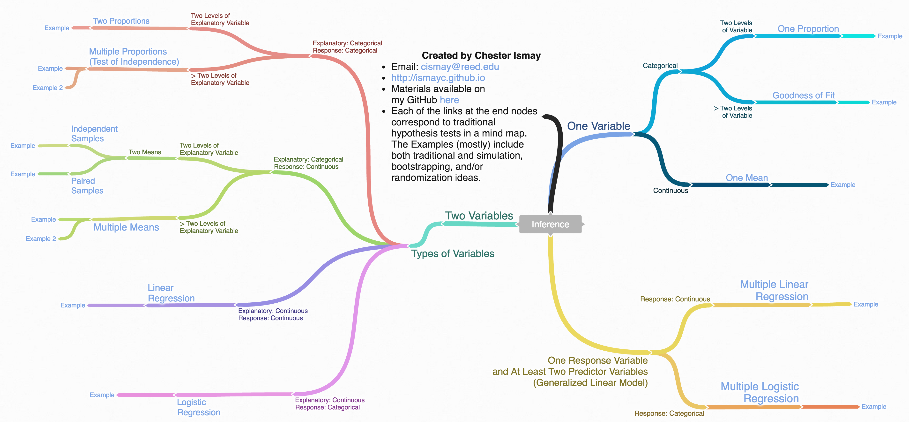

```{r, include=FALSE}
source("_common.R")
```

# 추론 예제 {#appendixB}

이 부록은 다섯 가지 기본적인 가설 검정과 그에 대응하는 신뢰 구간에 대한 예제를 제공하도록 설계되었습니다. 전통적인 이론 기반 방법뿐만 아니라 계산 기반 방법도 함께 제시합니다. <!-- 또한 문제 설정에 따라 어떤 통계 그래프가 가장 적절한지 이해도를 확인하는 용도로 이 부록을 활용할 수도 있습니다. -->

```{block, type='learncheck', purl=FALSE}
**참고: 이 부록은 아직 작성 중입니다. 기여하고 싶으시다면 [GitHub](https://github.com/moderndive/moderndive_book) 프로젝트를 확인해 주세요.**
```

```{r include=FALSE}
# R 코드 청크 기본 설정:
knitr::opts_chunk$set(
  echo = TRUE,
  eval = TRUE,
  warning = FALSE,
  message = TRUE,
  tidy = FALSE,
  purl = TRUE,
  out.width = "\\textwidth",
  fig.height = 4,
  fig.align = "center"
)
```


### 필요한 패키지 {-}

```{r, message=FALSE}
library(tidyverse)
library(infer)
library(janitor)
```

```{r message=FALSE, echo=FALSE, purl=FALSE}
# 내부적으로 필요하지만 책에는 포함되지 않는 패키지
library(kableExtra)
```


## 추론 마인드맵

여러분이 적절한 분석 방법을 더 잘 찾고 선택할 수 있도록, <http://coggle.it>에서 만든 마인드맵을 [여기](https://coggle.it/diagram/Vxlydu1akQFeqo6-)와 아래에 준비했습니다.

```{r infer-map, echo=FALSE, fig.cap="추론을 위한 마인드맵.", out.width="200%"}
if (knitr::is_html_output()) {
  include_url("https://coggle.it/diagram/Vxlydu1akQFeqo6-", height = "1200pt")
} else {
  
}
```


## 단일 평균 (One mean)

### 문제 정의

질병통제예방센터(CDC)에서 실시하는 전국 가족 성장 설문조사(National Survey of Family Growth)는 가족 생활, 결혼과 이혼, 임신, 불임, 피임법 사용, 남성과 여성의 건강에 관한 정보를 수집합니다. 이 설문조사에서 수집된 변수 중 하나는 첫 결혼 연령입니다. 2006년에서 2010년 사이 무작위로 추출된 5,534명의 미국 여성이 설문조사에 참여했습니다. 여기서 샘플링된 여성들은 최소 한 번 이상 결혼한 경험이 있는 사람들입니다. 2006년부터 2010년까지 모든 미국 여성의 평균 첫 결혼 연령이 23세보다 높다는 증거가 있습니까? [@isrs2014 [4장]에서 약간 수정함]


### 대립하는 가설

#### 문장으로 {-}

- 귀무 가설: 2006년부터 2010년까지 모든 미국 여성의 평균 첫 결혼 연령은 23세와 같다.
- 대립 가설: 2006년부터 2010년까지 모든 미국 여성의 평균 첫 결혼 연령은 23세보다 크다.

#### 기호로 (주석 포함) {-}

- $H_0: \mu = \mu_{0}$, 여기서 $\mu$는 2006년부터 2010년까지 모든 미국 여성의 평균 첫 결혼 연령을 나타내며 $\mu_0$는 23이다.
- $H_A: \mu > 23$

#### 알파($\alpha$) 설정 {-}

데이터를 사용해 검정을 시작하기 전에 유의 수준(significance level)을 설정하는 것이 중요합니다. 여기서는 유의 수준을 5%로 설정하겠습니다.


### 표본 데이터 탐색

```{r eval=FALSE}
age_at_marriage <- read_csv("https://moderndive.com/data/ageAtMar.csv")
```

```{r read_data1, echo=FALSE, warning=FALSE, message=FALSE}
age_at_marriage <- read_csv("data/ageAtMar.csv")
```

```{r summarize1}
age_summ <- age_at_marriage %>%
  summarize(
    sample_size = n(),
    mean = mean(age),
    sd = sd(age),
    minimum = min(age),
    lower_quartile = quantile(age, 0.25),
    median = median(age),
    upper_quartile = quantile(age, 0.75),
    max = max(age)
  )
kable(age_summ) %>%
  kable_styling(
    font_size = ifelse(knitr::is_latex_output(), 10, 16),
    latex_options = c("hold_position")
  )
```

아래 히스토그램은 `age` 변수의 분포를 보여줍니다.

```{r hist1b}
ggplot(data = age_at_marriage, mapping = aes(x = age)) +
  geom_histogram(binwidth = 3, color = "white")
```

여기서 관심 있는 관측 통계량(observed statistic)은 표본 평균입니다:

```{r}
x_bar <- age_at_marriage %>%
  specify(response = age) %>%
  calculate(stat = "mean")
x_bar
```

#### 통계적 유의성에 대한 추측 {-}

우리는 관측된 표본 평균인 `r age_summ$mean`이 $\mu_0 = 23$보다 통계적으로 큰지 확인하고자 합니다. 두 값이 꽤 가까워 보이지만, 여기서는 표본 크기가 매우 큽니다. 큰 표본 크기로 인해 실제로는 작은 차이일지라도 귀무 가설을 기각하게 될 것이라고 추측해 봅시다.


### 비전통적 방법

#### 가설 검정을 위한 부트스트래핑 {-}

관측된 표본 평균인 `r age_summ$mean`이 $\mu_0 = 23$보다 통계적으로 큰지 확인하기 위해 표본 크기를 고려해야 합니다. 또한 원래의 크기가 `r nrow(age_at_marriage)`인 표본이 선택된 방식을 재현하는 과정도 결정해야 합니다.

**부트스트래핑(bootstrapping)** 개념을 사용하여 표본이 추출된 모집단을 시뮬레이션하고, 그 시뮬레이션된 모집단에서 표본을 생성하여 표집 변동(sampling variability)을 고려할 수 있습니다. 이 맥락에서 부트스트래핑이 어떻게 적용되는지 상기해 봅시다:

```{r echo=FALSE}
mu0 <- 23
```

1. 원래의 `r nrow(age_at_marriage)`명 여성 표본에서 복원 추출(sample with replacement)을 수행하고 이 과정을 10,000번 반복합니다.
2. 1단계에서 생성된 10,000개의 부트스트랩 표본 각각에 대해 평균을 계산합니다.
3. 2단계에서 계산된 모든 부트스트랩 통계량을 `boot_distn` 객체로 결합합니다.
4. 이 분포의 중심을 귀무값인 `r mu0`로 이동시킵니다. (부트스트래핑 과정에 의해 분포의 중심이 `r age_summ$mean`에 위치하므로 이 작업이 필요합니다.)

```{r, echo=FALSE}
if (!file.exists("rds/null_distn_one_mean.rds")) {
  set.seed(2018)
  null_distn_one_mean <- age_at_marriage %>%
    specify(response = age) %>%
    hypothesize(null = "point", mu = 23) %>%
    generate(reps = 10000) %>%
    calculate(stat = "mean")
  saveRDS(object = null_distn_one_mean, "rds/null_distn_one_mean.rds")
} else {
  null_distn_one_mean <- readRDS("rds/null_distn_one_mean.rds")
}
```
```{r sim1, eval=FALSE}
set.seed(2018)
null_distn_one_mean <- age_at_marriage %>%
  specify(response = age) %>%
  hypothesize(null = "point", mu = 23) %>%
  generate(reps = 10000) %>%
  calculate(stat = "mean")
```
```{r}
null_distn_one_mean %>% visualize()
```

다음으로 이 분포를 사용하여 $p$-값을 관찰할 수 있습니다. 이것은 우측 검정(right-tailed test)이므로 $p$-값을 구하기 위해 `r age_summ$mean`보다 크거나 같은 값을 찾을 것입니다.

```{r}
null_distn_one_mean %>%
  visualize() +
  shade_p_value(obs_stat = x_bar, direction = "greater")
```

##### $p$-값 계산 {-}

```{r}
pvalue <- null_distn_one_mean %>%
  get_pvalue(obs_stat = x_bar, direction = "greater")
pvalue
```

따라서 $p$-값은 `r pvalue`이며 5% 유의 수준에서 귀무 가설을 기각합니다. 위의 히스토그램에서도 우리가 귀무 분포의 꼬리 부분에 아주 멀리 떨어져 있음을 확인할 수 있습니다.

#### 신뢰 구간을 위한 부트스트래핑 {-}

또한 **부트스트래핑**을 필두로 표본 데이터를 사용하여 미지의 모수 $\mu$에 대한 신뢰 구간을 생성할 수 있습니다. 신뢰 구간의 중심이 점 추정치인 $\bar{x}_{obs} = `r x_bar`$가 되기를 원하므로 이 분포를 이동시킬 필요는 없습니다.

```{r, echo=FALSE}
if (!file.exists("rds/boot_distn_one_mean.rds")) {
  boot_distn_one_mean <- age_at_marriage %>%
    specify(response = age) %>%
    generate(reps = 10000) %>%
    calculate(stat = "mean")
  saveRDS(object = boot_distn_one_mean, "rds/boot_distn_one_mean.rds")
} else {
  boot_distn_one_mean <- readRDS("rds/boot_distn_one_mean.rds")
}
```
```{r boot1, eval=FALSE}
boot_distn_one_mean <- age_at_marriage %>%
  specify(response = age) %>%
  generate(reps = 10000) %>%
  calculate(stat = "mean")
```

```{r}
ci <- boot_distn_one_mean %>%
  get_ci()
ci
```

```{r}
boot_distn_one_mean %>%
  visualize() +
  shade_ci(endpoints = ci)
```

`r mu0`가 $\mu$(미지의 모집단 평균)의 타당한 값으로서 이 신뢰 구간 내에 포함되지 않으며, 전체 구간이 `r mu0`보다 크다는 것을 알 수 있습니다. 이는 귀무 가설을 기각하고 대립 가설($\mu > 23$)을 채택한 가설 검정 결과와 일치합니다.

**해석**: 2006년부터 2010년까지 모든 미국 여성의 실제 평균 첫 결혼 연령이 `r ci$lower_ci` 세에서 `r ci$upper_ci` 세 사이임을 95% 확신합니다.


### 전통적 방법

#### 조건 확인 {-}

지름길(공식 기반, 이론적 접근 방식을 사용하려면 몇 가지 조건이 충족되는지 확인해야 합니다.

1. _독립된 관측치_: 관측치가 독립적으로 수집되었습니다.

    무작위 샘플링을 통해 개별 사례들이 독립적으로 선택되었으므로 이 조건이 충족됩니다.

2. _근사적 정규성_: 반응 변수의 분포가 정규 분포이거나 표본 크기가 30 이상이어야 합니다.

    위의 표본 히스토그램은 약간의 비대칭성(skew)을 보여줍니다.
   
아래 Q-Q 플롯 역시 비대칭성을 보여줍니다.

```{r qqplotmean}
ggplot(data = age_at_marriage, mapping = aes(sample = age)) +
  stat_qq()
```

하지만 여기서는 표본 크기가 매우 크므로($n = 5534$) 두 조건이 모두 충족됩니다.

#### 검정 통계량 {-}

검정 통계량은 표본 데이터를 기반으로 하는 확률 변수입니다. 여기서는 모집단 평균 $\mu$를 추정하는 방법을 살펴보고자 합니다. 좋은 추측값은 표본 평균 $\bar{X}$입니다. 이 표본 평균은 사실 서로 다른 표본이 수집됨에 따라 변하는 확률 변수임을 상기하십시오. 우리는 모집단 평균이 `r mu0`라고 가정할 때(귀무 가설이 참이라고 가정할 때), $\bar{x}_{obs} = `r x_bar`$ 이상의 표본 평균을 관찰할 가능성이 얼마나 되는지 확인하고자 합니다. 조건이 충족되고 $H_0$가 참이라고 가정하면, 이 원래의 검정 통계량 $\bar{X}$를 자유도가 $df = n - 1$인 $t$ 분포를 따르는 $T$ 통계량으로 "표준화"할 수 있습니다:

$$ T =\dfrac{ \bar{X} - \mu_0}{ S / \sqrt{n} } \sim t (df = n - 1) $$

여기서 $S$는 표본 표준 편차를 나타내고 $n$은 표본 크기입니다.

##### 관측된 검정 통계량 {-}

이 관측된 검정 통계량을 "손으로" 계산할 수도 있지만, 여기서는 문제 설정과 어떤 검정 통계량 공식이 적용되는지 이해하는 데 중점을 둡니다. `t_test()` 함수를 사용하여 이 분석을 수행할 수 있습니다.

```{r t.test1a}
t_test_results <- age_at_marriage %>%
  t_test(
    formula = age ~ NULL,
    alternative = "greater",
    mu = 23
  )
t_test_results
```

```{r t.test1b, include=FALSE}
t_test_results <- as.data.frame(age_at_marriage %>%
  t_test(
    formula = age ~ NULL,
    alternative = "greater",
    mu = 23
  ))
t_test_results
```

여기서 $t_{obs}$ 값은 `r t_test_results$statistic`임을 알 수 있습니다.

#### $p$-값 계산 {-}

자유도가 5533인 $t$ 분포를 따르는 귀무 분포에서 `r t_test_results$statistic` 이상의 $t_{obs}$ 값을 관찰할 확률인 $p$-값은 사실상 `r t_test_results$p_value`입니다.

#### 결론 진술 {-}

따라서 우리는 귀무 가설을 기각할 충분한 증거가 있습니다. 관측된 표본 평균이 가설로 설정된 평균보다 통계적으로 클 것이라는 우리의 초기 추측은 여기서 뒷받침되었습니다. 이 표본을 바탕으로 2006년부터 2010년까지 모든 미국 여성의 평균 첫 결혼 연령이 23세보다 높다는 증거가 있습니다.

#### 신뢰 구간 {-}

```{r t.test1}
t.test(
  x = age_at_marriage$age,
  alternative = "two.sided",
  mu = 23
)$conf
```


### 결과 비교

생성된 부트스트랩 분포를 관찰해 보면, 이 분포들이 정규 분포와 매우 유사해 보이기 때문에 $p$-값과 신뢰 구간 측면에서 전통적 방법과 비전통적 방법의 결과가 매우 유사하게 나오는 것은 꽤 타당합니다. 조건 또한 충족되었으므로(여기서는 큰 표본 크기가 원천이었습니다), 전통적(공식 기반 방법이든 비전통적(계산 기반 방법이든 어떤 방법을 사용하더라도 유사한 결과로 이어질 것임을 더 잘 추측할 수 있습니다.


## 단일 비율 (One proportion)

### 문제 정의

대형 전기 유틸리티 기업의 CEO는 1,000,000명의 고객 중 80%가 자신이 받는 서비스에 만족하고 있다고 주장합니다. 이 주장을 테스트하기 위해 지역 신문사는 단순 무작위 추출(simple random sampling)을 통해 100명의 고객을 설문조사했습니다. 그 결과 73명이 만족했고 나머지 27명은 불만족했습니다. 이 표본 조사 결과를 바탕으로 고객의 80%가 만족한다는 CEO의 가설을 기각할 수 있습니까? [http://stattrek.com/hypothesis-test/proportion.aspx?Tutorial=AP 에서 약간 수정함]


### 대립하는 가설

#### 문장으로 {-}

- 귀무 가설: 서비스에 만족하는 대형 전기 유틸리티 기업의 전체 고객 비율은 0.80과 같다.
- 대립 가설: 서비스에 만족하는 대형 전기 유틸리티 기업의 전체 고객 비율은 0.80과 다르다.

#### 기호로 (주석 포함 {-}

- $H_0: \pi = p_{0}$, 여기서 $\pi$는 서비스에 만족하는 대형 전기 유틸리티 기업의 전체 고객 비율을 나타내며 $p_0$는 0.8이다.
- $H_A: \pi \ne 0.8$

#### 알파($\alpha$ 설정 {-}

데이터를 사용해 검정을 시작하기 전에 유의 수준을 설정하는 것이 중요합니다. 여기서는 유의 수준을 5%로 설정하겠습니다.


### 표본 데이터 탐색

```{r read_data2}
elec <- c(rep("satisfied", 73), rep("unsatisfied", 27)) %>%
  enframe() %>%
  rename(satisfy = value)
```

아래 막대 그래프는 `satisfy` 변수의 분포를 보여줍니다.

```{r bar}
ggplot(data = elec, aes(x = satisfy)) +
  geom_bar()
```

관측 통계량은 다음과 같이 계산됩니다.

```{r}
p_hat <- elec %>%
  specify(response = satisfy, success = "satisfied") %>%
  calculate(stat = "prop")
p_hat
```

#### 통계적 유의성에 대한 추측 {-}

우리는 이 표본을 바탕으로 표본 비율인 `r pull(p_hat)`이 $p_0 = 0.8$과 통계적으로 다른지 확인하고자 합니다. 두 값이 꽤 가까워 보이고 표본 크기가 그렇게 크지 않으므로($n = 100$), 귀무 가설을 기각할 만한 증거가 충분하지 않을 것이라고 추측해 봅시다.


### 비전통적 방법

#### 가설 검정을 위한 시뮬레이션 {-}

`r pull(p_hat)`이 0.8과 통계적으로 다른지 확인하기 위해 표본 크기를 고려해야 합니다. 또한 100명의 원래 표본이 선택된 방식을 재현하는 과정도 결정해야 합니다. "불공정 코인(unfair coin)"의 개념을 사용하여 이 과정을 **시뮬레이션**할 수 있습니다. 귀무 가설과 일치하게 성공 확률이 0.8인 불공정 코인을 100번 던지는 시뮬레이션을 수행합니다. 그런 다음 100번의 던지기 중 앞면이 몇 번 나오는지 기록합니다. 우리의 시뮬레이션 통계량은 원래 통계량인 $\hat{p}$를 계산한 방식과 일치합니다: 전체 100개의 표본 중 앞면(만족)의 개수입니다. 그런 다음 이 과정을 여러 번(예: 10,000번) 반복하여 시뮬레이션된 성공 비율을 살펴보는 귀무 분포를 생성합니다.

```{r, echo=FALSE}
if (!file.exists("rds/null_distn_one_prop.rds")) {
  set.seed(2018)
  null_distn_one_prop <- elec %>%
    specify(response = satisfy, success = "satisfied") %>%
    hypothesize(null = "point", p = 0.8) %>%
    generate(reps = 10000) %>%
    calculate(stat = "prop")
  saveRDS(object = null_distn_one_prop, "rds/null_distn_one_prop.rds")
} else {
  null_distn_one_prop <- readRDS("rds/null_distn_one_prop.rds")
}
```
```{r sim2, eval=FALSE}
set.seed(2018)
null_distn_one_prop <- elec %>%
  specify(response = satisfy, success = "satisfied") %>%
  hypothesize(null = "point", p = 0.8) %>%
  generate(reps = 10000) %>%
  calculate(stat = "prop")
```

```{r}
null_distn_one_prop %>% visualize()
```

다음으로 이 분포를 사용하여 $p$-값을 관찰할 수 있습니다. 이것은 양측 검정(two-tailed test)이므로 $p$-값을 구하기 위해 0.8에서 $0.8 - 0.73 = 0.07$만큼 **양방향**으로 떨어진 값들을 찾을 것입니다.

```{r}
null_distn_one_prop %>%
  visualize() +
  shade_p_value(obs_stat = p_hat, direction = "both")
```

##### $p$-값 계산 {-}

```{r}
pvalue <- null_distn_one_prop %>%
  get_pvalue(obs_stat = p_hat, direction = "both")
pvalue
```

따라서 $p$-값은 `r pvalue`이며 5% 유의 수준에서 귀무 가설을 기각하는 데 실패했습니다.

#### 신뢰 구간을 위한 부트스트래핑 {-}

또한 표본 데이터를 사용하여 미지의 모수 $\pi$에 대한 신뢰 구간을 생성할 수 있습니다. 이를 위해 다음과 같은 과정의 **부트스트래핑**을 사용합니다.

1. 원래의 100명 설문 응답자 표본에서 복원 추출을 수행하고 이 과정을 10,000번 반복합니다.
2. 1단계에서 생성된 10,000개의 부트스트랩 표본 각각에 대해 성공 비율을 계산합니다.
3. 2단계에서 계산된 모든 부트스트랩 통계량을 `boot_distn` 객체로 결합합니다.
4. 이 분포의 2.5백분위수와 97.5백분위수(선택한 5% 유의 수준에 대응)를 식별하여 $\pi$에 대한 95% 신뢰 구간을 찾습니다.
5. 문제의 맥락에서 이 신뢰 구간을 해석합니다.

```{r, echo=FALSE}
if (!file.exists("rds/boot_distn_one_prop.rds")) {
  boot_distn_one_prop <- elec %>%
    specify(response = satisfy, success = "satisfied") %>%
    generate(reps = 10000) %>%
    calculate(stat = "prop")
  saveRDS(object = boot_distn_one_prop, "rds/boot_distn_one_prop.rds")
} else {
  boot_distn_one_prop <- readRDS("rds/boot_distn_one_prop.rds")
}
```
```{r boot2, eval=FALSE}
boot_distn_one_prop <- elec %>%
  specify(response = satisfy, success = "satisfied") %>%
  generate(reps = 10000) %>%
  calculate(stat = "prop")
```

수치형 변수의 평균을 계산하기 위해 `mean` 함수를 사용하는 것과 마찬가지로, `==` 다음에 "성공"이라고 부르는 값을 지정하여 범주형 변수의 성공 비율을 계산하는 데에도 이 기능을 사용할 수 있습니다. (평균을 계산하는 공식과 R이 `satisfy == "satisfied"`와 같은 논리문을 어떻게 처리하는지 생각해보면 그 이유를 알 수 있습니다.)

```{r}
ci <- boot_distn_one_prop %>%
  get_ci()
ci
```

```{r}
boot_distn_one_prop %>%
  visualize() +
  shade_ci(endpoints = ci)
```

0.80이 $\pi$(미지의 모집단 비율)의 타당한 값으로서 이 신뢰 구간 내에 포함되어 있음을 알 수 있습니다. 이는 귀무 가설 기각에 실패한 가설 검정 결과와 일치합니다.

**해석**: 실제 서비스에 만족하는 고객 비율이 `r ci$lower_ci`에서 `r ci$upper_ci` 사이임을 95% 확신합니다.


### 전통적 방법

#### 조건 확인 {-}

지름길(공식 기반, 이론적 접근 방식을 사용하려면 몇 가지 조건이 충족되는지 확인해야 합니다.

1. _독립된 관측치_: 관측치가 독립적으로 수집되었습니다.

    무작위 샘플링을 통해 개별 사례들이 독립적으로 선택되었으므로 이 조건이 충족됩니다.

2. _근사적 정규성_: 기대되는 성공 횟수와 실패 횟수가 각각 최소 10개 이상이어야 합니다.

    73과 27 모두 10보다 크므로 이 조건이 충족됩니다.

#### 검정 통계량 {-}

검정 통계량은 표본 데이터를 기반으로 하는 확률 변수입니다. 여기서는 모집단 비율 $\pi$를 추정하는 방법을 살펴보고자 합니다. 좋은 추측값은 표본 비율 $\hat{P}$입니다. 이 표본 비율은 사실 서로 다른 표본이 수집됨에 따라 변하는 확률 변수임을 상기하십시오. 우리는 모집단 비율이 0.80이라고 가정할 때(귀무 가설이 참이라고 가정할 때), $\hat{p}_{obs} = `r p_hat`$ 또는 그보다 더 극단적인 표본 비율을 관찰할 가능성이 얼마나 되는지 확인하고자 합니다. 조건이 충족되고 $H_0$가 참이라고 가정하면, 이 원래의 검정 통계량 $\hat{P}$를 $N(0, 1)$ 분포를 따르는 $Z$ 통계량으로 표준화할 수 있습니다.

$$ Z =\dfrac{ \hat{P} - p_0}{\sqrt{\dfrac{p_0(1 - p_0)}{n} }} \sim N(0, 1) $$

##### 관측된 검정 통계량 {-}

관측된 값들을 공식에 대입하여 이 관측 검정 통계량을 "손으로" 계산할 수도 있지만, 여기서는 문제 설정과 어떤 검정 통계량 공식이 적용되는지 이해하는 데 중점을 둡니다. 계산 과정은 완결성을 위해 아래 R 코드로 제시하였습니다.

```{r}
p_hat <- 0.73
p0 <- 0.8
n <- 100
(z_obs <- (p_hat - p0) / sqrt(p0 * (1 - p0) / n))
```

여기서 $z_{obs}$ 값은 약 `r z_obs`임을 알 수 있습니다. 우리가 관측한 표본 비율 `r p_hat`은 가설로 설정된 모수값인 `r p0`보다 `r -z_obs` 표준 오차만큼 작습니다.

#### 시각화 및 $p$-값 계산 {-}

```{r pvaloneprop}
elec %>%
  specify(response = satisfy, success = "satisfied") %>%
  hypothesize(null = "point", p = 0.8) %>%
  assume(distribution = "z") %>%
  visualize() +
  shade_p_value(obs_stat = z_obs, direction = "both")
2 * pnorm(z_obs)
```

우리 귀무 분포에서 `r z_obs` 또는 그보다 더 극단적인(양방향 $z_{obs}$) 값을 관찰할 확률인 $p$-값은 약 `r round(2 * pnorm(z_obs) * 100, 2)`%입니다.

참고로 `prop.test` 함수를 사용하여 이 검정을 직접 수행할 수도 있습니다.

```{r prop.test1}
prop.test(
  x = table(elec$satisfy),
  n = length(elec$satisfy),
  alternative = "two.sided",
  p = 0.8,
  correct = FALSE
)
```

`prop.test`는 여기서 $\chi^2$ 검정을 수행하지만, 이는 우리가 예상한 것과 정확히 일치합니다: $x^2_{obs} = 3.06 = (-1.75)^2 = (z_{obs})^2$ 이며, 양측 검정에 집중하고 있기 때문에 $p$-값도 동일합니다.

위에서 제시된 95% 신뢰 구간이 부트스트래핑을 사용하여 계산된 것과 잘 일치함에 주목하십시오.

#### 결론 진술 {-}

따라서 우리는 귀무 가설을 기각할 충분한 증거가 없습니다. 관측된 표본 비율이 가설로 설정된 비율과 통계적으로 다르지 않다는 우리의 초기 추측은 무효화되지 않았습니다. 이 표본을 바탕으로, 5% 유의 수준에서 대형 전기 유틸리티 기업의 전체 만족 고객 비율이 0.80과 다르다는 증거가 없습니다.


### 결과 비교

생성된 부트스트랩 분포와 귀무 분포를 관찰해 보면, 이 분포들이 정규 분포와 매우 유사해 보이기 때문에 $p$-값과 신뢰 구간 측면에서 전통적 방법과 비전통적 방법의 결과가 매우 유사하게 나오는 것은 꽤 타당합니다. 조건 또한 충족되었으므로, 전통적(공식 기반) 방법이든 비전통적(계산 기반) 방법이든 어떤 방법을 사용하더라도 유사한 결과로 이어질 것임을 더 잘 추측할 수 있습니다.


## 두 비율 (Two proportions)

### 문제 정의

2010년 한 설문조사에서 캘리포니아주에 등록된 유권자 827명을 무작위로 추출하여 다음과 같이 물었습니다. "캘리포니아 연안의 석유 및 천연가스 해상 시추(drilling)를 지지하십니까? 아니면 반대하십니까? 아니면 결정하기에 아는 바가 충분하지 않으십니까?" 이 데이터를 바탕으로, 이 문제에 대해 '의견 없음(no opinion)'을 가진 대졸자의 비율이 비대졸자의 비율과 다르다는 강력한 증거가 있는지 가설 검정을 수행하십시오. [@isrs2014 [6장]에서 약간 수정함]


### 대립하는 가설

#### 문장으로 {-}

- 귀무 가설: 2010년 캘리포니아 등록 유권자 전체에 대해, 해상 시추에 대한 의견 보유 여부와 대학 학위 보유 여부 사이에는 아무런 연관성이 없다.
- 대립 가설: 2010년 캘리포니아 등록 유권자 전체에 대해, 해상 시추에 대한 의견 보유 여부와 대학 학위 보유 여부 사이에는 연관성이 있다.

#### 다른 표현 (문장) {-}

- 귀무 가설: 2010년 캘리포니아 유권자가 해상 시추에 대해 '의견 없음'을 가질 확률은 대졸자와 비대졸자가 **같다**.
- 대립 가설: 이 모수 확률들은 서로 다르다.

#### 기호로 (주석 포함) {-}

- $H_0: \pi_{college} = \pi_{no\_college}$ 또는 $H_0: \pi_{college} - \pi_{no\_college} = 0$, 여기서 $\pi$는 해상 시추에 대해 의견이 없을 확률을 나타낸다.
- $H_A: \pi_{college} - \pi_{no\_college} \ne 0$

#### 알파($\alpha$) 설정 {-}

데이터를 사용해 검정을 시작하기 전에 유의 수준을 설정하는 것이 중요합니다. 여기서는 유의 수준을 5%로 설정하겠습니다.


### 표본 데이터 탐색

```{r eval=FALSE}
offshore <- read_csv("https://moderndive.com/data/offshore.csv")
```

```{r read_data3, echo=FALSE, warning=FALSE, message=FALSE}
offshore <- read_csv("data/offshore.csv")
```

```{r tabyl}
counts <- offshore %>% tabyl(college_grad, response)
counts
```

```{r stats1, include=FALSE}
off_summ <- offshore %>%
  group_by(college_grad) %>%
  summarize(prop_no_opinion = mean(response == "no opinion"), sample_size = n())

# 다음으로 R의 변수 이름에 몇 가지 주요 값을 할당합니다:
phat_nograd <- off_summ$prop_no_opinion[1]
phat_grad <- off_summ$prop_no_opinion[2]
obs_diff <- phat_grad - phat_nograd
n_nograd <- off_summ$sample_size[1]
n_grad <- off_summ$sample_size[2]
```

대졸자 중에서는 `r counts[2, 2]`/(`r counts[2, 2]` + `r counts[2, 3]`) = `r phat_grad` 비율이 해상 시추에 대해 의견이 없음을 알 수 있습니다. 반면, 비대졸자 중에서는 `r counts[1, 2]`/(`r counts[1, 2]` + `r counts[1, 3]`) = `r phat_nograd` 비율이 의견이 없으며, 이 두 비율의 차이는 `r phat_grad` - `r phat_nograd` = `r obs_diff`입니다.

이를 막대 그래프로 시각화해 보겠습니다. 하지만 그 전에 `forcats` 패키지의 `fct_rev()` 함수를 사용하여 범주형 변수 `response`의 레벨 순서를 뒤집습니다. 요인(factor)의 기본 레벨 순서는 알파벳순이기 때문입니다. 우리는 '의견 있음(opinion)'이 아닌 '의견 없음(no opinion)'의 비율에 관심이 있으므로, 기본 알파벳 순서를 뒤집어야 합니다.

```{r stacked_bar}
offshore <- offshore %>%
  mutate(response = fct_rev(response))

ggplot(offshore, aes(x = college_grad, fill = response)) +
  geom_bar(position = "fill") +
  labs(x = "대졸자 여부", y = "해상 시추에 의견이 없는 비율") +
  coord_flip()
```

#### 통계적 유의성에 대한 추측 {-}

우리는 그래프에서 '의견 없음'에 해당하는 막대 크기에 차이가 존재하는지 확인하고자 합니다. 그래프만 보았을 때는 막대 크기가 거의 비슷해 보이므로 차이가 존재한다고 믿을 만한 이유가 거의 없지만... 그 차이가 실제로 통계적으로 유의미한지 확인하기 위해 통계학을 사용하는 것이 중요합니다!


### 비전통적 방법

#### 요약 정보 수집 {-}

관측 통계량은 다음과 같습니다.

```{r}
d_hat <- offshore %>%
  specify(response ~ college_grad, success = "no opinion") %>%
  calculate(stat = "diff in props", order = c("yes", "no"))
d_hat
```

#### 가설 검정을 위한 무작위화 {-}

관측된 대졸자의 의견 없음 비율 `r phat_grad`가 비대졸자의 의견 없음 비율 `r phat_nograd`와 통계적으로 다른지 확인하려면 표본 크기를 고려해야 합니다. 이는 관측된 표본 비율의 차이인 `r obs_diff`가 0과 통계적으로 다른지 확인하는 것과 같습니다. 또한 원래의 그룹 크기인 `r n_nograd`와 `r n_grad`가 선택된 방식을 재현하는 과정도 결정해야 합니다.

**무작위화 검정(randomization testing)** 또는 **순열 검정(permutation testing)** 개념을 사용하여 표본이 추출된 모집단(서로 다른 크기의 두 그룹이 있는)을 시뮬레이션하고, 표집 변동을 고려하기 위해 시뮬레이션된 모집단에서 **셔플링(shuffling)**을 사용하여 표본을 생성할 수 있습니다.

```{r, echo=FALSE}
if (!file.exists("rds/null_distn_two_props.rds")) {
  set.seed(2018)
  null_distn_two_props <- offshore %>%
    specify(response ~ college_grad, success = "no opinion") %>%
    hypothesize(null = "independence") %>%
    generate(reps = 10000) %>%
    calculate(stat = "diff in props", order = c("yes", "no"))
  saveRDS(object = null_distn_two_props, "rds/null_distn_two_props.rds")
} else {
  null_distn_two_props <- readRDS("rds/null_distn_two_props.rds")
}
```
```{r sim3, eval=FALSE}
set.seed(2018)
null_distn_two_props <- offshore %>%
  specify(response ~ college_grad, success = "no opinion") %>%
  hypothesize(null = "independence") %>%
  generate(reps = 10000) %>%
  calculate(stat = "diff in props", order = c("yes", "no"))
```

```{r}
null_distn_two_props %>% visualize()
```

다음으로 이 분포를 사용하여 $p$-값을 관찰할 수 있습니다. 이것은 양측 검정이므로 $p$-값을 구하기 위해 `r abs(obs_diff)`보다 크거나 같거나, `r -abs(obs_diff)`보다 작거나 같은 값들을 찾을 것입니다.

```{r}
null_distn_two_props %>%
  visualize() +
  shade_p_value(obs_stat = d_hat, direction = "both")
```

##### $p$-값 계산 {-}

```{r}
pvalue <- null_distn_two_props %>%
  get_pvalue(obs_stat = d_hat, direction = "two_sided")
pvalue
```

따라서 $p$-값은 `r pvalue`이며 5% 유의 수준에서 귀무 가설을 기각합니다. 위의 히스토그램에서도 우리가 귀무 분포의 꼬리 부분에 아주 멀리 떨어져 있음을 확인할 수 있습니다.

#### 신뢰 구간을 위한 부트스트래핑 {-}

또한 **부트스트래핑**을 사용하여 표본 데이터로부터 미지의 모집단 모수 $\pi_{college} - \pi_{no\_college}$에 대한 신뢰 구간을 생성할 수 있습니다.

```{r, echo=FALSE}
if (!file.exists("rds/boot_distn_two_props.rds")) {
  boot_distn_two_props <- offshore %>%
    specify(response ~ college_grad, success = "no opinion") %>%
    generate(reps = 10000) %>%
    calculate(stat = "diff in props", order = c("yes", "no"))
  saveRDS(object = boot_distn_two_props, "rds/boot_distn_two_props.rds")
} else {
  boot_distn_two_props <- readRDS("rds/boot_distn_two_props.rds")
}
```
```{r boot3, eval=FALSE}
boot_distn_two_props <- offshore %>%
  specify(response ~ college_grad, success = "no opinion") %>%
  generate(reps = 10000) %>%
  calculate(stat = "diff in props", order = c("yes", "no"))
```

```{r}
ci <- boot_distn_two_props %>%
  get_ci()
ci
```

```{r}
boot_distn_two_props %>%
  visualize() +
  shade_ci(endpoints = ci)
```

0이 $\pi_{college} - \pi_{no\_college}$(미지의 모집단 모수)의 타당한 값으로서 이 신뢰 구간 내에 포함되지 않음을 알 수 있습니다. 이는 귀무 가설을 기각한 가설 검정 결과와 일치합니다. 0이 모집단 모수의 타당한 값이 아니므로, 캘리포니아주 대졸자의 해상 시추에 대한 의견 없음 비율이 비대졸자와 다르다는 증거가 있습니다.

**해석**: 캘리포니아의 해상 시추에 대해 의견이 없는 비대졸자의 실제 비율이 대졸자보다 `r round(-ci$lower_ci, 2)` 만큼 더 작거나 `r round(-ci$upper_ci, 2)` 만큼 더 작음을 95% 확신합니다. (참고: 차이의 정의 방식에 따라 방향이 바뀔 수 있습니다.)


### 전통적 방법

#### 조건 확인

지름길(공식 기반, 이론적 접근 방식을 사용하려면 몇 가지 조건이 충족되는지 확인해야 합니다.

1. _독립된 관측치_: 선택된 각 사례는 선택된 다른 모든 사례와 독립적이어야 합니다.

    조사 대상들이 무작위로 선택되었으므로 이 조건이 충족됩니다.

2. _표본 크기_: 각 그룹의 통합 성공 횟수(pooled successes)와 통합 실패 횟수(pooled failures)가 최소 10개 이상이어야 합니다.

    먼저 통합 성공률을 계산해야 합니다: $$\hat{p}_{obs} = \dfrac{131 + 104}{827} = 0.28.$$ 이제 기대되는 (통합된 성공 및 실패 횟수를 결정합니다:
    
    $0.28 \cdot (131 + 258) = `r 0.28 * (131 + 258)`$, $0.72 \cdot (131 + 258) = `r 0.72 * (131 + 258)`$
    
    $0.28 \cdot (104 + 334) = `r 0.28 * (104 + 334)`$, $0.72 \cdot (104 + 334) = `r 0.72 * (104 + 334)`$

3. _표본의 독립적 선택_: 사례들이 어떤 의미 있는 방식으로든 짝지어지지 않았습니다.

    선택된 대졸자가 선택된 비대졸자와 어떤 관계를 가질 것이라고 의심할 이유가 없습니다.

### 검정 통계량

검정 통계량은 표본 데이터를 기반으로 하는 확률 변수입니다. 여기서는 해상 시추에 대한 의견 없음에 대응하는 관측된 표본 비율의 차이($\hat{p}_{college, obs} - \hat{p}_{no\_college, obs}$ = `r prop.table(table(offshore$college_grad, offshore$response))[1, 1] - prop.table(table(offshore$college_grad, offshore$response))[2, 1]`)가 0과 통계적으로 다른지 확인하는 데 관심이 있습니다. 조건이 충족되고 귀무 가설이 참이라고 가정하면, 표준 정규 분포를 사용하여 표본 비율의 차이($\hat{P}_{college} - \hat{P}_{no\_college}$)를 표준화할 수 있습니다. 이때 $\hat{P}_{college} - \hat{P}_{no\_college}$의 표준 오차와 통합 추정치(pooled estimate)를 사용합니다.

$$ Z =\dfrac{ (\hat{P}_{college} - \hat{P}_{no_college}) - 0}{\sqrt{\dfrac{\hat{P}(1 - \hat{P})}{n_1} + \dfrac{\hat{P}(1 - \hat{P})}{n_2} }} \sim N(0, 1) $$ 여기서 $\hat{P} = \dfrac{\text{전체 성공 횟수} }{ \text{전체 사례 수}}$이다.

#### 관측된 검정 통계량 {-}

이 관측된 검정 통계량을 "손으로" 계산할 수도 있지만, 여기서는 문제 설정과 어떤 검정 통계량 공식이 적용되는지 이해하는 데 중점을 둡니다. `prop.test` 함수를 사용하여 이 분석을 수행할 수 있습니다.

```{r prop.test2}
z_hat <- offshore %>%
  specify(response ~ college_grad, success = "no opinion") %>%
  calculate(stat = "z", order = c("yes", "no"))
z_hat
```

관측된 표본 비율의 차이는 0보다 3.16 표준 편차만큼 작습니다.

```{r infer1, include=FALSE, eval=FALSE}
offshore %>%
  specify(response ~ college_grad, success = "no opinion") %>%
  hypothesize(null = "independence") %>%
  calculate(stat = "z", order = c("yes", "no")) %>%
  visualize(method = "theoretical", obs_stat = z_hat, direction = "both")
```

우리 귀무 분포에서 -3.16 또는 그보다 더 극단적인 $Z$ 값을 관찰할 확률인 $p$-값은 0.0016입니다. 이는 R에서 직접 계산할 수도 있습니다.

```{r pval2prop}
2 * pnorm(-3.16, lower.tail = TRUE)
```


### 결론 진술

따라서 우리는 귀무 가설을 기각할 충분한 증거가 있습니다. 대학 교육을 받은 캘리포니아인과 그렇지 않은 캘리포니아인 사이에서 해상 시추에 대한 의견 없음 비율에 통계적으로 유의미한 차이가 존재하지 않을 것이라는 우리의 초기 추측은 무효화되었습니다. 캘리포니아인의 대학 졸업 여부와 해상 시추에 대한 입장 사이에는 종속성(dependency)이 있다는 증거가 있습니다.


### 결과 비교

생성된 부트스트랩 분포와 귀무 분포를 관찰해 보면, 이 분포들이 정규 분포와 매우 유사해 보이기 때문에 $p$-값과 신뢰 구간 측면에서 전통적 방법과 비전통적 방법의 결과가 매우 유사하게 나오는 것은 꽤 타당합니다. 쌍(pairs)의 수가 적어 조건이 완전히 충족되지는 않았지만, 표본 데이터가 심하게 비대칭적이지는 않았습니다. 전통적 공식 기반 방법이든 비전통적 계산 기반 방법이든 어떤 방법을 사용하더라도 유사한 결과로 이어졌습니다.


## Two means (independent samples)

## 두 평균 (독립 표본)

### 문제 정의

평균 소득은 지역마다 다르며, 이는 종종 생활 방식과 지역 생활비를 반영합니다. 어떤 대학 졸업생이 오하이오주 클리블랜드(Cleveland, OH)와 캘리포니아주 새크라멘토(Sacramento, CA 두 지역에서의 취업을 고려하고 있으며, 이 중 한 도시의 평균 소득이 다른 도시보다 높은지 확인하고 싶어 한다고 가정해 보겠습니다. 그는 2000년 인구 조사에서 무작위로 추출된 두 표본을 바탕으로 가설 검정을 실시하고자 합니다. [@isrs2014 [5장]에서 약간 수정함]


### 대립하는 가설

#### 문장으로 {-}

- 귀무 가설: 소득과 지역(클리블랜드, 새크라멘토) 사이에는 아무런 연관성이 없다.
- 대립 가설: 소득과 지역(클리블랜드, 새크라멘토) 사이에는 연관성이 있다.

#### 다른 표현 문장 {-}

- 귀무 가설: 두 도시의 평균 소득은 **같다**.
- 대립 가설: 두 도시의 평균 소득은 서로 다르다.

#### 기호로 주석 포함 {-}

- $H_0: \mu_{sac} = \mu_{cle}$ 또는 $H_0: \mu_{sac} - \mu_{cle} = 0$, 여기서 $\mu$는 평균 소득을 나타낸다.
- $H_A: \mu_{sac} - \mu_{cle} \ne 0$

#### 알파 $\alpha$ 설정 {-}

데이터를 사용해 검정을 시작하기 전에 유의 수준을 설정하는 것이 중요합니다. 여기서는 유의 수준을 5%로 설정하겠습니다.


### 표본 데이터 탐색

```{r eval=FALSE}
cle_sac <- read.delim("https://moderndive.com/data/cleSac.txt") %>%
  rename(
    metro_area = Metropolitan_area_Detailed,
    income = Total_personal_income
  ) %>%
  na.omit()
```

```{r read_data4, echo=FALSE}
cle_sac <- read.delim("data/cleSac.txt") %>%
  rename(
    metro_area = Metropolitan_area_Detailed,
    income = Total_personal_income
  ) %>%
  na.omit()
```

```{r summarize3}
inc_summ <- cle_sac %>%
  group_by(metro_area) %>%
  summarize(
    sample_size = n(),
    mean = mean(income),
    sd = sd(income),
    minimum = min(income),
    lower_quartile = quantile(income, 0.25),
    median = median(income),
    upper_quartile = quantile(income, 0.75),
    max = max(income)
  )
kable(inc_summ) %>%
  kable_styling(
    font_size = ifelse(knitr::is_latex_output(), 10, 16),
    latex_options = c("hold_position")
  )
```

아래 박스 플롯은 각 그룹의 평균을 빨간색 점으로 강조하여 보여줍니다.

```{r boxplot}
ggplot(cle_sac, aes(x = metro_area, y = income)) +
  geom_boxplot() +
  stat_summary(fun = "mean", geom = "point", color = "red")
```

#### 통계적 유의성에 대한 추측 {-}

우리는 설명 변수의 두 수준 도시 사이에 평균 소득의 차이가 존재하는지 확인하고자 합니다. 박스 플롯만 보았을 때는 차이가 존재하지 않는다고 믿을 만한 이유가 있습니다. 소득 분포가 비슷해 보이고 평균도 거의 같은 위치에 있기 때문입니다.


### 비전통적 방법

#### 요약 정보 수집 {-}

이제 관측 통계량을 계산합니다:

```{r stats2, include=FALSE}
# 다음으로 R의 변수 이름에 몇 가지 주요 값을 할당합니다:
xbar_cle <- inc_summ$mean[1]
xbar_sac <- inc_summ$mean[2]
obs_diff <- xbar_sac - xbar_cle
n_cle <- inc_summ$sample_size[1]
n_sac <- inc_summ$sample_size[2]
```

```{r}
d_hat <- cle_sac %>%
  specify(income ~ metro_area) %>%
  calculate(
    stat = "diff in means",
    order = c("Sacramento_ CA", "Cleveland_ OH")
  )
d_hat
```

#### 가설 검정을 위한 무작위화 {-}

관측된 새크라멘토의 표본 평균 `r xbar_cle`이 클리블랜드의 표본 평균 `r xbar_sac`과 통계적으로 다른지 확인하려면 표본 크기를 고려해야 합니다. 이는 $\bar{x}_{sac} - \bar{x}_{cle}$가 0과 통계적으로 다른지 확인하는 것과 같습니다. 또한 원래의 그룹 크기인 `r n_cle`과 `r n_sac`이 선택된 방식을 재현하는 과정도 결정해야 합니다.

**무작위화 검정** 또는 **순열 검정** 개념을 사용하여 표본이 추출된 모집단(서로 다른 크기의 두 그룹이 있는)을 시뮬레이션하고, 표집 변동을 고려하기 위해 시뮬레이션된 모집단에서 **셔플링**을 사용하여 표본을 생성할 수 있습니다.

```{r, echo=FALSE}
if (!file.exists("rds/null_distn_two_means.rds")) {
  set.seed(2018)
  null_distn_two_means <- cle_sac %>%
    specify(income ~ metro_area) %>%
    hypothesize(null = "independence") %>%
    generate(reps = 10000) %>%
    calculate(
      stat = "diff in means",
      order = c("Sacramento_ CA", "Cleveland_ OH")
    )
  saveRDS(object = null_distn_two_means, "rds/null_distn_two_means.rds")
} else {
  null_distn_two_means <- readRDS("rds/null_distn_two_means.rds")
}
```
```{r sim4, eval=FALSE}
set.seed(2018)
null_distn_two_means <- cle_sac %>%
  specify(income ~ metro_area) %>%
  hypothesize(null = "independence") %>%
  generate(reps = 10000) %>%
  calculate(
    stat = "diff in means",
    order = c("Sacramento_ CA", "Cleveland_ OH")
  )
```

```{r}
null_distn_two_means %>% visualize()
```

다음으로 이 분포를 사용하여 $p$-값을 관찰할 수 있습니다. 이것은 양측 검정이므로 $p$-값을 구하기 위해 `r d_hat`보다 크거나 같거나, `r -d_hat`보다 작거나 같은 값들을 찾을 것입니다.

```{r}
null_distn_two_means %>%
  visualize() +
  shade_p_value(obs_stat = d_hat, direction = "both")
```

##### $p$-값 계산 {-}

```{r}
pvalue <- null_distn_two_means %>%
  get_pvalue(obs_stat = d_hat, direction = "both")
pvalue
```

따라서 $p$-값은 `r pvalue`이며 5% 유의 수준에서 귀무 가설을 기각하는 데 실패했습니다. 위의 히스토그램에서도 우리가 귀무 분포의 꼬리 부분에 아주 멀리 떨어져 있지 않음을 확인할 수 있습니다.

#### 신뢰 구간을 위한 부트스트래핑 {-}

또한 **부트스트래핑**을 사용하여 표본 데이터로부터 미지의 모집단 모수 $\mu_{sac} - \mu_{cle}$에 대한 신뢰 구간을 생성할 수 있습니다. 여기서는 셔플링 대신 각 표본을 복원 추출하여 부트스트래핑합니다. 이는 `generate` 함수의 `type` 인수를 "bootstrap"으로 설정하여 수행합니다.

```{r, echo=FALSE}
if (!file.exists("rds/boot_distn_two_means.rds")) {
  boot_distn_two_means <- cle_sac %>%
    specify(income ~ metro_area) %>%
    generate(reps = 10000, type = "bootstrap") %>%
    calculate(
      stat = "diff in means",
      order = c("Sacramento_ CA", "Cleveland_ OH")
    )
  saveRDS(object = boot_distn_two_means, "rds/boot_distn_two_means.rds")
} else {
  boot_distn_two_means <- readRDS("rds/boot_distn_two_means.rds")
}
```
```{r boot4, eval=FALSE}
boot_distn_two_means <- cle_sac %>%
  specify(income ~ metro_area) %>%
  generate(reps = 10000) %>%
  calculate(
    stat = "diff in means",
    order = c("Sacramento_ CA", "Cleveland_ OH")
  )
```

```{r}
ci <- boot_distn_two_means %>%
  get_ci()
ci
```

```{r}
boot_distn_two_means %>%
  visualize() +
  shade_ci(endpoints = ci)
```

0이 $\mu_{sac} - \mu_{cle}$(미지의 모집단 모수)의 타당한 값으로서 이 신뢰 구간 내에 포함되어 있음을 알 수 있습니다. 이는 귀무 가설 기각에 실패한 가설 검정 결과와 일치합니다. 0이 모집단 모수의 타당한 값이므로, 새크라멘토의 소득이 클리블랜드와 다르다는 증거가 없습니다.

**해석**: 새크라멘토 거주자의 실제 연간 평균 소득이 클리블랜드보다 `r round(-ci$lower_ci, 2)` 달러 적은 수준에서 `r round(ci$upper_ci, 2)` 달러 높은 수준 사이임을 95% 확신합니다.

**참고**: 중심을 0이 아닌 $\bar{x}_{sac} - \bar{x}_{cle} = \$`r round(d_hat, 2)`$로 이동시킨 무작위화 기반 귀무 분포를 사용하여 백분위수를 계산할 수도 있습니다. 이 방법으로 구한 신뢰 구간은 위에서 부트스트래핑으로 구한 것과 비슷할 것입니다.


### 전통적 방법

##### 조건 확인 {-}

지름길 공식 기반, 이론적 접근 방식을 사용하려면 몇 가지 조건이 충족되는지 확인해야 합니다.

1. _독립된 관측치_: 두 그룹 모두에서 관측치가 독립적입니다.

    각 도시에서 사례들이 무작위로 선택되었으므로 이 조건이 충족됩니다.

2. _근사적 정규성_: 각 그룹에 대해 반응 변수의 분포가 정규 분포이거나 표본 크기가 최소 30 이상이어야 합니다.

```{r hist}
ggplot(cle_sac, aes(x = income)) +
  geom_histogram(color = "white", binwidth = 20000) +
  facet_wrap(~metro_area)
```

두 히스토그램 모두 정규 모델에서 벗어난 모습을 보여주므로 정규성 가정을 의심할 이유가 있습니다. 하지만 각 그룹의 표본 크기가 100보다 크므로 정규성 가정을 적용할 수 있습니다.

3. _독립 표본_: 표본들이 자연스러운 짝꿍 관계 없이 수집되어야 합니다.

    클리블랜드에서 선택된 사람과 새크라멘토에서 선택된 사람 사이에 어떤 관계가 있다는 언급은 없습니다.


### 검정 통계량

검정 통계량은 표본 데이터를 기반으로 하는 확률 변수입니다. 여기서는 관측된 표본 평균의 차이($\bar{x}_{sac, obs} - \bar{x}_{cle, obs}$ = `r inc_summ$mean[2] - inc_summ$mean[1]`)가 0과 통계적으로 다른지 확인하는 데 관심이 있습니다. 조건이 충족되고 귀무 가설이 참이라고 가정하면, $t$ 분포를 사용하여 표본 평균의 차이($\bar{X}_{sac} - \bar{X}_{cle}$)를 표준화할 수 있습니다. 이때 $\bar{X}_{sac} - \bar{X}_{cle}$의 근사적인 표준 오차를 사용합니다(미지의 $\sigma_{sac}$와 $\sigma_{cle}$의 추정치로 $S_{sac}$와 $S_{cle}$를 동원함).

$$ T =\dfrac{ (\bar{X}_1 - \bar{X}_2 - 0}{ \sqrt{\dfrac{S_1^2}{n_1} + \dfrac{S_2^2}{n_2}}  } \sim t (df = min(n_1 - 1, n_2 - 1) $$ 여기서 1 = 새크라멘토, 2 = 클리블랜드이며, $S_1^2$과 $S_2^2$는 각각 두 도시 소득의 표본 분산이고, $n_1 = 175$(새크라멘토), $n_2 = 212$(클리블랜드)이다.

#### 관측된 검정 통계량 {-}

참고로 `t.test` 함수를 사용하여 이 검정을 (거의 직접 수행할 수도 있습니다. `x`와 `y` 인수는 여기서 모두 수치형 벡터여야 하므로 데이터셋을 적절하게 필터링해야 합니다.

```{r t.test2}
cle_sac %>%
  specify(income ~ metro_area) %>%
  calculate(
    stat = "t",
    order = c("Cleveland_ OH", "Sacramento_ CA")
  )
```

<!--
위에서 보고된 자유도는 우리가 **검정 통계량**에서 지정한 것과 다릅니다. 여기서 사용된 자유도는 새터스웨이트(Satterthwaite 근사법으로도 알려져 있으며 매우 복잡한 공식을 포함합니다. 대부분의 문제에서는 '표본 크기 - 1' 중 더 작은 값을 사용하는 것으로 충분합니다.
-->

여기서 관측된 검정 통계량 값은 약 -1.5임을 알 수 있습니다. <!-- with $df = min(212 - 1, 175 - 1 = 174$.-->

이 관측 검정 통계량을 "손으로" 계산할 수도 있지만, 여기서는 문제 설정과 어떤 검정 통계량 공식이 적용되는지 이해하는 데 중점을 둡니다.

```{r infer2, eval=FALSE, include=FALSE}
cle_sac %>%
  specify(income ~ metro_area) %>%
  hypothesize(null = "independence") %>%
  calculate(
    stat = "t",
    order = c("Sacramento_ CA", "Cleveland_ OH")
  ) %>%
  visualize()
```


### $p$-값 계산

자유도가 174인 $t$ 분포를 따르는 귀무 분포에서 -1.501 또는 그보다 더 극단적인(양방향 $t_{174}$ 값을 관찰할 확률인 $p$-값은 0.13입니다. 이는 R에서 직접 계산할 수도 있습니다:

```{r pval1a}
2 * pt(-1.501, df = min(212 - 1, 175 - 1), lower.tail = TRUE)
```

표준 정규 곡선을 사용하여 근사할 수도 있습니다:

```{r pval2means}
2 * pnorm(-1.501)
```


### 결론 진술

따라서 우리는 귀무 가설을 기각할 충분한 증거가 없습니다. 평균에 통계적으로 유의미한 차이가 존재하지 않는다는 우리의 초기 추측은 이 통계 분석에 의해 뒷받침되었습니다. 이 데이터를 바탕으로 새크라멘토와 클리블랜드 사이에 실제 평균 소득이 다르다고 시사할 만한 증거는 없습니다.


### 결과 비교

생성된 부트스트랩 분포와 귀무 분포를 관찰해 보면, 이 분포들이 정규 분포와 매우 유사해 보이기 때문에 $p$-값과 신뢰 구간 측면에서 전통적 방법과 비전통적 방법의 결과가 매우 유사하게 나오는 것은 꽤 타당합니다. 조건 또한 충족되었으므로, 전통적 공식 기반 방법이든 비전통적 계산 기반 방법이든 어떤 방법을 사용하더라도 유사한 결과로 이어질 것임을 더 잘 추측할 수 있습니다.


## 두 평균 (쌍체 표본)

### 문제 정의 {-}

음용수 내 미량 금속은 맛에 영향을 미치며, 비정상적으로 높은 농도는 건강에 위협이 될 수 있습니다. 강 유역의 무작위로 선정된 10개 지점에서 저층수(bottom water)와 표층수(surface water)의 아연 농도(zinc concentration)를 측정한 10개 쌍의 데이터를 확보했습니다. 이 데이터는 실제 표층수의 평균 농도가 저층수보다 낮다는 것을 시사합니까? (단위는 주어지지 않았습니다. [펜실베이니아 주립대학교의 STAT 500 과정에서 약간 수정함.]


### 대립하는 가설

#### 문장으로 {-}

- 귀무 가설: 서로 다른 쌍체 지점에서 저층수의 평균 농도는 표층수의 평균 농도와 같다.
- 대립 가설: 서로 다른 쌍체 지점에서 표층수의 평균 농도는 저층수의 평균 농도보다 낮다.

#### 기호로 (주석 포함 {-}

- $H_0: \mu_{diff} = 0$, 여기서 $\mu_{diff}$는 표층수 농도에서 저층수 농도를 뺀 평균 차이를 나타낸다.
- $H_A: \mu_{diff} < 0$

#### 알파($\alpha$ 설정 {-}

데이터를 사용해 검정을 시작하기 전에 유의 수준을 설정하는 것이 중요합니다. 여기서는 유의 수준을 5%로 설정하겠습니다.


### 표본 데이터 탐색

```{r eval=FALSE}
zinc_tidy <- read_csv("https://moderndive.com/data/zinc_tidy.csv")
```

```{r read_data5, echo=FALSE, message=FALSE, warning=FALSE}
zinc_tidy <- read_csv("data/zinc_tidy.csv")
```

각 지점별로 `surface - bottom` 차이를 살펴보고자 합니다:

```{r}
zinc_diff <- zinc_tidy %>%
  group_by(loc_id) %>%
  summarize(pair_diff = diff(concentration)) %>%
  ungroup()
```

다음으로 관측 통계량으로서 평균 차이를 계산합니다:

```{r summarize4}
d_hat <- zinc_diff %>%
  specify(response = pair_diff) %>%
  calculate(stat = "mean")
d_hat
```

아래 히스토그램은 `pair_diff` 변수의 분포를 보여줍니다.

```{r hist1a}
ggplot(zinc_diff, aes(x = pair_diff)) +
  geom_histogram(binwidth = 0.04, color = "white")
```

#### 통계적 유의성에 대한 추측 {-}

우리는 표본 쌍체 평균 차이인 `r d_hat`이 통계적으로 0보다 작은지 확인하고자 합니다. 두 값이 꽤 가까워 보이지만, 여기서는 쌍의 개수가 적습니다. 귀무 가설을 기각하는 데 실패할 것이라고 추측해 봅시다.


### 비전통적 방법

```{r stats3, include=FALSE}
#### 요약 정보 수집 {-}
# 다음으로 R의 변수 이름에 몇 가지 주요 값을 할당합니다:
# obs_diff <- zinc_summ %>% select(mean)
# n_pairs <- zinc_summ %>% select(sample_size)
```

#### 가설 검정을 위한 부트스트래핑 {-}

관측된 표본 평균 차이인 $\bar{x}_{diff} = `r d_hat`$이 통계적으로 0보다 작은지 확인하려면 쌍의 개수를 고려해야 합니다. 또한 우리가 원래 표본 평균 차이를 계산한 방식과 유사한 방식으로 쌍체 데이터가 선택되는 과정을 재현하는 과정도 결정해야 합니다.

차이값 자체를 우리의 관심 데이터로 취급하여, **부트스트래핑** 과정을 통해 다른 시뮬레이션된 표본들을 구축하고 부트스트랩 표본들의 평균을 계산합니다. 우리는 평균 차이가 0이라는 가설을 세웁니다.

이 과정은 위에서 본 '단일 평균' 예제와 유사하지만, 두 그룹 사이의 차이를 0이라는 가설적 평균 차이를 가진 단일 표본으로 사용한다는 점이 다릅니다.

```{r, echo=FALSE}
if (!file.exists("rds/null_distn_paired_means.rds")) {
  set.seed(2018)
  null_distn_paired_means <- zinc_diff %>%
    specify(response = pair_diff) %>%
    hypothesize(null = "point", mu = 0) %>%
    generate(reps = 10000) %>%
    calculate(stat = "mean")
  saveRDS(object = null_distn_paired_means, "rds/null_distn_paired_means.rds")
} else {
  null_distn_paired_means <- readRDS("rds/null_distn_paired_means.rds")
}
```
```{r sim5, eval=FALSE}
set.seed(2018)
null_distn_paired_means <- zinc_diff %>%
  specify(response = pair_diff) %>%
  hypothesize(null = "point", mu = 0) %>%
  generate(reps = 10000) %>%
  calculate(stat = "mean")
```

```{r}
null_distn_paired_means %>% visualize()
```

다음으로 이 분포를 사용하여 $p$-값을 관찰할 수 있습니다. 이것은 좌측 검정(left-tailed test)이므로 $p$-값을 구하기 위해 `r d_hat`보다 작거나 같은 값들을 찾을 것입니다.

```{r}
null_distn_paired_means %>%
  visualize() +
  shade_p_value(obs_stat = d_hat, direction = "less")
```

##### $p$-값 계산 {-}

```{r}
pvalue <- null_distn_paired_means %>%
  get_pvalue(obs_stat = d_hat, direction = "less")
pvalue
```

따라서 $p$-값은 사실상 `r pvalue`이며 5% 유의 수준에서 귀무 가설을 기각합니다. 위의 히스토그램에서도 우리가 귀무 분포의 왼쪽 꼬리 부분에 아주 멀리 떨어져 있음을 확인할 수 있습니다.

#### 신뢰 구간을 위한 부트스트래핑 {-}

또한 **부트스트래핑**을 사용하여 표본 데이터(계산된 차이값들)로부터 미지의 모집단 모수 $\mu_{diff}$에 대한 신뢰 구간을 생성할 수 있습니다. 이는 데이터가 원시 수치형 데이터가 아니라 차이값이라는 점을 제외하면 단일 표본 평균 사례에서 수행된 부트스트래핑과 유사합니다. 이 코드는 `hypothesize()` 함수가 호출되지 않는다는 점을 제외하면 위의 가설 검정에 표시된 파이프라인과 동일합니다.

```{r, echo=FALSE}
if (!file.exists("rds/boot_distn_paired_means.rds")) {
  boot_distn_paired_means <- zinc_diff %>%
    specify(response = pair_diff) %>%
    generate(reps = 10000) %>%
    calculate(stat = "mean")
  saveRDS(object = boot_distn_paired_means, "rds/boot_distn_paired_means.rds")
} else {
  boot_distn_paired_means <- readRDS("rds/boot_distn_paired_means.rds")
}
```
```{r boot5, eval=FALSE}
boot_distn_paired_means <- zinc_diff %>%
  specify(response = pair_diff) %>%
  generate(reps = 10000) %>%
  calculate(stat = "mean")
```

```{r}
ci <- boot_distn_paired_means %>%
  get_ci()
ci
```

```{r}
boot_distn_paired_means %>%
  visualize() +
  shade_ci(endpoints = ci)
```

0이 $\mu_{diff}$(미지의 모집단 모수)의 타당한 값으로서 이 신뢰 구간 내에 포함되지 않음을 알 수 있습니다. 이는 귀무 가설을 기각한 가설 검정 결과와 일치합니다. 0이 모집단 모수의 타당한 값이 아니며 신뢰 구간 전체가 0보다 낮게 형성되므로, 표층수의 아연 농도가 평균적으로 저층수보다 낮다는 증거가 있습니다.

**해석**: 실제 표층수의 평균 아연 농도가 저층수보다 `r round(-ci$lower_ci, 2)` 단위 낮은 수준에서 `r round(-ci$upper_ci, 2)` 단위 낮은 수준 사이임을 95% 확신합니다.


### 전통적 방법

#### 조건 확인 {-}

지름길(공식 기반, 이론적 접근 방식을 사용하려면 몇 가지 조건이 충족되는지 확인해야 합니다.

1. _독립된 관측치_: 쌍(pair 사이의 관측치가 독립적입니다.

   지점들이 무작위 샘플링을 통해 독립적으로 선택되었으므로 이 조건이 충족됩니다.

2. _근사적 정규성_: 차이값들의 모집단 분포가 정규 분포이거나 쌍의 개수가 최소 30 이상이어야 합니다.

    위의 히스토그램은 비대칭성을 보여주므로 이 표본을 바탕으로 모집단이 정규 분포일 것이라고 믿기에는 무리가 있습니다. 또한 쌍의 개수가 10개뿐이어서 필요한 30개보다 적습니다. 이론 기반 검정이 여기서는 유효하지 않을 수 있습니다.
    
#### 검정 통계량 {-}

검정 통계량은 표본 데이터를 기반으로 하는 확률 변수입니다. 여기서는 모집단 평균 차이 $\mu_{diff}$를 추정하는 방법을 살펴보고자 합니다. 좋은 추측값은 표본 평균 차이 $\bar{X}_{diff}$입니다. 이 표본 평균은 사실 서로 다른 표본이 수집됨에 따라 변하는 확률 변수임을 상기하십시오. 우리는 모집단 평균 차이가 0이라고 가정할 때(귀무 가설이 참이라고 가정할 때), $\bar{x}_{diff} = `r d_hat`$ 이하의 표본 평균을 관찰할 가능성이 얼마나 되는지 확인하고자 합니다. 조건이 충족되고 $H_0$가 참이라고 가정하면, 이 원래의 검정 통계량 $\bar{X}_{diff}$를 자유도가 $df = n - 1$인 $t$ 분포를 따르는 $T$ 통계량으로 "표준화"할 수 있습니다:

$$ T =\dfrac{ \bar{X}_{diff} - 0}{ S_{diff} / \sqrt{n} } \sim t (df = n - 1) $$

여기서 $S$는 표본 차이값들의 표준 편차를 나타내고 $n$은 쌍의 개수입니다.

##### 관측된 검정 통계량 {-}

이 관측된 검정 통계량을 "손으로" 계산할 수도 있지만, 여기서는 문제 설정과 어떤 검정 통계량 공식이 적용되는지 이해하는 데 중점을 둡니다. 차이값들에 대해 `t_test` 함수를 사용하여 이 분석을 수행할 수 있습니다.

```{r t.test3b}
t_test_results <- zinc_diff %>%
  t_test(
    formula = pair_diff ~ NULL,
    alternative = "less",
    mu = 0
  )
t_test_results
```

```{r t.test3a, include=FALSE}
t_test_results <- as.data.frame(zinc_diff %>%
  t_test(
    formula = pair_diff ~ NULL,
    alternative = "less",
    mu = 0
  ))
t_test_results
```

여기서 $t_{obs}$ 값은 `r t_test_results$statistic`임을 알 수 있습니다.

#### $p$-값 계산 {-}

자유도가 9인 $t$ 분포를 따르는 귀무 분포에서 `r t_test_results$statistic` 이하의 $t_{obs}$ 값을 관찰할 확률인 $p$-값은 `r t_test_results$p_value`입니다. 이는 R에서 직접 계산할 수도 있습니다:

```{r pvalpair}
pt(-4.8638, df = nrow(zinc_diff) - 1, lower.tail = TRUE)
```

#### 결론 진술 {-}

따라서 우리는 귀무 가설을 기각할 충분한 증거가 있습니다. 관측된 표본 평균 차이가 가설로 설정된 평균 0보다 통계적으로 작지 않을 것이라는 우리의 초기 추측은 여기서 무효화되었습니다. 이 표본을 바탕으로, 서로 다른 쌍체 지점에서 저층수의 평균 농도가 표층수의 평균 농도보다 높다는 증거가 있습니다.


### 결과 비교

생성된 부트스트랩 분포와 귀무 분포를 관찰해 보면, 이 분포들이 정규 분포와 매우 유사해 보이기 때문에 $p$-값과 신뢰 구간 측면에서 전통적 방법과 비전통적 방법의 결과가 매우 유사하게 나오는 것은 꽤 타당합니다. 쌍의 개수가 적어 조건이 완전히 충족되지는 않았지만, 표본 데이터가 심하게 비대칭적이지는 않았습니다. 전통적 공식 기반 방법이든 비전통적 계산 기반 방법이든 어떤 방법을 사용하더라도 여기서 유사한 결과로 이어졌습니다.
