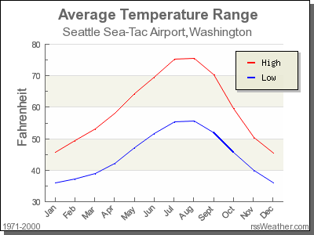

```{r, include=FALSE}
source("_common.R")
```

# 학습 확인 문제 풀이 {#appendixD}

```{r setup_lc_solutions, include=FALSE, purl=FALSE}
knitr::opts_chunk$set(tidy = FALSE, out.width = "\\textwidth")
# This bit of code is a bug fix on asis blocks, which we use to show/not show LC solutions, which are written like markdown text. In theory, it shouldn't be necessary for knitr versions <=1.11.6, but I've found I still need to for everything to knit properly in asis blocks. More info here:
# https://stackoverflow.com/questions/32944715/conditionally-display-block-of-markdown-text-using-knitr
knit_engines$set(asis = function(options) {
  if (options$echo && options$eval) knit_child(text = options$code)
})
```

이 책의 모든 학습 확인 문제에 대한 풀이입니다.


## 1장 풀이

```{r, include=FALSE, purl=FALSE}
chap <- 1
lc <- 0
```

```{r message=FALSE}
library(dplyr)
library(ggplot2)
library(nycflights13)
```

**`r paste0("(LC", chap, ".", (lc <- lc + 1), ")")`** 위의 설치 단계를 반복하되, `dplyr`, `nycflights13`, `knitr` 패키지에 대해 수행하세요. 이렇게 하면 앞서 언급한 `dplyr` 패키지, 2013년 NYC 공항을 출발하는 모든 국내선 항공편 데이터를 포함하는 `nycflights13` 패키지, 그리고 R에서 보고서를 작성하기 위한 `knitr` 패키지가 설치됩니다.

**`r paste0("(LC", chap, ".", (lc <- lc + 1), ")")`** 위의 단계를 반복하여 `dplyr`, `nycflights13`, `knitr` 패키지를 "로드(Load)"하세요.

**풀이**: 다음 코드가 오류 없이 실행된다면 성공입니다!

```{r, eval=FALSE}
library(dplyr)
library(nycflights13)
library(knitr)
```

**`r paste0("(LC", chap, ".", (lc <- lc + 1), ")")`** 이 `flights` 데이터셋의 어느 한 행은 무엇을 나타내나요?

- A. Data on an airline 
- B. Data on a flight
- C. Data on an airport
- D. Data on multiple flights

**Solution**: This is data on a flight. Not a flight path! Example: 

* 비행 경로는 휴스턴행 United 1545편과 같은 것입니다.
* 항공편은 특정 날짜/시간에 운항되는 휴스턴행 United 1545편입니다. 예를 들어, 2013년 1월 1일 오전 5시 15분입니다.


**`r paste0("(LC", chap, ".", (lc <- lc + 1), ")")`** 이 데이터셋에서 **범주형(categorical)** 변수의 예는 무엇입니까? 이들은 **수치형(quantitative)** 변수와 어떻게 다릅니까?

**풀이**: 힌트: 콘솔에 `?flights`를 입력하여 모든 변수들이 무엇을 의미하는지 확인하세요!

* 범주형:
    + `carrier` 항공사
    + `dest` 목적지
    + `flight` 항공편 번호. 비록 숫자이긴 하지만 단순한 이름표(label)일 뿐입니다. 예: United 1545편이 United 1714편보다 "적은" 것이 아닙니다.
* 수치형:
    + `distance` 마일 단위 거리
    + `time_hour` 시간

**`r paste0("(LC", chap, ".", (lc <- lc + 1), ")")`** `airports` 데이터 프레임에서 `lat`, `lon`, `alt`, `tz`, `dst`, `tzone` 각각은 관측 단위의 어떤 속성을 설명하나요? `?airports`를 사용하여 더 많은 정보를 얻을 수 있습니다.

**풀이**: `lat`과 `lon`은 공항의 지리적 좌표를 나타내고, `alt`는 공항의 해발 고도입니다(`airports %>% filter(faa == "DEN")`을 실행하여 덴버 국제공항의 고도를 확인해 보세요). `tz`는 영국 런던 GMT 기준 시차이고, `dst`는 일광 절약 시간대이며, `tzone`은 시간대 라벨입니다.

**`r paste0("(LC", chap, ".", (lc <- lc + 1), ")")`** 최소 3개의 변수를 가진 데이터 프레임에서 하나는 식별 변수(identification variable)이고 나머지 둘은 그렇지 않은 변수들의 이름을 제시하세요. 즉, 이러한 조건을 충족하는 자신만의 깔끔한(tidy) 데이터셋을 만드세요.

**풀이**: 

* LC2.8의 `weather` 예시에서 `origin`, `year`, `month`, `day`, `hour`의 조합은 해당 관측치를 식별하므로 식별 변수입니다.
* 그 외에는 모두 관측값에 해당합니다: `temp`, `humid`, `wind_speed` 등.


***


## 2장 풀이

```{r, include=FALSE, purl=FALSE}
chap <- 2
lc <- 0
```

```{r message=FALSE}
library(nycflights13)
library(ggplot2)
library(dplyr)
```

**`r paste0("(LC", chap, ".", (lc <- lc + 1), ")")`** `nycflights13` 패키지의 `flights` 데이터 프레임과 `moderndive` 패키지의 `alaska_flights` 데이터 프레임을 `View(flights)` 및 `View(alaska_flights)`를 실행하여 살펴보세요. 이 데이터 프레임들은 어떤 점에서 다른가요? 예를 들어, 각 데이터셋의 행 수를 생각해 보세요.

**풀이**: `flights`는 모든 항공편 데이터를 포함하는 반면, `alaska_flights`는 알래스카 항공사인 "AS"의 데이터만 포함합니다. `flights`는 `r nrow(flights)`개의 행을 가지고 있는 반면 `alaska_flights`는 `r nrow(alaska_flights)`개의 행만 가지고 있음을 알 수 있습니다.

**`r paste0("(LC", chap, ".", (lc <- lc + 1), ")")`** `dep_delay`(출발 지연)와 `arr_delay`(도착 지연)가 양의 관계를 갖는 몇 가지 실제적인 이유는 무엇일까요?

**풀이**: 비행기가 늦게 출발할수록 일반적으로 늦게 도착하게 됩니다.

**`r paste0("(LC", chap, ".", (lc <- lc + 1), ")")`** `weather` 데이터 프레임의 어떤 변수가 `dep_delay`와 음의 상관관계(즉, `dep_delay`와 음의 관계)를 가질 것으로 예상되나요? 그 이유는 무엇인가요? 여기서는 수치형 변수에 집중하고 있음을 기억하세요. 힌트: `View()` 함수를 사용하여 `weather` 데이터셋을 탐색해 보세요.

**풀이**: `weather` 데이터셋의 한 예는 마일 단위로 시정(visibility)을 측정하는 `visib`입니다. 시정이 좋아질수록 출발 지연은 줄어들 것으로 예상할 수 있습니다.

**`r paste0("(LC", chap, ".", (lc <- lc + 1), ")")`** 왜 (0, 0) 근처에 점들이 모여 있다고 생각하나요? 알래스카 항공편의 관점에서 (0, 0)은 무엇에 해당하나요?

**풀이**: 점 (0, 0)은 출발과 도착 모두 지연이 없음을 의미합니다. 알래스카 항공의 관점에서 이는 항공편이 정시에 운항되었음을 의미합니다. 대부분의 항공편이 최소한 정시에 가깝게 운항되는 것으로 보입니다.

**`r paste0("(LC", chap, ".", (lc <- lc + 1), ")")`** 이 그래프에서 눈에 띄는 다른 특징은 무엇인가요?

**풀이**: 질문에 따라 답이 다를 수 있습니다. 한 가지 답은 대부분의 항공편이 1시간 미만으로 늦게 출발하고 도착한다는 것입니다.

**`r paste0("(LC", chap, ".", (lc <- lc + 1), ")")`** 위의 예시를 수정하여 `alaska_flights` 데이터 프레임의 다른 변수들을 사용한 새로운 산점도를 생성하세요.

**풀이**: 여러 가지 가능성이 있습니다. 아래 그래프를 참조하세요. 예정된 출발 시간에 따라 출발 지연에 패턴이 있나요? 흥미롭게도, 항공편이 출발하는 시간대는 단 두 블록인 것으로 보입니다.

```{r}
ggplot(data = alaska_flights, mapping = aes(x = dep_time, y = dep_delay)) +
  geom_point()
```

**`r paste0("(LC", chap, ".", (lc <- lc + 1), ")")`** 산점도에서 `alpha` 인자 값을 설정하는 것이 왜 유용할까요? 일반 산점도가 제공하지 못하는 어떤 추가 정보를 제공하나요?

**풀이**: 점들을 옅게 만들어 겹침(overplotting) 문제를 해결해 줍니다. 하지만 더 중요한 것은 점들의 (통계적) **밀도(density)**와 **분포(distribution)**에 대한 힌트를 준다는 점입니다. 즉, 점들이 어디에 집중되어 있고 어디서 발생하는지를 보여줍니다.

**`r paste0("(LC", chap, ".", (lc <- lc + 1), ")")`** 위의 그림 @fig-alpha를 보고, 가장 빈번하게 발생하는 도착 지연과 출발 지연의 대략적인 범위를 제시하세요. `alpha = 0.2`를 설정하지 않은 그림 @fig-noalpha와 비교했을 때 해당 영역이 어떻게 변했나요?

**풀이**: 아래쪽 그래프는 NYC에서 출발하는 대부분의 알래스카 항공편이 예정 시간보다 12분 일찍 출발하거나 정시에 출발하고, 50분 일찍 도착하거나 정시에 도착함을 시사합니다.

**`r paste0("(LC", chap, ".", (lc <- lc + 1), ")")`** `nycflights13` 패키지의 `weather` 데이터 프레임과 `moderndive` 패키지의 `early_january_weather` 데이터 프레임을 `View(weather)` 및 `View(early_january_weather)`를 실행하여 살펴보세요. 이 데이터 프레임들은 어떤 점에서 다른가요?

**풀이**: `early_january_weather`의 행들은 `weather`의 부분 집합입니다.

**`r paste0("(LC", chap, ".", (lc <- lc + 1), ")")`** `flights` 데이터 프레임을 다시 `View()` 해보세요. 왜 `time_hour` 변수는 측정 시간을 고유하게 식별하는 반면, `hour` 변수는 그렇지 못할까요?

**풀이**: 시간을 고유하게 식별하려면 `year`/`month`/`day`/`hour` 시퀀스가 필요하지만, `hour`에는 가능한 값이 24개뿐이기 때문입니다.

**`r paste0("(LC", chap, ".", (lc <- lc + 1), ")")`** 가로축에 명확한 순서가 없을 때 왜 선 그래프를 피해야 하나요?

**풀이**: 선은 연결성과 순서를 암시하기 때문입니다.

**`r paste0("(LC", chap, ".", (lc <- lc + 1), ")")`** 시간이 설명 변수일 때 왜 선 그래프가 자주 사용되나요?

**풀이**: 시간은 연속적이기 때문입니다. 즉, 연이은 관측치들은 서로 밀접하게 연관되어 있습니다.

**`r paste0("(LC", chap, ".", (lc <- lc + 1), ")")`** 2013년 1월 첫 15일 동안 뉴어크 공항의 `temp` 이외의 다른 변수에 대한 시계열 그래프를 그리세요.

**풀이**: 습도(`humid`)가 살펴보기 좋은 변수입니다. 하루의 주기와 매우 밀접하게 연관되어 있기 때문입니다.
```{r}
ggplot(data = early_january_weather, mapping = aes(x = time_hour, y = humid)) +
  geom_line()
```

**`r paste0("(LC", chap, ".", (lc <- lc + 1), ")")`** 빈(`bin`)의 수를 30개에서 40개로 바꾸었을 때 기온의 분포에 대해 무엇을 알 수 있나요?

**풀이**: 분포가 크게 변하지는 않습니다. 하지만 빈 너비를 정교하게 조정함으로써 기온 데이터가 높은 정확도를 가지고 있음을 알 수 있습니다. 여기서 정확도란 무엇을 의미할까요? `View(weather)`를 통해 `temp` 변수를 살펴보면, 각 기온 기록의 정밀도가 소수점 둘째 자리까지임을 알 수 있습니다.

**`r paste0("(LC", chap, ".", (lc <- lc + 1), ")")`** 기온의 분포를 대칭형(symmetric) 또는 비대칭형(skewed) 중 어디로 분류하겠습니까?

**풀이**: 분포의 한쪽에만 __긴 꼬리(long tails)__가 있지 않으므로 꽤 대칭적입니다.

**`r paste0("(LC", chap, ".", (lc <- lc + 1), ")")`** 이 분포의 "중심" 값은 얼마라고 추측하나요? 왜 그렇게 선택했나요?

**풀이**: 중심은 약 `r mean(weather$temp, na.rm=TRUE)`°F 근처입니다. `summary()` 명령을 실행해 보면 평균과 중앙값이 매우 비슷함을 알 수 있습니다. 사실, 분포가 대칭적일 때 평균은 중앙값과 같습니다.

**`r paste0("(LC", chap, ".", (lc <- lc + 1), ")")`** 이 데이터는 중심에서 크게 퍼져 있나요, 아니면 가깝게 모여 있나요? 왜 그렇게 생각하나요?

**풀이**: 이는 상대적으로만 답할 수 있는 질문입니다! 워싱턴주 시애틀의 기온과 비교해 봅시다.

```{r SEATAC, out.width='40%', echo=FALSE, fig.cap="Annual temperatures at SEATAC Airport.", purl=FALSE}

```

시애틀의 기온 중심은 55°F로 비슷해 보이지만, 기온은 거의 35°F에서 75°F 사이로 분포하여 범위가 약 40°F 정도입니다. 시애틀의 기온은 뉴욕보다 훨씬 덜 퍼져 있습니다. 즉, 일 년 내내 훨씬 더 일정합니다. 반면 뉴욕은 겨울에는 훨씬 더 춥고 여름에는 훨씬 더 더운 날들이 많습니다. 달리 표현하면, 사분위수 범위(IQR)로 구분되는 중앙 50%의 값 범위가 30°F입니다.

**`r paste0("(LC", chap, ".", (lc <- lc + 1), ")")`** 위의 면 분할(faceted) 그래프에서 또 무엇을 발견했나요? 면 분할 그래프가 두 변수 사이의 관계를 파악하는 데 어떤 도움을 주나요?

**풀이**: 

* 특정 월은 기온이 매우 일정하고(특히 8월), 1월이나 10월 같은 달은 계절의 변화를 나타내듯 변화가 매우 심합니다.
* `temp` 기록이 `month`별로 나뉘어 있으므로, 우리는 이 두 변수 사이의 관계를 고려하게 됩니다. 예를 들어 여름철에는 기온이 더 높은 경향이 있습니다.
**`r paste0("(LC", chap, ".", (lc <- lc + 1), ")")`** 위의 그래프에서 숫자 1-12는 각각 무엇을 의미하나요? 25, 50, 75, 100은 무엇인가요?

**풀이**: 

* 이들은 항공편이 운항된 달(month)을 나타냅니다. 달은 기술적으로 1-12 사이의 숫자이지만, 여기서는 범주형 변수로 간주하고 있습니다. 특히 카테고리에 순서가 있으므로 이는 **순서형 범주형(ordinal categorical)** 변수입니다.
* 25, 50, 75, 100은 기온입니다.

**`r paste0("(LC", chap, ".", (lc <- lc + 1), ")")`** 변수 사이의 관계를 비교할 때 이러한 면 분할 그래프가 잘 작동하지 않는 데이터셋 유형은 무엇일까요? 이러한 변수들의 성격과 다른 중요한 특징들을 설명하는 예를 제시해 보세요.

**풀이**: 

* 면(facet)의 수가 매우 많으면 잘 작동하지 않을 것입니다. 예를 들어, 달(month) 대신 개별 일(day)로 면 분할을 한다면 365개의 면을 봐야 합니다. 2013년 전체 일수를 고려할 때, 하루하루의 기온 변동보다는 월별 기온 변동에 관심을 가짐으로써 계절적 추세에 집중할 수 있습니다.

**`r paste0("(LC", chap, ".", (lc <- lc + 1), ")")`** `weather` 데이터셋의 `temp` 변수는 가변성(variability)이 큰 편인가요? 왜 그렇게 생각하나요?

**풀이**: LC `r paste0("(LC", chap, ".", (lc-4), ")")`와 마찬가지로 이는 상대적인 질문입니다. 뉴욕시는 날씨가 서로 다른 뚜렷한 4계절이 있으므로 그렇다고 답하겠습니다. 반면 워싱턴주 시애틀이나 오리건주 포틀랜드는 여름과 비 오는 계절, 두 가지만 있습니다!

**`r paste0("(LC", chap, ".", (lc <- lc + 1), ")")`** 5월 그래프 하단에 있는 점은 무엇을 의미하나요? 5월에 어떤 일이 발생하여 이런 점이 생겼을지 설명해 보세요.

**풀이**: 이상치(outlier)인 것으로 보입니다. 이를 자세히 살펴보기 위해 `filter` 명령을 다시 사용해 봅시다. `month`가 5이고 `temp < 25`인 모든 데이터 포인트를 찾아보겠습니다.

```{r}
weather %>%
  filter(month == 5 & temp < 25)
```

5월에 JFK 공항에서 13.1°F (-10.5°C)가 기록된 시간은 단 한 시간뿐인 것으로 보입니다. 이는 아마도 데이터 입력 오류일 것입니다! 왜 EWR(뉴어크)과 LGA(라과디아)의 날씨는 최소한 비슷하지 않았을까요?

**`r paste0("(LC", chap, ".", (lc <- lc + 1), ")")`** 어느 달에 기온의 가변성이 가장 높나요? 그 이유는 무엇이라고 생각하나요?

**풀이**: 이제 우리는 데이터의 **퍼짐(spread)**에 관심이 있습니다. 여러분 중 일부는 이전에 표준편차라는 측정치를 보았을 수 있습니다. 하지만 이 그래프에서는 사분위수 범위(IQR)를 읽어낼 수 있습니다.

* 제1사분위수부터 제3사분위수까지의 거리, 즉 상자의 길이입니다.
* 이를 데이터 **중앙 50%**의 퍼짐 정도로 생각할 수도 있습니다.

눈으로 확인해 보면 다음과 같습니다.

* 11월의 IQR이 가장 큰데(상자가 가장 넓음), 따라서 기온 변화가 가장 심합니다.
* 8월의 IQR이 가장 작은데(상자가 가장 좁음), 따라서 기온 측면에서 가장 일정합니다.

각 월별 정확한 IQR 값을 계산하는 법은 다음과 같습니다(본문의 @sec-wrangling 장에서 더 자세히 다룰 것입니다).

1. 관측치를 `month`로 그룹(`group`)화합니다.
2. 각 그룹(즉, `month`)에 대해 요약 통계 함수 `IQR()`을 적용하여 `summarize` 하되, `na.rm=TRUE`를 통해 결측 데이터는 건너뛰도록 합니다.
3. `IQR`의 내림차순(`desc`)으로 표를 정렬(`arrange`)합니다.

```{r, eval=FALSE}
weather %>%
  group_by(month) %>%
  summarize(IQR = IQR(temp, na.rm = TRUE)) %>%
  arrange(desc(IQR))
```
```{r, echo=FALSE}
weather %>%
  group_by(month) %>%
  summarize(IQR = IQR(temp, na.rm = TRUE)) %>%
  arrange(desc(IQR)) %>%
  kable()
```

**`r paste0("(LC", chap, ".", (lc <- lc + 1), ")")`** We looked at the distribution of the numerical variable `temp` split by the numerical variable `month` that we converted to a categorical variable using the `factor()` function. Why would a boxplot of `temp` split by the numerical variable `pressure` similarly converted to a categorical variable using the `factor()` not be informative?

**Solution**: Because there are 12 unique values of `month` yielding only 12 boxes in our boxplot. There are many more unique values of `pressure` (`r weather$pressure %>% unique() %>% length()` unique values in fact), because values are to the first decimal place. This would lead to `r weather$pressure %>% unique() %>% length()` boxes, which is too many for people to digest. 

**`r paste0("(LC", chap, ".", (lc <- lc + 1), ")")`** 박스 플롯은 이상치를 식별하는 간단한 방법을 제공합니다. 면 분할 히스토그램을 볼 때보다 박스 플롯을 볼 때 이상치를 식별하기가 왜 더 쉬울까요?

**풀이**: 히스토그램에서는 이상치가 있는 빈(bin)의 높이가 너무 낮아서 보이지 않을 수 있습니다. 박스 플롯에서는 이상치가 별도로 명확하게 표시됩니다.

**`r paste0("(LC", chap, ".", (lc <- lc + 1), ")")`** 왜 범주형 변수를 시각화하는 데 히스토그램이 부적절한가요?

**풀이**: 히스토그램은 수치형 변수를 위한 것입니다. 즉, 히스토그램 막대의 가로 부분은 구간을 나타내지만, 범주형 변수의 각 막대는 범주형 변수의 한 수준(level)만을 나타내기 때문입니다.

**`r paste0("(LC", chap, ".", (lc <- lc + 1), ")")`** 히스토그램과 막대 그래프(barplot)의 차이점은 무엇인가요?

**풀이**: 위 답변을 참고하세요.

**`r paste0("(LC", chap, ".", (lc <- lc + 1), ")")`** 2013년에 NYC에서 출발한 Envoy Air 항공편은 몇 편인가요?

**풀이**: Envoy Air의 항공사 코드는 `MQ`이며, 2013년에 NYC에서 26,397편이 출발했습니다.

**`r paste0("(LC", chap, ".", (lc <- lc + 1), ")")`** 2013년 NYC에서 출발한 항공편 수 기준으로 7위를 차지한 항공사는 어디입니까? 이 답을 빨리 얻기 위해 표를 어떻게 더 잘 제시할 수 있을까요?

**풀이**: 정답은 US, 즉 U.S. Airways이며 20,536편입니다. 하지만 행이 항공사 코드별로 알파벳 순 정렬되어 있을 때 7위 항공사를 골라내는 것은 어렵습니다. 행이 숫자에 따라 정렬되어 있다면 더 쉬울 것입니다. 데이터 전처리에 관한 @sec-wrangling 장에서 이 방법을 배울 것입니다.

**`r paste0("(LC", chap, ".", (lc <- lc + 1), ")")`** 왜 원 그래프(pie chart)를 피하고 막대 그래프로 대체해야 하나요?

**풀이**: 저희 **의견**으로는, 원의 각도와 면적을 비교하는 것보다 수평선을 사용하여 비교하는 것이 더 쉽기 때문입니다.

**`r paste0("(LC", chap, ".", (lc <- lc + 1), ")")`** 원 그래프가 계속 사용되는 이유에 대해 어떻게 생각하시나요?

**풀이**: 저희 **의견**으로는, 일반적으로 원 그래프가 막대 그래프보다 데이터를 전달하는 효율적인 방법이 아니라고 생각합니다. 사람의 뇌는 척도가 없기 때문에 각도의 크기를 비교하는 데 서툴고, 그에 비해 막대 그래프에서 막대의 높이를 비교하는 것이 훨씬 쉽습니다. 하지만 어떤 상황에서는, 예를 들어 샘플 크기의 25%와 75%를 나타낼 때, 높은 막대가 다른 막대보다 높이가 3배인 막대 그래프가 있다면 라벨 없이는 비교 척도를 말하기 어려울 수 있습니다. 하지만 원 그래프에서는 원이 75%와 25%로 나뉘어 있다면 비교하기 쉬울 것입니다. (더 자세한 내용은 https://www.displayr.com/why-pie-charts-are-better-than-bar-charts/ 를 참고하세요.)

**`r paste0("(LC", chap, ".", (lc <- lc + 1), ")")`** 위의 그림을 보고 어떤 종류의 질문에 답하기 어려운가요?

**풀이**: 빨간색, 초록색, 파란색 막대가 모두 0에서 시작하지 않기 때문에(빨간색만 0에서 시작함) 개수를 비교하기가 어렵습니다.

**`r paste0("(LC", chap, ".", (lc <- lc + 1), ")")`** 2013년 NYC에서 출발하는 항공편 수와 관련하여 항공사와 공항 사이의 관계에 대해 무엇을 말할 수 있나요?

**풀이**: 항공사마다 선호하는 공항이 다릅니다. 예를 들어 유나이티드(United)는 주로 뉴어크 공항을 이용하고, 제트블루(JetBlue)는 JFK 공항을 이용합니다. 항공사가 공항을 선호하지 않았다면 각 색상 막대는 전체의 대략 3분의 1씩 차지했을 것입니다.

**`r paste0("(LC", chap, ".", (lc <- lc + 1), ")")`** 이 경우 왜 나란히 놓인(side-by-side, 일명 dodged) 막대 그래프가 누적 막대 그래프보다 선호될까요?

**풀이**: 하나의 비교선을 사용하여 특정 항공사의 서로 다른 공항들을 쉽게 비교할 수 있기 때문입니다. 즉, 항목들이 나란히 정렬되어 있습니다.

**`r paste0("(LC", chap, ".", (lc <- lc + 1), ")")`** 일반적으로 나란히 놓인 막대 그래프를 사용할 때의 단점은 무엇인가요?

**풀이**: 각 항공사별 전체 합계를 파악하기 어렵습니다.

**`r paste0("(LC", chap, ".", (lc <- lc + 1), ")")`** 이 경우 왜 면 분할 막대 그래프가 나란히 놓인 막대 그래프나 누적 막대 그래프보다 선호되나요?

**풀이**: 나란히 놓인 것과 큰 차이는 없으며, 여러분이 정보를 어떻게 구성하여 보여주고 싶은지에 달려 있습니다.

**`r paste0("(LC", chap, ".", (lc <- lc + 1), ")")`** 면 분할 막대 그래프에서 각 공항의 서로 다른 항공사에 대해 어떤 정보를 더 쉽게 볼 수 있나요?

**풀이**: 이제 특정 공항 **내에서** 서로 다른 항공사들을 쉽게 비교할 수 있습니다. 예를 들어, 하나의 수평선을 사용하여 각 공항의 최고 항공사가 누구인지 쉽게 읽어낼 수 있습니다.


***


## 3장 풀이

```{r, include=FALSE, purl=FALSE}
chap <- 3
lc <- 0
```

```{r message=FALSE}
library(dplyr)
library(ggplot2)
library(nycflights13)
``` 


**`r paste0("(LC", chap, ".", (lc <- lc + 1), ")")`** `flights` 데이터 프레임에서 버몬트주 벌링턴(`BTV`)이나 워싱턴주 시애틀(`SEA`)로 가지 않는 행들만 필터링하기 위해 "not" 연산자 `!`를 사용하는 또 다른 방법은 무엇일까요? 위의 코드를 사용하여 이를 테스트해 보세요.

**풀이**: 

```{r, eval=FALSE, purl=FALSE}
# Original in book
not_BTV_SEA <- flights %>%
  filter(!(dest == "BTV" | dest == "SEA"))

# Alternative way
not_BTV_SEA <- flights %>%
  filter(!dest == "BTV" & !dest == "SEA")

# Yet another way
not_BTV_SEA <- flights %>%
  filter(dest != "BTV" & dest != "SEA")
```


**`r paste0("(LC", chap, ".", (lc <- lc + 1), ")")`** 한 의사가 5년 간격으로 기록이 측정된 수많은 환자를 대상으로 흡연이 폐암에 미치는 영향을 연구하고 있다고 가정해 봅시다. 그녀는 많은 환자가 사망하여 데이터 포인트가 누락된 것을 발견하고, 분석에서 이 환자들을 무시하기로 결정했습니다. 이 의사의 접근 방식의 문제점은 무엇인가요?

**풀이**: 누락된 환자들은 폐암으로 사망했을 수 있습니다! 따라서 이들을 무시하는 것은 결과에 심각한 **편향(bias)**을 초래할 수 있습니다! 결측 데이터를 무시했을 때 분석에 어떤 결과가 초래될지 생각하는 것은 매우 중요합니다! 스스로에게 다음과 같이 질문해 보세요.

* 특정 값이 누락된 체계적인 이유가 있는가? 그렇다면 결과에 편향이 생길 수 있습니다!
* 그렇지 않다면, 결측값을 "무시해도" 괜찮을 수 있습니다.

**`r paste0("(LC", chap, ".", (lc <- lc + 1), ")")`** 위의 `summarize` 함수를 수정하여 `summary_temp`를 생성할 때 `n()` 요약 함수도 사용해 보세요 (`summarize(count = n())`). 반환된 값은 무엇을 의미하나요?

**풀이**: 이는 관측치/행의 개수에 해당합니다.

```{r, purl=FALSE}
weather %>%
  summarize(count = n())
```

**`r paste0("(LC", chap, ".", (lc <- lc + 1), ")")`** 왜 다음 코드는 작동하지 않을까요? 코드를 한꺼번에 실행하지 말고 한 줄씩 실행한 후 데이터를 살펴보세요. 즉, `summary_temp <- weather %>% summarize(mean = mean(temp, na.rm = TRUE))`를 먼저 실행해 보세요.

```{r eval=FALSE}
summary_temp <- weather %>%
  summarize(mean = mean(temp, na.rm = TRUE)) %>%
  summarize(std_dev = sd(temp, na.rm = TRUE))
```

**풀이**: 처음 두 줄만 실행했을 때의 출력 결과를 고려해 보세요.

```{r, purl=FALSE}
weather %>%
  summarize(mean = mean(temp, na.rm = TRUE))
```

첫 번째 `summarize()` 이후에 `temp` 변수는 `mean` 값으로 요약되어 사라지기 때문입니다. 따라서 두 번째 `summarize()`를 실행하려고 하면 표준편차를 계산할 `temp` 변수를 찾을 수 없습니다. 

**`r paste0("(LC", chap, ".", (lc <- lc + 1), ")")`** NYC의 월별 기온을 살펴봤던 @sec-viz 장을 떠올려 보세요. `summary_monthly_temp` 데이터 프레임의 표준편차 열은 일 년 동안 뉴욕시의 기온에 대해 무엇을 말해주나요?

**풀이**: 

```{r, echo=FALSE, purl=FALSE}
summary_temp_by_month <- weather %>%
  group_by(month) %>%
  summarize(
    mean = mean(temp, na.rm = TRUE),
    std_dev = sd(temp, na.rm = TRUE)
  )

kable(summary_temp_by_month) %>%
  kable_styling(
    font_size = ifelse(knitr::is_latex_output(), 10, 16),
    latex_options = c("hold_position")
  )
```

표준편차는 **퍼짐(spread)**과 **가변성(variability)**을 수치화한 것입니다. 11월, 12월, 1월 기간에 날씨 변화가 가장 심하므로, 날마다 매우 다른 기온을 예상할 수 있음을 알 수 있습니다.

**`r paste0("(LC", chap, ".", (lc <- lc + 1), ")")`** 2013년 NYC의 매일매일 평균 기온과 표준편차를 구하려면 어떤 코드가 필요할까요?

**풀이**: 

```{r, purl=FALSE}
summary_temp_by_day <- weather %>%
  group_by(year, month, day) %>%
  summarize(
    mean = mean(temp, na.rm = TRUE),
    std_dev = sd(temp, na.rm = TRUE)
  )
summary_temp_by_day
```

참고: `group_by(day)`만으로는 부족합니다. `day`는 1에서 31 사이의 값이기 때문입니다. `group_by(year, month, day)`가 필요합니다. 

```{r, purl=FALSE}
library(dplyr)
library(nycflights13)

summary_temp_by_month <- weather %>%
  group_by(month) %>%
  summarize(
    mean = mean(temp, na.rm = TRUE),
    std_dev = sd(temp, na.rm = TRUE)
  )
```

**`r paste0("(LC", chap, ".", (lc <- lc + 1), ")")`** `by_monthly_origin`을 다시 만들어 보되, `group_by(origin, month)` 대신 변수 순서를 바꿔서 `group_by(month, origin)`으로 그룹화해 보세요. 결과 데이터셋에서 무엇이 달라지나요?

**풀이**: 

```{r, purl=FALSE}
by_monthly_origin <- flights %>%
  group_by(month, origin) %>%
  summarize(count = n())
```

```{r, eval=FALSE, purl=FALSE}
by_monthly_origin
```

```{r, echo=FALSE, purl=FALSE}
kable(by_monthly_origin) %>%
  kable_styling(
    font_size = ifelse(knitr::is_latex_output(), 10, 16),
    latex_options = c("hold_position")
  )
```

`by_monthly_origin`에서는 이제 `month` 열이 첫 번째로 오고 행들이 공항(`origin`)이 아닌 `month`순으로 정렬됩니다. `View()` 함수를 사용하여 `by_origin_monthly`와 `by_monthly_origin`의 `count` 값을 비교해 보면, 값 자체는 동일하고 단지 표시되는 순서만 다르다는 것을 알 수 있습니다. 

**`r paste0("(LC", chap, ".", (lc <- lc + 1), ")")`** 세 개의 공항에서 각 항공사(`carrier`)별로 얼마나 많은 항공편이 출발했는지 어떻게 확인할 수 있을까요?

**풀이**: 행의 개수를 세는 `n()` 함수를 사용하여 각 공항의 개수를 요약할 수 있습니다.

```{r, purl=FALSE}
count_flights_by_airport <- flights %>%
  group_by(origin, carrier) %>%
  summarize(count = n())
```

```{r, eval=FALSE, purl=FALSE}
count_flights_by_airport
```

```{r, echo=FALSE, purl=FALSE}
kable(count_flights_by_airport) %>%
  kable_styling(
    font_size = ifelse(knitr::is_latex_output(), 10, 16),
    latex_options = c("hold_position")
  )
```

모두 상당히 비슷합니다! 참고: `n()` 함수는 행의 개수를 세는 반면, `sum(VARIABLE_NAME)` 함수는 특정 수치형 변수 `VARIABLE_NAME`의 모든 값을 합산합니다.

**`r paste0("(LC", chap, ".", (lc <- lc + 1), ")")`** `filter()` 작업은 `group_by()` 다음에 `summarize()`가 오는 작업과 어떻게 다른가요?

**풀이**: 

* `filter`는 원본 데이터셋에서 행을 수정하지 않고 골라내는 반면,
* `group_by %>% summarize`는 수치형 변수의 요약치를 계산하므로 새로운 값을 보고합니다.

**`r paste0("(LC", chap, ".", (lc <- lc + 1), ")")`** `flights`에서 `gain` 변수의 양수 값은 무엇을 의미하나요? 음수 값은 어떠한가요? 그리고 0은 무엇을 의미하나요?

**풀이**: 

* 예를 들어 어떤 항공편이 20분 늦게 출발했다면(`dep_delay = 20`),
* 10분 늦게 도착했다면(`arr_delay = 10`),
* `gain = dep_delay - arr_delay = 20 - 10 = 10`은 양수이며, 이는 "비행 중에 시간을 단축(gained time in the air)"했다는 의미입니다.
* 0은 출발 지연과 도착 지연 시간이 같음을 의미하며, 비행 중에 단축된 시간이 없음을 뜻합니다. 대부분의 경우 `gain`은 0분 근처임을 알 수 있습니다.
* 저는 이것을 이해하지 못했습니다. 만약 기장이 지연 때문에 더 빨리 날아서 시간을 단축하겠다고 한다면, 왜 처음부터 항상 더 빨리 날지 않는 걸까요?

**`r paste0("(LC", chap, ".", (lc <- lc + 1), ")")`** 단순히 `sched_dep_time`에서 `dep_time`을 빼는 방식으로 `dep_delay` 및 `arr_delay` 열을 만들 수 있을까요? 코드를 실행해 보고 그 결과와 `flights`에 실제로 나타난 값 사이의 차이점을 설명해 보세요.

**풀이**: 아니요, 시간 데이터에 직접 산술 연산을 할 수 없기 때문입니다. 12:03과 11:59의 시간 차이는 4분이지만, `1203 - 1159 = 44`가 됩니다.

**`r paste0("(LC", chap, ".", (lc <- lc + 1), ")")`** `gain`의 분포에 대해 무엇을 말할 수 있을까요? 그래프와 `gain_summary` 데이터 프레임 값을 참고하여 몇 문장으로 설명해 보세요.

**풀이**: 대부분의 경우 gain은 0보다 약간 높으며(중앙값이 7이므로 최소한 50%의 경우 gain이 0보다 크며), -50분에서 50분 사이입니다. 하지만 극단적인 경우들도 있습니다!

**`r paste0("(LC", chap, ".", (lc <- lc + 1), ")")`** 그림 @fig-reldiagram를 보고 `flights`와 `weather`를 결합할 때(즉, 매시간 기상 정보를 각 항공편과 매칭할 때) 왜 `hour`뿐만 아니라 `year`, `month`, `day`, `hour`, `origin` 모두를 사용해서 결합해야 할까요?

**풀이**: `hour`는 단지 0에서 23 사이의 값일 뿐이기 때문입니다. *특정한* 시간을 식별하려면 어떤 연도, 월, 일 그리고 어느 공항인지를 알아야 합니다.

**`r paste0("(LC", chap, ".", (lc <- lc + 1), ")")`** 2013년 NYC 출발 항공편의 상위 10개 목적지에 대해 놀라운 점은 무엇인가요?

**풀이**: 이 질문은 주관적입니다! 저에게 놀라운 점은 보스턴행 항공편 수가 매우 많다는 것입니다. 기차를 타는 것이 더 쉽고 빠르지 않을까요?

**`r paste0("(LC", chap, ".", (lc <- lc + 1), ")")`** 데이터를 정규형(normal forms)으로 관리할 때의 장점은 무엇인가요? 반대로 단점은 무엇이 있을까요?

**풀이**: 데이터셋이 정규형일 때 다른 데이터셋과 쉽게 `_join`할 수 있습니다! 예를 들어 `flights` 데이터를 `planes` 데이터와 결합할 수 있습니다.

**`r paste0("(LC", chap, ".", (lc <- lc + 1), ")")`** `flights`에서 `dest`, `air_time`, `distance` 세 변수를 모두 선택하는 방법에는 무엇이 있을까요? 세 가지 이상의 서로 다른 방법으로 이를 수행하는 코드를 제시하세요.

**풀이**: 

```{r, purl=FALSE}
# 일반적인 방법:
flights %>%
  select(dest, air_time, distance)

# 데이터셋에서 연속된 열인 경우:
flights %>%
  select(dest:distance)

# 다른 모든 것을 제거하는 방법 (덜 효율적임):
flights %>%
  select(
    -year, -month, -day, -dep_time, -sched_dep_time, -dep_delay, -arr_time,
    -sched_arr_time, -arr_delay, -carrier, -flight, -tailnum, -origin,
    -hour, -minute, -time_hour
  )
```

**`r paste0("(LC", chap, ".", (lc <- lc + 1), ")")`** `starts_with`, `ends_with`, `contains`를 사용하여 `flights` 데이터 프레임에서 열을 선택하려면 어떻게 해야 할까요? `starts_with`, `ends_with`, `contains`에 대해 각각 하나씩, 총 세 가지 예를 제시하세요.

**풀이**: 

```{r, purl=FALSE}
# "d"로 시작하는 모든 것:
flights %>%
  select(starts_with("d"))
# 지연(delay)과 관련된 모든 것:
flights %>%
  select(ends_with("delay"))
# 출발(departure)과 관련된 모든 것:
flights %>%
  select(contains("dep"))
```

**`r paste0("(LC", chap, ".", (lc <- lc + 1), ")")`** 왜 데이터 프레임에 `select()` 함수를 사용하고 싶을까요?

**풀이**: 데이터 프레임의 범위를 좁혀서 보기 편하게 만들기 위함입니다. 예를 들어 `View()`를 사용할 때 유용합니다.

**`r paste0("(LC", chap, ".", (lc <- lc + 1), ")")`** 2013년 NYC에서 출발한 항공편 중 도착 지연이 가장 큰 상위 5개 공항을 보여주는 새로운 데이터 프레임을 생성하세요.

**풀이**: 

```{r, purl=FALSE}
top_five <- flights %>%
  group_by(dest) %>%
  summarize(avg_delay = mean(arr_delay, na.rm = TRUE)) %>%
  arrange(desc(avg_delay)) %>%
  top_n(n = 5)
top_five
```

**`r paste0("(LC", chap, ".", (lc <- lc + 1), ")")`** `nycflights13` 패키지에 포함된 데이터셋을 사용하여, 각 항공사별 가용 좌석 마일(available seat miles)을 계산하고 내림차순으로 정렬하세요. 모든 데이터 전처리 단계를 완료한 후 결과 데이터 프레임은 16행(항공사당 한 행)과 2개 열(항공사 이름 및 가용 좌석 마일)을 가져야 합니다. 몇 가지 힌트는 다음과 같습니다.

1. **중요**: 자신이 하는 일에 매우 확신이 있지 않은 한, 바로 코딩을 시작하지 말고 먼저 정확한 코드가 아닌 대략적인 *의사 코드(pseudocode)*를 종이에 써보는 것이 좋습니다. 의사 코드는 비공식적이지만 무엇을 할지 명확하게 표현할 수 있을 만큼 상세해야 합니다. 이렇게 하면 *무엇*을 하려는지(알고리즘)와 그것을 *어떻게* 할지(`dplyr` 코드 작성)를 혼동하지 않을 수 있습니다.
2. `View()` 함수를 사용하여 `flights`, `weather`, `planes`, `airports`, `airlines` 모든 데이터셋을 면밀히 살펴보고 가용 좌석 마일을 계산하는 데 어떤 변수가 필요한지 식별하세요.
3. 다양한 데이터셋들이 어떻게 결합되는지 보여주는 위 그림 @fig-reldiagram도 유용할 것입니다.
4. 표 @tbl-wrangle-summary-table에 있는 데이터 전처리 동사들을 여러분의 도구 상자로 생각하세요!

**풀이**: 다음은 학생들이 작성한 [의사 코드](https://twitter.com/rudeboybert/status/964181298691629056)의 예시입니다. 우리만의 의사 코드를 바탕으로 전체 솔루션을 먼저 살펴보겠습니다.

```{r, purl=FALSE}
flights %>%
  inner_join(planes, by = "tailnum") %>%
  select(carrier, seats, distance) %>%
  mutate(ASM = seats * distance) %>%
  group_by(carrier) %>%
  summarize(ASM = sum(ASM, na.rm = TRUE)) %>%
  arrange(desc(ASM))
```

이제 단계별로 나누어 보겠습니다. 특정 항공편의 가용 좌석 마일을 계산하려면 `flights` 데이터 프레임의 `distance` 변수와 `planes` 데이터 프레임의 `seats` 변수가 필요하며, 그림 @fig-reldiagram에서 볼 수 있듯이 키 변수인 `tailnum`으로 결합해야 합니다. 결과 데이터 프레임을 보기 쉽게 유지하기 위해 이 두 변수와 `carrier`만 `select()` 하겠습니다.

```{r, purl=FALSE}
flights %>%
  inner_join(planes, by = "tailnum") %>%
  select(carrier, seats, distance)
```

이제 `mutate()`를 통해 좌석 수에 거리를 곱하여 각 항공편의 가용 좌석 마일 `ASM`을 계산할 수 있습니다.

```{r, purl=FALSE}
flights %>%
  inner_join(planes, by = "tailnum") %>%
  select(carrier, seats, distance) %>%
  # Added:
  mutate(ASM = seats * distance)
```

다음으로 각 항공사별로 `ASM`을 합산하고자 합니다. 먼저 `carrier`로 그룹화한 다음 `sum()` 함수를 사용하여 요약함으로써 이를 달성할 수 있습니다.

```{r, purl=FALSE}
flights %>%
  inner_join(planes, by = "tailnum") %>%
  select(carrier, seats, distance) %>%
  mutate(ASM = seats * distance) %>%
  # Added:
  group_by(carrier) %>%
  summarize(ASM = sum(ASM))
```

하지만 특정 항공사의 특정 항공편에 결측값 `NA`가 있기 때문에 결과 표에도 `NA`가 반환됩니다. `sum()`에 `na.rm = TRUE` 인자를 추가하여 합계에서 `NA`를 제거함으로써 이를 해결할 수 있습니다. 이는 @sec-summarize 절에서 보았습니다.

```{r, purl=FALSE}
flights %>%
  inner_join(planes, by = "tailnum") %>%
  select(carrier, seats, distance) %>%
  mutate(ASM = seats * distance) %>%
  group_by(carrier) %>%
  summarize(ASM = sum(ASM, na.rm = TRUE))
```

마지막으로 `ASM`의 내림차순(`desc()`)으로 데이터를 정렬(`arrange()`)합니다.

```{r, purl=FALSE}
flights %>%
  inner_join(planes, by = "tailnum") %>%
  select(carrier, seats, distance) %>%
  mutate(ASM = seats * distance) %>%
  group_by(carrier) %>%
  summarize(ASM = sum(ASM, na.rm = TRUE)) %>%
  # Added:
  arrange(desc(ASM))
```

위의 데이터 프레임도 정확하지만, IATA `carrier` 코드가 항상 유용한 것은 아닙니다. 예를 들어 `WN`이 어떤 항공사인지 바로 알기 어렵습니다. `carrier`를 키 변수로 사용하여 `airlines` 데이터셋과 결합함으로써 이를 해결할 수 있습니다. 이 단계가 반드시 필요한 것은 아니지만, 표를 이해하기 훨씬 쉽게 만들어 줍니다. 제시된 데이터의 최종 소비자들의 입장에서 생각하는 것이 중요합니다!

```{r, purl=FALSE}
flights %>%
  inner_join(planes, by = "tailnum") %>%
  select(carrier, seats, distance) %>%
  mutate(ASM = seats * distance) %>%
  group_by(carrier) %>%
  summarize(ASM = sum(ASM, na.rm = TRUE)) %>%
  arrange(desc(ASM)) %>%
  # Added:
  inner_join(airlines, by = "carrier")
```


***


## 4장 풀이

```{r, include=FALSE, purl=FALSE}
chap <- 4
lc <- 0
```

```{r message=FALSE}
library(dplyr)
library(ggplot2)
library(readr)
library(tidyr)
library(nycflights13)
library(fivethirtyeight)
dem_score <- read_csv("data/dem_score.csv")
``` 

**`r paste0("(LC", chap, ".", (lc <- lc + 1), ")")`** What are common characteristics of "tidy" datasets?

**Solution**: Rows correspond to observations, while columns correspond to variables.  

**`r paste0("(LC", chap, ".", (lc <- lc + 1), ")")`** 데이터를 정리하는 데 있어 "깔끔한(tidy)" 데이터셋이 유용한 이유는 무엇인가요?

**풀이**: 깔끔한 데이터셋은 데이터를 보는 조직적인 방법입니다. 이 형식은 데이터 시각화 및 전처리를 위한 `ggplot2` 및 `dplyr` 패키지에 필수적입니다. 

**`r paste0("(LC", chap, ".", (lc <- lc + 1), ")")`** `fivethirtyeight` 데이터에 포함된 `airline_safety` 데이터 프레임을 살펴보세요. 다음을 실행하세요:

```{r, eval=FALSE}
airline_safety
```

`?airline_safety`를 실행하여 도움말 파일을 읽어보면, `airline_safety`는 여러 항공사의 안전 기록에 대한 정보를 담고 있는 데이터 프레임임을 알 수 있습니다. 이 데이터는 원래 데이터 저널리즘 웹사이트 FiveThirtyEight.com의 Nate Silver의 기사 ["Should Travelers Avoid Flying Airlines That Have Had Crashes in the Past?"](https://fivethirtyeight.com/features/should-travelers-avoid-flying-airlines-that-have-had-crashes-in-the-past/)에 보도되었습니다. 단순화를 위해 `incl_reg_subsidiaries`와 `avail_seat_km_per_week` 변수는 무시하도록 하겠습니다:

```{r}
airline_safety_smaller <- airline_safety %>%
  select(-c(incl_reg_subsidiaries, avail_seat_km_per_week))
airline_safety_smaller
```

이 데이터 프레임은 "깔끔한" 형식이 아닙니다. 특히 사고 유형/연도를 나타내는 `incident_type_years` 변수와 횟수를 나타내는 `count` 변수를 가지도록 이 데이터 프레임을 "깔끔한" 형식으로 어떻게 변환하시겠습니까?

**풀이**: 

이는 `tidyr` 패키지의 `pivot_longer()` 함수를 사용하여 수행할 수 있습니다:

```{r}
airline_safety_smaller_tidy <- airline_safety_smaller %>%
  pivot_longer(
    names_to = "incident_type_years",
    values_to = "count",
    cols = -airline
  )
airline_safety_smaller_tidy
```

결과물인 `airline_safety_smaller_tidy` 데이터 프레임을 스프레드시트 뷰어에서 보면, `incident_type_years` 변수가 우리가 정리한 `airline_safety_smaller`의 6개 열에 해당하는 6개의 가능한 값(`"incidents_85_99", "fatal_accidents_85_99", "fatalities_85_99", "incidents_00_14", "fatal_accidents_00_14", "fatalities_00_14"`)을 가지고 있음을 알 수 있습니다. 

참고로 2019년 9월 CRAN에 출시된 `tidyr` 버전 1.0.0 이전에는 `tidyr` 패키지의 `gather()` 함수를 사용하여 이 작업을 수행할 수도 있었습니다:

```{r}
airline_safety_smaller_tidy <- airline_safety_smaller %>%
  gather(key = incident_type_years, value = count, -airline)
airline_safety_smaller_tidy
```

**`r paste0("(LC", chap, ".", (lc <- lc + 1), ")")`** `dem_score` 데이터 프레임을 깔끔한 데이터 프레임으로 변환하고, 그 결과인 긴 형식(long-formatted)의 데이터 프레임에 `dem_score_tidy`라는 이름을 할당하세요.

**풀이**: 콘솔에서 다음을 실행합니다:

```{r}
dem_score_tidy <- dem_score %>%
  pivot_longer(
    names_to = "year", values_to = "democracy_score",
    cols = -country
  )
#  gather(key = year, value = democracy_score, - country)
```

이제 `dem_score`와 `dem_score_tidy`를 비교해 봅시다. `dem_score`는 각 연도의 민주주의 지수 정보가 열로 나열되어 있는 반면, `dem_score_tidy`에는 명시적인 `year`와 `democracy_score` 변수가 있습니다. 두 데이터 표현 모두 동일한 정보를 담고 있지만, `dem_score_tidy` 데이터 프레임을 사용해야만 `ggplot()`을 사용하여 그래프를 생성할 수 있습니다.

```{r}
dem_score
dem_score_tidy
```

**`r paste0("(LC", chap, ".", (lc <- lc + 1), ")")`** <https://moderndive.com/data/le_mess.csv>에 저장된 기대 수명 데이터를 읽어 들이고 이를 깔끔한 데이터 프레임으로 변환하세요. 

**풀이**: 코드는 비슷합니다:

```{r, eval=FALSE}
life_expectancy <- read_csv("https://moderndive.com/data/le_mess.csv")
life_expectancy_tidy <- life_expectancy %>%
  pivot_longer(
    names_to = "year",
    values_to = "life_expectancy",
    cols = -country
  )
#  gather(key = year, value = life_expectancy, -country)
```
```{r, echo=FALSE, purl=FALSE, message=FALSE, warning=FALSE}
life_expectancy <- read_csv("data/le_mess.csv")
life_expectancy_tidy <- life_expectancy %>%
  pivot_longer(
    names_to = "year",
    values_to = "life_expectancy",
    cols = -country
  )
#  gather(key = year, value = life_expectancy, -country)
```

우리는 `dem_score` 대 `dem_score_tidy`에서 보았던 것과 똑같은 `year`에 대한 구조적 구성을 `life_expectancy` 대 `life_expectancy_tidy`에서도 관찰할 수 있습니다:

```{r}
life_expectancy
life_expectancy_tidy
```


***


## 5장 풀이

```{r, include=FALSE, purl=FALSE}
chap <- 5
lc <- 0
```

```{r message=FALSE}
library(tidyverse)
library(moderndive)
library(skimr)
library(gapminder)
evals_ch5 <- evals %>% select(ID, score, bty_avg, age)
``` 

**`r paste0("(LC", chap, ".", (lc <- lc + 1), ")")`** 결과 변수 $y$는 `score`로 유지하되, 새로운 설명 변수 $x$로 `age`를 사용하여 새로운 탐색적 데이터 분석을 수행하세요. 기억하세요, 여기에는 세 가지 과정이 포함됩니다:

a 원시 데이터 값 살펴보기.
a 요약 통계량 계산하기.
a 데이터 시각화 생성하기.

이 탐색을 바탕으로 연령과 강의 평가 점수 사이의 관계에 대해 무엇을 말할 수 있나요?

**풀이**: 

- 원시 데이터 값 살펴보기: 
```{r}
glimpse(evals_ch5)
```

- 요약 통계량 계산하기:
```{r, eval=FALSE}
skim_with(numeric = list(hist = NULL), integer = list(hist = NULL))
```
```{r, include=FALSE}
skim_with(numeric = list(hist = NULL), integer = list(hist = NULL))
```

```{r, eval=FALSE}
evals_ch5 %>%
  select(score, age) %>%
  skim()
```

(서식 지정을 위해 `skim()`으로 출력되는 인라인 히스토그램은 제거되었습니다. 이는 `skim()` 함수를 사용하기 전에 `skim_with(numeric = list(hist = NULL), integer = list(hist = NULL))`를 실행하여 수행할 수도 있습니다.)

- 데이터 시각화 생성하기:
```{r}
ggplot(evals_ch5, aes(x = age, y = score)) +
  geom_point() +
  labs(
    x = "Age", y = "Teaching Score",
    title = "Scatterplot of relationship of teaching score and age"
  )
```

<!--
TODO: Albert needs to double check interpretation:
-->

산점도 시각화를 바탕으로 볼 때, 연령과 강의 평가 점수 사이에는 약한 음의 관계가 있는 것으로 보입니다. 연령이 증가함에 따라 강의 평가 점수는 약간 감소하는 듯합니다. 

**`r paste0("(LC", chap, ".", (lc <- lc + 1), ")")`** `age`를 새로운 설명 변수 $x$로 사용하여 `lm(score ~ age, data = evals_ch5)`를 이용한 새로운 단순 선형 회귀를 적합시키세요. `get_regression_table()` 함수를 적용하여 회귀 테이블에서 "최적의" 선에 대한 정보를 얻으세요. 회귀 결과가 이전의 탐색적 데이터 분석 결과와 어떻게 일치하나요?

**풀이**: 
```{r}
# 회귀 모델 적합:
score_age_model <- lm(score ~ age, data = evals_ch5)
# 회귀 테이블 가져오기:
get_regression_table(score_age_model)
```
$$
\begin{aligned}
\widehat{y} &= b_0 + b_1 \cdot x\\
\widehat{\text{score}} &= b_0 + b_{\text{age}} \cdot\text{age}\\
&= 4.462 - 0.006\cdot\text{age}
\end{aligned}
$$

<!--
TODO: Albert will verify Starry's interpretation:
-->

`age`가 1단위 증가할 때마다, '평균적으로' 0.006단위의 `score`가 '연관되어' 감소합니다. 이는 이전의 탐색적 데이터 분석 결과와 일치합니다. 

**`r paste0("(LC", chap, ".", (lc <- lc + 1), ")")`** `age`를 설명 변수 $x$로 사용한 모델의 잔차(residuals) 데이터 프레임을 생성하세요.

**풀이**: 
```{r}
score_age_regression_points <- get_regression_points(score_age_model)
score_age_regression_points
```
**`r paste0("(LC", chap, ".", (lc <- lc + 1), ")")`** 설명 변수 $x$는 `continent`로 유지하되, 새로운 결과 변수 $y$로 `gdpPercap`을 사용하여 새로운 탐색적 데이터 분석을 수행하세요. 기억하세요, 여기에는 세 가지 과정이 포함됩니다:

1. 가장 중요한 과정: 원시 데이터 값 살펴보기.
2. 평균, 중앙값, 사분위수 범위와 같은 요약 통계량 계산하기.
3. 데이터 시각화 생성하기.

이 탐색을 바탕으로 대륙 간 1인당 GDP 차이에 대해 무엇을 말할 수 있나요?

**풀이**: 

- 원시 데이터 값 살펴보기: 
```{r}
library(gapminder)
gapminder2007 <- gapminder %>%
  filter(year == 2007) %>%
  select(country, lifeExp, continent, gdpPercap)
glimpse(gapminder2007)
```

- 평균, 중앙값, 사분위수 범위와 같은 요약 통계량 계산하기:
```{r eval=FALSE}
gapminder2007 %>%
  select(gdpPercap, continent) %>%
  skim()
```

- 데이터 시각화 생성하기:
```{r}
ggplot(gapminder2007, aes(x = continent, y = gdpPercap)) +
  geom_boxplot() +
  labs(
    x = "Continent", y = "GPD per capita",
    title = "GDP by continent"
  )
```

<!--
TODO: Albert needs to double check interpretation:
-->

이 탐색을 바탕으로 볼 때, 대륙 간 GDP는 매우 다른 것처럼 보이며, 이는 대륙이 해당 지역의 GDP에 대한 통계적으로 유의미한 예측 변수가 될 수 있음을 의미합니다. 

**`r paste0("(LC", chap, ".", (lc <- lc + 1), ")")`** `gdpPercap`을 새로운 결과 변수 $y$로 사용하여 `lm(gdpPercap ~ continent, data = gapminder2007)`을 이용한 새로운 선형 회귀를 적합시키세요. `get_regression_table()` 함수를 적용하여 회귀 테이블에서 "최적의" 선에 대한 정보를 얻으세요. 회귀 결과가 이전의 탐색적 데이터 분석 결과와 어떻게 일치하나요?

**풀이**: 
```{r}
# 회귀 모델 적합:
gdp_model <- lm(gdpPercap ~ continent, data = gapminder2007)
# 회귀 테이블 가져오기:
get_regression_table(gdp_model)
```
$$
\begin{aligned}
\widehat{y} = \widehat{\text{gdpPercap}} &= b_0 + b_{\text{Amer}}\cdot\mathbb{1}_{\mbox{Amer}}(x + b_{\text{Asia}}\cdot\mathbb{1}_{\mbox{Asia}}(x + \\
& \qquad b_{\text{Euro}}\cdot\mathbb{1}_{\mbox{Euro}}(x + b_{\text{Ocean}}\cdot\mathbb{1}_{\mbox{Ocean}}(x)\\
&= 3089 + 7914\cdot\mathbb{1}_{\mbox{Amer}}(x + 9384\cdot\mathbb{1}_{\mbox{Asia}}(x + \\
& \qquad 21965\cdot\mathbb{1}_{\mbox{Euro}}(x + 26721\cdot\mathbb{1}_{\mbox{Ocean}}(x)
\end{aligned}
$$

<!--
TODO: Albert will double check Starry's interpretation:
-->

이전의 탐색적 데이터 분석에서 대륙은 해당 지역 GDP의 통계적으로 유의미한 예측 변수인 것으로 보였습니다. 여기서 `gdpPercap`을 새로운 결과 변수 $y$로 하여 `lm(gdpPercap ~ continent, data = gapminder2007)`을 이용한 새로운 선형 회귀를 적합시킴으로써, 대륙을 통계적으로 유의미한 예측 변수로 사용하여 `gdpPercap`을 예측하는 방정식을 쓸 수 있습니다. 따라서 회귀 결과는 이전의 탐색적 데이터 분석 결과와 일치합니다. 

**`r paste0("(LC", chap, ".", (lc <- lc + 1), ")")`** RStudio의 스프레드시트 뷰어의 정렬 기능을 사용하거나 3장에서 배운 데이터 전처리 도구를 사용하여, 잔차가 가장 작은(가장 큰 음수 값) 5개 국가를 식별하세요. 이러한 음수 잔차값은 대륙 내 다른 국가들과 비교했을 때 이들 국가의 기대 수명에 대해 무엇을 말해줍니까?

**풀이**: 
RStudio의 스프레드시트 뷰어 정렬 기능을 사용하여 잔차가 가장 작은(가장 큰 음수 값) 5개 국가가 아프가니스탄, 스와질란드(에스와티니), 모잠비크, 아이티, 잠비아임을 확인할 수 있습니다. 

이러한 음수 잔차는 이 데이터 포인트들이 그룹 평균으로부터 가장 큰 음의 편차를 보임을 나타냅니다. 이는 이들 5개 국가의 평균 기대 수명이 각 대륙의 평균 기대 수명과 비교했을 때 가장 낮음을 의미합니다. 예를 들어 아프가니스탄의 잔차는 $-26.900$으로 가장 작습니다. 이는 아프가니스탄의 평균 기대 수명이 소속 대륙인 아시아의 평균 기대 수명보다 $26.900$년 더 낮음을 의미합니다. 

**`r paste0("(LC", chap, ".", (lc <- lc + 1), ")")`** 이 과정을 반복하되, 잔차가 가장 큰(가장 큰 양수 값) 5개 국가를 식별하세요. 이러한 양수 잔차값은 대륙 내 다른 국가들과 비교했을 때 이들 국가의 기대 수명에 대해 무엇을 말해줍니까?

**풀이**: 
RStudio의 스프레드시트 뷰어 정렬 기능을 사용하여 잔차가 가장 큰(가장 큰 양수 값) 5개 국가가 레위니옹, 리비아, 튀니지, 모리셔스, 알제리임을 확인할 수 있습니다. 

이러한 양수 잔차는 데이터 포인트가 회귀선 위에 가장 먼 거리에 있음을 나타냅니다. 이는 이들 5개 국가의 평균 기대 수명이 해당 대륙의 평균 기대 수명과 비교했을 때 가장 높음을 의미합니다. 예를 들어 레위니옹의 잔차는 $21.636$으로 가장 큽니다. 이는 레위니옹의 평균 기대 수명이 소속 대륙인 아프리카의 평균 기대 수명보다 $21.636$년 더 높음을 의미합니다. 

**`r paste0("(LC", chap, ".", (lc <- lc + 1), ")")`** 다음 그래프에는 3개의 점과 함께 다음과 같은 선들이 표시되어 있습니다:

* 최적으로 적합된 실선 회귀선 `r if_else(knitr::is_latex_output(), "", "(파란색)")`
* 임의로 선택된 점선 `r if_else(knitr::is_latex_output(), "", "(빨간색)")`
* 또 다른 임의로 선택된 파선 `r if_else(knitr::is_latex_output(), "", "(초록색)")`

```{r, fig.cap="Regression line and two others.", out.width="80%", echo=FALSE}
example <- tibble(
  x = c(0, 0.5, 1),
  y = c(2, 1, 3)
)

ggplot(example, aes(x = x, y = y)) +
  geom_smooth(method = "lm", se = FALSE, fullrange = TRUE) +
  geom_hline(yintercept = 2.5, col = "red", linetype = "dotted", linewidth = 1) +
  geom_abline(
    intercept = 2, slope = -1, col = "forestgreen",
    linetype = "dashed", size = 1
  ) +
  geom_point(size = 4)
```
각 선에 대해 잔차 제곱합을 직접 계산하고, 이 세 선 중 파란색 회귀선이 가장 작은 값을 가짐을 보이세요.

**풀이**:  

* 최적으로 적합된 실선 회귀선 `r if_else(knitr::is_latex_output(), "", "(파란색)")`: 

$$
\sum_{i=1}^{n}(y_i - \widehat{y}_i)^2 = (2.0-1.5)^2+(1.0-2.0)^2+(3.0-2.5)^2 = 1.5
$$

* 임의로 선택된 점선 `r if_else(knitr::is_latex_output(), "", "(빨간색)")`: 

$$
\sum_{i=1}^{n}(y_i - \widehat{y}_i)^2 = (2.0-2.5)^2+(1.00-2.5)^2+(3.0-2.5)^2 = 2.75
$$

* 또 다른 임의로 선택된 파선 `r if_else(knitr::is_latex_output(), "", "(초록색)")`:

$$
\sum_{i=1}^{n}(y_i - \widehat{y}_i)^2 = (2.0-2.0)^2+(1.0-1.5)^2+(3.0-1.0)^2 = 4.25
$$

계산 결과, $1.5 < 2.75 < 4.25$입니다. 따라서 파란색 실선인 회귀선이 잔차 제곱합의 가장 작은 값을 가짐을 알 수 있습니다.


***


## 6장 풀이

```{r, include=FALSE, purl=FALSE}
chap <- 6
lc <- 0
```

```{r message=FALSE}
library(ISLR)
evals_ch6 <- evals %>%
  select(ID, score, age, gender)
score_model_parallel_slopes <- lm(score ~ age + gender, data = evals_ch6)
credit_ch6 <- Credit %>% as_tibble() %>% 
  select(ID, debt = Balance, credit_limit = Limit, 
         income = Income, credit_rating = Rating, age = Age)
``` 

**`r paste0("(LC", chap, ".", (lc <- lc + 1), ")")`** 우리가 방금 했던 상호작용(interaction) 모델이 아니라, `score_model_parallel_slopes`에 저장된 평행 직선(parallel slopes) 모델에 대한 관측값, 적합값, 잔차를 계산하세요.

**풀이**: 
```{r}
regression_points_parallel <- get_regression_points(score_model_parallel_slopes)
regression_points_parallel
```

**`r paste0("(LC", chap, ".", (lc <- lc + 1), ")")`** 결과 변수 $y$는 `debt`로 유지하되, 새로운 설명 변수 $x_1$과 $x_2$로 `credit_rating`과 `age`를 사용하여 새로운 탐색적 데이터 분석을 수행하세요. 기억하세요, 여기에는 세 가지 과정이 포함됩니다:

1. 가장 중요한 과정: 원시 데이터 값 살펴보기.
2. 평균, 중앙값, 사분위수 범위와 같은 요약 통계량 계산하기.
3. 데이터 시각화 생성하기.

신용카드 소지자의 부채(debt)와 그들의 신용 등급 및 연령 사이의 관계에 대해 무엇을 말할 수 있나요?

**풀이**: 

* 가장 중요한 과정: 원시 데이터 값 살펴보기.
```{r}
credit_ch6 %>%
  select(debt, credit_rating, age) %>%
  head()
```

* 평균, 중앙값, 사분위수 범위와 같은 요약 통계량 계산하기.
```{r, eval=FALSE}
skim_with(numeric = list(hist = NULL), integer = list(hist = NULL))
```
```{r, include=FALSE}
skim_with(numeric = list(hist = NULL), integer = list(hist = NULL))
```
```{r, eval=FALSE}
credit_ch6 %>%
  select(debt, credit_rating, age) %>%
  skim()
```
* 데이터 시각화 생성하기.
```{r}
ggplot(credit_ch6, aes(x = credit_rating, y = debt)) +
  geom_point() +
  labs(
    x = "Credit rating", y = "Credit card debt (in $)",
    title = "Debt and credit rating"
  ) +
  geom_smooth(method = "lm", se = FALSE)

ggplot(credit_ch6, aes(x = age, y = debt)) +
  geom_point() +
  labs(
    x = "Age (in year)", y = "Credit card debt (in $)",
    title = "Debt and age"
  ) +
  geom_smooth(method = "lm", se = FALSE)
```
신용 등급과 부채 사이에는 양의 관계가 있는 것으로 보이며, 연령과 부채 사이에는 관계가 거의 없는 것으로 보입니다. 

**`r paste0("(LC", chap, ".", (lc <- lc + 1), ")")`** `credit_rating`과 `age`를 새로운 수치형 설명 변수 $x_1$ 및 $x_2$로 사용하여 `lm(debt ~ credit_rating + age, data = credit_ch6)`을 이용한 새로운 단순 선형 회귀를 적합시키세요. `get_regression_table()` 함수를 적용하여 회귀 테이블에서 "최적의" 회귀 평면에 대한 정보를 얻으세요. 회귀 결과가 이전의 탐색적 데이터 분석 결과와 어떻게 일치하나요? 
```{r}
# 회귀 모델 적합:
debt_model_2 <- lm(debt ~ credit_rating + age, data = credit_ch6)
# 회귀 테이블 가져오기:
get_regression_table(debt_model_2)
```
두 새로운 수치형 설명 변수인 $x_1$(`credit_rating`)과 $x_2$(`age`)의 계수는 각각 $2.59$와 $-2.35$입니다. 이는 `debt`와 `credit_rating`이 양의 상관관계가 있고, `debt`와 `age`가 음의 상관관계가 있음을 의미합니다. 이는 이전의 탐색적 데이터 분석 결과와 일치합니다. 


***


## 7장 풀이

```{r, include=FALSE, purl=FALSE}
chap <- 7
lc <- 0
```
```{r message=FALSE}
library(ggplot2)
library(dplyr)
library(moderndive)
library(gapminder)
library(skimr)

# Load virtual samples if they exist, otherwise they will be missing
if (file.exists("rds/virtual_samples_25.rds") & 
    file.exists("rds/virtual_samples_50.rds") & 
    file.exists("rds/virtual_samples_100.rds")) {
  
  virtual_samples_25 <- read_rds("rds/virtual_samples_25.rds")
  virtual_prop_red_25 <- virtual_samples_25 %>%
    group_by(replicate) %>%
    summarize(red = sum(color == "red")) %>%
    mutate(prop_red = red / 25, n = 25)

  virtual_samples_50 <- read_rds("rds/virtual_samples_50.rds")
  virtual_prop_red_50 <- virtual_samples_50 %>%
    group_by(replicate) %>%
    summarize(red = sum(color == "red")) %>%
    mutate(prop_red = red / 50, n = 50)

  virtual_samples_100 <- read_rds("rds/virtual_samples_100.rds")
  virtual_prop_red_100 <- virtual_samples_100 %>%
    group_by(replicate) %>%
    summarize(red = sum(color == "red")) %>%
    mutate(prop_red = red / 100, n = 100)

  virtual_prop <- bind_rows(
    virtual_prop_red_25,
    virtual_prop_red_50,
    virtual_prop_red_100
  )
}
``` 

**`r paste0("(LC", chap, ".", (lc <- lc + 1), ")")`** 공에서 샘플을 추출하기 전에 바구니를 섞는 것이 왜 중요했나요?
  
  **풀이**:  
  
  추출된 공들이 무작위로 섞이도록 보장하기 위해서입니다. 

**`r paste0("(LC", chap, ".", (lc <- lc + 1), ")")`** 왜 33개 그룹의 친구들이 50개 중 빨간 공의 개수가 모두 같지 않았고, 따라서 빨간 공의 비율도 서로 달랐을까요?
  
  **풀이**:  
  
  모든 쌍(그룹)이 공 전체 모집단의 동일한 부분을 가지고 있지 않기 때문에, 각 쌍마다 색상 구성이 다른 샘플 공들을 가지게 됩니다. 

**`r paste0("(LC", chap, ".", (lc <- lc + 1), ")")`** 가상 삽(virtual shovel)을 한 번만 사용했을 때 왜 샘플링 변동(sampling variation)의 효과를 연구할 수 없었나요? 왜 한 번 이상의 가상 샘플(우리 사례에서는 33개의 가상 샘플)을 채취해야 했나요?

**풀이**: 

가상 삽을 한 번만 사용하면 모집단의 샘플을 하나만 얻게 됩니다. 다양한 비율의 범위를 얻으려면 하나 이상의 가상 샘플을 채취해야 합니다.

**`r paste0("(LC", chap, ".", (lc <- lc + 1), ")")`** 왜 50개 공으로 된 "촉각적(tactile)" 샘플 1000개를 직접 손으로 채취하지 않았나요?

**풀이**: 

그것은 너무 많은 반복 작업이 될 것이기 때문입니다. 

**`r paste0("(LC", chap, ".", (lc <- lc + 1), ")")`** 그림 @fig-samplingdistribution-virtual-1000를 보고, 50개의 공을 샘플링했을 때 그중 30%가 빨간색일 가능성이 높다고 생각하시나요, 아니면 아니라고 생각하시나요? 50개의 공을 샘플링했을 때 그중 10%가 빨간색인 경우는 어떠한가요?

**풀이**: 

그림에 따르면, 1000번의 횟수 중 30%가 빨간색인 경우는 150번 미만입니다. 따라서 50개의 공을 샘플링하여 30%가 빨간색일 가능성은 그리 높지 않다고 말할 수 있습니다. 10%만 빨간색인 경우는 거의 없었으므로, 50개의 공을 샘플링하여 10%가 빨간색일 가능성은 극히 낮습니다. 

**`r paste0("(LC", chap, ".", (lc <- lc + 1), ")")`** 그림 @fig-comparing-sampling-distributions에서 우리는 각각 1000개의 샘플을 채취하기 위해 삽을 사용했고, 삽에 담긴 공 중 빨간색인 1000개의 비율을 계산한 다음, 이 1000개 비율의 분포를 히스토그램으로 시각화했습니다. 우리는 삽의 구멍이 25개, 50개, 100개인 경우에 대해 이 작업을 수행했습니다. 삽의 크기가 커질수록 히스토그램은 좁아졌습니다. 다시 말해, 삽의 크기가 25에서 50, 100으로 증가함에 따라 1000개의 비율은 다음과 같이 변했나요?

- A. 가변성이 줄어들었다(vary less)
- B. 동일한 양만큼 변했다
- C. 가변성이 커졌다(vary more)
  
  **풀이**: 
  
  A. 히스토그램이 좁아짐에 따라 1000개 비율의 가변성이 줄어들었습니다. 

**`r paste0("(LC", chap, ".", (lc <- lc + 1), ")")`** 1000개의 빨간색 비율이 얼마나 변했는지 수치화하기 위해 어떤 요약 통계량을 사용했나요?
  
  - A. 사분위수 범위(IQR)
- B. 표준편차
- C. 범위(Range): 최댓값에서 최솟값을 뺀 값.

**풀이**: 
  
  B. 표준편차는 데이터 세트가 얼마나 변하는지 수치화하는 데 사용됩니다. 

**`r paste0("(LC", chap, ".", (lc <- lc + 1), ")")`** 우리 바구니 활동의 경우, *모수(population parameter)*는 무엇인가요? 우리는 그 값을 알고 있나요?
  
  **풀이**: 
  
  우리 바구니 활동의 경우 *모수*는 바구니 안에 있는 빨간 공의 모집단 비율입니다. 바구니에 있는 빨간 공의 정확한 수를 알지 못하는 한, 우리는 이 모수의 값을 알 수 없습니다. 

**`r paste0("(LC", chap, ".", (lc <- lc + 1), ")")`** 우리 바구니 활동에서 전수 조사(census)를 수행하는 것은 무엇에 해당할까요? 왜 우리는 전수 조사를 하지 않았나요?
  
  **풀이**: 
  
  우리 바구니 활동에서 전수 조사를 수하는 것은 전체 공 중에서 빨간 공의 총 개수를 세는 것에 해당합니다. 전수 조사를 하지 않은 이유는 반복 작업이 너무 많고 불필요하기 때문입니다. 

**`r paste0("(LC", chap, ".", (lc <- lc + 1), ")")`** 일반적으로 *점 추정치(point estimates)*는 어떤 용도로 쓰이나요? 우리 바구니 활동에 특화된 점 추정치의 이름은 무엇인가요? 그것의 수학적 표기법은 무엇인가요?
  
  **풀이**: 
  
  *점 추정치*는 샘플을 통해 알려지지 않은 모수를 *추정*하는 역할을 합니다. 우리 바구니 활동에서 점 추정치는 *샘플 비율(sample proportion)*, 즉 삽에 담긴 공 중 빨간색 공의 비율입니다. 우리는 샘플 비율을 수학적으로 $\widehat{p}$를 사용하여 표기합니다.

**`r paste0("(LC", chap, ".", (lc <- lc + 1), ")")`** 삽을 이용한 촉각적 샘플링이 무작위로 이루어지도록 어떻게 보장했나요?

**풀이**: 

우리는 매번 샘플을 가상으로 섞었습니다. 

**`r paste0("(LC", chap, ".", (lc <- lc + 1), ")")`** 샘플링이 *무작위로* 이루어지는 것이 왜 중요한가요?

**풀이**: 

그래야만 전체 모집단을 추정하기 위해 매번 서로 다른 샘플을 얻을 수 있기 때문입니다. 

**`r paste0("(LC", chap, ".", (lc <- lc + 1), ")")`** 삽을 이용한 샘플링을 바탕으로 바구니에 대해 무엇을 *추론(inferring)*하고 있나요?

**풀이**: 

우리는 샘플이 바구니의 전체 모집단을 대표한다고 추론하고 있습니다. 

**`r paste0("(LC", chap, ".", (lc <- lc + 1), ")")`** *샘플링 분포(sampling distributions)*는 어떤 용도로 쓰이나요?

**풀이**: 

샘플링 분포를 사용하면 주어진 샘플 크기 $n$에 대해 우리가 일반적으로 기대할 수 있는 값이 무엇인지 설명할 수 있습니다. 

**`r paste0("(LC", chap, ".", (lc <- lc + 1), ")")`** 샘플 비율 $\widehat{p}$의 *표준 오차(standard error)*는 무엇을 수치화한 것인가요? 

**풀이**: 

표준 오차는 우리 추정치에 유도된 샘플링 변동의 효과를 수치화합니다. 

**`r paste0("(LC", chap, ".", (lc <- lc + 1), ")")`** 다음 표는 샘플 크기 $n$을 샘플 비율 $\widehat{p}$의 서로 다른 *표준 오차*로 연결한 표 @tbl-comparing-n-2의 변형이지만, 행들이 무작위로 재정렬되고 샘플 크기가 제거되었습니다. 올바른 샘플 크기를 올바른 표준 오차에 연결하여 표를 완성하세요.

```{r comparing-n-3-solution, eval=TRUE, echo=FALSE}
set.seed(76)
comparing_n_table <- virtual_prop %>%
  group_by(n) %>%
  summarize(sd = sd(prop_red)) %>%
  mutate(
    n = str_c("n = ", n)
  ) %>%
  rename(`Sample size` = n, `Standard error of $\\widehat{p}$` = sd) %>%
  sample_frac(1)

comparing_n_table %>%
  kable(
    digits = 3,
    caption = "n = 25, 50, 100을 바탕으로 한 샘플 비율의 세 가지 표준 오차",
    booktabs = TRUE,
    escape = FALSE,
    linesep = ""
  ) %>%
  kable_styling(
    font_size = ifelse(knitr::is_latex_output(), 10, 16),
    latex_options = c("hold_position")
  )
```

**풀이**:

각각 $n$ = $25$, $100$, $50$입니다. 

다음 네 가지 학습 확인 문제에 대해, *추정치*는 샘플 비율 $\widehat{p}$(삽에 담긴 공 중 빨간색 공의 비율)로 둡니다. 이는 모비율 $p$(바구니에 담긴 공 중 빨간색 공의 비율)를 추정합니다.

**`r paste0("(LC", chap, ".", (lc <- lc + 1), ")")`** *정확한(accurate)* 추정치와 *정밀한(precise)* 추정치의 차이점은 무엇인가요? 

**풀이**:

*정확한* 추정치는 실제 값에 가깝지만(정확히 일치할 필요는 없음) 추정치를 제공합니다. *정밀한* 추정치는 실제 값과 정확히 일치하는 값을 제공합니다. 

**`r paste0("(LC", chap, ".", (lc <- lc + 1), ")")`** 추정치가 *정확함*을 어떻게 보장하나요? 추정치가 *정밀함*을 어떻게 보장하나요?

추정치가 *정확함*을 보장하려면, 합리적인 수준의 추정 범위를 확보하고 추정치가 실제 값과 상당히 가깝도록 해야 합니다. 추정치가 *정밀함*을 보장하려면, 추정치가 실제 값과 동일하도록 해야 합니다. 

**`r paste0("(LC", chap, ".", (lc <- lc + 1), ")")`** 실제 상황에서 우리는 모집단을 추론하기 위해 1000개의 서로 다른 샘플을 채취하지 않고 오직 하나만 채취합니다. 그렇다면 우리가 1000개의 서로 다른 샘플을 채취했던 연습 문제의 목적은 무엇이었나요?

**풀이**:

추정치의 범위를 좁히기 위해서입니다. 

**`r paste0("(LC", chap, ".", (lc <- lc + 1), ")")`** 과녁이 그려진 그림 @fig-accuracy-vs-precision는 "정확함 대 정밀함" 추정치의 네 가지 조합을 보여줍니다. 그림 @fig-comparing-sampling-distributions-3의 가장 왼쪽 그래프와 같이, 샘플 비율 $\widehat{p}$의 이에 대응하는 네 개의 *샘플링 분포*를 그리세요.

**풀이**:
```{r, echo=FALSE}
xlim <- c(-6, 6)
p1 <- ggplot(data = data.frame(x = xlim), aes(x)) +
  stat_function(fun = dnorm, n = 101, args = list(mean = 0, sd = .5)) +
  ylab("") +
  # scale_y_continuous(breaks = NULL)+
  geom_vline(xintercept = 0, linetype = "dotted") +
  coord_cartesian(xlim = xlim, ylim = c(0, 0.8)) +
  ggtitle("높은 정밀도, 높은 정확도")

p2 <- ggplot(data = data.frame(x = xlim), aes(x)) +
  stat_function(fun = dnorm, n = 101, args = list(mean = 2.5, sd = .5)) +
  ylab("") +
  # scale_y_continuous(breaks = NULL)+
  geom_vline(xintercept = 0, linetype = "dotted") +
  coord_cartesian(xlim = xlim, ylim = c(0, 0.8)) +
  ggtitle("높은 정밀도, 낮은 정확도")

p3 <- ggplot(data = data.frame(x = xlim), aes(x)) +
  stat_function(fun = dnorm, n = 101, args = list(mean = 0, sd = 1.5)) +
  ylab("") +
  # scale_y_continuous(breaks = NULL)+
  geom_vline(xintercept = 0, linetype = "dotted") +
  coord_cartesian(xlim = xlim, ylim = c(0, 0.8)) +
  ggtitle("낮은 정밀도, 높은 정확도")

p4 <- ggplot(data = data.frame(x = xlim), aes(x)) +
  stat_function(fun = dnorm, n = 101, args = list(mean = 2.5, sd = 1.5)) +
  ylab("") +
  # scale_y_continuous(breaks = NULL)+
  geom_vline(xintercept = 0, linetype = "dotted") +
  coord_cartesian(xlim = xlim, ylim = c(0, 0.8)) +
  ggtitle("낮은 정밀도, 낮은 정확도")

library(patchwork)
(p1 | p2) / (p3 | p4)
```

다음 *샘플링 방법론(sampling methodologies)*의 대표성(representativeness)에 대해 의견을 제시하세요:

**`r paste0("(LC", chap, ".", (lc <- lc + 1), ")")`** 영국 공군은 작전 후 기지로 귀환한 모든 전투기들이 총탄에 얼마나 잘 견디는지 연구하고자 합니다. 그들은 루프트바페(독일 공군)와의 공중전 후 활주로에 있는 모든 비행기의 총탄 구멍을 조사합니다.

**풀이**:

독일 공군과의 공중전 후 활주로에 있는 비행기들은 모든 비행기를 잘 대표하지 못합니다. 왜냐하면 덜 견고한 부위에 공격을 받은 비행기들은 활주로로 돌아오지 못했기 때문입니다. 이를 *생존자 편향(survival bias)*이라고 합니다. 생존자 편향은 특정 선택 과정을 통과한 사람이나 사물에만 집중하고 그렇지 못한 것들을 간과함으로써 발생하는 논리적 오류이며, 대개 보이지 않기 때문입니다. 이는 여러 방식으로 잘못된 결론을 초래할 수 있습니다. 이는 선택 편향(selection bias)의 한 형태입니다.

**`r paste0("(LC", chap, ".", (lc <- lc + 1), ")")`** 거의 모든 가구가 유선 전화를 가지고 있던 1993년이라고 상상해 봅시다. 여러분은 여러분이 사는 도시의 가구당 평균 인원수를 알고 싶어 합니다. 전화번호부에서 500개의 전화번호를 무작위로 뽑아 전화 설문 조사를 실시합니다.

**풀이**:

이는 좋은 대표성이 아닙니다. 왜냐하면 (1) 성인이 전화를 받을 가능성이 더 높고, (2) 인원이 많은 가구일수록 전화를 받을 사람이 있을 가능성이 더 높으며, (3) 모든 가구가 전화번호부에 있는지 확실하지 않기 때문입니다. 

**`r paste0("(LC", chap, ".", (lc <- lc + 1), ")")`** 여러분은 지역 대학교 학생들의 TV 프로그램 불법 다운로드 유행 여부를 알고 싶어 합니다. 무작위로 선택된 학생 100명의 이메일을 확보하여 "지난주에 불법 TV 프로그램을 몇 번이나 다운로드했습니까?"라고 묻습니다.

**풀이**:

이는 좋은 대표성이 아닙니다. 왜냐하면 학생들이 문제에 휘말리지 않기 위해 설문 조사에서 거짓말을 할 가능성이 매우 높기 때문입니다. 따라서 정직한 데이터를 얻지 못할 수 있습니다. 이를 *자발적 응답 편향(volunteer bias)*이라고 합니다: 연구에 참여하기로 선택한 사람들과 그렇지 않은 사람들 간의 차이로 인해 발생하는 체계적 오류입니다.

**`r paste0("(LC", chap, ".", (lc <- lc + 1), ")")`** 한 지역 대학의 행정관이 지난 10년간 모든 졸업생의 평균 수입을 알고 싶어 합니다. 그래서 무작위로 선택된 5명의 졸업생 기록을 확보하여 그들에게 연락하고 답변을 얻습니다. 

**풀이**:

이는 좋은 대표성이 아닙니다. 샘플 크기가 너무 작기 때문입니다. 샘플이 대표성은 가질 수 있으나 정밀하지 않습니다. 


***


## 8장 풀이

```{r, include=FALSE, purl=FALSE}
chap <- 8
lc <- 0
```

```{r message=FALSE}
library(tidyverse)
library(moderndive)
library(infer)
``` 

**`r paste0("(LC", chap, ".", (lc <- lc + 1), ")")`** 붓스트랩(bootstrap) 분포와 샘플링 분포의 주요 차이점은 무엇인가요?

**풀이**:

붓스트랩 샘플은 더 큰 샘플에서 "붓스트랩"된 더 작은 샘플입니다. 붓스트랩 방식은 하나의 원본 샘플에서 복원 추출을 통해 동일한 크기의 수많은 작은 샘플들을 반복해서 뽑는 재표집(resampling)의 한 유형입니다.

**`r paste0("(LC", chap, ".", (lc <- lc + 1), ")")`** 그림 @fig-one-thousand-sample-means에 있는 샘플 평균의 붓스트랩 분포를 보고, *대부분의* 값들이 어떤 두 값 사이에 있다고 말할 수 있을까요?

**풀이**:

*대부분의* 값들은 1990년과 2000년 사이에 있습니다. 

**`r paste0("(LC", chap, ".", (lc <- lc + 1), ")")`** 표준 오차법을 사용하여 신뢰 구간을 구축하기 위해 붓스트랩 분포가 충족해야 하는 조건은 무엇인가요?

**풀이**: 

붓스트랩 분포가 대략적으로 정규 분포를 따를 때만 표준 오차 규칙을 사용할 수 있습니다. 

**`r paste0("(LC", chap, ".", (lc <- lc + 1), ")")`** $\mu$에 대해 95% 신뢰 구간 대신 68% 신뢰 구간을 구축하고 싶다고 가정해 봅시다. 이를 위해 어떤 변경이 필요한지 설명하세요. 힌트: 부록 @sec-appendix-normal-curve의 정규 분포 섹션을 참고하세요.

**풀이**: 

따라서 부록 @sec-appendix-normal-curve의 정규 분포에 관한 68% 경험적 법칙에 따라, 다음 공식을 사용하여 $\mu$에 대한 95% 신뢰 구간의 하한 및 상한 끝점을 결정할 수 있습니다:

$$\overline{x} \pm 1 \cdot SE = (\overline{x} - 1 \cdot SE, \overline{x} + 1 \cdot SE)$$

**`r paste0("(LC", chap, ".", (lc <- lc + 1), ")")`** *모든* 미국 페니 동전의 주조 연도 *중앙값*에 대한 95% 신뢰 구간을 구축하세요. 백분위수법(percentile method)을 사용하고, 적절하다면 표준 오차법도 사용하세요.

**풀이**: 

백분위수법 사용:

```{r}
bootstrap_distribution <- pennies_sample %>%
  specify(response = year) %>%
  generate(reps = 1000) %>%
  calculate(stat = "median")
percentile_ci <- bootstrap_distribution %>%
  get_confidence_interval(level = 0.95, type = "percentile")
percentile_ci
```

붓스트랩 분포가 종 모양이 아니므로 표준 오차법은 적절하지 않습니다:

```{r}
visualize(bootstrap_distribution)
```


***


## 9장 풀이

```{r, include=FALSE, purl=FALSE}
chap <- 9
lc <- 0
```

```{r message=FALSE}
library(tidyverse)
library(infer)
library(moderndive)
library(nycflights13)
library(ggplot2movies)
``` 

**`r paste0("(LC", chap, ".", (lc <- lc + 1), ")")`** 다음 코드는 왜 오류를 발생시키나요? 다시 말해, 결과 변수와 예측 변수의 어떤 점 때문에 `infer` 패키지에서 이 계산이 불가능한 것인가요?

```{r, eval=FALSE}
library(moderndive)
library(infer)
null_distribution_mean <- promotions %>%
  specify(formula = decision ~ gender, success = "promoted") %>% 
  hypothesize(null = "independence") %>% 
  generate(reps = 1000, type = "permute") %>% 
  calculate(stat = "diff in means", order = c("male", "female"))
```

**풀이**: `decision` 결과 변수가 범주형(categorical)이기 때문이며, 범주형 변수의 평균 차이를 계산할 수 없기 때문입니다. 대신 `diff in props`(비율 차이)를 계산할 수는 있습니다. 

**`r paste0("(LC", chap, ".", (lc <- lc + 1), ")")`** 왜 샘플 비율의 분포가 두 성별의 승진 비율에 대한 모집단 분포의 좋은 근사치가 될 것이라고 비교적 확신할 수 있나요?

**풀이**: 샘플이 모집단을 대표하기 때문입니다. 

**`r paste0("(LC", chap, ".", (lc <- lc + 1), ")")`** *p-값(p-value)*의 정의를 사용하여, 남성과 여성의 승진율을 비교하는 가설 검정에 대해 $p$-값이 말로 무엇을 나타내는지 서술하세요.

**풀이**: $p$-값은 모집단에서 두 성별의 실제 승진율 평균이 같을 가능성(확률)을 나타냅니다. 

**`r paste0("(LC", chap, ".", (lc <- lc + 1), ")")`** 이 연구를 사용하여 남성과 여성의 승진율 사이에 통계적 차이가 있는지 결론을 내리기 위해 Allen Downey의 다이어그램을 어떻게 사용했는지 한 단락으로 설명하세요.

**풀이**: 우리는 `promotions` 데이터셋을 테스트 통계량의 입력으로 사용합니다. 귀무 가설 $H_0$ 모델은 "남성과 여성의 승진율 사이에 차이가 없다"는 것이며, `infer` 명령어를 통한 p-값을 사용하여 우리는 $H_0$ 모델을 기각하고 남성과 여성의 승진율 사이에 통계적 차이가 존재한다고 결론을 내립니다. 

**`r paste0("(LC", chap, ".", (lc <- lc + 1), ")")`** 미국의 형사 재판 시스템에 근거했을 때, "피고인은 무죄이다"라고 말하는 것의 문제점은 무엇인가요?

**풀이**: 피고인이 유죄임을 증명하는 데 실패한 것이 피고인이 무죄임을 증명하는 것과 같지는 않습니다. 재판에는 항상 오류를 범할 가능성이 존재합니다. 

**`r paste0("(LC", chap, ".", (lc <- lc + 1), ")")`** 가설 검정의 목적은 무엇인가요?

**풀이**: 가설 검정의 목적은 모수에 대한 특정 믿음 또는 가설을 뒷받침할 충분한 통계적 증거가 있는지 여부를 확인하는 것입니다. (출처: https://personal.utdallas.edu/~scniu/OPRE-6301/documents/Hypothesis_Testing.pdf)

**`r paste0("(LC", chap, ".", (lc <- lc + 1), ")")`** 가설 검정의 몇 가지 결함은 무엇입니까? 이를 어떻게 완화할 수 있습니까?

**풀이**: p-값의 0.05 임곗값은 연구자들이 더 작은 p-값을 얻기 위해 여러 번의 붓스트랩 테스트를 수행하도록 오도하여 통계 결과를 정당화하게 만들 수 있습니다. 이 임곗값은 상대적으로 임의적이며(p-값이 0.051이라면 통계적 유의성이 없다는 뜻인가요?), 이를 너무 맹신하면 부정확한 결론에 이를 수 있습니다. 이 문제를 완화하려면 더 작은 p-값은 진정으로 대표적이지 않은 "운 좋은" 샘플링의 결과일 수 있음을 유념하고, 결론을 내리기 전에 가설 검정을 위해 여러 번의 붓스트랩 샘플링을 수행하십시오. 

**`r paste0("(LC", chap, ".", (lc <- lc + 1), ")")`** 두 가지 유의 수준 $\alpha$가 0.1과 0.01인 경우를 비교해 보십시오. 둘 중 어느 것이 더 *관대한(liberal)* 가설 검정 절차를 이끌어낼까요? 다시 말해, 다른 모든 조건이 같을 때 귀무 가설 $H_0$을 더 많이 기각하게 되는 경우는 어느 것입니까?

**풀이**: 0.1의 더 큰 $\alpha$가 더 관대한 가설 검정 절차로 이어질 것입니다. 귀무 가설 $H_0$을 기각하는 데 필요한 p-값이 더 클 수 있기 때문입니다. p-값이 $\alpha$보다 작을 가능성이 더 높습니다.

**`r paste0("(LC", chap, ".", (lc <- lc + 1), ")")`** 평균 평점 대신 중앙값 평점을 사용하여 액션 영화와 로맨스 영화를 비교하는 동일한 분석을 수행하십시오. 무엇이 다르고 무엇이 같았습니까? 

**풀이**: 

```{r, eval=FALSE}
library(moderndive)
library(infer)

# calculate( 단계에서 "diff in means"를 "diff in medians"로 교체합니다.
null_distribution_movies_median <- movies_sample %>% 
  specify(formula = rating ~ genre) %>% 
  hypothesize(null = "independence") %>% 
  generate(reps = 1000, type = "permute") %>% 
  calculate(stat = "diff in medians", order = c("Action", "Romance"))

# 관측된 "diff in medians"를 계산합니다.
obs_diff_medians <- movies_sample %>% 
  specify(formula = rating ~ genre) %>% 
  calculate(stat = "diff in medians", order = c("Action", "Romance"))
obs_diff_medians

# p-값을 시각화합니다. H0 하에서 이러한 중앙값 차이를 관찰하는 것은
# 매우 드문 일입니다! 이는 우리가 검정 통계량으로 "diff in means"를 
# 사용했을 때와 유사하게 H0가 거짓임을 시사합니다. 
visualize(null_distribution_movies_median, bins = 10) + 
  shade_p_value(obs_stat = obs_diff_medians, direction = "both")

# p-값은 우리가 검정 통계량으로 "diff in means"를 사용했을 때와 
# 마찬가지로 매우 작습니다. 
null_distribution_movies_median %>% 
  get_p_value(obs_stat = obs_diff_medians, direction = "both")
```

**`r paste0("(LC", chap, ".", (lc <- lc + 1), ")")`** 상자 그림(boxplot)을 볼 때는 볼 수 없었던 `rating`과 `genre`를 비교하는 패싯(faceted) 히스토그램을 보고 어떤 결론을 내릴 수 있습니까?

**풀이**: 패싯 히스토그램을 통해 각 연도별 `rating` 대 `genre`의 비교도 볼 수 있지만 상자 그림에서는 이를 결론지을 수 없습니다. 

**`r paste0("(LC", chap, ".", (lc <- lc + 1), ")")`** 액션 영화와 로맨스 영화의 평균 영화 평점 사이에 통계적 차이가 있는지 결론을 내리기 위해 Allen Downey의 다이어그램을 어떻게 사용했는지 한 단락으로 설명하세요.

**풀이**: 우리는 `movies_sample` 데이터셋을 테스트 통계량의 입력으로 사용합니다. 귀무 가설 $H_0$ 모델은 "액션 영화와 로맨스 영화의 평균 영화 평점 사이에 통계적 차이가 없다"는 것입니다. `infer` 명령어를 통한 p-값을 사용하여 우리는 $H_0$ 모델 기각에 실패하고, 액션 영화와 로맨스 영화의 평균 평점 사이에 통계적 차이가 존재한다고 결론 내릴 증거가 불충분하다고 결론짓습니다. 

**`r paste0("(LC", chap, ".", (lc <- lc + 1), ")")`** 왜 샘플 평점의 분포가 두 장르의 평점에 대한 모집단 분포의 좋은 근사치가 될 것이라고 비교적 확신할 수 있나요?

**풀이**: 샘플이 모집단을 대표하기 때문입니다. 

**`r paste0("(LC", chap, ".", (lc <- lc + 1), ")")`** $p$-값의 정의를 사용하여, 아 로맨스 영화와 액션 영화의 평균 평점을 비교하는 가설 검정에 대해 $p$-값이 말로 무엇을 나타내는지 서술하세요.

**풀이**: $p$-값은 샘플에서 나타나는 액션 영화와 로맨스 영화의 평균 평점 차이가 자연스러운(우연한) 것일 확률, 즉 모집단에서 액션 영화와 로맨스 영화의 평균 평점 사이에 통계적 차이가 없을 확률을 나타냅니다. 

**`r paste0("(LC", chap, ".", (lc <- lc + 1), ")")`** 로맨스 영화와 액션 영화의 평균 평점을 비교하는 가설 검정에 대한 $p$-값은 얼마입니까?

**풀이**: 여기서 $p$-값은 $0.004$입니다. 

**`r paste0("(LC", chap, ".", (lc <- lc + 1), ")")`** 여러분의 데이터 전처리 지식과 탐색적 데이터 분석(EDA) 기술을 테스트해 보십시오:

- `dplyr`과 `tidyr`을 사용하여 (`ggplot2movies` 패키지의 `movies` 데이터 프레임에서) 액션 또는 로맨스 영화 중 하나에만 속하는(둘 다는 아님) 영화들만 모은 필요한 데이터 프레임을 만드십시오.
- IMDb에서 아 액션 영화와 로맨스 영화의 평점을 비교하는 이 모집단 데이터의 상자 그림과 패싯 히스토그램을 만드십시오.
- 이 그래프들이 `movies_sample` 데이터에 대해 생성된 유사한 그래프들과 어떻게 다른지 토론하십시오.

**풀이**: 

- `dplyr`과 `tidyr`을 사용하여 (`ggplot2movies` 패키지의 `movies` 데이터 프레임에서) 액션 또는 로맨스 영화 중 하나에만 속하는(둘 다는 아님) 영화들만 모은 필요한 데이터 프레임을 만드십시오. 

```{r}
action_romance <- movies %>%
  select(title, year, rating, Action, Romance) %>%
  filter((Action == 1 | Romance == 1) & !(Action == 1 & Romance == 1)) %>% 
  mutate(genre = ifelse(Action == 1, "Action", "Romance"))
```

위의 내용 참고:

1. `filter()` 명령에서 `(Action == 1 | Romance == 1)`은 액션 또는 로맨스 영화 중 하나인 영화를 고르는 반면, `!(Action == 1 & Romance == 1)`은 두 장르 모두로 분류된 영화를 제외합니다. 
1. `mutate()`에서 `ifelse()`를 사용하여 그 값이 `"Action"` 또는 `"Romance"`인 새로운 변수 `genre`를 만듭니다.

- IMDb에서 아 액션 영화와 로맨스 영화의 평점을 비교하는 이 모집단 데이터의 상자 그림과 패싯 히스토그램을 만드십시오.

```{r}
ggplot(action_romance, aes(rating)) +
  geom_histogram() +
  facet_wrap(~genre)
```


***


## 10장 풀이

```{r, include=FALSE, purl=FALSE}
chap <- 10
lc <- 0
```

```{r message=FALSE}
library(tidyverse)
library(moderndive)
library(infer)
``` 

**`r paste0("(LC", chap, ".", (lc <- lc + 1), ")")`** `age`를 설명 변수로, 강의 평점(teaching `score`)을 결과 변수로 사용하는 회귀 분석을 계속 진행합니다.

- `get_regression_points()` 함수를 사용하여 `r nrow(evals_ch5)`명의 강사 모두에 대한 관측값, 적합값, 잔차를 구하세요. 

```{r, eval=TRUE, echo=TRUE}
evals_ch5 <- evals %>%
  select(ID, score, bty_avg, age)

# 회귀 모델 적합:
score_age_model <- lm(score ~ age, data = evals_ch5)
# 회귀 포인트 가져오기:
regression_points <- get_regression_points(score_age_model)
regression_points
```

- 잔차 분석을 수행하고 잔차에서 어떠한 체계적인 패턴이 있는지 찾아보세요. 이상적으로는 패턴이 거의 없거나 아예 없어야 하지만, 여기서 발견한 내용에 대해 의견을 제시하세요.

첫 번째 조건은 결과 변수 $y$와 설명 변수 $x$ 사이의 관계가 선형(**L**inear)이어야 한다는 것입니다. 

```{r non-linear2, fig.cap="Example of a clearly non-linear relationship.", echo=FALSE, fig.height=3.3}
set.seed(76)
evals_ch5 %>%
  ggplot(aes(x = age, y = score)) +
  geom_point() +
  labs(x = "Age", y = "Teaching Score") +
  geom_smooth(method = "lm", se = FALSE) +
  expand_limits(y = 10)
```
평점과 연령 사이의 관계는 선형으로 보이지 않습니다. 

두 번째 조건은 잔차들이 독립(**I**ndependent)적이어야 한다는 것입니다. 다시 말해, 우리 데이터의 서로 다른 관측치들은 서로 독립적이어야 합니다. @sec-independence-of-residuals 절에서 설명한 것처럼, "관측치 사이에 종속성(dependence)이 존재한다고 말합니다."

세 번째 조건은 잔차가 정규(**N**ormal) 분포를 따라야 한다는 것입니다. 
```{r model1residualshist2, echo=FALSE, warning=FALSE, fig.cap="Histogram of residuals."}
ggplot(regression_points, aes(x = residual)) +
  geom_histogram(binwidth = 0.25, color = "white") +
  labs(x = "Residual")
```

네 번째이자 마지막 조건은 잔차가 설명 변수 $x$의 모든 값에 대해 등분산(**E**qual variance)을 보여야 한다는 것입니다. 다시 말해, 잔차의 값과 퍼짐 정도가 설명 변수 $x$의 값에 의존해서는 안 됩니다. 
```{r numxplot62, echo=FALSE, warning=FALSE, fig.cap="Plot of residuals over beauty score."}
ggplot(regression_points, aes(x = age, y = residual)) +
  geom_point() +
  labs(x = "Beauty Score", y = "Residual") +
  geom_hline(yintercept = 0, col = "blue", size = 1)
```
이 그래프는 분산의 동질성(등분산성)에 부합하는 것으로 보입니다. 

**`r paste0("(LC", chap, ".", (lc <- lc + 1), ")")`** 이번에는 기울기 대신 상관계수에 대해 추론을 반복하세요. `infer` 패키지의 `calculate()` 함수에서 `stat = "correlation"`의 구현에 유의하세요.
<!--
TODO: Clarify what the deliverable for this LC should be.
-->
```{r eval=FALSE}
bootstrap_distn_slope <- evals_ch5 %>%
  specify(formula = score ~ bty_avg) %>%
  generate(reps = 1000, type = "bootstrap") %>%
  calculate(stat = "correlation")

if (!file.exists("rds/bootstrap_distn_slope.rds")) {
  set.seed(76)
  bootstrap_distn_slope <- evals %>%
    specify(score ~ bty_avg) %>%
    generate(reps = 1000, type = "bootstrap") %>%
    calculate(stat = "slope")
  saveRDS(
    object = bootstrap_distn_slope,
    "rds/bootstrap_distn_slope.rds"
  )
} else {
  bootstrap_distn_slope <- readRDS("rds/bootstrap_distn_slope.rds")
}

observed_slope <- evals %>%
  specify(score ~ bty_avg) %>%
  calculate(stat = "correlation")
observed_slope
```


***


## 11장 풀이

```{r, include=FALSE, purl=FALSE}
chap <- 11
lc <- 0
```

```{r message=FALSE}
library(tidyverse)
library(moderndive)
library(skimr)
library(fivethirtyeight)
``` 

**`r paste0("(LC", chap, ".", (lc <- lc + 1), ")")`** @sec-house-prices-regression 절의 회귀 모델링과 @sec-house-prices-making-predictions 절에서 수행한 'condition'이 5이고 크기가 1900제곱피트인 주택에 대한 예측 생성을 반복하되, 그림 @fig-house-price-parallel-slopes에서 시각화한 평행 직선 모델을 사용하세요. 예측값이 `r 10^5.720317 %>% dollar()`임을 보여주세요!

```{r, eval=FALSE}
house_prices <- house_prices %>%
  mutate(
    log10_price = log10(price),
    log10_size = log10(sqft_living)
  )
# Fit regression model:
price_interaction <- lm(log10_price ~ log10_size + condition,
  data = house_prices
)

# 회귀 테이블 가져오기:
get_regression_table(price_interaction)

10^(2.88 + 0.096 + 0.837 * log10(1900))
```

**`r paste0("(LC", chap, ".", (lc <- lc + 1), ")")`** 1994년에서 2003년 사이에 미국에서 출생아 수가 가장 적었던 날짜는 언제인가요? 왜 그런지 그 이유에 대해 어떤 이야기를 들려줄 수 있을까요?

```{r}
US_births_1994_2003 %>%
  arrange(births)
```

미국에서 출생아 수가 가장 적었던 날짜는 2001년, 2000년, 2003년, 2002년, 1999년의 12월 25일이었습니다. 그날은 크리스마스 당일이며 일반적으로 병원에서는 그날 분만을 유도하지 않기 때문입니다. 


***


## 부록 A2 풀이

```{r, include=FALSE, purl=FALSE}
chap <- "A2"
lc <- 0
```


**`r paste0("(LC", chap, ".", (lc <- lc + 1), ")")`** 정규 곡선 아래 면적 중 3보다 작은 부분의 비율은 얼마인가요? 12보다 큰 부분은요? 0과 12 사이는요?

* 3보다 작음: $\frac{3 - \mu}{\sigma} = \frac{3-6}{3} = -1$이므로 3은 평균인 6보다 1표준편차 작습니다. 따라서 그림 @fig-normal-rule-of-thumb에서 z = -1의 왼쪽 면적을 계산하면 다음과 같습니다: 0.15% + 2.35% + 13.5% = 16%.
* 12보다 큼: $\frac{12 - \mu}{\sigma} = \frac{12-6}{3} = +2$이므로 12는 평균인 6보다 2표준편차 큽니다. 그림 @fig-normal-rule-of-thumb에서 z = +2의 오른쪽 면적을 계산하면 다음과 같습니다: 2.35% + 0.15% = 2.5%.
* 0과 12 사이: $\frac{0 - \mu}{\sigma} = \frac{0-6}{3} = -2$이므로 0은 평균인 6보다 2표준편차 작습니다. 따라서 그림 @fig-normal-rule-of-thumb에서 z = -2와 z = +2 사이의 면적을 계산하면 다음과 같습니다: 13.5% + 34% + 34% + 13.5% = 95%.

**`r paste0("(LC", chap, ".", (lc <- lc + 1), ")")`** 정규 곡선 아래 면적의 2.5번째 백분위수는 얼마인가요? 97.5번째 백분위수는요? 100번째 백분위수는요?

* 2.5번째 백분위수: 그림 @fig-normal-rule-of-thumb의 왼쪽부터 시작하여 0.15% + 2.35% = 2.5%이므로 2.5번째 백분위수는 z = -2입니다. 그러나 이는 표준 단위입니다. 따라서 정규 분포에서 평균보다 2표준편차 낮은 값을 구해야 합니다: $\mu - 2 \cdot\sigma = 6 - 2 \cdot 3 = 0$.
* 97.5번째 백분위수: 그림 @fig-normal-rule-of-thumb의 왼쪽부터 시작하여 0.15% + 2.35% + 13.5% + 34% + 34% + 13.5% = 97.5%이므로 97.5번째 백분위수는 z = +2입니다. 그러나 이는 표준 단위입니다. 따라서 정규 분포에서 평균보다 2표준편차 높은 값을 구해야 합니다: $\mu + 2 \cdot\sigma = 6 + 2 \cdot 3 = 12$.
* 100번째 백분위수: $+\infty$. 다시 말해, 100%의 값이 양의 무한대보다 작을 것입니다. 
