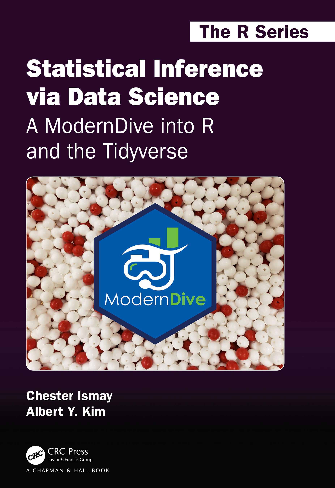

--- 
title: "`r ifelse(knitr::is_latex_output(), 'Statistical Inference via Data Science:  A ModernDive into R and the Tidyverse', 'Statistical Inference via Data Science')`"
subtitle: "A ModernDive into R and the Tidyverse"
author: "`r ifelse(knitr::is_latex_output(), 'Chester Ismay and Albert Y. Kim', 'Chester Ismay 및 Albert Y. Kim <br> 서문: Kelly S. McConville')`"
date: "`r format(Sys.time(), '%Y년 %m월 %d일')`"
site: bookdown::bookdown_site
documentclass: krantz
bibliography: [bib/books.bib, bib/packages.bib, bib/articles.bib]
biblio-style: apalike
fontsize: '12pt, krantz2'
monofont: "Inconsolata" #"Source Code Pro"
monofontoptions: "Scale=0.85"
link-citations: true
colorlinks: true
lot: false
lof: false
always_allow_html: true
github-repo: moderndive/ModernDive_book
twitter-handle: ModernDive
graphics: true
description: "tidyverse 데이터 과학 도구를 사용하여 통계적 추론을 가르치기 위한 오픈 소스이며 완전히 재현 가능한 전자 교재입니다."
cover-image: "images/logos/book_cover.png"
url: 'https\://moderndive.com/'
apple-touch-icon: "images/logos/favicons/apple-touch-icon.png"
favicon: "images/logos/favicons/favicon.ico"
---

```{r, include=FALSE}
source("_common.R")
```


```{r set-options, include=FALSE, purl=FALSE}
# Current version information: Date here should match the date in the YAML above.
# Remove .9000 tag and set date to release date when releasing
version <- "1.1.0"
date <- "2020년 7월 2일"

# Latest release information:
latest_release_version <- "1.1.0"
latest_release_date <- "2020년 7월 2일"

# knitr pkg is needed throughout book
if (!"knitr" %in% installed.packages()) {
  install.packages("knitr", repos = "http://cran.rstudio.com")
}
library(knitr)

# Set output options
if (knitr::is_html_output()) {
  options(width = 80)
}
if (knitr::is_latex_output()) {
  options(width = 75)
}
options(digits = 7, bookdown.clean_book = TRUE, knitr.kable.NA = "NA")
knitr::opts_chunk$set(
  tidy = FALSE,
  out.width = "\\textwidth",
  fig.align = "center",
  comment = NA
)
```

```{r}

# New dplyr warning message when running group_by() %>% summarize() that is not
# addressed in v1 (print edition). 
# See https://github.com/moderndive/ModernDive_book/issues/353
# v2 TODO: Remove this option and fix group_by() section in Ch3
options(dplyr.summarise.inform = FALSE)

# Automatically create a bib database for R packages
write_bib(
  c(
    .packages(), 
    "bookdown", "broom", "dplyr", "dygraphs", "fivethirtyeight", "ggplot2", 
    "ggplot2movies", "infer", "janitor", "kableExtra", "knitr", "moderndive", 
    "nycflights13", "readr", "rmarkdown", "skimr", "tibble", "tidyr", 
    "tidyverse", "webshot"
  ),
  here::here("bib", "packages.bib")
)

# Check that phantomjs is installed to create screenshots of apps
if (is.null(webshot:::find_phantom())) {
  webshot::install_phantomjs()
}

# Add all simulation results here
if (!dir.exists("rds")) {
  dir.create("rds")
}

# Create empty docs folder which will ultimately contain output
# if (!dir.exists("docs")) {
#   dir.create("docs")
# }
# 
# # Make sure all images copy to docs folder
# if (!dir.exists(here::here("docs", "images"))) {
#   dir.create(here::here("docs", "images"))
# }
# file.copy(from = "images", to = "docs", recursive = TRUE)
# 
# # These steps are only needed for generating the moderndive.com page
# # with relevant links. Not needed for PDF generation.
# if (knitr::is_html_output()) {
#   # Add all purl()'ed chapter R scripts here
#   if (dir.exists(here::here("docs", "scripts"))) {
#     unlink(here::here("docs", "scripts"), recursive = TRUE)
#   }
#   if (!dir.exists(here::here("docs", "scripts"))) {
#     dir.create(here::here("docs", "scripts"))
#   }
# }

# Copy _redirects file to docs
#file.copy("_redirects", to = "docs", overwrite = TRUE)
```


```{=html}
<!--
<a href="https://moderndive.com/v2/"></a> 

<div class="border-box">
  <div class="text-image-container">
    <div class="text">
      이 버전은 이 책의 최신 버전이 아닙니다. 2024년 가을에 확정되어 2025년 CRC Press에서 인쇄본으로 출간될 예정인 제2판(<a href="https://moderndive.com/v2/">https://moderndive.com/v2/</a>)을 권장합니다. 제2판의 업데이트 요약은 <a href="https://moderndive.com/v2/preface.html#about-the-book">여기</a>에서 확인하실 수 있습니다.
    </div>
  </div>
</div>
-->
```


```{r results="asis", echo=FALSE, purl=FALSE}
if (knitr::is_html_output()) {
  cat("# ModernDive에 오신 것을 환영합니다 {-}")
}
```

<!-- purl() all the chapter Rmd's in a new session -->
```{bash, include=FALSE, purl=FALSE}
Rscript -e "source('purl.R', local = TRUE)"
```


```{r set-options2, include=FALSE, purl=FALSE}
if (knitr::is_html_output()) {
  file.remove("purl.Rout")
  
  # Copy all needed csv and txt files to docs/
  # if (!dir.exists(here::here("docs", "data"))) {
  #   dir.create(here::here("docs", "data"))
  # }
  # data_files <- c(
  #   "dem_score.csv", "dem_score.xlsx", "le_mess.csv", "ideology.csv",
  #   # For Appendix B
  #   "ageAtMar.csv", "offshore.csv", "cleSac.txt", "zinc_tidy.csv",
  #   # For Appendix C
  #   "movies.csv",
  #   # For moderndive package paper
  #   # https://www.kaggle.com/c/house-prices-advanced-regression-techniques
  #   "train.csv", "test.csv"
  # )
  # from_vec <- here::here("data", data_files)
  # to_vec <- here::here("docs", "data", data_files)
  # purrr::walk2(from_vec, to_vec, file.copy, overwrite = TRUE)
  # 
  # # To be updated to include the actual link to labs website
  # # when Albert has those ready
  # file.copy("labs.html", here::here("docs", "labs.html"), overwrite = TRUE)
  # file.copy("regression-plane.html",
  #           here::here("docs", "regression-plane.html"),
  #           overwrite = TRUE
  # )
  # 
  # # Copy previous_versions/ to docs/previous_versions/
  # if (!dir.exists(here::here("docs", "previous_versions"))) {
  #   dir.create(here::here("docs", "previous_versions"))
  # }
  # file.copy(from = "previous_versions", to = "docs", recursive = TRUE)
  # 
  # # For some reason widelogo in header needs to be done separately.
  # # Loaded in _includes/logo.html
  # # file.copy(here::here("images", "logos", "wide_format.png"),
  # #           here::here("docs", "wide_format.png"),
  # #           overwrite = TRUE
  # # )
}


# Set ggplot2 theme to be light if outputting to PDF
library(ggplot2)
if (knitr::is_latex_output()) {
  theme_set(theme_light())
} else {
  theme_set(theme_grey())
}


# 이 장에서 사용된 모든 R 코드의 R 스크립트 파일은 다음에서 이용 가능합니다.
generate_r_file_link <- function(file) {
  if (knitr::is_latex_output()) {
    cat(glue::glue("이 장에서 사용된 모든 R 코드의 R 스크립트 파일은 <https://www.moderndive.com/scripts/{file}>에서 이용 가능합니다."))
  } else {
    cat(glue::glue("이 장에서 사용된 모든 R 코드의 R 스크립트 파일은 [여기](scripts/{file})에서 이용 가능합니다."))
  }
}

# To get kable tables to print nicely in .tex file
if (knitr::is_latex_output()) {
  options(kableExtra.auto_format = FALSE, knitr.table.format = "latex")
}
```

```{r images, include=FALSE, purl=FALSE}
include_image <- function(path,
                          html_opts = "width=45%",
                          latex_opts = html_opts,
                          alt_text = "") {
  if (knitr::is_html_output()) {
    glue::glue("{{ {html_opts} }}")
  } else if (knitr::is_latex_output()) {
    glue::glue("{{ {latex_opts} }}")
  }
}

image_link <- function(path,
                       link,
                       html_opts = "height: 200px;",
                       latex_opts = "width=0.2\\textwidth",
                       alt_text = "",
                       centering = TRUE) {
  if (knitr::is_html_output()) {
    if (centering) {
      glue::glue(
        '<center><a target="_blank" class="page-link" href="{link}"></a></center>'
      )
    } else {
      glue::glue(
        '<a target="_blank" class="page-link" href="{link}"></a>'
      )
    }
  }
  else if (knitr::is_latex_output()) {
    if (centering) {
      glue::glue("\\begin{{center}}
        \\href{{{link}}}{{\\includegraphics[{latex_opts}]{{{path}}}}}
        \\end{{center}}")
    } else {
      glue::glue("\\href{{{link}}}{{\\includegraphics[{latex_opts}]{{{path}}}}}")
    }
  }
}
```


<!--
```{block, type='announcement', purl=FALSE}
**This is a previous version (v`r version`) of *ModernDive* and may be out of date. For the current version of *ModernDive*, please go to [ModernDive.com](https://moderndive.com/).**
```
-->

<!--
```{block, type='learncheck', include=!knitr::is_latex_output(), purl=FALSE}
**Please note that you are currently looking at a preview of a future version of *ModernDive*, which is currently being edited. For the current version of *ModernDive*, please visit [ModernDive.com](https://moderndive.com/).**
```
-->


```{r, echo=FALSE, include=!knitr::is_latex_output(), purl=FALSE}
dev_version <- FALSE
```

<!-- include=FALSE for PDF sending to CRC -->
```{block, include=knitr::is_html_output(), purl=FALSE}
이곳은 *Statistical Inference via Data Science: A ModernDive into R and the Tidyverse*의 [웹사이트](https://moderndive.com/)입니다! [이 사이트의 GitHub 저장소](https://github.com/moderndive/ModernDive_book)를 방문하거나 [Amazon](https://www.amazon.com/Statistical-Inference-via-Data-Science/dp/0367409828/)에서 책을 찾아보세요. 또한 할인 코드 **ADC26**을 사용하여 [CRC Press](https://www.routledge.com/Statistical-Inference-via-Data-Science-A-ModernDive-into-R-and-the-Tidyverse/Ismay-Kim/p/book/9780367409821?utm_source=author&utm_medium=shared_link&utm_campaign=B043134_jm1_5ll_6rm_t081_1al_statisticalinferenceviadatascienceauthorshare)에서 구매하실 수 있습니다.
```

```{block, include=FALSE, purl=FALSE}
https://moderndive.com/v2/에서 ModernDive 제2판의 출시를 알리게 되어 기쁩니다! *Statistical Inference via Data Science: A ModernDive into R and the Tidyverse (제2판)*은 곧 CRC Press에서 인쇄본으로 출간될 예정입니다! 제2판의 업데이트 요약은 [여기](https://moderndive.com/v2/preface.html#about-the-book)에서 확인하실 수 있습니다.
```

</br>
```{r results="asis", echo=FALSE, purl=FALSE}
if (knitr::is_html_output()) {
  include_image(
    path = "images/logos/book_cover.png",
    html_opts = "width=350px"
  )
}
```
</br>

<a rel="license" href="http://creativecommons.org/licenses/by-nc-sa/4.0/"></a><br />[Chester Ismay](https://chester.rbind.io/)와 [Albert Y. Kim](https://rudeboybert.rbind.io/)의 이 저작물은 <a rel="license" href="http://creativecommons.org/licenses/by-nc-sa/4.0/">크리에이티브 커먼즈 저작자표시-비영리-동일조건변경허락 4.0 국제 라이선스</a>에 따라 이용할 수 있습니다.


<!-- index.Rmd has to have some content in it or it won't create an index.html 
file. Make sure to keep this in so that index.html is included. -->

# ModernDive 

[](https://zenodo.org/badge/latestdoi/66818484) [](https://www.tidyverse.org/lifecycle/#stable) [](https://app.netlify.app/sites/moderndive/deploys) [](https://github.com/moderndive/ModernDive_book/actions/workflows/deploy_bookdown.yml)

[ModernDive.com](https://moderndive.com/)에서 이용 가능한 **Statistical Inference via Data Science: A ModernDive into R and the Tidyverse**의 GitHub 저장소 페이지에 오신 것을 환영합니다. CRC Press 인쇄본은 [웹사이트](https://www.routledge.com/Statistical-Inference-via-Data-Science-A-ModernDive-into-R-and-the-Tidyverse/Ismay-Kim/p/book/9780367409821)에서 구매하실 수 있습니다.




## 이 저장소의 내용

ModernDive는 RStudio의 [`bookdown`](https://www.rstudio.com/resources/webinars/introducing-bookdown/) 패키지를 사용하여 제작되었습니다. `bookdown` 사용법에 대한 자세한 내용은 [bookdown.org](https://bookdown.org/)를 참조하세요. 직접 책을 빌드하고 싶다면 먼저 `install.packages("bookdown")`을 통해 `bookdown` 패키지를 설치해야 합니다.

* 현재 버전의 `bookdown` 소스 코드는 이 저장소의 `master` 브랜치에 있습니다.
* ModernDive의 모든 [이전 릴리스 버전](https://moderndive.com/index.html#about-book)의 `bookdown` 소스 코드는 [Releases](https://github.com/moderndive/moderndive_book/releases) 페이지에서 접근할 수 있습니다. 버전 간의 모든 변경 사항 요약은 [NEWS.md](https://github.com/moderndive/moderndive_book/blob/master/NEWS.md)에서 확인할 수 있습니다.
* [moderndive.com](https://moderndive.com/)의 콘텐츠는 이 저장소의 `gh-pages` 브랜치에서 [Netlify](https://www.netlify.com/)를 통해 배포됩니다.

또한 저희는 ModernDive의 차기 버전도 조금씩 준비하고 있습니다.

* 차기 버전의 `bookdown` 소스 코드는 이 저장소의 `v2` 브랜치에 있습니다.
* 차기 버전의 미리보기는 [moderndive.netlify.app](https://moderndive.netlify.app/)에서 확인하실 수 있습니다.


## 더 많은 정보

* 추가 리소스가 준비되어 있습니다.
    + [`moderndive`](https://moderndive.github.io/moderndive/) R 패키지.
    + 샘플 문제 세트와 텀 프로젝트가 포함된 [교육자용 리소스 페이지](http://moderndive.com/labs).
* Albert([albert.ys.kim@gmail.com](mailto:albert.ys.kim@gmail.com))와 Chester([chester.ismay@gmail.com](mailto:chester.ismay@gmail.com))에게 연락하세요.
* 트위터 계정은 [ModernDive](https://twitter.com/ModernDive)입니다.
* ModernDive에 대한 정기 업데이트(약 3개월마다)를 받고 싶으시면 [메일링 리스트](http://eepurl.com/cBkItf)에 가입해 주세요.
